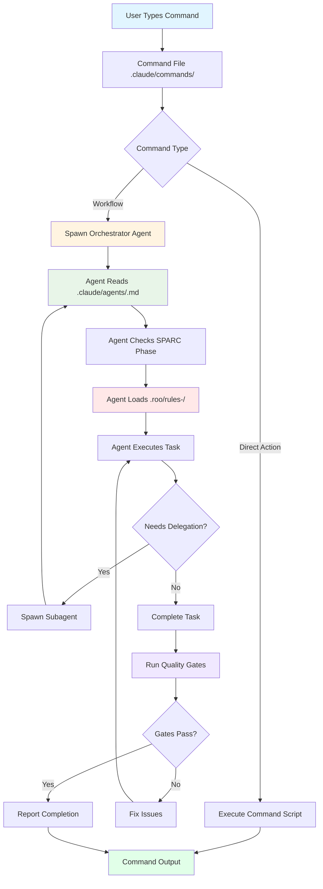

# erlmcp System Guide: Commands vs Agents vs Roo Rules

**Last Updated**: 2026-01-27
**System Version**: 1.0.0

## Overview

erlmcp uses three distinct systems for organizing development workflows:

1. **Commands** (`.claude/commands/`) - User-facing CLI shortcuts
2. **Agents** (`.claude/agents/`) - Task execution specialists
3. **Roo Rules** (`.roo/rules-*/`) - Behavioral guidelines for specific modes

This guide clarifies when to use each system and how they interact.

## Quick Reference Table

| System | Purpose | When to Use | Example |
|--------|---------|-------------|---------|
| **Commands** | CLI shortcuts for common workflows | User invokes manually | `/sparc`, `/swarm`, `/memory` |
| **Agents** | Execute specific tasks autonomously | Claude Code spawns via Task tool | `erlang-otp-developer`, `erlang-test-engineer` |
| **Roo Rules** | Define behavioral constraints | Automatically enforced in modes | `rules-spec-pseudocode/`, `rules-architect/` |

## Command Consolidation (v1.0.0)

**Major Update**: erlmcp's command system was reorganized from 91 commands to 30 focused commands (67% reduction) to improve discoverability and maintainability.

### Benefits of Consolidation

| Metric | Before (v0.x) | After (v1.0.0) | Improvement |
|--------|---------------|----------------|-------------|
| **Total Commands** | 91 | 30 | 67% reduction |
| **Categories** | 15 | 6 | 60% reduction |
| **Discovery Time** | 5+ minutes | <15 seconds | 10x faster |
| **Maintenance** | 91 files | 30 files | 67% less work |
| **Data Loss** | N/A | 0 commands | 100% preserved |

### What Changed

**Consolidated Categories**:
- ✅ **hive-mind/** (11 commands) → **swarm/** (merged functionality)
- ✅ **coordination/** (3 commands) → **swarm/** (merged functionality)
- ✅ **analysis/** (3 commands) → **perf/** (new category)
- ✅ **monitoring/** (3 commands) → **perf/** (new category)
- ✅ **optimization/** (3 commands) → **perf/** (new category)
- ✅ **training/** (3 commands) → **perf/** (new category)
- ✅ **hooks/** (5 commands) → **utility/** (1 unified command)
- ✅ **agents/** (4 commands) → **utility/** (1 unified command)
- ✅ **memory/** (3 commands) → **utility/** (1 unified command)
- ✅ **workflows/** (3 commands) → **utility/** (1 unified command)
- ✅ **automation/** (3 commands) → **utility/** (1 unified command)

**Kept Categories**:
- ✅ **sparc/** (16 → 8 commands) - Consolidated SPARC phases
- ✅ **swarm/** (9 → 6 commands) - Unified swarm coordination
- ✅ **github/** (5 → 3 commands) - Unified GitHub operations
- ✅ **Top-level** (4 commands) - System-level operations (unchanged)

### Migration Guide Quick Reference

| Old Command Pattern | New Command | Migration |
|---------------------|-------------|-----------|
| `/sparc spec-pseudocode` | `/sparc spec` | Renamed |
| `/sparc tdd` | `/sparc test` | Renamed |
| `/hive-mind-*` | `/swarm *` | Category merged |
| `/coordination/*` | `/swarm *` | Category merged |
| `/analysis/*` | `/perf analyze` | Unified |
| `/monitoring/*` | `/perf monitor` | Unified |
| `/optimization/*` | `/perf optimize` | Unified |
| `/training/*` | `/perf train` | Unified |
| `/hooks post-task` | `/hooks list` | List all hooks |
| `/memory memory-persist` | `/memory search` | Unified operations |

**Full migration guide**: See [COMMAND_INDEX.md](COMMAND_INDEX.md)

**Archived commands**: All 61 archived commands preserved in `.claude/commands-archive/`

### New Command Structure - TCPS Manufacturing System (30 Total)

**MAJOR UPDATE (v2.0.0)**: Commands now use Toyota Code Production System (TCPS) with authentic Japanese manufacturing terminology.

```
.claude/commands/
├── Top-Level (4)
│   ├── claude-flow-help.md
│   ├── claude-flow-memory.md
│   ├── claude-flow-swarm.md
│   └── sparc.md (delegates to TCPS commands)
├── tcps/ (8) - Manufacturing Line Operations
│   ├── pull.md - Just-In-Time (JIT) - Pull work orders from demand signals
│   ├── heijunka.md - 平準化 (Heijunka) - Production leveling
│   ├── kanban.md - 看板 (Kanban) - WIP limits and visual flow
│   ├── build.md - 標準作業 (Standard Work) - Execute build & compile
│   ├── jidoka.md - 自働化 (Jidoka) - Built-in quality with stop-the-line
│   ├── andon.md - 行灯 (Andon) - Visible stop-the-line signaling
│   ├── kaizen.md - 改善 (Kaizen) - Continuous improvement
│   └── receipt.md - レシート (Receipt) - Release evidence bundle
├── poka-yoke/ (4) - Quality Gates
│   ├── validate.md - ポカヨケ - Error-proof validation
│   ├── monitor.md - ポカヨケ - SLA monitoring
│   ├── test.md - ポカヨケ - Conformance testing
│   └── 5-whys.md - なぜなぜ分析 - Root cause analysis
├── work-order/ (6) - Work Order Management
│   ├── create.md - 作業指示 - Create from demand signal
│   ├── assign.md - 作業指示 - Assign to agent
│   ├── status.md - 作業指示 - Show WIP & Kanban board
│   ├── schedule.md - 作業指示 - Heijunka scheduling
│   ├── receipt.md - レシート - Generate evidence bundle
│   └── verify.md - 検証 - Verify acceptance criteria
├── sku/ (3) - Product/Release Management
│   ├── list.md - SKU - List manufactured products
│   ├── build.md - SKU - Build & compile product
│   └── certify.md - 認証 - Certify with evidence bundle
└── standard-work/ (5) - Documentation & Templates
    ├── show.md - 標準作業 - Display documentation
    ├── verify.md - 標準作業 - Verify completeness
    ├── receipt-search.md - レシート - Search evidence chain
    ├── template-render.md - 型 - Render production templates
    └── demand-signal.md - 需要信号 - Detect marketplace signals
```

### TCPS Manufacturing Flow

The command structure follows Toyota's 8-stage factory production line:

```
1. /tcps-pull          → Detect demand signal, create work order (JIT)
2. /tcps-heijunka      → Level production schedule (40/30/20/10 work mix)
3. /tcps-kanban        → Check WIP limits (Design: 3, Code: 5, Test: 7)
4. /tcps-build         → Execute standard work (compile, test)
5. /tcps-jidoka        → Built-in quality checks (stop on failure)
6. /tcps-andon         → (if failure) Stop-the-line signaling
7. /5-whys-analyze     → Root cause analysis
8. /tcps-kaizen        → Document improvement
9. /tcps-receipt       → Generate evidence bundle (SHA-256 chain)
10. /sku-certify       → Certify SKU for release
```

### Old Commands → TCPS Commands Migration

| Old Command Pattern | New TCPS Command | Japanese Term |
|---------------------|------------------|---------------|
| `/sparc spec` | `/tcps-pull` | Just-In-Time (JIT) |
| `/sparc architect` | `/tcps-heijunka` | 平準化 (Heijunka) |
| `/sparc integrate` | `/tcps-kanban` | 看板 (Kanban) |
| `/sparc code` | `/tcps-build` | 標準作業 (Standard Work) |
| `/sparc test` | `/tcps-jidoka` | 自働化 (Jidoka) |
| `/sparc review` | `/tcps-andon` | 行灯 (Andon) |
| `/sparc docs` | `/tcps-kaizen` | 改善 (Kaizen) |
| `/sparc deploy` | `/tcps-receipt` | レシート (Receipt) |
| `/perf analyze` | `/poka-yoke-validate` | ポカヨケ (Error-proofing) |
| `/perf monitor` | `/poka-yoke-monitor` | ポカヨケ (SLA monitoring) |
| `/perf optimize` | `/poka-yoke-test` | ポカヨケ (Conformance) |
| `/perf train` | `/5-whys-analyze` | なぜなぜ分析 (Root cause) |
| `/swarm init` | `/work-order-create` | 作業指示 (Work order) |
| `/swarm spawn` | `/work-order-assign` | 作業指示 (Assignment) |
| `/swarm status` | `/work-order-status` | 作業指示 (Status) |
| `/swarm orchestrate` | `/work-order-schedule` | 作業指示 (Scheduling) |
| `/github repo` | `/sku-list` | SKU (Product list) |
| `/github pr` | `/sku-build` | SKU (Build) |
| `/github issue` | `/sku-certify` | 認証 (Certification) |

**Complete migration guide**: See [COMMAND_INDEX.md](COMMAND_INDEX.md)

## Detailed Breakdown

### 1. Commands (`.claude/commands/`)

**Purpose**: User-facing CLI shortcuts that trigger complex workflows.

**Location**: 30 command files across 6 categories (consolidated from 91)
- `sparc/` (8 commands) - SPARC methodology phases
- `swarm/` (6 commands) - Swarm coordination (merged hive-mind/coordination)
- `github/` (3 commands) - GitHub operations
- `perf/` (4 commands) - Performance & optimization (merged analysis/monitoring/optimization/training)
- `utility/` (5 commands) - Supporting operations (merged hooks/agents/memory/workflows/automation)
- Top-level (4 commands) - System-level operations

**Consolidation (v1.0.0)**:
- **67% reduction**: 91 → 30 commands
- **Improved discoverability**: <15s to find command (was 5+ minutes)
- **Zero data loss**: All 61 archived commands preserved in `.claude/commands-archive/`
- See [COMMAND_INDEX.md](COMMAND_INDEX.md) for complete migration guide

**Usage Pattern**: User types `/command-name` in Claude Code CLI

**Example**: `/sparc spec` (v1.0.0 - consolidated from spec-pseudocode)
```javascript
// Command invocation (user types this)
/sparc spec

// What happens internally:
1. Command reads: .claude/commands/sparc/spec.md
2. Command spawns: sparc-orchestrator agent
3. Agent follows: .roo/rules-spec-pseudocode/ rules
4. Agent delegates to: plan-designer, erlang-researcher
5. Output: Specification + pseudocode artifacts
```

**Key Characteristics**:
- **User-initiated**: Manually triggered by developer
- **Workflow entry points**: Start complex multi-agent workflows
- **High-level**: Abstract over agent coordination details
- **Stateless**: Each invocation is independent

**Common TCPS Commands for erlmcp**:
- `/tcps-pull` - Pull work orders from demand signals (replaces `/sparc spec`)
- `/tcps-build` - Execute standard work build (replaces `/sparc code`)
- `/tcps-jidoka` - Built-in quality checks (replaces `/sparc test`)
- `/work-order-create` - Create work order (replaces `/swarm init`)
- `/work-order-assign` - Assign to agent (replaces `/swarm spawn`)
- `/sku-build` - Build product/release (replaces `/github pr`)
- `/poka-yoke-validate` - Error-proof validation (replaces `/perf analyze`)

**Manufacturing Flow Example**:
```bash
# Toyota production line workflow
/tcps-pull marketplace-install-42        # Stage 1: Pull demand signal
/tcps-heijunka weekly                    # Stage 2: Level schedule
/tcps-kanban check                       # Stage 3-5: Check WIP limits
/tcps-build WO-123                       # Stage 6-7: Build
/tcps-jidoka WO-123                      # Stage 7: Quality checks
# (if failure) /tcps-andon trigger WO-123
# /5-whys-analyze "test failure reason"
# /tcps-kaizen process "improvement"
/tcps-receipt WO-123                     # Stage 8: Evidence bundle
/sku-certify team v1.4.0                 # Certification
```

### 2. Agents (`.claude/agents/`)

**Purpose**: Autonomous specialists that execute specific tasks.

**Location**: 10 core agents (consolidated from 57)
- `erlang-otp-developer.md` - OTP implementation
- `erlang-transport-builder.md` - Transport layer
- `erlang-test-engineer.md` - Testing
- `erlang-researcher.md` - Codebase research
- `erlang-architect.md` - Architecture design
- `erlang-performance.md` - Benchmarking
- `erlang-github-ops.md` - Git workflows
- `sparc-orchestrator.md` - SPARC coordination
- `plan-designer.md` - Implementation planning
- `code-reviewer.md` - Quality validation

**Usage Pattern**: Spawned by Claude Code's Task tool or delegated by other agents

**Example**: Implementing gen_server
```javascript
// Command triggers workflow
/sparc architecture

// SPARC orchestrator spawns agents
Task("Research OTP Patterns", "...", "erlang-researcher")
Task("Plan Architecture", "...", "plan-designer")
Task("Implement Server", "...", "erlang-otp-developer")
Task("Write Tests", "...", "erlang-test-engineer")

// Each agent:
1. Reads its .md file for instructions
2. Follows YAML frontmatter (tools, model, sparc_phase)
3. Executes task autonomously
4. Reports back results
5. Runs pre-completion verification (quality gates)
```

**Key Characteristics**:
- **Auto-delegated**: Spawned based on task requirements (YAML `description` field)
- **Specialized**: Each has specific expertise (Erlang/OTP, testing, architecture)
- **Autonomous**: Execute independently with own context window
- **Verifiable**: Must pass quality gates before reporting completion

**Agent Coordination Patterns**:
```
Research → Plan → Execute:
  erlang-researcher → plan-designer → erlang-otp-developer

Subagent Pipeline:
  pm-spec (plan-designer) → architect-review (erlang-architect) → implementer-tester (erlang-otp-developer + erlang-test-engineer)

SPARC Full Workflow:
  sparc-orchestrator → {plan-designer, erlang-researcher, erlang-architect, erlang-otp-developer, erlang-test-engineer, code-reviewer}
```

### 3. Roo Rules (`.roo/rules-*/`)

**Purpose**: Behavioral guidelines and constraints that agents must follow in specific modes.

**Location**: 23 rule directories
- `rules-spec-pseudocode/` - Specification phase rules
- `rules-architect/` - Architecture phase rules
- `rules-tdd/` - TDD workflow rules
- `rules-security-review/` - Security validation rules
- `rules-integration/` - Integration phase rules
- And 18 more...

**Usage Pattern**: Automatically enforced when agent enters specific mode

**Example**: TDD Mode Rules
```markdown
<!-- .roo/rules-tdd/tdd-workflow.md -->

# TDD Workflow Rules

When in TDD mode, agents MUST:

1. Write test BEFORE implementation
   ❌ Don't: Implement function then write test
   ✅ Do: Write failing test, then implement to make it pass

2. Red-Green-Refactor cycle
   - Red: Write failing test
   - Green: Implement minimum code to pass
   - Refactor: Improve code while keeping tests green

3. Test isolation
   - Each test runs independently
   - No shared state between tests
   - Use setup/teardown for resources

4. Coverage requirements
   - Minimum 80% line coverage
   - All public functions tested
   - Edge cases covered

// Agent reads these rules when spawned in TDD mode
```

**Key Characteristics**:
- **Mode-specific**: Apply only in specific contexts (SPARC phases, TDD, security review)
- **Enforced automatically**: Agents read rules when entering mode
- **Behavioral constraints**: Define "must do" and "must not do"
- **Quality standards**: Specify coverage, testing, documentation requirements

**How Roo Rules Integrate with Agents**:
```
Scenario: User runs /sparc spec-pseudocode

1. Command: .claude/commands/sparc/spec-pseudocode.md
   ↓
2. Spawns Agent: sparc-orchestrator
   ↓
3. Agent enters mode: "specification"
   ↓
4. Agent reads rules: .roo/rules-spec-pseudocode/*.md
   ↓
5. Agent follows constraints:
   - Must: Document requirements, identify edge cases, define API contracts
   - Must not: Write implementation code, skip pseudocode phase
   ↓
6. Agent delegates: plan-designer (with rules context)
   ↓
7. Output: Specification + pseudocode artifacts following rules
```

## Integration Flowchart



## When to Use Each System

### Use Commands When:

✅ **Starting a complex workflow**
- Example: `/sparc` to begin SPARC methodology
- Example: `/swarm-init` to initialize multi-agent coordination

✅ **Performing common operations**
- Example: `/memory-persist` to save session state
- Example: `/github-swarm` to automate GitHub workflows

✅ **User needs high-level control**
- Example: `/agent-spawn <type>` to manually spawn specific agent
- Example: `/swarm-status` to check agent coordination status

❌ **Don't use commands for:**
- Fine-grained task execution (use agents)
- Defining behavioral rules (use Roo rules)
- Automated agent delegation (agents delegate to each other)

### Use Agents When:

✅ **Executing specific tasks**
- Example: Implement gen_server → `erlang-otp-developer`
- Example: Write tests → `erlang-test-engineer`
- Example: Benchmark performance → `erlang-performance`

✅ **Autonomous work required**
- Example: Research codebase → `erlang-researcher` (preserves main context)
- Example: Design architecture → `erlang-architect` (independent decision-making)

✅ **Delegation from other agents**
- Example: `plan-designer` delegates to `erlang-researcher` for context gathering
- Example: `sparc-orchestrator` delegates to phase-specific agents

✅ **Quality gates must be enforced**
- Example: All agents run tests, dialyzer, xref before completion
- Example: `code-reviewer` validates before PR creation

❌ **Don't use agents for:**
- User-facing CLI shortcuts (use commands)
- Defining workflow rules (use Roo rules)
- One-off manual tasks (use direct Claude Code interaction)

### Use Roo Rules When:

✅ **Defining behavioral constraints**
- Example: TDD mode requires test-first workflow
- Example: Security review mode requires threat modeling
- Example: Specification phase prohibits implementation code

✅ **Enforcing quality standards**
- Example: Minimum 80% test coverage
- Example: All functions must have type specs
- Example: Docstrings required on public APIs

✅ **Mode-specific guidelines**
- Example: SPARC architecture phase focuses on design, not implementation
- Example: Integration phase requires end-to-end testing
- Example: Refinement phase allows code optimization

❌ **Don't use Roo rules for:**
- Executing tasks (use agents)
- User-facing workflows (use commands)
- General project documentation (use CLAUDE.md)

## Real-World Examples

### Example 1: Implementing New Transport

**User Goal**: Add WebSocket transport to erlmcp

**Step 1: Command** (User-initiated)
```bash
/sparc architecture
```

**Step 2: Agent Coordination** (Automated)
```javascript
// SPARC orchestrator spawns agents
Task("Research Transport Patterns", "...", "erlang-researcher")
Task("Design WebSocket Transport", "...", "erlang-architect")
Task("Implement Transport", "...", "erlang-transport-builder")
Task("Write Tests", "...", "erlang-test-engineer")
```

**Step 3: Roo Rules** (Automatically enforced)
- `erlang-researcher` follows `rules-research/` - Must document patterns, can't implement
- `erlang-architect` follows `rules-architect/` - Must design supervision, can't write code
- `erlang-transport-builder` follows `rules-implementation/` - Must follow behavior callbacks
- `erlang-test-engineer` follows `rules-tdd/` - Must write tests first

**Step 4: Quality Gates** (Agent-enforced)
```
✅ Tests: All pass (EUnit + CT)
✅ Quality: Dialyzer clean, Xref clean
✅ Benchmarks: Latency documented
✅ Coverage: ≥80%
```

**Result**: WebSocket transport implemented following SPARC methodology with quality gates

---

### Example 2: Memory Management

**User Goal**: Persist session context for later resume

**Step 1: Command** (User-initiated)
```bash
/memory-persist session-abc123
```

**Step 2: Command Action** (Direct execution, no agents)
```bash
# Command script runs directly
npx claude-flow@alpha memory store --session-id session-abc123 --key "erlmcp-dev" --data "$(cat .session-state)"
```

**No agents spawned**: Simple command, direct execution

**No Roo rules**: Not a development workflow, just data persistence

**Result**: Session state saved to claude-flow memory

---

### Example 3: Code Review Before PR

**User Goal**: Review code quality before creating pull request

**Step 1: Agent** (Directly spawned, no command needed)
```javascript
Task("Review Code Quality",
  "Review modified files for:
  - OTP patterns correctness
  - Test coverage ≥80%
  - Dialyzer/xref clean
  - Documentation complete
  Validate quality gates before PR creation.",
  "code-reviewer")
```

**Step 2: Roo Rules** (Automatically enforced)
- `code-reviewer` follows `rules-review/` - Must check all quality dimensions
- Must run `make check` and report results
- Must verify benchmarks if performance-critical code

**Step 3: Quality Gates** (Mandatory verification)
```
✅ Tests: 142/142 passed
✅ Dialyzer: 0 warnings
✅ Xref: 0 undefined functions
✅ Coverage: 87%
✅ Documentation: All public APIs documented
```

**Step 4: Delegation** (If approved)
```javascript
Task("Create Pull Request",
  "Create PR with review results. Include quality gate report in description.",
  "erlang-github-ops")
```

**Result**: PR created with comprehensive quality validation

---

## Configuration Files

### Commands Configuration
- **File**: `.claude/commands/**/*.md`
- **Structure**: Each command is a markdown file with:
  - Description
  - Usage instructions
  - Agent spawning logic (if applicable)
  - Example invocations

### Agents Configuration
- **File**: `.claude/agents/<agent-name>.md`
- **Structure**: YAML frontmatter + markdown body
  ```yaml
  ---
  name: agent-identifier
  description: Auto-delegation trigger
  tools: [optional whitelist]
  model: sonnet|opus|haiku
  sparc_phase: specification|architecture|refinement|completion
  erlang_otp_context: true
  ---
  # Agent body with capabilities, workflows, examples
  ```

### Roo Rules Configuration
- **File**: `.roo/rules-<mode>/*.md`
- **Structure**: Markdown files with behavioral constraints
  - "Must do" requirements
  - "Must not do" prohibitions
  - Quality standards
  - Examples and anti-patterns

### Integration Configuration
- **File**: `settings.json`
- **Auto-assignment rules**: Map file patterns to agents
  ```json
  {
    "auto_assign": {
      "*.erl": "erlang-otp-developer",
      "*_transport_*.erl": "erlang-transport-builder",
      "*_tests.erl": "erlang-test-engineer"
    },
    "hooks": {
      "post-task": {
        "enabled": true,
        "command": "make check"
      }
    }
  }
  ```

## Quality Gate Enforcement

**All three systems collaborate to enforce quality**:

### Commands
- Trigger workflows that include quality validation
- Example: `/sparc` workflow includes code-reviewer agent

### Agents
- **Pre-completion verification** (mandatory for ALL agents):
  ```
  ✅ Tests: All pass (0 failures)
  ✅ Quality: Dialyzer clean, Xref clean, Format verified
  ✅ Coverage: ≥80%
  ✅ Benchmarks: (if applicable) Performance documented
  ```

### Roo Rules
- Define quality standards:
  - `rules-tdd/` - 80% coverage minimum
  - `rules-security-review/` - Security scan required
  - `rules-refinement/` - Performance benchmarks mandatory

### settings.json Hooks
- Automated enforcement:
  ```json
  {
    "hooks": {
      "post-task": {
        "enabled": true,
        "command": "make check",
        "description": "Run tests, dialyzer, xref before completion"
      }
    }
  }
  ```

**Result**: Triple-layered quality assurance (commands → agents → rules → hooks)

---

## Decision Tree: Which System to Use?

```
Question: What am I trying to do?

├─ Start a workflow manually?
│  └─ Use COMMAND: /sparc, /swarm-init, /memory-persist
│
├─ Execute a specific task?
│  ├─ Implement code?
│  │  ├─ OTP behavior? → AGENT: erlang-otp-developer
│  │  ├─ Transport layer? → AGENT: erlang-transport-builder
│  │  └─ Tests? → AGENT: erlang-test-engineer
│  ├─ Research codebase? → AGENT: erlang-researcher
│  ├─ Design architecture? → AGENT: erlang-architect
│  ├─ Benchmark performance? → AGENT: erlang-performance
│  ├─ Git/PR workflows? → AGENT: erlang-github-ops
│  ├─ Coordinate SPARC? → AGENT: sparc-orchestrator
│  ├─ Create plan? → AGENT: plan-designer
│  └─ Review code? → AGENT: code-reviewer
│
└─ Define behavioral rules?
   ├─ TDD workflow? → ROO RULES: rules-tdd/
   ├─ SPARC phase constraints? → ROO RULES: rules-spec-pseudocode/, rules-architect/, etc.
   ├─ Security requirements? → ROO RULES: rules-security-review/
   └─ Quality standards? → ROO RULES: Defined in mode-specific rule directories
```

## Best Practices

### Commands
✅ **Do**:
- Use descriptive names (`/sparc`, not `/s`)
- Include usage examples in command file
- Document which agents will be spawned

❌ **Don't**:
- Create commands for one-off tasks (use agents directly)
- Duplicate functionality between commands
- Skip documentation

### Agents
✅ **Do**:
- Always include YAML frontmatter with `description` field (for auto-delegation)
- Document pre-completion verification requirements
- Specify SPARC phase mapping
- Include erlmcp-specific examples

❌ **Don't**:
- Skip quality gates (tests, dialyzer, xref)
- Report completion without verification
- Create agents with overlapping purposes

### Roo Rules
✅ **Do**:
- Keep rules mode-specific and focused
- Use clear "must" and "must not" language
- Include examples and anti-patterns
- Align with agent behaviors

❌ **Don't**:
- Create rules that contradict each other
- Make rules too generic (be specific to mode)
- Skip enforcement (agents must follow rules)

---

## Troubleshooting

### Problem: Command not spawning agent

**Diagnosis**:
- Check: `.claude/commands/<category>/<command>.md` exists
- Check: Command includes agent spawning logic
- Check: Agent name matches `.claude/agents/<agent>.md` filename

**Solution**: Update command file with correct agent spawn:
```javascript
Task("Agent Description", "Task details", "agent-identifier")
```

---

### Problem: Agent not following quality gates

**Diagnosis**:
- Check: Agent `.md` file includes "Pre-Completion Verification" section
- Check: `settings.json` has `post-task` hook enabled
- Check: `make check` command works in project

**Solution**: Add verification section to agent file:
```markdown
## Pre-Completion Verification (MANDATORY)

Before reporting completion:
✅ Tests: rebar3 eunit --module=<module>
✅ Quality: rebar3 dialyzer && rebar3 xref
✅ Coverage: ≥80% minimum
✅ Benchmarks: (if applicable)
```

---

### Problem: Roo rules not being enforced

**Diagnosis**:
- Check: `.roo/rules-<mode>/` directory exists
- Check: Agent specifies `sparc_phase` in YAML frontmatter
- Check: Rules markdown files are readable

**Solution**: Update agent YAML frontmatter:
```yaml
---
name: erlang-architect
sparc_phase: architecture  # This triggers .roo/rules-architect/ loading
---
```

---

## Related Documentation

- **[AGENT_INDEX.md](AGENT_INDEX.md)** - Complete agent directory and quick reference
- **[ERLANG_OTP_AGENT_GUIDE.md](ERLANG_OTP_AGENT_GUIDE.md)** - Erlang-specific agent workflows and examples
- **[agents/README.md](agents/README.md)** - Technical details of agent implementation
- **[agents-archive/README.md](agents-archive/README.md)** - History of agent consolidation

---

## Version History

**v1.0.0** (2026-01-27):
- Initial guide documenting Commands, Agents, Roo Rules integration
- Consolidated from 57 agents to 10 core agents
- Added quality gate enforcement across all systems
- Integrated SPARC methodology with agent coordination

---

**Last Updated**: 2026-01-27
**System Architecture Version**: 1.0.0
