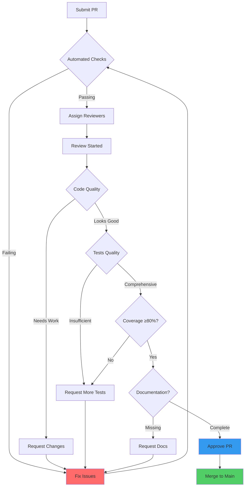
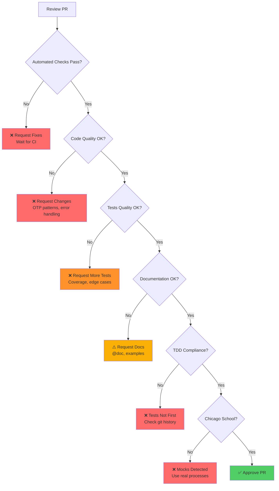
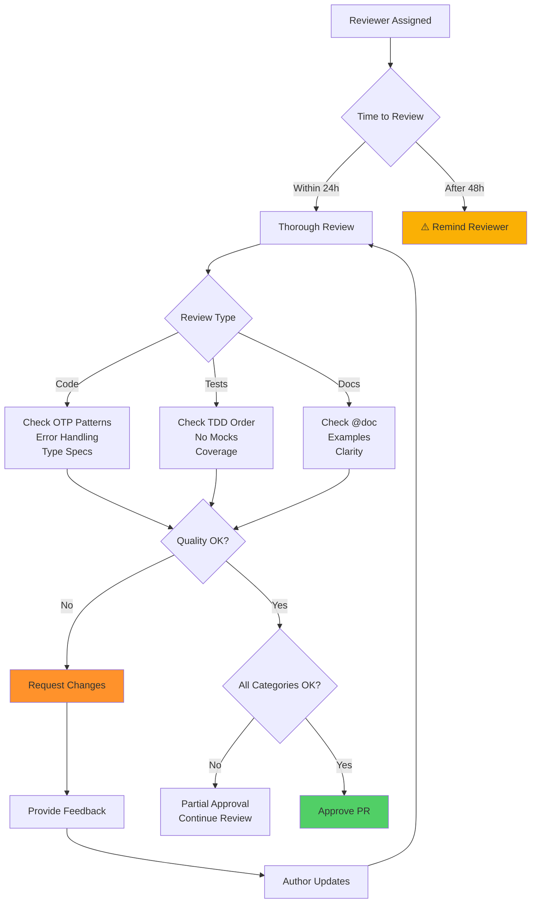

# Contributing to erlmcp

**Estimated read time: 15 minutes**

We welcome contributions! This guide explains how to contribute code, documentation, and feedback to the erlmcp project.

---

## DOCKER-ONLY CONSTITUTION

**CRITICAL: All execution MUST use Docker. Host execution is FORBIDDEN.**

This is not optional. Any attempt to run `rebar3`, `erl`, `ct_run`, `make`, `dialyzer`, or other build tools directly on your host will trigger an ANDON stop and your work will be invalid.

### Why Docker-Only?

- **Reproducibility**: Identical environment for all contributors
- **Proof**: Every command generates a verifiable receipt (git SHA, image digest, exit code)
- **Quality**: Enforced gates prevent broken code from merging
- **Zero drift**: No "works on my machine" problems

### Allowed Execution Forms

```bash
# ✅ CORRECT - All work through Docker Compose
docker compose run --rm erlmcp-build make compile
docker compose run --rm erlmcp-unit make eunit
docker compose run --rm erlmcp-ct make ct
docker compose run --rm erlmcp-check make check

# ❌ FORBIDDEN - Direct host execution
make compile         # ANDON STOP!
rebar3 compile       # ANDON STOP!
rebar3 eunit         # ANDON STOP!
```

### Quality Gate Mapping

Each development task maps to a specific Docker service (quality lane):

| Task | Docker Service | Purpose | Command |
|------|---------------|---------|---------|
| **Compile** | `erlmcp-build` | Build all applications | `docker compose run --rm erlmcp-build make compile` |
| **Unit Tests** | `erlmcp-unit` | Run EUnit tests | `docker compose run --rm erlmcp-unit make eunit` |
| **Integration Tests** | `erlmcp-ct` | Run Common Test suites | `docker compose run --rm erlmcp-ct make ct` |
| **Quality Analysis** | `erlmcp-check` | Dialyzer, xref, coverage | `docker compose run --rm erlmcp-check make check` |
| **Benchmarks** | `erlmcp-bench` | Performance tests | `docker compose run --rm erlmcp-bench make benchmark` |
| **Cluster Tests** | `erlmcp-node` | Distributed Erlang tests | `docker compose run --rm erlmcp-node make test-cluster` |

### Quality Invariants (Required for PR Merge)

All PRs **MUST** satisfy these invariants:

- **Errors**: 0 (zero compilation errors)
- **Failures**: 0 (zero test failures)
- **Coverage**: ≥ 80% (line coverage across all modules)
- **Regression**: < 10% (performance regression threshold)
- **Chicago TDD**: No mocks, real processes only
- **Docker-only**: All commands executed via Docker Compose

---

## Code of Conduct

- Be respectful and inclusive
- Focus on the code, not the person
- Help others learn and grow
- Report issues privately to maintainers

## Getting Started

### Prerequisites

1. **Docker Desktop** (or Docker Engine + Docker Compose v2)
   - macOS: [Install Docker Desktop](https://docs.docker.com/desktop/install/mac-install/)
   - Linux: [Install Docker Engine](https://docs.docker.com/engine/install/)
   - Windows: [Install Docker Desktop](https://docs.docker.com/desktop/install/windows-install/)

2. **Git** (for version control)

3. **Text editor/IDE** (VS Code, IntelliJ, Emacs, Vim, etc.)

### Environment Setup (Docker-Only)

```bash
# 1. Clone the repository
git clone https://github.com/your-org/erlmcp.git
cd erlmcp

# 2. Verify Docker is running
docker --version
docker compose version

# 3. Build the development images
docker compose build erlmcp-build erlmcp-unit erlmcp-ct erlmcp-check

# 4. Run first compilation (downloads dependencies)
docker compose run --rm erlmcp-build make compile

# 5. Run tests to verify setup
docker compose run --rm erlmcp-unit make eunit
docker compose run --rm erlmcp-ct make ct

# 6. Run quality checks
docker compose run --rm erlmcp-check make check

# Success! You're ready to contribute.
```

### Additional Reading

1. **Architecture**: Review [ARCHITECTURE_OVERVIEW.md](docs/ARCHITECTURE_OVERVIEW.md)
2. **Code Standards**: [CLAUDE.md](CLAUDE.md) - Mandatory development patterns
3. **Getting Started**: [GETTING_STARTED.md](docs/GETTING_STARTED.md)
4. **Examples**: [examples/README.md](examples/README.md)

## Development Standards (Required Reading)

Before writing any code, understand these mandatory standards:

### 1. Chicago School TDD (Test-Driven Development)

**Tests MUST be written FIRST, before implementation.**

- Write a failing test that describes the desired behavior
- Implement the minimum code to make the test pass
- Refactor while keeping tests green
- **NO MOCKS**: Use real processes, real supervision trees, real message passing
- **Black-box testing**: Test behavior, not implementation details

```erlang
% ❌ BAD - Mock/stub (forbidden)
mock_server() ->
    meck:new(my_server),
    meck:expect(my_server, call, fun(_) -> ok end).

% ✅ GOOD - Real process (required)
real_server_test() ->
    {ok, Pid} = my_server:start_link(),
    ?assertEqual(ok, my_server:call(Pid, request)),
    ok = gen_server:stop(Pid).
```

### 2. OTP Design Patterns (Mandatory)

All code **MUST** follow OTP patterns:

- **gen_server**: For stateful processes with synchronous/asynchronous calls
- **supervisor**: For fault tolerance and process management
- **gen_statem**: For state machines with complex state transitions
- **application**: For packaging and lifecycle management
- **Let-it-crash**: Don't defensively code, let supervisors handle failures

```erlang
% ✅ GOOD - Proper supervision
-module(my_app_sup).
-behaviour(supervisor).

init([]) ->
    SupFlags = #{
        strategy => one_for_one,
        intensity => 5,
        period => 10
    },
    ChildSpecs = [
        #{
            id => my_server,
            start => {my_server, start_link, []},
            restart => permanent,
            shutdown => 5000,
            type => worker
        }
    ],
    {ok, {SupFlags, ChildSpecs}}.
```

### 3. Docker-Only Development

**Every command runs in Docker. No exceptions.**

| Task | Service | Command |
|------|---------|---------|
| Compile code | `erlmcp-build` | `docker compose run --rm erlmcp-build make compile` |
| Run unit tests | `erlmcp-unit` | `docker compose run --rm erlmcp-unit make eunit` |
| Run integration tests | `erlmcp-ct` | `docker compose run --rm erlmcp-ct make ct` |
| Type checking | `erlmcp-check` | `docker compose run --rm erlmcp-check make dialyzer` |
| Coverage report | `erlmcp-check` | `docker compose run --rm erlmcp-check make coverage` |
| Static analysis | `erlmcp-check` | `docker compose run --rm erlmcp-check make xref` |
| Full validation | `erlmcp-check` | `docker compose run --rm erlmcp-check make check` |

## Making Changes (TDD Workflow)

### 1. Create an Issue (Optional but Recommended)

Before starting significant work:

```
Title: Brief description of feature or bug

Description:
- What problem does this solve?
- Why is it needed?
- Any design considerations?
- Expected behavior vs. actual behavior (for bugs)

Labels: [bug|enhancement|documentation|performance]
```

### 2. Create a Feature Branch

```bash
# Create branch from main
git checkout main
git pull origin main
git checkout -b feature/my-feature

# OR for bug fixes
git checkout -b fix/issue-123

# OR for documentation
git checkout -b docs/improve-guide
```

### 3. Write Tests FIRST (TDD - Required)

**This is mandatory. Implementation before tests violates TDD and will be rejected.**

```erlang
% test/my_feature_tests.erl
-module(my_feature_tests).
-include_lib("eunit/include/eunit.hrl").

%% Test that will initially FAIL (RED phase)
my_function_returns_ok_test() ->
    % Given: some input
    Input = <<"test_input">>,

    % When: calling the function
    Result = my_feature:my_function(Input),

    % Then: expect success
    ?assertEqual({ok, <<"processed_test_input">>}, Result).

%% Test error path
my_function_handles_invalid_input_test() ->
    % Given: invalid input
    Input = invalid_atom,

    % When: calling the function
    Result = my_feature:my_function(Input),

    % Then: expect error
    ?assertEqual({error, invalid_input}, Result).
```

**Run the test (it MUST fail initially):**

```bash
# Run EUnit tests in Docker
docker compose run --rm erlmcp-unit make eunit

# Expected output: Test FAILED (RED phase - this is correct!)
```

### 4. Implement Feature (GREEN phase)

Now implement the minimum code to make tests pass:

```erlang
% src/my_feature.erl
-module(my_feature).
-export([my_function/1]).

%% @doc Process input and return result.
%% This function validates input and performs processing.
-spec my_function(binary() | atom()) -> {ok, binary()} | {error, atom()}.
my_function(Input) when is_binary(Input) ->
    {ok, <<"processed_", Input/binary>>};
my_function(_Input) ->
    {error, invalid_input}.
```

**Run the test again (should PASS):**

```bash
# Compile and run tests
docker compose run --rm erlmcp-build make compile
docker compose run --rm erlmcp-unit make eunit

# Expected output: Test PASSED (GREEN phase - success!)
```

### 5. Refactor (REFACTOR phase)

Improve code quality while keeping tests green:

```erlang
% src/my_feature.erl - Refactored version
-module(my_feature).
-export([my_function/1]).

-spec my_function(binary() | atom()) -> {ok, binary()} | {error, atom()}.
my_function(Input) when is_binary(Input) ->
    process_binary(Input);
my_function(_Input) ->
    {error, invalid_input}.

%% Internal functions for better organization
-spec process_binary(binary()) -> {ok, binary()}.
process_binary(Input) ->
    Processed = <<"processed_", Input/binary>>,
    {ok, Processed}.
```

**Verify refactoring didn't break tests:**

```bash
docker compose run --rm erlmcp-unit make eunit
```

### 6. Run Full Quality Gates

Before submitting PR, **ALL** quality gates must pass:

```bash
# Gate 1: Compilation
docker compose run --rm erlmcp-build make compile
# Expected: 0 errors, 0 warnings

# Gate 2: Unit tests
docker compose run --rm erlmcp-unit make eunit
# Expected: All tests pass

# Gate 3: Integration tests
docker compose run --rm erlmcp-ct make ct
# Expected: All suites pass

# Gate 4: Quality analysis (dialyzer + xref + coverage)
docker compose run --rm erlmcp-check make check
# Expected: No type errors, no undefined calls, coverage ≥ 80%

# Quick check all gates (recommended)
docker compose run --rm erlmcp-check make validate
```

**Quality Gate Pass Criteria:**

- ✅ **Compile**: 0 errors, 0 warnings
- ✅ **EUnit**: All tests pass, 0 failures
- ✅ **Common Test**: All suites pass, 0 failures
- ✅ **Coverage**: ≥ 80% line coverage
- ✅ **Dialyzer**: 0 type errors
- ✅ **Xref**: 0 undefined function calls
- ✅ **No mocks**: Only real processes in tests

All checks **MUST** pass. No exceptions. No partials.

### 7. Update Documentation

Documentation is **mandatory** for all public functions and significant changes:

```erlang
%% @doc Process input and return result.
%% This function validates the input and performs processing.
%% Input must be a binary or it will return an error.
%%
%% @param Input The binary to process, or atom for error case
%% @return {ok, ProcessedBinary} on success, {error, Reason} on failure
%%
%% @example
%% > my_feature:my_function(<<"test">>).
%% {ok, <<"processed_test">>}
%%
%% > my_feature:my_function(invalid).
%% {error, invalid_input}
-spec my_function(binary() | atom()) -> {ok, binary()} | {error, atom()}.
my_function(Input) when is_binary(Input) ->
    process_binary(Input);
my_function(_Input) ->
    {error, invalid_input}.
```

**Update relevant documentation files:**
- Code comments for complex logic (why, not what)
- API reference if you changed public APIs
- Architecture docs if you changed system design
- README if you added new features

### 8. Commit Changes

```bash
# Stage specific files (preferred over git add .)
git add src/my_feature.erl test/my_feature_tests.erl

# Commit with conventional format
git commit -m "feat(core): add my_feature for processing inputs

- Implement my_function/1 with input validation
- Add comprehensive EUnit tests covering success and error paths
- Achieve 100% coverage on new module
- Follow Chicago School TDD (no mocks, real processes)

Fixes #123"
```

**Commit Message Format (Conventional Commits):**

```
type(scope): short description (max 72 chars)

[Optional longer description explaining WHY, not WHAT]
[Bullet points for significant changes]
[References to issues]

type: feat|fix|docs|test|refactor|perf|ci|build|chore
scope: core|transport|protocol|observability|build|etc
```

**Examples:**
- `feat(transport): add WebSocket transport support`
- `fix(protocol): handle invalid JSON-RPC requests gracefully`
- `docs(contributing): add Docker-only workflow examples`
- `test(core): add property-based tests for state machine`
- `refactor(server): extract connection handling into separate module`

### 9. Create Pull Request

**Before opening PR, verify Docker-only execution:**

```bash
# Final validation - ALL gates must pass
docker compose run --rm erlmcp-build make compile
docker compose run --rm erlmcp-unit make eunit
docker compose run --rm erlmcp-ct make ct
docker compose run --rm erlmcp-check make check

# Push your branch
git push origin feature/my-feature
```

**Open PR on GitHub with this template:**

```markdown
## Description

Fixes #123: Add my_feature for processing binary inputs

This PR implements a new feature that processes binary inputs with validation.
The implementation follows Chicago School TDD with no mocks, using only real processes.

## Changes

- Add `my_feature` module with `my_function/1`
- Implement input validation for binary types
- Add comprehensive EUnit tests (100% coverage)
- Update API documentation

## Docker-Only Execution Proof

All quality gates passed via Docker Compose:

```bash
# Compilation gate
$ docker compose run --rm erlmcp-build make compile
✓ Compiled successfully (0 errors, 0 warnings)

# Unit test gate
$ docker compose run --rm erlmcp-unit make eunit
✓ All EUnit tests passed (12/12)

# Integration test gate
$ docker compose run --rm erlmcp-ct make ct
✓ All CT suites passed (3/3)

# Quality analysis gate
$ docker compose run --rm erlmcp-check make check
✓ Dialyzer: No type errors
✓ Xref: No undefined function calls
✓ Coverage: 85% (threshold: 80%)
```

## Testing

- **Unit tests**: 12 tests, 100% module coverage
- **Integration tests**: 3 suites pass
- **Chicago School**: No mocks, real processes only
- **TDD compliance**: Tests written first (verified in git history)

## Checklist

- [x] Tests written FIRST (TDD compliance)
- [x] No mocks/fakes (Chicago School compliance)
- [x] All quality gates pass via Docker
- [x] Compilation: 0 errors, 0 warnings
- [x] Unit tests: All pass
- [x] Integration tests: All pass
- [x] Coverage: ≥ 80%
- [x] Dialyzer: No type errors
- [x] Documentation updated
- [x] Conventional commit format
- [x] No breaking changes (or documented)

## Docker Service Verification

Service mapping used:
- `erlmcp-build`: Compilation
- `erlmcp-unit`: Unit tests
- `erlmcp-ct`: Integration tests
- `erlmcp-check`: Quality analysis

All commands executed via `docker compose run --rm <service> make <target>`.
No host execution occurred.
```

**PR will be rejected if:**
- Any quality gate fails
- Host execution detected (must be Docker-only)
- Mocks found in tests (Chicago School violation)
- Tests not written first (TDD violation)
- Coverage < 80%
- Breaking changes without approval

## Code Style Guidelines

### Naming Conventions

```erlang
% Modules: lowercase_with_underscores
-module(erlmcp_transport_tcp).

% Functions: lowercase_with_underscores
my_function(Arg1, Arg2)

% Variables: CamelCase
MyVariable, Pid, Result

% Constants: UPPERCASE_WITH_UNDERSCORES
-define(MAX_CONNECTIONS, 10000).
-define(DEFAULT_TIMEOUT, 30000).

% Records: CamelCase in definition, lowercase_with_underscores in usage
-record(server_state, {id, name, status}).
ServerState = #server_state{id = 1, name = <<"Server">>}
```

### Function Size

Keep functions small and focused:
- **Max 20 lines**: Preferred
- **Max 50 lines**: Acceptable
- **>50 lines**: Consider breaking up

```erlang
% BAD - too complex
process_request(Request) ->
    case validate(Request) of
        ok ->
            case extract_data(Request) of
                {ok, Data} ->
                    case apply_rules(Data) of
                        {ok, Result} ->
                            case format_response(Result) of
                                {ok, Response} -> {ok, Response};
                                Error -> Error
                            end;
                        Error -> Error
                    end;
                Error -> Error
            end;
        Error -> Error
    end.

% GOOD - separated concerns
process_request(Request) ->
    case validate(Request) of
        ok -> apply_processing(Request);
        Error -> Error
    end.

apply_processing(Request) ->
    case extract_data(Request) of
        {ok, Data} -> apply_rules_and_format(Data);
        Error -> Error
    end.
```

### Type Hints

Always include type hints:

```erlang
% BAD - no types
my_function(X, Y) ->
    X + Y.

% GOOD - full types
-spec my_function(integer(), integer()) -> integer().
my_function(X, Y) ->
    X + Y.

% GOOD - with options
-spec my_function(X, Y) -> {ok, integer()} | {error, atom()} when
    X :: integer(),
    Y :: integer().
my_function(X, Y) ->
    case validate(X, Y) of
        ok -> {ok, X + Y};
        Error -> Error
    end.
```

### Error Handling

Always return Result types, never throw exceptions:

```erlang
% BAD - throws exception
risky_operation(X) ->
    Pid = whereis(some_server),
    gen_server:call(Pid, {process, X}).

% GOOD - returns Result
risky_operation(X) ->
    case whereis(some_server) of
        undefined ->
            {error, server_not_running};
        Pid ->
            try
                {ok, gen_server:call(Pid, {process, X})}
            catch
                Type:Reason ->
                    {error, {Type, Reason}}
            end
    end.
```

### Comments

Comment **why**, not **what**:

```erlang
% BAD - comments describe code
X = Y + 1,  % Add 1 to Y

% GOOD - comments explain intent
% Increment version for next batch
Version = CurrentVersion + 1,
```

## Testing Requirements (Chicago School TDD)

### Chicago School Philosophy

**We practice Chicago School TDD, not London School:**

- **No mocks/stubs/fakes**: Test with real processes, real supervision trees
- **Black-box testing**: Test behavior through public APIs, not internal state
- **Real integration**: Start actual servers, make actual calls
- **Let-it-crash**: Don't test that crashes happen, test that supervisors restart

```erlang
% ❌ LONDON SCHOOL (Forbidden in this project)
test_with_mock() ->
    meck:new(dependency),
    meck:expect(dependency, call, fun(_) -> {ok, mocked} end),
    Result = my_module:function(),
    ?assertEqual({ok, mocked}, Result),
    meck:unload(dependency).

% ✅ CHICAGO SCHOOL (Required in this project)
test_with_real_process() ->
    % Start real dependency under test supervision
    {ok, DepPid} = dependency:start_link(),
    {ok, Pid} = my_module:start_link(DepPid),

    % Test actual behavior
    Result = my_module:function(Pid),
    ?assertEqual({ok, real_result}, Result),

    % Cleanup
    ok = gen_server:stop(Pid),
    ok = gen_server:stop(DepPid).
```

### Coverage Standards

- **Overall**: 80%+ coverage **required** (will reject PR if < 80%)
- **Public APIs**: 100% coverage **required**
- **Error paths**: 100% coverage **required**
- **New modules**: 90%+ coverage **strongly recommended**

**Run coverage in Docker:**

```bash
# Generate coverage report
docker compose run --rm erlmcp-check make coverage

# View results (from container output)
# _build/test/cover/index.html

# Check coverage meets threshold
docker compose run --rm erlmcp-check make validate-coverage
# Expected: Coverage: 85% (threshold: 80%) ✓
```

### Test Organization

```erlang
% ============================================================================
% test/my_module_tests.erl - EUnit tests (fast, focused)
% ============================================================================
-module(my_module_tests).
-include_lib("eunit/include/eunit.hrl").

% Simple pure function test
pure_function_test() ->
    Input = [1, 2, 3],
    Expected = [2, 4, 6],
    ?assertEqual(Expected, my_module:double_list(Input)).

% gen_server test with REAL process (no mocks!)
server_lifecycle_test() ->
    % Start real gen_server
    {ok, Pid} = my_module:start_link(),
    ?assert(is_process_alive(Pid)),

    % Test behavior
    ?assertEqual({ok, result}, my_module:call(Pid, request)),

    % Cleanup
    ok = gen_server:stop(Pid),
    ?assertNot(is_process_alive(Pid)).

% Error handling test
error_path_test() ->
    {ok, Pid} = my_module:start_link(),
    Result = my_module:call(Pid, invalid_request),
    ?assertEqual({error, invalid_request}, Result),
    gen_server:stop(Pid).

% ============================================================================
% test/my_module_SUITE.erl - Common Test (integration, cross-module)
% ============================================================================
-module(my_module_SUITE).
-include_lib("common_test/include/ct.hrl").

all() -> [
    server_integration_test,
    supervision_test,
    concurrent_clients_test
].

init_per_suite(Config) ->
    % Start application with real supervision tree
    {ok, _} = application:ensure_all_started(my_app),
    Config.

end_per_suite(_Config) ->
    application:stop(my_app),
    ok.

server_integration_test(_Config) ->
    % Integration test with multiple REAL processes
    {ok, Server1} = my_module:start_link(opts1),
    {ok, Server2} = my_module:start_link(opts2),

    % Test interaction between real processes
    ok = my_module:send(Server1, Server2, message),
    {ok, Result} = my_module:get_result(Server2),

    Server1Pid = erlang:whereis(Server1),
    Server2Pid = erlang:whereis(Server2),
    true = is_process_alive(Server1Pid),
    true = is_process_alive(Server2Pid),

    ok.

supervision_test(_Config) ->
    % Test supervisor actually restarts crashed children
    {ok, SupPid} = my_supervisor:start_link(),
    [{_, ChildPid, _, _}] = supervisor:which_children(SupPid),

    % Kill child, verify supervisor restarts it
    erlang:exit(ChildPid, kill),
    timer:sleep(100),

    [{_, NewChildPid, _, _}] = supervisor:which_children(SupPid),
    ?assert(NewChildPid =/= ChildPid),
    ?assert(is_process_alive(NewChildPid)),

    ok.

% ============================================================================
% test/properties_my_module.erl - PropEr (property-based testing)
% ============================================================================
-module(properties_my_module).
-include_lib("proper/include/proper.hrl").
-include_lib("eunit/include/eunit.hrl").

% Property: Encoding then decoding returns original
prop_encode_decode_roundtrip() ->
    ?FORALL(Data, valid_data_generator(),
        begin
            Encoded = my_module:encode(Data),
            Decoded = my_module:decode(Encoded),
            Decoded =:= {ok, Data}
        end).

% Property: Invalid input always returns error
prop_decode_invalid_always_errors() ->
    ?FORALL(Invalid, invalid_data_generator(),
        begin
            case my_module:decode(Invalid) of
                {error, _} -> true;
                _ -> false
            end
        end).

% Generators
valid_data_generator() ->
    oneof([
        binary(),
        list(integer()),
        {atom(), integer(), binary()}
    ]).

invalid_data_generator() ->
    oneof([
        <<>>,
        [invalid | garbage],
        {malformed, tuple}
    ]).

% Run property tests via EUnit
proper_test_() ->
    {timeout, 30, fun() ->
        ?assert(proper:quickcheck(prop_encode_decode_roundtrip(), [{numtests, 100}])),
        ?assert(proper:quickcheck(prop_decode_invalid_always_errors(), [{numtests, 100}]))
    end}.
```

**Running Tests in Docker:**

```bash
# Run EUnit tests only
docker compose run --rm erlmcp-unit make eunit

# Run specific test module
docker compose run --rm erlmcp-unit rebar3 eunit --module=my_module_tests

# Run Common Test suites
docker compose run --rm erlmcp-ct make ct

# Run specific CT suite
docker compose run --rm erlmcp-ct rebar3 ct --suite=test/my_module_SUITE

# Run all tests (EUnit + CT)
docker compose run --rm erlmcp-ct make test

# Run with coverage
docker compose run --rm erlmcp-check make coverage
```

### Test Checklist (Required for All PRs)

Every feature/fix **MUST** include tests for:

- [ ] **Happy path**: Normal successful operation
- [ ] **Error paths**: All possible error returns
- [ ] **Edge cases**: Boundary conditions (empty, max size, etc.)
- [ ] **Type safety**: Wrong types should return errors gracefully
- [ ] **Timeouts**: Operations with timeouts tested (if applicable)
- [ ] **Concurrency**: Concurrent access tested (if applicable)
- [ ] **Resource cleanup**: Processes/resources properly cleaned up
- [ ] **Supervision**: Restart behavior tested (for supervised processes)
- [ ] **Let-it-crash**: Don't test crashes, test recovery

**Chicago School Requirements:**

- [ ] No mocks (use real processes)
- [ ] No stubs (use real dependencies)
- [ ] No fakes (use real implementations)
- [ ] Black-box testing (test public API, not internals)
- [ ] Real message passing (no message interception)

## Documentation Standards

### Code Documentation

```erlang
%% @doc Brief one-line description.
%% Longer description explaining behavior, parameters,
%% and important details.
%% @param InputName Description of input
%% @return Description of return value
%% @throws {error_type, Description}
%% @example
%% > erlmcp_example:my_function(<<"input">>)
%% {ok, <<"result">>}
-spec my_function(binary()) -> {ok, binary()} | {error, atom()}.
my_function(Input) ->
    % Implementation
    ok.
```

### Markdown Documentation

- Clear structure with headers
- Code examples that work
- Links to related docs
- Prerequisites clearly stated
- Estimated time to read/complete

## Docker Best Practices

### Docker Service Selection

Choose the right service for each task:

```bash
# ✅ Compilation tasks → erlmcp-build
docker compose run --rm erlmcp-build make compile
docker compose run --rm erlmcp-build rebar3 compile
docker compose run --rm erlmcp-build rebar3 clean

# ✅ Unit tests → erlmcp-unit
docker compose run --rm erlmcp-unit make eunit
docker compose run --rm erlmcp-unit rebar3 eunit
docker compose run --rm erlmcp-unit rebar3 eunit --module=my_module_tests

# ✅ Integration tests → erlmcp-ct
docker compose run --rm erlmcp-ct make ct
docker compose run --rm erlmcp-ct rebar3 ct
docker compose run --rm erlmcp-ct rebar3 ct --suite=test/my_SUITE

# ✅ Quality checks → erlmcp-check
docker compose run --rm erlmcp-check make dialyzer
docker compose run --rm erlmcp-check make xref
docker compose run --rm erlmcp-check make coverage
docker compose run --rm erlmcp-check make check  # All quality gates

# ✅ Benchmarks → erlmcp-bench
docker compose run --rm erlmcp-bench make benchmark

# ✅ Cluster tests → erlmcp-node
docker compose run --rm erlmcp-node make test-cluster
```

### Troubleshooting Docker Issues

**Problem: "Cannot find rebar3"**
```bash
# ❌ Wrong: Running on host
make compile  # ANDON STOP!

# ✅ Correct: Running in Docker
docker compose run --rm erlmcp-build make compile
```

**Problem: "Permission denied" errors**
```bash
# Fix file permissions after Docker creates files
docker compose run --rm erlmcp-build chown -R $(id -u):$(id -g) _build
```

**Problem: "Out of memory" during dialyzer**
```bash
# Increase Docker memory limit (Docker Desktop → Settings → Resources)
# Or use environment variable
ERLMCP_CHECK_MEMORY_LIMIT=8G docker compose run --rm erlmcp-check make dialyzer
```

**Problem: Stale build artifacts**
```bash
# Clean all build artifacts
docker compose run --rm erlmcp-build make clean

# Deep clean (removes Docker volumes)
docker compose down -v
docker compose build --no-cache erlmcp-build
```

**Problem: Tests pass locally but fail in CI**
```bash
# Ensure you're using Docker (like CI does)
# Run the exact same commands as CI
docker compose run --rm erlmcp-build make compile
docker compose run --rm erlmcp-unit make eunit
docker compose run --rm erlmcp-ct make ct
docker compose run --rm erlmcp-check make check
```

### Performance Tips

```bash
# Build images once, reuse many times
docker compose build erlmcp-build erlmcp-unit erlmcp-ct erlmcp-check

# Run multiple gates in sequence (faster than separate commands)
docker compose run --rm erlmcp-check sh -c "make compile && make eunit && make ct && make check"

# Use persistent volumes for faster rebuilds (already configured in docker-compose.yml)
# Volumes: erlmcp-build-cache, hex-cache, erlmcp-dialyzer-plt

# Run tests in parallel (if independent)
docker compose run --rm erlmcp-unit make eunit &
docker compose run --rm erlmcp-ct make ct &
wait
```

## Code Review Process

### Docker-Only Verification

**Reviewers MUST verify Docker-only execution:**

1. Check PR description includes Docker command output
2. Verify no host execution commands in git history
3. Look for forbidden tokens: `rebar3`, `erl`, `ct_run`, `make` (without docker)
4. Confirm all quality gates passed via Docker services

**Auto-reject if:**
- PR shows host execution (e.g., `make compile` instead of `docker compose run --rm erlmcp-build make compile`)
- Missing Docker service verification section
- Quality gates run outside Docker

### Review Workflow



### Code Review Decision Tree



### Review Criteria

**Docker-Only Compliance** (Critical - Auto-reject if violated):
- ✅ All commands via `docker compose run --rm <service> make <target>`
- ✅ PR includes Docker execution proof (command output)
- ✅ No forbidden tokens without docker prefix (rebar3, erl, ct_run, make, dialyzer)
- ✅ Quality gates passed in correct Docker services
- ❌ Auto-reject: Any host execution detected

**Code Quality**:
- ✅ Follows OTP patterns (gen_server, supervisor, gen_statem, application)
- ✅ Proper error handling (Result types: `{ok, Value} | {error, Reason}`)
- ✅ Type specifications present (-spec declarations for all public functions)
- ✅ No code duplication (DRY principle)
- ✅ Clear naming (modules: lowercase_underscore, variables: CamelCase)
- ✅ gen_server init/1 is non-blocking (no long initialization)
- ✅ All processes supervised (no unsupervised spawns)
- ✅ Let-it-crash philosophy (don't defensively code, let supervisors handle)

**Testing Quality** (Chicago School TDD - Critical):
- ✅ Tests written FIRST (verify in git history with `git log --follow`)
- ✅ Real processes only (NO mocks/stubs/fakes - auto-reject if found)
- ✅ Black-box tests (test public API behavior, not internal state)
- ✅ All error paths covered (100% error path coverage required)
- ✅ Edge cases tested (empty input, max size, boundary conditions)
- ✅ Property-based tests for complex logic (PropEr)
- ✅ Supervision tested (restart behavior verified)
- ✅ Coverage ≥ 80% (auto-reject if < 80%)
- ❌ Auto-reject: Mocks detected (meck, moka, etc.)
- ❌ Auto-reject: Implementation committed before tests

**Quality Gates** (All must pass - Auto-reject if any fail):
- ✅ Compile: 0 errors, 0 warnings
- ✅ EUnit: All tests pass, 0 failures
- ✅ Common Test: All suites pass, 0 failures
- ✅ Coverage: ≥ 80% line coverage
- ✅ Dialyzer: 0 type errors, 0 warnings
- ✅ Xref: 0 undefined function calls
- ❌ Auto-reject: Any gate fails

**Documentation**:
- ✅ Public functions have @doc comments with examples
- ✅ Complex logic explained (why, not what)
- ✅ API docs updated (if public API changed)
- ✅ Type specs match implementation
- ✅ Examples that actually work

**OTP Best Practices**:
- ✅ Supervisors use proper restart strategies (one_for_one, one_for_all, rest_for_one)
- ✅ gen_server callbacks return proper values
- ✅ handle_info/2 handles all possible messages
- ✅ terminate/2 cleans up resources
- ✅ No process leaks (all spawned processes tracked)
- ✅ Proper timeout handling (gen_server:call with timeout)

### PR Review Checklist

**Before submitting PR, verify ALL items:**

**Docker-Only Compliance:**
- [ ] All commands run via Docker Compose
- [ ] No host execution in PR (verified with `git log --all --oneline --grep="make\|rebar3"`)
- [ ] PR description includes Docker command output
- [ ] Correct service used for each task (see gate mapping)

**Quality Gates (via Docker):**
- [ ] Compilation: `docker compose run --rm erlmcp-build make compile` (0 errors)
- [ ] Unit tests: `docker compose run --rm erlmcp-unit make eunit` (all pass)
- [ ] Integration tests: `docker compose run --rm erlmcp-ct make ct` (all pass)
- [ ] Coverage: `docker compose run --rm erlmcp-check make coverage` (≥ 80%)
- [ ] Dialyzer: `docker compose run --rm erlmcp-check make dialyzer` (0 errors)
- [ ] Xref: `docker compose run --rm erlmcp-check make xref` (0 warnings)
- [ ] Full validation: `docker compose run --rm erlmcp-check make check` (passes)

**TDD Compliance:**
- [ ] Tests written FIRST (confirmed in git history)
- [ ] Tests failed initially (RED phase)
- [ ] Implementation made tests pass (GREEN phase)
- [ ] Code refactored (REFACTOR phase)
- [ ] Git commits show TDD progression

**Chicago School Compliance:**
- [ ] No mocks/stubs/fakes in any test
- [ ] All tests use real processes
- [ ] Black-box testing (public API only)
- [ ] Real supervision trees tested
- [ ] No message interception

**Code Quality:**
- [ ] OTP patterns used (gen_server, supervisor, etc.)
- [ ] Type specs for all public functions
- [ ] Error handling with Result types
- [ ] gen_server init/1 is non-blocking
- [ ] All processes supervised
- [ ] Let-it-crash philosophy followed

**Documentation:**
- [ ] Public functions have @doc comments
- [ ] Examples provided and tested
- [ ] API docs updated (if applicable)
- [ ] Complex logic explained

**Git Hygiene:**
- [ ] Conventional commit messages
- [ ] Commits are logical units
- [ ] No merge commits (rebase if needed)
- [ ] Branch up-to-date with main

**PR Description:**
- [ ] Clear description of changes
- [ ] Links to related issues
- [ ] Breaking changes documented
- [ ] Docker service verification included

### Reviewer Responsibilities



## Common Mistakes and How to Avoid Them

### ❌ Mistake 1: Running Commands on Host

```bash
# ❌ WRONG - Host execution (ANDON will stop this)
make compile
rebar3 eunit
dialyzer

# ✅ CORRECT - Docker execution
docker compose run --rm erlmcp-build make compile
docker compose run --rm erlmcp-unit make eunit
docker compose run --rm erlmcp-check make dialyzer
```

**Why it matters:** Host execution invalidates all work. Different environments = different results.

### ❌ Mistake 2: Using Mocks in Tests

```erlang
% ❌ WRONG - London School with mocks (forbidden)
test_with_mock() ->
    meck:new(my_dependency),
    meck:expect(my_dependency, call, fun(_) -> ok end),
    ?assertEqual(ok, my_module:function()).

% ✅ CORRECT - Chicago School with real processes
test_with_real_process() ->
    {ok, DepPid} = my_dependency:start_link(),
    {ok, Pid} = my_module:start_link(DepPid),
    ?assertEqual(ok, my_module:function(Pid)),
    gen_server:stop(Pid).
```

**Why it matters:** Mocks hide integration bugs. Real processes catch real issues.

### ❌ Mistake 3: Writing Implementation Before Tests

```bash
# ❌ WRONG - Implementation first (TDD violation)
git log --oneline
abc1234 Add implementation
abc1235 Add tests

# ✅ CORRECT - Tests first (TDD compliance)
git log --oneline
abc1234 Add failing test (RED)
abc1235 Implement feature (GREEN)
abc1236 Refactor (REFACTOR)
```

**Why it matters:** Tests written after implementation tend to test what the code does, not what it should do.

### ❌ Mistake 4: Blocking gen_server init/1

```erlang
% ❌ WRONG - Blocking initialization
init([]) ->
    % This blocks the supervisor!
    {ok, Connection} = connect_to_database_with_retry(60000),
    {ok, #state{conn = Connection}}.

% ✅ CORRECT - Non-blocking init, deferred connection
init([]) ->
    self() ! connect,
    {ok, #state{conn = undefined}}.

handle_info(connect, State) ->
    {ok, Connection} = connect_to_database_with_retry(60000),
    {noreply, State#state{conn = Connection}}.
```

**Why it matters:** Blocking init/1 can crash supervisors and prevent application startup.

### ❌ Mistake 5: Not Testing Error Paths

```erlang
% ❌ WRONG - Only happy path
my_function_test() ->
    ?assertEqual({ok, result}, my_module:function(valid_input)).

% ✅ CORRECT - Both happy and error paths
my_function_success_test() ->
    ?assertEqual({ok, result}, my_module:function(valid_input)).

my_function_invalid_input_test() ->
    ?assertEqual({error, invalid}, my_module:function(invalid_input)).

my_function_timeout_test() ->
    ?assertEqual({error, timeout}, my_module:function(timeout_input)).
```

**Why it matters:** Production systems fail. Error paths must be tested.

### ❌ Mistake 6: Unsupervised Processes

```erlang
% ❌ WRONG - Unsupervised spawn (process leak risk)
start() ->
    Pid = spawn(fun loop/0),
    {ok, Pid}.

% ✅ CORRECT - Supervised process
start_link() ->
    gen_server:start_link({local, ?MODULE}, ?MODULE, [], []).

% Add to supervisor
init([]) ->
    SupFlags = #{strategy => one_for_one},
    ChildSpecs = [
        #{
            id => my_worker,
            start => {my_worker, start_link, []},
            restart => permanent
        }
    ],
    {ok, {SupFlags, ChildSpecs}}.
```

**Why it matters:** Unsupervised processes can't be monitored, restarted, or gracefully shut down.

### ❌ Mistake 7: Inadequate Coverage

```bash
# ❌ WRONG - Skipping coverage check
docker compose run --rm erlmcp-unit make eunit
# Only 45% coverage, but didn't check!

# ✅ CORRECT - Always verify coverage
docker compose run --rm erlmcp-check make coverage
# Coverage: 85% (threshold: 80%) ✓
```

**Why it matters:** Coverage < 80% means untested code paths. PR will be rejected.

## Merging Policy

**PR Merge Requirements (ALL must be satisfied):**

1. **Quality Gates**: All gates pass (compile, test, coverage, dialyzer, xref)
2. **Docker-Only**: All execution via Docker Compose (verified)
3. **TDD Compliance**: Tests written first (verified in git history)
4. **Chicago School**: No mocks detected in tests
5. **Coverage**: ≥ 80% line coverage
6. **Approvals**: 1+ approval from maintainers
7. **Up-to-date**: Branch current with main
8. **Documentation**: Updated for API/behavior changes

**Merge Strategy:**

- **Preferred**: Merge commit (preserves TDD progression in git history)
- **Alternative**: Squash and merge (for trivial changes only)
- **Forbidden**: Rebase and merge (loses TDD history)

**Auto-Reject Conditions:**

- Host execution detected (non-Docker commands)
- Mocks found in tests
- Coverage < 80%
- Any quality gate fails
- Tests not written first (no TDD evidence)
- Dialyzer errors present
- Breaking changes without approval

**Maintainer Merge Checklist:**

- [ ] Verified Docker-only execution (check PR description)
- [ ] Verified TDD compliance (check git history)
- [ ] Verified no mocks (search for meck, moka, etc.)
- [ ] Verified coverage ≥ 80%
- [ ] All CI checks pass
- [ ] All requested changes addressed
- [ ] Documentation updated

Maintainers will merge within 24-48 hours of approval if all requirements are met.

## Release Process

### Version Numbering

Uses semantic versioning: MAJOR.MINOR.PATCH

- **MAJOR**: Breaking changes
- **MINOR**: New features, backward compatible
- **PATCH**: Bug fixes

### Release Checklist

1. Update version in `src/erlmcp.app.src`
2. Update `CHANGELOG.md`
3. Run `make workspace-check`
4. Tag release: `git tag -a v0.6.0 -m "Release v0.6.0"`
5. Push: `git push origin v0.6.0`
6. Build release: `make workspace-release`
7. Create GitHub release with notes

## Performance Guidelines

### When Adding Code

1. **Consider performance impact**:
   - Does it allocate significant memory? (O(N) vs O(1))
   - Does it add network calls? (latency impact)
   - Does it block other processes? (gen_server:call vs cast)
   - Does it use ETS efficiently? (ordered_set vs set)

2. **Benchmark if significant**:
   ```bash
   # Run benchmarks via Docker
   docker compose run --rm erlmcp-bench make benchmark

   # Check for regression (must be < 10%)
   docker compose run --rm erlmcp-bench make validate-bench
   ```

3. **Document performance characteristics**:
   ```erlang
   %% @doc Process large dataset in chunks.
   %% Performance: O(N) time, O(1) memory (streaming)
   %% For datasets > 1GB, consider parallel processing.
   %%
   %% Benchmark: 10K items/sec on 2 CPU cores
   -spec process_large(Data :: binary()) -> {ok, Result :: binary()}.
   process_large(Data) ->
       % Streaming implementation
       ok.
   ```

4. **Use profiling tools**:
   ```bash
   # Profile CPU usage
   docker compose run --rm erlmcp-bench make profile

   # Profile memory usage
   docker compose run --rm erlmcp-bench make profile-memory
   ```

### When Reviewing

**Check for performance anti-patterns:**

- ❌ List concatenation in loops: `List ++ [Item]` (use `[Item | List]` instead)
- ❌ Unnecessary allocations: Creating large binaries repeatedly
- ❌ Blocking gen_server calls: Long-running operations in handle_call
- ❌ Inefficient ETS lookups: Full table scans instead of key lookups
- ❌ No timeout on gen_server:call: Can deadlock

**Look for optimization opportunities:**

- ✅ Use ETS for large datasets (faster than process state)
- ✅ Use binary matching for parsing (faster than lists)
- ✅ Use gen_server:cast for fire-and-forget operations
- ✅ Consider process pooling for high-concurrency workloads
- ✅ Add proper timeout values (gen_server:call(Pid, Req, 5000))

### Performance Regression Testing

```bash
# Establish baseline (first time)
docker compose run --rm erlmcp-bench make benchmark
# Results saved to bench/baselines/

# Run regression check (on PR)
docker compose run --rm erlmcp-bench make validate-bench
# Expected: Regression: 5% (threshold: 10%) ✓

# ❌ PR rejected if regression > 10%
# Regression: 15% (threshold: 10%) ✗
```

## Quick Reference

### Docker Commands Cheat Sheet

```bash
# ============================================================================
# DEVELOPMENT WORKFLOW (Copy-paste ready)
# ============================================================================

# 1. Setup (one-time)
docker compose build erlmcp-build erlmcp-unit erlmcp-ct erlmcp-check

# 2. Write tests first (TDD - RED phase)
# Edit: test/my_module_tests.erl

# 3. Run tests (should FAIL initially)
docker compose run --rm erlmcp-unit make eunit

# 4. Implement feature (GREEN phase)
# Edit: src/my_module.erl

# 5. Run tests again (should PASS)
docker compose run --rm erlmcp-build make compile
docker compose run --rm erlmcp-unit make eunit

# 6. Refactor (REFACTOR phase)
# Edit: src/my_module.erl

# 7. Run all quality gates
docker compose run --rm erlmcp-build make compile    # Compilation
docker compose run --rm erlmcp-unit make eunit       # Unit tests
docker compose run --rm erlmcp-ct make ct            # Integration tests
docker compose run --rm erlmcp-check make check      # Quality analysis

# 8. Commit and push
git add src/my_module.erl test/my_module_tests.erl
git commit -m "feat(core): add my_module for processing"
git push origin feature/my-feature

# ============================================================================
# QUALITY GATES (Gate mapping)
# ============================================================================

# Compilation gate
docker compose run --rm erlmcp-build make compile

# Unit test gate
docker compose run --rm erlmcp-unit make eunit

# Integration test gate
docker compose run --rm erlmcp-ct make ct

# Quality analysis gate (dialyzer + xref + coverage)
docker compose run --rm erlmcp-check make check

# Individual quality checks
docker compose run --rm erlmcp-check make dialyzer
docker compose run --rm erlmcp-check make xref
docker compose run --rm erlmcp-check make coverage

# Benchmark gate
docker compose run --rm erlmcp-bench make benchmark

# Cluster test gate
docker compose run --rm erlmcp-node make test-cluster

# ============================================================================
# DEBUGGING AND TROUBLESHOOTING
# ============================================================================

# Run specific test module
docker compose run --rm erlmcp-unit rebar3 eunit --module=my_module_tests

# Run specific CT suite
docker compose run --rm erlmcp-ct rebar3 ct --suite=test/my_SUITE

# Clean build artifacts
docker compose run --rm erlmcp-build make clean

# Deep clean (remove volumes)
docker compose down -v

# Rebuild images from scratch
docker compose build --no-cache erlmcp-build

# Check coverage details
docker compose run --rm erlmcp-check make coverage
# View: _build/test/cover/index.html

# Interactive shell in container
docker compose run --rm erlmcp-build /bin/sh

# Check file permissions
docker compose run --rm erlmcp-build ls -la _build/

# Fix permissions
docker compose run --rm erlmcp-build chown -R $(id -u):$(id -g) _build
```

### Quality Gate Pass Criteria

| Gate | Service | Command | Pass Criteria |
|------|---------|---------|---------------|
| **Compile** | erlmcp-build | `make compile` | 0 errors, 0 warnings |
| **Unit Test** | erlmcp-unit | `make eunit` | All tests pass |
| **Integration Test** | erlmcp-ct | `make ct` | All suites pass |
| **Coverage** | erlmcp-check | `make coverage` | ≥ 80% |
| **Dialyzer** | erlmcp-check | `make dialyzer` | 0 type errors |
| **Xref** | erlmcp-check | `make xref` | 0 undefined calls |
| **Benchmark** | erlmcp-bench | `make validate-bench` | Regression < 10% |

### TDD Workflow Reminder

```
RED → GREEN → REFACTOR → Commit → Repeat

1. RED: Write failing test
2. GREEN: Write minimum code to pass
3. REFACTOR: Improve code quality
4. Commit: Save TDD progression
5. Repeat: Next feature
```

### Chicago School vs London School

| Aspect | Chicago School (Required) | London School (Forbidden) |
|--------|---------------------------|---------------------------|
| **Test doubles** | Real processes only | Mocks/stubs/fakes |
| **Testing style** | Black-box, behavior | White-box, implementation |
| **Integration** | Real dependencies | Isolated dependencies |
| **Focus** | End-to-end behavior | Unit isolation |
| **Tools** | EUnit, Common Test, PropEr | meck, moka (forbidden!) |

## Getting Help

- **Questions**: Open [GitHub Discussion](https://github.com/your-org/erlmcp/discussions)
- **Bug Reports**: Create [GitHub Issue](https://github.com/your-org/erlmcp/issues) with reproduction steps
- **Feature Requests**: Open issue with [enhancement] label
- **PRs**: Ask for guidance before large changes (open issue first)
- **Documentation**: Check [docs/](docs/) directory
- **Examples**: See [examples/](examples/) directory

## Resources

### Erlang/OTP Resources
- **Erlang/OTP Documentation**: https://www.erlang.org/doc/
- **Learn You Some Erlang**: https://learnyousomeerlang.com/
- **Erlang in Anger**: https://www.erlang-in-anger.com/
- **OTP Design Principles**: https://www.erlang.org/doc/design_principles/users_guide.html

### Tools
- **rebar3**: https://rebar3.org/
- **Dialyzer**: https://www.erlang.org/doc/man/dialyzer.html
- **Common Test**: https://www.erlang.org/doc/apps/common_test/
- **PropEr**: https://proper-testing.github.io/

### Project-Specific
- **MCP Specification**: https://spec.modelcontextprotocol.io/
- **Docker Compose**: https://docs.docker.com/compose/
- **Project Architecture**: [docs/ARCHITECTURE_OVERVIEW.md](docs/ARCHITECTURE_OVERVIEW.md)
- **Getting Started**: [docs/GETTING_STARTED.md](docs/GETTING_STARTED.md)

### Testing Resources
- **Chicago School TDD**: https://martinfowler.com/articles/mocksArentStubs.html
- **Property-Based Testing**: https://propertesting.com/
- **Erlang Test Patterns**: https://www.erlang.org/doc/efficiency_guide/processes.html

## Code of Conduct

This project follows the Contributor Covenant Code of Conduct. By participating, you agree to:

- **Be respectful**: Treat all contributors with respect and kindness
- **Be constructive**: Provide actionable feedback on code, not people
- **Be inclusive**: Welcome contributors of all backgrounds and experience levels
- **Be professional**: Keep discussions focused on technical merit
- **Report issues**: Contact maintainers privately for Code of Conduct violations

Violations may result in temporary or permanent ban from the project.

## License

By contributing, you agree that your contributions will be licensed under the Apache 2.0 License.

All contributions must:
- Be your original work or properly attributed
- Not violate any third-party licenses
- Include appropriate copyright notices
- Be compatible with Apache 2.0

---

## Thank You for Contributing!

We appreciate all forms of contribution:

- **Code contributions**: Features, bug fixes, refactoring
- **Bug reports**: Detailed reproduction steps and environment info
- **Feature requests**: Well-reasoned proposals with use cases
- **Documentation**: Improvements, examples, tutorials
- **Testing**: Bug hunting, edge case discovery, performance testing
- **Reviews**: Thoughtful code reviews and feedback

**Every contribution makes erlmcp better. Thank you!**

---

**Last Updated**: 2026-02-06
**Status**: Ready for contributions
**Maintainers**: See [GitHub](https://github.com/your-org/erlmcp) for current list
**License**: Apache 2.0
**Constitution**: DOCKER-ONLY (mandatory)
