# Development Guide - erlmcp Workspace

This guide covers setting up and working with the erlmcp workspace, which coordinates two systems:
- **erlmcp**: Core Model Context Protocol implementation
- **taiea**: Autonomic system governance and deterministic receipts

## Prerequisites

- **Erlang/OTP 28.3.1** (required - custom-built from GitHub source)
- **rebar3** (package manager and build tool)
- **git** (version control)
- Optional but recommended:
  - **direnv** (automatic environment setup)
  - **Observer** (Erlang GUI debugger)

### Custom OTP 28.3.1 Installation (REQUIRED)

This project uses a **custom-built OTP 28.3.1** located at `/Users/sac/.erlmcp/otp-28.3.1/`. The build system enforces this requirement via:
- `.claude/hooks/pre-compile-otp28.sh` - PATH configuration
- `scripts/check_erlang_version.sh` - Version validation

**To build OTP 28.3.1 from source:**
```bash
cd /Users/sac
curl -LO https://github.com/erlang/otp/releases/download/OTP-28.3.1/otp_src_28.3.1.tar.gz
tar xzf otp_src_28.3.1.tar.gz
cd otp_src_28.3.1
./configure --prefix=/Users/sac/.erlmcp/otp-28.3.1
make -j$(sysctl -n hw.ncpu)
make install
```

**Verify installation:**
```bash
make check-erlang-version
# Output: ✓ OTP 28.3.1 found at /Users/sac/.erlmcp/otp-28.3.1/bin
```

### Additional Dependencies

**rebar3:**
```bash
brew install rebar3
```

## Quick Start

### 1. Clone and Setup

```bash
git clone https://github.com/banyan-platform/erlmcp.git
cd erlmcp
make setup                      # One-time initialization
```

### 2. Enable direnv (Recommended)

```bash
direnv allow                    # Enable automatic environment loading
# Now .envrc will load automatically when entering directory
```

### 3. Build and Test

```bash
make workspace-build            # Compile erlmcp + taiea
make workspace-test             # Run all tests
make workspace-check            # Full validation (build + lint + test)
```

## Cloud Development (NEW)

erlmcp supports **cloud-native development** with autonomous execution, cost optimization, and session persistence.

### Quick Cloud Start

```bash
# Request cloud execution from local terminal
claude "Fix the race condition in erlmcp_session_manager"

# Cloud session automatically:
# 1. Boots OTP 28.3.1 (60s, SessionStart hook)
# 2. Analyzes codebase
# 3. Implements fix with TDD
# 4. Runs all quality gates (parallel, 150s)
# 5. Reports results with cost + time

✅ Fixed race condition
📊 Cost: $0.065 | Time: 6m 30s
🔗 Branch: claude/fix-session-race-DNaeK
```

### Key Features

- **Autonomous Execution**: Multi-agent coordination (architect → developer → test-engineer → reviewer)
- **Deterministic Results**: All tests produce identical results (cloud ≡ local)
- **Parallel Quality Gates**: 3x speedup via concurrent execution (150s vs 360s)
- **Cost Tracking**: $0.10/hour VM + $0.01/GB transfer
- **State Persistence**: Git branch + serialized work orders
- **Session Teleportation**: Seamless transfer between cloud and local
- **Error Recovery**: Auto-retry for transient errors, human approval for critical decisions

### Common Cloud Workflows

**Autonomous Feature Implementation**:
```bash
claude "Add rate limiting to session manager with tests and PR"
# Cloud: Design → Implement → Test → Create PR (7 minutes, parallel)
```

**Iterative Cost Optimization**:
```bash
make test-changed    # Only test affected modules (45s, $0.015 vs full suite)
```

**Interactive Debugging**:
```bash
# Cloud session → Local debugging tools
claude --teleport session_015jLVUqHSQc86isYfzL4Byp
make observer        # Visual process monitor
```

### Documentation

For comprehensive cloud development guide, see **[CLOUD_EXECUTION.md](docs/CLOUD_EXECUTION.md)**:
- SessionStart hook (OTP bootstrap, caching strategy)
- Quality gates in cloud (parallel execution, deterministic)
- State persistence (git + work orders)
- Session teleportation (cloud ↔ local)
- Autonomous execution (multi-agent orchestration)
- Error recovery strategies
- Cost optimization tactics
- Practical examples and FAQ

## Documentation

### Primary Documentation Resources

**Complete Documentation Guide:**
- See [DOCUMENTATION_GUIDE.md](DOCUMENTATION_GUIDE.md) for full documentation organization and navigation

**System Architecture and Standards:**
- [CLAUDE.md](CLAUDE.md) - Formal specification, OTP patterns, quality gates, module topology
- [docs/architecture.md](docs/architecture.md) - System design and supervision hierarchy
- [docs/otp-patterns.md](docs/otp-patterns.md) - OTP design patterns and behaviors
- [docs/protocol.md](docs/protocol.md) - MCP protocol specification

**Development Guides (NEW - with Visual Workflows)**:
- [docs/development/README.md](docs/development/README.md) - **Development Process Overview** with TDD workflow diagrams
- [docs/development/coding-standards.md](docs/development/coding-standards.md) - **Coding Standards** with decision trees and flowcharts
- [docs/development/tooling-automation.md](docs/development/tooling-automation.md) - **Tooling and Automation** comprehensive guide
- [archive/strategy/DEVELOPMENT_ROADMAP.md](archive/strategy/DEVELOPMENT_ROADMAP.md) - **Development Roadmap** through Q4 2026

**Code Standards and Quality Gates:**
- Quality gates in [CLAUDE.md § Quality Gates](CLAUDE.md#quality-gates-mandatory-gate-sequence)
  - Gate₁: Compilation (errors = 0)
  - Gate₂: Tests (pass_rate = 1.0)
  - Gate₃: Coverage (≥80%)
  - Gate₄: Benchmarks (regression < 10%)
- OTP compliance in [CLAUDE.md § OTP Pattern Enforcement](CLAUDE.md#otp-pattern-enforcement)
- Chicago School TDD methodology in [CLAUDE.md § Development Invariants](CLAUDE.md#development-invariants-chicago-school-tdd)

**Testing Procedures and Benchmarks:**
- Test infrastructure: [CLAUDE.md § Module Taxonomy → Testing](CLAUDE.md#testing)
- Benchmark suite: [CLAUDE.md § Benchmark Suite](CLAUDE.md#benchmark-suite-v150)
  - `erlmcp_bench_core_ops` - Registry/queue/pool operations
  - `erlmcp_bench_network_real` - Real socket testing
  - `erlmcp_bench_stress` - Sustained load testing
  - `erlmcp_bench_chaos` - Failure injection
  - `erlmcp_bench_integration` - End-to-end MCP workflows
- Performance baselines: [CLAUDE.md § Performance Baseline](CLAUDE.md#performance-baseline-jan-2026)

**Archive Structure:**
- Active documentation in `docs/` (architecture, APIs, guides)
- Historical/deprecated content in `docs/archive/` (preserved for reference)
- Version-specific specs archived by date (e.g., `mcp-spec-2025-11-25/`)
- Archive reasoning explained in [DOCUMENTATION_GUIDE.md § Archive](DOCUMENTATION_GUIDE.md#archive)

**Quick References:**
```bash
# Find architecture documentation
ls docs/architecture.md docs/otp-patterns.md

# Find API reference
ls docs/api-reference.md

# Find testing guides
ls docs/testing-guide.md

# Browse development guides (NEW)
ls docs/development/README.md
ls docs/development/coding-standards.md
ls docs/development/tooling-automation.md

# Browse examples
ls examples/

# Review quality requirements
grep -A 10 "Quality Gates" CLAUDE.md
```

## Development Workflow

### Test-Driven Development (TDD) Workflow

erlmcp follows **Chicago School TDD** - tests drive behavior, no mocks/fakes.


**TDD Principles**:
- **Red-Green-Refactor**: Write test first, implement, refactor
- **No Mocks**: Use real erlmcp processes (gen_server, supervisors)
- **Black-Box Testing**: Test observable behavior, not implementation
- **Coverage ≥80%**: Mandatory before commit

### Chicago School TDD Deep Dive

```mermaid
graph TB
    subgraph "Chicago School TDD Process"
        A[1. Write Test FIRST] --> B{Test Fails?}
        B -->|Yes| C[2. Write Implementation]
        B -->|No| D[⚠️ Test Was Passing<br/>Add New Scenario]
        C --> E{Test Passes?}
        E -->|No| F[Fix Code]
        F --> E
        E -->|Yes| G[3. Refactor]
        G --> H{All Tests Pass?}
        H -->|No| I[Fix Refactoring]
        I --> H
        H -->|Yes| J[4. Repeat]
    end

    subgraph "Forbidden Patterns"
        K[❌ Mocks]
        L[❌ Fakes]
        M[❌ Stubs]
        N[❌ Implementation Tests]
    end

    subgraph "Required Patterns"
        O[✅ Real Processes]
        P[✅ gen_server]
        Q[✅ Supervisors]
        R[✅ Black-Box Tests]
    end

    style D fill:#ff6b6b
    style J fill:#51cf66
    style K fill:#ff6b6b
    style L fill:#ff6b6b
    style M fill:#ff6b6b
    style N fill:#ff6b6b
    style O fill:#51cf66
    style P fill:#51cf66
    style Q fill:#51cf66
    style R fill:#51cf66
```



### CI/CD Pipeline


### Quality Gate Enforcement

```mermaid
graph TB
    subgraph "Pre-Commit Hooks"
        A[git commit] --> B{Format Check}
        B -->|Fail| C[❌ Block Commit]
        B -->|Pass| D{Compile Check}
        D -->|Fail| C
        D -->|Pass| E[✅ Commit Allowed]
    end

    subgraph "CI/CD Pipeline"
        E --> F[Push to Remote]
        F --> G{Unit Tests}
        G -->|Fail| H[❌ Block Merge]
        G -->|Pass| I{Integration Tests}
        I -->|Fail| H
        I -->|Pass| J{Coverage ≥80%}
        J -->|Fail| H
        J -->|Pass| K{Dialyzer}
        K -->|Fail| H
        K -->|Pass| L{Xref}
        L -->|Fail| H
        L -->|Pass| M{Benchmarks}
        M -->|Fail| H
        M -->|Pass| N[✅ Ready to Merge]
    end

    style C fill:#ff6b6b
    style H fill:#ff6b6b
    style E fill:#51cf66
    style N fill:#51cf66
```



### Daily Development Loop


**Command sequence:**

```bash
# 1. Start session with environment loaded
cd /path/to/erlmcp
direnv allow                    # First time only

# 2. Write test FIRST (TDD)
# Edit test/my_feature_tests.erl
make test-unit                  # Confirm RED (failing)

# 3. Implement feature
# Edit src/my_feature.erl
make test-unit                  # Confirm GREEN (passing)

# 4. Run all tests (regression check)
make test                       # Full suite (~30s)
make workspace-test             # Both erlmcp + taiea (~60s)

# 5. Quality gates (all must pass)
make lint                       # Static analysis
make coverage-report            # Check ≥80%

# 6. Refactor & iterate
# Make improvements, tests guide you

# 7. Full validation before commit
make check                      # Build + lint + test

# 8. Commit with confidence
git add .
git commit -m "feat: describe change"
```

### Interactive Development

**Start Erlang shell with code loaded:**
```bash
make console                    # Basic shell with erlmcp loaded
make dev-console                # Dev shell with sys.config

# In the shell:
(erlmcp@hostname)1>
# You can now test code interactively
```

**Launch Observer for visual debugging:**
```bash
make observer                   # Opens Erlang Observer GUI
```

Observer shows:
- Running processes
- Module details
- System statistics
- Call tracing

## Testing

### Test Targets

```bash
# Unit tests (eunit) - ~5s
make test-unit

# Integration tests (Common Test) - ~15s
make test-integration

# Property-based tests (PropEr) - ~10s
make test-property

# All tests together - ~30s
make test

# With coverage analysis - ~40s
make test && make coverage-report
```

### Running Specific Tests

```bash
# Run a specific test file
rebar3 eunit --module=erlmcp_transport_tcp_tests

# Run a specific test in Common Test
rebar3 ct --suite=erlmcp_SUITE

# Run with verbose output
rebar3 ct -v

# Run only workspace tests
make workspace-test
```

### Coverage Analysis

```bash
# Generate coverage report
make coverage-report

# View HTML report
open _build/test/cover/index.html
```

Coverage data is generated in `_build/test/cover/`.

## Code Quality

### Static Analysis

**Cross-reference analysis** (finds undefined calls, unused code):
```bash
make xref
```

**Type checking** (Dialyzer):
```bash
make dialyzer
```

**Combined lint:**
```bash
make lint                       # Runs both xref + dialyzer
```

### Code Formatting

**Auto-format code:**
```bash
make format
```

Configuration in `rebar.config`:
```erlang
{format, [
    {files, ["src/*.erl", "test/*.erl", "examples/*.erl"]},
    {formatter, default_formatter},
    {encoding, utf8},
    {paper, 100},
    {ribbon, 90}
]}.
```

## Release Building

### Development Release

```bash
# Build without including ERTS (uses system Erlang)
rebar3 release -n dev
# Output: _build/dev/rel/erlmcp/
```

### Production Release

```bash
# Build with embedded ERTS (self-contained)
make release
# or
rebar3 as prod release

# Output: _build/prod/rel/erlmcp/
```

### Workspace Release (both erlmcp + taiea)

```bash
make workspace-release          # Builds both systems
# Creates:
#   _build/prod/rel/erlmcp/
#   taiea/_build/prod/rel/taiea/
```

### Running a Release

```bash
# Start release
_build/prod/rel/erlmcp/bin/erlmcp start

# Interactive console
_build/prod/rel/erlmcp/bin/erlmcp console

# Stop release
_build/prod/rel/erlmcp/bin/erlmcp stop

# Status check
_build/prod/rel/erlmcp/bin/erlmcp pid
```

## Project Structure

```
erlmcp/
├── Makefile                 # Workspace build orchestration
├── rebar.config             # Root configuration
├── rebar.lock              # Dependency lock file
├── .envrc                  # direnv configuration
├── .tool-versions          # asdf version config
│
├── src/                    # erlmcp source code
│   ├── erlmcp.app.src      # Application definition
│   ├── erlmcp_server.erl   # MCP server implementation
│   ├── erlmcp_client.erl   # MCP client implementation
│   ├── erlmcp_types.erl    # Type definitions
│   └── ...
│
├── test/                   # Test suite
│   ├── erlmcp_SUITE.erl    # Common Test suite
│   ├── *_tests.erl         # eunit tests
│   └── ...
│
├── examples/               # Example applications
│   ├── simple_client.erl
│   ├── simple_server.erl
│   ├── weather_server.erl
│   └── README.md
│
├── include/                # Header files
│   └── erlmcp.hrl
│
├── priv/                   # Private files
│   ├── ssl/                # SSL certificates
│   └── images/             # Documentation images
│
├── config/                 # Configuration files
│   ├── sys.config          # System configuration
│   └── test.config         # Test configuration
│
├── docs/                   # Documentation
│   ├── architecture.md
│   ├── protocol.md
│   ├── otp-patterns.md
│   └── api-reference.md
│
├── .claude/                # Claude Code Web governance
│   ├── settings.json       # Governance configuration
│   ├── hooks/              # Lifecycle hooks
│   ├── commands/           # CLI commands
│   └── skills/             # Reusable procedures
│
└── taiea/                  # TAIEA autonomic system
    ├── rebar.config        # TAIEA configuration
    ├── apps/
    │   ├── taiea_core/     # Autonomic logic
    │   ├── taiea_mcp/      # MCP integration
    │   ├── taiea_governor/ # Governance engine
    │   └── taiea_receipts/ # Deterministic receipts
    └── rel/                # Release configuration
```

## Configuration

### System Configuration (sys.config)

Located at `config/sys.config`:
```erlang
[
    {erlmcp, [
        {listen_port, 8080},
        {transport, {tcp, []}},
        {workers, 10}
    ]},
    {lager, [
        {handlers, [
            {lager_console_backend, [
                {level, info},
                {formatter_config, [timestamp, " - ", message, "\n"]}
            ]}
        ]}
    ]}
].
```

### VM Arguments (vm.args)

Located at `vm.args`:
```
# Erlang VM configuration
-sname erlmcp
-setcookie erlmcp_secret_cookie
+K true
+A 8
```

## Governance System (v3.0.0)

erlmcp v3.0.0 introduces a governance system using **Claude Code Web native primitives** (hooks, skills, subagents, settings scopes) to enforce Armstrong-style reliability principles.

### Architecture Pattern

**Policy → Execution → Verification → Receipt**


### Hook Lifecycle

**Event Flow:**
```
SessionStart → [PreToolUse]* → [PostToolUse]* → Stop → SessionEnd
```

**Hook Types:**

| Hook Event | Purpose | Implementation | Blocking? |
|------------|---------|----------------|-----------|
| **SessionStart** | OTP 28 bootstrap + env persistence | `.claude/hooks/SessionStart.sh` | Yes (600s timeout) |
| **PreToolUse** | Network + filesystem governance | `.claude/hooks/policy-bash.sh` | Yes (10s timeout) |
| **PostToolUse** | Async CI triggering | `.claude/hooks/post-write-ci.sh` | No (async, 120s) |
| **Stop** | Agent-based verification | Spawn `verifier` subagent | Yes (120s timeout) |
| **SessionEnd** | Receipt generation + audit trail | `.claude/hooks/receipt.sh` | No (30s timeout) |

### Hook Details

#### SessionStart Hook

**Purpose:** Bootstrap OTP 28.3.1+ and persist environment variables

**Responsibilities:**
1. Detect/install OTP 28.3.1+ (from erlang-solutions.com or GitHub)
2. Persist env vars via `CLAUDE_ENV_FILE`
3. Pre-compile `erlmcp_core` (warm cache)
4. Verify rebar3 available
5. Set `ERLMCP_PROFILE=cloud`

**Environment Variables Set:**
- `PATH`: Add `/opt/erlang-28/bin`
- `ERLMCP_PROFILE`: `cloud`
- `ERLMCP_BUILD_HASH`: `git rev-parse HEAD`
- `ERLMCP_CACHE`: `/home/user/erlmcp/.erlmcp/cache/`
- `TERM`: `dumb` (rebar3 compatibility)

**Example:**
```bash
# Runs automatically on session start
# No manual invocation needed

# Check environment after SessionStart
echo $ERLMCP_PROFILE        # cloud
erl -noshell -eval 'io:format("~s", [erlang:system_info(otp_release)])' -s init stop
# 28
```

#### PreToolUse Hook (policy-bash.sh)

**Purpose:** Network + filesystem governance for Bash commands

**Decision Flow:**


**Allowlist (Auto-Allow):**
- github.com, hex.pm, erlang-solutions.com (package sources)
- erl, rebar3, make, git (build commands)
- Deterministic filesystem operations

**Denylist (Auto-Deny):**
- sudo, rm -rf /, destructive operations
- Non-deterministic commands (without approval)

**Example:**
```bash
# Allowed: Package downloads
curl -O https://packages.erlang-solutions.com/erlang-solutions_2.0_all.deb

# Allowed: Build commands
rebar3 compile

# Denied: Dangerous operations
sudo rm -rf /

# Ask: Unknown domains
wget https://untrusted-site.com/file.tar.gz
```

#### PostToolUse Hook (post-write-ci.sh)

**Purpose:** Async CI triggering (compile + incremental tests)

**Trigger:** Fires after `Write`/`Edit` tool completes

**Behavior:**
1. Detect file type (.erl, .hrl, .app.src)
2. Trigger incremental compile (`TERM=dumb rebar3 compile`)
3. Run module-specific EUnit tests
4. Log to `.erlmcp/build.log` and `.erlmcp/test.log`
5. Rotate logs (max 10MB)

**Non-blocking:** Runs asynchronously (returns immediately)

**Example:**
```bash
# Edit a file
vim apps/erlmcp_core/src/erlmcp_client.erl

# PostToolUse hook fires automatically (async)
# Background: Compile + test erlmcp_client
# Logs to .erlmcp/build.log and .erlmcp/test.log

# Check logs later
tail -f .erlmcp/build.log
tail -f .erlmcp/test.log
```

#### Stop Hook (Verification Subagent)

**Purpose:** Agent-based verification before allowing agent to stop

**Verification Checklist:**
1. OTP version >= 28.3.1 (`erl -noshell -eval`)
2. Compilation succeeds (`TERM=dumb rebar3 compile`)
3. Unit tests pass (`rebar3 eunit --application=erlmcp_core`)
4. No regressions (compare with baseline)

**Subagent:** `verifier` (Read + Bash execute-only, no Write/Edit/Delete)

**Returns:**
- `{"ok": true, "checks": {...}}` → Allow stop
- `{"ok": false, "reason": "..."}` → Block stop (agent continues)

**Example:**
```bash
# Agent tries to stop
# Stop hook fires → spawns verifier subagent
# Verifier runs checks:
#   1. erl -noshell ... | grep "28"  ✓
#   2. rebar3 compile                ✓
#   3. rebar3 eunit                  ✓
# Returns: {"ok": true}
# Agent allowed to stop
```

#### SessionEnd Hook (receipt.sh)

**Purpose:** Receipt generation + audit trail

**Receipt Format (JSON):**
```json
{
  "session_id": "session_015...",
  "timestamp": "2026-02-01T04:12:10+00:00",
  "otp_version": "28.3.1",
  "erlmcp_version": "v3.0.0",
  "build_hash": "abc123...",
  "quality_gates": {
    "compile": "pass|fail",
    "eunit": "pass|fail",
    "ct": "pass|fail",
    "coverage": "pass|fail"
  },
  "cost_estimate": "$0.08",
  "time_seconds": 480
}
```

**Outputs:**
- `.erlmcp/receipts/<timestamp>.json` (receipt)
- `.erlmcp/transcripts/session_<id>.log` (transcript copy)

**Example:**
```bash
# Session ends → SessionEnd hook fires
# Receipt written to .erlmcp/receipts/1769919130.json
# Transcript archived to .erlmcp/transcripts/session_015jLVUqHSQc86isYfzL4Byp.log

# View recent receipts
make receipts-list
```

### Subagents

**Role-Based Execution with Tool Constraints**

| Subagent | Role | Tool Access | Permission Mode |
|----------|------|-------------|-----------------|
| **verifier** | Quality gate enforcement | Bash (execute-only), Read | `execute` |
| **build-engineer** | Code editing specialist | Bash, Read, Write (constrained to `apps/*/src`) | `write` |
| **release-scout** | Read-only research | Read, WebSearch (technical domains) | `read` |

**Subagent Constraints:**

```yaml
# verifier (Stop hook)
toolAccess:
  allow: [Bash, Read]
  deny: [Write, Edit, Delete, WebSearch]
bashConstraints:
  allow: [^erl -noshell, ^rebar3 (compile|eunit|ct), ^git (status|log)]
  deny: [sudo, rm -rf, git (push|commit|reset)]

# build-engineer (code editing)
toolAccess:
  allow: [Bash, Read, Write, Edit]
  deny: [Delete, WebSearch]
writeConstraints:
  allow: [apps/*/src/**/*.erl, apps/*/test/**/*.erl, docs/**/*.md]
  deny: [.env*, secrets/**, scripts/deploy.sh]

# release-scout (research only)
toolAccess:
  allow: [Read, WebSearch]
  deny: [Bash, Write, Edit, Delete]
webSearchConstraints:
  allowDomains: [github.com, hex.pm, erlang.org, stackoverflow.com]
```

### Governance CLI

**Command:** `.claude/commands/governance.sh`

**Usage:**
```bash
# List active hooks
./.claude/commands/governance.sh hooks

# Show recent receipts
./.claude/commands/governance.sh receipts [N]

# Run manual verification
./.claude/commands/governance.sh verify

# Show system status
./.claude/commands/governance.sh status

# Validate configuration
./.claude/commands/governance.sh validate

# Show help
./.claude/commands/governance.sh help
```

**Makefile Integration:**
```bash
# Validate all hooks (existence, permissions, syntax)
make hooks-validate

# Validate settings.json schema
make settings-validate

# Run all hook test suites
make governance-test

# List 10 most recent session receipts
make receipts-list

# Show governance system status
make governance-status

# Run full governance validation
make governance-validate

# Show governance help
make governance-help
```

### Troubleshooting

#### Hook Not Executing

**Symptoms:**
- Hook appears in settings.json but doesn't fire
- No output in logs

**Diagnosis:**
```bash
# Check hook file exists
ls -l .claude/hooks/SessionStart.sh

# Check executable permissions
[ -x .claude/hooks/SessionStart.sh ] && echo "Executable" || echo "Not executable"

# Check bash syntax
bash -n .claude/hooks/SessionStart.sh

# Run hook manually
./.claude/hooks/SessionStart.sh
```

**Solutions:**
1. **Make executable:** `chmod +x .claude/hooks/SessionStart.sh`
2. **Fix syntax errors:** `bash -n .claude/hooks/SessionStart.sh` shows errors
3. **Check settings.json:** Ensure hook path matches file location
4. **Run validation:** `make hooks-validate`

#### Verification Fails (Stop Hook)

**Symptoms:**
- Agent tries to stop but is blocked
- Verification subagent returns `{"ok": false}`

**Diagnosis:**
```bash
# Run manual verification
./.claude/commands/governance.sh verify

# Check OTP version
erl -noshell -eval 'io:format("~s", [erlang:system_info(otp_release)])' -s init stop

# Check compilation
TERM=dumb rebar3 compile

# Check unit tests
rebar3 eunit --application=erlmcp_core
```

**Solutions:**
1. **Fix compilation errors:** Address errors from `rebar3 compile`
2. **Fix test failures:** Address failures from `rebar3 eunit`
3. **Upgrade OTP:** Install OTP 28.3.1+ (SessionStart hook does this automatically)
4. **Check logs:** Review `.erlmcp/build.log` and `.erlmcp/test.log`

#### Receipt Not Generated

**Symptoms:**
- SessionEnd hook fires but no receipt in `.erlmcp/receipts/`

**Diagnosis:**
```bash
# Check receipts directory exists
ls -ld .erlmcp/receipts

# Run receipt hook manually
./.claude/hooks/receipt.sh

# Check hook syntax
bash -n .claude/hooks/receipt.sh
```

**Solutions:**
1. **Create directory:** `mkdir -p .erlmcp/receipts`
2. **Fix hook syntax:** `bash -n .claude/hooks/receipt.sh`
3. **Check permissions:** Ensure write permissions on `.erlmcp/receipts/`
4. **Run validation:** `make governance-validate`

#### Settings.json Validation Errors

**Symptoms:**
- `make settings-validate` fails
- jq errors about invalid JSON

**Diagnosis:**
```bash
# Validate JSON syntax
jq empty .claude/settings.json

# Check for common issues
cat .claude/settings.json | jq .
```

**Solutions:**
1. **Fix JSON syntax:** Use `jq` to validate and format
2. **Check hook references:** Ensure all `.command` paths exist
3. **Validate subagents:** Ensure all subagent references are defined
4. **Run validation:** `make settings-validate`

### Integration Points

**Governance System Integration with erlmcp Workflow:**


**Pre-Commit Integration:**
```bash
# .git/hooks/pre-commit
#!/usr/bin/env bash
set -euo pipefail

# Run governance validation before commit
echo "Running governance validation..."
make governance-test || exit 1

# Run quality gates
echo "Running quality gates..."
make check || exit 1

echo "✓ All pre-commit checks passed"
exit 0
```

**CI/CD Integration:**
```yaml
# .github/workflows/ci.yml
name: CI

on: [push, pull_request]

jobs:
  governance:
    runs-on: ubuntu-latest
    steps:
      - uses: actions/checkout@v2
      - name: Validate Governance
        run: make governance-test

  quality-gates:
    runs-on: ubuntu-latest
    needs: governance
    steps:
      - uses: actions/checkout@v2
      - name: Run Quality Gates
        run: make check
```

### Examples

#### Example 1: SessionStart Bootstrap

```bash
# Automatic on session start (idempotent)
# No manual invocation needed

# After SessionStart completes:
echo $ERLMCP_PROFILE
# Output: cloud

erl -noshell -eval 'io:format("~s", [erlang:system_info(otp_release)])' -s init stop
# Output: 28

which rebar3
# Output: /usr/local/bin/rebar3

ls _build/default/lib/erlmcp_core/ebin/
# Output: erlmcp_core.app, erlmcp_client.beam, erlmcp_server.beam, ...
```

#### Example 2: PreToolUse Policy Enforcement

```bash
# Developer attempts network operation
curl -O https://unknown-domain.com/package.tar.gz

# PreToolUse hook fires
# policy-bash.sh checks domain against allowlist
# Domain not in allowlist → Ask user

# User is prompted:
# "Network URL not in allowlist. Allow? curl -O https://unknown-domain.com/package.tar.gz..."

# Options:
#   - Allow (once)
#   - Allow (always for this domain)
#   - Deny

# If denied:
# ❌ BLOCKED: Command not executed

# If allowed:
# ✓ ALLOWED: Command executes normally
```

#### Example 3: PostToolUse Async CI

```bash
# Developer edits a file
vim apps/erlmcp_core/src/erlmcp_client.erl

# PostToolUse hook fires (async)
# post-write-ci.sh runs in background:
#   1. Detects .erl file
#   2. Triggers: TERM=dumb rebar3 compile
#   3. Runs: rebar3 eunit --module=erlmcp_client_tests
#   4. Logs to .erlmcp/build.log and .erlmcp/test.log

# Developer continues working (non-blocking)

# Later, check results:
tail -f .erlmcp/build.log
# Output: Compiling apps/erlmcp_core/src/erlmcp_client.erl
#         Compiled successfully

tail -f .erlmcp/test.log
# Output: Testing erlmcp_client_tests
#         Test passed.
```

#### Example 4: Stop Hook Verification

```bash
# Developer completes work and attempts to stop
# (In Claude Code Web, this is automatic)

# Stop hook fires → spawns verifier subagent

# Verifier runs checks:
# [1/3] OTP version check...
erl -noshell -eval 'io:format("~s", [erlang:system_info(otp_release)])' -s init stop
# ✓ OTP version: 28 (>= 28.3.1)

# [2/3] Compilation check...
TERM=dumb rebar3 compile
# ✓ Compilation: PASS

# [3/3] Unit test check...
rebar3 eunit --application=erlmcp_core
# ✓ Unit tests: PASS

# Verifier returns: {"ok": true, "checks": {...}}
# Agent allowed to stop

# If any check fails:
# Verifier returns: {"ok": false, "reason": "OTP version is 25.3.2, need 28.3.1+"}
# ❌ BLOCKED: Agent cannot stop (must fix issue first)
```

#### Example 5: SessionEnd Receipt

```bash
# Session ends → SessionEnd hook fires
# receipt.sh generates receipt:

cat .erlmcp/receipts/1769919130.json
# Output:
{
  "session_id": "session_015jLVUqHSQc86isYfzL4Byp",
  "timestamp": "2026-02-01T04:12:10+00:00",
  "otp_version": "28.3.1",
  "erlmcp_version": "v3.0.0",
  "build_hash": "7c55b19f...",
  "quality_gates": {
    "compile": "pass",
    "eunit": "pass",
    "ct": "pass",
    "coverage": "pass"
  },
  "cost_estimate": "$0.08",
  "time_seconds": 420
}

# View recent receipts
make receipts-list
# Output:
# Timestamp                      Session ID      OTP Version  Cost       Status
# ------------------------------------------------------------------------------------------------
# 2026-02-01T04:12:10+00:00      session_015jL   28.3.1       $0.08      PASS
# 2026-02-01T03:45:22+00:00      session_014kM   28.3.1       $0.06      PASS
# ...
```

### References

- **Specification:** [CLAUDE_CODE_WEB_GOVERNANCE_SYSTEM.md](CLAUDE_CODE_WEB_GOVERNANCE_SYSTEM.md)
- **Work Order:** [AUTONOMOUS_IMPLEMENTATION_WORK_ORDER.md](AUTONOMOUS_IMPLEMENTATION_WORK_ORDER.md) (WO-010)
- **Settings:** [.claude/settings.json](.claude/settings.json)
- **Hook Implementations:** [.claude/hooks/](.claude/hooks/)
- **Multi-Agent Work Orders:** [docs/GOVERNANCE_SYSTEM.md](docs/GOVERNANCE_SYSTEM.md) - Work order protocol, agent coordination, audit trails

## Troubleshooting

### Build Failures

**Clean and rebuild:**
```bash
make clean                  # Soft clean (keeps _build)
make distclean              # Hard clean (removes everything)
make workspace-clean        # Clean both erlmcp + taiea
```

**Check dependencies:**
```bash
rebar3 deps                 # List all dependencies
rebar3 tree                 # Show dependency tree
```

**Force dependency update:**
```bash
rebar3 unlock
rebar3 get-deps
rebar3 compile
```

### Test Failures

**Run with verbose output:**
```bash
rebar3 eunit -v             # Verbose unit tests
rebar3 ct -v                # Verbose integration tests
```

**Check logs:**
```bash
# CT logs
less _build/test/logs/ct_run.ct_erlmcp_SUITE@hostname.*/run.log

# Coverage report
open _build/test/cover/index.html
```

### Compilation Warnings

**Treat warnings as errors (production standard):**
```
Profile prod has warnings_as_errors enabled.
This ensures code quality.
```

**Fix warnings by:**
1. Reviewing compiler output
2. Fixing the actual issue (preferred)
3. Using proper dialyzer/xref pragmas (only if necessary)

### Type Checking Issues

**Run Dialyzer separately:**
```bash
rebar3 dialyzer             # Generate and analyze
rebar3 dialyzer --succ      # Show successes too
```

### Performance Issues

**Profile the application:**
```bash
make profile                # Launch recon tracing
# or use Observer: make observer
```

## Environment Variables

Set in `.envrc` or manually:

```bash
# Workspace home
export ERLMCP_HOME=/path/to/erlmcp

# Erlang library paths
export ERL_LIBS="$PWD/_build/default/lib:$PWD/taiea/_build/default/lib"

# OTP root (usually set automatically)
export OTP_ROOT=$(erl -noshell -eval 'io:format(code:root_dir())' -s init stop)
```

## Git Workflow

### Feature Development

```bash
# Create feature branch
git checkout -b feature/my-feature

# Make changes
# Test thoroughly
make workspace-check

# Commit
git add .
git commit -m "feat: describe feature"

# Push and create PR
git push origin feature/my-feature
```

### Before Committing

**Checklist:**
- [ ] Code builds: `make build`
- [ ] Tests pass: `make test`
- [ ] Lint passes: `make lint`
- [ ] Coverage adequate (aim for 80%+)
- [ ] Changes documented
- [ ] Commit message is clear
- [ ] Governance validation: `make governance-test`

**Full pre-commit validation:**
```bash
make check                  # Runs everything
```

## Performance Tuning

### Compilation Speed

**Incremental compilation:**
```bash
make compile                # Only recompiles changed files (~5s)
```

**Parallel build:**
```bash
# rebar3 automatically parallelizes based on CPU cores
# To force specific parallelism:
rebar3 compile --jobs 4
```

### Test Speed

**Run only changed modules:**
```bash
rebar3 eunit --module=module_name
```

**Parallel test execution:**
```bash
# Common Test runs in parallel by default
rebar3 ct --num_parallel_processes 4
```

## Dependency Management

### Dependency Update Lifecycle

erlmcp follows a structured quarterly dependency review cycle to ensure security, performance, and stability.

**Review Schedule**:
- **Q1 2026**: Gun 2.2.0 evaluation, Gproc 1.0.0 assessment
- **Q2 2026**: Gun/Ranch updates, Gproc decision
- **Q3 2026**: Major version migrations (Gproc 1.0.0 if approved)
- **Q4 2026**: Comprehensive audit, OTP 29.0 planning

**Comprehensive Strategy**: See [docs/DEPENDENCY_UPDATE_STRATEGY.md](docs/DEPENDENCY_UPDATE_STRATEGY.md)

### Current Dependency Status

| Package | Version | Status | Notes |
|---------|---------|--------|-------|
| gun | 2.0.1 | ⚠️ UPDATE | 2.2.0 available (backward compatible) |
| gproc | 0.9.0 | ⚠️ MONITOR | 1.0.0 available (breaking changes) |
| cowboy | 2.10.0 | ✓ SAFE | 2.14.2 available (point releases only) |
| ranch | 2.1.0 | ✓ SAFE | 2.2.0 available (low risk) |
| jsx | 3.1.0 | ✓ CURRENT | Latest version |
| jesse | 1.8.1 | ✓ CURRENT | Latest version |
| jose | 1.11.12 | ✓ SECURE | Security updates applied ✓ |
| poolboy | 1.5.2 | ✓ STABLE | Mature, stable (last update 2019) |
| bbmustache | 1.12.2 | ✓ CURRENT | Latest version |
| opentelemetry | 1.7.0 | ✓ CURRENT | Latest version |

### Checking for Updates

```bash
# View all dependencies
rebar3 deps

# Show dependency tree
rebar3 tree

# Check for newer versions (manual - hex.pm)
# https://hex.pm/packages/gun (example)
```

### Adding or Updating Dependencies

**Update a dependency**:
```erlang
%% In rebar.config
{deps, [
    {gun, "2.2.0"}  % Update from 2.0.1
]}.
```

**Fetch new versions**:
```bash
rebar3 unlock
rebar3 get-deps
rebar3 compile
```

### Dependency Testing Workflow

**Before committing a dependency update**:

```bash
# 1. Compile with new versions
TERM=dumb rebar3 compile

# 2. Run full test suite
make check  # This runs: compile, eunit, ct, dialyzer, xref, coverage

# 3. Benchmark critical paths (for performance-sensitive updates)
make benchmark-quick

# 4. Verify coverage >= 80%
make coverage-report

# 5. Check for type errors
rebar3 dialyzer

# 6. Check for undefined calls
rebar3 xref
```

**If any gate fails**:
1. Fix the issue (update code if necessary)
2. Re-run `make check`
3. Do NOT commit until all gates pass
4. Document any compatibility changes

### Security Update Priority

**Critical (IMMEDIATE)**:
- CVE-announced vulnerabilities
- Security patch releases
- Examples: JOSE 1.11.12 (applied immediately)

**High (THIS QUARTER)**:
- Major security fixes (non-breaking)
- Performance-critical updates (HTTP/TLS)
- Examples: Gun 2.2.0 TLS fixes

**Medium (NEXT QUARTER)**:
- Minor version updates (backward compatible)
- Point releases for stable libraries
- Examples: Cowboy 2.11-2.14, Ranch 2.2.0

**Low (ANNUAL REVIEW)**:
- Major version migrations (breaking)
- Deprecated dependencies (plan replacement)
- Examples: Gproc 1.0.0 (assess and plan)

### Monitoring Strategy

**Automated**:
- GitHub release notifications (critical packages)
- Hex.pm security alerts (subscribe to packages)
- CI/CD failure alerts (dependency issues)

**Manual**:
- Monthly: Review new hex.pm releases
- Quarterly: Comprehensive dependency audit
- Annually: Major version assessment

---

## Resources

- [Erlang Documentation](https://www.erlang.org/doc/)
- [rebar3 User Guide](https://rebar3.org/)
- [Common Test](http://www.erlang.org/doc/apps/common_test/)
- [PropEr Testing](https://proper-testing.github.io/)
- [Model Context Protocol](https://modelcontextprotocol.io/)
- [Claude Code Web Documentation](https://claude.ai/code/docs)
- **[Dependency Update Strategy](docs/DEPENDENCY_UPDATE_STRATEGY.md)** - Comprehensive Q1-Q4 2026 planning

## Getting Help

- Check `make help` for available targets
- Review [docs/](docs/) for architecture and design
- Examine [examples/](examples/) for usage patterns
- Open an issue on GitHub for problems
- Run `make governance-help` for governance system commands

---

**Last Updated**: 2026-02-01
**Erlang/OTP Version**: 28.3.1+
**rebar3 Version**: 3.22+
**Governance System**: v3.0.0 (WO-010)
