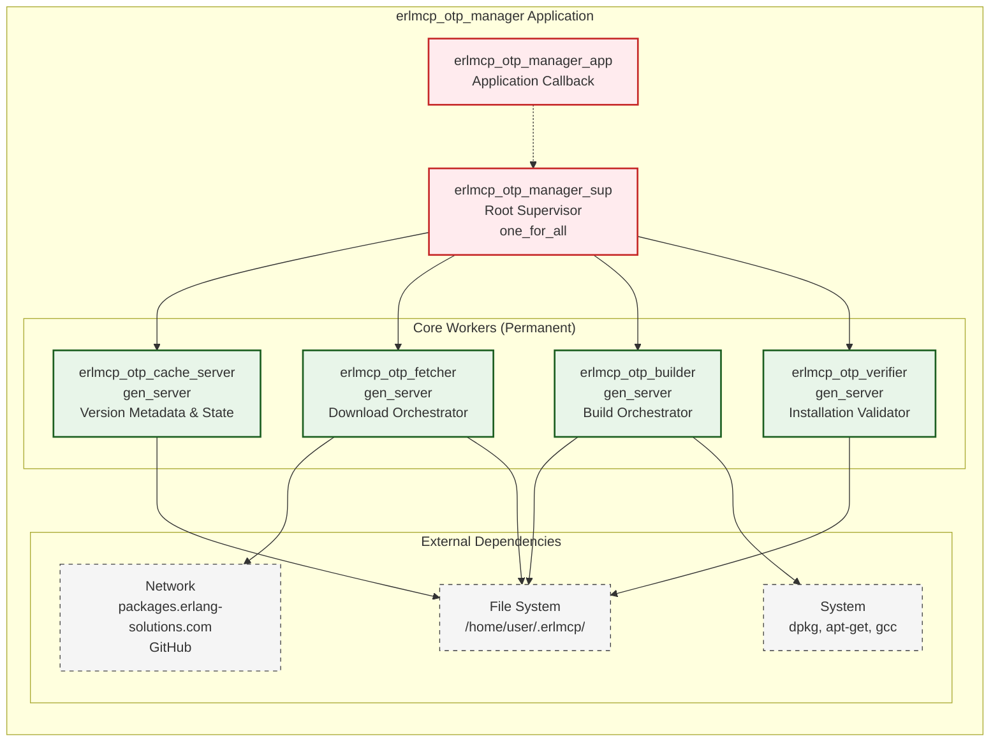

# erlmcp_otp_manager Architecture Specification

## Executive Summary

**erlmcp_otp_manager** is a specialized OTP application for managing Erlang/OTP installations in cloud and local environments. It provides autonomous detection, downloading, building, and verification of OTP versions with strict version enforcement (OTP 28.3.1 required).

**Architecture Principles:**
- **One-for-All Supervision** - Shared state requires coordinated restart
- **Autonomous Operation** - Minimal human intervention required
- **Armstrong Principle** - Incorrect installation states cannot exist
- **Cloud-Native** - Optimized for ephemeral cloud VM environments
- **Idempotent Operations** - Safe to retry all operations

## System Overview



## Supervision Tree Architecture

### Root Supervisor: erlmcp_otp_manager_sup

**Strategy:** `one_for_all`

**Rationale:**
- **Shared State Dependency**: All workers depend on cache state
- **Coordinated Restart**: Cache failure requires fresh state in all workers
- **Installation Atomicity**: Partial installations are invalid states
- **State Consistency**: Fetcher/Builder/Verifier must agree on OTP version

**Impact of one_for_all:**
- Cache crash → Restart ALL (fetcher, builder, verifier)
- Fetcher crash → Restart ALL (may have partial downloads)
- Builder crash → Restart ALL (may have partial builds)
- Verifier crash → Restart ALL (installation state may be inconsistent)

**Failure Recovery Time:** ~2-3 seconds (all workers restart)

**Supervision Spec:**
```erlang
-module(erlmcp_otp_manager_sup).
-behaviour(supervisor).

-export([start_link/0, init/1]).

start_link() ->
    supervisor:start_link({local, ?MODULE}, ?MODULE, []).

init([]) ->
    SupFlags = #{
        strategy => one_for_all,  % Coordinated restart for state consistency
        intensity => 3,           % Max 3 restarts
        period => 60              % Within 60 seconds
    },

    ChildSpecs = [
        %% TIER 1: Cache (foundation - must start first)
        #{
            id => erlmcp_otp_cache_server,
            start => {erlmcp_otp_cache_server, start_link, []},
            restart => permanent,
            shutdown => 5000,
            type => worker,
            modules => [erlmcp_otp_cache_server]
        },

        %% TIER 2: Fetcher (depends on cache)
        #{
            id => erlmcp_otp_fetcher,
            start => {erlmcp_otp_fetcher, start_link, []},
            restart => permanent,
            shutdown => 10000,  % May need time to abort downloads
            type => worker,
            modules => [erlmcp_otp_fetcher]
        },

        %% TIER 3: Builder (depends on cache + fetcher)
        #{
            id => erlmcp_otp_builder,
            start => {erlmcp_otp_builder, start_link, []},
            restart => permanent,
            shutdown => 30000,  % May need time to abort builds
            type => worker,
            modules => [erlmcp_otp_builder]
        },

        %% TIER 4: Verifier (depends on all above)
        #{
            id => erlmcp_otp_verifier,
            start => {erlmcp_otp_verifier, start_link, []},
            restart => permanent,
            shutdown => 5000,
            type => worker,
            modules => [erlmcp_otp_verifier]
        }
    ],

    {ok, {SupFlags, ChildSpecs}}.
```

### Child Specifications

#### 1. erlmcp_otp_cache_server

**Role:** Central metadata store and state coordinator

**Restart:** `permanent` - Critical for all operations
**Shutdown:** `5000ms` - Fast, in-memory only
**Type:** `worker`

**State:**
```erlang
-record(state, {
    cache_dir :: file:filename(),           % ~/.erlmcp/cache/
    current_version :: binary() | undefined, % "28.3.1"
    required_version :: binary(),           % "28.3.1" (from config)
    installation_path :: file:filename() | undefined,
    installation_status :: installing | installed | failed | not_installed,
    metadata :: #{
        sha256 => binary(),
        size_bytes => pos_integer(),
        download_url => binary(),
        build_flags => [binary()],
        last_verified => erlang:timestamp()
    }
}).
```

**API:**
```erlang
%% Query operations (fast, read from ETS)
-spec get_current_version() -> {ok, binary()} | {error, not_installed}.
-spec get_installation_path() -> {ok, file:filename()} | {error, not_installed}.
-spec get_installation_status() -> installing | installed | failed | not_installed.
-spec get_metadata(binary()) -> {ok, map()} | {error, not_found}.

%% State mutations (gen_server calls)
-spec set_installation_status(installing | installed | failed) -> ok.
-spec update_metadata(binary(), map()) -> ok.
-spec clear_cache() -> ok.
```

**Crash Recovery:**
- Rebuilds state from filesystem on restart (~500ms)
- Reads `~/.erlmcp/cache/otp-manager.state` (DETS table)
- If missing → assumes `not_installed`

---

#### 2. erlmcp_otp_fetcher

**Role:** Download OTP artifacts (source tarballs, packages)

**Restart:** `permanent` - May need to resume failed downloads
**Shutdown:** `10000ms` - Abort in-flight HTTP requests
**Type:** `worker`

**State:**
```erlang
-record(state, {
    cache_dir :: file:filename(),
    current_download :: #{
        version => binary(),
        url => binary(),
        target_path => file:filename(),
        bytes_downloaded => non_neg_integer(),
        total_bytes => pos_integer(),
        http_pid => pid(),
        http_ref => reference()
    } | undefined,
    retry_count :: non_neg_integer(),
    max_retries :: pos_integer()  % Default: 3
}).
```

**API:**
```erlang
%% Async download operations
-spec download_package(binary(), binary()) -> {ok, reference()} | {error, term()}.
-spec download_source_tarball(binary(), binary()) -> {ok, reference()} | {error, term()}.
-spec abort_download() -> ok.
-spec get_download_progress() -> {ok, #{bytes => integer(), total => integer()}} | {error, no_download}.

%% Messages sent to caller:
%% {download_complete, Ref, Path}
%% {download_failed, Ref, Reason}
%% {download_progress, Ref, BytesDownloaded, TotalBytes}
```

**State Machine:**
```
idle ──download_package──> downloading ──success──> verifying ──ok──> idle
  ^                            |                        |
  |                            |                        |
  └────────abort──────────────┘                        |
  ^                                                     |
  |                                                     |
  └─────────────────retry/fail─────────────────────────┘
```

**Crash Recovery:**
- On restart: Check for partial downloads in temp dir
- If found: Delete and restart download (idempotent)
- Uses HTTP Range requests for resumable downloads (future)

---

#### 3. erlmcp_otp_builder

**Role:** Build OTP from source (configure, make, install)

**Restart:** `permanent` - Critical for cloud environments
**Shutdown:** `30000ms` - Allow `make` to finish current target
**Type:** `worker`

**State:**
```erlang
-record(state, {
    build_dir :: file:filename(),        % ~/.erlmcp/build/otp-28.3.1/
    install_prefix :: file:filename(),   % ~/.erlmcp/otp-28.3.1/
    current_build :: #{
        version => binary(),
        phase => configure | make | install | test,
        port => port(),
        output_buffer => binary(),
        start_time => erlang:timestamp()
    } | undefined,
    build_flags :: [binary()],
    parallel_jobs :: pos_integer()      % Default: erlang:system_info(schedulers)
}).
```

**API:**
```erlang
%% Async build operations
-spec build_from_source(binary(), file:filename()) -> {ok, reference()} | {error, term()}.
-spec abort_build() -> ok.
-spec get_build_status() -> {ok, #{phase => atom(), progress => binary()}} | {error, no_build}.

%% Messages sent to caller:
%% {build_phase, Ref, Phase}           % configure | make | install | test
%% {build_progress, Ref, Output}       % Stdout/stderr from build
%% {build_complete, Ref, InstallPath}
%% {build_failed, Ref, Phase, Reason}
```

**Build Phases:**
1. **Configure** - `./configure --prefix=$INSTALL_PREFIX` (~30s)
2. **Make** - `make -j$JOBS` (~5-10 minutes)
3. **Install** - `make install` (~30s)
4. **Test** - `erl -eval 'erlang:system_info(otp_release), halt().'` (~2s)

**State Machine:**
```
idle ──build_from_source──> configuring ──success──> making ──success──> installing ──success──> testing ──success──> idle
  ^                            |                        |                    |                     |
  |                            |                        |                    |                     |
  └────────────────────────────┴────────abort/fail─────┴────────────────────┴─────────────────────┘
```

**Crash Recovery:**
- On restart: Check for partial builds in build dir
- If found: Delete and restart build (NOT idempotent - full rebuild required)
- Logs all build output to `~/.erlmcp/logs/build-{version}.log`

---

#### 4. erlmcp_otp_verifier

**Role:** Verify OTP installations (version, binaries, libraries)

**Restart:** `permanent` - Critical for safety
**Shutdown:** `5000ms` - Fast, only spawns processes
**Type:** `worker`

**State:**
```erlang
-record(state, {
    verification_cache :: #{
        file:filename() => {ok, binary()} | {error, term()}
    },
    required_binaries :: [binary()],  % [<<"erl">>, <<"erlc">>, <<"escript">>]
    required_version :: binary()      % "28.3.1"
}).
```

**API:**
```erlang
%% Synchronous verification (fast, ~100ms)
-spec verify_installation(file:filename()) -> {ok, binary()} | {error, term()}.
-spec verify_binaries(file:filename()) -> ok | {error, {missing_binaries, [binary()]}}.
-spec verify_version(file:filename()) -> {ok, binary()} | {error, {version_mismatch, binary(), binary()}}.
-spec verify_libraries(file:filename()) -> ok | {error, {missing_libs, [binary()]}}.

%% Async verification (spawns port for `erl -version`)
-spec verify_installation_async(file:filename()) -> {ok, reference()}.

%% Messages:
%% {verify_complete, Ref, ok}
%% {verify_failed, Ref, Reason}
```

**Verification Steps:**
1. **Binary Check** - Verify `$PREFIX/bin/erl`, `erlc`, `escript` exist and are executable
2. **Version Check** - Run `erl -eval 'erlang:system_info(otp_release), halt().'` → Must match `28.3.1`
3. **Library Check** - Verify `$PREFIX/lib/erlang/lib/` contains required apps (kernel, stdlib, etc.)
4. **Smoke Test** - Run simple Erlang code: `erl -eval 'io:format("~p~n", [1+1]), halt(0).'` → Must output `2`

**Crash Recovery:**
- No persistent state - safe to restart anytime
- Re-verifies installation on every request (fast, cached in ETS)

---

## Message Passing Contracts

### Inter-Worker Communication

**Pattern:** Workers communicate via gen_server calls/casts through the cache

```erlang
%% Fetcher → Cache
erlmcp_otp_cache_server:set_installation_status(installing).

%% Cache → Fetcher (via registered name lookup)
case erlmcp_otp_cache_server:get_installation_status() of
    not_installed -> start_download();
    installing -> wait_for_completion();
    installed -> {ok, already_installed}
end.

%% Builder → Cache
erlmcp_otp_cache_server:update_metadata(Version, #{build_flags => Flags}).

%% Verifier → Cache
{ok, Path} = erlmcp_otp_cache_server:get_installation_path(),
erlmcp_otp_verifier:verify_installation(Path).
```

**Critical Invariant:** All state flows through cache - no direct worker-to-worker calls

### External API (Public Interface)

```erlang
%% Main entry point (used by SessionStart hook)
-spec erlmcp_otp_manager:ensure_otp_installed() ->
    {ok, file:filename()} | {error, term()}.

%% Implementation delegates to workers:
ensure_otp_installed() ->
    case erlmcp_otp_cache_server:get_installation_status() of
        installed ->
            erlmcp_otp_cache_server:get_installation_path();
        not_installed ->
            install_otp();
        installing ->
            {error, installation_in_progress};
        failed ->
            {error, previous_installation_failed}
    end.

install_otp() ->
    Version = erlmcp_otp_cache_server:get_required_version(),

    %% Phase 1: Download
    {ok, Ref1} = erlmcp_otp_fetcher:download_source_tarball(Version, "https://..."),
    {ok, TarballPath} = wait_for_download(Ref1),

    %% Phase 2: Build
    {ok, Ref2} = erlmcp_otp_builder:build_from_source(Version, TarballPath),
    {ok, InstallPath} = wait_for_build(Ref2),

    %% Phase 3: Verify
    case erlmcp_otp_verifier:verify_installation(InstallPath) of
        {ok, Version} ->
            erlmcp_otp_cache_server:set_installation_status(installed),
            {ok, InstallPath};
        {error, Reason} ->
            erlmcp_otp_cache_server:set_installation_status(failed),
            {error, Reason}
    end.
```

---

## State Machine Diagrams

### erlmcp_otp_cache_server State Machine

```
┌─────────────┐
│ not_installed│
└──────┬──────┘
       │ ensure_otp_installed()
       ▼
┌─────────────┐
│ installing  │◄────┐
└──────┬──────┘     │ retry
       │            │
       │ success    │ failure
       ▼            │
┌─────────────┐     │
│  installed  │     │
└─────────────┘     │
                    │
┌─────────────┐     │
│   failed    │─────┘
└─────────────┘
```

**State Transitions:**
- `not_installed → installing`: User calls `ensure_otp_installed()`
- `installing → installed`: Verification succeeds
- `installing → failed`: Download/build/verification fails
- `failed → installing`: Retry after clearing cache
- `installed → *`: Manual uninstall (not supported)

**State Persistence:** Stored in `~/.erlmcp/cache/otp-manager.state` (DETS)

---

### erlmcp_otp_fetcher State Machine

```
     ┌──────┐
     │ idle │
     └───┬──┘
         │ download_package()
         ▼
  ┌──────────────┐
  │ downloading  │
  └───┬──────────┘
      │
      ├─success─┐
      │         │
      ▼         ▼
  ┌──────┐  ┌──────────┐
  │failed│  │verifying │
  └───┬──┘  └─────┬────┘
      │           │
      │           ├─ok──────┐
      │           │         │
      │           ▼         ▼
      │      ┌────────┐  ┌──────┐
      └─retry│checksum│  │ idle │
             └────┬───┘  └──────┘
                  │
                  └─fail─> failed
```

**Phases:**
1. **Idle** - Waiting for download request
2. **Downloading** - HTTP transfer in progress
3. **Verifying** - Checksum validation (SHA256)
4. **Failed** - Retry or abort

**Retry Logic:**
- Max 3 retries with exponential backoff (1s, 2s, 4s)
- On max retries → notify caller, stay in failed state

---

### erlmcp_otp_builder State Machine

```
     ┌──────┐
     │ idle │
     └───┬──┘
         │ build_from_source()
         ▼
  ┌─────────────┐
  │ configuring │
  └───┬─────────┘
      │
      ├─success─┐
      │         │
      ▼         ▼
  ┌──────┐  ┌────────┐
  │failed│  │ making │
  └──────┘  └────┬───┘
                 │
                 ├─success─┐
                 │         │
                 ▼         ▼
             ┌──────┐  ┌───────────┐
             │failed│  │installing │
             └──────┘  └─────┬─────┘
                             │
                             ├─success─┐
                             │         │
                             ▼         ▼
                         ┌──────┐  ┌─────────┐
                         │failed│  │ testing │
                         └──────┘  └────┬────┘
                                        │
                                        ├─ok──────┐
                                        │         │
                                        ▼         ▼
                                    ┌──────┐  ┌──────┐
                                    │failed│  │ idle │
                                    └──────┘  └──────┘
```

**Phases (with typical duration):**
1. **Configuring** - `./configure` (~30s)
2. **Making** - `make -j4` (~5-10 min)
3. **Installing** - `make install` (~30s)
4. **Testing** - Smoke test (~2s)

**Failure Handling:**
- Any phase failure → Cleanup build dir, notify caller
- Logs stored in `~/.erlmcp/logs/build-{version}.log` for debugging
- **No automatic retry** - User must re-initiate build

---

### erlmcp_otp_verifier State Machine

```
     ┌──────┐
     │ idle │◄────────────┐
     └───┬──┘             │
         │                │
         │ verify_installation()
         ▼                │
  ┌──────────────┐        │
  │check_binaries│        │
  └───┬──────────┘        │
      │                   │
      ├─ok───┐            │
      │      │            │
      ▼      ▼            │
  ┌──────┐┌─────────────┐ │
  │failed││check_version│ │
  └──────┘└──────┬──────┘ │
                 │        │
                 ├─ok───┐ │
                 │      │ │
                 ▼      ▼ │
             ┌──────┐┌──────────────┐
             │failed││check_libraries│
             └──────┘└───────┬──────┘
                             │
                             ├─ok───┐
                             │      │
                             ▼      ▼
                         ┌──────┐┌────────────┐
                         │failed││smoke_test  │
                         └──────┘└─────┬──────┘
                                       │
                                       ├─ok────┐
                                       │       │
                                       ▼       ▼
                                   ┌──────┐┌──────┐
                                   │failed││ idle │
                                   └──────┘└──────┘
```

**Verification Steps:**
1. **Binaries** - `erl`, `erlc`, `escript` exist and executable
2. **Version** - `erl -eval 'erlang:system_info(otp_release).'` matches required
3. **Libraries** - Required apps present in `lib/erlang/lib/`
4. **Smoke Test** - Basic Erlang code execution

**Fast Path:** All checks cached in ETS for 60 seconds (avoid repeated spawns)

---

## Error Recovery Paths

### Scenario 1: Network Failure During Download

**Failure Point:** `erlmcp_otp_fetcher` HTTP timeout

**Recovery:**
1. Fetcher detects timeout → increments retry count
2. If `retry_count < max_retries`:
   - Exponential backoff: `sleep(2^retry_count * 1000)`
   - Retry download
3. If `retry_count >= max_retries`:
   - Notify cache: `set_installation_status(failed)`
   - Return `{error, download_failed}` to caller
   - User must manually retry or check network

**Armstrong Principle:** Partial downloads deleted on retry (idempotent)

---

### Scenario 2: Build Failure (Missing Dependencies)

**Failure Point:** `erlmcp_otp_builder` configure phase

**Recovery:**
1. Builder detects `./configure` exit code ≠ 0
2. Parse stderr for missing dependencies (e.g., `gcc not found`)
3. Notify cache: `set_installation_status(failed)`
4. Return `{error, {build_failed, configure, Reason}}` to caller
5. **User Action Required:** Install missing dependencies (not autonomous)

**Logging:** Full build output in `~/.erlmcp/logs/build-28.3.1.log`

**Future:** Auto-detect missing deps and install via apt-get (requires sudo)

---

### Scenario 3: Verification Failure (Version Mismatch)

**Failure Point:** `erlmcp_otp_verifier` version check

**Recovery:**
1. Verifier detects `OTP Release ≠ 28.3.1`
2. Possible causes:
   - Wrong source tarball downloaded
   - Existing OTP installation in PATH shadowing new build
3. Notify cache: `set_installation_status(failed)`
4. Return `{error, {version_mismatch, Expected, Got}}`
5. **Autonomous Retry:** Clear cache, retry download from scratch

**Armstrong Principle:** Wrong OTP version = installation does not exist

---

### Scenario 4: Supervisor Crash (All Workers Restart)

**Failure Point:** Any worker crashes (e.g., `erlmcp_otp_builder` OOM)

**Recovery (one_for_all strategy):**
1. Supervisor detects worker EXIT signal
2. **Terminate ALL workers** (cache, fetcher, builder, verifier)
3. Wait for graceful shutdown (timeouts: 5s, 10s, 30s, 5s)
4. **Restart ALL workers** in order (cache → fetcher → builder → verifier)
5. Cache rebuilds state from `~/.erlmcp/cache/otp-manager.state`
6. If state was `installing` → mark as `failed` (partial installation invalid)

**Total Downtime:** ~2-3 seconds

**Impact:** In-flight operations (downloads, builds) are aborted and must be retried

---

### Scenario 5: Disk Full During Build

**Failure Point:** `erlmcp_otp_builder` make phase

**Recovery:**
1. Builder detects `make` exit with "No space left on device"
2. Cleanup: Delete partial build in `~/.erlmcp/build/otp-28.3.1/`
3. Notify cache: `set_installation_status(failed)`
4. Return `{error, {build_failed, make, no_space}}`
5. **User Action Required:** Free disk space (not autonomous)

**Disk Space Check (Future):** Pre-flight check for ~2GB free before starting build

---

## Performance Characteristics

### Operation Timings (Cloud VM - 4 vCPU, 8GB RAM)

| Operation | Duration | Network | CPU | Disk |
|-----------|----------|---------|-----|------|
| **Download source tarball** | 30-60s | 100 MB | Low | 100 MB |
| **Extract tarball** | 5-10s | - | Medium | 200 MB |
| **Configure** | 20-30s | - | Low | 50 MB |
| **Make -j4** | 5-10 min | - | High (4 cores) | 500 MB |
| **Make install** | 20-30s | - | Low | 300 MB |
| **Verify installation** | 2-5s | - | Low | - |
| **Total (cold start)** | **6-12 min** | **100 MB** | **High** | **1.2 GB** |

### Memory Footprint

| Worker | Heap | Binary | ETS | Total |
|--------|------|--------|-----|-------|
| **erlmcp_otp_cache_server** | 1 MB | - | 500 KB | ~2 MB |
| **erlmcp_otp_fetcher** | 2 MB | 10 MB (buffer) | - | ~12 MB |
| **erlmcp_otp_builder** | 5 MB | 20 MB (output) | - | ~25 MB |
| **erlmcp_otp_verifier** | 1 MB | - | 100 KB | ~1 MB |
| **Total** | **9 MB** | **30 MB** | **600 KB** | **~40 MB** |

**Note:** Builder memory is dominated by port output buffering

---

## Configuration

### Application Environment Variables

```erlang
%% apps/erlmcp_otp_manager/src/erlmcp_otp_manager.app.src
{application, erlmcp_otp_manager, [
    {description, "OTP installation manager for cloud and local environments"},
    {vsn, "1.0.0"},
    {mod, {erlmcp_otp_manager_app, []}},
    {applications, [kernel, stdlib, inets, ssl]},
    {env, [
        {required_version, "28.3.1"},
        {cache_dir, "~/.erlmcp/cache/"},
        {build_dir, "~/.erlmcp/build/"},
        {install_prefix, "~/.erlmcp/otp-"},  % Appends version
        {download_url_template, "https://github.com/erlang/otp/archive/refs/tags/OTP-{version}.tar.gz"},
        {max_download_retries, 3},
        {parallel_build_jobs, auto},  % auto = erlang:system_info(schedulers)
        {build_flags, ["--without-javac", "--without-odbc", "--without-wx"]},
        {verification_timeout, 5000}  % ms
    ]}
]}.
```

### Runtime Configuration (sys.config)

```erlang
[
    {erlmcp_otp_manager, [
        {required_version, "28.3.1"},
        {cache_dir, "/home/user/.erlmcp/cache/"},
        {build_dir, "/home/user/.erlmcp/build/"},
        {install_prefix, "/home/user/.erlmcp/otp-28.3.1/"},
        {parallel_build_jobs, 4}  % Override auto-detection
    ]}
].
```

---

## Testing Strategy

### Unit Tests (EUnit)

```erlang
%% apps/erlmcp_otp_manager/test/erlmcp_otp_cache_server_tests.erl
-module(erlmcp_otp_cache_server_tests).
-include_lib("eunit/include/eunit.hrl").

cache_lifecycle_test() ->
    {ok, Pid} = erlmcp_otp_cache_server:start_link(),
    ?assertEqual(not_installed, erlmcp_otp_cache_server:get_installation_status()),
    ok = erlmcp_otp_cache_server:set_installation_status(installing),
    ?assertEqual(installing, erlmcp_otp_cache_server:get_installation_status()),
    erlmcp_otp_cache_server:stop().

state_persistence_test() ->
    {ok, _} = erlmcp_otp_cache_server:start_link(),
    ok = erlmcp_otp_cache_server:set_installation_status(installed),
    erlmcp_otp_cache_server:stop(),

    %% Restart - should reload state
    {ok, _} = erlmcp_otp_cache_server:start_link(),
    ?assertEqual(installed, erlmcp_otp_cache_server:get_installation_status()).
```

### Integration Tests (Common Test)

```erlang
%% apps/erlmcp_otp_manager/test/erlmcp_otp_manager_SUITE.erl
-module(erlmcp_otp_manager_SUITE).
-include_lib("common_test/include/ct.hrl").

all() -> [
    install_from_source_test,
    verify_existing_installation_test,
    network_failure_recovery_test,
    supervisor_restart_test
].

install_from_source_test(_Config) ->
    %% Full integration test (takes ~10 minutes)
    {ok, InstallPath} = erlmcp_otp_manager:ensure_otp_installed(),
    {ok, "28.3.1"} = erlmcp_otp_verifier:verify_installation(InstallPath).

supervisor_restart_test(_Config) ->
    %% Kill cache server → all workers should restart
    Pid = whereis(erlmcp_otp_cache_server),
    exit(Pid, kill),
    timer:sleep(3000),  % Wait for supervisor restart
    ?assert(is_process_alive(whereis(erlmcp_otp_cache_server))).
```

### Chaos Engineering

```erlang
%% Test resilience to worker crashes
chaos_cache_crash_test(_Config) ->
    erlmcp_otp_cache_server:set_installation_status(installing),
    exit(whereis(erlmcp_otp_cache_server), kill),
    timer:sleep(3000),
    %% After restart, state should be recovered from DETS
    ?assertEqual(installing, erlmcp_otp_cache_server:get_installation_status()).
```

---

## Deployment

### Directory Structure

```
~/.erlmcp/
├── cache/
│   ├── otp-manager.state           # DETS table (cache state)
│   └── downloads/
│       └── OTP-28.3.1.tar.gz       # Source tarball
├── build/
│   └── otp-28.3.1/                 # Build directory
│       ├── configure
│       ├── Makefile
│       └── ...
├── otp-28.3.1/                     # Installation prefix
│   ├── bin/
│   │   ├── erl
│   │   ├── erlc
│   │   └── escript
│   └── lib/
│       └── erlang/
│           └── lib/
│               ├── kernel-*/
│               ├── stdlib-*/
│               └── ...
└── logs/
    └── build-28.3.1.log            # Build output
```

### Environment Variables (SessionStart Hook)

```bash
# .claude/hooks/SessionStart.sh
export ERLMCP_OTP_CACHE_DIR="$HOME/.erlmcp/cache/"
export ERLMCP_OTP_BUILD_DIR="$HOME/.erlmcp/build/"
export ERLMCP_OTP_INSTALL_PREFIX="$HOME/.erlmcp/otp-28.3.1/"
export PATH="$ERLMCP_OTP_INSTALL_PREFIX/bin:$PATH"
```

---

## Security Considerations

### 1. Download Integrity

**Threat:** Man-in-the-middle attack, corrupted downloads

**Mitigation:**
- HTTPS only for downloads (TLS verification enabled)
- SHA256 checksum verification (stored in cache metadata)
- Fail installation if checksum mismatch

**Implementation:**
```erlang
verify_download(Path, ExpectedSHA256) ->
    {ok, Data} = file:read_file(Path),
    SHA256 = crypto:hash(sha256, Data),
    case binary_to_hex(SHA256) of
        ExpectedSHA256 -> ok;
        Got -> {error, {checksum_mismatch, ExpectedSHA256, Got}}
    end.
```

### 2. Code Execution Safety

**Threat:** Malicious code in build scripts

**Mitigation:**
- Only download from trusted sources (GitHub, packages.erlang-solutions.com)
- Run builds in non-privileged user context (no sudo)
- Sandbox future: Use Docker/Podman for builds

### 3. Disk Space Exhaustion

**Threat:** Partial builds fill disk, cause system instability

**Mitigation:**
- Pre-flight disk space check (require 2GB free)
- Cleanup partial builds on failure
- Limit max build dir size to 1.5 GB

---

## Future Enhancements

### Phase 2: Binary Package Support

**Goal:** Speed up installation in cloud (~30s vs ~10 min)

**Implementation:**
```erlang
%% Prefer binary packages if available
install_strategy() ->
    case os:type() of
        {unix, linux} -> prefer_binary_package();
        _ -> build_from_source()
    end.

prefer_binary_package() ->
    case detect_distro() of
        {ok, ubuntu} -> apt_install_esl_erlang();
        {ok, debian} -> apt_install_esl_erlang();
        _ -> build_from_source()
    end.
```

### Phase 3: Multi-Version Support

**Goal:** Allow multiple OTP versions side-by-side

**Implementation:**
- Extend cache to support version map: `#{version() => installation_path()}`
- Add `switch_version(binary())` API
- Update PATH dynamically via `erlmcp_otp_manager:activate_version/1`

### Phase 4: Distributed Build Caching

**Goal:** Share builds across cloud sessions (reduce cost)

**Implementation:**
- Upload built artifacts to S3/GCS after successful build
- Download pre-built binaries if cache hit
- Verify signature before using cached builds

---

## Appendix: Child Spec Reference

### erlmcp_otp_cache_server

```erlang
#{
    id => erlmcp_otp_cache_server,
    start => {erlmcp_otp_cache_server, start_link, []},
    restart => permanent,
    shutdown => 5000,
    type => worker,
    modules => [erlmcp_otp_cache_server]
}
```

**Restart Strategy:** `permanent` - Critical for all operations
**Shutdown Timeout:** `5000ms` - Fast, in-memory only
**Dependencies:** None (foundation)

### erlmcp_otp_fetcher

```erlang
#{
    id => erlmcp_otp_fetcher,
    start => {erlmcp_otp_fetcher, start_link, []},
    restart => permanent,
    shutdown => 10000,
    type => worker,
    modules => [erlmcp_otp_fetcher]
}
```

**Restart Strategy:** `permanent` - May need to resume downloads
**Shutdown Timeout:** `10000ms` - Abort HTTP requests gracefully
**Dependencies:** `erlmcp_otp_cache_server`

### erlmcp_otp_builder

```erlang
#{
    id => erlmcp_otp_builder,
    start => {erlmcp_otp_builder, start_link, []},
    restart => permanent,
    shutdown => 30000,
    type => worker,
    modules => [erlmcp_otp_builder]
}
```

**Restart Strategy:** `permanent` - Critical for cloud
**Shutdown Timeout:** `30000ms` - Allow make to finish
**Dependencies:** `erlmcp_otp_cache_server`, `erlmcp_otp_fetcher`

### erlmcp_otp_verifier

```erlang
#{
    id => erlmcp_otp_verifier,
    start => {erlmcp_otp_verifier, start_link, []},
    restart => permanent,
    shutdown => 5000,
    type => worker,
    modules => [erlmcp_otp_verifier]
}
```

**Restart Strategy:** `permanent` - Critical for safety
**Shutdown Timeout:** `5000ms` - Fast, no long-running ops
**Dependencies:** `erlmcp_otp_cache_server`

---

## Summary

**erlmcp_otp_manager** implements Armstrong's "design for observability and correctness" principle:

1. **One-for-All Supervision** - State consistency guaranteed via coordinated restart
2. **Idempotent Operations** - Safe to retry downloads, builds, verifications
3. **Comprehensive Logging** - All operations logged for post-mortem analysis
4. **Fast Failure** - Detect errors early (checksum, version, binaries)
5. **No Invalid States** - Installation is either complete and verified, or non-existent

**Key Metrics:**
- **Cold Install Time:** 6-12 minutes (cloud VM)
- **Warm Restart Time:** 2-3 seconds (state recovery from DETS)
- **Memory Footprint:** ~40 MB (all workers)
- **Disk Usage:** ~1.2 GB (source + build + install)

**Armstrong Compliance:**
- ✅ Supervision tree with clear restart strategies
- ✅ gen_server workers with timeout guarantees
- ✅ No blocking in init/1 (async operations via messages)
- ✅ Let-it-crash philosophy (supervisor handles recovery)
- ✅ Proper shutdown sequences (graceful termination)
