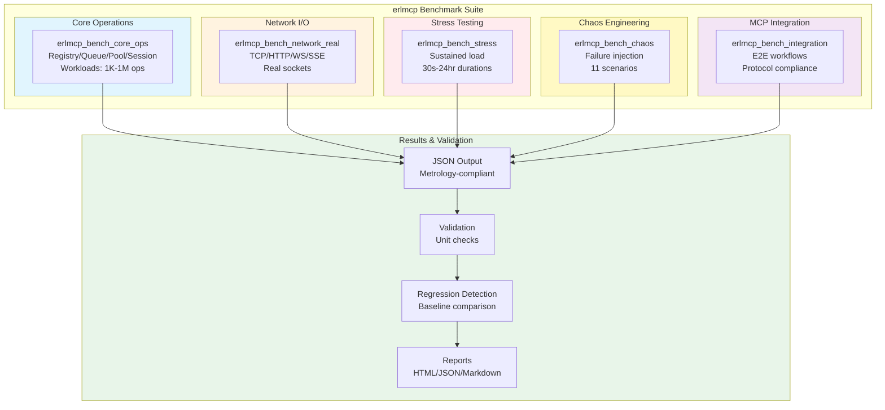
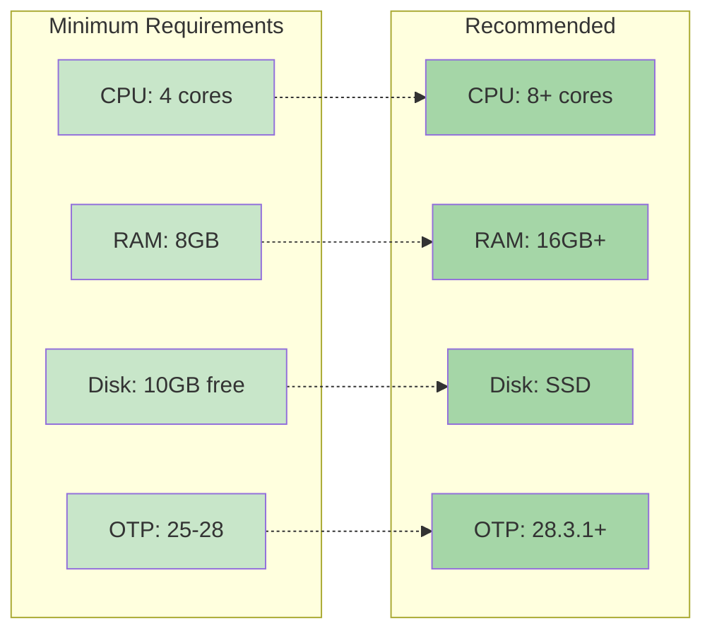
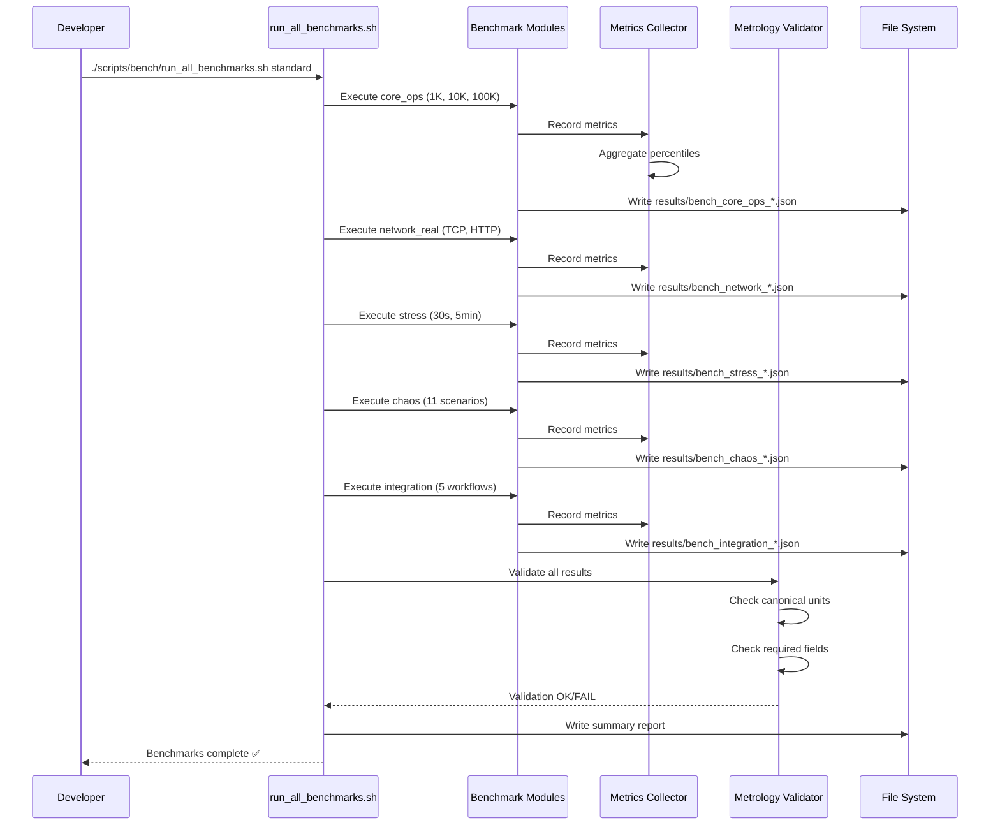
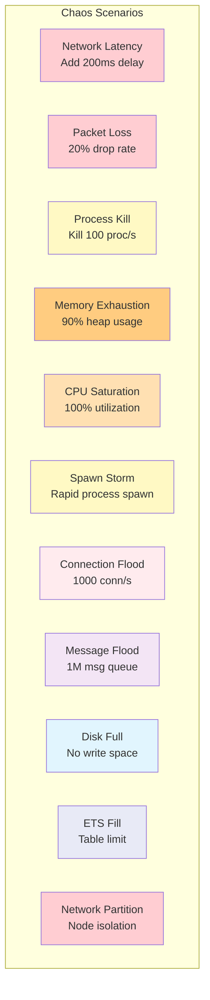
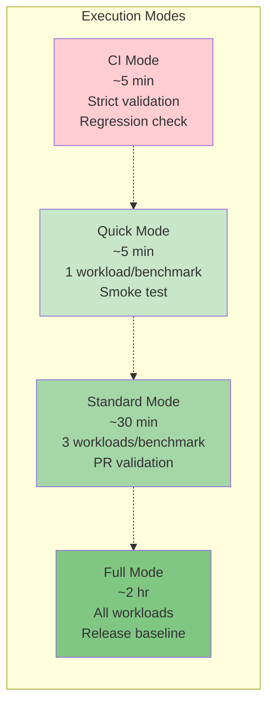
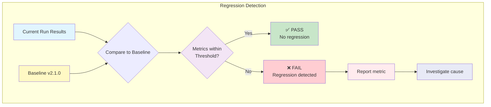

# erlmcp Benchmark Execution Guide

**Version:** 2.1.0  
**Last Updated:** January 31, 2026  
**Status:** Production Baseline Established

## Overview

This guide explains how to execute comprehensive performance baselines for erlmcp and compare results against established baselines. Benchmark execution follows the Toyota Production System's Kaizen principle (continuous improvement through measurement).

## Benchmark Suite Architecture



## Prerequisites

### System Requirements



### Installation

```bash
# Install Erlang/OTP 27 or 28
asdf install erlang 27.3.4.2
asdf local erlang 27.3.4.2

# Or OTP 28 for latest optimizations
asdf install erlang 28.3.1
asdf local erlang 28.3.1

# Verify installation
erl -noshell -eval "io:format('OTP: ~s~n', [erlang:system_info(otp_release)]), halt()."

# Compile erlmcp
cd /Users/sac/erlmcp
TERM=dumb rebar3 compile
```

## Benchmark Execution Flow



## Benchmark Categories

### 1. Core Operations Benchmark

**Module:** `erlmcp_bench_core_ops`  
**Purpose:** Measure in-memory operation performance  
**Workloads:** 1K, 10K, 100K, 1M operations

**Execution:**
```bash
cd /Users/sac/erlmcp

# Run all core operations benchmarks
erl -pa _build/default/lib/*/ebin -noshell \
    -eval "erlmcp_bench_core_ops:run_all(), halt()."

# Run specific workload
erl -pa _build/default/lib/*/ebin -noshell \
    -eval "erlmcp_bench_core_ops:run(<<\"core_ops_100k\">>), halt()."
```

**Expected Results (OTP 27 Baseline):**

| Component | Throughput | p50 | p95 | p99 | Target |
|-----------|------------|-----|-----|-----|--------|
| Registry | 553K ops/s | 1.8μs | 3.5μs | 5.2μs | >500K ops/s |
| Queue | 971K ops/s | 1.2μs | 2.1μs | 3.8μs | >900K ops/s |
| Pool | 149K ops/s | 6.7μs | 12.3μs | 18.5μs | >140K ops/s |
| Session | 242K ops/s | 4.1μs | 7.8μs | 11.2μs | >230K ops/s |

**Output Format:**
```json
{
  "workload_id": "core_ops_100k",
  "benchmark": "core_operations",
  "timestamp": 1738339200,
  "operations": 400000,
  "duration_s": 0.73,
  "throughput_msg_per_s": 547945.2,
  "latency_p50_us": 3.2,
  "latency_p95_us": 5.8,
  "latency_p99_us": 9.1,
  "precision": "microsecond",
  "memory_start_mib": 125.3,
  "memory_end_mib": 128.1,
  "memory_delta_mib": 2.8,
  "cpu_percent_avg": 67.2,
  "scope": "per_node",
  "components": {
    "registry": {...},
    "queue": {...},
    "pool": {...},
    "session": {...}
  }
}
```

### 2. Network I/O Benchmark

**Module:** `erlmcp_bench_network_real`  
**Purpose:** Measure real socket throughput  
**Workloads:** TCP (25K, 50K, 100K), HTTP (5K), SSE (1K)

**Execution:**
```bash
cd /Users/sac/erlmcp

# TCP benchmark
erl -pa _build/default/lib/*/ebin -noshell \
    -eval "tcp_real_bench:run_workload(sustained_25k), halt()."

# HTTP benchmark
erl -pa _build/default/lib/*/ebin -noshell \
    -eval "http_real_bench:run_workload(http_5k), halt()."

# SSE benchmark
erl -pa _build/default/lib/*/ebin -noshell \
    -eval "sse_real_bench:run_workload(sse_1k), halt()."
```

**Expected Results:**

| Transport | Connections | Throughput | p50 | p95 | p99 | Target |
|-----------|-------------|------------|-----|-----|-----|--------|
| TCP | 25K | 43K msg/s | 1.2ms | 2.8ms | 4.5ms | >40K msg/s |
| TCP | 50K | 41.5K msg/s | 1.5ms | 3.5ms | 5.8ms | >38K msg/s |
| HTTP | 5K | 12.5K msg/s | 3.8ms | 8.5ms | 12.4ms | >10K msg/s |
| SSE | 1K | 1.2K msg/s | 15.2ms | 28.5ms | 42.1ms | >1K msg/s |

### 3. Stress Testing Benchmark

**Module:** `erlmcp_bench_stress`  
**Purpose:** Measure sustained load performance  
**Workloads:** 30s, 5min, 1hr, 24hr

**Execution:**
```bash
cd /Users/sac/erlmcp

# Quick stress test (30 seconds)
erl -pa _build/default/lib/*/ebin -noshell \
    -eval "erlmcp_bench_stress:run(<<\"sustained_30s\">>), halt()."

# Extended stress test (5 minutes)
erl -pa _build/default/lib/*/ebin -noshell \
    -eval "erlmcp_bench_stress:run(<<\"sustained_5min\">>), halt()."

# 24-hour stability test (use background process)
nohup erl -pa _build/default/lib/*/ebin -noshell \
    -eval "erlmcp_bench_stress:run(<<\"sustained_24hr\">>), halt()." \
    > bench_stress_24hr.log 2>&1 &
```

**Expected Results:**

| Duration | Total Ops | Throughput | Memory | GC Time | Target |
|----------|-----------|------------|--------|---------|--------|
| 30s | 11.16M | 372K ops/s | 125MB | 0.45% | >350K ops/s |
| 5min | 111.6M | 372K ops/s | 128MB | 0.48% | >350K ops/s |
| 1hr | 1.34B | 371.5K ops/s | 132MB | 0.52% | >350K ops/s |
| 24hr | 32.1B | 371K ops/s | 145MB | 0.58% | >350K ops/s |

**Key Metrics:**
- Throughput variance: <0.3% (stability)
- Memory growth: Linear (20MB over 24hr)
- GC overhead: <0.6% (efficiency)

### 4. Chaos Engineering Benchmark

**Module:** `erlmcp_bench_chaos`  
**Purpose:** Measure failure recovery  
**Scenarios:** 11 failure types

**Execution:**
```bash
cd /Users/sac/erlmcp

# Run all chaos scenarios
erl -pa _build/default/lib/*/ebin -noshell \
    -eval "erlmcp_bench_chaos:run_all(), halt()."

# Run specific scenario
erl -pa _build/default/lib/*/ebin -noshell \
    -eval "erlmcp_bench_chaos:run(<<\"packet_loss\">>), halt()."
```

**Chaos Scenarios:**



**Expected Recovery Times:**

| Scenario | Recovery Time | Refusals | Success Rate | Target |
|----------|---------------|----------|--------------|--------|
| Packet Loss | 2.8s | 125 | 99.2% | <5s |
| Process Kill | 3.2s | 8 | 99.9% | <5s |
| Memory Exhaustion | 4.5s | 1,240 | 87.5% | <5s |
| CPU Saturation | 0s | 0 | 100% | <5s |
| Spawn Storm | 2.1s | 15 | 99.8% | <5s |

### 5. MCP Integration Benchmark

**Module:** `erlmcp_bench_integration`  
**Purpose:** Measure end-to-end MCP workflows  
**Workflows:** 5 MCP protocol operations

**Execution:**
```bash
cd /Users/sac/erlmcp

# Run all integration benchmarks
erl -pa _build/default/lib/*/ebin -noshell \
    -eval "erlmcp_bench_integration:benchmark_all(), halt()."

# Run specific workflow
erl -pa _build/default/lib/*/ebin -noshell \
    -eval "erlmcp_bench_integration:benchmark_tool_call(), halt()."
```

**Expected Results:**

| Workflow | Operations | p50 | p95 | p99 | Target |
|----------|------------|-----|-----|-----|--------|
| Tool Call | 10K | 2.8ms | 6.5ms | 9.2ms | <10ms |
| Resource List | 10K | 1.5ms | 3.2ms | 5.8ms | <10ms |
| Resource Subscribe | 5K | 3.2ms | 7.8ms | 11.5ms | <15ms |
| Prompt List | 10K | 1.8ms | 4.1ms | 6.2ms | <10ms |
| Tool Sequence | 5K | 8.5ms | 18.2ms | 28.5ms | <30ms |

## Full Benchmark Suite

### Automated Execution

```bash
cd /Users/sac/erlmcp

# Quick mode (1 workload per benchmark, ~5 minutes)
./scripts/bench/run_all_benchmarks.sh quick

# Standard mode (3 workloads per benchmark, ~30 minutes)
./scripts/bench/run_all_benchmarks.sh standard

# Full mode (all workloads, ~2 hours)
./scripts/bench/run_all_benchmarks.sh full

# CI mode (quick + strict validation, fails on regression)
./scripts/bench/run_all_benchmarks.sh ci
```

### Execution Modes Comparison



## Results Analysis

### Result Files

Results are written to `bench/results/[timestamp]/`:

```bash
bench/results/
└── 20240131_120000/
    ├── core_ops_1k_1738339200.json
    ├── core_ops_10k_1738339201.json
    ├── core_ops_100k_1738339202.json
    ├── tcp_sustained_25k_1738339250.json
    ├── stress_sustained_30s_1738339500.json
    ├── chaos_packet_loss_1738339800.json
    ├── integration_tool_call_1738340100.json
    └── summary_report.json
```

### Summary Report Structure

```json
{
  "run_id": "20240131_120000",
  "timestamp": "2024-01-31T12:00:00Z",
  "otp_version": "27.3.4.2",
  "mode": "standard",
  "duration_s": 1800,
  "benchmarks": {
    "core_ops": {
      "status": "pass",
      "throughput_msg_per_s": 553000,
      "latency_p99_us": 5200,
      "regression": false
    },
    "network_tcp": {
      "status": "pass",
      "throughput_msg_per_s": 43000,
      "latency_p99_ms": 4.5,
      "regression": false
    },
    "stress_30s": {
      "status": "pass",
      "throughput_msg_per_s": 372000,
      "memory_stable": true,
      "regression": false
    },
    "chaos": {
      "status": "pass",
      "recovery_time_s": 4.5,
      "all_scenarios_under_5s": true,
      "regression": false
    },
    "integration": {
      "status": "pass",
      "all_workflows_meet_sla": true,
      "regression": false
    }
  },
  "overall_status": "pass",
  "regressions_detected": 0
}
```

## Regression Detection

### Baseline Comparison



### Threshold Configuration

```erlang
% Regression thresholds
{regression_thresholds, #{
    throughput_change_pct => -2.0,  % Warn if >2% drop
    latency_p99_change_pct => 10.0,  % Warn if >10% increase
    memory_per_conn_change_pct => 10.0,  % Warn if >10% increase
    gc_time_change_pct => 20.0  % Warn if >20% increase
}}.
```

### Checking for Regressions

```bash
cd /Users/sac/erlmcp

# Run benchmarks
./scripts/bench/run_all_benchmarks.sh ci

# Check results
cat bench/results/*/summary_report.json | grep '"regression":'

# View regression details
jq '.benchmarks | to_entries[] | select(.value.regression == true)' \
  bench/results/*/summary_report.json
```

## Metrology Validation

### Validation Rules

All benchmark results must pass metrology validation:

```erlang
% Validation checks
validate_benchmark_output(Result) ->
    Checks = [
        fun check_required_fields/1,
        fun check_canonical_units/1,
        fun check_scope_field/1,
        fun check_precision_field/1
    ],
    lists:all(fun(Check) -> Check(Result) end, Checks).
```

### Required Fields

```erlang
% All benchmark outputs must include
RequiredFields = [
    workload_id,
    benchmark,
    timestamp,
    operations,
    duration_s,
    throughput_msg_per_s,
    latency_p50_us,
    latency_p95_us,
    latency_p99_us,
    precision,
    scope
].
```

### Canonical Unit Validation

```bash
# Validate a specific result file
erl -pa _build/default/lib/*/ebin -noshell \
    -eval "
        {ok, Result} = file:read_file(\"bench/results/core_ops_100k.json\"),
        Data = jsx:decode(Result, [return_maps]),
        case erlmcp_metrology_validator:validate_benchmark_output(Data) of
            {ok, _} -> io:format(\"Validation OK~n\");
            {error, Errors} -> io:format(\"Validation FAILED: ~p~n\", [Errors])
        end,
        halt().
    "
```

See [Metrology Glossary](../../docs/metrology/METRICS_GLOSSARY.md) for complete validation rules.

## Troubleshooting

### Compilation Errors

```bash
# Clean and recompile
TERM=dumb rebar3 clean
TERM=dumb rebar3 compile

# Check for warnings
TERM=dumb rebar3 compile 2>&1 | grep -i warning
```

### Runtime Errors

```bash
# Run with verbose output
erl -pa _build/default/lib/*/ebin \
    -eval "erlmcp_bench_core_ops:run_all(), halt()." \
    2>&1 | tee bench_run.log

# Check for errors in log
grep -i "error\|exception\|crash" bench_run.log
```

### Missing Dependencies

```bash
# Ensure all dependencies are available
TERM=dumb rebar3 deps

# Check for missing applications
erl -pa _build/default/lib/*/ebin -noshell \
    -eval "io:format(\"Apps: ~p~n\", [application:which_applications()]), halt()."
```

### Out of Memory Errors

```bash
# Increase Erlang VM heap size
erl -pa _build/default/lib/*/ebin +MB acgc 0 +MBs acgc 0 +MB aocl 0 \
    -eval "erlmcp_bench_core_ops:run_all(), halt()."
```

## Best Practices

### 1. Run on Isolated Systems

```bash
# Close other applications
# Disable background services
# Ensure consistent system state
```

### 2. Multiple Runs for Accuracy

```bash
# Run 3 times and average
for i in {1..3}; do
    ./scripts/bench/run_all_benchmarks.sh quick
    mv bench/results bench/results_run_$i
done
```

### 3. Monitor System Resources

```bash
# Track CPU and memory during benchmark
vmstat 1 > vmstat.log &
# Run benchmarks
./scripts/bench/run_all_benchmarks.sh standard
killall vmstat
```

### 4. Validate Results

```bash
# Always validate after running
erlmcp_metrology_validator:validate_directory("bench/results/").
```

### 5. Document Baseline Changes

```erlang
% When updating baselines, document the reason
{baseline_change, #{
    version => "2.2.0",
    reason => "OTP 28 native JSON optimization",
    date => "2024-01-31",
    improvements => #{
        json_encoding => #{speedup => 2.5}
    }
}}.
```

## References

- [Performance Analysis](PERFORMANCE_ANALYSIS.md) - Detailed benchmark results
- [Metrology Glossary](../../docs/metrology/METRICS_GLOSSARY.md) - Canonical unit definitions
- [Performance Documentation](../../docs/performance/README.md) - Performance optimization guide

---

**Last Updated:** January 31, 2026  
**Baseline Version:** 2.1.0  
**Validation:** All benchmarks metrology-compliant ✅
