# Integration Patterns Reference

**Version**: 2.1.0
**Last Updated**: 2026-01-31

---

## Overview

This comprehensive reference document catalogs integration patterns, anti-patterns, performance optimization techniques, security considerations, testing strategies, and troubleshooting guides for erlmcp integrations.

## Table of Contents

- [Integration Pattern Catalog](#integration-pattern-catalog)
- [Anti-Patterns Detection](#anti-patterns-detection)
- [Performance Optimization](#performance-optimization)
- [Security Considerations](#security-considerations)
- [Testing Strategies](#testing-strategies)
- [Troubleshooting Guide](#troubleshooting-guide)
- [Best Practices Summary](#best-practices-summary)

---

## Integration Pattern Catalog

### Pattern Classification

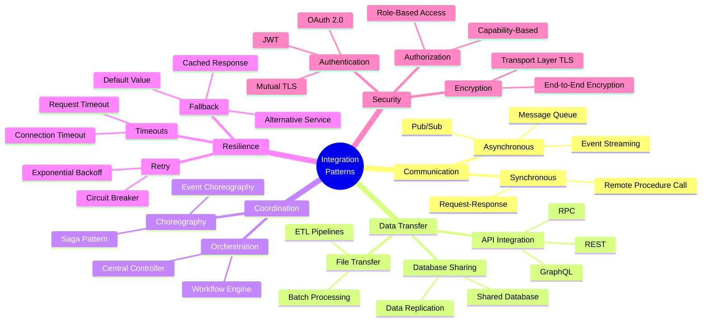

### Core Integration Patterns

#### 1. Request-Response Pattern

**Use Case**: Synchronous API calls between services

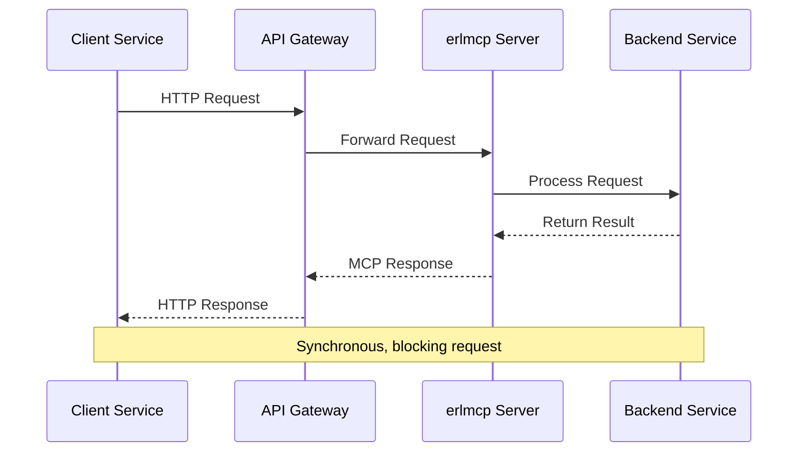

**Implementation:**
```erlang
%% Client发起请求
call_tool(ServerPid, ToolName, Arguments) ->
    Request = #{
        jsonrpc => "2.0",
        id => generate_id(),
        method => "tools/call",
        params => #{
            name => ToolName,
            arguments => Arguments
        }
    },

    case erlmcp_client:call(ServerPid, Request) of
        {ok, Response} ->
            {ok, maps:get(<<"result">>, Response)};
        {error, {Code, Message, Data}} ->
            {error, {Code, Message, Data}}
    end.
```

#### 2. Message Queue Pattern

**Use Case**: Asynchronous processing with guaranteed delivery

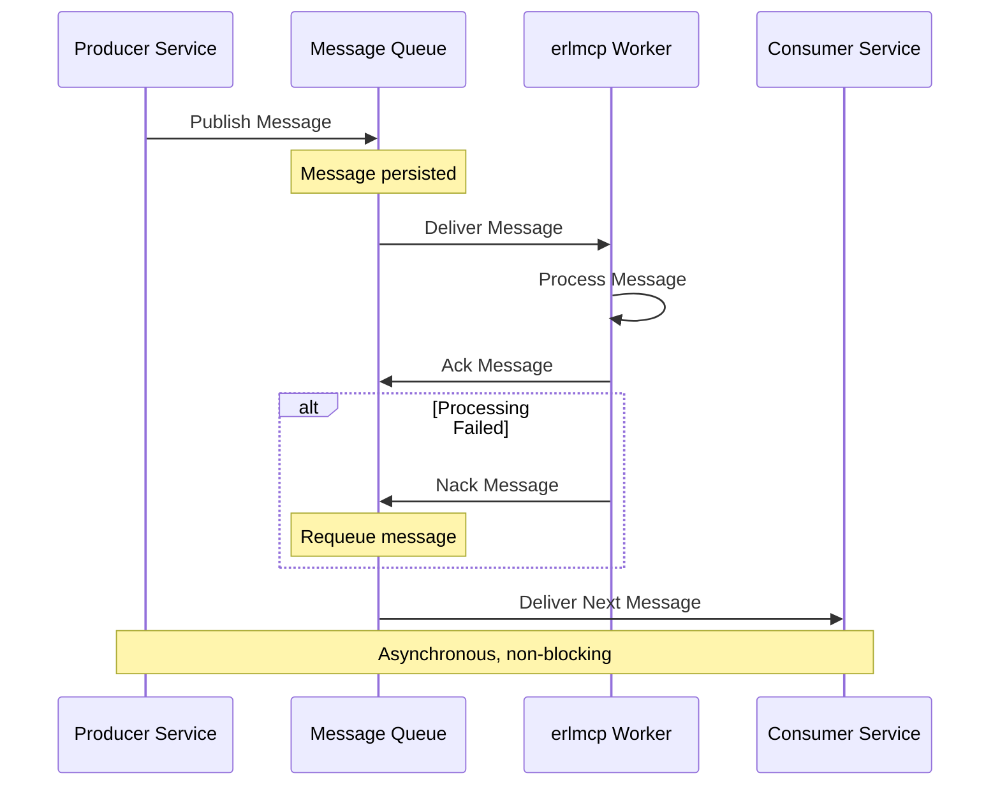

**Implementation:**
```erlang
%% Message queue worker
-module(erlmcp_queue_worker).
-behaviour(gen_server).

init([QueueName]) ->
    {ok, Conn} = amqp:connect(),
    {ok, Chan} = amqp:open_channel(Conn),

    %% Declare queue
    amqp_channel:call(Chan, #'queue.declare'{queue = QueueName}),

    %% Consume messages
    amqp_channel:subscribe(Chan, #'basic.consume'{queue = QueueName}, self()),
    {ok, #state{channel = Chan, queue = QueueName}}.

handle_info({#'basic.deliver'{delivery_tag = Tag}, #amqp_msg{payload = Payload}}, State) ->
    try
        Message = jsx:decode(Payload, [return_maps]),
        process_message(Message),

        %% Ack successful processing
        amqp_channel:cast(State#state.channel, #'basic.ack'{delivery_tag = Tag})
    catch
        _Type:_Reason ->
            %% Reject and requeue
            amqp_channel:cast(State#state.channel, #'basic.reject'{delivery_tag = Tag, requeue = true})
    end,
    {noreply, State}.
```

#### 3. Circuit Breaker Pattern

**Use Case**: Prevent cascade failures

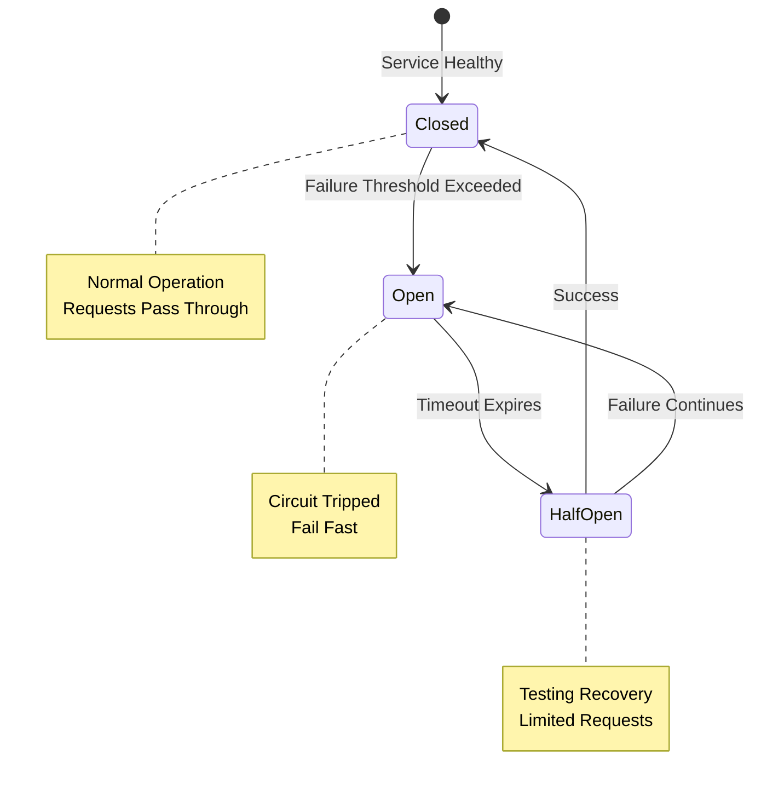

**Implementation:** See [API Gateway Integration](../../docs/integration/api-gateway.md#circuit-breaker-patterns)

#### 4. Retry Pattern

**Use Case**: Handle transient failures

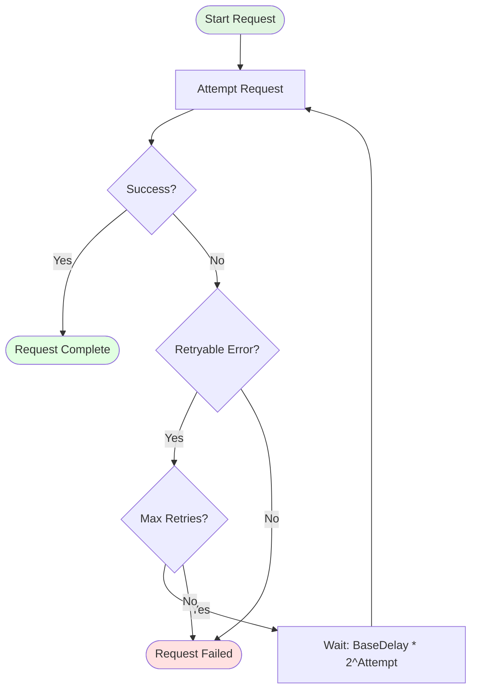

**Implementation:**
```erlang
%% Retry with exponential backoff
retry_with_backoff(Fun, MaxRetries) ->
    retry_with_backoff(Fun, MaxRetries, 0, 1000).

retry_with_backoff(_Fun, MaxRetries, Attempt, _Delay) when Attempt >= MaxRetries ->
    {error, max_retries_exceeded};
retry_with_backoff(Fun, MaxRetries, Attempt, Delay) ->
    case Fun() of
        {ok, Result} ->
            {ok, Result};
        {error, Reason} ->
            case is_retryable(Reason) of
                true ->
                    timer:sleep(Delay),
                    %% Exponential backoff with jitter
                    NewDelay = min(Delay * 2, 60000) + rand:uniform(1000),
                    retry_with_backoff(Fun, MaxRetries, Attempt + 1, NewDelay);
                false ->
                    {error, Reason}
            end
    end.

is_retryable({error, timeout}) -> true;
is_retryable({error, econnrefused}) -> true;
is_retryable({error, {http_error, 503}}) -> true;
is_retryable({error, {http_error, 504}}) -> true;
is_retryable(_) -> false.
```

---

## Anti-Patterns Detection

### Common Anti-Patterns

#### 1. Chatty Integration

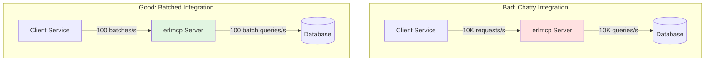

**Detection:**
- High CPU usage in transport layer
- Network throughput bottleneck
- Database connection exhaustion

**Solution:**
```erlang
%% Bad: Individual calls
lists:foreach(fun(Item) ->
    erlmcp_client:call(Pid, Item)
end, Items).

%% Good: Batch call
erlmcp_client:call_batch(Pid, Items).
```

#### 2. Monolithic Integration

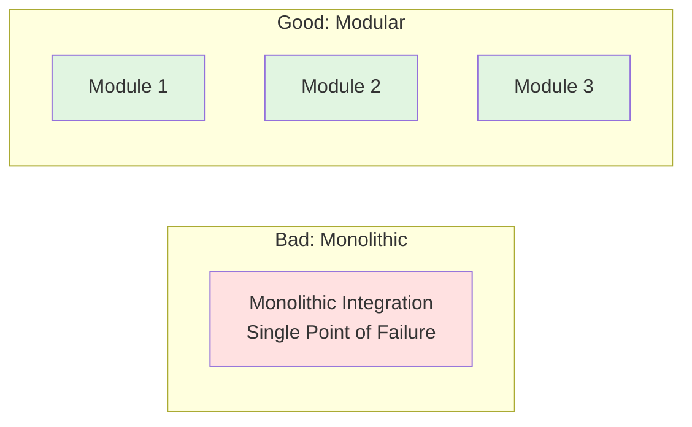

**Solution:** Separate integration points by concern

#### 3. Synchronous Anti-Pattern

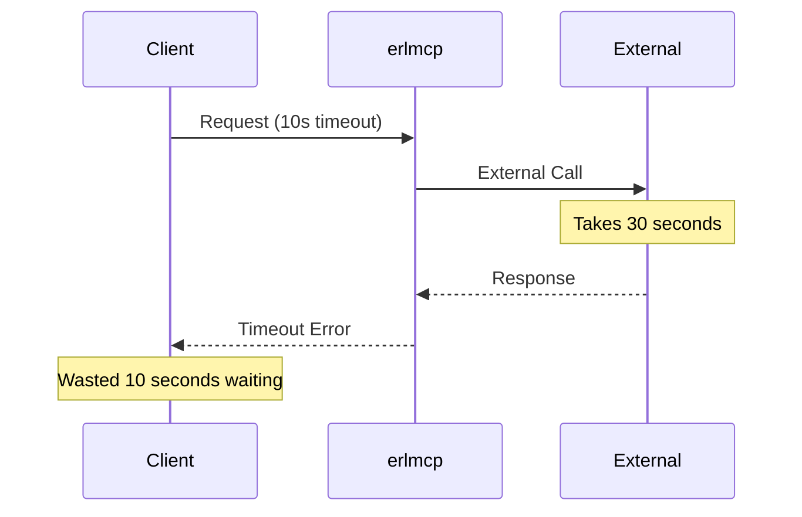

**Solution:**
```erlang
%% Bad: Synchronous external call
handle_request(Request) ->
    Result = external_service:call(Request),
    {ok, Result}.

%% Good: Asynchronous with callback
handle_request(Request) ->
    spawn(fun() ->
        Result = external_service:call(Request),
        gen_server:reply(Request, Result)
    end),
    {noreply, State}.
```

### Anti-Pattern Detection Flow

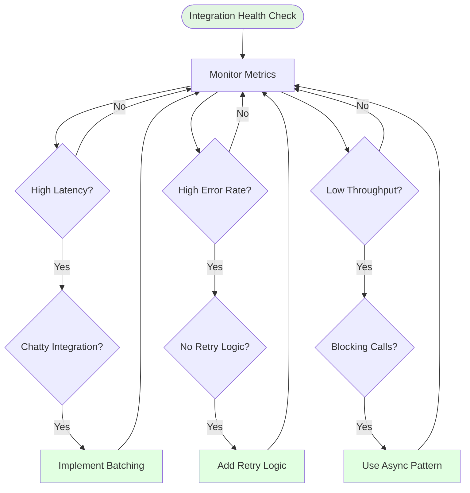

---

## Performance Optimization

### Optimization Flow

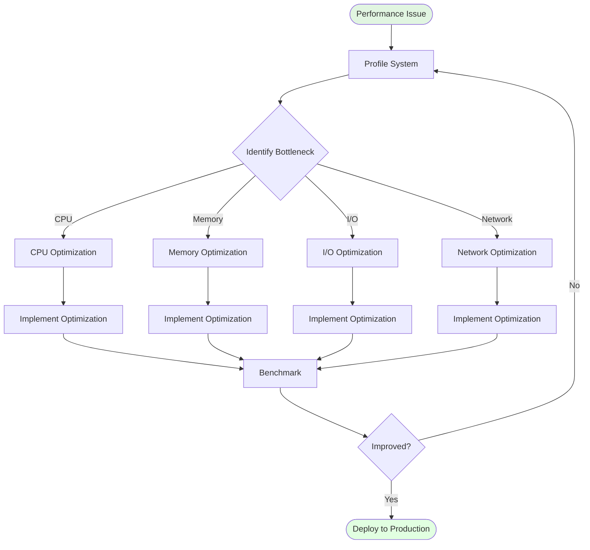

### Optimization Techniques

**1. Connection Pooling:**
```erlang
%% Configure pool size
{pool_size, 10},           % Base pool size
{max_overflow, 20},        % Additional connections
{connection_timeout, 5000}  % Connection timeout
```

**2. Message Batching:**
```erlang
%% Batch multiple operations
batch_operations(Operations) when length(Operations) > 100 ->
    lists:chunk(Operations, 100),
    [process_batch(Batch) || Batch <- Batches].
```

**3. Caching:**
```erlang
%% Cache frequently accessed data
get_cached_data(Key) ->
    case ets:lookup(cache_table, Key) of
        [{Key, Value}] ->
            {ok, Value};
        [] ->
            {ok, Value} = fetch_data(Key),
            ets:insert(cache_table, {Key, Value}),
            {ok, Value}
    end.
```

**4. Asynchronous Processing:**
```erlang
%% Use cast for fire-and-forget
handle_cast({async_operation, Data}, State) ->
    spawn(fun() ->
        process_data(Data)
    end),
    {noreply, State}.
```

---

## Security Considerations

### Security Layers

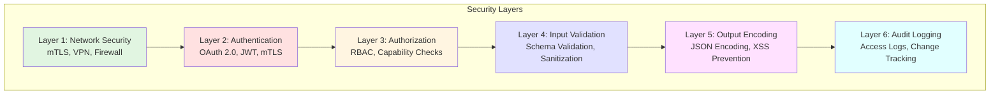

### Security Checklist

- ✅ **Transport**: All connections use TLS 1.3
- ✅ **Authentication**: OAuth 2.0 or mTLS for service-to-service
- ✅ **Authorization**: Role-based access control (RBAC)
- ✅ **Input Validation**: JSON Schema validation on all inputs
- ✅ **Secrets Management**: Vault or cloud secret manager
- ✅ **Audit Logging**: All access and modifications logged
- ✅ **Rate Limiting**: Per-client rate limits enforced
- ✅ **Circuit Breakers**: Prevent resource exhaustion attacks

### Example: mTLS Configuration

```erlang
%% mTLS configuration for transport
{transport, #{
    type => tls,
    certfile => "/etc/erlmcp/certs/server.crt",
    keyfile => "/etc/erlmcp/certs/server.key",
    cacertfile => "/etc/erlmcp/certs/ca.crt",
    verify => verify_peer,
    fail_if_no_peer_cert => true,
    %% TLS 1.3 only
    versions => ['tlsv1.3'],
    %% Strong ciphers
    ciphers => [
        "TLS_AES_256_GCM_SHA384",
        "TLS_CHACHA20_POLY1305_SHA256"
    ]
}}.
```

---

## Testing Strategies

### Test Pyramid

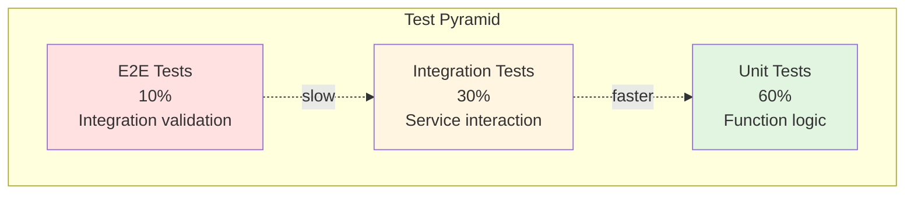

### Test Strategy Matrix

| Test Type | Scope | Execution Frequency | Duration | Coverage Target |
|-----------|-------|---------------------|----------|-----------------|
| **Unit** | Single function | Every commit | <1 min | 80%+ |
| **Integration** | Module interaction | Every commit | 5-10 min | 60%+ |
| **E2E** | Full system | Pre-merge | 15-30 min | Critical paths |
| **Performance** | Load testing | Nightly | 30-60 min | SLA validation |
| **Chaos** | Failure injection | Weekly | 20-40 min | Resilience validation |

### Integration Test Example

```erlang
%% Integration test for external service
-module(external_service_integration_tests).
-include_lib("eunit/include/eunit.hrl").

integration_test_() ->
    {setup,
        fun setup/0,
        fun cleanup/1,
        [
            fun test_service_connection/0,
            fun test_request_response/0,
            fun test_error_handling/0,
            fun test_retry_logic/0
        ]
    }.

setup() ->
    %% Start test dependencies
    {ok, _} = application:ensure_all_started(erlmcp),
    {ok, Server} = erlmcp_server:start_link(#{}),
    Server.

cleanup(Server) ->
    erlmcp_server:stop(Server),
    application:stop(erlmcp).

test_service_connection() ->
    %% Test actual connection to external service
    {ok, Response} = erlmcp_client:ping(),
    ?assertEqual(pong, Response).

test_request_response() ->
    %% Test full request-response cycle
    Request = #{
        jsonrpc => "2.0",
        id => <<"test-001">>,
        method => "tools/list"
    },
    {ok, Response} = erlmcp_client:call(Server, Request),
    ?assertMatch(#{<<"result">> := _}, Response).

test_error_handling() ->
    %% Test error handling
    InvalidRequest = #{invalid => <<"data">>},
    {error, Reason} = erlmcp_client:call(Server, InvalidRequest),
    ?assertMatch({error, _}, Reason).

test_retry_logic() ->
    %% Test retry on transient failure
    meck:new(external_service, [passthrough]),
    meck:sequence(external_service, call,
        [{error, timeout},
         {error, timeout},
         {ok, success}]),

    Result = retry_with_backoff(fun() -> external_service:call() end, 3),
    ?assertEqual({ok, success}, Result),

    meck:unload(external_service).
```

---

## Troubleshooting Guide

### Troubleshooting Flow

```mermaid
flowchart TD
    Issue([Integration Issue Reported]) -> Gather[Gather Information]

    Gather -> Logs{Check Logs}
    Logs -->|Error found| Analyze[Analyze Error]
    Logs -->|No error| Metrics[Check Metrics]

    Analyze --> RootCause{Identify Root Cause}
    Metrics --> RootCause

    RootCause -->|Configuration| Fix1[Fix Configuration]
    RootCause -->|Code Bug| Fix2[Fix Code]
    RootCause -->|External| Fix3[External Issue]
    RootCause -->|Resource| Fix4[Add Resources]

    Fix1 --> Test[Deploy Fix to Test]
    Fix2 --> Test
    Fix3 --> Workaround[Implement Workaround]
    Fix4 --> Test

    Test --> Verify[Verify Fix]
    Workaround --> Verify

    Verify --> Resolved{Issue Resolved?}
    Resolved -->|Yes| Deploy([Deploy to Production])
    Resolved -->|No| Escalate([Escalate to Team])

    style Issue fill:#ffe1e1
    style Deploy fill:#e1ffe1
    style Escalate fill:#ffe1e1
```

### Common Issues and Solutions

**Issue 1: Connection Timeout**
```
Symptom: {error, timeout}
Cause: Network latency or unresponsive service
Solution:
1. Increase timeout in config
2. Check network connectivity
3. Verify service is healthy
4. Implement retry logic
```

**Issue 2: Memory Leak**
```
Symptom: Memory usage grows continuously
Cause: Unbounded growth in state or cache
Solution:
1. Profile with: erlang:memory()/recon:allocators()
2. Find source: recon:bin_leak/100
3. Implement TTL for cache entries
4. Add periodic cleanup
```

**Issue 3: High CPU Usage**
```
Symptom: CPU usage >80%
Cause: Busy loop or inefficient algorithm
Solution:
1. Profile with: fprof:trace(start)
2. Identify hot functions
3. Optimize algorithm
4. Consider caching
```

**Issue 4: Process Crash Loop**
```
Symptom: Process restarts repeatedly
Cause: Unhandled exception or supervision issue
Solution:
1. Check logs: logger:get_log_level()
2. Add error handler
3. Fix exception handling
4. Review supervisor strategy
```

---

## Best Practices Summary

### Integration Best Practices

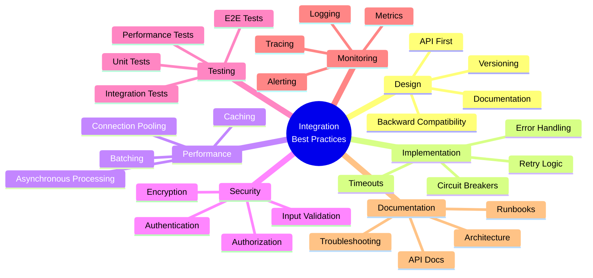

### Checklist

**Before Integration:**
- ✅ Define clear API contract
- ✅ Document integration points
- ✅ Plan error handling strategy
- ✅ Set up monitoring and alerting
- ✅ Prepare rollback plan

**During Integration:**
- ✅ Implement authentication and authorization
- ✅ Add input validation
- ✅ Include timeout and retry logic
- ✅ Add comprehensive logging
- ✅ Write integration tests

**After Integration:**
- ✅ Run load tests
- ✅ Validate performance SLA
- ✅ Review security audit
- ✅ Update documentation
- ✅ Train operations team

---

## Appendix: Quick Reference

### Configuration Templates

**Basic Integration:**
```erlang
{erlmcp, [
    {transport, tcp},
    {port, 8080},
    {session_backend, erlmcp_session_ets},
    {capabilities, #{
        tools => true,
        resources => true,
        prompts => true
    }}
]}.
```

**Production Integration:**
```erlang
{erlmcp, [
    {transport, {tls, #{
        certfile => "/etc/certs/server.crt",
        keyfile => "/etc/certs/server.key",
        cacertfile => "/etc/certs/ca.crt",
        verify => verify_peer
    }}},
    {session_backend, erlmcp_session_mnesia},
    {session_opts, #{
        nodes => [node() | nodes()],
        replicate_method => transaction
    }},
    {observability, #{
        otel_endpoint => "https://otel-collector:4318",
        metrics_enabled => true,
        tracing_enabled => true
    }},
    {resilience, #{
        circuit_breaker => #{
            threshold => 5,
            timeout_ms => 60000
        },
        retry => #{
            max_retries => 3,
            initial_delay_ms => 1000
        }
    }}
]}.
```

### Monitoring Metrics

**Key Metrics to Monitor:**
- Request rate (req/s)
- Response latency (P50, P95, P99)
- Error rate (%)
- Active connections
- Memory usage (MB)
- CPU usage (%)
- Circuit breaker state

**Alert Thresholds:**
- Error rate > 1%: Warning
- Error rate > 5%: Critical
- Latency P99 > 100ms: Warning
- Latency P99 > 500ms: Critical
- Memory > 80%: Warning
- Memory > 90%: Critical

---

**Version**: 2.1.0
**Last Updated**: 2026-01-31
