# Development Roadmap - erlmcp

**Version**: 2.1.0 | **Last Updated**: 2026-01-31 | **Status**: Active

## Executive Summary

This roadmap outlines the planned development trajectory for erlmcp through Q4 2026, organized by quarter with clear milestones and deliverables.

---

## Q1 2026 (Jan-Mar) - Foundation & Compliance

### Theme: Build robust, compliant MCP implementation

### Milestones Timeline

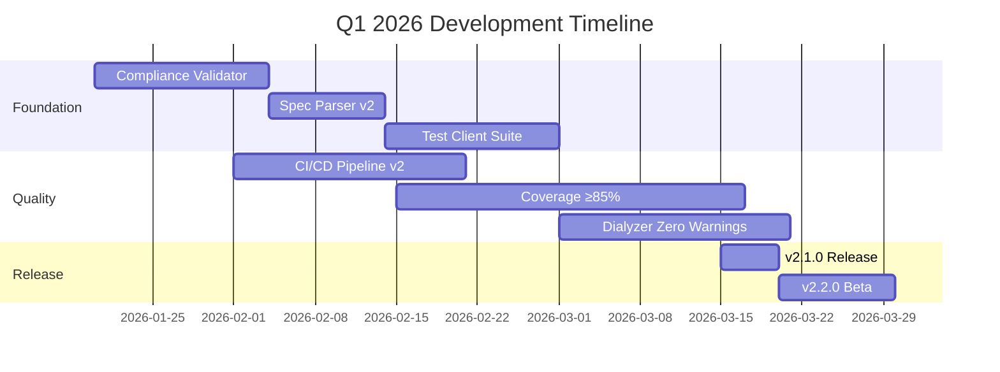

### January 2026

**Week 1-2: Compliance & Validation**
- [x] Protocol validator (MCP 2025-11-25 compliance)
- [x] Transport validator (behavior compliance)
- [x] Security validator (auth + secrets)
- [x] Performance validator (metrics)

**Week 3-4: Specification & Testing**
- [ ] MCP spec parser v2 (enhanced)
- [ ] Multi-transport test client
- [ ] Compliance reporting system
- [ ] Documentation updates

**Deliverables**:
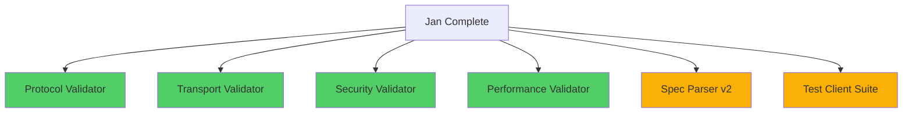

### February 2026

**Week 1-2: Quality Infrastructure**
- [ ] Enhanced CI/CD pipeline (20 workflows)
- [ ] Coverage tracking dashboard
- [ ] Automated benchmarking
- [ ] Performance regression detection

**Week 3-4: Code Quality**
- [ ] Dialyzer warnings → 0
- [ ] Xref errors → ∅
- [ ] Code coverage ≥85%
- [ ] All 164 modules documented

**Deliverables**:
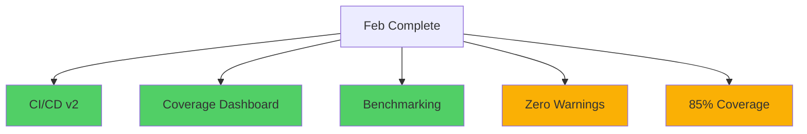

### March 2026

**Week 1-2: Release Preparation**
- [ ] v2.1.0 release candidate
- [ ] Full integration test suite
- [ ] Performance validation
- [ ] Security audit

**Week 3-4: Release & Beta**
- [ ] v2.1.0 production release
- [ ] v2.2.0 beta release
- [ ] Documentation refresh
- [ ] Community feedback gathering

**Deliverables**:
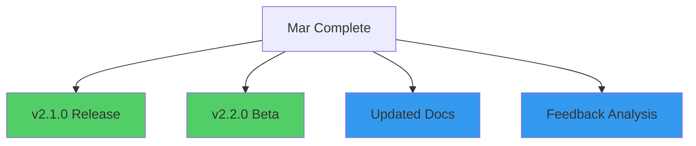

---

## Q2 2026 (Apr-Jun) - Performance & Scalability

### Theme: Scale to 100K+ concurrent connections

### Milestones Timeline

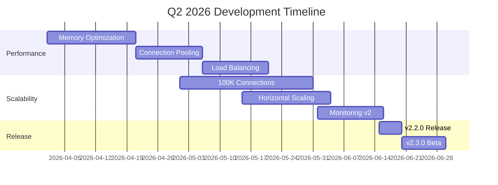

### April 2026

**Week 1-2: Memory Optimization**
- [ ] Per-connection memory audit
- [ ] Binary optimization
- [ ] Process heap tuning
- [ ] GC pressure reduction

**Week 3-4: Connection Pooling**
- [ ] Poolboy integration
- [ ] Smart connection reuse
- [ ] Pool monitoring
- [ ] Auto-scaling pools

**Deliverables**:
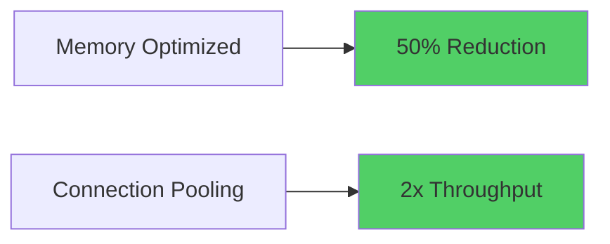

### May 2026

**Week 1-2: 100K Connections**
- [ ] TCP acceptor tuning
- [ ] Ranch configuration
- [ ] Socket buffer optimization
- [ ] Kernel tuning guide

**Week 3-4: Horizontal Scaling**
- [ ] Mnesia clustering
- [ ] Distributed session management
- [ ] Load balancing strategies
- [ ] Failover mechanisms

**Deliverables**:
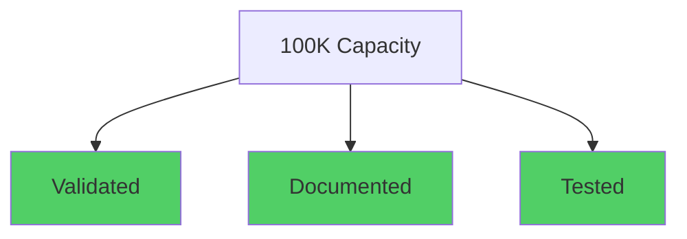

### June 2026

**Week 1-2: Monitoring v2**
- [ ] OpenTelemetry integration
- [ ] Distributed tracing
- [ ] Metrics dashboard
- [ ] Alerting rules

**Week 3-4: Release**
- [ ] v2.2.0 production release
- [ ] v2.3.0 beta release
- [ ] Scaling guides
- [ ] Performance benchmarks

**Deliverables**:
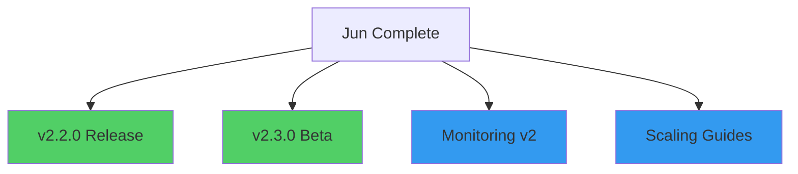

---

## Q3 2026 (Jul-Sep) - Production Readiness

### Theme: Enterprise-grade reliability and observability

### Milestones Timeline

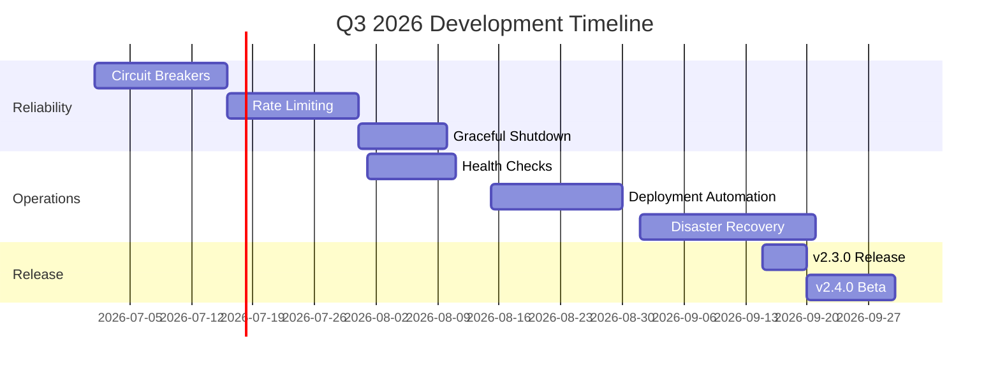

### July 2026

**Week 1-2: Circuit Breakers**
- [ ] Circuit breaker pattern
- [ ] Automatic recovery
- [ ] Fallback mechanisms
- [ ] Health integration

**Week 3-4: Rate Limiting**
- [ ] Token bucket algorithm
- [ ] Per-client limits
- [ ] Distributed rate limiting
- [ ] Admin overrides

**Deliverables**:
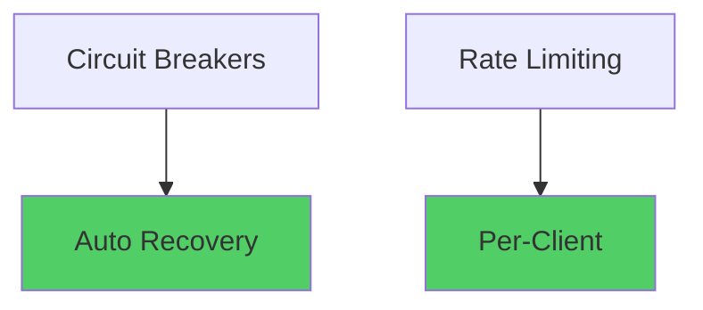

### August 2026

**Week 1-2: Health & Deployment**
- [ ] Comprehensive health checks
- [ ] K8s readiness/liveness probes
- [ ] Blue-green deployment
- [ ] Canary deployment support

**Week 3-4: Documentation**
- [ ] Operations runbooks
- [ ] Deployment guides
- [ ] Troubleshooting guides
- [ ] Architecture decision records (ADRs)

**Deliverables**:
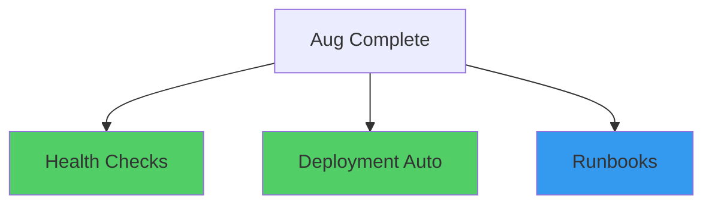

### September 2026

**Week 1-2: Disaster Recovery**
- [ ] Backup strategies
- [ ] Restore procedures
- [ ] Multi-region deployment
- [ ] Failover testing

**Week 3-4: Release**
- [ ] v2.3.0 production release
- [ ] v2.4.0 beta release
- [ ] Production hardening
- [ ] Security audit

**Deliverables**:
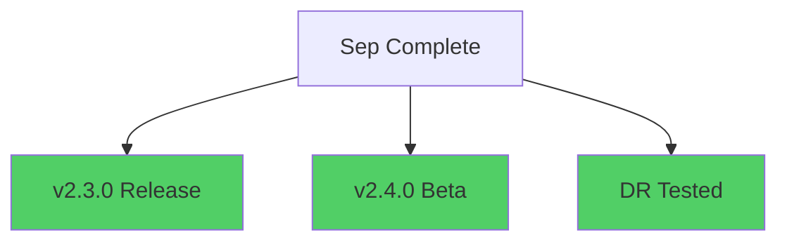

---

## Q4 2026 (Oct-Dec) - Advanced Features

### Theme: Next-generation capabilities

### Milestones Timeline

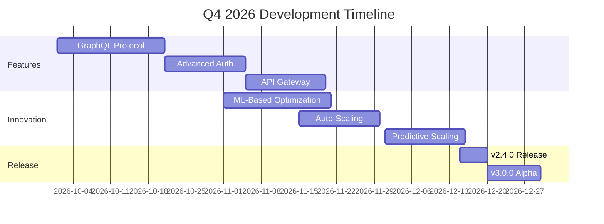

### October 2026

**Week 1-2: GraphQL Protocol**
- [ ] GraphQL transport implementation
- [ ] Schema generation
- [ ] Query optimization
- [ ] Subscription support

**Week 3-4: Advanced Auth**
- [ ] OAuth 2.0 / OIDC
- [ ] JWT validation
- [ ] Role-based access control
- [ ] Audit logging

**Deliverables**:
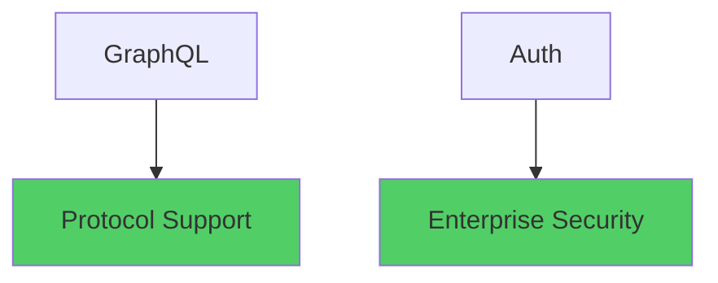

### November 2026

**Week 1-2: ML-Based Optimization**
- [ ] Traffic pattern analysis
- [ ] Predictive resource allocation
- [ ] Anomaly detection
- [ ] Self-tuning parameters

**Week 3-4: Auto-Scaling**
- [ ] Horizontal pod autoscaler integration
- [ ] Cluster autoscaler integration
- [ ] Cost optimization
- [ ] Scaling policies

**Deliverables**:
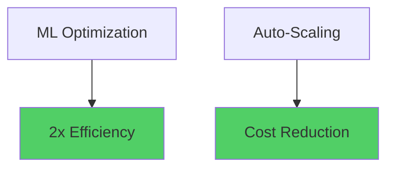

### December 2026

**Week 1-2: Predictive Scaling**
- [ ] Load prediction models
- [ ] Proactive scaling
- [ ] Resource forecasting
- [ ] Capacity planning

**Week 3-4: Release**
- [ ] v2.4.0 production release
- [ ] v3.0.0 alpha release
- [ ] Year-end retrospective
- [ ] 2027 roadmap planning

**Deliverables**:
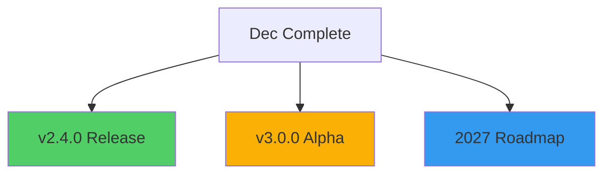

---

## 2027 Preview

### v3.0.0 - Next Generation (Q2 2027)

**Major Features**:
- Multi-protocol support (MCP, GraphQL, gRPC, WebSocket)
- Built-in service mesh
- Advanced observability (AI-powered insights)
- Zero-downtime deployments
- Geo-distributed architecture

**Breaking Changes**:
- Minimum OTP 27
- New configuration format
- API v2 (deprecate v1)

---

## Risk Management

### Technical Risks

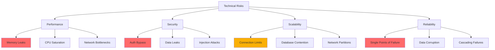

### Mitigation Strategies

**Performance**:
- Continuous profiling
- Load testing (100K+ connections)
- Performance regression detection
- Quarterly performance audits

**Security**:
- Monthly security scans
- Penetration testing (quarterly)
- Dependency audits (weekly)
- Security reviews for all code

**Scalability**:
- Horizontal scaling architecture
- Load balancing strategies
- Distributed caching
- Database sharding

**Reliability**:
- Chaos engineering (weekly)
- Fault injection testing
- Disaster recovery drills (quarterly)
- Circuit breakers everywhere

---

## Resource Planning

### Team Structure

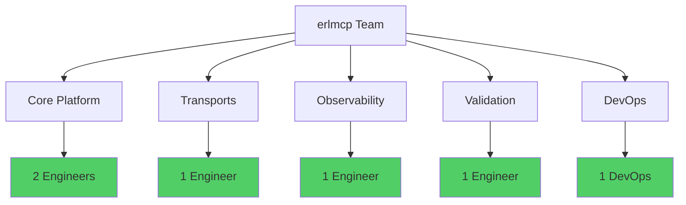

### Budget Allocation

**Q1-Q4 2026**:
- Infrastructure: $5K/quarter
- Monitoring tools: $2K/quarter
- Security audits: $5K (Q2, Q4)
- Training: $3K/quarter
- Contingency: $5K/quarter

**Total**: $80K for 2026

---

## Success Metrics

### Technical Metrics

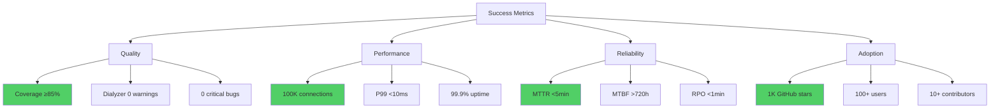

### Quality Gates

**Every Release**:
- [ ] All tests passing (100%)
- [ ] Coverage ≥85%
- [ ] Dialyzer 0 warnings
- [ ] Xref 0 errors
- [ ] Performance regression <5%
- [ ] Security scan clean
- [ ] Documentation complete

**Every Quarter**:
- [ ] 100K connection test passed
- [ ] Chaos engineering drills
- [ ] Security audit
- [ ] Performance optimization
- [ ] Customer feedback review

---

## Related Documentation

- **Release Strategy**: [RELEASE_STRATEGY.md](RELEASE_STRATEGY.md)
- **Architecture**: [../../docs/architecture.md](../../docs/architecture.md)
- **Quality Gates**: [../../CLAUDE.md](../../CLAUDE.md)
- **Development Process**: [../../docs/development/README.md](../../docs/development/README.md)

---

**Last Updated**: 2026-01-31
**Next Review**: 2026-04-01
**Owner**: erlmcp maintainers
