# erlmcp Cluster Deployment Guide

**Version**: 2.1.0
**Target**: 100K concurrent connections (4-node cluster)
**Status**: Production Ready

## Table of Contents

1. [Overview](#overview)
2. [Cluster Topology](#cluster-topology)
3. [Deployment Flows](#deployment-flows)
4. [Node Configuration](#node-configuration)
5. [Load Balancing](#load-balancing)
6. [Monitoring Cluster](#monitoring-cluster)
7. [Failure Scenarios](#failure-scenarios)
8. [Maintenance Procedures](#maintenance-procedures)

---

## Overview

The erlmcp cluster deployment provides horizontal scalability for high-concurrency scenarios. A standard 4-node cluster supports 100K concurrent connections with automatic failover and load balancing.

**Cluster Specifications**:
- **Nodes**: 4 (scalable to N nodes)
- **Connections per Node**: 25,000
- **Total Capacity**: 100,000 concurrent connections
- **Throughput**: 125,000 msg/sec at full capacity
- **Failover Time**: <5 seconds
- **Recovery Time**: <10 seconds

---

## Cluster Topology

### Physical Architecture

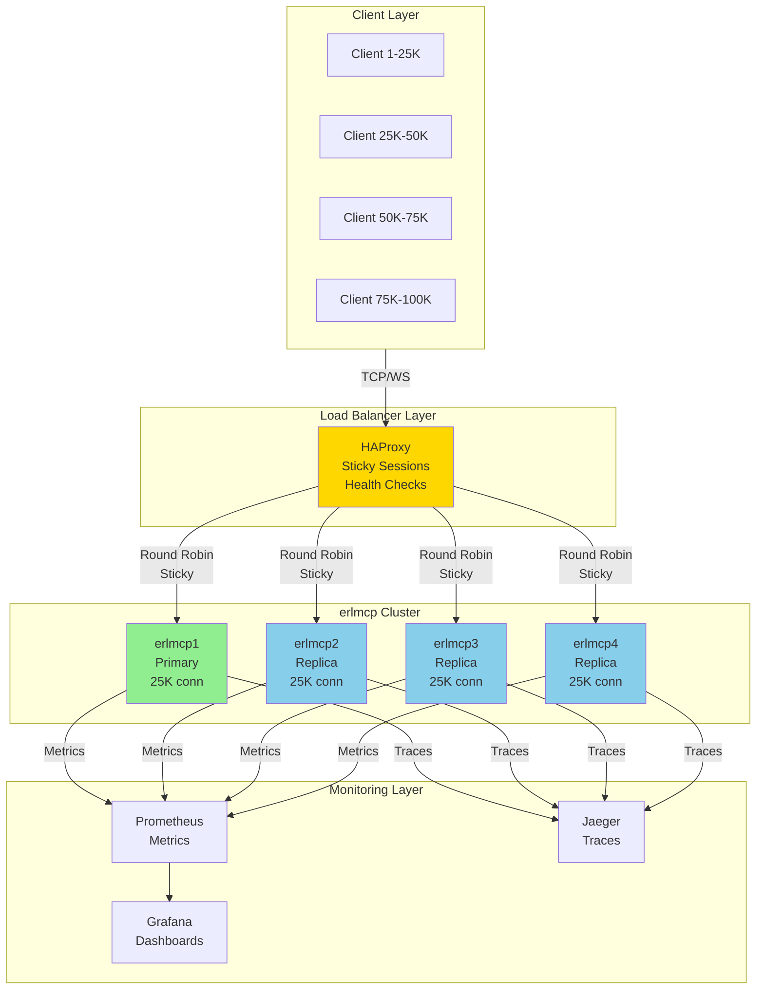
```mermaid
graph TB
    subgraph Clients["Client Layer"]
        C1[Client 1-25K]
        C2[Client 25K-50K]
        C3[Client 50K-75K]
        C4[Client 75K-100K]
    end

    subgraph LB["Load Balancer Layer"]
        HAProxy[HAProxy<br/>Sticky Sessions<br/>Health Checks]
    end

    subgraph Cluster["erlmcp Cluster"]
        N1[erlmcp1<br/>Primary<br/>25K conn]
        N2[erlmcp2<br/>Replica<br/>25K conn]
        N3[erlmcp3<br/>Replica<br/>25K conn]
        N4[erlmcp4<br/>Replica<br/>25K conn]
    end

    subgraph Monitoring["Monitoring Layer"]
        Prometheus[Prometheus<br/>Metrics]
        Grafana[Grafana<br/>Dashboards]
        Jaeger[Jaeger<br/>Traces]
    end

    Clients -->|TCP/WS| HAProxy
    HAProxy -->|Round Robin<br/>Sticky| N1
    HAProxy -->|Round Robin<br/>Sticky| N2
    HAProxy -->|Round Robin<br/>Sticky| N3
    HAProxy -->|Round Robin<br/>Sticky| N4

    N1 -->|Metrics| Prometheus
    N2 -->|Metrics| Prometheus
    N3 -->|Metrics| Prometheus
    N4 -->|Metrics| Prometheus

    Prometheus --> Grafana
    N1 -->|Traces| Jaeger
    N2 -->|Traces| Jaeger
    N3 -->|Traces| Jaeger
    N4 -->|Traces| Jaeger

    style HAProxy fill:#FFD700
    style N1 fill:#90EE90
    style N2 fill:#87CEEB
    style N3 fill:#87CEEB
    style N4 fill:#87CEEB
```

### Logical Architecture

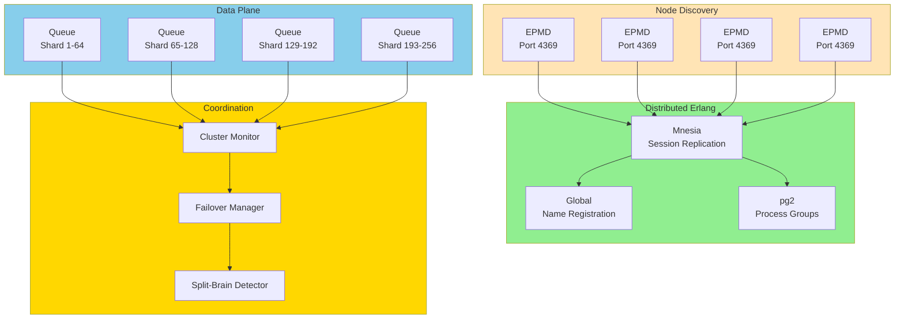
```mermaid
graph TD
    subgraph Discovery["Node Discovery"]
        EPMD1[EPMD<br/>Port 4369]
        EPMD2[EPMD<br/>Port 4369]
        EPMD3[EPMD<br/>Port 4369]
        EPMD4[EPMD<br/>Port 4369]
    end

    subgraph Distribution["Distributed Erlang"]
        Mnesia[Mnesia<br/>Session Replication]
        Global[Global<br/>Name Registration]
        pg2[pg2<br/>Process Groups]
    end

    subgraph DataPlane["Data Plane"]
        Queue1[Queue<br/>Shard 1-64]
        Queue2[Queue<br/>Shard 65-128]
        Queue3[Queue<br/>Shard 129-192]
        Queue4[Queue<br/>Shard 193-256]
    end

    subgraph Coordination["Coordination"]
        Monitor1[Cluster Monitor]
        Failover[Failover Manager]
        SplitBrain[Split-Brain Detector]
    end

    EPMD1 --> Mnesia
    EPMD2 --> Mnesia
    EPMD3 --> Mnesia
    EPMD4 --> Mnesia

    Mnesia --> Global
    Mnesia --> pg2

    Queue1 --> Monitor1
    Queue2 --> Monitor1
    Queue3 --> Monitor1
    Queue4 --> Monitor1

    Monitor1 --> Failover
    Failover --> SplitBrain

    style Discovery fill:#FFE4B5
    style Distribution fill:#90EE90
    style DataPlane fill:#87CEEB
    style Coordination fill:#FFD700
```

---

## Deployment Flows

### Initial Cluster Formation

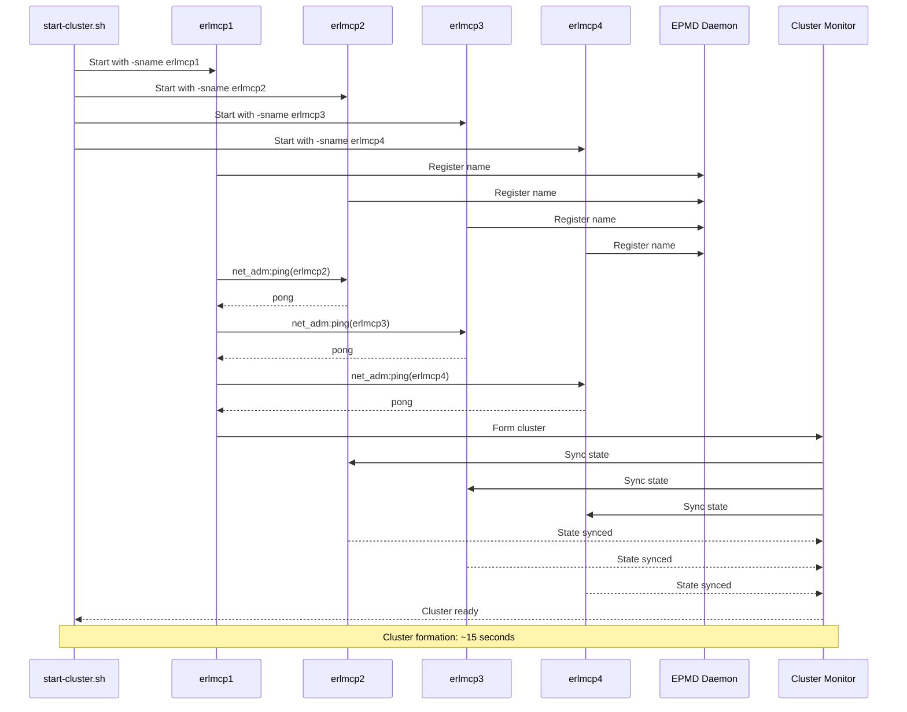
```mermaid
sequenceDiagram
    participant Script as start-cluster.sh
    participant Node1 as erlmcp1
    participant Node2 as erlmcp2
    participant Node3 as erlmcp3
    participant Node4 as erlmcp4
    participant EPMD as EPMD Daemon
    participant Monitor as Cluster Monitor

    Script->>Node1: Start with -sname erlmcp1
    Script->>Node2: Start with -sname erlmcp2
    Script->>Node3: Start with -sname erlmcp3
    Script->>Node4: Start with -sname erlmcp4

    Node1->>EPMD: Register name
    Node2->>EPMD: Register name
    Node3->>EPMD: Register name
    Node4->>EPMD: Register name

    Node1->>Node2: net_adm:ping(erlmcp2)
    Node2-->>Node1: pong

    Node1->>Node3: net_adm:ping(erlmcp3)
    Node3-->>Node1: pong

    Node1->>Node4: net_adm:ping(erlmcp4)
    Node4-->>Node1: pong

    Node1->>Monitor: Form cluster
    Monitor->>Node2: Sync state
    Monitor->>Node3: Sync state
    Monitor->>Node4: Sync state

    Node2-->>Monitor: State synced
    Node3-->>Monitor: State synced
    Node4-->>Monitor: State synced

    Monitor-->>Script: Cluster ready

    Note over Script,Monitor: Cluster formation: ~15 seconds
```

### Connection Distribution Flow

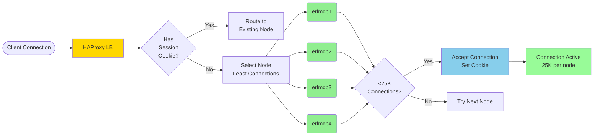
```mermaid
flowchart LR
    Client([Client Connection]) --> HAProxy[HAProxy LB]

    HAProxy --> CheckCookie{Has<br/>Session<br/>Cookie?}

    CheckCookie -->|Yes| RouteSticky[Route to<br/>Existing Node]
    CheckCookie -->|No| SelectNode[Select Node<br/>Least Connections]

    SelectNode --> N1(erlmcp1)
    SelectNode --> N2(erlmcp2)
    SelectNode --> N3(erlmcp3)
    SelectNode --> N4(erlmcp4)

    N1 --> CheckLimit{<25K<br/>Connections?}
    N2 --> CheckLimit
    N3 --> CheckLimit
    N4 --> CheckLimit

    CheckLimit -->|Yes| Accept[Accept Connection<br/>Set Cookie]
    CheckLimit -->|No| NextNode[Try Next Node]

    Accept --> Active[Connection Active<br/>25K per node]

    style HAProxy fill:#FFD700
    style N1 fill:#90EE90
    style N2 fill:#90EE90
    style N3 fill:#90EE90
    style N4 fill:#90EE90
    style Accept fill:#87CEEB
    style Active fill:#98FB98
```

---

## Node Configuration

### Node Startup Configuration

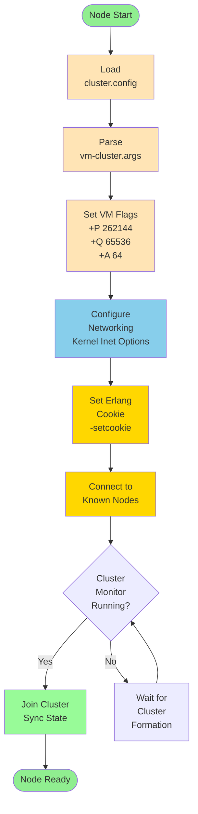
```mermaid
graph TB
    Start([Node Start]) --> LoadConfig[Load<br/>cluster.config]

    LoadConfig --> VMArgs[Parse<br/>vm-cluster.args]

    VMArgs --> SetFlags[Set VM Flags<br/>+P 262144<br/>+Q 65536<br/>+A 64]

    SetFlags --> Network[Configure<br/>Networking<br/>Kernel Inet Options]

    Network --> Cookie[Set Erlang<br/>Cookie<br/>-setcookie]

    Cookie --> Connect[Connect to<br/>Known Nodes]

    Connect --> Monitor{Cluster<br/>Monitor<br/>Running?}

    Monitor -->|Yes| Join[Join Cluster<br/>Sync State]
    Monitor -->|No| WaitFor[Wait for<br/>Cluster<br/>Formation]

    Join --> Ready([Node Ready])
    WaitFor --> Monitor

    style Start fill:#90EE90
    style Ready fill:#90EE90
    style LoadConfig fill:#FFE4B5
    style VMArgs fill:#FFE4B5
    style SetFlags fill:#FFE4B5
    style Network fill:#87CEEB
    style Cookie fill:#FFD700
    style Connect fill:#FFD700
    style Join fill:#98FB98
```

### Configuration Files

**cluster.config** (Key settings):
```erlang
[
  {erlmcp, [
    {cluster_mode, true},
    {max_connections, 25000},
    {known_nodes, [
      'erlmcp1@localhost',
      'erlmcp2@localhost',
      'erlmcp3@localhost',
      'erlmcp4@localhost'
    ]},
    {sync_strategy, lazy},
    {sync_interval, 1000}
  ]},
  {kernel, [
    {inet_dist_listen_min, 9100},
    {inet_dist_listen_max, 9120},
    {inet_default_connect_options, [
      {nodelay, true},
      {keepalive, true}
    ]},
    {inet_default_listen_options, [
      {backlog, 2048},
      {sendbuf, 2097152},  % 2MB
      {recbuf, 2097152},    % 2MB
      buffer,
      binary
    ]}
  ]}
].
```

**vm-cluster.args** (VM tuning):
```
+P 262144                % Max processes
+Q 65536                 % Max ports
+A 64                    % Async threads
+MBas aobf               % Allocator settings
+MHas 0                  % Binary heap settings
+IOt 4                   % IO thread pool
+sd 128                  % Dirty scheduler count
+swct very_high          % Context switch warning
+sbt db                  % Scheduler bind type
+fnu 524288              % Max file descriptors
-env ERL_MAX_PORTS 65536
-env ERL_MAX_ETS_TABLES 2000
```

---

## Load Balancing

### HAProxy Configuration

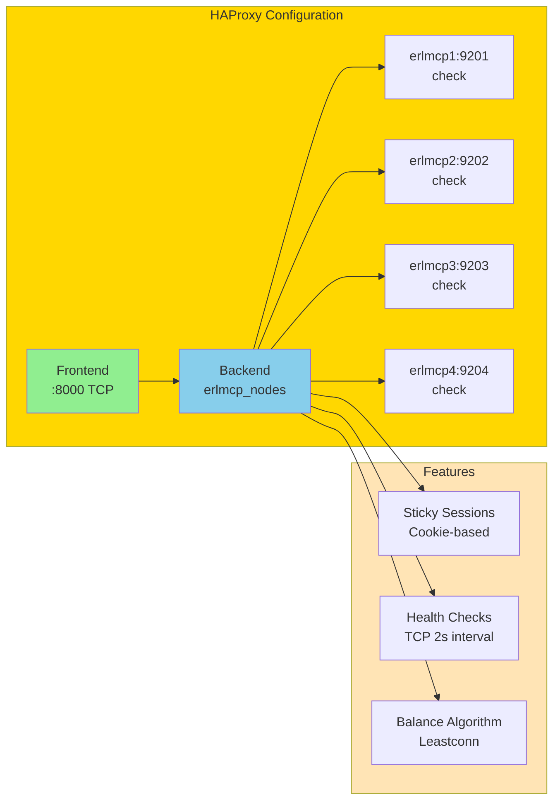
```mermaid
graph LR
    subgraph HAProxy["HAProxy Configuration"]
        Frontend[Frontend<br/>:8000 TCP]
        Backend[Backend<br/>erlmcp_nodes]

        Frontend --> Backend
        Backend --> N1[erlmcp1:9201<br/>check]
        Backend --> N2[erlmcp2:9202<br/>check]
        Backend --> N3[erlmcp3:9203<br/>check]
        Backend --> N4[erlmcp4:9204<br/>check]
    end

    subgraph Features["Features"]
        Sticky[Sticky Sessions<br/>Cookie-based]
        Health[Health Checks<br/>TCP 2s interval]
        Balance[Balance Algorithm<br/>Leastconn]
    end

    Backend --> Sticky
    Backend --> Health
    Backend --> Balance

    style HAProxy fill:#FFD700
    style Frontend fill:#90EE90
    style Backend fill:#87CEEB
    style Features fill:#FFE4B5
```

**haproxy.cfg** example:
```haproxy
frontend erlmcp_frontend
    bind *:8000
    mode tcp
    option tcplog
    default_backend erlmcp_nodes

backend erlmcp_nodes
    mode tcp
    balance leastconn
    stick-table type ip size 1m expire 5m
    stick on src
    option tcp-check
    tcp-check connect
    tcp-check send ping\r\n
    tcp-check expect string PONG

    server erlmcp1 erlmcp1:9201 check inter 2000 rise 2 fall 3
    server erlmcp2 erlmcp2:9202 check inter 2000 rise 2 fall 3
    server erlmcp3 erlmcp3:9203 check inter 2000 rise 2 fall 3
    server erlmcp4 erlmcp4:9204 check inter 2000 rise 2 fall 3

listen stats
    bind *:9001
    mode http
    stats enable
    stats uri /stats
    stats refresh 10s
```

---

## Monitoring Cluster

### Cluster Metrics Collection

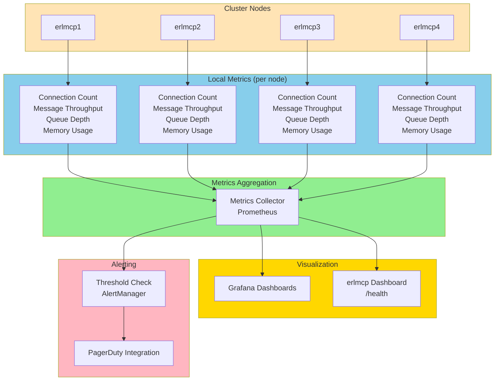
```mermaid
graph TD
    subgraph Nodes["Cluster Nodes"]
        N1[erlmcp1]
        N2[erlmcp2]
        N3[erlmcp3]
        N4[erlmcp4]
    end

    subgraph LocalMetrics["Local Metrics (per node)"]
        M1[Connection Count<br/>Message Throughput<br/>Queue Depth<br/>Memory Usage]
        M2[Connection Count<br/>Message Throughput<br/>Queue Depth<br/>Memory Usage]
        M3[Connection Count<br/>Message Throughput<br/>Queue Depth<br/>Memory Usage]
        M4[Connection Count<br/>Message Throughput<br/>Queue Depth<br/>Memory Usage]
    end

    subgraph Aggregation["Metrics Aggregation"]
        Collector[Metrics Collector<br/>Prometheus]
    end

    subgraph Visualization["Visualization"]
        Grafana[Grafana Dashboards]
        Dashboard[erlmcp Dashboard<br/>/health]
    end

    subgraph Alerting["Alerting"]
        Threshold[Threshold Check<br/>AlertManager]
        PagerDuty[PagerDuty Integration]
    end

    N1 --> M1
    N2 --> M2
    N3 --> M3
    N4 --> M4

    M1 --> Collector
    M2 --> Collector
    M3 --> Collector
    M4 --> Collector

    Collector --> Grafana
    Collector --> Dashboard
    Collector --> Threshold

    Threshold --> PagerDuty

    style Nodes fill:#FFE4B5
    style LocalMetrics fill:#87CEEB
    style Aggregation fill:#90EE90
    style Visualization fill:#FFD700
    style Alerting fill:#FFB6C1
```

### Health Check Sequence

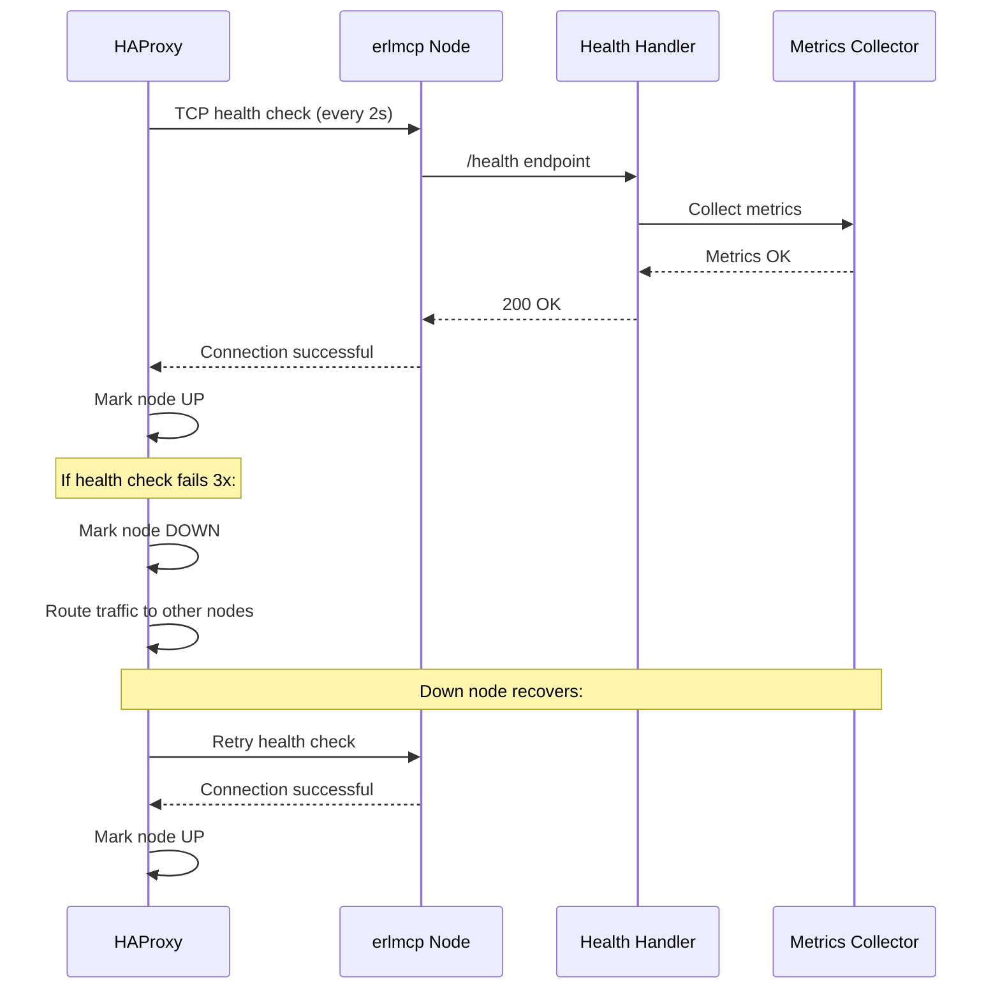
```mermaid
sequenceDiagram
    participant HA as HAProxy
    participant N as erlmcp Node
    participant H as Health Handler
    participant M as Metrics Collector

    HA->>N: TCP health check (every 2s)
    N->>H: /health endpoint
    H->>M: Collect metrics
    M-->>H: Metrics OK
    H-->>N: 200 OK
    N-->>HA: Connection successful
    HA->>HA: Mark node UP

    Note over HA,HA: If health check fails 3x:
    HA->>HA: Mark node DOWN
    HA->>HA: Route traffic to other nodes

    Note over HA,M: Down node recovers:
    HA->>N: Retry health check
    N-->>HA: Connection successful
    HA->>HA: Mark node UP
```

### Key Cluster Metrics

**Node Health**:
- Connection count (target: 25K)
- Message throughput (target: 30K msg/sec per node)
- Memory usage (target: <2GB per node)
- CPU utilization (target: <50%)
- GC pause times (target: <100ms p99)

**Cluster Health**:
- Total connections (target: 100K)
- Total throughput (target: 125K msg/sec)
- Node synchronization (target: 100% in sync)
- Split-brain status (target: no split brain detected)

---

## Failure Scenarios

### Node Failure Detection and Recovery

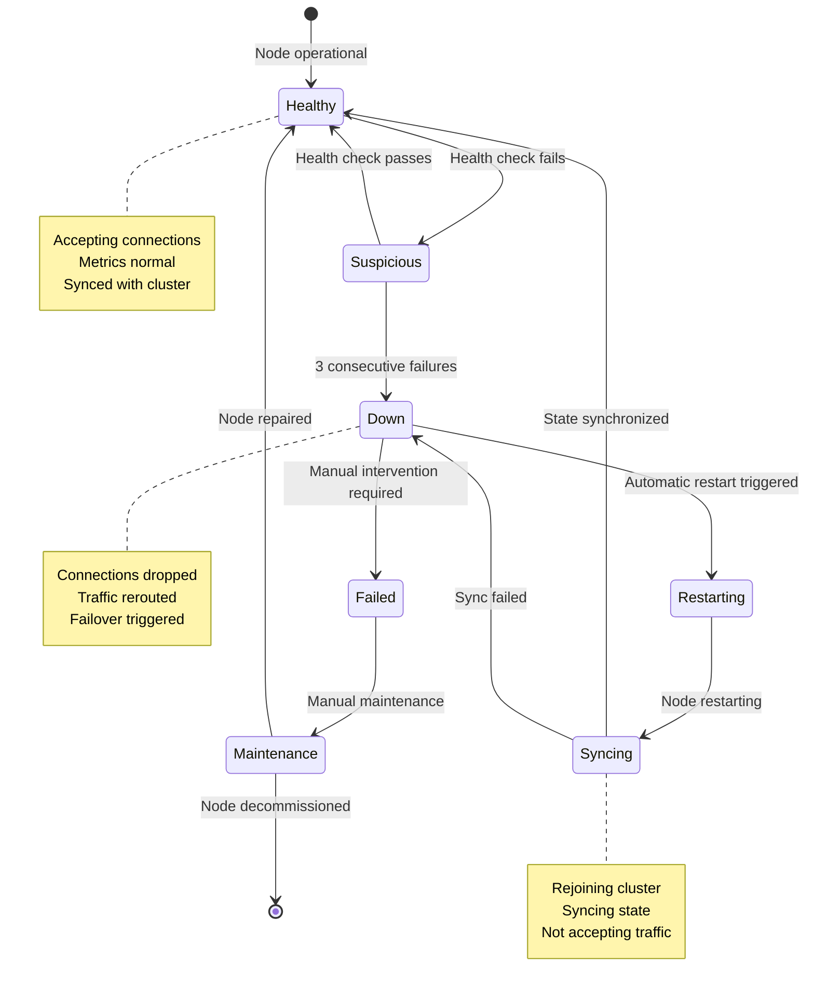
```mermaid
stateDiagram-v2
    [*] --> Healthy: Node operational

    Healthy --> Suspicious: Health check fails
    Suspicious --> Healthy: Health check passes
    Suspicious --> Down: 3 consecutive failures

    Down --> Restarting: Automatic restart triggered
    Down --> Failed: Manual intervention required

    Restarting --> Syncing: Node restarting
    Syncing --> Healthy: State synchronized
    Syncing --> Down: Sync failed

    Failed --> Maintenance: Manual maintenance
    Maintenance --> Healthy: Node repaired
    Maintenance --> [*]: Node decommissioned

    note right of Healthy
        Accepting connections
        Metrics normal
        Synced with cluster
    end note

    note right of Down
        Connections dropped
        Traffic rerouted
        Failover triggered
    end note

    note right of Syncing
        Rejoining cluster
        Syncing state
        Not accepting traffic
    end note
```

### Cluster Failure Matrix

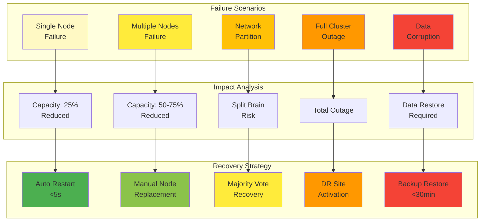
```mermaid
graph TB
    subgraph Scenarios["Failure Scenarios"]
        F1[Single Node<br/>Failure]
        F2[Multiple Nodes<br/>Failure]
        F3[Network<br/>Partition]
        F4[Full Cluster<br/>Outage]
        F5[Data<br/>Corruption]
    end

    subgraph Impact["Impact Analysis"]
        I1[Capacity: 25%<br/>Reduced]
        I2[Capacity: 50-75%<br/>Reduced]
        I3[Split Brain<br/>Risk]
        I4[Total Outage]
        I5[Data Restore<br/>Required]
    end

    subgraph Recovery["Recovery Strategy"]
        R1[Auto Restart<br/><5s]
        R2[Manual Node<br/>Replacement]
        R3[Majority Vote<br/>Recovery]
        R4[DR Site<br/>Activation]
        R5[Backup Restore<br/><30min]
    end

    F1 --> I1
    F2 --> I2
    F3 --> I3
    F4 --> I4
    F5 --> I5

    I1 --> R1
    I2 --> R2
    I3 --> R3
    I4 --> R4
    I5 --> R5

    style F1 fill:#FFF9C4
    style F2 fill:#FFEB3B
    style F3 fill:#FFC107
    style F4 fill:#FF9800
    style F5 fill:#F44336

    style R1 fill:#4CAF50
    style R2 fill:#8BC34A
    style R3 fill:#FFEB3B
    style R4 fill:#FF9800
    style R5 fill:#F44336
```

### Data Loss Recovery Flow

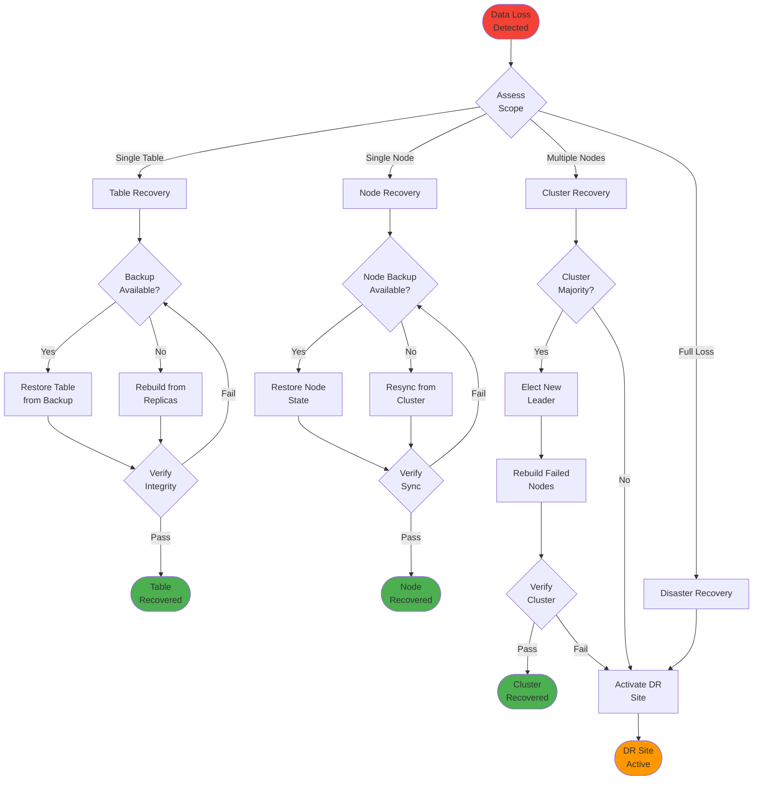
```mermaid
flowchart TD
    DataLoss([Data Loss<br/>Detected]) --> Assess{Assess<br/>Scope}

    Assess -->|Single Table| Table[Table Recovery]
    Assess -->|Single Node| Node[Node Recovery]
    Assess -->|Multiple Nodes| Cluster[Cluster Recovery]
    Assess -->|Full Loss| Disaster[Disaster Recovery]

    Table --> Backup1{Backup<br/>Available?}
    Backup1 -->|Yes| Restore1[Restore Table<br/>from Backup]
    Backup1 -->|No| Rebuild1[Rebuild from<br/>Replicas]

    Restore1 --> Verify1{Verify<br/>Integrity}
    Rebuild1 --> Verify1

    Verify1 -->|Pass| Complete1([Table<br/>Recovered])
    Verify1 -->|Fail| Backup1

    Node --> Backup2{Node Backup<br/>Available?}
    Backup2 -->|Yes| Restore2[Restore Node<br/>State]
    Backup2 -->|No| Resync[Resync from<br/>Cluster]

    Restore2 --> Verify2{Verify<br/>Sync}
    Resync --> Verify2

    Verify2 -->|Pass| Complete2([Node<br/>Recovered])
    Verify2 -->|Fail| Backup2

    Cluster --> Majority{Cluster<br/>Majority?}

    Majority -->|Yes| Elect[Elect New<br/>Leader]
    Majority -->|No| DR[Activate DR<br/>Site]

    Elect --> Rebuild[Rebuild Failed<br/>Nodes]
    Rebuild --> Verify3{Verify<br/>Cluster}

    Verify3 -->|Pass| Complete3([Cluster<br/>Recovered])
    Verify3 -->|Fail| DR

    DR --> Complete4([DR Site<br/>Active])

    Disaster --> DR

    style DataLoss fill:#F44336
    style Complete1 fill:#4CAF50
    style Complete2 fill:#4CAF50
    style Complete3 fill:#4CAF50
    style Complete4 fill:#FF9800
```

### Node Failure Flow

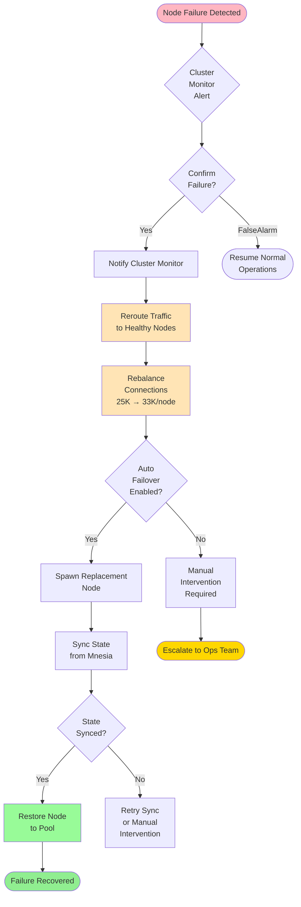
```mermaid
flowchart TD
    Start([Node Failure Detected]) --> Monitor{Cluster<br/>Monitor<br/>Alert}

    Monitor --> Confirm{Confirm<br/>Failure?}

    Confirm -->|Yes| Notify[Notify Cluster Monitor]
    Confirm -->|FalseAlarm| Resume([Resume Normal<br/>Operations])

    Notify --> Route[Reroute Traffic<br/>to Healthy Nodes]

    Route --> Rebalance[Rebalance<br/>Connections<br/>25K → 33K/node]

    Rebalance --> Failover{Auto<br/>Failover<br/>Enabled?}

    Failover -->|Yes| Spawn[Spawn Replacement<br/>Node]
    Failover -->|No| Manual[Manual<br/>Intervention<br/>Required]

    Spawn --> Sync[Sync State<br/>from Mnesia]

    Sync --> Verify{State<br/>Synced?}

    Verify -->|Yes| Restore[Restore Node<br/>to Pool]
    Verify -->|No| Retry[Retry Sync<br/>or Manual<br/>Intervention]

    Restore --> Complete([Failure Recovered])

    Manual --> Escalate([Escalate to Ops Team])

    style Start fill:#FFB6C1
    style Complete fill:#90EE90
    style Escalate fill:#FFD700
    style Route fill:#FFE4B5
    style Rebalance fill:#FFE4B5
    style Restore fill:#98FB98
```

### Network Partition Handling

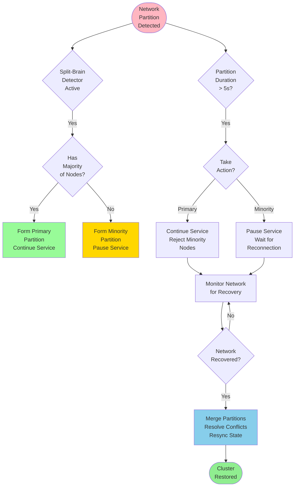
```mermaid
flowchart TD
    Partition([Network<br/>Partition<br/>Detected]) --> Monitor{Split-Brain<br/>Detector<br/>Active}

    Monitor -->|Yes| Majority{Has<br/>Majority<br/>of Nodes?}

    Majority -->|Yes| Primary[Form Primary<br/>Partition<br/>Continue Service]
    Majority -->|No| Minority[Form Minority<br/>Partition<br/>Pause Service]

    Partition --> Timer{Partition<br/>Duration<br/>> 5s?}

    Timer -->|Yes| Action{Take<br/>Action?}

    Action -->|Primary| Continue[Continue Service<br/>Reject Minority<br/>Nodes]
    Action -->|Minority| Pause[Pause Service<br/>Wait for<br/>Reconnection]

    Continue --> MonitorNetwork[Monitor Network<br/>for Recovery]

    Pause --> MonitorNetwork

    MonitorNetwork --> Recovered{Network<br/>Recovered?}

    Recovered -->|Yes| Merge[Merge Partitions<br/>Resolve Conflicts<br/>Resync State]
    Recovered -->|No| MonitorNetwork

    Merge --> Complete([Cluster<br/>Restored])

    style Partition fill:#FFB6C1
    style Complete fill:#90EE90
    style Primary fill:#98FB98
    style Minority fill:#FFD700
    style Merge fill:#87CEEB
```

---

## Maintenance Procedures

### Rolling Upgrade Flow

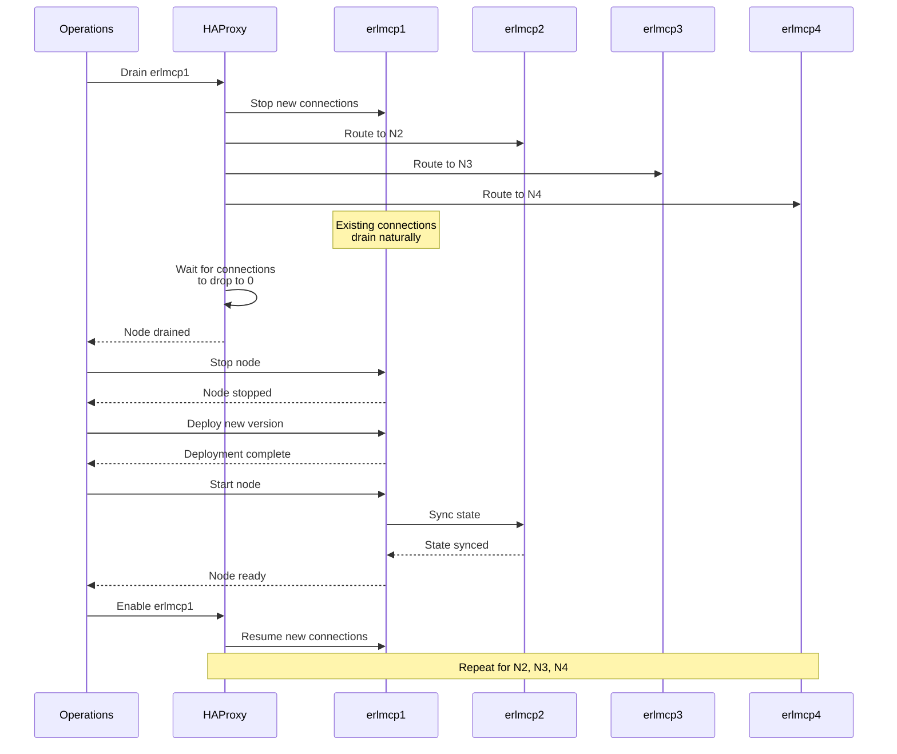
```mermaid
sequenceDiagram
    participant Ops as Operations
    participant HA as HAProxy
    participant N1 as erlmcp1
    participant N2 as erlmcp2
    participant N3 as erlmcp3
    participant N4 as erlmcp4

    Ops->>HA: Drain erlmcp1
    HA->>N1: Stop new connections
    HA->>N2: Route to N2
    HA->>N3: Route to N3
    HA->>N4: Route to N4

    Note over N1: Existing connections<br/>drain naturally

    HA->>HA: Wait for connections<br/>to drop to 0
    HA-->>Ops: Node drained

    Ops->>N1: Stop node
    N1-->>Ops: Node stopped

    Ops->>N1: Deploy new version
    N1-->>Ops: Deployment complete

    Ops->>N1: Start node
    N1->>N2: Sync state
    N2-->>N1: State synced

    N1-->>Ops: Node ready

    Ops->>HA: Enable erlmcp1
    HA->>N1: Resume new connections

    Note over HA,N4: Repeat for N2, N3, N4
```

### Zero-Downtime Deployment Steps

**Step 1: Prepare New Release**
```bash
# Build new version
rebar3 as prod release

# Verify release
./scripts/verify-release.sh _build/prod/rel/erlmcp
```

**Step 2: Drain First Node**
```bash
# Tell HAProxy to stop sending traffic
curl -X POST http://localhost:9001/api/v2/services/proxy/haproxy/stats \
  -d '{"backend":"erlmcp_nodes","server":"erlmcp1","state":"drain"}'

# Wait for connections to drop to 0
watch -n 5 'curl http://localhost:8000/health | jq .connections'
```

**Step 3: Upgrade Node**
```bash
# Stop node
ssh erlmcp1 "/opt/erlmcp/bin/erlmcp stop"

# Backup old release
ssh erlmcp1 "cp -r /opt/erlmcp /opt/erlmcp.backup.$(date +%Y%m%d_%H%M%S)"

# Deploy new release
scp -r _build/prod/rel/erlmcp erlmcp1:/opt/erlmcp.new
ssh erlmcp1 "mv /opt/erlmcp /opt/erlmcp.old && mv /opt/erlmcp.new /opt/erlmcp"

# Start node
ssh erlmcp1 "/opt/erlmcp/bin/erlmcp start"

# Verify health
curl http://erlmcp1:9201/health
```

**Step 4: Re-enable Node**
```bash
# Re-enable in HAProxy
curl -X POST http://localhost:9001/api/v2/services/proxy/haproxy/stats \
  -d '{"backend":"erlmcp_nodes","server":"erlmcp1","state":"ready"}'

# Verify cluster balance
./scripts/cluster-status.sh
```

**Step 5: Repeat for Remaining Nodes**
- Follow steps 2-4 for erlmcp2, erlmcp3, erlmcp4

### Capacity Scaling

**Adding a New Node**:

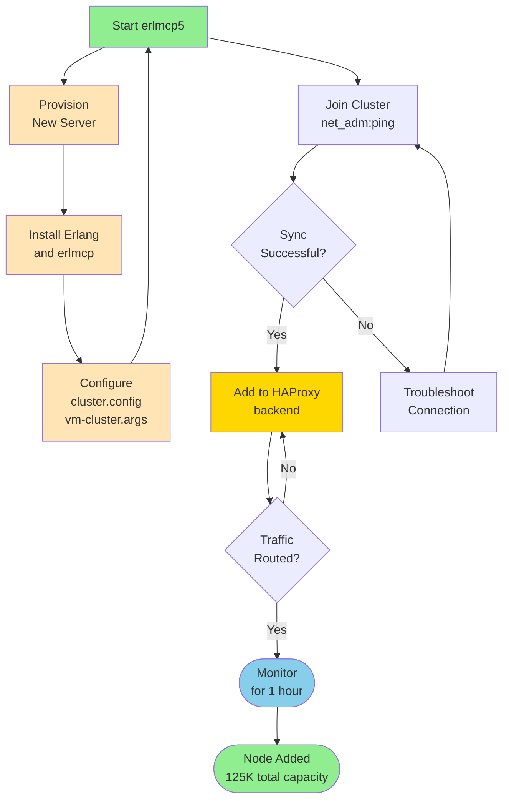
```mermaid
flowchart TD
    Start([Add Node 5]) --> Provision[Provision<br/>New Server]

    Provision --> Install[Install Erlang<br/>and erlmcp]

    Install --> Config[Configure<br/>cluster.config<br/>vm-cluster.args]

    Config --> Start[Start erlmcp5]

    Start --> Join[Join Cluster<br/>net_adm:ping]

    Join --> Sync{Sync<br/>Successful?}

    Sync -->|Yes| HAProxy[Add to HAProxy<br/>backend]
    Sync -->|No| Troubleshoot[Troubleshoot<br/>Connection]

    HAProxy --> Verify{Traffic<br/>Routed?}

    Verify -->|Yes| Monitor([Monitor<br/>for 1 hour])
    Verify -->|No| HAProxy

    Monitor --> Complete([Node Added<br/>125K total capacity])

    Troubleshoot --> Join

    style Start fill:#90EE90
    style Complete fill:#90EE90
    style Provision fill:#FFE4B5
    style Install fill:#FFE4B5
    style Config fill:#FFE4B5
    style HAProxy fill:#FFD700
    style Monitor fill:#87CEEB
```

---

## Quick Reference

### Essential Commands

```bash
# Start cluster
./scripts/start-cluster.sh start

# Check cluster status
./scripts/start-cluster.sh status

# View logs
tail -f logs/cluster/erlmcp*.log

# Connect to cluster
erl -setcookie erlmcp_cluster -sname monitor

# In Erlang shell
net_adm:ping('erlmcp1@localhost').
nodes().
erlmcp_cluster_monitor:get_cluster_status().

# Stop cluster
./scripts/start-cluster.sh stop

# Run load test
erl -setcookie erlmcp_cluster -sname load_gen -noshell \
  -pa _build/default/lib/*/ebin \
  -eval "load_generator:generate_load(100000, 60)."
```

### Troubleshooting Commands

```bash
# Check EPMD
epmd -names

# Check node connectivity
erl -setcookie erlmcp_cluster -sname test
net_adm:ping('erlmcp1@localhost').

# Check process count on node
rpc:call('erlmcp1@localhost', erlang, system_info, [process_count]).

# Check memory on node
rpc:call('erlmcp1@localhost', erlang, memory, [total]).

# Check connections
rpc:call('erlmcp1@localhost', erlmcp_registry, count, [connections]).

# Force restart node
rpc:call('erlmcp1@localhost', init, restart, []).

# View crash dump
cat /var/log/erlmcp/erl_crash.dump
```

---

## Multi-Region Deployment

### Cross-Region Architecture

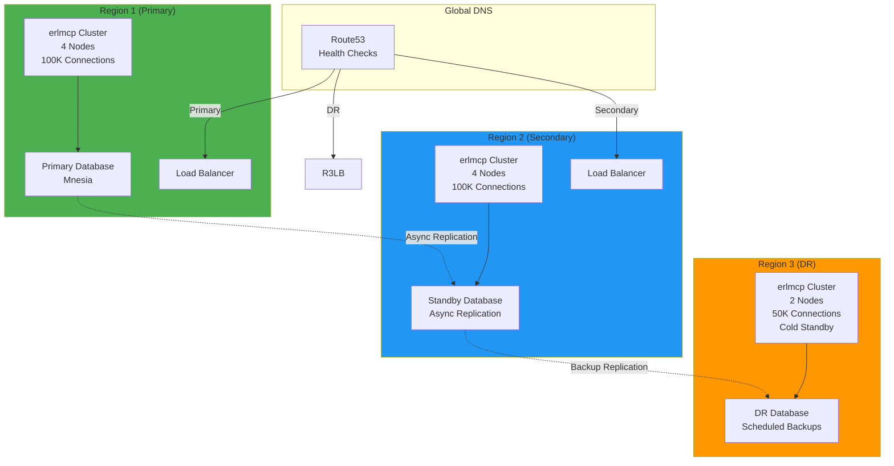
```mermaid
graph TB
    subgraph Region1["Region 1 (Primary)"]
        R1Cluster[erlmcp Cluster<br/>4 Nodes<br/>100K Connections]
        R1DB[Primary Database<br/>Mnesia]
        R1LB[Load Balancer]
    end

    subgraph Region2["Region 2 (Secondary)"]
        R2Cluster[erlmcp Cluster<br/>4 Nodes<br/>100K Connections]
        R2DB[Standby Database<br/>Async Replication]
        R2LB[Load Balancer]
    end

    subgraph Region3["Region 3 (DR)"]
        R3Cluster[erlmcp Cluster<br/>2 Nodes<br/>50K Connections<br/>Cold Standby]
        R3DB[DR Database<br/>Scheduled Backups]
    end

    subgraph DNS["Global DNS"]
        Route53[Route53<br/>Health Checks]
    end

    Route53 -->|Primary| R1LB
    Route53 -->|Secondary| R2LB
    Route53 -->|DR| R3LB

    R1Cluster --> R1DB
    R2Cluster --> R2DB
    R3Cluster --> R3DB

    R1DB -.->|Async Replication| R2DB
    R2DB -.->|Backup Replication| R3DB

    style Region1 fill:#4CAF50
    style Region2 fill:#2196F3
    style Region3 fill:#FF9800
```

### Failover Sequence

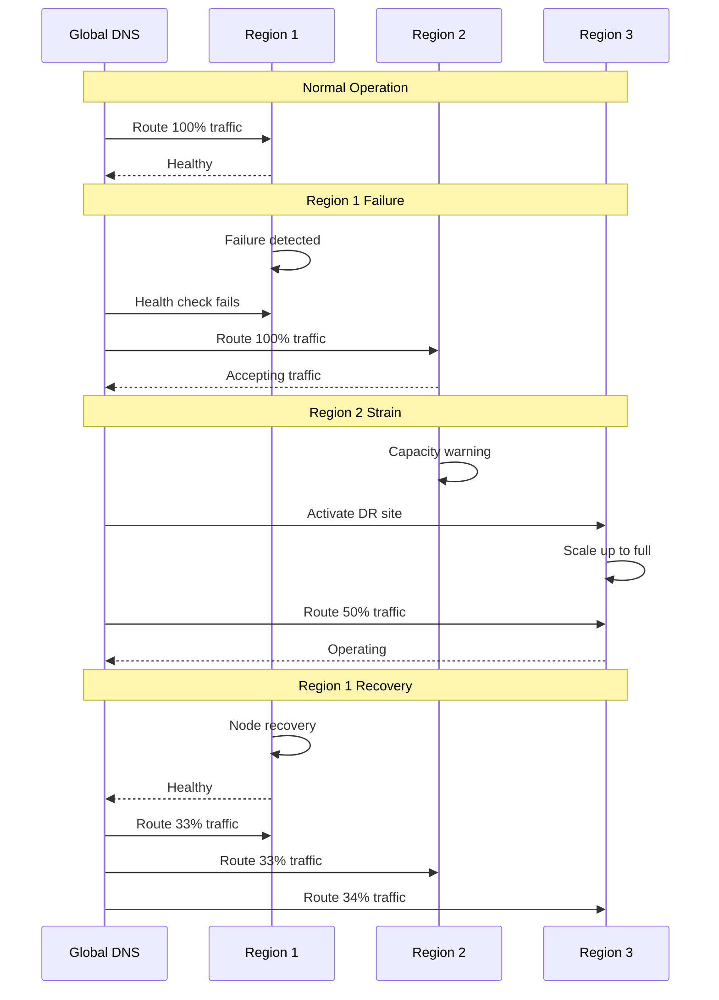
```mermaid
sequenceDiagram
    participant DNS as Global DNS
    participant R1 as Region 1
    participant R2 as Region 2
    participant R3 as Region 3

    Note over DNS,R3: Normal Operation
    DNS->>R1: Route 100% traffic
    R1-->>DNS: Healthy

    Note over DNS,R3: Region 1 Failure
    R1->>R1: Failure detected
    DNS->>R1: Health check fails
    DNS->>R2: Route 100% traffic
    R2-->>DNS: Accepting traffic

    Note over DNS,R3: Region 2 Strain
    R2->>R2: Capacity warning
    DNS->>R3: Activate DR site
    R3->>R3: Scale up to full
    DNS->>R3: Route 50% traffic
    R3-->>DNS: Operating

    Note over DNS,R3: Region 1 Recovery
    R1->>R1: Node recovery
    R1-->>DNS: Healthy
    DNS->>R1: Route 33% traffic
    DNS->>R2: Route 33% traffic
    DNS->>R3: Route 34% traffic
```

## Security Considerations

### Cluster Security Architecture

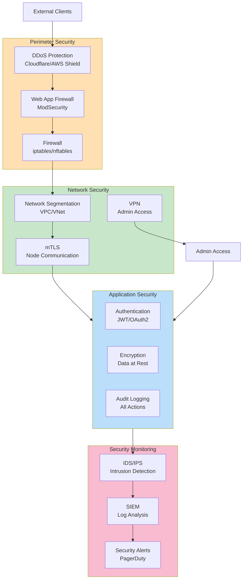
```mermaid
graph TB
    subgraph Perimeter["Perimeter Security"]
        FW[Firewall<br/>iptables/nftables]
        DDoS[DDoS Protection<br/>Cloudflare/AWS Shield]
        WAF[Web App Firewall<br/>ModSecurity]
    end

    subgraph Network["Network Security"]
        TLS[mTLS<br/>Node Communication]
        VPN[VPN<br/>Admin Access]
        Seg[Network Segmentation<br/>VPC/VNet]
    end

    subgraph Application["Application Security"]
        Auth[Authentication<br/>JWT/OAuth2]
        Enc[Encryption<br/>Data at Rest]
        Audit[Audit Logging<br/>All Actions]
    end

    subgraph Monitoring["Security Monitoring"]
        IDS[IDS/IPS<br/>Intrusion Detection]
        SIEM[SIEM<br/>Log Analysis]
        Alert[Security Alerts<br/>PagerDuty]
    end

    Client[External Clients] --> DDoS
    DDoS --> WAF
    WAF --> FW
    FW --> Seg

    Seg --> TLS
    TLS --> Application

    VPN --> Admin[Admin Access]
    Admin --> Application

    Application --> IDS
    IDS --> SIEM
    SIEM --> Alert

    style Perimeter fill:#FFE0B2
    style Network fill:#C8E6C9
    style Application fill:#BBDEFB
    style Monitoring fill:#F8BBD0
```

### Certificate Management

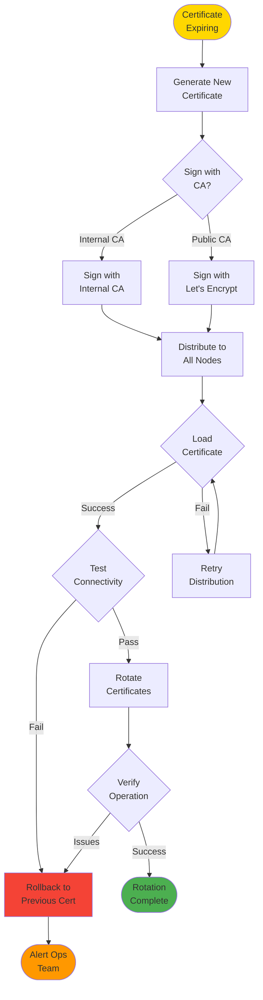
```mermaid
flowchart TD
    Start([Certificate<br/>Expiring]) --> Generate[Generate New<br/>Certificate]

    Generate --> Sign{Sign with<br/>CA?}

    Sign -->|Internal CA| Sign1[Sign with<br/>Internal CA]
    Sign -->|Public CA| Sign2[Sign with<br/>Let's Encrypt]

    Sign1 --> Distribute[Distribute to<br/>All Nodes]
    Sign2 --> Distribute

    Distribute --> Load{Load<br/>Certificate}

    Load -->|Success| Test{Test<br/>Connectivity}
    Load -->|Fail| Retry[Retry<br/>Distribution]

    Retry --> Load

    Test -->|Pass| Rotate[Rotate<br/>Certificates]
    Test -->|Fail| Rollback[Rollback to<br/>Previous Cert]

    Rotate --> Verify{Verify<br/>Operation}

    Verify -->|Success| Complete([Rotation<br/>Complete])
    Verify -->|Issues| Rollback

    Rollback --> Alert([Alert Ops<br/>Team])

    style Start fill:#FFD700
    style Complete fill:#4CAF50
    style Rollback fill:#F44336
    style Alert fill:#FF9800
```

## References

- **Cluster Setup**: [CLUSTER_SETUP.md](./CLUSTER_SETUP.md)
- **Quick Start**: [CLUSTER_QUICK_START.md](./CLUSTER_QUICK_START.md)
- **Deployment Guide**: [DEPLOYMENT_GUIDE_100X.md](./DEPLOYMENT_GUIDE_100X.md)
- **Architecture**: [../docs/architecture.md](../docs/architecture.md)
- **OTP Patterns**: [../docs/otp-patterns.md](../docs/otp-patterns.md)

---

**Last Updated**: 2026-01-31
**Version**: 2.1.0
**Maintained By**: erlmcp Team
