# erlmcp Kubernetes Deployment Guide

**Version**: 2.1.0
**Status**: Production Ready
**Target**: Auto-scaling erlmcp cluster on Kubernetes

## Table of Contents

1. [Overview](#overview)
2. [Architecture](#architecture)
3. [Prerequisites](#prerequisites)
4. [Deployment Manifests](#deployment-manifests)
5. [Service Mesh](#service-mesh)
6. [Auto-Scaling](#auto-scaling)
7. [Monitoring](#monitoring)
8. [Failure Scenarios](#failure-scenarios)
9. [Maintenance](#maintenance)

---

## Overview

Kubernetes deployment provides cloud-native orchestration for erlmcp with automatic scaling, self-healing, and rolling updates. This guide covers deploying erlmcp on Kubernetes using best practices for stateful distributed systems.

**Key Features**:
- **Horizontal Pod Autoscaling**: Scale based on connections/CPU/memory
- **Self-Healing**: Automatic pod restart and node failover
- **Rolling Updates**: Zero-downtime deployments
- **StatefulSets**: Stable network identities for cluster nodes
- **Service Discovery**: Automatic DNS-based discovery
- **ConfigMaps/Secrets**: Configuration and secrets management

---

## Architecture

### Kubernetes Architecture

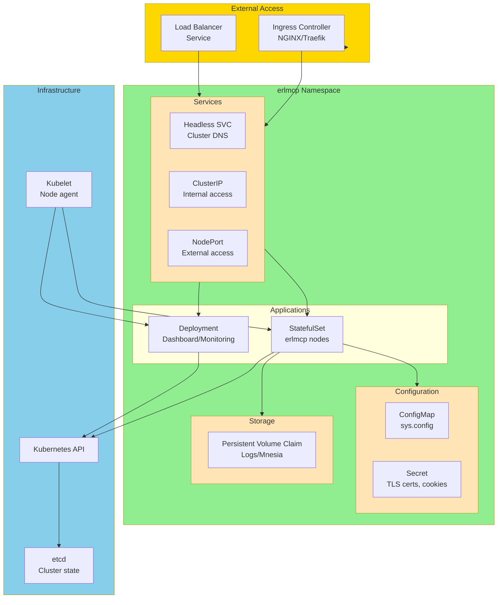

### Pod Architecture

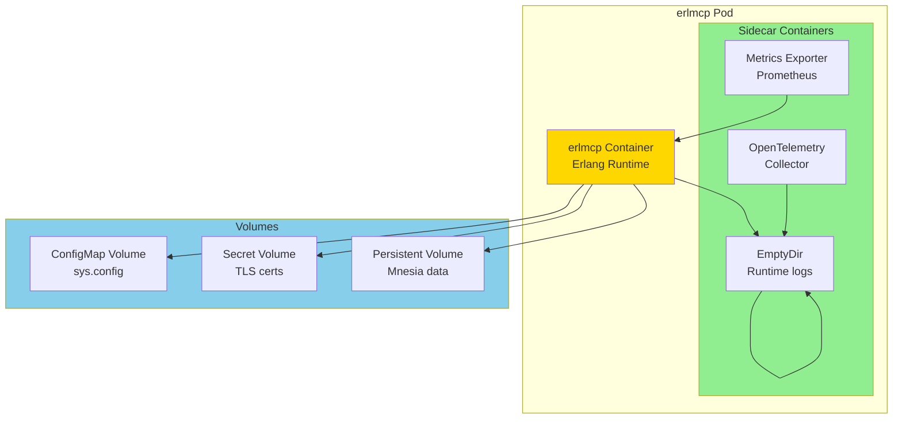

---

## Prerequisites

### Cluster Requirements

**Minimum Cluster**:
- Kubernetes version: 1.27+
- Nodes: 3 (for high availability)
- Node specs: 4 vCPU, 8GB RAM
- Total capacity: 12 vCPU, 24GB RAM

**Recommended Production**:
- Kubernetes version: 1.28+
- Nodes: 5+ (for scaling)
- Node specs: 8 vCPU, 16GB RAM
- Total capacity: 40+ vCPU, 80+ GB RAM

### Software Requirements

```bash
# kubectl configured
kubectl version --client

# Cluster access verified
kubectl cluster-info

# Namespace created
kubectl create namespace erlmcp

# Storage class available
kubectl get storageclass
```

---

## Deployment Manifests

### Namespace

```yaml
# k8s/namespace.yaml
apiVersion: v1
kind: Namespace
metadata:
  name: erlmcp
  labels:
    name: erlmcp
    app: erlmcp
```

### ConfigMap

```yaml
# k8s/configmap.yaml
apiVersion: v1
kind: ConfigMap
metadata:
  name: erlmcp-config
  namespace: erlmcp
data:
  sys.config: |
    [
      {erlmcp, [
        {cluster_mode, true},
        {max_connections, 25000},
        {enable_sharded_registry, true},
        {registry_shards, 256},
        {enable_backpressure, true},
        {enable_circuit_breaker, true},
        {enable_otel_traces, true},
        {otel_exporter, grpc},
        {otel_endpoint, "otel-collector:4317"}
      ]},
      {kernel, [
        {inet_dist_listen_min, 9100},
        {inet_dist_listen_max, 9120},
        {inet_default_connect_options, [
          {nodelay, true},
          {keepalive, true}
        ]}
      ]}
    ].
  vm.args: |
    +P 262144
    +Q 65536
    +A 64
    +MBas aobf
    +sbt db
    +sd 128
    +fnu 524288
    -setcookie ERLMCP_CLUSTER_COOKIE
    -env ERL_MAX_PORTS 65536
    -env ERL_MAX_ETS_TABLES 2000
```

### Secrets

```yaml
# k8s/secrets.yaml
apiVersion: v1
kind: Secret
metadata:
  name: erlmcp-secrets
  namespace: erlmcp
type: Opaque
data:
  erlang-cookie: RVJMTUNQX0NMVVNURVJfQ09PS0lF  # Base64 encoded
  jwt-secret: <base64-encoded-jwt-secret>
  tls-cert: <base64-encoded-tls-cert>
  tls-key: <base64-encoded-tls-key>
```

### StatefulSet

```yaml
# k8s/statefulset.yaml
apiVersion: apps/v1
kind: StatefulSet
metadata:
  name: erlmcp
  namespace: erlmcp
spec:
  serviceName: erlmcp-headless
  replicas: 4
  selector:
    matchLabels:
      app: erlmcp
  template:
    metadata:
      labels:
        app: erlmcp
      annotations:
        prometheus.io/scrape: "true"
        prometheus.io/port: "9090"
    spec:
      containers:
      - name: erlmcp
        image: erlmcp:2.1.0
        ports:
        - containerPort: 9201
          name: dist
        - containerPort: 8080
          name: http
        - containerPort: 9090
          name: metrics
        env:
        - name: MY_POD_NAME
          valueFrom:
            fieldRef:
              fieldPath: metadata.name
        - name: MY_POD_IP
          valueFrom:
            fieldRef:
              fieldPath: status.podIP
        - name: ERLANG_COOKIE
          valueFrom:
            secretKeyRef:
              name: erlmcp-secrets
              key: erlang-cookie
        volumeMounts:
        - name: config
          mountPath: /opt/erlmcp/releases/2.1.0/sys.config
          subPath: sys.config
        - name: config
          mountPath: /opt/erlmcp/releases/2.1.0/vm.args
          subPath: vm.args
        - name: data
          mountPath: /var/lib/erlmcp
        - name: certs
          mountPath: /etc/erlmcp/certs
          readOnly: true
        resources:
          requests:
            cpu: "2"
            memory: "4Gi"
          limits:
            cpu: "4"
            memory: "8Gi"
        livenessProbe:
          httpGet:
            path: /health
            port: 8080
          initialDelaySeconds: 30
          periodSeconds: 10
        readinessProbe:
          httpGet:
            path: /ready
            port: 8080
          initialDelaySeconds: 10
          periodSeconds: 5
      - name: otel-collector
        image: otel/opentelemetry-collector:0.91.0
        ports:
        - containerPort: 4317
          name: otlp-grpc
        command:
        - /otelcol
        - --config=/etc/otelcol-config.yaml
        volumeMounts:
        - name: otel-config
          mountPath: /etc/otelcol-config.yaml
          subPath: otelcol-config.yaml
      volumes:
      - name: config
        configMap:
          name: erlmcp-config
      - name: certs
        secret:
          secretName: erlmcp-secrets
      - name: otel-config
        configMap:
          name: otel-config
  volumeClaimTemplates:
  - metadata:
      name: data
    spec:
      accessModes: [ "ReadWriteOnce" ]
      storageClassName: "fast-ssd"
      resources:
        requests:
          storage: 10Gi
```

### Services

```yaml
# k8s/services.yaml
---
# Headless service for StatefulSet
apiVersion: v1
kind: Service
metadata:
  name: erlmcp-headless
  namespace: erlmcp
spec:
  clusterIP: None
  selector:
    app: erlmcp
  ports:
  - port: 9201
    name: dist
  - port: 8080
    name: http
---
# ClusterIP for internal access
apiVersion: v1
kind: Service
metadata:
  name: erlmcp
  namespace: erlmcp
spec:
  type: ClusterIP
  selector:
    app: erlmcp
  ports:
  - port: 8080
    targetPort: 8080
    name: http
  - port: 9090
    targetPort: 9090
    name: metrics
---
# NodePort for external access
apiVersion: v1
kind: Service
metadata:
  name: erlmcp-external
  namespace: erlmcp
spec:
  type: NodePort
  selector:
    app: erlmcp
  ports:
  - port: 8080
    targetPort: 8080
    nodePort: 30080
    name: http
```

### Horizontal Pod Autoscaler

```yaml
# k8s/hpa.yaml
apiVersion: autoscaling/v2
kind: HorizontalPodAutoscaler
metadata:
  name: erlmcp-hpa
  namespace: erlmcp
spec:
  scaleTargetRef:
    apiVersion: apps/v1
    kind: StatefulSet
    name: erlmcp
  minReplicas: 4
  maxReplicas: 20
  metrics:
  - type: Resource
    resource:
      name: cpu
      target:
        type: Utilization
        averageUtilization: 70
  - type: Resource
    resource:
      name: memory
      target:
        type: Utilization
        averageUtilization: 80
  behavior:
    scaleDown:
      stabilizationWindowSeconds: 300
      policies:
      - type: Percent
        value: 50
        periodSeconds: 60
    scaleUp:
      stabilizationWindowSeconds: 0
      policies:
      - type: Percent
        value: 100
        periodSeconds: 30
      - type: Pods
        value: 2
        periodSeconds: 30
      selectPolicy: Max
```

### Pod Disruption Budget

```yaml
# k8s/pdb.yaml
apiVersion: policy/v1
kind: PodDisruptionBudget
metadata:
  name: erlmcp-pdb
  namespace: erlmcp
spec:
  minAvailable: 2
  selector:
    matchLabels:
      app: erlmcp
```

---

## Service Mesh

### Istio Integration (Optional)

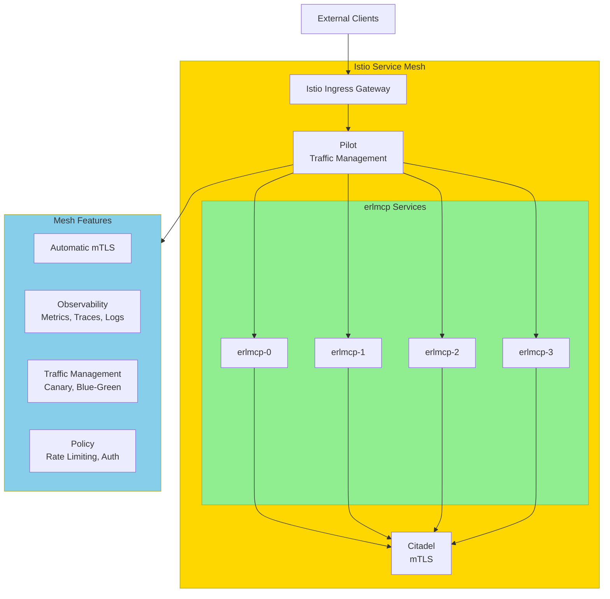

**Istio VirtualService** example:
```yaml
apiVersion: networking.istio.io/v1beta1
kind: VirtualService
metadata:
  name: erlmcp
  namespace: erlmcp
spec:
  hosts:
  - "erlmcp.example.com"
  gateways:
  - erlmcp-gateway
  http:
  - match:
    - uri:
        prefix: /
    route:
    - destination:
        host: erlmcp
        subset: v2
      weight: 100
  - retry:
      attempts: 3
      perTryTimeout: 2s
```

---

## Auto-Scaling

### Scaling Flow Diagram

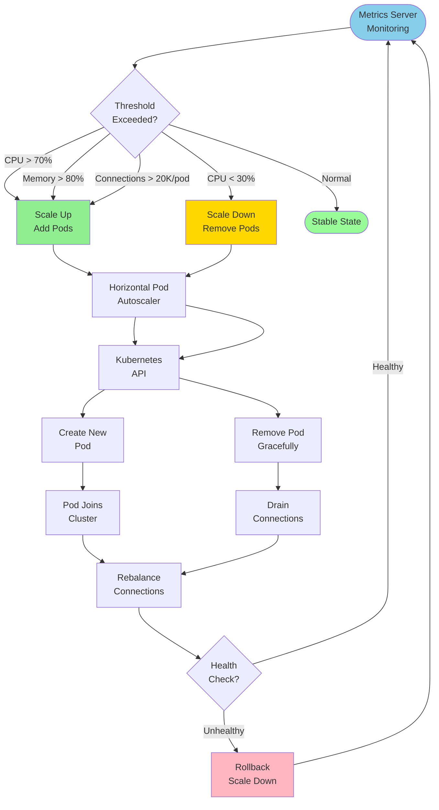

### Scaling Policies

**Scale Up** (when CPU > 70% or Memory > 80%):
- Add pods up to maxReplicas: 20
- Rate: 100% per 30 seconds (doubling)
- Or: Add 2 pods per 30 seconds (whichever is higher)

**Scale Down** (when CPU < 30% for 5 minutes):
- Remove pods down to minReplicas: 4
- Rate: 50% per 60 seconds
- Stabilization window: 300 seconds (5 minutes)

---

## Monitoring

### Prometheus Monitoring

```mermaid
graph LR
    subgraph Pods["erlmcp Pods"]
        P1[erlmcp-0]
        P2[erlmcp-1]
        P3[erlmcp-2]
        P4[erlmcp-3]
    end

    subgraph Metrics["Metrics Collection"]
        Exporters[/metrics endpoint]
        Annotations[prometheus.io annotations]
    end

    subgraph Prometheus["Prometheus Stack"]
        Scrape[Prometheus<br/>Scrape Config]
        Alert[AlertManager<br/>Alerts]
        Grafana[Grafana<br/>Dashboards]
    end

    P1 --> Exporters
    P2 --> Exporters
    P3 --> Exporters
    P4 --> Exporters

    Exporters --> Scrape
    Annotations --> Scrape

    Scrape --> Alert
    Scrape --> Grafana

    style Pods fill:#FFE4B5
    style Metrics fill:#90EE90
    style Prometheus fill:#87CEEB
```

**Prometheus ServiceMonitor** (if using Prometheus Operator):
```yaml
apiVersion: monitoring.coreos.com/v1
kind: ServiceMonitor
metadata:
  name: erlmcp
  namespace: erlmcp
spec:
  selector:
    matchLabels:
      app: erlmcp
  endpoints:
  - port: metrics
    interval: 15s
    path: /metrics
```

### Key Metrics to Monitor

**Pod Metrics**:
- CPU usage (target: <70%)
- Memory usage (target: <80%)
- Network I/O (bytes/sec)
- Restarts (target: 0)
- Age (uptime)

**Application Metrics**:
- Connections per pod (target: <25K)
- Message throughput (msg/sec)
- P50/P95/P99 latency
- Error rate (target: <0.1%)
- Circuit breaker state

**Cluster Metrics**:
- Total pods (min: 4, max: 20)
- Ready pods (target: 100%)
- Pending pods (target: 0)
- Pod distribution across nodes

---

## Failure Scenarios

### Pod Failure Recovery

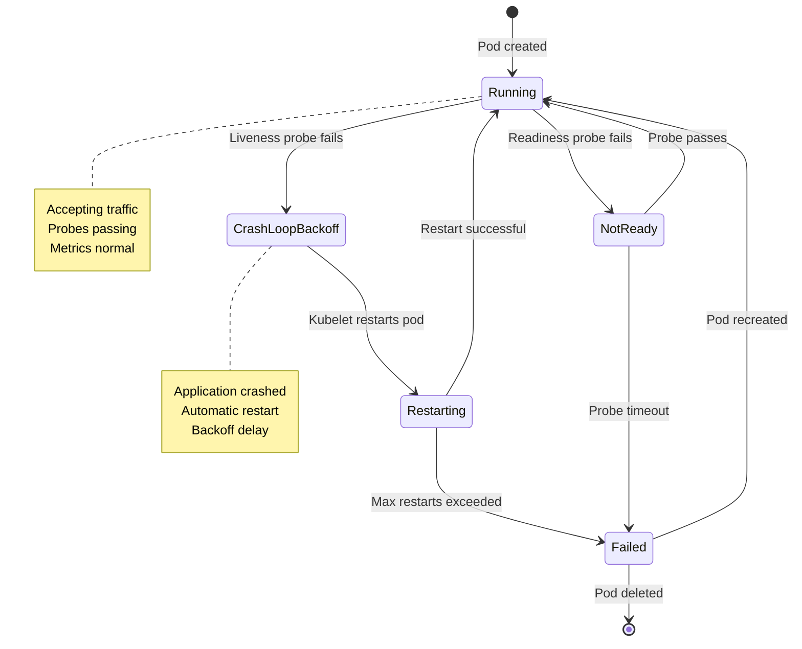

### Kubernetes Resource Failure Matrix

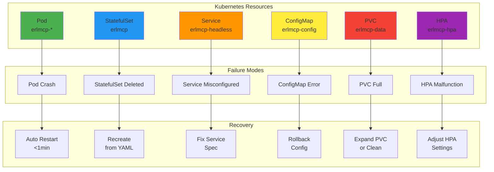

### Persistent Volume Failure Recovery

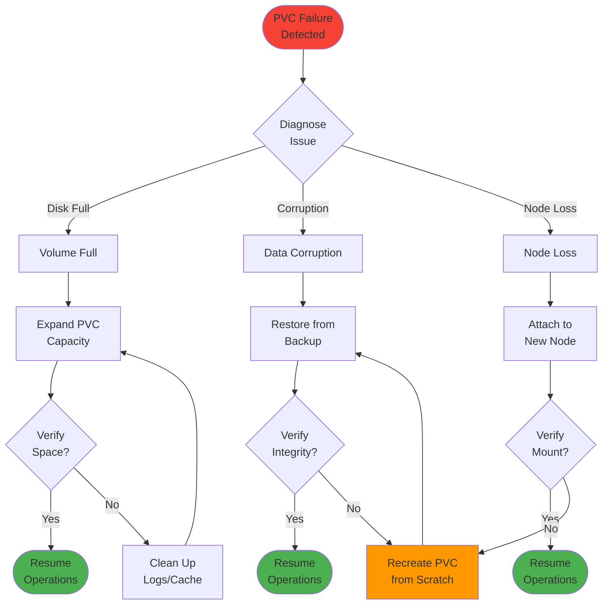

### Node Failure Handling

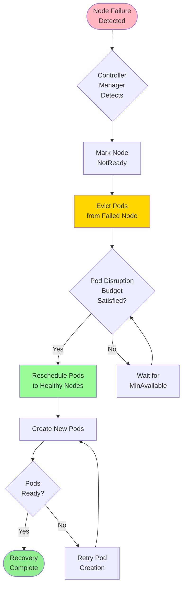

### Network Partition Handling

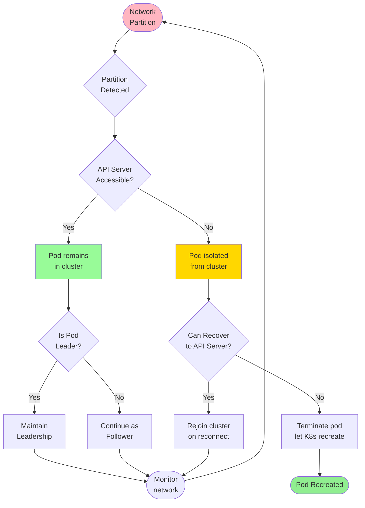

---

## Maintenance

### Rolling Update Flow

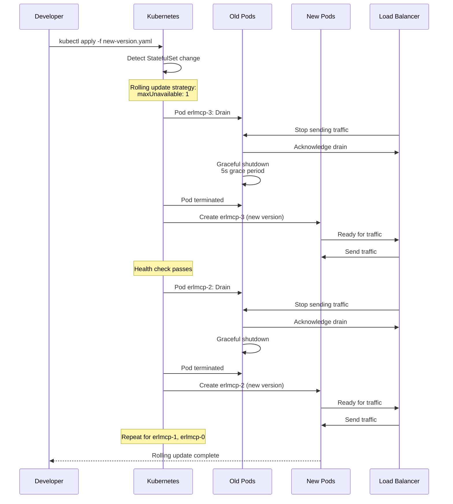

### Performing Rolling Updates

```bash
# Update image
kubectl set image statefulset/erlmcp \
  erlmcp=erlmcp:2.2.0 \
  -n erlmcp

# Watch rollout status
kubectl rollout status statefulset/erlmcp -n erlmcp

# Check revision history
kubectl rollout history statefulset/erlmcp -n erlmcp

# Rollback if needed
kubectl rollout undo statefulset/erlmcp -n erlmcp

# Rollback to specific revision
kubectl rollout undo statefulset/erlmcp --to-revision=2 -n erlmcp
```

### Cluster Scaling

```bash
# Scale up manually
kubectl scale statefulset/erlmcp --replicas=8 -n erlmcp

# Scale down manually
kubectl scale statefulset/erlmcp --replicas=4 -n erlmcp

# Check HPA status
kubectl get hpa -n erlmcp

# Describe HPA for metrics
kubectl describe hpa erlmcp-hpa -n erlmcp

# Disable autoscaling temporarily
kubectl autoscale statefulset erlmcp --min=4 --max=4 -n erlmcp
```

---

## Quick Reference

### Essential kubectl Commands

```bash
# Apply all manifests
kubectl apply -f k8s/ -n erlmcp

# Get all resources
kubectl get all -n erlmcp

# Get pod details
kubectl describe pod erlmcp-0 -n erlmcp

# View logs
kubectl logs -f erlmcp-0 -n erlmcp

# Execute in pod
kubectl exec -it erlmcp-0 -n erlmcp -- /bin/sh

# Port forward
kubectl port-forward erlmcp-0 8080:8080 -n erlmcp

# Get events
kubectl get events -n erlmcp --sort-by='.lastTimestamp'

# Delete pod (will be recreated)
kubectl delete pod erlmcp-0 -n erlmcp

# Edit StatefulSet
kubectl edit statefulset erlmcp -n erlmcp

# Get YAML from running resource
kubectl get statefulset erlmcp -n erlmcp -o yaml
```

### Troubleshooting

```bash
# Check pod status
kubectl get pods -n erlmcp -w

# Check pod logs
kubectl logs erlmcp-0 -n erlmcp --previous  # Previous instance

# Check events
kubectl describe pod erlmcp-0 -n erlmcp

# Check resource usage
kubectl top pods -n erlmcp
kubectl top nodes

# Connect to Erlang shell
kubectl exec -it erlmcp-0 -n erlmcp -- /opt/erlmcp/bin/erlmcp remote_console

# Check cluster connectivity from within pod
kubectl exec -it erlmcp-0 -n erlmcp -- erl -setcookie ERLMCP_CLUSTER_COOKIE -sname test
# In shell: net_adm:ping('erlmcp-1.erlmcp-headless.erlmcp.svc.cluster.local').

# Check StatefulSet status
kubectl get statefulset erlmcp -n erlmcp
kubectl describe statefulset erlmcp -n erlmcp
```

---

## Resource Management

### Resource Quota and Limits

```mermaid
graph TB
    subgraph Namespace["erlmcp Namespace"]
        subgraph Quotas["Resource Quotas"]
            RQ[ResourceQuota<br/>erlmcp-quota]
            LR[LimitRange<br/>erlmcp-limits]
        end

        subgraph Resources["Compute Resources"]
            CPU[CPU Requests<br/>2 cores/pod]
            Mem[Memory Requests<br/>4Gi/pod]
            CPUL[CPU Limits<br/>4 cores/pod]
            MemL[Memory Limits<br/>8Gi/pod]
        end

        subgraph Storage["Storage Resources"]
            Storage[PVC<br/>10Gi/pod]
            StorageClass[StorageClass<br/>fast-ssd]
        end
    end

    RQ --> CPU
    RQ --> Mem
    LR --> CPUL
    LR --> MemL
    RQ --> Storage
    Storage --> StorageClass

    style Namespace fill:#E3F2FD
    style Quotas fill:#BBDEFB
    style Resources fill:#C8E6C9
    style Storage fill:#FFCCBC
```

### Pod Priority and Preemption

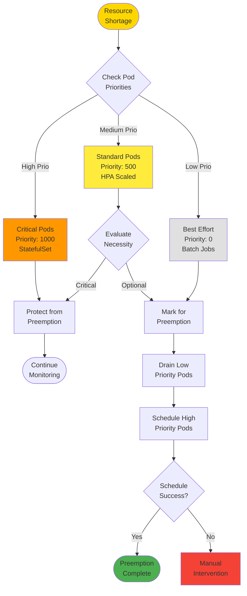

## Network Policies

### Security Group Rules

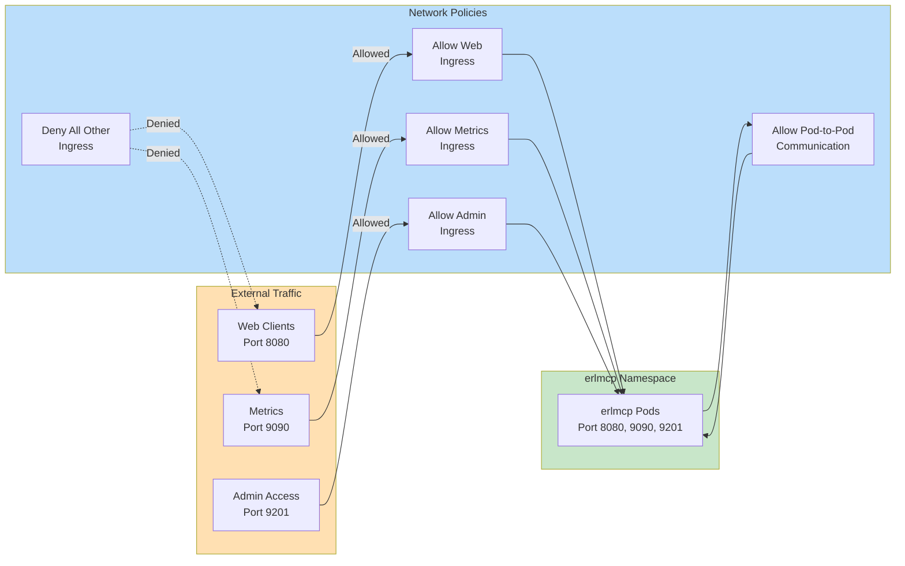

## Multi-Cluster Deployment

### Federation Across Clusters

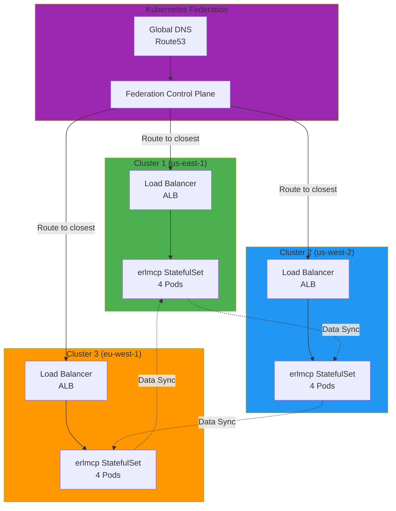

## GitOps Deployment

### GitOps Workflow with ArgoCD

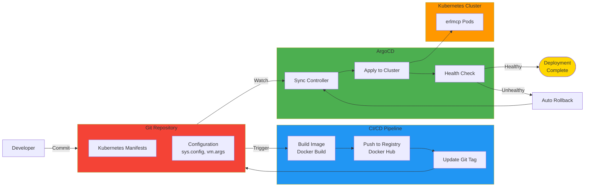

## References

- **Kubernetes Docs**: https://kubernetes.io/docs/
- **StatefulSets**: https://kubernetes.io/docs/concepts/workloads/controllers/statefulset/
- **HPA**: https://kubernetes.io/docs/tasks/run-application/horizontal-pod-autoscale/
- **Cluster Deployment**: [CLUSTER_DEPLOYMENT.md](./CLUSTER_DEPLOYMENT.md)
- **Deployment Guide**: [DEPLOYMENT_GUIDE_100X.md](./DEPLOYMENT_GUIDE_100X.md)

---

**Last Updated**: 2026-01-31
**Version**: 2.1.0
**Maintained By**: erlmcp Team
