# erlmcp Scaling Strategies

**Version**: 2.1.0
**Focus**: Horizontal and vertical scaling strategies for production
**Status**: Production Ready

## Table of Contents

1. [Overview](#overview)
2. [Scaling Dimensions](#scaling-dimensions)
3. [Horizontal Scaling](#horizontal-scaling)
4. [Vertical Scaling](#vertical-scaling)
5. [Auto-Scaling](#auto-scaling)
6. [Capacity Planning](#capacity-planning)
7. [Scaling Policies](#scaling-policies)
8. [Monitoring Scaling](#monitoring-scaling)
9. [Cost Optimization](#cost-optimization)

---

## Overview

erlmcp is designed to scale horizontally from a single node (15K connections) to large clusters (100K+ connections). This guide covers scaling strategies for different deployment scenarios.

**Scaling Targets**:
- **Small**: 1 node, 15K connections, 500K msg/sec
- **Medium**: 4 nodes, 100K connections, 125K msg/sec
- **Large**: 10 nodes, 250K connections, 300K msg/sec
- **X-Large**: 20+ nodes, 500K+ connections, 600K+ msg/sec

---

## Scaling Dimensions

### Scaling Cube

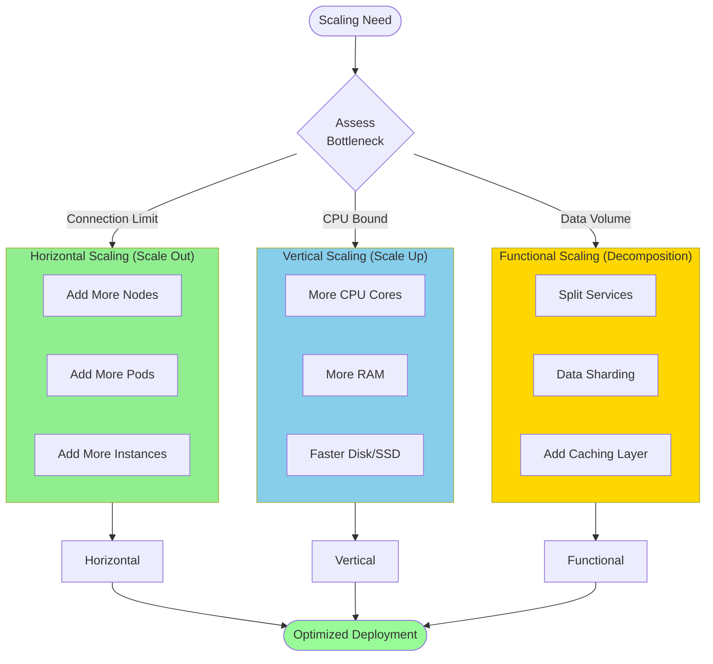
```mermaid
graph TD
    subgraph XAxis["Horizontal Scaling (Scale Out)"]
        AddNodes[Add More Nodes]
        AddPods[Add More Pods]
        AddInstances[Add More Instances]
    end

    subgraph YAxis["Vertical Scaling (Scale Up)"]
        MoreCPU[More CPU Cores]
        MoreRAM[More RAM]
        FasterDisk[Faster Disk/SSD]
    end

    subgraph ZAxis["Functional Scaling (Decomposition)"]
        Microservices[Split Services]
        Sharding[Data Sharding]
        Caching[Add Caching Layer]
    end

    Start([Scaling Need]) --> Assess{Assess<br/>Bottleneck}

    Assess -->|CPU Bound| YAxis
    Assess -->|Connection Limit| XAxis
    Assess -->|Data Volume| ZAxis

    XAxis --> Horizontal
    YAxis --> Vertical
    ZAxis --> Functional

    Horizontal --> Optimize([Optimized Deployment])
    Vertical --> Optimize
    Functional --> Optimize

    style XAxis fill:#90EE90
    style YAxis fill:#87CEEB
    style ZAxis fill:#FFD700
    style Optimize fill:#98FB98
```

### Bottleneck Analysis

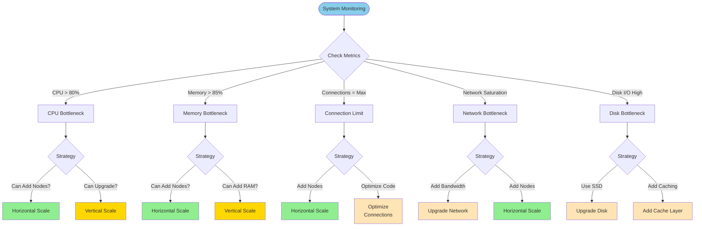
```mermaid
flowchart TD
    Monitor([System Monitoring]) --> Metrics{Check Metrics}

    Metrics -->|CPU > 80%| CPU[CPU Bottleneck]
    Metrics -->|Memory > 85%| Memory[Memory Bottleneck]
    Metrics -->|Connections = Max| Connections[Connection Limit]
    Metrics -->|Network Saturation| Network[Network Bottleneck]
    Metrics -->|Disk I/O High| Disk[Disk Bottleneck]

    CPU --> CPUAction{Strategy}
    Memory --> MemoryAction{Strategy}
    Connections --> ConnAction{Strategy}
    Network --> NetAction{Strategy}
    Disk --> DiskAction{Strategy}

    CPUAction -->|Can Add Nodes?| Horizontal1[Horizontal Scale]
    CPUAction -->|Can Upgrade?| Vertical1[Vertical Scale]

    MemoryAction -->|Can Add Nodes?| Horizontal2[Horizontal Scale]
    MemoryAction -->|Can Add RAM?| Vertical2[Vertical Scale]

    ConnAction -->|Add Nodes| Horizontal3[Horizontal Scale]
    ConnAction -->|Optimize Code| Optimize[Optimize<br/>Connections]

    NetAction -->|Add Bandwidth| Upgrade[Upgrade Network]
    NetAction -->|Add Nodes| Horizontal4[Horizontal Scale]

    DiskAction -->|Use SSD| UpgradeDisk[Upgrade Disk]
    DiskAction -->|Add Caching| Cache[Add Cache Layer]

    style Monitor fill:#87CEEB
    style Horizontal1 fill:#90EE90
    style Horizontal2 fill:#90EE90
    style Horizontal3 fill:#90EE90
    style Horizontal4 fill:#90EE90
    style Vertical1 fill:#FFD700
    style Vertical2 fill:#FFD700
    style Optimize fill:#FFE4B5
    style Upgrade fill:#FFE4B5
    style UpgradeDisk fill:#FFE4B5
    style Cache fill:#FFE4B5
```

---

## Horizontal Scaling

### Horizontal Scaling Flow

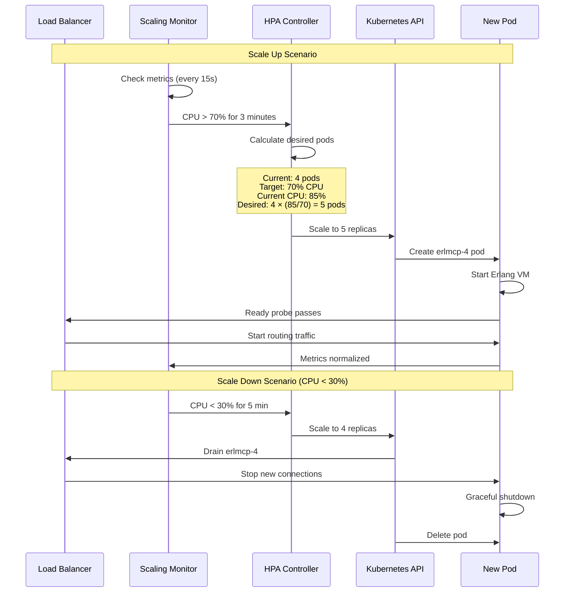
```mermaid
sequenceDiagram
    participant LB as Load Balancer
    participant Monitor as Scaling Monitor
    participant HPA as HPA Controller
    participant K8s as Kubernetes API
    participant New as New Pod

    Note over LB,New: Scale Up Scenario

    Monitor->>Monitor: Check metrics (every 15s)
    Monitor->>HPA: CPU > 70% for 3 minutes

    HPA->>HPA: Calculate desired pods
    Note over HPA: Current: 4 pods<br/>Target: 70% CPU<br/>Current CPU: 85%<br/>Desired: 4 × (85/70) = 5 pods

    HPA->>K8s: Scale to 5 replicas
    K8s->>New: Create erlmcp-4 pod

    New->>New: Start Erlang VM
    New->>LB: Ready probe passes
    LB->>New: Start routing traffic

    New->>Monitor: Metrics normalized

    Note over LB,New: Scale Down Scenario (CPU < 30%)

    Monitor->>HPA: CPU < 30% for 5 min
    HPA->>K8s: Scale to 4 replicas
    K8s->>LB: Drain erlmcp-4
    LB->>New: Stop new connections
    New->>New: Graceful shutdown
    K8s->>New: Delete pod
```

### Horizontal Scaling Strategies

#### Strategy 1: Pod-Level Scaling (Kubernetes)

**Configuration**:
```yaml
apiVersion: autoscaling/v2
kind: HorizontalPodAutoscaler
metadata:
  name: erlmcp-hpa
spec:
  scaleTargetRef:
    kind: StatefulSet
    name: erlmcp
  minReplicas: 4
  maxReplicas: 20
  metrics:
  - type: Resource
    resource:
      name: cpu
      target:
        type: Utilization
        averageUtilization: 70
  behavior:
    scaleUp:
      stabilizationWindowSeconds: 0
      policies:
      - type: Percent
        value: 100
        periodSeconds: 30
    scaleDown:
      stabilizationWindowSeconds: 300
      policies:
      - type: Percent
        value: 50
        periodSeconds: 60
```

**Scaling Behavior**:
- **Scale Up**: Double pods every 30 seconds when CPU > 70%
- **Scale Down**: Reduce by 50% every 60 seconds when CPU < 30% for 5 min
- **Min Pods**: 4 (maintain cluster quorum)
- **Max Pods**: 20 (500K connections capacity)

#### Strategy 2: Node-Level Scaling (Cluster)

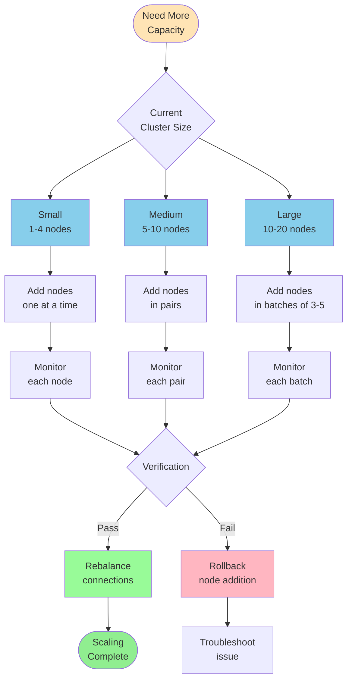
```mermaid
flowchart TD
    Start([Need More<br/>Capacity]) --> Current{Current<br/>Cluster Size}

    Current --> Small[Small<br/>1-4 nodes]
    Current --> Medium[Medium<br/>5-10 nodes]
    Current --> Large[Large<br/>10-20 nodes]

    Small --> Add1[Add nodes<br/>one at a time]
    Medium --> Add2[Add nodes<br/>in pairs]
    Large --> Add3[Add nodes<br/>in batches of 3-5]

    Add1 --> Monitor1[Monitor<br/>each node]
    Add2 --> Monitor2[Monitor<br/>each pair]
    Add3 --> Monitor3[Monitor<br/>each batch]

    Monitor1 --> Verify{Verification}
    Monitor2 --> Verify
    Monitor3 --> Verify

    Verify -->|Pass| Rebalance[Rebalance<br/>connections]
    Verify -->|Fail| Rollback[Rollback<br/>node addition]

    Rebalance --> Complete([Scaling<br/>Complete])

    Rollback --> Troubleshoot[Troubleshoot<br/>issue]

    style Start fill:#FFE4B5
    style Complete fill:#90EE90
    style Rollback fill:#FFB6C1
    style Rebalance fill:#98FB98
    style Small fill:#87CEEB
    style Medium fill:#87CEEB
    style Large fill:#87CEEB
```

**Adding Nodes to Cluster**:
```bash
# Step 1: Provision new server
# (AWS EC2, GCP Compute, Azure VM, etc.)

# Step 2: Install Erlang and erlmcp
ssh new-node "apt-get install erlang && git clone https://github.com/erlmcp/erlmcp"

# Step 3: Configure node
scp config/cluster.config new-node:/opt/erlmcp/config/
scp config/vm-cluster.args new-node:/opt/erlmcp/config/

# Step 4: Start node
ssh new-node "/opt/erlmcp/bin/erlmcp start"

# Step 5: Join cluster
erl -setcookie erlmcp_cluster -sname admin
% In Erlang shell:
% rpc:call('new-node@hostname', net_adm, ping, ['erlmcp1@hostname']).

# Step 6: Update load balancer
# Add new-node to HAProxy backend configuration

# Step 7: Verify
./scripts/cluster-status.sh
```

---

## Vertical Scaling

### Vertical Scaling Dimensions

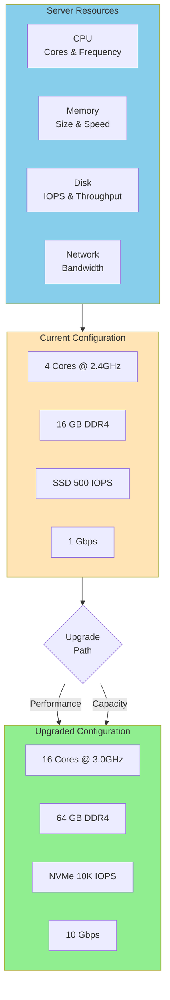
```mermaid
graph TB
    subgraph Resources["Server Resources"]
        CPU[CPU<br/>Cores & Frequency]
        RAM[Memory<br/>Size & Speed]
        Disk[Disk<br/>IOPS & Throughput]
        Network[Network<br/>Bandwidth]
    end

    subgraph Current["Current Configuration"]
        CurrentCPU[4 Cores @ 2.4GHz]
        CurrentRAM[16 GB DDR4]
        CurrentDisk[SSD 500 IOPS]
        CurrentNet[1 Gbps]
    end

    subgraph Upgraded["Upgraded Configuration"]
        UpgradedCPU[16 Cores @ 3.0GHz]
        UpgradedRAM[64 GB DDR4]
        UpgradedDisk[NVMe 10K IOPS]
        UpgradedNet[10 Gbps]
    end

    Current --> Upgrade{Upgrade<br/>Path}

    Upgrade -->|Performance| Upgraded
    Upgrade -->|Capacity| Upgraded

    Resources --> Current

    style Current fill:#FFE4B5
    style Upgraded fill:#90EE90
    style Resources fill:#87CEEB
```

### Vertical Scaling Strategies

#### Strategy 1: CPU Scaling

**Before Scaling** (4 cores):
- Capacity: 15K connections
- Throughput: 500K msg/sec
- CPU usage: 80% at peak

**After Scaling** (16 cores):
- Capacity: 25K connections
- Throughput: 800K msg/sec
- CPU usage: 50% at peak

**VM Configuration**:
```
+P 524288                % Increase process count
+SDexpr 128              % Increase dirty schedulers
+S 16                    % 16 schedulers
+A 128                   % More async threads
+IOt 8                   % More I/O threads
```

#### Strategy 2: Memory Scaling

**Before Scaling** (8GB RAM):
- Max connections: 15K
- Memory per connection: ~200KB
- Total memory: 3GB for connections

**After Scaling** (32GB RAM):
- Max connections: 25K
- Memory per connection: ~200KB (optimized)
- Total memory: 5GB for connections

**Memory Optimization**:
```erlang
% Enable memory optimization
{erlmcp, [
    {enable_memory_optimization, true},
    {buffer_pool_size, 1000},
    {session_compression, true},
    {ets_table_options, [
        {read_concurrency, true},
        {write_concurrency, true}
    ]}
]}.
```

#### Strategy 3: Network Scaling

**Before Scaling** (1 Gbps):
- Network saturation: 90%
- Packet loss: 0.1%
- Latency: P99 50ms

**After Scaling** (10 Gbps):
- Network saturation: 20%
- Packet loss: 0.001%
- Latency: P99 20ms

**Network Optimization**:
```erlang
{kernel, [
    {inet_default_listen_options, [
        {sendbuf, 8388608},    % 8MB send buffer
        {recbuf, 8388608},     % 8MB receive buffer
        {nodelay, true},
        {keepalive, true}
    ]}
]}.
```

---

## Auto-Scaling

### Auto-Scaling Architecture

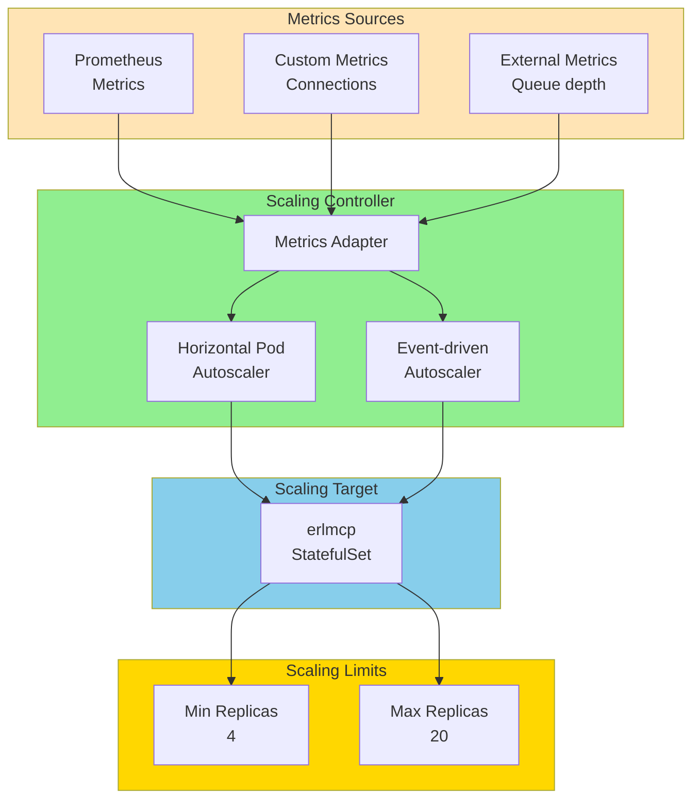
```mermaid
graph TB
    subgraph Sources["Metrics Sources"]
        Prometheus[Prometheus<br/>Metrics]
        Custom[Custom Metrics<br/>Connections]
        External[External Metrics<br/>Queue depth]
    end

    subgraph Controller["Scaling Controller"]
        MetricsAdapter[Metrics Adapter]
        HPA[Horizontal Pod<br/>Autoscaler]
        KEDA[Event-driven<br/>Autoscaler]
    end

    subgraph Target["Scaling Target"]
        StatefulSet[erlmcp<br/>StatefulSet]
    end

    subgraph Limits["Scaling Limits"]
        Min[Min Replicas<br/>4]
        Max[Max Replicas<br/>20]
    end

    Prometheus --> MetricsAdapter
    Custom --> MetricsAdapter
    External --> MetricsAdapter

    MetricsAdapter --> HPA
    MetricsAdapter --> KEDA

    HPA --> StatefulSet
    KEDA --> StatefulSet

    StatefulSet --> Min
    StatefulSet --> Max

    style Sources fill:#FFE4B5
    style Controller fill:#90EE90
    style Target fill:#87CEEB
    style Limits fill:#FFD700
```

### Custom Metrics Scaling

**Example: Scale based on connection count**

```yaml
apiVersion: autoscaling/v2
kind: HorizontalPodAutoscaler
metadata:
  name: erlmcp-connection-hpa
spec:
  scaleTargetRef:
    kind: StatefulSet
    name: erlmcp
  minReplicas: 4
  maxReplicas: 20
  metrics:
  - type: Pods
    pods:
      metric:
        name: erlmcp_connections
      target:
        type: AverageValue
        averageValue: "20000"  # Scale when avg 20K conn/pod
  behavior:
    scaleDown:
      stabilizationWindowSeconds: 300
      policies:
      - type: Pods
        value: 1
        periodSeconds: 60
    scaleUp:
      stabilizationWindowSeconds: 0
      policies:
      - type: Pods
        value: 2
        periodSeconds: 30
```

**Metric Exporter** (in erlmcp application):
```erlang
% Expose custom metrics to Prometheus
-module(erlmcp_metrics_exporter).
-export([init/1, handle_call/3]).

init(_) ->
    {ok, #{}}.

handle_call(get_metrics, _From, State) ->
    Metrics = [
        {erlmcp_connections, erlmcp_registry:count(connections)},
        {erlmcp_messages_total, erlmcp_metrics:get_counter(messages)},
        {erlmcp_queue_depth, erlmcp_queue_bounded:size()}
    ],
    {reply, Metrics, State}.
```

---

## Capacity Planning

### Capacity Planning Matrix

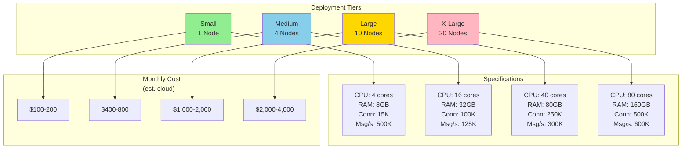
```mermaid
graph TB
    subgraph Tiers["Deployment Tiers"]
        Tier1[Small<br/>1 Node]
        Tier2[Medium<br/>4 Nodes]
        Tier3[Large<br/>10 Nodes]
        Tier4[X-Large<br/>20 Nodes]
    end

    subgraph Specs["Specifications"]
        S1[CPU: 4 cores<br/>RAM: 8GB<br/>Conn: 15K<br/>Msg/s: 500K]
        S2[CPU: 16 cores<br/>RAM: 32GB<br/>Conn: 100K<br/>Msg/s: 125K]
        S3[CPU: 40 cores<br/>RAM: 80GB<br/>Conn: 250K<br/>Msg/s: 300K]
        S4[CPU: 80 cores<br/>RAM: 160GB<br/>Conn: 500K<br/>Msg/s: 600K]
    end

    subgraph Cost["Monthly Cost<br/>(est. cloud)"]
        C1[$100-200]
        C2[$400-800]
        C3[$1,000-2,000]
        C4[$2,000-4,000]
    end

    Tier1 --> S1
    Tier1 --> C1
    Tier2 --> S2
    Tier2 --> C2
    Tier3 --> S3
    Tier3 --> C3
    Tier4 --> S4
    Tier4 --> C4

    style Tier1 fill:#90EE90
    style Tier2 fill:#87CEEB
    style Tier3 fill:#FFD700
    style Tier4 fill:#FFB6C1
```

### Capacity Calculator

**Input Parameters**:
- Expected concurrent connections
- Expected messages per second
- Target latency (P95)
- Growth rate (connections/month)

**Calculation Formula**:
```erlang
% Calculate required nodes
calculate_nodes(Connections, MsgPerSec) ->
    % Per-node capacity (measured)
    MaxConnPerNode = 25000,
    MaxMsgPerNode = 30000,

    % Calculate nodes needed for each dimension
    NodesByConn = ceil(Connections / MaxConnPerNode),
    NodesByMsg = ceil(MsgPerSec / MaxMsgPerNode),

    % Take maximum + buffer (20%)
    max(NodesByConn, NodesByMsg) * 1.2.

% Example:
% calculate_nodes(100000, 150000) = 5 nodes
```

**Growth Planning**:
```
Month 0: 50K connections → 2 nodes
Month 6: 75K connections → 3 nodes
Month 12: 100K connections → 4 nodes
Month 18: 150K connections → 6 nodes
Month 24: 200K connections → 8 nodes
```

---

## Scaling Policies

### Scaling Decision Flow

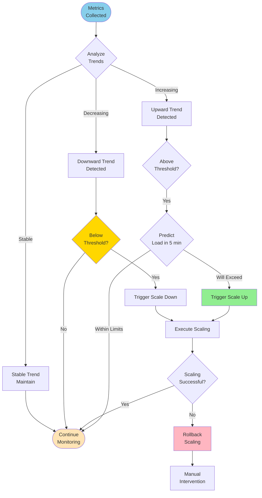
```mermaid
flowchart TD
    Start([Metrics<br/>Collected]) --> Analyze{Analyze<br/>Trends}

    Analyze -->|Increasing| TrendUp[Upward Trend<br/>Detected]
    Analyze -->|Stable| TrendStable[Stable Trend<br/>Maintain]
    Analyze -->|Decreasing| TrendDown[Downward Trend<br/>Detected]

    TrendUp --> Threshold{Above<br/>Threshold?}

    Threshold -->|Yes| Predict{Predict<br/>Load in 5 min}

    Predict -->|Will Exceed| ScaleUp[Trigger Scale Up]
    Predict -->|Within Limits| Monitor([Continue<br/>Monitoring])

    ScaleUp --> Execute[Execute Scaling]
    Execute --> Verify{Scaling<br/>Successful?}

    Verify -->|Yes| Monitor
    Verify -->|No| Rollback[Rollback<br/>Scaling]

    Rollback --> Manual[Manual<br/>Intervention]

    TrendDown --> ScaleDown{Below<br/>Threshold?}

    ScaleDown -->|Yes| ScaleDownAction[Trigger Scale Down]
    ScaleDown -->|No| Monitor

    ScaleDownAction --> Execute

    TrendStable --> Monitor

    style Start fill:#87CEEB
    style ScaleUp fill:#90EE90
    style ScaleDown fill:#FFD700
    style Rollback fill:#FFB6C1
    style Monitor fill:#FFE4B5
```

### Scaling Thresholds

**Scale Up Triggers** (any condition true):
- CPU > 70% for 3 minutes
- Memory > 80% for 3 minutes
- Connections > 20K per pod for 5 minutes
- P95 latency > 100ms for 5 minutes

**Scale Down Triggers** (all conditions true):
- CPU < 30% for 10 minutes
- Memory < 50% for 10 minutes
- Connections < 10K per pod for 10 minutes
- P95 latency < 50ms for 10 minutes

**Scaling Limits**:
- Minimum: 4 pods (cluster quorum)
- Maximum: 20 pods (500K connections)
- Scale up rate: Max 2x every 30 seconds
- Scale down rate: Max 50% every 60 seconds

---

## Monitoring Scaling

### Scaling Metrics Dashboard

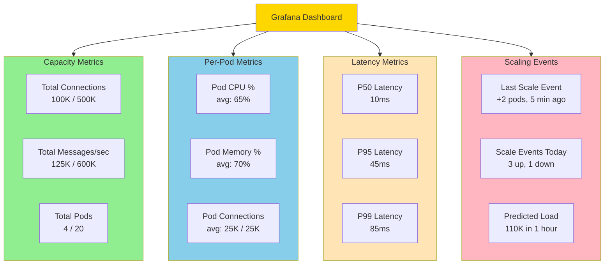
```mermaid
graph TB
    subgraph Panel1["Capacity Metrics"]
        TotalConn[Total Connections<br/>100K / 500K]
        TotalMsg[Total Messages/sec<br/>125K / 600K]
        TotalPods[Total Pods<br/>4 / 20]
    end

    subgraph Panel2["Per-Pod Metrics"]
        PodCPU[Pod CPU %<br/>avg: 65%]
        PodMem[Pod Memory %<br/>avg: 70%]
        PodConn[Pod Connections<br/>avg: 25K / 25K]
    end

    subgraph Panel3["Latency Metrics"]
        P50[P50 Latency<br/>10ms]
        P95[P95 Latency<br/>45ms]
        P99[P99 Latency<br/>85ms]
    end

    subgraph Panel4["Scaling Events"]
        LastScale[Last Scale Event<br/>+2 pods, 5 min ago]
        ScaleCount[Scale Events Today<br/>3 up, 1 down]
        PredictedLoad[Predicted Load<br/>110K in 1 hour]
    end

    Dashboard[Grafana Dashboard] --> Panel1
    Dashboard --> Panel2
    Dashboard --> Panel3
    Dashboard --> Panel4

    style Dashboard fill:#FFD700
    style Panel1 fill:#90EE90
    style Panel2 fill:#87CEEB
    style Panel3 fill:#FFE4B5
    style Panel4 fill:#FFB6C1
```

### Alerting on Scaling Events

**Prometheus Alert Rules**:
```yaml
groups:
- name: erlmcp_scaling
  rules:
  # Alert on scaling events
  - alert: ERLMCPScalingUp
    expr: increase(kube_statefulset_replicas{statefulset="erlmcp"}[5m]) > 0
    for: 0m
    labels:
      severity: info
    annotations:
      summary: "erlmCP is scaling up"
      description: "erlmcp StatefulSet added {{ $value }} pods"

  # Alert on max capacity
  - alert: ERLMCPMaxCapacity
    expr: kube_statefulset_replicas{statefulset="erlmcp"} >= 20
    for: 10m
    labels:
      severity: warning
    annotations:
      summary: "erlmcp at maximum capacity"
      description: "erlmcp is running at max 20 pods"

  # Alert on connection limit
  - alert: ERLMCPConnectionLimit
    expr: erlmcp_connections_total > 450000
    for: 5m
    labels:
      severity: critical
    annotations:
      summary: "erlmcp approaching connection limit"
      description: "{{ $value | humanize }} connections (max: 500K)"
```

---

## Cost Optimization

### Cost-Performance Trade-offs

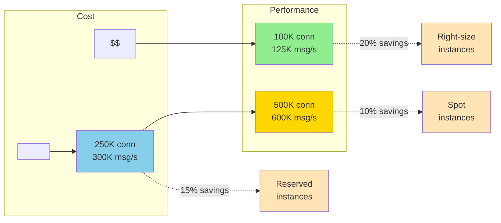
```mermaid
graph LR
    subgraph XAxis["Cost"]
        Low[$$]
        Medium[$$$$]
        High[$$$$$$]
    end

    subgraph YAxis["Performance"]
        Baseline[100K conn<br/>125K msg/s]
        High[250K conn<br/>300K msg/s]
        Extreme[500K conn<br/>600K msg/s]
    end

    Low --> Baseline
    Medium --> High
    High --> Extreme

    Baseline -.->|20% savings| RightSize[Right-size<br/>instances]
    High -.->|15% savings| Reserved[Reserved<br/>instances]
    Extreme -.->|10% savings| Spot[Spot<br/>instances]

    style Baseline fill:#90EE90
    style High fill:#87CEEB
    style Extreme fill:#FFD700
    style RightSize fill:#FFE4B5
    style Reserved fill:#FFE4B5
    style Spot fill:#FFE4B5
```

### Cost Optimization Strategies

#### Strategy 1: Right-Sizing

**Action**: Use the smallest instance that meets requirements

**Before**: 4x m5.2xlarge (8 vCPU, 32GB RAM) = $1,152/month
**After**: 4x m5.xlarge (4 vCPU, 16GB RAM) = $576/month
**Savings**: 50% ($576/month)

**Validation**:
```bash
# Monitor actual usage
kubectl top pods -n erlmcp
# Result: avg CPU 45%, avg memory 60%
# Conclusion: Can safely downsize
```

#### Strategy 2: Reserved Instances

**Action**: Purchase reserved instances for predictable workloads

**Before**: On-demand m5.xlarge = $144/month
**After**: 1-year reserved = $95/month
**Savings**: 34% ($49/month per instance)

#### Strategy 3: Spot Instances

**Action**: Use spot instances for fault-tolerant components

**Before**: On-demand monitoring nodes = $288/month
**After**: Spot instances = $50/month
**Savings**: 83% ($238/month)

**Caveat**: Spot instances can be pre-empted, so use for:
- Non-critical monitoring pods
- Batch processing jobs
- Development/staging environments

#### Strategy 4: Auto-Scaling Schedule

**Action**: Scale down during off-peak hours

**Configuration**:
```yaml
# Kubernetes CronHPA (custom resource)
apiVersion: autoscaling/v2
kind: HorizontalPodAutoscaler
metadata:
  name: erlmcp-scheduled-hpa
spec:
  scaleTargetRef:
    kind: StatefulSet
    name: erlmcp
  minReplicas: 4
  maxReplicas: 20
  # Daytime: 8AM - 8PM → scale to 8-12 pods
  # Nighttime: 8PM - 8AM → scale to 4 pods
```

**Savings**: 30% during off-peak hours

---

## Scaling Decision Trees

### Predictive Scaling Decision Flow

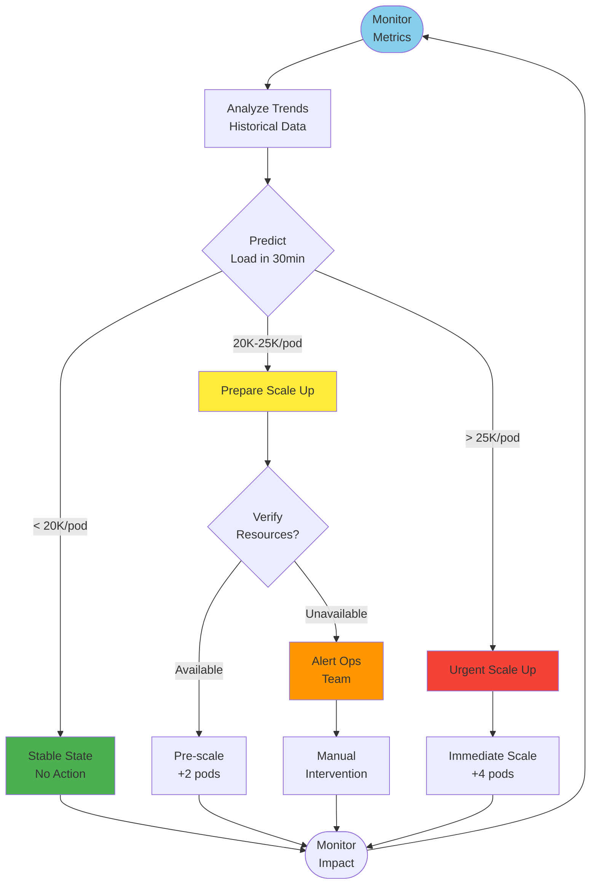
```mermaid
flowchart TD
    Start([Monitor<br/>Metrics]) --> Trend[Analyze Trends<br/>Historical Data]

    Trend --> Predict{Predict<br/>Load in 30min}

    Predict -->|< 20K/pod| Stable[Stable State<br/>No Action]
    Predict -->|20K-25K/pod| Prepare[Prepare Scale Up]
    Predict -->|> 25K/pod| Urgent[Urgent Scale Up]

    Prepare --> Verify{Verify<br/>Resources?}

    Verify -->|Available| PreScale[Pre-scale<br/>+2 pods]
    Verify -->|Unavailable| Alert[Alert Ops<br/>Team]

    PreScale --> Monitor([Monitor<br/>Impact])

    Urgent --> Immediate[Immediate Scale<br/>+4 pods]
    Immediate --> Monitor

    Stable --> Monitor

    Alert --> Manual[Manual<br/>Intervention]
    Manual --> Monitor

    Monitor --> Start

    style Start fill:#87CEEB
    style Stable fill:#4CAF50
    style Prepare fill:#FFEB3B
    style Urgent fill:#F44336
    style Alert fill:#FF9800
```

### Scale Down Decision Flow

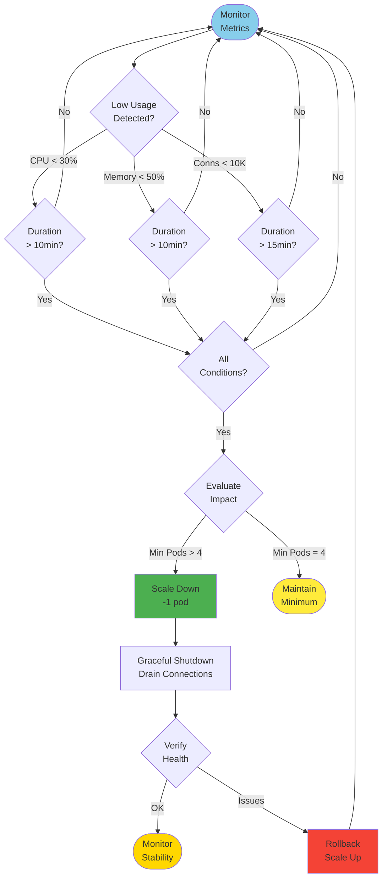
```mermaid
flowchart TD
    Start([Monitor<br/>Metrics]) --> Low{Low Usage<br/>Detected?}

    Low -->|CPU < 30%| Duration1{Duration<br/>> 10min?}
    Low -->|Memory < 50%| Duration2{Duration<br/>> 10min?}
    Low -->|Conns < 10K| Duration3{Duration<br/>> 15min?}

    Duration1 -->|Yes| CheckAll{All<br/>Conditions?}
    Duration1 -->|No| Start

    Duration2 -->|Yes| CheckAll
    Duration2 -->|No| Start

    Duration3 -->|Yes| CheckAll
    Duration3 -->|No| Start

    CheckAll -->|Yes| Evaluate{Evaluate<br/>Impact}
    CheckAll -->|No| Start

    Evaluate -->|Min Pods > 4| ScaleDown[Scale Down<br/>-1 pod]
    Evaluate -->|Min Pods = 4| Maintain([Maintain<br/>Minimum])

    ScaleDown --> Graceful[Graceful Shutdown<br/>Drain Connections]
    Graceful --> Verify{Verify<br/>Health}

    Verify -->|OK| Monitor([Monitor<br/>Stability])
    Verify -->|Issues| Rollback[Rollback<br/>Scale Up]

    Rollback --> Start

    style Start fill:#87CEEB
    style ScaleDown fill:#4CAF50
    style Maintain fill:#FFEB3B
    style Rollback fill:#F44336
    style Monitor fill:#FFD700
```

## Scaling Patterns

### Scheduled Scaling

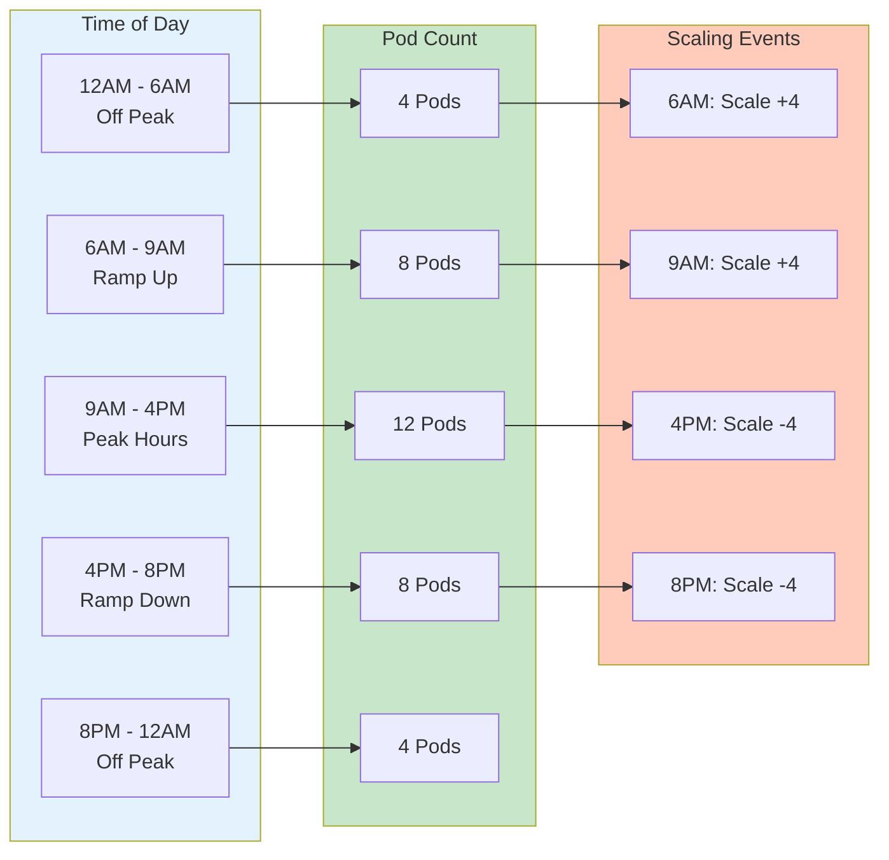
```mermaid
graph LR
    subgraph Time["Time of Day"]
        T1[12AM - 6AM<br/>Off Peak]
        T2[6AM - 9AM<br/>Ramp Up]
        T3[9AM - 4PM<br/>Peak Hours]
        T4[4PM - 8PM<br/>Ramp Down]
        T5[8PM - 12AM<br/>Off Peak]
    end

    subgraph Pods["Pod Count"]
        P1[4 Pods]
        P2[8 Pods]
        P3[12 Pods]
        P4[8 Pods]
        P5[4 Pods]
    end

    subgraph Events["Scaling Events"]
        E1[6AM: Scale +4]
        E2[9AM: Scale +4]
        E3[4PM: Scale -4]
        E4[8PM: Scale -4]
    end

    T1 --> P1
    T2 --> P2
    T3 --> P3
    T4 --> P4
    T5 --> P5

    P1 --> E1
    P2 --> E2
    P3 --> E3
    P4 --> E4

    style Time fill:#E3F2FD
    style Pods fill:#C8E6C9
    style Events fill:#FFCCBC
```

### Event-Driven Scaling

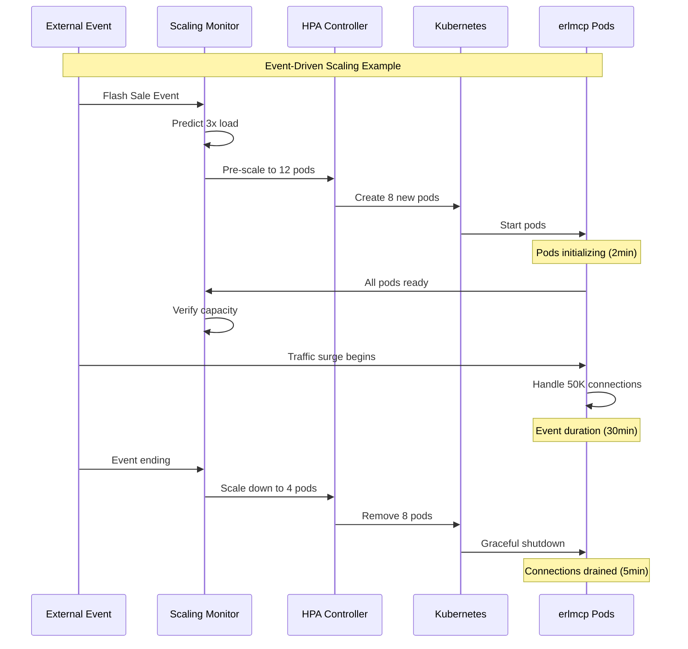
```mermaid
sequenceDiagram
    participant Event as External Event
    participant Monitor as Scaling Monitor
    participant HPA as HPA Controller
    participant K8s as Kubernetes
    participant Pods as erlmcp Pods

    Note over Event,Pods: Event-Driven Scaling Example

    Event->>Monitor: Flash Sale Event
    Monitor->>Monitor: Predict 3x load

    Monitor->>HPA: Pre-scale to 12 pods
    HPA->>K8s: Create 8 new pods
    K8s->>Pods: Start pods

    Note over Pods: Pods initializing (2min)

    Pods->>Monitor: All pods ready
    Monitor->>Monitor: Verify capacity

    Event->>Pods: Traffic surge begins
    Pods->>Pods: Handle 50K connections

    Note over Pods: Event duration (30min)

    Event->>Monitor: Event ending
    Monitor->>HPA: Scale down to 4 pods
    HPA->>K8s: Remove 8 pods
    K8s->>Pods: Graceful shutdown

    Note over Pods: Connections drained (5min)
```

## Advanced Scaling Techniques

### Predictive Auto-Scaling

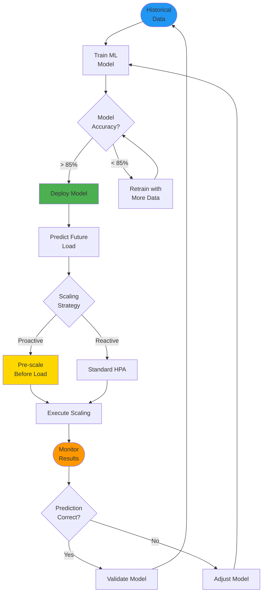
```mermaid
flowchart TD
    History([Historical<br/>Data]) --> Train[Train ML<br/>Model]

    Train --> Model{Model<br/>Accuracy?}

    Model -->|> 85%| Deploy[Deploy Model]
    Model -->|< 85%| Retrain[Retrain with<br/>More Data]

    Retrain --> Model

    Deploy --> Predict[Predict Future<br/>Load]

    Predict --> Strategy{Scaling<br/>Strategy}

    Strategy -->|Proactive| PreScale[Pre-scale<br/>Before Load]
    Strategy -->|Reactive| Standard[Standard HPA]

    PreScale --> Execute[Execute Scaling]
    Standard --> Execute

    Execute --> Monitor([Monitor<br/>Results])

    Monitor --> Feedback{Prediction<br/>Correct?}

    Feedback -->|Yes| Validate[Validate Model]
    Feedback -->|No| Adjust[Adjust Model]

    Validate --> History
    Adjust --> Train

    style History fill:#2196F3
    style Deploy fill:#4CAF50
    style PreScale fill:#FFD700
    style Monitor fill:#FF9800
```

### Burst Capacity Management

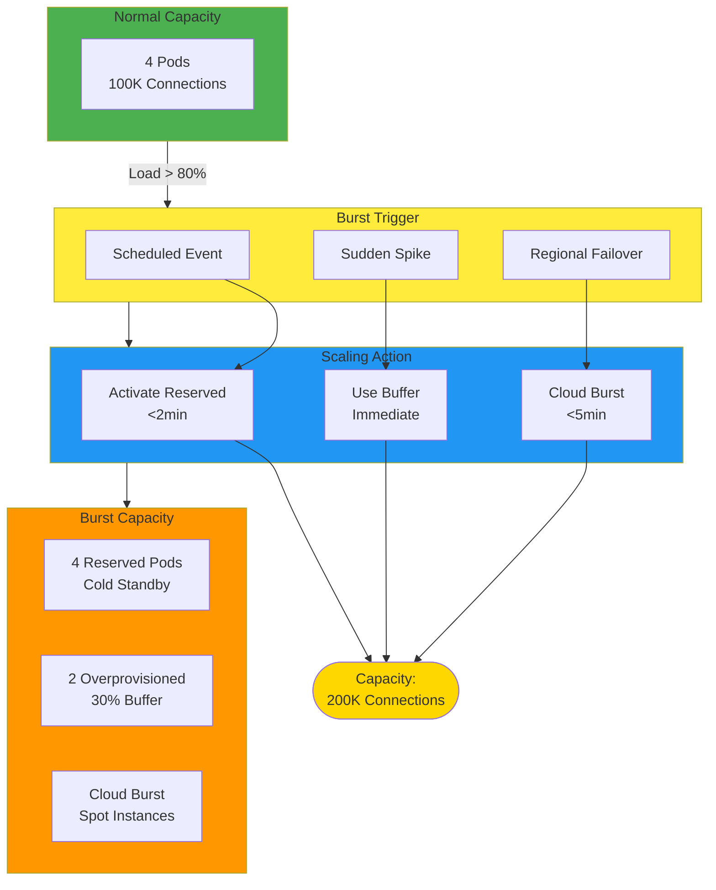
```mermaid
graph TB
    subgraph Normal["Normal Capacity"]
        N1[4 Pods<br/>100K Connections]
    end

    subgraph Burst["Burst Capacity"]
        B1[4 Reserved Pods<br/>Cold Standby]
        B2[2 Overprovisioned<br/>30% Buffer]
        B3[Cloud Burst<br/>Spot Instances]
    end

    subgraph Trigger["Burst Trigger"]
        T1[Scheduled Event]
        T2[Sudden Spike]
        T3[Regional Failover]
    end

    subgraph Action["Scaling Action"]
        A1[Activate Reserved<br/><2min]
        A2[Use Buffer<br/>Immediate]
        A3[Cloud Burst<br/><5min]
    end

    Normal -->|Load > 80%| Trigger
    Trigger --> Action
    Action --> Burst

    T1 --> A1
    T2 --> A2
    T3 --> A3

    A1 --> Expand([Capacity:<br/>200K Connections])
    A2 --> Expand
    A3 --> Expand

    style Normal fill:#4CAF50
    style Burst fill:#FF9800
    style Trigger fill:#FFEB3B
    style Action fill:#2196F3
    style Expand fill:#FFD700
```

## Scaling Metrics and Alerts

### Scaling Metrics Dashboard

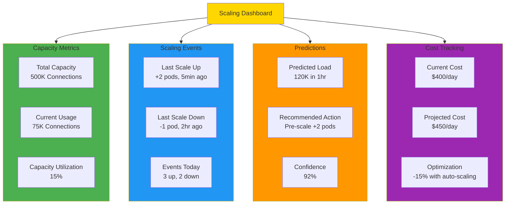
```mermaid
graph TB
    subgraph Panel1["Capacity Metrics"]
        C1[Total Capacity<br/>500K Connections]
        C2[Current Usage<br/>75K Connections]
        C3[Capacity Utilization<br/>15%]
    end

    subgraph Panel2["Scaling Events"]
        E1[Last Scale Up<br/>+2 pods, 5min ago]
        E2[Last Scale Down<br/>-1 pod, 2hr ago]
        E3[Events Today<br/>3 up, 2 down]
    end

    subgraph Panel3["Predictions"]
        P1[Predicted Load<br/>120K in 1hr]
        P2[Recommended Action<br/>Pre-scale +2 pods]
        P3[Confidence<br/>92%]
    end

    subgraph Panel4["Cost Tracking"]
        Cost1[Current Cost<br/>$400/day]
        Cost2[Projected Cost<br/>$450/day]
        Cost3[Optimization<br/>-15% with auto-scaling]
    end

    Dashboard[Scaling Dashboard] --> Panel1
    Dashboard --> Panel2
    Dashboard --> Panel3
    Dashboard --> Panel4

    style Dashboard fill:#FFD700
    style Panel1 fill:#4CAF50
    style Panel2 fill:#2196F3
    style Panel3 fill:#FF9800
    style Panel4 fill:#9C27B0
```

### Alert Thresholds

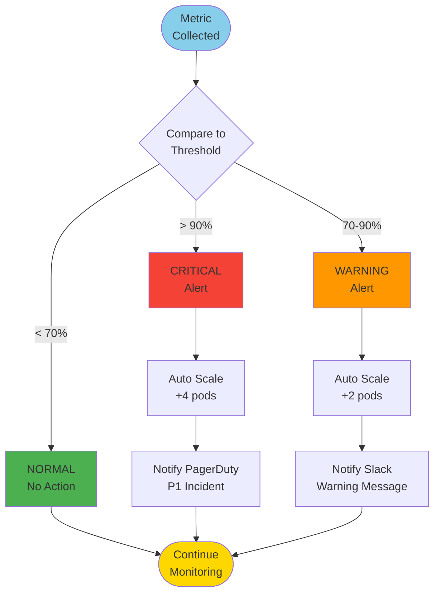
```mermaid
flowchart TD
    Start([Metric<br/>Collected]) --> Compare{Compare to<br/>Threshold}

    Compare -->|> 90%| Critical[CRITICAL<br/>Alert]
    Compare -->|70-90%| Warning[WARNING<br/>Alert]
    Compare -->|< 70%| Normal[NORMAL<br/>No Action]

    Critical --> AutoAuto[Auto Scale<br/>+4 pods]
    AutoAuto --> NotifyPager[Notify PagerDuty<br/>P1 Incident]

    Warning --> AutoWarn[Auto Scale<br/>+2 pods]
    AutoWarn --> NotifySlack[Notify Slack<br/>Warning Message]

    Normal --> Monitor([Continue<br/>Monitoring])

    NotifyPager --> Monitor
    NotifySlack --> Monitor

    style Start fill:#87CEEB
    style Critical fill:#F44336
    style Warning fill:#FF9800
    style Normal fill:#4CAF50
    style Monitor fill:#FFD700
```

## Scaling Failover

### Scaling Failure Recovery

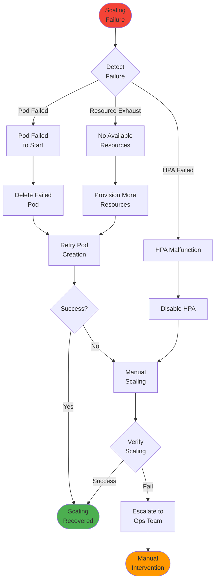
```mermaid
flowchart TD
    Fail([Scaling<br/>Failure]) --> Detect{Detect<br/>Failure}

    Detect -->|Pod Failed| PodFail[Pod Failed<br/>to Start]
    Detect -->|HPA Failed| HPAFail[HPA Malfunction]
    Detect -->|Resource Exhaust| Resource[No Available<br/>Resources]

    PodFail --> Delete[Delete Failed<br/>Pod]
    Delete --> Retry[Retry Pod<br/>Creation]

    Retry --> Success{Success?}
    Success -->|Yes| Complete([Scaling<br/>Recovered])
    Success -->|No| ManualScale[Manual<br/>Scaling]

    HPAFail --> Disable[Disable HPA]
    Disable --> ManualScale

    ManualScale --> Verify{Verify<br/>Scaling}

    Verify -->|Success| Complete
    Verify -->|Fail| Escalate[Escalate to<br/>Ops Team]

    Resource --> Provision[Provision More<br/>Resources]
    Provision --> Retry

    Escalate --> Manual([Manual<br/>Intervention])

    style Fail fill:#F44336
    style Complete fill:#4CAF50
    style Manual fill:#FF9800
```

## Quick Reference

### Scaling Commands

```bash
# Kubernetes: Manual scaling
kubectl scale statefulset erlmcp --replicas=8 -n erlmcp

# Kubernetes: Check HPA status
kubectl get hpa -n erlmcp
kubectl describe hpa erlmcp-hpa -n erlmcp

# Cluster: Add node manually
./scripts/add-node.sh erlmcp5

# Cluster: Remove node
./scripts/remove-node.sh erlmcp5

# Monitor scaling events
kubectl get events -n erlmcp --field-selector reason=SuccessfulCreate
kubectl get events -n erlmcp --field-selector reason=SuccessfulDelete

# View resource usage
kubectl top pods -n erlmcp
kubectl top nodes

# Predictive scaling (external tool)
./predictive-scaler.sh predict --horizon=1h
```

### Capacity Planning Checklist

- [ ] Measure current capacity (connections, msg/sec)
- [ ] Identify bottlenecks (CPU, memory, network)
- [ ] Project growth (connections/month)
- [ ] Calculate required nodes
- [ ] Budget for infrastructure
- [ ] Set up auto-scaling rules
- [ ] Configure alerting
- [ ] Test scaling procedures
- [ ] Document runbooks
- [ ] Review monthly

---

## References

- **Cluster Deployment**: [CLUSTER_DEPLOYMENT.md](./CLUSTER_DEPLOYMENT.md)
- **Kubernetes Deployment**: [KUBERNETES_DEPLOYMENT.md](./KUBERNETES_DEPLOYMENT.md)
- **Deployment Guide**: [DEPLOYMENT_GUIDE_100X.md](./DEPLOYMENT_GUIDE_100X.md)
- **Architecture**: [../docs/architecture.md](../docs/architecture.md)

---

**Last Updated**: 2026-01-31
**Version**: 2.1.0
**Maintained By**: erlmcp Team
