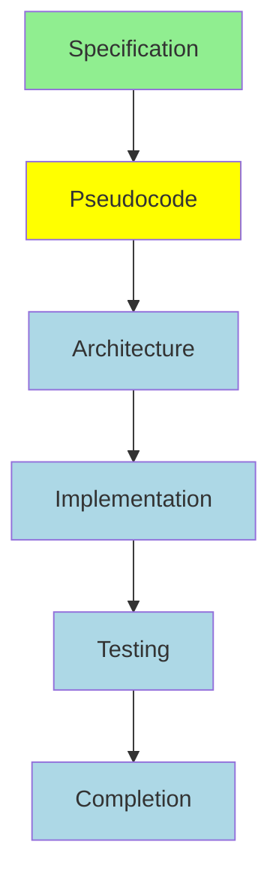

# Agent Coordination Tooling Recommendations
**Version:** 1.0.0
**Status:** Tooling Specification
**Date:** 2026-02-02
**Target Platform:** Erlang/OTP 28+, Claude Code CLI, Linux/macOS

---

## Table of Contents

1. [Executive Summary](#executive-summary)
2. [Core Coordination Tools](#core-coordination-tools)
3. [Dashboard and Visualization](#dashboard-and-visualization)
4. [CLI Tools](#cli-tools)
5. [Development Tools](#development-tools)
6. [Monitoring and Observability](#monitoring-and-observability)
7. [Integration Tools](#integration-tools)
8. [Testing and Validation](#testing-and-validation)
9. [Deployment and Operations](#deployment-and-operations)
10. [Recommended Implementation Roadmap](#recommended-implementation-roadmap)

---

## Executive Summary

This document provides comprehensive tooling recommendations for implementing the agent coordination workflow in erlmcp. The tools are categorized by function and prioritized for implementation.

### Tooling Philosophy

1. **Native Erlang/OTP First**: Leverage built-in OTP capabilities
2. **Minimal External Dependencies**: Use proven, stable libraries
3. **Cloud-Compatible**: Work in ephemeral Claude Code sessions
4. **Developer-Friendly**: Intuitive CLI and web interfaces
5. **Production-Ready**: Robust error handling and monitoring

### Priority Matrix

| Priority | Category | Tools |
|----------|----------|-------|
| P0 (Critical) | Core Coordination | work_order_manager, agent_comm_bus, agent_coordinator_sup |
| P1 (High) | CLI & Monitoring | CLI tools, basic dashboard, OTEL integration |
| P2 (Medium) | Visualization | Advanced dashboard, Grafana, dependency graphs |
| P3 (Low) | Advanced | AI-assisted routing, predictive analytics |

---

## Core Coordination Tools

### 1. Work Order Manager

**Purpose**: Central coordinator for work order lifecycle
**Priority**: P0 (Critical)
**Implementation**: Erlang gen_server

#### Features
- Work order CRUD operations
- Priority queue management
- Dependency graph maintenance
- WIP limit enforcement
- SLA tracking
- Receipt generation

#### Module Structure
```erlang
apps/erlmcp_coordination/
├── src/
│   ├── erlmcp_work_order_manager.erl
│   ├── erlmcp_work_order_queue.erl
│   ├── erlmcp_work_order_deps.erl
│   ├── erlmcp_work_order_sla.erl
│   └── erlmcp_work_order_receipt.erl
├── include/
│   └── work_order.hrl
└── test/
    └── work_order_SUITE.erl
```

#### Dependencies
```erlang
{deps, [
    {uuid, "2.0.6", {pkg, uuid_erl}},  % Work order ID generation
    {digraph, stdlib},                  % Dependency graphs
    {ets, stdlib},                      % Fast lookups
    {calendar, stdlib}                  % Date/time handling
]}.
```

#### Configuration
```erlang
{work_order_manager, [
    {wip_limits, #{
        security => 5,
        reliability => 5,
        compliance => 5,
        cost => 5,
        features => 10,
        technical_debt => 5
    }},
    {sla_hours, #{
        security => 24,
        reliability => 168,
        compliance => 168,
        cost => 720,
        features => 720,
        technical_debt => infinity
    }},
    {enable_receipts, true},
    {receipt_storage, "./receipts/"}
]}.
```

#### CLI Interface
```bash
# Create work order
erlmcp work-order create \
  --title "Implement subscription protocol" \
  --bucket features \
  --priority 7

# Start work order
erlmcp work-order start WO-001

# Get status
erlmcp work-order status WO-001

# Complete work order
erlmcp work-order complete WO-001 --sku sku-feature-123
```

---

### 2. Agent Communication Bus

**Purpose**: Message routing and pub/sub coordination
**Priority**: P0 (Critical)
**Implementation**: Erlang gen_server + GPROC

#### Features
- Topic-based pub/sub
- Request-response with timeout
- Message routing
- Dead letter queue
- Message replay capability

#### Module Structure
```erlang
apps/erlmcp_coordination/
├── src/
│   ├── erlmcp_agent_comm_bus.erl
│   ├── erlmcp_agent_registry.erl
│   ├── erlmcp_message_router.erl
│   └── erlmcp_message_queue.erl
```

#### Dependencies
```erlang
{deps, [
    {gproc, "0.9.0"}  % Process registry and pub/sub
]}.
```

#### Topics
```erlang
-define(TOPICS, [
    work_order_events,       % Work order lifecycle events
    quality_gate_events,     % Quality gate results
    agent_status_events,     % Agent health/status
    andon_alerts,           % Quality alerts
    system_events,          % System-wide events
    coordination_events     % Inter-agent coordination
]).
```

#### Usage Example
```erlang
%% Subscribe to topic
agent_comm_bus:subscribe(work_order_events, self()),

%% Publish event
agent_comm_bus:publish(work_order_events, #{
    event => work_order_completed,
    work_order_id => <<"WO-001">>,
    data => #{...}
}),

%% Request-response
{ok, Response} = agent_comm_bus:request(
    erlang_researcher,
    {research, Query},
    5000  % Timeout
).
```

---

### 3. Agent Coordinator Supervisor

**Purpose**: Supervision tree for all agents
**Priority**: P0 (Critical)
**Implementation**: Erlang supervisor

#### Features
- Dynamic agent spawning
- Automatic restart on failure
- Health monitoring
- Graceful shutdown

#### Supervision Structure
```
erlmcp_coordination_sup (one_for_one)
├── erlmcp_work_order_manager (permanent)
├── erlmcp_agent_comm_bus (permanent)
├── erlmcp_agent_registry (permanent)
├── erlmcp_agent_pool_sup (one_for_one)
│   ├── erlang_otp_developer (permanent)
│   ├── erlang_test_engineer (permanent)
│   ├── erlang_transport_builder (permanent)
│   └── ... (20+ agents)
├── erlmcp_quality_gate_sup (one_for_one)
│   ├── agent_01_compile_gate (permanent)
│   ├── agent_06_test_eunit (transient)
│   ├── agent_11_coverage (permanent)
│   └── ... (quality gates)
└── erlmcp_dashboard_server (permanent)
```

#### Implementation
```erlang
-module(erlmcp_coordination_sup).
-behaviour(supervisor).

init([]) ->
    SupFlags = #{
        strategy => one_for_one,
        intensity => 10,
        period => 60
    },

    ChildSpecs = [
        %% Core infrastructure
        #{id => work_order_manager,
          start => {erlmcp_work_order_manager, start_link, []},
          restart => permanent,
          shutdown => 5000},

        #{id => agent_comm_bus,
          start => {erlmcp_agent_comm_bus, start_link, []},
          restart => permanent,
          shutdown => 5000},

        %% Agent pool supervisor
        #{id => agent_pool_sup,
          start => {erlmcp_agent_pool_sup, start_link, []},
          restart => permanent,
          type => supervisor}
    ],

    {ok, {SupFlags, ChildSpecs}}.
```

---

### 4. Dependency Graph Manager

**Purpose**: Manage work order dependencies and detect cycles
**Priority**: P0 (Critical)
**Implementation**: Erlang digraph + gen_server

#### Features
- Directed acyclic graph (DAG) maintenance
- Circular dependency detection
- Critical path calculation
- Topological sorting
- Dependency visualization

#### API
```erlang
%% Add dependency
ok = erlmcp_deps:add_dependency(WO_002, WO_001),

%% Check if can start (all deps resolved)
{ok, ready} = erlmcp_deps:can_start(WO_002),
{blocked, [WO_001]} = erlmcp_deps:can_start(WO_003),

%% Get critical path
{ok, Path, Duration} = erlmcp_deps:critical_path(Epic),

%% Generate Mermaid diagram
Diagram = erlmcp_deps:generate_diagram(Epic),
file:write_file("deps.mmd", Diagram).
```

#### Visualization Output


---

## Dashboard and Visualization

### 5. Real-Time Coordination Dashboard

**Purpose**: Visual monitoring of agent coordination
**Priority**: P1 (High)
**Implementation**: Cowboy (HTTP server) + Server-Sent Events + React frontend

#### Features
- Real-time work order status
- Agent health monitoring
- Dependency graph visualization
- Quality gate results
- Kanban board view
- Andon alerts
- Metrics charts

#### Architecture
```
┌─────────────────────────────────────┐
│         React Frontend              │
│  (dashboard.html + dashboard.js)    │
└────────────┬────────────────────────┘
             │ HTTP + SSE
             ↓
┌─────────────────────────────────────┐
│    erlmcp_dashboard_server          │
│    (Cowboy HTTP + SSE streaming)    │
└────────────┬────────────────────────┘
             │
             ↓
┌─────────────────────────────────────┐
│   erlmcp_dashboard_metrics          │
│   (Compute metrics from state)      │
└────────────┬────────────────────────┘
             │
             ↓
┌─────────────────────────────────────┐
│   ETS Tables (work_orders, agents)  │
└─────────────────────────────────────┘
```

#### API Endpoints
```erlang
GET  /api/dashboard/summary      % Overall metrics
GET  /api/dashboard/work-orders  % All work orders
GET  /api/dashboard/agents       % Agent status
GET  /api/dashboard/metrics      % Time-series metrics
GET  /api/stream                 % SSE event stream

POST /api/work-orders            % Create work order
POST /api/work-orders/:id/start  % Start work order
POST /api/andon/trigger          % Trigger Andon alert
```

#### Dashboard Views

**1. Overview Dashboard**
```
┌─────────────────────────────────────────────────┐
│  Agent Coordination Dashboard                   │
├─────────────────────────────────────────────────┤
│  WIP: 15/30  │  Queued: 8  │  Completed: 142   │
│  SLA: 96.8%  │  Alerts: 2  │  Velocity: 12/day │
├─────────────────────────────────────────────────┤
│  Work Orders by Status                          │
│  ████████████████░░░░░░░░ In Progress (15)     │
│  ████░░░░░░░░░░░░░░░░░░░░ Queued (8)           │
│  ██████████████████████████ Completed (142)    │
├─────────────────────────────────────────────────┤
│  Active Agents: 18/20                           │
│  ● erlang-otp-developer (WO-023)               │
│  ● erlang-test-engineer (WO-024)               │
│  ● agent-01-compile-gate (idle)                │
├─────────────────────────────────────────────────┤
│  Recent Events                                  │
│  ✅ WO-022 completed (sku-feature-456)         │
│  ⚠️  WO-025 quality gate failed (coverage)      │
│  ▶️  WO-026 started by erlang-transport-builder │
└─────────────────────────────────────────────────┘
```

**2. Kanban Board View**
```
┌─────────┬─────────┬─────────┬─────────┬─────────┐
│ Queued  │ Design  │  Code   │  Test   │  Done   │
│  (8)    │  (3)    │  (5)    │  (7)    │  (142)  │
├─────────┼─────────┼─────────┼─────────┼─────────┤
│ WO-030  │ WO-024  │ WO-023  │ WO-020  │ WO-001  │
│ WO-031  │ WO-025  │ WO-026  │ WO-021  │ WO-002  │
│ WO-032  │ WO-027  │ WO-028  │ WO-022  │ WO-003  │
│         │         │ WO-029  │         │   ...   │
└─────────┴─────────┴─────────┴─────────┴─────────┘
```

**3. Dependency Graph View**
```
[Interactive D3.js force-directed graph]
- Nodes: Work orders (colored by status)
- Edges: Dependencies
- Hover: Show work order details
- Click: Drill into work order
- Highlight: Critical path
```

#### Implementation
```bash
# Start dashboard
erlmcp dashboard start --port 8080

# View in browser
open http://localhost:8080

# Dashboard will auto-update via SSE
```

---

### 6. Grafana Integration

**Purpose**: Long-term metrics and alerting
**Priority**: P2 (Medium)
**Implementation**: Prometheus + Grafana

#### Metrics Exported
```erlang
# Work order metrics
erlmcp_work_orders_total{bucket="features",status="completed"}
erlmcp_work_orders_lead_time_seconds{bucket="features"}
erlmcp_work_orders_wip{bucket="features"}
erlmcp_work_orders_queued{bucket="features"}

# Agent metrics
erlmcp_agents_active{role="erlang_otp_developer"}
erlmcp_agents_work_completed_total{role="erlang_otp_developer"}
erlmcp_agents_errors_total{role="erlang_otp_developer"}

# Quality gate metrics
erlmcp_quality_gates_passed_total{gate="compilation"}
erlmcp_quality_gates_failed_total{gate="compilation"}
erlmcp_quality_gates_duration_seconds{gate="compilation"}

# SLA metrics
erlmcp_sla_compliance_rate{bucket="security"}
erlmcp_sla_breaches_total{bucket="security"}
```

#### Grafana Dashboards
1. **Agent Coordination Overview**: High-level KPIs
2. **Work Order Flows**: Cycle time, lead time, velocity
3. **Quality Gates**: Pass rates, duration trends
4. **SLA Tracking**: Compliance by bucket, breaches
5. **Agent Performance**: Work completed, error rates

---

## CLI Tools

### 7. erlmcp CLI

**Purpose**: Command-line interface for agent coordination
**Priority**: P1 (High)
**Implementation**: Bash + escript

#### Commands

```bash
# Work order management
erlmcp work-order create --title "..." --bucket features --priority 7
erlmcp work-order list [--bucket security] [--status queued]
erlmcp work-order show WO-001
erlmcp work-order start WO-001
erlmcp work-order complete WO-001 --sku sku-123
erlmcp work-order cancel WO-001 --reason "Duplicate"

# Agent management
erlmcp agent list
erlmcp agent status erlang-otp-developer
erlmcp agent spawn erlang-researcher
erlmcp agent pause erlang-test-engineer
erlmcp agent resume erlang-test-engineer

# Quality gates
erlmcp quality-gate run WO-001 compilation
erlmcp quality-gate status WO-001
erlmcp quality-gate list

# Dashboard
erlmcp dashboard start [--port 8080]
erlmcp dashboard metrics
erlmcp dashboard summary

# Andon
erlmcp andon list
erlmcp andon trigger --reason "..." --severity high
erlmcp andon resolve ALERT-001 --resolution "..."

# Dependencies
erlmcp deps add WO-002 --depends-on WO-001
erlmcp deps show WO-002
erlmcp deps diagram EPIC-001 --output deps.mmd

# Receipts
erlmcp receipt show WO-001
erlmcp receipt verify WO-001
erlmcp receipt chain WO-001

# Reports
erlmcp report progress EPIC-001
erlmcp report velocity --since "7 days ago"
erlmcp report sla --bucket security
```

#### Implementation Structure
```bash
tools/erlmcp-cli/
├── bin/
│   └── erlmcp                    # Main entry point
├── commands/
│   ├── work_order.sh
│   ├── agent.sh
│   ├── quality_gate.sh
│   ├── dashboard.sh
│   ├── andon.sh
│   ├── deps.sh
│   ├── receipt.sh
│   └── report.sh
└── lib/
    ├── common.sh                 # Shared utilities
    └── api_client.sh             # HTTP client for erlmcp API
```

---

### 8. Interactive Shell (REPL)

**Purpose**: Interactive Erlang shell for debugging
**Priority**: P1 (High)
**Implementation**: Erlang shell + custom commands

#### Start Shell
```bash
erlmcp shell

# Loads coordination app and provides helper functions
```

#### REPL Commands
```erlang
%% Work orders
1> wo:list().
2> wo:show(<<"WO-001">>).
3> wo:start(<<"WO-001">>).

%% Agents
4> agents:list().
5> agents:status(erlang_otp_developer).

%% Quality gates
6> gates:run(<<"WO-001">>, compilation).

%% Dependencies
7> deps:graph(<<"EPIC-001">>).

%% Metrics
8> metrics:summary().
9> metrics:velocity(7).  % Last 7 days

%% Debug helpers
10> debug:trace_work_order(<<"WO-001">>).
11> debug:trace_agent(erlang_otp_developer).
12> debug:dump_state(work_order_manager).
```

---

## Development Tools

### 9. Agent Development Kit (ADK)

**Purpose**: Scaffolding and templates for new agents
**Priority**: P2 (Medium)
**Implementation**: Rebar3 templates

#### Features
- Generate new agent skeleton
- Pre-configured supervision
- Test scaffolding
- Documentation templates

#### Usage
```bash
# Generate new agent
rebar3 new erlmcp-agent name=my_agent \
  role=my_agent \
  restart=permanent \
  topics=work_order_events,quality_gate_events

# Generated structure
apps/erlmcp_agents/
└── src/
    ├── my_agent.erl
    └── my_agent_tests.erl
```

#### Agent Template
```erlang
-module(my_agent).
-behaviour(gen_server).
-behaviour(erlmcp_agent).

%% API
-export([start_link/0]).

%% erlmcp_agent callbacks
-export([agent_role/0, agent_capabilities/0]).

%% gen_server callbacks
-export([init/1, handle_call/3, handle_cast/3, handle_info/2]).

-record(state, {
    role :: agent_role(),
    current_work_order :: work_order_id() | undefined
}).

%%====================================================================
%% API
%%====================================================================

start_link() ->
    gen_server:start_link(?MODULE, [], []).

%%====================================================================
%% erlmcp_agent callbacks
%%====================================================================

agent_role() -> my_agent.

agent_capabilities() ->
    #{
        topics => [work_order_events, quality_gate_events],
        commands => [start_work, complete_work],
        queries => [get_status]
    }.

%%====================================================================
%% gen_server callbacks
%%====================================================================

init([]) ->
    %% Register agent
    erlmcp_agent_registry:register(agent_role()),

    %% Subscribe to topics
    lists:foreach(fun(Topic) ->
        erlmcp_agent_comm_bus:subscribe(Topic, self())
    end, maps:get(topics, agent_capabilities())),

    {ok, #state{role = agent_role()}}.

handle_call({execute, WorkOrder}, _From, State) ->
    %% Execute work order
    Result = execute_work_order(WorkOrder, State),
    {reply, Result, State}.

handle_cast({notify, Event}, State) ->
    %% Handle event
    NewState = handle_event(Event, State),
    {noreply, NewState}.

handle_info({message, Topic, Message}, State) ->
    %% Handle subscribed message
    NewState = handle_message(Topic, Message, State),
    {noreply, NewState}.
```

---

### 10. Testing Framework

**Purpose**: Test agent coordination workflows
**Priority**: P1 (High)
**Implementation**: EUnit + Common Test

#### Test Utilities
```erlang
-module(coordination_test_utils).

%% Setup test coordination system
start_coordination() ->
    {ok, _} = application:ensure_all_started(erlmcp_coordination),
    cleanup_ets_tables(),
    ok.

stop_coordination() ->
    application:stop(erlmcp_coordination),
    ok.

%% Create test work order
create_test_work_order(Opts) ->
    WorkOrder = maps:merge(#{
        title => <<"Test work order">>,
        bucket => features,
        priority => 5
    }, Opts),
    erlmcp_work_order_manager:create_work_order(WorkOrder).

%% Wait for event
wait_for_event(Event, Timeout) ->
    receive
        #{event := Event} = Msg -> {ok, Msg}
    after Timeout ->
        {error, timeout}
    end.

%% Mock agent
mock_agent(Role) ->
    Pid = spawn(fun() -> mock_agent_loop(Role) end),
    erlmcp_agent_registry:register(Role, Pid),
    Pid.

mock_agent_loop(Role) ->
    receive
        {execute, WorkOrder} ->
            erlmcp_work_order_manager:complete_work_order(
                get_id(WorkOrder),
                <<"sku-test">>
            ),
            mock_agent_loop(Role);
        stop ->
            ok
    end.
```

#### Example Test
```erlang
work_order_lifecycle_test() ->
    %% Setup
    coordination_test_utils:start_coordination(),
    subscribe_topic(work_order_events),

    %% Create work order
    {ok, WoId} = create_test_work_order(#{
        title => <<"Test implementation">>,
        bucket => features,
        priority => 7
    }),

    %% Verify creation event
    {ok, _} = wait_for_event(work_order_created, 1000),

    %% Start work order
    ok = erlmcp_work_order_manager:start_work_order(WoId),

    %% Verify started event
    {ok, _} = wait_for_event(work_order_started, 1000),

    %% Complete work order
    ok = erlmcp_work_order_manager:complete_work_order(WoId, <<"sku-test">>),

    %% Verify completed event
    {ok, _} = wait_for_event(work_order_completed, 1000),

    %% Cleanup
    coordination_test_utils:stop_coordination().
```

---

## Monitoring and Observability

### 11. OpenTelemetry Integration

**Purpose**: Distributed tracing and metrics
**Priority**: P1 (High)
**Implementation**: opentelemetry-erlang

#### Instrumentation Points
```erlang
%% Work order span
-spec start_work_order(WorkOrderId :: binary()) -> ok.
start_work_order(WorkOrderId) ->
    Span = otel_tracer:start_span(<<"work_order.start">>, #{
        <<"work_order.id">> => WorkOrderId
    }),

    try
        do_start_work_order(WorkOrderId)
    after
        otel_tracer:end_span(Span)
    end.

%% Agent execution span
-spec execute_work_order(WorkOrder :: work_order()) -> ok.
execute_work_order(WorkOrder) ->
    Span = otel_tracer:start_span(<<"agent.execute">>, #{
        <<"agent.role">> => get_agent_role(),
        <<"work_order.id">> => get_id(WorkOrder)
    }),

    try
        do_execute(WorkOrder)
    after
        otel_tracer:end_span(Span)
    end.
```

#### Trace Visualization
```
Trace: Work Order WO-001 Lifecycle
├─ work_order.create (5ms)
├─ dependency.check (2ms)
├─ queue.enqueue (1ms)
├─ work_order.start (10ms)
│  ├─ agent.assign (3ms)
│  └─ wip.increment (1ms)
├─ agent.execute (8500ms)
│  ├─ code.implement (7000ms)
│  ├─ tests.write (1200ms)
│  └─ quality_gates.run (300ms)
│     ├─ compilation (150ms)
│     ├─ tests (100ms)
│     └─ coverage (50ms)
└─ work_order.complete (15ms)
   ├─ receipt.generate (10ms)
   └─ dependencies.resolve (5ms)

Total: 8533ms
```

---

### 12. Health Check System

**Purpose**: Monitor agent and system health
**Priority**: P1 (High)
**Implementation**: gen_server + HTTP endpoint

#### Health Checks
```erlang
%% Health check types
-type health_check() ::
    {liveness, fun(() -> ok | {error, term()})} |
    {readiness, fun(() -> ok | {error, term()})} |
    {dependency, binary(), fun(() -> ok | {error, term()})}.

%% Register health checks
health:register_check(liveness, fun() ->
    case is_process_alive(work_order_manager) of
        true -> ok;
        false -> {error, work_order_manager_dead}
    end
end),

health:register_check(readiness, fun() ->
    case ets:info(work_orders) of
        undefined -> {error, ets_not_ready};
        _ -> ok
    end
end).
```

#### HTTP Health Endpoints
```bash
# Kubernetes-style health checks
GET /health/live    # Liveness probe
GET /health/ready   # Readiness probe
GET /health/startup # Startup probe

# Response format
{
  "status": "healthy",
  "checks": {
    "work_order_manager": "ok",
    "agent_comm_bus": "ok",
    "ets_tables": "ok"
  },
  "timestamp": "2026-02-02T10:30:00Z"
}
```

---

### 13. Logging and Audit Trail

**Purpose**: Comprehensive logging and audit
**Priority**: P1 (High)
**Implementation**: logger + structured logs

#### Log Levels
```erlang
%% Structured logging
-define(LOG_INFO(Msg, Meta), logger:info(Msg, Meta)).
-define(LOG_WARNING(Msg, Meta), logger:warning(Msg, Meta)).
-define(LOG_ERROR(Msg, Meta), logger:error(Msg, Meta)).

%% Example
?LOG_INFO(<<"Work order started">>, #{
    work_order_id => WoId,
    agent => Agent,
    bucket => Bucket,
    priority => Priority
}).
```

#### Audit Log
```erlang
%% Audit critical operations
audit:log(#{
    event => work_order_created,
    work_order_id => WoId,
    user => User,
    timestamp => calendar:universal_time(),
    metadata => #{...}
}).

audit:log(#{
    event => andon_triggered,
    alert_id => AlertId,
    severity => critical,
    reason => Reason,
    timestamp => calendar:universal_time()
}).
```

---

## Integration Tools

### 14. GitHub Integration

**Purpose**: Sync with GitHub issues and PRs
**Priority**: P2 (Medium)
**Implementation**: gh CLI + webhook handler

#### Features
- Auto-create work orders from issues
- Update issue status from work orders
- Link PRs to work orders
- Comment on issues with progress

#### Configuration
```erlang
{github_integration, [
    {enabled, true},
    {repo, "erlmcp/erlmcp"},
    {webhook_secret, {env, "GITHUB_WEBHOOK_SECRET"}},
    {auto_create_work_orders, true},
    {label_mapping, #{
        <<"bug">> => reliability,
        <<"security">> => security,
        <<"enhancement">> => features
    }}
]}.
```

#### Webhook Handler
```erlang
%% Handle GitHub issue opened
handle_github_event(<<"issues.opened">>, Payload) ->
    Issue = maps:get(<<"issue">>, Payload),
    Labels = [L || #{<<"name">> := L} <- maps:get(<<"labels">>, Issue)],
    Bucket = map_labels_to_bucket(Labels),

    WorkOrder = #{
        type => story,
        title => maps:get(<<"title">>, Issue),
        description => maps:get(<<"body">>, Issue),
        bucket => Bucket,
        priority => determine_priority(Labels),
        pull_signal => #{
            type => github_issue,
            source => maps:get(<<"html_url">>, Issue),
            labels => Labels
        }
    },

    {ok, WoId} = erlmcp_work_order_manager:create_work_order(WorkOrder),

    %% Comment on issue
    github:create_comment(
        maps:get(<<"number">>, Issue),
        io_lib:format("Work order created: ~s", [WoId])
    ).
```

---

### 15. Slack Integration

**Purpose**: Notifications and alerts
**Priority**: P2 (Medium)
**Implementation**: Slack webhook API

#### Notifications
```erlang
%% Send Slack notification
slack:send_notification(#{
    channel => <<"#mcp-dev">>,
    text => <<"Work order WO-001 completed">>,
    attachments => [#{
        color => <<"good">>,
        fields => [
            #{title => <<"Work Order">>, value => <<"WO-001">>, short => true},
            #{title => <<"Lead Time">>, value => <<"8.5 hours">>, short => true},
            #{title => <<"Agent">>, value => <<"erlang-otp-developer">>, short => true}
        ]
    }]
}).

%% Andon alert to Slack
slack:send_alert(#{
    channel => <<"#incidents">>,
    text => <<"⚠️ ANDON ALERT: Quality gate failed">>,
    priority => high,
    details => #{...}
}).
```

---

## Testing and Validation

### 16. Load Testing Tool

**Purpose**: Validate coordination under load
**Priority**: P2 (Medium)
**Implementation**: Custom load generator

#### Load Test Scenarios
```erlang
%% Scenario 1: Steady state
load_test:run(#{
    scenario => steady_state,
    work_orders_per_minute => 10,
    duration_minutes => 60,
    agent_count => 20
}),

%% Scenario 2: Burst traffic
load_test:run(#{
    scenario => burst,
    burst_size => 50,
    burst_interval_seconds => 300,
    duration_minutes => 30
}),

%% Scenario 3: Dependency chains
load_test:run(#{
    scenario => dependency_chains,
    chain_length => 10,
    chains_count => 5,
    duration_minutes => 45
}).
```

#### Metrics Collected
- Work order throughput (completions/min)
- Average lead time
- P95/P99 latency
- Agent utilization
- Queue depth
- Error rate
- SLA compliance

---

### 17. Chaos Engineering Tool

**Purpose**: Test resilience and recovery
**Priority**: P2 (Medium)
**Implementation**: Custom chaos module

#### Chaos Experiments
```erlang
%% Kill random agent
chaos:kill_random_agent(),

%% Network partition
chaos:partition_nodes([node1, node2]),

%% Slow down message delivery
chaos:inject_latency(work_order_events, 500),  % 500ms delay

%% Corrupt messages
chaos:corrupt_messages(0.01),  % 1% corruption rate

%% Fill message queues
chaos:fill_queue(erlang_otp_developer, 10000).
```

---

## Deployment and Operations

### 18. Docker Support

**Purpose**: Containerized deployment
**Priority**: P2 (Medium)
**Implementation**: Dockerfile + docker-compose

#### Dockerfile
```dockerfile
FROM erlang:28-alpine

WORKDIR /app

# Copy application
COPY apps/ apps/
COPY rebar.config rebar.config
COPY rebar.lock rebar.lock

# Build
RUN rebar3 as prod release

# Expose ports
EXPOSE 8080 4369

# Start application
CMD ["/app/_build/prod/rel/erlmcp/bin/erlmcp", "foreground"]
```

#### docker-compose.yml
```yaml
version: '3.8'

services:
  coordination:
    build: .
    ports:
      - "8080:8080"
    environment:
      - ERLANG_COOKIE=secret
      - NODE_NAME=coordination@localhost
    volumes:
      - ./receipts:/app/receipts

  dashboard:
    image: grafana/grafana:latest
    ports:
      - "3000:3000"
    volumes:
      - ./grafana:/etc/grafana/provisioning

  prometheus:
    image: prom/prometheus:latest
    ports:
      - "9090:9090"
    volumes:
      - ./prometheus.yml:/etc/prometheus/prometheus.yml
```

---

### 19. Kubernetes Manifests

**Purpose**: Production deployment
**Priority**: P3 (Low)
**Implementation**: K8s YAML manifests + Helm chart

#### Deployment
```yaml
apiVersion: apps/v1
kind: Deployment
metadata:
  name: erlmcp-coordination
spec:
  replicas: 3
  selector:
    matchLabels:
      app: erlmcp-coordination
  template:
    metadata:
      labels:
        app: erlmcp-coordination
    spec:
      containers:
      - name: coordination
        image: erlmcp/coordination:latest
        ports:
        - containerPort: 8080
        livenessProbe:
          httpGet:
            path: /health/live
            port: 8080
          initialDelaySeconds: 30
          periodSeconds: 10
        readinessProbe:
          httpGet:
            path: /health/ready
            port: 8080
          initialDelaySeconds: 10
          periodSeconds: 5
        env:
        - name: NODE_NAME
          valueFrom:
            fieldRef:
              fieldPath: metadata.name
        - name: ERLANG_COOKIE
          valueFrom:
            secretKeyRef:
              name: erlang-secret
              key: cookie
```

---

## Recommended Implementation Roadmap

### Phase 1: Foundation (Weeks 1-2)
**Goal**: Core coordination infrastructure

1. ✅ Work Order Manager (erlmcp_work_order_manager)
2. ✅ Agent Communication Bus (erlmcp_agent_comm_bus)
3. ✅ Agent Registry (erlmcp_agent_registry)
4. ✅ Dependency Manager (erlmcp_deps)
5. ✅ Supervision Tree (erlmcp_coordination_sup)

**Deliverables**:
- Core modules implemented
- Unit tests (≥80% coverage)
- Integration tests
- Basic CLI

### Phase 2: Visualization (Weeks 3-4)
**Goal**: Real-time monitoring and debugging

1. ✅ Dashboard Server (erlmcp_dashboard_server)
2. ✅ Dashboard Frontend (React + SSE)
3. ✅ CLI Tools (erlmcp command suite)
4. ✅ Interactive Shell (REPL)
5. ✅ Logging Infrastructure

**Deliverables**:
- Working dashboard at localhost:8080
- Full CLI suite
- Debug REPL
- Structured logging

### Phase 3: Quality & Integration (Weeks 5-6)
**Goal**: Production readiness

1. ✅ OpenTelemetry Integration
2. ✅ Health Check System
3. ✅ Testing Framework
4. ✅ GitHub Integration
5. ✅ Slack Integration

**Deliverables**:
- OTEL traces and metrics
- Health endpoints
- Load tests
- GitHub webhook handler
- Slack notifications

### Phase 4: Operations (Weeks 7-8)
**Goal**: Deployment and scaling

1. ✅ Docker Support
2. ✅ Grafana Dashboards
3. ✅ Documentation
4. ✅ Runbooks
5. ✅ Performance Optimization

**Deliverables**:
- Docker images
- Grafana dashboards
- Complete documentation
- Operational runbooks
- Performance benchmarks

---

## Tooling Dependencies Summary

### Core Dependencies
```erlang
{deps, [
    % Essential
    {gproc, "0.9.0"},              % Agent registry + pub/sub
    {uuid, "2.0.6", {pkg, uuid_erl}},  % Work order IDs
    {jsx, "3.1.0"},                % JSON encoding

    % Web/API
    {cowboy, "2.10.0"},            % HTTP server for dashboard
    {gun, "2.0.1"},                % HTTP client for integrations

    % Observability
    {opentelemetry_api, "1.5.0"},
    {opentelemetry, "1.7.0"},
    {opentelemetry_exporter, "1.10.0"},

    % Testing
    {meck, "0.9.2"},               % Mocking
    {proper, "1.4.0"}              % Property-based testing
]}.
```

### External Tools
- **Docker**: Container deployment
- **Grafana**: Visualization
- **Prometheus**: Metrics storage
- **gh CLI**: GitHub integration
- **curl/httpie**: API testing

---

## Conclusion

This comprehensive tooling suite provides everything needed to implement, monitor, and operate the agent coordination workflow for MCP implementation in erlmcp.

**Key Features**:
- Complete coordination infrastructure
- Real-time dashboard and CLI
- Production-grade monitoring
- Integration with GitHub/Slack
- Testing and validation tools
- Deployment automation

**Next Steps**:
1. Follow implementation roadmap
2. Start with Phase 1 foundation
3. Iterate with user feedback
4. Expand with Phase 2-4 tools

**Status**: Ready for Implementation
**Estimated Effort**: 8 weeks with 2 developers
