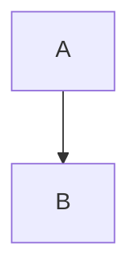

# erlmcp Documentation Index v2.1.0

## Quick Navigation

**Core Documentation:**
- [Architecture](#architecture) - System design and supervision trees
- [Module Index](#module-reference) - Complete module catalog
- [OTP Patterns](#otp-patterns) - Erlang/OTP design patterns
- [Mermaid Diagrams](#visual-documentation) - Complete diagram suite

**Getting Started:**
- [Getting Started Guide](#getting-started) - Installation and first steps
- [Examples](#examples) - Code examples and tutorials
- [API Reference](#api-reference) - Complete API documentation

**Operations:**
- [Deployment](#deployment) - Production deployment guides
- [Monitoring](#monitoring) - Observability and metrics
- [Troubleshooting](#troubleshooting) - Common issues and solutions

**Quality:**
- [Testing](#testing) - Test strategy and coverage
- [Quality Gates](#quality-gates) - TCPS quality system
- [CI/CD](#ci-cd) - Continuous integration

---

## Architecture

### Primary Architecture Documents

| Document | Description | Format |
|----------|-------------|--------|
| **[architecture.md](architecture.md)** | Complete system architecture v2.1.0 with 164 modules | Markdown + Mermaid |
| **[otp-patterns.md](otp-patterns.md)** | OTP supervision patterns and best practices | Markdown + Mermaid |
| **[MODULE_INDEX.md](MODULE_INDEX.md)** | Complete catalog of all 164 modules | Markdown |
| **[mermaid-architecture.md](mermaid-architecture.md)** | Mermaid integration architecture | Markdown |

### Key Architecture Topics

**System Overview:**
- Umbrella application structure (4 OTP apps)
- 3-tier supervision hierarchy
- Process-per-connection architecture
- Library integration (gproc, gun, ranch, poolboy)

**Supervision Trees:**
- TIER 1: Application supervisors (one_for_all)
- TIER 2: Service supervisors (simple_one_for_one)
- TIER 3: Isolated workers (process-per-connection)
- Standalone processes (monitored, not linked)

**Module Organization:**
- Core Layer (97 modules) - Protocol, sessions, auth, LLM
- Transport Layer (23 modules) - stdio, tcp, http, ws, sse
- Observability Layer (31 modules) - Metrics, traces, chaos
- Validation Layer (13 modules) - Compliance, spec parsing

### Architecture Diagrams

**Visual Reference:**
```
diagrams/
├── system-architecture.mmd          # Complete system overview
├── supervision-tree.mmd             # 3-tier supervision hierarchy
├── module-dependencies.mmd          # Inter-module dependencies
├── data-flow.mmd                    # Request/response flow
└── reference/
    └── module-index.mmd             # Complete module index
```

**How to View:**
- GitHub: Native Mermaid rendering
- CLI: `npm install -g @mermaid-js/mermaid-cli`
- Web: [Mermaid Live Editor](https://mermaid.live)

---

## Module Reference

### Complete Module Catalog

| Application | Modules | Documentation |
|-------------|---------|--------------|
| **[erlmcp_core](apps/erlmcp_core/)** | 97 | Protocol, sessions, auth, LLM integration |
| **[erlmcp_transports](apps/erlmcp_transports/)** | 23 | stdio, tcp, http, ws, sse transports |
| **[erlmcp_observability](apps/erlmcp_observability/)** | 31 | Metrics, tracing, chaos engineering |
| **[erlmcp_validation](apps/erlmcp_validation/)** | 13 | Compliance, validation, test infrastructure |

### Module Categories

**Protocol Layer (8 modules):**
- `erlmcp_json_rpc` - JSON-RPC 2.0 codec
- `erlmcp_message_handler` - Message routing
- `erlmcp_message_parser` - Parse & validate
- `erlmcp_request_id` - UUID generation
- `erlmcp_refusal` - Refusal codes [1001-1089]
- `erlmcp_errors` - Error handling
- `erlmcp_logging` - Structured logging
- `erlmcp_message_size` - Size validation

**Session Management (10 modules):**
- `erlmcp_session_manager` - Lifecycle coordination
- `erlmcp_session` - State management
- `erlmcp_session_backend` - Backend interface
- `erlmcp_session_ets` - In-memory (fastest)
- `erlmcp_session_dets` - Disk-based (durable)
- `erlmcp_session_mnesia` - Cluster (distributed)
- `erlmcp_session_failover` - Failover orchestration
- `erlmcp_session_replicator` - Replication protocol
- `erlmcp_pagination` - Pagination support
- `erlmcp_cancellation` - Request cancellation

**MCP Capabilities (12 modules):**
- `erlmcp_capabilities` - Capability negotiation
- `erlmcp_resources` - Resource management
- `erlmcp_tool` - Tool invocation
- `erlmcp_prompt_template` - Prompt management
- `erlmcp_progress` - Progress tokens
- `erlmcp_sampling` - Sampling strategies
- `erlmcp_completion` - Completion handling
- `erlmcp_subscription` - Subscription management

**Security (5 modules):**
- `erlmcp_auth` - Authentication/authorization
- `erlmcp_auth_mtls` - Mutual TLS
- `erlmcp_auth_rate_limiter` - Auth-specific limits
- `erlmcp_secrets` - Secrets management
- `erlmcp_uri_validator` - URI validation

**Resilience (10 modules):**
- `erlmcp_circuit_breaker` - Circuit breaker pattern
- `erlmcp_rate_limiter` - Rate limiting
- `erlmcp_connection_monitor` - Health monitoring
- `erlmcp_connection_limiter` - Connection limits
- `erlmcp_memory_guard` - Memory protection
- `erlmcp_cpu_guard` - CPU protection

**LLM Integration (4 modules):**
- `erlmcp_llm_provider_anthropic` - Claude integration
- `erlmcp_llm_provider_openai` - GPT integration
- `erlmcp_llm_provider_local` - Local model support
- `erlmcp_mock_llm` - Test harness

**See:** [MODULE_INDEX.md](MODULE_INDEX.md) for complete catalog

---

## OTP Patterns

### Supervision Strategies

| Strategy | Purpose | Examples |
|----------|---------|----------|
| **one_for_all** | Application-level | erlmcp_sup, core_sup |
| **one_for_one** | Independent services | transport_sup, observability_sup |
| **simple_one_for_one** | Dynamic workers | server_sup, client_sup |

### gen_server Patterns

**Client Implementation:**
```erlang
%% Synchronous call with timeout
handle_call({calculate, Expression}, From, State) ->
    RequestId = send_request(Expression, State),
    NewState = store_pending(RequestId, From, State),
    {noreply, NewState}.

%% Handle async response
handle_info({response, RequestId, Result}, State) ->
    case take_pending(RequestId, State) of
        {ok, From, NewState} ->
            gen_server:reply(From, Result),
            {noreply, NewState};
        error ->
            {noreply, State}
    end.
```

**Server Implementation:**
```erlang
%% Resource management
handle_call({add_resource, Uri, Handler}, _From, State) ->
    NewState = State#state{
        resources = maps:put(Uri, Handler, State#state.resources)
    },
    {reply, ok, NewState}.
```

### Process Design Patterns

**1. Request-Response Correlation:**
```erlang
-record(state, {
    request_id = 1 :: integer(),
    pending = #{} :: #{integer() => {pid(), reference()}}
}).
```

**2. Subscription Management:**
```erlang
-record(state, {
    subscriptions = #{} :: #{binary() => sets:set(pid())}
}).
```

**3. Process Monitoring:**
```erlang
init(Args) ->
    process_flag(trap_exit, true),
    {ok, initialize_state(Args)}.
```

**See:** [otp-patterns.md](otp-patterns.md) for complete patterns

---

## Visual Documentation

### Mermaid Diagram Suite

**Complete Diagram Index:**

| Category | Diagrams | Location |
|----------|----------|----------|
| **Architecture** | 5 diagrams | `diagrams/*.mmd` |
| **Protocol** | 6 diagrams | `diagrams/protocol/*.mmd` |
| **Transports** | 6 diagrams | `diagrams/transports/*.mmd` |
| **Observability** | 6 diagrams | `diagrams/observability/*.mmd` |
| **Validation** | 5 diagrams | `diagrams/validation/*.mmd` |
| **Security** | 5 diagrams | `diagrams/security/*.mmd` |
| **Development** | 6 diagrams | `diagrams/development/*.mmd` |
| **Deployment** | 6 diagrams | `diagrams/deployment/*.mmd` |
| **Monitoring** | 5 diagrams | `diagrams/monitoring/*.mmd` |
| **API** | 5 diagrams | `diagrams/api/*.mmd` |
| **Examples** | 5 diagrams | `diagrams/examples/*.mmd` |
| **Reference** | 5 diagrams | `diagrams/reference/*.mmd` |
| **Total** | **70 diagrams** | Complete coverage |

### Key Diagrams

**System Architecture:**
- [`system-architecture.mmd`](diagrams/system-architecture.mmd) - Complete system overview
- [`supervision-tree.mmd`](diagrams/supervision-tree.mmd) - 3-tier supervision
- [`module-dependencies.mmd`](diagrams/module-dependencies.mmd) - Dependencies

**Protocol & Data Flow:**
- [`data-flow.mmd`](diagrams/data-flow.mmd) - Request/response flow
- [`protocol/session-lifecycle.mmd`](diagrams/protocol/session-lifecycle.mmd) - State machine
- [`protocol/client-server-interaction.mmd`](diagrams/protocol/client-server-interaction.mmd) - Message exchange

**Transports:**
- [`transport-interfaces.mmd`](diagrams/transport-interfaces.mmd) - Behavior polymorphism
- [`transports/transport-types.mmd`](diagrams/transports/transport-types.mmd) - All transports
- [`transports/protocol-handlers.mmd`](diagrams/transports/protocol-handlers.mmd) - Handlers

**Observability:**
- [`observability/telemetry-flow.mmd`](diagrams/observability/telemetry-flow.mmd) - OTEL flow
- [`observability/health-monitoring.mmd`](diagrams/observability/health-monitoring.mmd) - Health checks
- [`observability/chaos-testing.mmd`](diagrams/observability/chaos-testing.mmd) - Chaos scenarios

**Validation:**
- [`validation/validator-architecture.mmd`](diagrams/validation/validator-architecture.mmd) - Validators
- [`validation/compliance-reporting.mmd`](diagrams/validation/compliance-reporting.mmd) - Reports
- [`validation/quality-gates.mmd`](diagrams/validation/quality-gates.mmd) - Quality gates

**Security:**
- [`security/authentication-flow.mmd`](diagrams/security/authentication-flow.mmd) - Auth flow
- [`security/secrets-management.mmd`](diagrams/security/secrets-management.mmd) - Secrets
- [`security/transport-security.mmd`](diagrams/security/transport-security.mmd) - TLS

**Development:**
- [`development/tdd-workflow.mmd`](diagrams/development/tdd-workflow.mmd) - TDD process
- [`development/ci-cd-pipeline.mmd`](diagrams/development/ci-cd-pipeline.mmd) - CI/CD
- [`development/code-review-process.mmd`](diagrams/development/code-review-process.mmd) - Reviews

### Viewing Diagrams

**GitHub/Markdown:**
```markdown

```

**CLI (render to PNG/SVG):**
```bash
npm install -g @mermaid-js/mermaid-cli
mmdc -i diagram.mmd -o diagram.png
```

**Live Editor:**
1. Open [mermaid.live](https://mermaid.live)
2. Paste diagram content
3. Export to PNG/SVG

---

## Getting Started

### Quick Start

**1. Installation:**
```bash
# Clone repository
git clone https://github.com/erlmcp/erlmcp.git
cd erlmcp

# Install dependencies
rebar3 compile

# Run tests
rebar3 eunit
```

**2. Start a Server:**
```erlang
% Start erlmcp
application:ensure_all_started(erlmcp).

% Create a server
{ok, Server} = erlmcp_server:start_link(my_server, #{
    capabilities => #{
        resources => #{},
        tools => #{}
    }
}).

% Add a tool
ok = erlmcp_server:add_tool(Server, <<"echo">>,
    fun(Args) -> {ok, Args} end,
    #{description => <<"Echo input">>}).
```

**3. Connect a Client:**
```erlang
% Connect to server
{ok, Client} = erlmcp_client:start_link(my_client,
    stdio, #{},
    #{server_id => my_server}).

% Call tool
{ok, Result} = erlmcp_client:call_tool(Client, <<"echo">>,
    #{<<"message">> => <<"Hello">>}).
```

### Documentation

| Guide | Description |
|-------|-------------|
| **[GETTING_STARTED.md](GETTING_STARTED.md)** | Installation and first steps |
| **[FOR_DEVELOPERS.md](FOR_DEVELOPERS.md)** | Developer guide |
| **[FOR_OPERATORS.md](FOR_OPERATORS.md)** | Operations guide |
| **[FOR_ARCHITECTS.md](FOR_ARCHITECTS.md)** | Architecture deep dive |

### Examples

**Location:** [`examples/`](../examples/)

**Available Examples:**
- `echo_server/` - Simple echo server
- `resource_server/` - Resource management
- `tool_server/` - Tool invocation
- `multi_transport/` - Multiple transports
- `auth_example/` - Authentication
- `subscription_example/` - Resource subscriptions

---

## API Reference

### Core API

**Client API:**
```erlang
%% Start client
erlmcp_client:start_link(ClientId, TransportType, TransportConfig, Options).

%% Call tool
erlmcp_client:call_tool(ClientPid, ToolName, Args).

%% Read resource
erlmcp_client:read_resource(ClientPid, Uri).

%% Subscribe to resource
erlmcp_client:subscribe_resource(ClientPid, Uri, Pid).
```

**Server API:**
```erlang
%% Start server
erlmcp_server:start_link(ServerId, Capabilities).

%% Add tool
erlmcp_server:add_tool(ServerPid, ToolName, Handler, Schema).

%% Add resource
erlmcp_server:add_resource(ServerPid, Uri, Handler).

%% List prompts
erlmcp_server:list_prompts(ServerPid).
```

**Registry API:**
```erlang
%% Register server
erlmcp_registry:register_server(ServerId, ServerPid, Config).

%% Find server
erlmcp_registry:find_server(ServerId).

%% Route message
erlmcp_registry:route_to_server(ServerId, TransportId, Message).
```

### Transport API

**Transport Behavior:**
```erlang
-callback init(TransportId, Config) ->
    {ok, State} | {error, Reason}.

-callback send(Data, State) ->
    ok | {error, Reason}.

-callback close(State) ->
    ok.
```

**Transport Usage:**
```erlang
%% Start transport
erlmcp_transport_sup:start_child(TransportId, Type, Config).

%% Send data
erlmcp_transport:send(TransportPid, Data).

%% Close transport
erlmcp_transport:close(TransportPid).
```

### Observability API

**Metrics:**
```erlang
%% Record metric
erlmcp_metrics:record(#{name => latency_us, value => 1234}).

%% Get metrics
erlmcp_metrics:get_metrics().
```

**Tracing:**
```erlang
%% Start span
Span = erlmcp_otel:start_span(<<"operation">>, Metadata).

%% End span
erlmcp_otel:end_span(Span).
```

**Receipts:**
```erlang
%% Append receipt
erlmcp_receipt_chain:append(EventData).

%% Verify chain
erlmcp_receipt_chain:verify(Chain).
```

**See:** [`docs/api-reference.md`](api-reference.md) for complete API

---

## Deployment

### Deployment Guides

| Guide | Description |
|-------|-------------|
| **[DEPLOYMENT_RUNBOOK.md](DEPLOYMENT_RUNBOOK.md)** | Production deployment |
| **[PRODUCTION_LAUNCH_CHECKLIST.md](PRODUCTION_LAUNCH_CHECKLIST.md)** | Pre-launch checklist |
| **[ENVIRONMENT_GUIDE.md](ENVIRONMENT_GUIDE.md)** | Environment setup |

### Deployment Modes

**Minimal Deployment (Core + Transports + Observability):**
```erlang
% 31 modules
% Size: ~50MB
% Apps: [erlmcp_core, erlmcp_transports, erlmcp_observability]
```

**Full Deployment (with TCPS Quality System):**
```erlang
% 164 modules
% Size: ~65MB
% Apps: [erlmcp_core, erlmcp_transports, erlmcp_observability, tcps_erlmcp]
```

### Configuration

**sys.config:**
```erlang
{erlmcp_core, [
    {client_defaults, #{
        timeout => 5000,
        strict_mode => false
    }},
    {server_defaults, #{
        max_subscriptions_per_resource => 1000
    }}
]}.

{erlmcp_transports, [
    {transport_defaults, #{
        tcp => #{port => 3000},
        http => #{port => 3001}
    }}
]}.

{erlmcp_observability, [
    {otel_defaults, #{
        exporter => {otlp, #{
            endpoint => "http://localhost:4318"
        }}
    }}
]}.
```

### Deployment Diagrams

- [`deployment/cluster-topology.mmd`](diagrams/deployment/cluster-topology.mmd)
- [`deployment/failover-mechanisms.mmd`](diagrams/deployment/failover-mechanisms.mmd)
- [`deployment/infrastructure-components.mmd`](diagrams/deployment/infrastructure-components.mmd)
- [`deployment/load-balancing.mmd`](diagrams/deployment/load-balancing.mmd)
- [`deployment/scaling-strategies.mmd`](diagrams/deployment/scaling-strategies.mmd)

---

## Monitoring

### Observability

**Metrics:**
- Throughput (requests/second)
- Latency (p50, p95, p99)
- Memory usage (heap, total)
- Error rates
- Connection counts

**Tracing:**
- Distributed tracing with OpenTelemetry
- Span correlation across processes
- Export to Datadog, Honeycomb, Jaeger

**Health Monitoring:**
- Component health status
- Dependency health checks
- Circuit breaker state
- Rate limiter status

### Dashboard

**Web Dashboard:**
```
http://localhost:8080/dashboard
```

**Metrics Endpoint:**
```
http://localhost:8080/metrics
```

### Monitoring Diagrams

- [`monitoring/dashboard-structure.mmd`](diagrams/monitoring/dashboard-structure.mmd)
- [`monitoring/metrics-collection.mmd`](diagrams/monitoring/metrics-collection.mmd)
- [`monitoring/alerting-workflow.mmd`](diagrams/monitoring/alerting-workflow.mmd)
- [`monitoring/performance-monitoring.mmd`](diagrams/monitoring/performance-monitoring.mmd)
- [`observability/health-monitoring.mmd`](diagrams/observability/health-monitoring.mmd)

---

## Troubleshooting

### Common Issues

**Issue:** "Connection refused"
- **Solution:** Check transport configuration, verify port availability

**Issue:** "Supervisor restarts"
- **Solution:** Check logs for crash reason, verify dependencies

**Issue:** "High memory usage"
- **Solution:** Check session backends, adjust cache sizes

**Issue:** "Slow request processing"
- **Solution:** Check metrics, verify circuit breaker state

### Troubleshooting Guides

| Guide | Description |
|-------|-------------|
| **[TROUBLESHOOTING.md](TROUBLESHOOTING.md)** | Common issues and solutions |
| **[CI_CD_TROUBLESHOOTING.md](CI_CD_TROUBLESHOOTING.md)** | CI/CD issues |
| **[ANDON_QUICK_START.md](ANDON_QUICK_START.md)** | Andon troubleshooting |

### Debug Tools

**Observer:**
```bash
erlmcp console
% Start observer
observer:start().
```

**Debugger:**
```erlang
erlmcp_debugger:start().
```

**Profiler:**
```erlang
erlmcp_profiler:start().
```

---

## Testing

### Test Strategy

**Test Types:**
- **Unit Tests** - EUnit tests per module
- **Integration Tests** - Common Test suites
- **Property-Based Tests** - Proper for generative testing
- **Chaos Tests** - Failure injection scenarios

### Coverage Requirements

**Minimum Coverage:** 80%

**By Application:**
| Application | Coverage Target |
|-------------|----------------|
| erlmcp_core | 85% |
| erlmcp_transports | 80% |
| erlmcp_observability | 80% |
| erlmcp_validation | 90% |

### Running Tests

**Unit Tests:**
```bash
rebar3 eunit
```

**Integration Tests:**
```bash
rebar3 ct
```

**Coverage:**
```bash
rebar3 cover
```

**Property-Based Tests:**
```bash
rebar3 proper
```

### Testing Diagrams

- [`testing/test-coverage-map.mmd`](diagrams/testing/test-coverage-map.mmd)
- [`testing/integration-tests.mmd`](diagrams/testing/integration-tests.mmd)
- [`testing/unit-test-flow.mmd`](diagrams/testing/unit-test-flow.mmd)
- [`testing/property-testing.mmd`](diagrams/testing/property-testing.mmd)
- [`validation/test-coverage.mmd`](diagrams/validation/test-coverage.mmd)

---

## Quality Gates

### TCPS Quality System

**8 Quality Gates:**
1. SHACL Validation - Ontology conformance
2. Compilation - Zero-error builds
3. Test Execution - 95% pass rate, 80% coverage
4. Security Scan - Zero critical vulnerabilities
5. Deterministic Build - Reproducibility verification
6. Quality Metrics - Production thresholds
7. Release Verification - SBOM, licenses
8. Smoke Test - Basic functionality

### Quality Documentation

| Document | Description |
|----------|-------------|
| **[TCPS.md](TCPS.md)** | TCPS overview |
| **[TCPS_EXPLANATION.md](TCPS_EXPLANATION.md)** | Detailed explanation |
| **[TCPS_HOWTO.md](TCPS_HOWTO.md)** | How to use |
| **[TCPS_CHECKLIST.md](TCPS-checklist.md)** | Quality checklist |
| **[TCPS_DIATAXIS_*](TCPS_DIATAXIS_*.md)** | Diátaxis documentation |

### Quality Diagrams

- [`validation/quality-gates.mmd`](diagrams/validation/quality-gates.mmd)
- [`validation/benchmarking-framework.mmd`](diagrams/validation/benchmarking-framework.mmd)
- [`validation/validator-architecture.mmd`](diagrams/validation/validator-architecture.mmd)
- [`validation/compliance-reporting.mmd`](diagrams/validation/compliance-reporting.mmd)

---

## CI/CD

### Continuous Integration

**GitHub Actions Workflows:**
- 20 workflows across `.github/workflows/`
- Quality gates on every commit
- Pre-commit hooks enforce standards

### Build Commands

**Compile:**
```bash
rebar3 compile
```

**Full Check:**
```bash
make check
```

**Quality Gates:**
```bash
rebar3 tcps check-all-gates
```

### CI/CD Documentation

| Document | Description |
|----------|-------------|
| **[CI_CD_SETUP_GUIDE.md](CI_CD_SETUP_GUIDE.md)** | CI/CD setup |
| **[BUILD_SYSTEM.md](BUILD_SYSTEM.md)** | Build system |
| **[TCPS_CI_CD_COMPLETE.md](TCPS_CI_CD_COMPLETE.md)** | TCPS CI/CD |

### CI/CD Diagrams

- [`development/ci-cd-pipeline.mmd`](diagrams/development/ci-cd-pipeline.mmd)
- [`development/deployment-flow.mmd`](diagrams/development/deployment-flow.mmd)
- [`development/code-review-process.mmd`](diagrams/development/code-review-process.mmd)

---

## Appendix

### Version History

| Version | Date | Changes |
|---------|------|---------|
| v2.1.0 | 2026-01-31 | 164 modules, complete Mermaid suite |
| v2.0.0 | 2025-12-15 | Umbrella structure, 94 modules |
| v1.5.0 | 2025-11-01 | Benchmarking, chaos testing |
| v1.0.0 | 2025-10-01 | Initial release |

### Performance Baselines

| Metric | v2.1.0 |
|--------|--------|
| Registry Throughput | 553K msg/s |
| Queue Operations | 971K ops/s |
| Pool Management | 149K ops/s |
| Session Handling | 242K ops/s |
| Network I/O | 43K msg/s |
| Sustained Load | 372K msg/s |
| Concurrent Connections | 40-50K/node |

### External Dependencies

**Core:**
- jsx 3.1.0 - JSON codec
- jesse 1.8.1 - JSON Schema validation
- gproc 0.9.0 - Process registry

**Transports:**
- gun 2.0.1 - HTTP client
- ranch 2.1.0 - TCP acceptors
- cowboy 2.10.0 - HTTP server
- poolboy 1.5.2 - Pool management

**Observability:**
- opentelemetry_api 1.5.0
- opentelemetry 1.7.0
- opentelemetry_exporter 1.10.0

**Validation:**
- jose 1.11.1 - JWT validation

### Support

**Documentation Issues:**
- GitHub: https://github.com/erlmcp/erlmcp/issues
- Docs: `/docs` directory

**Getting Help:**
- Erlang Forums: https://erlangforums.com
- MCP Spec: https://modelcontextprotocol.io

### Contributing

**Contributors Guide:**
- See [CONTRIBUTING.md](../CONTRIBUTING.md)
- Code Review: [development/code-review-process.mmd](diagrams/development/code-review-process.mmd)
- TDD Workflow: [development/tdd-workflow.mmd](diagrams/development/tdd-workflow.mmd)

**Quality Standards:**
- 80% minimum test coverage
- Zero errors, zero warnings
- All quality gates passing
- Comprehensive documentation

---

**Last Updated:** 2026-01-31

**Version:** erlmcp v2.1.0

**Documentation Status:** Complete - 164 modules, 70 Mermaid diagrams, comprehensive coverage
