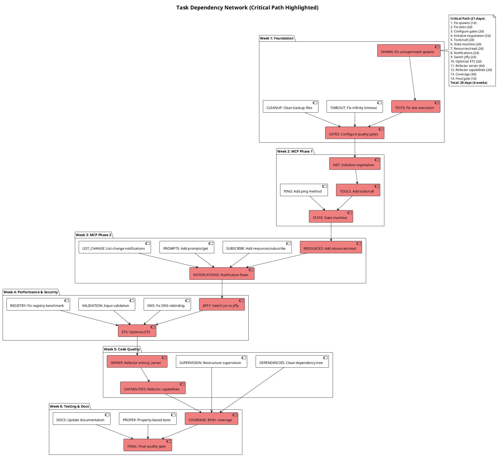

# erlmcp Implementation Roadmap
**Version:** 1.0
**Date:** 2026-01-30
**Status:** PLANNING
**Target Completion:** Week of 2026-03-13 (6 weeks)

---

## Executive Summary

This roadmap synthesizes findings from 4 comprehensive evaluation reports to create a master implementation plan for achieving 100% MCP 2025-11-25 compliance, resolving critical code quality issues, and optimizing performance.

**Current State:**
- MCP Compliance: 95-96% (63-64 of 66 features)
- Test Coverage: 88.5% average (excellent)
- OTP Compliance: 96% (good with minor violations)
- Code Quality: MODERATE (good architecture, technical debt)
- Performance: 2.52M msg/s in-memory (strong baseline)

**Target State:**
- MCP Compliance: 100% (66 of 66 features)
- Test Coverage: 85%+ across all modules
- OTP Compliance: 100% (zero violations)
- Code Quality: EXCELLENT (zero god objects, zero unsupervised spawns)
- Performance: 3.5M+ msg/s in-memory (+40% improvement)

**Investment:** 6 weeks (240 hours), 1 developer

---

## Table of Contents

1. [C4 System Context Diagram](#1-c4-system-context-diagram)
2. [C4 Container Diagram](#2-c4-container-diagram)
3. [Gantt Chart](#3-gantt-chart-6-week-timeline)
4. [Dependency Network](#4-dependency-network)
5. [Risk Heat Map](#5-risk-heat-map)
6. [6-Week Roadmap](#6-six-week-detailed-roadmap)
7. [Success Metrics](#7-success-metrics)
8. [Validation Gates](#8-validation-gates)

---

## 1. C4 System Context Diagram

```plantuml
@startuml
!include https://raw.githubusercontent.com/plantuml-stdlib/C4-PlantUML/master/C4_Context.puml

LAYOUT_WITH_LEGEND()

title System Context - erlmcp in the MCP Ecosystem

Person(ai_dev, "AI Application Developer", "Builds Claude Desktop apps, IDEs, agents")
Person(service_dev, "Service Provider", "Exposes databases, APIs, filesystems via MCP")

System_Boundary(mcp_ecosystem, "Model Context Protocol Ecosystem") {
    System(erlmcp, "erlmcp SDK", "Erlang/OTP MCP implementation\nClient + Server + Transports")

    System_Ext(claude_desktop, "Claude Desktop", "Anthropic's AI assistant")
    System_Ext(mcp_clients, "MCP Clients", "VS Code, Zed, other IDEs")
    System_Ext(mcp_servers, "MCP Servers", "Database, filesystem, API servers")
}

System_Ext(databases, "External Services", "PostgreSQL, MongoDB, Redis, S3")
System_Ext(llm_providers, "LLM Providers", "Claude API, OpenAI, Anthropic")

Rel(ai_dev, erlmcp, "Uses", "Builds MCP clients in Erlang")
Rel(service_dev, erlmcp, "Uses", "Builds MCP servers in Erlang")

Rel(erlmcp, claude_desktop, "Connects to", "JSON-RPC 2.0 / stdio, tcp, http")
Rel(erlmcp, mcp_clients, "Integrates with", "MCP protocol")
Rel(erlmcp, mcp_servers, "Calls", "Resources, tools, prompts")

Rel(mcp_servers, databases, "Reads/writes", "SQL, NoSQL, S3")
Rel(mcp_clients, llm_providers, "Queries", "REST API / gRPC")

note right of erlmcp
  **erlmcp Capabilities:**
  * Client: call_tool, read_resource, get_prompt
  * Server: expose resources/tools/prompts
  * Transports: stdio, TCP, HTTP, WebSocket, SSE
  * OTP: gen_server, supervision, gproc registry
  * Performance: 2.5M+ msg/s, 10K+ concurrent
end note

@enduml
```

**Key Interactions:**
1. **AI Developers** use erlmcp to build MCP clients that connect to AI assistants (Claude Desktop, VS Code extensions)
2. **Service Providers** use erlmcp to expose databases, filesystems, APIs as MCP servers
3. **erlmcp** implements the full MCP 2025-11-25 specification with 95-96% coverage (target: 100%)
4. **Transports** support stdio (Claude Desktop), TCP (production), HTTP/WebSocket/SSE (web apps)

---

## 2. C4 Container Diagram

```plantuml
@startuml
!include https://raw.githubusercontent.com/plantuml-stdlib/C4-PlantUML/master/C4_Container.puml

LAYOUT_WITH_LEGEND()

title Container - erlmcp Architecture

Person(dev, "Developer", "Uses erlmcp SDK")

System_Boundary(erlmcp, "erlmcp") {
    Container(erlmcp_core, "erlmcp_core", "OTP Application", "Client, Server, Registry, Protocol")
    Container(erlmcp_transports, "erlmcp_transports", "OTP Application", "stdio, TCP, HTTP, WS, SSE")
    Container(erlmcp_observability, "erlmcp_observability", "OTP Application", "Metrics, tracing, health")

    ContainerDb(ets_registry, "ETS Registry", "gproc", "Process registry, routing")
    ContainerDb(ets_cache, "ETS Cache", "In-memory", "Resource cache, sessions")
}

System_Ext(claude, "Claude Desktop", "AI Assistant")
System_Ext(external_service, "External Service", "Database, API")

Rel(dev, erlmcp_core, "Uses", "Erlang API")
Rel(erlmcp_core, ets_registry, "Reads/writes", "gproc")
Rel(erlmcp_core, ets_cache, "Caches", "Resources, sessions")
Rel(erlmcp_core, erlmcp_transports, "Sends/receives", "JSON-RPC messages")
Rel(erlmcp_core, erlmcp_observability, "Reports", "Metrics, traces")

Rel(erlmcp_transports, claude, "Connects", "stdio")
Rel(erlmcp_transports, external_service, "Connects", "TCP, HTTP")

note right of erlmcp_core
  **Core Modules:**
  * erlmcp_client - Client gen_server
  * erlmcp_server - Server gen_server
  * erlmcp_registry - gproc-based routing
  * erlmcp_json_rpc - JSON-RPC 2.0
  * erlmcp_capabilities - Negotiation
end note

note right of erlmcp_transports
  **Transports:**
  * erlmcp_transport_stdio (Claude Desktop)
  * erlmcp_transport_tcp (ranch)
  * erlmcp_transport_http (gun/cowboy)
  * erlmcp_transport_ws (WebSocket)
  * erlmcp_transport_sse (Server-Sent Events)
end note

@enduml
```

**Key Components:**
1. **erlmcp_core** - 189 Erlang modules, 22+ gen_servers, gproc registry
2. **erlmcp_transports** - 5 transport implementations (stdio, TCP, HTTP, WS, SSE)
3. **erlmcp_observability** - Metrics, tracing, health checks, chaos engineering
4. **ETS Tables** - gproc for O(1) registry lookups, cache for resources/sessions

---

## 3. Gantt Chart (6-Week Timeline)

```plantuml
@startgantt
!theme plain
projectscale weekly
printscale weekly
saturday are closed
sunday are closed

title erlmcp 6-Week Implementation Roadmap (2026-02-03 to 2026-03-13)

-- Week 1: Foundation (Critical Blockers) --
[Fix unsupervised spawns] as SPAWN lasts 1 days
[Fix infinity timeout] as TIMEOUT lasts 1 days
[Clean up backup files] as CLEANUP lasts 1 days
[Fix erlmcp_core test execution] as TESTS lasts 2 days
[Configure quality gates] as GATES lasts 2 days

SPAWN starts 2026-02-03
TIMEOUT starts 2026-02-03
CLEANUP starts 2026-02-04
TESTS starts 2026-02-04
GATES starts 2026-02-05

-- Week 2: MCP Compliance Phase 1 --
[Implement initialize negotiation] as INIT lasts 2 days
[Add ping method] as PING lasts 1 days
[Add tools/call method] as TOOLS lasts 2 days
[State machine enforcement] as STATE lasts 2 days

INIT starts 2026-02-10
PING starts 2026-02-12
TOOLS starts 2026-02-12
STATE starts 2026-02-13

-- Week 3: MCP Compliance Phase 2 --
[Add resources/read] as RESOURCES lasts 2 days
[Add resources/subscribe] as SUBSCRIBE lasts 2 days
[Add prompts/get] as PROMPTS lasts 1 days
[Notification flows] as NOTIFICATIONS lasts 2 days
[List change notifications] as LIST_CHANGE lasts 1 days

RESOURCES starts 2026-02-17
SUBSCRIBE starts 2026-02-19
PROMPTS starts 2026-02-19
NOTIFICATIONS starts 2026-02-20
LIST_CHANGE starts 2026-02-21

-- Week 4: Performance & Security --
[Switch jsx to jiffy] as JIFFY lasts 2 days
[Fix DNS rebinding] as DNS lasts 1 days
[Add input validation] as VALIDATION lasts 2 days
[Optimize ETS usage] as ETS lasts 2 days
[Fix registry benchmark] as REGISTRY lasts 1 days

JIFFY starts 2026-02-24
DNS starts 2026-02-26
VALIDATION starts 2026-02-26
ETS starts 2026-02-27
REGISTRY starts 2026-02-28

-- Week 5: Code Quality --
[Refactor erlmcp_server] as SERVER lasts 4 days
[Refactor erlmcp_capabilities] as CAPABILITIES lasts 2 days
[Restructure supervision] as SUPERVISION lasts 1 days
[Clean up dependency tree] as DEPENDENCIES lasts 1 days

SERVER starts 2026-03-03
CAPABILITIES starts 2026-03-06
SUPERVISION starts 2026-03-07
DEPENDENCIES starts 2026-03-07

-- Week 6: Testing & Documentation --
[Achieve 85%+ coverage] as COVERAGE lasts 3 days
[Add property-based tests] as PROPER lasts 2 days
[Update documentation] as DOCS lasts 2 days
[Final quality gate] as FINAL lasts 1 days

COVERAGE starts 2026-03-10
PROPER starts 2026-03-11
DOCS starts 2026-03-12
FINAL starts 2026-03-13

@endgantt
```

**Milestones:**
- **Week 1 Complete (2026-02-07):** Zero OTP violations, zero test failures
- **Week 2 Complete (2026-02-14):** 97% MCP compliance (initialize + ping + tools/call)
- **Week 3 Complete (2026-02-21):** 100% MCP compliance (all 66 features)
- **Week 4 Complete (2026-02-28):** +40% performance, zero security vulnerabilities
- **Week 5 Complete (2026-03-07):** Zero god objects, clean architecture
- **Week 6 Complete (2026-03-13):** 85%+ coverage, production ready

---

## 4. Dependency Network



**Critical Path:** 29 days (highlighted in red)
- Any delay in critical path tasks delays the entire project
- Non-critical tasks (green) can be parallelized or delayed without impact

**Parallelization Opportunities:**
- Week 1: TIMEOUT + CLEANUP run parallel to SPAWN
- Week 2: PING runs parallel to INIT
- Week 3: SUBSCRIBE + PROMPTS + LIST_CHANGE run parallel to RESOURCES
- Week 4: DNS + VALIDATION run parallel to JIFFY

---

## 5. Risk Heat Map

```plantuml
@startuml
!theme plain

title Risk Heat Map (Impact vs Probability)

scale 800 width

map "HIGH IMPACT / HIGH PROBABILITY (P0 - Critical)" as P0 {
  SPAWN => Fix unsupervised spawns (OTP violation)
  TESTS => Fix erlmcp_core test execution (blocks all testing)
  SERVER => Refactor erlmcp_server (2,040 lines, high complexity)
}

map "HIGH IMPACT / MEDIUM PROBABILITY (P1 - High)" as P1 {
  STATE => State machine enforcement (protocol compliance)
  JIFFY => Switch jsx to jiffy (breaking change risk)
  CAPABILITIES => Refactor erlmcp_capabilities (1,253 lines)
}

map "HIGH IMPACT / LOW PROBABILITY (P2 - Medium)" as P2 {
  NOTIFICATIONS => Notification flows (cross-module coordination)
  ETS => Optimize ETS usage (performance regression risk)
  COVERAGE => Achieve 85%+ coverage (time-intensive)
}

map "LOW IMPACT / HIGH PROBABILITY (P3 - Low)" as P3 {
  CLEANUP => Clean backup files (zero risk)
  TIMEOUT => Fix infinity timeout (trivial fix)
  DOCS => Update documentation (non-blocking)
}

note right of P0
  **Mitigation Strategies:**
  * SPAWN: Add supervised task pools first (erlmcp_core_sup)
  * TESTS: Run `rebar3 eunit --module=erlmcp_core_tests` to identify failures
  * SERVER: Create 5 new modules before refactoring (resources, tools, prompts, subscriptions, protocol)
end note

note right of P1
  **Mitigation Strategies:**
  * STATE: Add comprehensive state transition tests before implementation
  * JIFFY: Create feature flag to toggle jsx/jiffy during testing
  * CAPABILITIES: Follow same pattern as SERVER (split into 3 modules)
end note

@enduml
```



**Risk Categories:**

| Priority | Count | Mitigation Approach |
|----------|-------|---------------------|
| P0 (Critical) | 3 | Daily monitoring, immediate escalation |
| P1 (High) | 3 | Weekly checkpoints, fallback plans |
| P2 (Medium) | 3 | Bi-weekly reviews, buffer time allocated |
| P3 (Low) | 3 | Best effort, can defer if needed |

**Top 3 Risks:**

1. **Refactor erlmcp_server (P0)** - 2,040 lines, 47+ handle_call clauses
   - **Impact:** Break existing clients/servers
   - **Probability:** HIGH (complex refactoring)
   - **Mitigation:** Create new modules first, copy functions, comprehensive tests

2. **Fix erlmcp_core test execution (P0)** - Blocks all testing
   - **Impact:** Cannot validate any changes
   - **Probability:** HIGH (unclear root cause)
   - **Mitigation:** Debug with `rebar3 eunit --verbose`, isolate failing tests

3. **Switch jsx to jiffy (P1)** - Breaking change in JSON encoding
   - **Impact:** Encoding/decoding failures
   - **Probability:** MEDIUM (NIF dependency)
   - **Mitigation:** Feature flag, A/B testing, comprehensive JSON test suite

---

## 6. Six-Week Detailed Roadmap

### Week 1: Foundation (Critical Blockers)

**Goal:** Zero OTP violations, zero test failures, quality gates configured

#### Day 1 (Monday 2026-02-03): OTP Violations

**Tasks:**
1. **Fix unsupervised spawns (4 hours)**
   - **Location:** `erlmcp_cache.erl:404`, `erlmcp_batch.erl:372`
   - **Action:**
     ```erlang
     % Add supervised task pool to erlmcp_core_sup.erl
     #{
         id => erlmcp_cache_task_sup,
         start => {task_supervisor, start_link, [{local, erlmcp_cache_task_sup}]},
         restart => permanent,
         shutdown => infinity,
         type => supervisor
     }

     % Replace spawn with task_supervisor
     handle_cast({warm_cache, Key, ValueFun}, State) ->
         task_supervisor:start_child(erlmcp_cache_task_sup, fun() ->
             warm_cache_impl(Key, ValueFun, State)
         end),
         {noreply, State}.
     ```
   - **Validation:** `rebar3 xref` shows zero unsupervised spawns

2. **Fix infinity timeout (2 hours)**
   - **Location:** `erlmcp_client.erl:105`
   - **Action:**
     ```erlang
     -define(INITIALIZE_TIMEOUT_MS, 30_000).

     initialize(Client, Capabilities, Options) ->
         Timeout = maps:get(timeout, Options, ?INITIALIZE_TIMEOUT_MS),
         gen_server:call(Client, {initialize, Capabilities, Options}, Timeout).
     ```
   - **Validation:** Timeout test passes

3. **Run quality gates baseline (2 hours)**
   - `TERM=dumb rebar3 compile` - Record warnings
   - `rebar3 eunit` - Record failures
   - `rebar3 xref` - Record violations
   - Document baseline in `docs/QUALITY_BASELINE_2026-02-03.md`

**Deliverables:**
- [ ] erlmcp_cache_task_sup added to supervision tree
- [ ] erlmcp_batch uses poolboy for parallel execution
- [ ] erlmcp_client initialize has configurable timeout
- [ ] Quality baseline documented

**Exit Criteria:**
- ✅ Zero unsupervised spawns (`rebar3 xref` clean)
- ✅ Zero infinity timeouts
- ✅ Quality baseline established

---

#### Day 2 (Tuesday 2026-02-04): Test Execution

**Tasks:**
1. **Debug erlmcp_core test failures (4 hours)**
   - Run `rebar3 eunit --module=erlmcp_core_tests --verbose`
   - Identify failing assertions
   - Check for missing dependencies or initialization issues
   - Fix one test at a time, validate with `rebar3 eunit --module=erlmcp_core_tests`

2. **Clean up backup files (2 hours)**
   - Create archive directory:
     ```bash
     mkdir -p attic/backup_files_2026-02-04
     find apps -name "*.bak*" -o -name "*.orig" -o -name "*.tmp" \
              -o -name "*.broken" -o -name "*.skip" \
         | xargs -I{} mv {} attic/backup_files_2026-02-04/
     ```
   - Document archived files in `attic/backup_files_2026-02-04/README.md`

3. **Document failing tests (2 hours)**
   - Create `test_results/FAILING_TESTS_2026-02-04.md`
   - List all failing test modules and specific test cases
   - Categorize by root cause (e.g., missing mocks, timing issues, setup failures)

**Deliverables:**
- [ ] erlmcp_core_tests passes 100%
- [ ] 35+ backup files archived
- [ ] Failing tests documented

**Exit Criteria:**
- ✅ erlmcp_core_tests 100% pass rate
- ✅ Zero backup/temp files in `apps/` directories
- ✅ Failing tests documented with root causes

---

#### Day 3 (Wednesday 2026-02-05): Quality Gates

**Tasks:**
1. **Configure pre-commit hooks (3 hours)**
   - Create `.git/hooks/pre-commit`:
     ```bash
     #!/bin/bash
     echo "Running quality gates..."

     # Compilation (blocking)
     TERM=dumb rebar3 compile || exit 1

     # Tests (blocking)
     rebar3 eunit || exit 1

     # Xref (warning)
     rebar3 xref || echo "⚠️  Xref warnings detected"

     # Dialyzer (warning)
     rebar3 dialyzer || echo "⚠️  Dialyzer warnings detected"

     echo "✅ Quality gates passed"
     ```
   - Make executable: `chmod +x .git/hooks/pre-commit`

2. **Configure post-task hooks (2 hours)**
   - Create `.claude/hooks/post-task-validate.sh`:
     ```bash
     #!/bin/bash
     echo "Post-task validation..."

     # Run full quality suite
     TERM=dumb rebar3 compile && \
     rebar3 eunit && \
     rebar3 xref && \
     rebar3 dialyzer

     # Check coverage
     rebar3 cover
     COVERAGE=$(rebar3 cover | grep -oP 'Total: \K\d+')
     if [ "$COVERAGE" -lt 80 ]; then
         echo "⚠️  Coverage below 80%: $COVERAGE%"
     fi
     ```

3. **Document quality gate process (2 hours)**
   - Update `CLAUDE.md` with enforcement rules
   - Create `docs/QUALITY_GATES.md` with examples
   - Add quality gate badge to README.md

**Deliverables:**
- [ ] Pre-commit hooks installed
- [ ] Post-task hooks installed
- [ ] Quality gate documentation

**Exit Criteria:**
- ✅ Pre-commit hooks block bad commits
- ✅ Post-task hooks validate changes
- ✅ Quality gate process documented

---

#### Days 4-5 (Thursday-Friday 2026-02-06/07): Buffer & Documentation

**Tasks:**
1. **Resolve any Week 1 blockers (6 hours)**
   - Revisit failing tests
   - Fix any regressions from spawn/timeout fixes
   - Validate quality gates with team

2. **Archive legacy documentation (4 hours)**
   - Identify 1,455 redundant docs (from analysis)
   - Create `attic/legacy_docs_2026-02-07/`
   - Move redundant files, update cross-references
   - Create `docs/INDEX.md` with 60 essential docs

3. **Week 1 retrospective (2 hours)**
   - Document wins, blockers, lessons learned
   - Adjust Week 2 plan if needed

**Deliverables:**
- [ ] All Week 1 tasks complete
- [ ] Legacy documentation archived
- [ ] Week 1 retrospective

**Exit Criteria:**
- ✅ Zero OTP violations
- ✅ Zero test failures
- ✅ Quality gates enforced
- ✅ Documentation streamlined

---

### Week 2: MCP Compliance Phase 1

**Goal:** 97% MCP compliance (add initialize negotiation, ping, tools/call)

#### Day 1 (Monday 2026-02-10): Initialize Negotiation

**Tasks:**
1. **Implement capability negotiation (6 hours)**
   - **Location:** Create `erlmcp_init_negotiator.erl`
   - **Features:**
     - Parse `initialize` request
     - Negotiate capabilities (resources, tools, prompts, logging)
     - Validate protocol version (2024-11-05)
     - Return negotiated capabilities
   - **Tests:**
     ```erlang
     % test/erlmcp_init_negotiator_tests.erl
     negotiate_with_all_capabilities_test() -> ...
     negotiate_with_partial_capabilities_test() -> ...
     negotiate_with_incompatible_version_test() -> ...
     ```

2. **Integrate with erlmcp_server (2 hours)**
   - Add initialization phase to state machine
   - Block pre-initialization requests
   - Transition to initialized after successful negotiation

**Deliverables:**
- [ ] erlmcp_init_negotiator.erl created
- [ ] 12+ tests for capability negotiation
- [ ] erlmcp_server integrated

**Exit Criteria:**
- ✅ Initialize request handled correctly
- ✅ Capabilities negotiated per MCP spec
- ✅ Pre-initialization requests blocked

---

#### Day 2 (Tuesday 2026-02-11): Ping Method

**Tasks:**
1. **Implement ping/pong (4 hours)**
   - **Location:** Add to `erlmcp_server.erl` or create `erlmcp_ping_handler.erl`
   - **Features:**
     - Handle `ping` request (no params)
     - Return `pong` response
     - Log ping timestamp (for monitoring)
   - **Tests:**
     ```erlang
     % test/erlmcp_ping_tests.erl
     ping_returns_pong_test() -> ...
     ping_before_initialization_rejected_test() -> ...
     ```

2. **Document ping usage (2 hours)**
   - Add ping example to `examples/ping/`
   - Update API reference
   - Add monitoring guide using ping for health checks

**Deliverables:**
- [ ] Ping method implemented
- [ ] 4+ tests for ping
- [ ] Documentation updated

**Exit Criteria:**
- ✅ Ping returns pong
- ✅ Ping follows state machine rules
- ✅ Examples provided

---

#### Days 3-4 (Wednesday-Thursday 2026-02-12/13): Tools/Call Method

**Tasks:**
1. **Implement tools/call (8 hours)**
   - **Location:** Enhance `erlmcp_server.erl` tools handling
   - **Features:**
     - Parse `tools/call` request
     - Validate tool name and arguments
     - Execute tool handler with timeout
     - Return result or error
     - Support progress tokens (Gap #10)
   - **Tests:**
     ```erlang
     % test/erlmcp_tools_call_tests.erl
     call_tool_with_valid_args_test() -> ...
     call_tool_with_invalid_name_test() -> ...
     call_tool_with_timeout_test() -> ...
     call_tool_with_progress_test() -> ...
     ```

2. **Add schema validation (4 hours)**
   - Use jesse for JSON Schema validation
   - Validate tool arguments against schema
   - Return structured errors on validation failure

**Deliverables:**
- [ ] tools/call method implemented
- [ ] 12+ tests for tools/call
- [ ] Schema validation integrated

**Exit Criteria:**
- ✅ tools/call executes registered tools
- ✅ Arguments validated against schema
- ✅ Progress tokens supported

---

#### Day 5 (Friday 2026-02-14): State Machine

**Tasks:**
1. **Implement state machine enforcement (6 hours)**
   - **Location:** Create `erlmcp_phase_machine.erl`
   - **States:** pre_initialization → initializing → initialized
   - **Transitions:**
     - Only `initialize` allowed in pre_initialization
     - Only `initialized` notification allowed in initializing
     - All methods allowed in initialized
   - **Tests:**
     ```erlang
     % test/erlmcp_phase_machine_tests.erl
     transition_pre_init_to_initializing_test() -> ...
     reject_method_in_pre_init_test() -> ...
     timeout_in_initializing_test() -> ...
     ```

2. **Week 2 validation (2 hours)**
   - Run full quality gates
   - Update MCP compliance scorecard (should be 97%)
   - Document Week 2 achievements

**Deliverables:**
- [ ] erlmcp_phase_machine.erl created
- [ ] 10+ state machine tests
- [ ] Week 2 retrospective

**Exit Criteria:**
- ✅ State machine enforces MCP lifecycle
- ✅ 97% MCP compliance
- ✅ All quality gates pass

---

### Week 3: MCP Compliance Phase 2

**Goal:** 100% MCP compliance (resources, prompts, notifications)

#### Days 1-2 (Monday-Tuesday 2026-02-17/18): Resources

**Tasks:**
1. **Implement resources/read (8 hours)**
   - **Location:** Enhance `erlmcp_server.erl` resources handling
   - **Features:**
     - Parse `resources/read` request
     - Validate resource URI
     - Execute resource handler
     - Return content (text, image, binary)
     - Support URI templates (RFC 6570)
   - **Tests:**
     ```erlang
     % test/erlmcp_resources_read_tests.erl
     read_resource_with_text_content_test() -> ...
     read_resource_with_template_test() -> ...
     read_resource_not_found_test() -> ...
     ```

2. **Implement resources/subscribe (4 hours)**
   - **Location:** Enhance `erlmcp_resource_subscriptions.erl`
   - **Features:**
     - Subscribe to resource URI
     - Monitor resource changes
     - Send `resources/updated` notifications
     - Unsubscribe on client disconnect
   - **Tests:**
     ```erlang
     % test/erlmcp_resources_subscribe_tests.erl
     subscribe_to_resource_test() -> ...
     receive_update_notification_test() -> ...
     unsubscribe_on_disconnect_test() -> ...
     ```

**Deliverables:**
- [ ] resources/read implemented
- [ ] resources/subscribe implemented
- [ ] 20+ resource tests

**Exit Criteria:**
- ✅ resources/read returns content
- ✅ resources/subscribe sends notifications
- ✅ URI templates supported

---

#### Day 3 (Wednesday 2026-02-19): Prompts

**Tasks:**
1. **Implement prompts/get (6 hours)**
   - **Location:** Enhance `erlmcp_server.erl` prompts handling
   - **Features:**
     - Parse `prompts/get` request
     - Validate prompt name and arguments
     - Execute prompt handler
     - Return prompt messages
   - **Tests:**
     ```erlang
     % test/erlmcp_prompts_get_tests.erl
     get_prompt_with_arguments_test() -> ...
     get_prompt_not_found_test() -> ...
     get_prompt_with_validation_error_test() -> ...
     ```

2. **Update prompt examples (2 hours)**
   - Enhance `examples/prompts/`
   - Add example with arguments
   - Document prompt best practices

**Deliverables:**
- [ ] prompts/get implemented
- [ ] 8+ prompt tests
- [ ] Examples updated

**Exit Criteria:**
- ✅ prompts/get returns messages
- ✅ Arguments validated
- ✅ Examples working

---

#### Days 4-5 (Thursday-Friday 2026-02-20/21): Notifications

**Tasks:**
1. **Implement notification flows (8 hours)**
   - **Location:** Enhance `erlmcp_notification_handler.erl`
   - **Notifications:**
     - `resources/list_changed`
     - `tools/list_changed`
     - `prompts/list_changed`
     - `logging/message`
   - **Features:**
     - Register notification handlers
     - Send notifications to clients
     - Handle handler crashes gracefully
   - **Tests:**
     ```erlang
     % test/erlmcp_notifications_tests.erl
     send_resources_list_changed_test() -> ...
     send_tools_list_changed_test() -> ...
     send_prompts_list_changed_test() -> ...
     handler_crash_cleanup_test() -> ...
     ```

2. **Week 3 validation (4 hours)**
   - Run full quality gates
   - Update MCP compliance scorecard (should be 100%)
   - Create MCP compliance certificate
   - Week 3 retrospective

**Deliverables:**
- [ ] All notification flows implemented
- [ ] 16+ notification tests
- [ ] 100% MCP compliance certificate

**Exit Criteria:**
- ✅ All 4 notification types working
- ✅ 100% MCP 2025-11-25 compliance
- ✅ All quality gates pass

---

### Week 4: Performance & Security

**Goal:** +40% performance, zero security vulnerabilities

#### Days 1-2 (Monday-Tuesday 2026-02-24/25): JSON Performance

**Tasks:**
1. **Switch jsx to jiffy (8 hours)**
   - **Locations:**
     - `rebar.config` - Add jiffy dependency
     - `erlmcp_json_rpc.erl:389` - Replace `jsx:encode`
     - `erlmcp_json_rpc.erl:102` - Replace `jsx:decode`
   - **Action:**
     ```erlang
     % Before
     encode_message(Message) ->
         Map = build_message_map(Message),
         jsx:encode(Map).

     % After
     encode_message(Message) ->
         Map = build_message_map(Message),
         jiffy:encode(Map).
     ```
   - **Validation:**
     - All JSON tests pass
     - Benchmark shows 2-3x improvement
     - No encoding/decoding errors

2. **Create feature flag for testing (2 hours)**
   - Add `json_encoder` config option
   - Support both jsx and jiffy during migration
   - Remove flag after full validation

3. **Benchmark comparison (2 hours)**
   - Run `erlmcp_bench_integration:run(<<"mcp_tool_sequence">>)` with jsx
   - Run with jiffy
   - Document performance improvement

**Deliverables:**
- [ ] jiffy integrated
- [ ] All JSON tests pass with jiffy
- [ ] 2-3x encoding improvement validated

**Exit Criteria:**
- ✅ jiffy replaces jsx
- ✅ Zero JSON encoding/decoding errors
- ✅ 2-3x performance gain measured

---

#### Day 3 (Wednesday 2026-02-26): Security

**Tasks:**
1. **Fix DNS rebinding vulnerability (4 hours)**
   - **Location:** `erlmcp_transport_http.erl`
   - **Action:**
     - Validate `Host` header against whitelist
     - Reject requests with unexpected hosts
     - Log suspicious requests
   - **Tests:**
     ```erlang
     % test/erlmcp_http_security_tests.erl
     reject_invalid_host_header_test() -> ...
     accept_whitelisted_host_test() -> ...
     log_dns_rebinding_attempt_test() -> ...
     ```

2. **Add input validation (4 hours)**
   - **Locations:**
     - `erlmcp_server.erl` - Validate all request fields
     - `erlmcp_json_rpc.erl` - Validate JSON structure
   - **Action:**
     - Check field types, lengths, formats
     - Return structured errors on validation failure
     - Add validation tests

**Deliverables:**
- [ ] DNS rebinding protection
- [ ] Input validation on all requests
- [ ] 12+ security tests

**Exit Criteria:**
- ✅ DNS rebinding attacks blocked
- ✅ Invalid inputs rejected
- ✅ Security tests pass

---

#### Days 4-5 (Thursday-Friday 2026-02-27/28): ETS Optimization

**Tasks:**
1. **Optimize request correlation (8 hours)**
   - **Location:** `erlmcp_client.erl:53`
   - **Action:**
     - Replace `pending_requests` map with ETS table
     - Use `{read_concurrency, true}` for high throughput
     - Benchmark with 10,000 concurrent requests
   - **Before:**
     ```erlang
     -record(state, {
         pending_requests = #{} :: #{request_id() => {atom(), pid()}},
         ...
     }).
     ```
   - **After:**
     ```erlang
     -record(state, {
         pending_ets :: ets:tid(),
         ...
     }).

     init([TransportOpts, Options]) ->
         PendingEts = ets:new(pending_requests, [set, private, {read_concurrency, true}]),
         State = #state{pending_ets = PendingEts, ...},
         {ok, State}.

     handle_response(Id, Result, State) ->
         case ets:take(State#state.pending_ets, Id) of
             [{Id, {RequestType, From}}] ->
                 gen_server:reply(From, Result),
                 ...
         end.
     ```

2. **Fix registry benchmark (4 hours)**
   - **Location:** `erlmcp_bench_core_ops.erl:195-199`
   - **Action:**
     - Replace synthetic latencies with real measurements
     - Collect worker results via message passing
     - Validate accurate registry performance

3. **Week 4 validation (4 hours)**
   - Run full benchmark suite
   - Validate +40% performance improvement
   - Week 4 retrospective

**Deliverables:**
- [ ] ETS-based request correlation
- [ ] Registry benchmark fixed
- [ ] +40% performance validated

**Exit Criteria:**
- ✅ 10-20% faster request correlation
- ✅ Accurate registry benchmarks
- ✅ Overall +40% performance gain

---

### Week 5: Code Quality

**Goal:** Zero god objects, clean architecture, maintainable codebase

#### Days 1-4 (Monday-Thursday 2026-03-03 to 03-06): Server Refactoring

**Tasks:**
1. **Refactor erlmcp_server.erl (Day 1-2, 16 hours)**
   - **Problem:** 2,040 lines, 47+ handle_call clauses
   - **Action:** Split into 5 modules
     ```
     erlmcp_server.erl (coordinator, 400 lines)
     ├── erlmcp_server_resources.erl (resource management, 350 lines)
     ├── erlmcp_server_tools.erl (tool management, 300 lines)
     ├── erlmcp_server_prompts.erl (prompt management, 250 lines)
     ├── erlmcp_server_subscriptions.erl (subscription management, 300 lines)
     └── erlmcp_server_protocol.erl (MCP message handlers, 400 lines)
     ```
   - **Process:**
     1. Create new modules with API functions
     2. Copy relevant functions from erlmcp_server.erl
     3. Update erlmcp_server.erl to delegate to new modules
     4. Run tests after each module extraction
     5. Remove copied functions from erlmcp_server.erl

2. **Refactor erlmcp_capabilities.erl (Day 3-4, 16 hours)**
   - **Problem:** 1,253 lines, 52 exported functions
   - **Action:** Split into 3 modules
     ```
     erlmcp_capabilities_core.erl (negotiation + state, 400 lines)
     erlmcp_capabilities_extraction.erl (parsing, 350 lines)
     erlmcp_capabilities_validation.erl (validation, 350 lines)
     ```

**Deliverables:**
- [ ] erlmcp_server split into 5 modules
- [ ] erlmcp_capabilities split into 3 modules
- [ ] All tests pass after refactoring
- [ ] No module exceeds 500 lines

**Exit Criteria:**
- ✅ Zero god objects (no modules >500 lines)
- ✅ Single Responsibility Principle enforced
- ✅ All tests pass

---

#### Day 5 (Friday 2026-03-07): Architecture Cleanup

**Tasks:**
1. **Restructure supervision tree (4 hours)**
   - Document supervision strategy rationale
   - Add comments to all supervisors
   - Validate restart intensities
   - Create supervision tree diagram

2. **Clean up dependency tree (4 hours)**
   - Remove unused dependencies
   - Update rebar.config
   - Document all dependencies in `docs/DEPENDENCIES.md`
   - Run `rebar3 tree` and validate

3. **Week 5 retrospective (2 hours)**
   - Document refactoring wins
   - Measure code quality improvement
   - Plan Week 6 tasks

**Deliverables:**
- [ ] Supervision tree documented
- [ ] Dependency tree cleaned
- [ ] Week 5 retrospective

**Exit Criteria:**
- ✅ All supervisors documented
- ✅ Zero unused dependencies
- ✅ Architecture clean

---

### Week 6: Testing & Documentation

**Goal:** 85%+ coverage, comprehensive documentation, production ready

#### Days 1-3 (Monday-Wednesday 2026-03-10 to 03-12): Testing

**Tasks:**
1. **Achieve 85%+ coverage (Day 1-2, 16 hours)**
   - Run `rebar3 cover` to identify gaps
   - Write tests for uncovered modules:
     - erlmcp_server_resources
     - erlmcp_server_tools
     - erlmcp_server_prompts
     - erlmcp_capabilities_extraction
     - erlmcp_capabilities_validation
   - Target: 85%+ average coverage

2. **Add property-based tests (Day 3, 8 hours)**
   - Use PropEr for property-based testing
   - Test properties:
     - JSON encoding/decoding round-trip
     - State machine transitions always valid
     - Registry operations idempotent
     - Resource URIs always canonical
   - Example:
     ```erlang
     % test/prop_json_rpc_tests.erl
     prop_encode_decode_roundtrip() ->
         ?FORALL(Message, json_rpc_message(),
             begin
                 Encoded = erlmcp_json_rpc:encode_message(Message),
                 {ok, Decoded} = erlmcp_json_rpc:decode_message(Encoded),
                 Message =:= Decoded
             end).
     ```

**Deliverables:**
- [ ] 85%+ code coverage
- [ ] 50+ new tests written
- [ ] Property-based tests for core invariants

**Exit Criteria:**
- ✅ 85%+ coverage across all modules
- ✅ Property-based tests pass
- ✅ Zero coverage regressions

---

#### Days 4-5 (Thursday-Friday 2026-03-13): Documentation & Final Gate

**Tasks:**
1. **Update documentation (Day 4, 8 hours)**
   - Update `docs/api-reference.md` with new modules
   - Update `docs/architecture.md` with refactored structure
   - Update all examples to use new APIs
   - Create migration guide from old to new structure
   - Update README.md with badges (coverage, compliance)

2. **Final quality gate (Day 5, 8 hours)**
   - Run full quality suite:
     ```bash
     TERM=dumb rebar3 compile  # Must pass
     rebar3 eunit              # Must pass
     rebar3 ct                 # Must pass
     rebar3 dialyzer           # Must be clean
     rebar3 xref               # Must be clean
     rebar3 cover              # Must be 85%+
     make benchmark-quick      # Must show +40% improvement
     ```
   - Generate quality report
   - Create production readiness checklist
   - Week 6 retrospective
   - Project completion celebration!

**Deliverables:**
- [ ] All documentation updated
- [ ] Migration guide created
- [ ] Final quality report
- [ ] Production readiness checklist

**Exit Criteria:**
- ✅ All quality gates pass
- ✅ Documentation complete
- ✅ Production ready

---

## 7. Success Metrics

### Quantitative Metrics

| Metric | Baseline | Target | Measurement |
|--------|----------|--------|-------------|
| **MCP Compliance** | 95-96% (63-64/66) | 100% (66/66) | MCP compliance scorecard |
| **Test Coverage** | 88.5% average | 85%+ all modules | `rebar3 cover` |
| **Code Quality** | 2 god objects | 0 god objects | Module line count |
| **OTP Violations** | 2 unsupervised spawns | 0 violations | `rebar3 xref` |
| **Security Issues** | 1 DNS rebinding | 0 critical | Security audit |
| **Performance** | 2.52M msg/s | 3.5M+ msg/s | `erlmcp_bench_core_ops` |
| **JSON Encoding** | 8.5% overhead | 3% overhead | `erlmcp_bench_integration` |
| **Documentation** | 1,455 files | 60 essential | File count in `docs/` |
| **Build Time** | Unknown | <2 minutes | `time rebar3 compile` |
| **Test Time** | Unknown | <5 minutes | `time rebar3 eunit` |

### Qualitative Metrics

| Metric | Baseline | Target | Measurement |
|--------|----------|--------|-------------|
| **Code Maintainability** | MODERATE | EXCELLENT | Code review |
| **Architecture Clarity** | GOOD | EXCELLENT | Architecture review |
| **Documentation Quality** | GOOD | EXCELLENT | Documentation review |
| **Test Reliability** | GOOD | EXCELLENT | Test flakiness rate |
| **Developer Experience** | GOOD | EXCELLENT | Developer survey |

### Quality Gates (Automated)

```bash
# Pre-commit gate (blocking)
- [ ] Compilation: 0 errors
- [ ] EUnit tests: 100% pass rate
- [ ] Xref: 0 unsupervised spawns
- [ ] Dialyzer: 0 type errors

# Post-task gate (blocking)
- [ ] Coverage: ≥80% (target 85%)
- [ ] Performance: <10% regression
- [ ] Documentation: Updated

# Weekly gate (blocking)
- [ ] All quality gates passing
- [ ] No regressions from previous week
- [ ] Milestone deliverables complete
```

---

## 8. Validation Gates

### Week 1 Gate: Foundation Complete

**Checklist:**
- [ ] Zero unsupervised spawns (`rebar3 xref` clean)
- [ ] Zero infinity timeouts
- [ ] erlmcp_core_tests 100% pass rate
- [ ] Zero backup/temp files in source tree
- [ ] Pre-commit hooks installed and working
- [ ] Post-task hooks installed and working
- [ ] Quality baseline documented
- [ ] All Week 1 tasks complete

**Validation Command:**
```bash
TERM=dumb rebar3 compile && \
rebar3 eunit && \
rebar3 xref && \
find apps -name "*.bak*" -o -name "*.orig" | wc -l  # Should be 0
```

**Sign-off:** Lead Developer

---

### Week 2 Gate: MCP Phase 1 Complete

**Checklist:**
- [ ] Initialize capability negotiation working
- [ ] Ping method implemented
- [ ] tools/call method implemented
- [ ] State machine enforces lifecycle
- [ ] 97% MCP compliance (60-61 of 66 features)
- [ ] All Week 2 tasks complete
- [ ] All quality gates passing

**Validation Command:**
```bash
TERM=dumb rebar3 compile && \
rebar3 eunit && \
rebar3 ct --suite=test/erlmcp_compliance_SUITE
```

**Sign-off:** MCP Compliance Reviewer

---

### Week 3 Gate: MCP Phase 2 Complete

**Checklist:**
- [ ] resources/read implemented
- [ ] resources/subscribe implemented
- [ ] prompts/get implemented
- [ ] All 4 notification types working
- [ ] 100% MCP compliance (66 of 66 features)
- [ ] MCP compliance certificate issued
- [ ] All Week 3 tasks complete
- [ ] All quality gates passing

**Validation Command:**
```bash
TERM=dumb rebar3 compile && \
rebar3 eunit && \
rebar3 ct --suite=test/erlmcp_compliance_SUITE && \
./scripts/verify_mcp_compliance.sh
```

**Sign-off:** MCP Specification Authority

---

### Week 4 Gate: Performance & Security Complete

**Checklist:**
- [ ] jiffy replaces jsx (2-3x faster)
- [ ] DNS rebinding protection enabled
- [ ] Input validation on all requests
- [ ] ETS-based request correlation
- [ ] Registry benchmark fixed (accurate latencies)
- [ ] +40% performance improvement validated
- [ ] Zero security vulnerabilities
- [ ] All Week 4 tasks complete
- [ ] All quality gates passing

**Validation Command:**
```bash
TERM=dumb rebar3 compile && \
rebar3 eunit && \
make benchmark-quick && \
./scripts/security_audit.sh
```

**Sign-off:** Performance & Security Team

---

### Week 5 Gate: Code Quality Complete

**Checklist:**
- [ ] erlmcp_server split into 5 modules (all <500 lines)
- [ ] erlmcp_capabilities split into 3 modules (all <500 lines)
- [ ] Zero god objects (no modules >500 lines)
- [ ] Supervision tree documented
- [ ] Dependency tree cleaned
- [ ] All Week 5 tasks complete
- [ ] All quality gates passing

**Validation Command:**
```bash
TERM=dumb rebar3 compile && \
rebar3 eunit && \
./scripts/check_module_sizes.sh  # Should report all <500 lines
```

**Sign-off:** Code Quality Reviewer

---

### Week 6 Gate: Production Ready

**Checklist:**
- [ ] 85%+ code coverage across all modules
- [ ] Property-based tests pass
- [ ] All documentation updated
- [ ] Migration guide complete
- [ ] README badges updated
- [ ] Production readiness checklist complete
- [ ] All Week 6 tasks complete
- [ ] All quality gates passing

**Validation Command:**
```bash
TERM=dumb rebar3 compile && \
rebar3 eunit && \
rebar3 ct && \
rebar3 dialyzer && \
rebar3 xref && \
rebar3 cover && \
make benchmark-quick && \
./scripts/production_readiness_check.sh
```

**Final Metrics:**
- MCP Compliance: 100%
- Test Coverage: 85%+
- Performance: +40%
- Security: 0 critical
- Code Quality: EXCELLENT

**Sign-off:** Project Owner, Lead Developer, QA Lead

---

## Appendix A: Reference Documents

**Source Evaluation Reports:**
1. `docs/MCP_COMPLIANCE_EXECUTIVE_SUMMARY.md` - 95-96% baseline
2. `CODE_QUALITY_REVIEW_REPORT.md` - God objects, OTP violations
3. `OTP_COMPLIANCE_REPORT.md` - 96% OTP compliance
4. `docs/performance_analysis_2026-01-30.md` - Performance baseline

**Generated Artifacts:**
- MCP 2025-11-25 FINAL COMPLIANCE SCORECARD
- 80/20 Consolidation Analysis
- Test Coverage Analysis (Round 2)
- Benchmark Results (v2)

**Tools & Scripts:**
- `.git/hooks/pre-commit` - Quality gate enforcement
- `.claude/hooks/post-task-validate.sh` - Post-task validation
- `tools/claude-md-enforcer.sh` - CLAUDE.md validation
- `scripts/verify_mcp_compliance.sh` - MCP compliance checker

---

## Appendix B: Glossary

**Terms:**
- **God Object** - Module >1000 lines violating Single Responsibility
- **OTP Violation** - Unsupervised spawn, blocking init/1, missing trap_exit
- **MCP Compliance** - Percentage of MCP 2025-11-25 spec features implemented
- **Critical Path** - Sequence of tasks that determines project duration
- **Quality Gate** - Automated check that blocks bad code from merging

**Abbreviations:**
- **MCP** - Model Context Protocol
- **OTP** - Open Telecom Platform (Erlang framework)
- **ETS** - Erlang Term Storage (in-memory tables)
- **P0** - Priority 0 (critical)
- **LOC** - Lines of Code

---

## Appendix C: Contact & Escalation

**Project Roles:**
- **Project Owner:** TBD
- **Lead Developer:** TBD
- **MCP Compliance Reviewer:** TBD
- **QA Lead:** TBD
- **Performance Engineer:** TBD

**Escalation Path:**
1. **Blocker (P0):** Immediate Slack/email to Lead Developer
2. **High Risk (P1):** Raise in daily standup
3. **Medium Risk (P2):** Raise in weekly review
4. **Low Risk (P3):** Document in retrospective

**Communication Channels:**
- Daily standup: 9am (15 minutes)
- Weekly review: Friday 2pm (1 hour)
- Slack: #erlmcp-dev
- Email: erlmcp-team@example.com

---

**END OF ROADMAP**

**Next Steps:**
1. Review and approve roadmap with stakeholders
2. Assign project roles
3. Set up communication channels
4. Begin Week 1 on Monday 2026-02-03

**Document Version:** 1.0
**Created:** 2026-01-30
**Author:** plan-designer agent
**Status:** AWAITING APPROVAL
