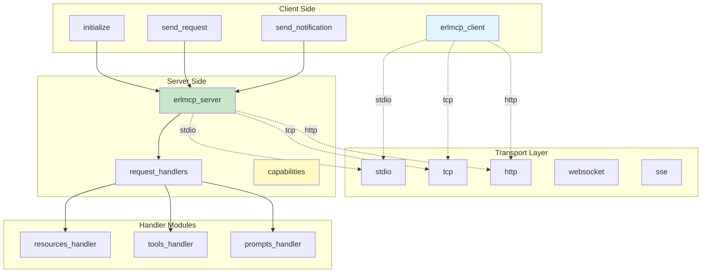
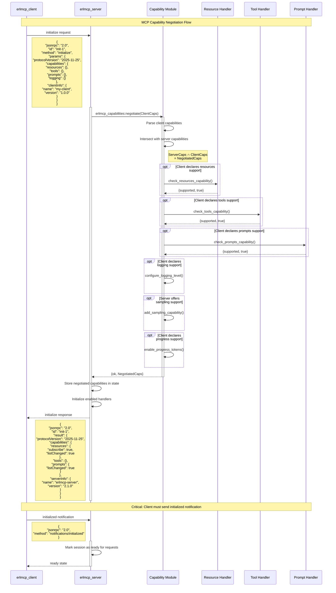
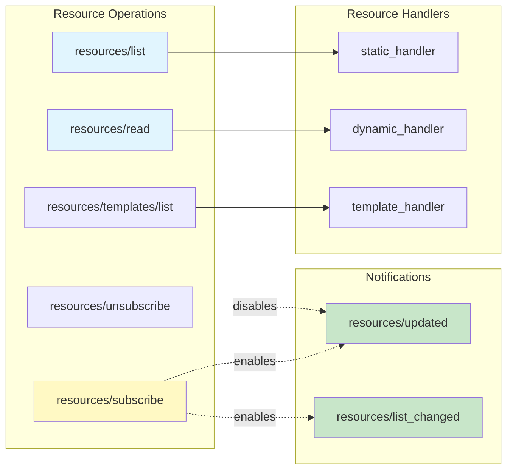
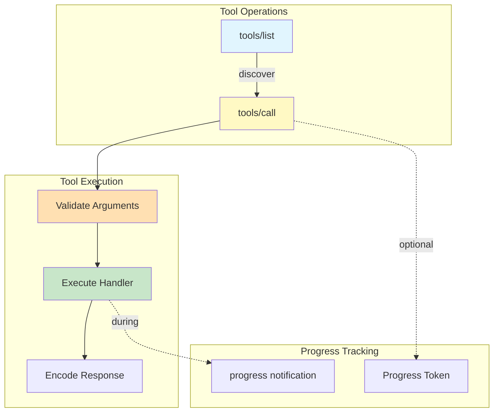
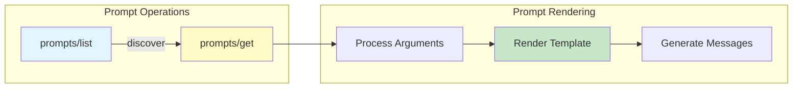
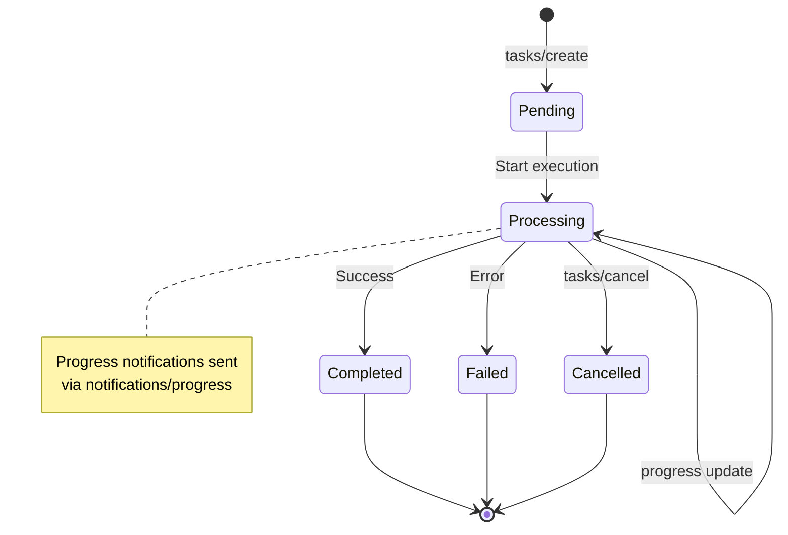
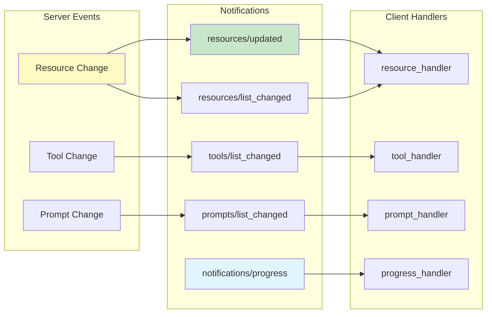
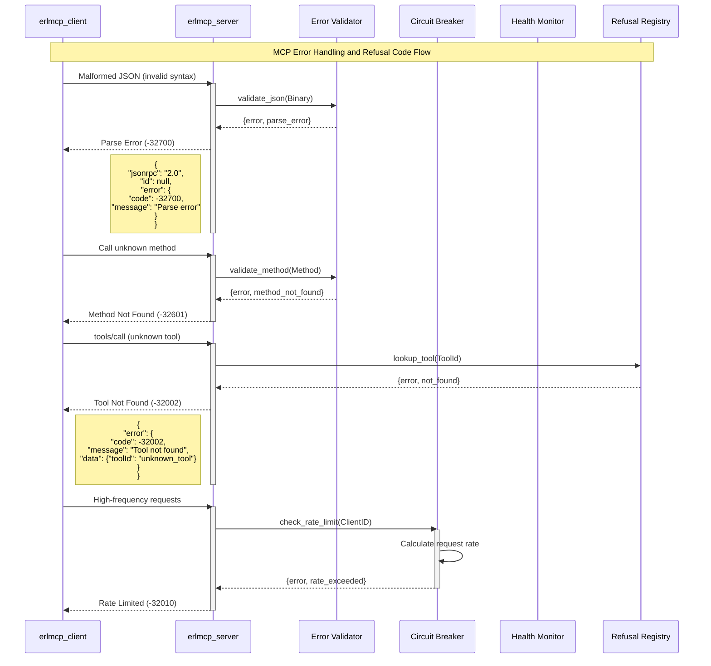
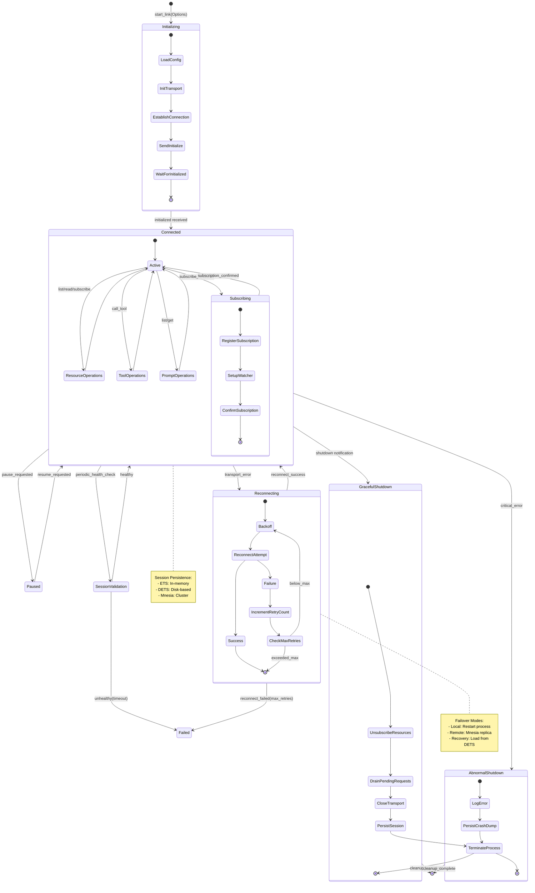

# MCP Endpoints and Capabilities Guide

**MCP Protocol Version**: 2025-11-25
**erlmcp Implementation**: v2.1.0
**Document Date**: 2026-01-31

## Table of Contents

1. [Protocol Overview](#protocol-overview)
2. [Capability Negotiation Flow](#capability-negotiation-flow)
3. [Core Methods and Endpoints](#core-methods-and-endpoints)
4. [Resources API](#resources-api)
5. [Tools API](#tools-api)
6. [Prompts API](#prompts-api)
7. [Sampling API](#sampling-api)
8. [Tasks API](#tasks-api)
9. [Completion API](#completion-api)
10. [Notification Methods](#notification-methods)
11. [Error Handling Flow](#error-handling-flow)
12. [Error Codes Reference](#error-codes-reference)

---

## Protocol Overview

The Model Context Protocol (MCP) uses **JSON-RPC 2.0** for communication over various transports (stdio, TCP, HTTP, WebSocket, SSE). All messages follow the JSON-RPC 2.0 specification.

### Message Flow Architecture



---

## Capability Negotiation Flow

Capability negotiation is the first step in establishing an MCP connection. The client and server exchange information about supported features.

### Negotiation Sequence Diagram



**See also:** [Detailed Capability Negotiation](./diagrams/protocol/capability-negotiation.mmd)

### Server Capability Declaration

Servers declare capabilities during initialization:

```erlang
#{<<"protocolVersion">> => <<"2025-11-25">>,
  <<"capabilities">> => #{
    <<"resources">> => #{
      <<"subscribe">> => true,
      <<"listChanged">> => true
    },
    <<"tools">> => #{
      <<"listChanged">> => true
    },
    <<"prompts">> => #{
      <<"listChanged">> => true
    },
    <<"logging">> => #{},
    <<"sampling">> => #{}
  },
  <<"serverInfo">> => #{
    <<"name">> => <<"erlmcp-server">>,
    <<"version">> => <<"2.1.0">>
  }
}.
```

---

## Core Methods and Endpoints

### Initialize

**Method**: `initialize` (request)
**Direction**: Client → Server
**Required**: Yes, must be first request
**Since**: MCP 2025-11-25

**Request Parameters**:
```erlang
#{
  <<"protocolVersion">> => <<"2025-11-25">>,
  <<"capabilities">> => #{
    <<"roots">> => #{<<"listChanged">> => true},
    <<"sampling">> => #{},
    <<"tools">> => #{<<"listChanged">> => true}
  },
  <<"clientInfo">> => #{
    <<"name">> => <<"client-name">>,
    <<"version">> => <<"1.0.0">>
  }
}
```

**Response**:
```erlang
#{
  <<"protocolVersion">> => <<"2025-11-25">>,
  <<"capabilities">> => #{
    <<"resources">> => #{
      <<"subscribe">> => true,
      <<"listChanged">> => true
    },
    <<"tools">> => #{
      <<"listChanged">> => true
    },
    <<"prompts">> => #{
      <<"listChanged">> => true
    },
    <<"logging">> => #{},
    <<"sampling">> => #{
      <<"modelPreferences">> => #{...}
    }
  },
  <<"serverInfo">> => #{
    <<"name">> => <<"erlmcp">>,
    <<"version">> => <<"2.1.0">>
  },
  <<"instructions">> => <<"Server instructions (optional)">>
}
```

### Ping

**Method**: `ping` (request)
**Direction**: Client → Server
**Response**: Empty result object `{}`
**Since**: MCP 2025-11-25

**Usage**: Verify connection is alive

```erlang
Request = #{
  <<"jsonrpc">> => <<"2.0">>,
  <<"id">> => 1,
  <<"method">> => <<"ping">>,
  <<"params">> => #{}
}

Response = #{
  <<"jsonrpc">> => <<"2.0">>,
  <<"id">> => 1,
  <<"result">> => #{}
}
```

---

## Resources API

### Resource API Flow



### List Resources

**Method**: `resources/list`
**Direction**: Client → Server
**Capability Required**: `resources`

**Request**:
```erlang
#{
  <<"cursor">> => <<"optional-cursor">>,
  <<"limit">> => 100
}
```

**Response**:
```erlang
#{
  <<"resources">> => [
    #{
      <<"uri">> => <<"doc://readme">>,
      <<"name">> => <<"README">>,
      <<"description">> => <<"Application README">>,
      <<"mimeType">> => <<"text/markdown">>,
      <<"metadata">> => #{},
      <<"lastModified">> => 1640995200000
    }
  ],
  <<"cursor">> => <<"next-cursor">>
}
```

### Subscribe to Resource

**Method**: `resources/subscribe`
**Direction**: Client → Server
**Capability Required**: `resources.subscribe = true`

**Request**:
```erlang
#{
  <<"uri">> => <<"weather://city">>
}
```

**Response**: `{}` (empty object)

**Notifications Sent**:
- `resources/updated` - When subscribed resource changes
- `resources/list_changed` - When resource list changes

---

## Tools API

### Tool API Flow



### List Tools

**Method**: `tools/list`
**Direction**: Client → Server
**Capability Required**: `tools`

**Request**:
```erlang
#{
  <<"cursor">> => <<"optional-cursor">>,
  <<"limit">> => 100
}
```

**Response**:
```erlang
#{
  <<"tools">> => [
    #{
      <<"name">> => <<"sql_query">>,
      <<"description">> => <<"Execute SQL queries">>,
      <<"inputSchema">> => #{
        <<"type">> => <<"object">>,
        <<"properties">> => #{
          <<"query">> => #{
            <<"type">> => <<"string">>,
            <<"description">> => <<"SQL query to execute">>
          }
        },
        <<"required">> => [<<"query">>]
      }
    }
  ]
}
```

### Call Tool

**Method**: `tools/call`
**Direction**: Client → Server
**Capability Required**: `tools`

**Request**:
```erlang
#{
  <<"name">> => <<"sql_query">>,
  <<"arguments">> => #{
    <<"query">> => <<"SELECT * FROM users">>
  }
}
```

**Response**:
```erlang
#{
  <<"content">> => [
    #{
      <<"type">> => <<"text">>,
      <<"text">> <<"[{id:1, name:\"Alice\"}, ...]">>
    }
  ],
  <<"isError">> => false
}
```

---

## Prompts API

### Prompt API Flow



### List Prompts

**Method**: `prompts/list`
**Direction**: Client → Server
**Capability Required**: `prompts`

**Response**:
```erlang
#{
  <<"prompts">> => [
    #{
      <<"name">> => <<"code_review">>,
      <<"description">> => <<"Review code for quality">>,
      <<"arguments">> => [
        #{
          <<"name">> => <<"language">>,
          <<"description">> => <<"Programming language">>,
          <<"required">> => true
        }
      ]
    }
  ]
}
```

---

## Sampling API

**Method**: `sampling/createMessage`
**Direction**: Client → Server (request sent from server to client)
**Capability Required**: Client must have `sampling` capability
**Since**: MCP 2025-11-25

**Request Parameters** (sent by server to client):
```erlang
#{
  <<"messages">> => [
    #{
      <<"role">> => <<"user">>,
      <<"content">> => #{
        <<"type">> => <<"text">>,
        <<"text">> => <<"What should I do?\n\n[context...]">>
      }
    }
  ],
  <<"modelPreferences">> => #{
    <<"costPriority">> => 0.5,
    <<"speedPriority">> => 0.3,
    <<"intelligencePriority">> => 0.8,
    <<"temperature">> => 0.7,
    <<"maxTokens">> => 1024
  },
  <<"systemPrompt">> => <<"You are a helpful assistant...">>,
  <<"includedContext">> => <<"this_request">>
}
```

**Response from client**:
```erlang
#{
  <<"model">> => <<"claude-3-sonnet-20240229">>,
  <<"stopReason">> => <<"end_turn">>,
  <<"content">> => [
    #{
      <<"type">> => <<"text">>,
      <<"text">> => <<"Here's what I recommend...">>
    }
  ]
}
```

---

## Tasks API

**Since**: MCP 2025-11-25
**Capability Required**: `tasks`

Tasks enable asynchronous long-running operations with progress tracking.

### Task Lifecycle State Diagram



### Create Task

**Method**: `tasks/create`
**Direction**: Client → Server

**Request**:
```erlang
#{
  <<"action">> => #{
    <<"type">> => <<"operation_name">>,
    <<"parameters">> => #{
      <<"key">> => <<"value">>
    }
  },
  <<"metadata">> => #{
    <<"progressToken">> => <<"progress-123">>,
    <<"timeout">> => 30000
  }
}
```

**Response**:
```erlang
#{
  <<"taskId">> => <<"task-uuid-here">>
}
```

---

## Completion API

**Since**: MCP 2025-11-25
**Capability Required**: `completions`

The Completion API provides code/text completion for tools, resources, and prompts.

### Complete

**Method**: `completion/complete`
**Direction**: Client → Server

**Request**:
```erlang
#{
  <<"ref">> => #{
    <<"type">> => <<"tool">>,
    <<"name">> => <<"sql_query">>
  },
  <<"argument">> => #{
    <<"name">> => <<"query">>,
    <<"value">> => <<"SELECT * FR">>
  },
  <<"context">> => #{
    <<"arguments">> => #{
      <<"limit">> => 10
    }
  }
}
```

**Response**:
```erlang
#{
  <<"completions">> => [
    #{
      <<"value">> => <<"OM users">>,
      <<"label">> => <<"Complete SQL FROM clause">>
    }
  ],
  <<"hasMore">> => false,
  <<"total">> => 1
}
```

---

## Notification Methods

Servers send notifications to clients about state changes.

### Notification Flow



### Resources Updated

**Method**: `resources/updated`
**Direction**: Server → Client
**Sent When**: Resource changes (if subscribed)

**Parameters**:
```erlang
#{
  <<"uri">> => <<"weather://city">>,
  <<"metadata">> => #{
    <<"updated_at">> => 1640995200000,
    <<"version">> => <<"2024-01-01">>
  }
}
```

### Progress

**Method**: `notifications/progress`
**Direction**: Server → Client
**Sent When**: Progress updates during long operations

**Parameters**:
```erlang
#{
  <<"progressToken">> => <<"progress-123">>,
  <<"progress">> => 45.5,
  <<"total">> => 100.0
}
```

---

## Error Handling Flow

### Error Processing Diagram



**See also:** [Detailed Error Handling Flow](./diagrams/protocol/error-handling.mmd)

---

## Error Codes Reference

### JSON-RPC 2.0 Standard Errors

| Code | Message | Meaning |
|------|---------|---------|
| -32700 | Parse error | Invalid JSON received |
| -32600 | Invalid Request | Request is not valid JSON-RPC |
| -32601 | Method not found | Method doesn't exist |
| -32602 | Invalid params | Parameters don't match method signature |
| -32603 | Internal error | Server internal error |

### MCP Core Errors (-32001 to -32010)

| Code | Message | Meaning |
|------|---------|---------|
| -32001 | Resource not found | Resource URI not found |
| -32002 | Tool not found | Tool name doesn't exist |
| -32003 | Prompt not found | Prompt name doesn't exist |
| -32004 | Capability not supported | Server doesn't support requested capability |
| -32005 | Server not initialized | Must call initialize first |
| -32006 | Subscription failed | Failed to subscribe to resource |
| -32007 | Validation failed | Input validation error |
| -32008 | Transport error | Transport-level error |
| -32009 | Request timeout | Request took too long |
| -32010 | Rate limit exceeded | Too many requests |

### Tool Errors (-32031 to -32040)

| Code | Message | Meaning |
|------|---------|---------|
| -32031 | Tool execution failed | Tool raised an error |
| -32032 | Tool execution timeout | Tool took too long |
| -32033 | Tool execution cancelled | Tool was cancelled |
| -32034 | Invalid tool arguments | Arguments don't match schema |
| -32035 | Tool is disabled | Tool is disabled |
| -32036 | Tool result too large | Result exceeds limits |
| -32037 | Tool not allowed | Tool not allowed in context |
| -32038 | Maximum concurrent tools exceeded | Too many concurrent calls |
| -32039 | Tool dependency failed | Tool dependency failed |
| -32040 | Tool schema invalid | Schema validation failed |

### Refusal Codes (1001-1089)

These positive error codes indicate the server/tool refuses to execute:

| Code | Meaning |
|------|---------|
| 1001 | Content violates policy |
| 1002 | Violates safety guidelines |
| 1003 | Rate limit exceeded |
| 1004 | Resource constraints |
| 1005 | Permission denied |
| 1006 | Invalid input |
| 1007 | Unsupported operation |
| 1008 | Temporarily unavailable |
| 1009 | Dependency failed |
| 1010 | Custom refusal reason |

---

## Session Lifecycle

### Session State Machine



**See also:** [Detailed Session Lifecycle](./diagrams/protocol/session-lifecycle.mmd)

---

## Quick Reference: Common Methods

| Method | Direction | Purpose | Capability |
|--------|-----------|---------|------------|
| `initialize` | C→S | Establish connection | Required |
| `ping` | C→S | Keep-alive check | - |
| `resources/list` | C→S | Discover resources | resources |
| `resources/read` | C→S | Get resource content | resources |
| `resources/subscribe` | C→S | Subscribe to updates | resources.subscribe |
| `resources/unsubscribe` | C→S | Unsubscribe from updates | resources.subscribe |
| `tools/list` | C→S | Discover tools | tools |
| `tools/call` | C→S | Execute tool | tools |
| `prompts/list` | C→S | Discover prompts | prompts |
| `prompts/get` | C→S | Get prompt template | prompts |
| `sampling/createMessage` | S→C | Request LLM completion | sampling (client) |
| `tasks/create` | C→S | Start async task | tasks |
| `tasks/list` | C→S | List all tasks | tasks |
| `tasks/get` | C→S | Get task details | tasks |
| `tasks/cancel` | C→S | Cancel running task | tasks |
| `completion/complete` | C→S | Get completions | completions |
| `resources/updated` | S→C | Notify resource change | - |
| `resources/list_changed` | S→C | Notify list change | resources.listChanged |
| `tools/list_changed` | S→C | Notify tool list change | tools.listChanged |
| `prompts/list_changed` | S→C | Notify prompt list change | prompts.listChanged |
| `notifications/progress` | S→C | Report progress | - |

---

## References

- **MCP Specification**: Version 2025-11-25
- **JSON-RPC 2.0**: https://www.jsonrpc.org/specification
- **erlmcp API Reference**: ./api-reference.md
- **Protocol Specification**: ./protocol/MCP_JSON_RPC_SPECIFICATION.md
- **Mermaid Diagrams**: ./diagrams/
