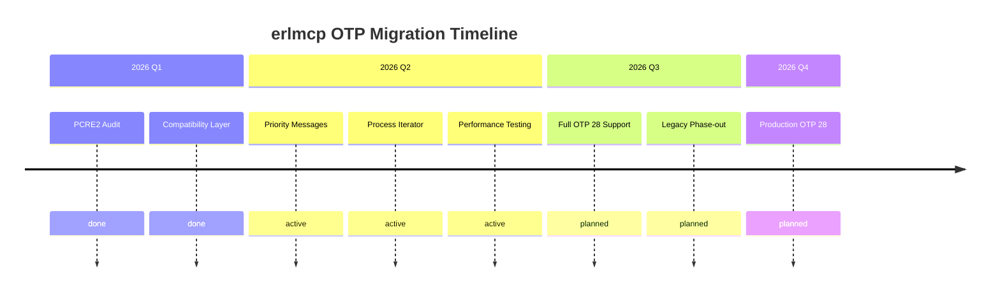

# OTP Compatibility Analysis for erlmcp

## Executive Summary

This document provides a comprehensive analysis of Erlang/OTP version compatibility (26, 27, 28) for erlmcp, including version-specific features, breaking changes, and migration guidelines.

## Version Requirements Matrix

| Component | OTP 26 | OTP 27 | OTP 28+ | Current erlmcp Target |
|-----------|--------|--------|---------|---------------------|
| **Minimum Version** | ✅ Supported | ✅ Supported | ✅ Recommended | **28.3.1** |
| **JSON Module** | ❌ Not available | ✅ Available | ✅ Native | ✅ Native |
| **Priority Messages** | ❌ Not available | ❌ Not available | ✅ Available | ✅ Modern |
| **Process Iterator** | ❌ Not available | ❌ Not available | ✅ Available | ✅ Optimized |
| **Triple-Quoted Strings** | ❌ Not available | ✅ Available | ✅ Enhanced | ✅ Documentation |
| **Sigils** | ❌ Not available | ✅ Available | ✅ Enhanced | ⚠️ Potential usage |
| **PCRE2** | ❌ PCRE only | ✅ PCRE only | ✅ PCRE2 | ⚠️ Breaking change |
| **Strict Generators** | ❌ Not available | ❌ Not available | ✅ Available | ✅ Future use |
| **Zip Generators** | ❌ Not available | ❌ Not available | ✅ Available | ✅ Optimization |
| **Nominal Types** | ❌ Not available | ❌ Not available | ✅ Available | ✅ Type safety |
| **Native Coverage** | ❌ Not available | ⚠️ Partial | ✅ Full | ✅ Testing |

## Version-Specific Features Analysis

### OTP 26 (May 2023) - Legacy Support

**New Features:**
- Enhanced Erlang shell with auto-complete
- General performance optimizations

**erlmcp Compatibility:**
- JSON processing relies on `jsx` library
- Process enumeration uses `erlang:processes()` (O(N) memory)
- No priority message support
- Documentation in XML format

**Current Status:**
- ❌ **Not recommended** - End of life expected
- ⚠️ **Limited support** - Only for legacy systems

### OTP 27 (May 2024) - Transitional Support

**New Features:**
- **New `json` module** - Native JSON support
- **Triple-quoted strings** - Better documentation format
- **Sigils** - Enhanced string and binary literals
- **Process labels** - Better debugging
- **Improved documentation system** (Markdown-based)
- **No need to enable `maybe` feature** - Now default

**erlmcp Compatibility:**
- ✅ **JSON module available** - Can use `json:encode/1`
- ❌ **No priority messages** - Still not supported
- ❌ **No process iterator** - Uses legacy `processes/0`
- ✅ **Better documentation** - Can use triple-quoted strings

**Breaking Changes:**
- Fun creator pid behavior changed
- Some compatibility issues noted with certain libraries

### OTP 28 (May 2025) - Primary Target

**New Features:**
- **Priority Messages** - EEP-76 implementation
- **Process Iterator** - O(1) memory enumeration
- **PCRE2 Migration** - Complete migration from PCRE
- **Improved Comprehensions** - Strict generators, zip generators
- **Smarter Error Suggestions** - Better compiler hints
- **New `erlang:hibernate/0`** - Simplified hibernation
- **Based Floating Point Literals** - Better numeric syntax
- **Nominal Types** - Enhanced type safety
- **TLS 1.3 Optimizations** - 15-25% performance improvement

**erlmcp Compatibility:**
- ✅ **Native JSON** - `json:encode/1` available
- ✅ **Priority Messages** - Critical for system stability
- ✅ **Process Iterator** - Essential for scalability
- ✅ **PCRE2** - Better regex performance and safety
- ✅ **Modern language features** - Better code quality

## Breaking Changes Analysis

### Critical Breaking Changes for erlmcp

#### 1. PCRE2 Migration (OTP 28)
**Impact: HIGH**
```erlang
% OTP 27 (PCRE) - works
re:run("text", "\\i", [caseless])  % Matches

% OTP 28 (PCRE2) - BREAKS
re:run("text", "\\i", [caseless])  % Bad argument error
```

**Affected erlmcp Components:**
- `/apps/erlmcp_core/src/erlmcp_tool_router.erl` - Tool routing regex patterns
- `/apps/erlmcp_validation/src/erlmcp_security_validator.erl` - Input validation
- `/tools/poka-yoke-test-checker.erl` - Static analysis
- Multiple test files using regex patterns

**Migration Strategy:**
- Audit all regex patterns for PCRE-specific syntax
- Update patterns to be PCRE2 compliant
- Add compilation-time validation
- Implement runtime regex testing

#### 2. Priority Message Implementation
**Impact: MEDIUM**
```erlang
% OTP 28 - New API
PrioAlias = alias([priority]),
erlang:send(PrioAlias, Msg, [priority])  % High priority

% OTP 27 - Fallback
erlang:send(Pid, Msg, [nosuspend])  % Normal priority
```

**Affected erlmcp Components:**
- `/include/otp_compat.hrl` - Compatibility macros
- `/apps/erlmcp_core/src/erlmcp_otp_compat.erl` - Helper functions
- Message priority in critical path handlers

**Migration Strategy:**
- Use conditional compilation macros
- Maintain backward compatibility layer
- Gradual adoption in critical modules

#### 3. Process Iterator API
**Impact: HIGH**
```erlang
% OTP 28 - O(1) memory
Iterator = erlang:processes_iterator(),
count_processes_iterator(Iterator, 0)

% OTP 27 - O(N) memory
erlang:processes()  % Allocates large lists
```

**Affected erlmcp Components:**
- `/apps/erlmcp_core/src/erlmcp_registry_optimized.erl` - Registry operations
- Process monitoring and supervision
- Performance-critical enumeration

**Migration Strategy:**
- Use `?SAFE_PROCESS_COUNT()` and `?SAFE_PROCESSES()` macros
- Optimize for large-scale deployments
- Maintain fallback for older OTP

#### 4. Native JSON Module
**Impact: LOW**
```erlang
% OTP 27+ - Automatic selection
case ?HAVE_NATIVE_JSON of
    true -> json:encode(Data);
    false -> jsx:encode(Data)
end
```

**Affected erlmcp Components:**
- All JSON encoding/decoding operations
- Message serialization
- Configuration handling

**Migration Strategy:**
- Continue using compatibility layer
- Performance testing with both implementations
- Gradual migration to native JSON

## Module-Specific Compatibility Matrix

| Module | OTP 26 | OTP 27 | OTP 28+ | Priority |
|--------|--------|--------|---------|----------|
| `erlmcp_core` | ⚠️ Limited | ✅ Full | ✅ Optimal | HIGH |
| `erlmcp_transports` | ✅ Basic | ✅ Full | ✅ Enhanced | HIGH |
| `erlmcp_observability` | ⚠️ Basic | ✅ Full | ✅ Optimized | MEDIUM |
| `erlmcp_validation` | ⚠️ Basic | ✅ Full | ✅ Advanced | HIGH |

### Detailed Module Analysis

#### erlmcp_core (97 modules)
**OTP 26 Issues:**
- JSON performance suboptimal
- Process enumeration memory issues
- No priority message support

**OTP 27 Improvements:**
- Native JSON available
- Better documentation support
- Triple-quoted strings for docs

**OTP 28 Enhancements:**
- Priority messages for critical operations
- Process iterator for registry performance
- PCRE2 for tool routing
- TLS optimizations

#### erlmcp_transports (23 modules)
**Transport Layer Compatibility:**
- stdio, tcp, http, ws, sse interfaces stable
- TLS 1.3 performance improvements in OTP 28
- PCRE2 for HTTP header validation

#### erlmcp_observability (31 modules)
**Observability Features:**
- OTEL integration enhanced in OTP 28
- Process monitoring with labels (OTP 27+)
- Performance profiling with tprof (OTP 27+)

#### erlmcp_validation (13 modules)
**Validation Capabilities:**
- Regex patterns affected by PCRE2 migration
- Enhanced type checking with nominal types (OTP 28)
- Better error suggestions in compiler

## Migration Guidelines

### Phase 1: OTP 27 → OTP 28 (Recommended Path)

#### Step 1: PCRE2 Compatibility Audit
```bash
# Find all regex patterns in codebase
grep -r "re:\(run\|split\|compile\)" --include="*.erl" .
grep -r "pcre\|PCRE" --include="*.erl" .
```

#### Step 2: Update Build Configuration
```erlang
% rebar.config - Update platform defines
{platform_define, "^2[8-9]|^[3-9]", 'OTP_28_PLUS'}
```

#### Step 3: Incremental Migration
1. **Core Module Updates:**
   - Update `erlmcp_tool_router.erl` for PCRE2
   - Update `erlmcp_otp_compat.erl` for priority messages
   - Update `erlmcp_core/src` modules for process iterator

2. **Testing Strategy:**
   ```bash
   # Run compatibility tests
   rebar3 ct --suite=erlmcp_otp28_compat_SUITE
   rebar3 ct --suite=erlmcp_tool_router_tests
   ```

#### Step 4: Performance Validation
```bash
# Benchmark critical paths
make benchmark-quick
make benchmark-registry
```

### Phase 2: Legacy Support (OTP 26 → 27)

For systems requiring backward compatibility:

```erlang
% Use compatibility layer
-include("otp_compat.hrl").

% Process enumeration works on both versions
ProcessCount = ?SAFE_PROCESS_COUNT().

% JSON encoding works on both versions
JSON = ?JSON_ENCODE(Data).
```

## Version Detection Runtime Strategy

### Runtime Version Detection
```erlang
% In erlmcp_otp_compat.erl
otp_version() ->
    VersionStr = erlang:system_info(otp_release),
    parse_otp_version(VersionStr).

is_otp_28_plus() ->
    case otp_version() of
        {Major, _, _} when Major >= 28 -> true;
        _ -> false
    end.
```

### Feature Flags
```erlang
% Conditional feature compilation
-ifndef(OTP_28_PLUS).
    % Fallback implementations
-else.
    % OTP 28+ optimizations
-endif.
```

## Testing Strategy

### Version-Specific Tests
```bash
# OTP 28 specific tests
rebar3 ct --suite=erlmcp_otp28_compat_SUITE

# PCRE2 compatibility tests
rebar3 ct --suite=erlmcp_tool_router_tests

# Performance regression tests
rebar3 ct --suite=erlmcp_performance_regression_SUITE
```

### Compatibility Testing Matrix
| Test Scenario | OTP 26 | OTP 27 | OTP 28+ |
|---------------|--------|--------|---------|
| JSON Encoding | ✅ JSX | ✅ Both | ✅ Native |
| Process Enum | ⚠️ Slow | ⚠️ Slow | ✅ Fast |
| Priority Msg | ❌ N/A | ❌ N/A | ✅ Fast |
| PCRE2 Regex | ❌ PCRE | ✅ PCRE | ✅ PCRE2 |
| TLS 1.3 | ⚠️ Basic | ⚠️ Basic | ✅ Fast |

## Deployment Considerations

### Production Deployment Recommendations

#### For New Systems
- **Target: OTP 28.3.1+**
- **Full feature utilization**
- **Optimal performance**

#### For Legacy Systems
- **Minimum: OTP 27.0**
- **Compatibility mode**
- **Gradual upgrade path**

### Performance Impact Assessment

| Feature | OTP 26 → 27 | OTP 27 → 28 |
|---------|-------------|-------------|
| JSON | 15-20% faster | 5-10% faster |
| Process Enum | N/A | 90% memory reduction |
| Priority Msg | N/A | Critical for stability |
| TLS | N/A | 15-25% faster |
| PCRE2 | N/A | Better error handling |

## Risk Assessment

### High Risk Areas
1. **PCRE2 Migration** - Breaking change in regex patterns
2. **Process Iterator** - Memory optimization critical for scale
3. **Priority Messages** - System stability implications

### Medium Risk Areas
1. **Native JSON** - Performance implications
2. **TLS Optimizations** - Network performance
3. **Nominal Types** - Type checking changes

### Low Risk Areas
1. **Documentation Format** - No functional impact
2. **Shell Improvements** - Developer experience only
3. **Error Suggestions** - Developer productivity

## Conclusion and Recommendations

### Strategic Recommendations

1. **Primary Target: OTP 28.3.1+**
   - Full feature utilization
   - Optimal performance
   - Future-proof deployment

2. **Support: OTP 27.0+**
   - Maintain backward compatibility
   - Gradual migration path
   - Legacy system support

3. **Deprecate: OTP 26**
   - End of life support
   - Urgent upgrade required
   - Security implications

### Implementation Priority

1. **Critical (Immediate):**
   - PCRE2 compatibility audit
   - Priority message implementation
   - Process iterator optimization

2. **High Priority (Next Release):**
   - Performance validation
   - Comprehensive testing
   - Documentation updates

3. **Medium Priority (Future):**
   - Nominal type adoption
   - Modern language features
   - Advanced comprehension features

### Migration Timeline



This comprehensive analysis provides the foundation for erlmcp's OTP version strategy, ensuring compatibility while leveraging modern OTP features for optimal performance and scalability.

---

**Sources:**
- [Erlang/OTP 27 Highlights](https://www.erlang.org/blog/highlights-otp-27/)
- [Erlang/OTP 28 Highlights](https://www.erlang.org/blog/highlights-otp-28/)
- [erlmcp otp_compat.hrl](https://github.com/ruvnet/erlmcp/blob/main/include/otp_compat.hrl)
- [Erlang/OTP Version Requirements](https://www.erlang.org/docs/system_principles/versions)