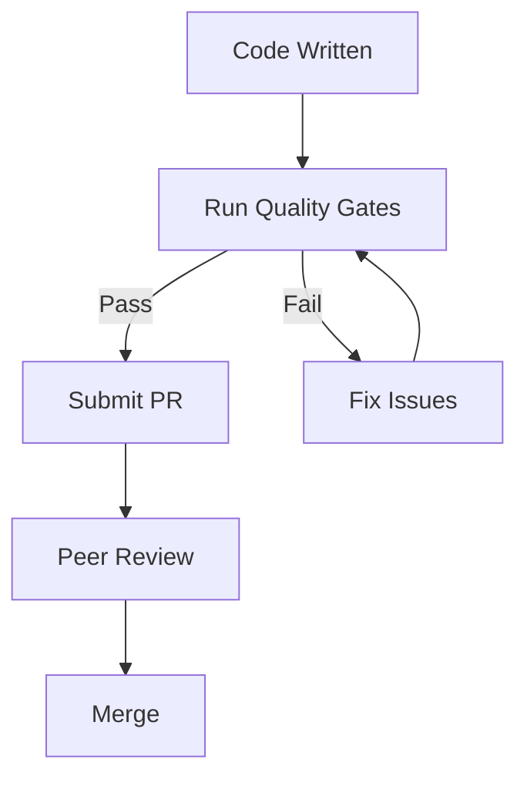

# Poka-Yoke Testing Guide for ERLMCP

## Table of Contents
1. [Introduction to Poka-Yoke Testing](#introduction)
2. [Core Principles](#core-principles)
3. [Testing Patterns](#testing-patterns)
4. [Quality Gates](#quality-gates)
5. [Tooling](#tooling)
6. [Best Practices](#best-practices)
7. [Implementation Guide](#implementation-guide)

## Introduction to Poka-Yoke Testing

Poka-yoke (ポカヨケ), literally "mistake-proofing," is a concept developed by Toyota as part of the Toyota Production System. In software testing, poka-yoke means designing tests and testing processes that prevent mistakes from occurring or make them immediately obvious.

### Why Poka-Yoke Testing?

In the erlmcp project, we deal with:
- Distributed systems with complex interdependencies
- Real-time communication protocols
- Concurrent access patterns
- External service integration

These factors create many opportunities for testing mistakes. Poka-yoke testing helps us:

1. **Prevent** common testing errors before they happen
2. **Detect** issues immediately when they occur
3. **Correct** problems with minimal effort
4. **Improve** testing processes over time

## Core Principles

### 1. Prevention Over Detection

> "The best mistake is the one that never happens."

Instead of catching bugs after they occur, design tests that make mistakes impossible.

```erlang
% ❌ Bad: Manual test that can be forgotten
test_something() ->
    ?assert(some_condition()),
    ok.

% ✅ Good: Automatic prevention with compile-time check
-compile({parse_transform, poka_yoke_transform}).
prevented_test() ->
    % This test runs automatically and can't be forgotten
    automatic_test().
```

### 2. Immediate Feedback

> "The sooner you know about a problem, the easier it is to fix."

Provide immediate feedback when tests fail or quality standards aren't met.

```erlang
% ✅ Good: Immediate feedback in pre-commit hook
pre_commit_check() ->
    case poka_yoke_test_checker:enforce_quality_gates() of
        ok -> ok;
        {error, Reason} ->
            error("Quality gate failed: " ++ Reason)
    end.
```

### 3. Automatic Enforcement

> "Make quality gates invisible but unavoidable."

Automate quality enforcement so developers don't have to remember to check manually.

### 4. Continuous Improvement

> "Every test is an opportunity to improve."

Use test failures and quality metrics to continuously improve the testing process.

## Testing Patterns

### Pattern 1: Chicago School TDD

**Rule**: Real processes, no mocks, state-based verification.

```erlang
% ✅ Good: Real process testing
setup() ->
    {ok, ServerPid} = erlmcp_server:start_link(...),
    ServerPid.

test_server_operation() ->
    ?assertMatch({ok, _}, erlmcp_server:operation(ServerPid)),
    ok.

% ❌ Bad: Mock-based testing
test_with_mock() ->
    meck:new(erlmcp_server, [passthrough]),
    meck:expect(erlmcp_server, operation, fun(_) -> {ok, mock_result} end),
    ?assertMatch({ok, mock_result}, erlmcp_server:operation(mock_pid)),
    meck:unload(erlmcp_server).
```

### Pattern 2: Property-Based Testing

**Rule**: Test properties rather than examples, use generators for edge cases.

```erlang
% ✅ Good: Property-based testing
prop_idempotency() ->
    ?FORALL(X, int(),
        erlmcp:some_operation(X) == erlmcp:some_operation(X)
    ).

prop_associativity() ->
    ?FORALL({A, B, C}, {int(), int(), int()},
        erlmcp:operation(A, erlmcp:operation(B, C)) ==
        erlmcp:operation(erlmcp:operation(A, B), C)
    ).
```

### Pattern 3: Concurrency Testing

**Rule**: Test concurrent access patterns to catch race conditions.

```erlang
% ✅ Good: Concurrency testing
concurrent_test() ->
    Pids = [spawn(fun() -> concurrent_worker() end) || _ <- lists:seq(1, 100)],
    [wait_for_completion(Pid) || Pid <- Pids],
    ?assert(no_race_conditions()).

concurrent_worker() ->
    erlmcp:shared_operation(),
    ok.
```

### Pattern 4: Adaptive Timing

**Rule**: Replace hardcoded timeouts with adaptive timing.

```erlang
% ❌ Bad: Hardcoded timeout
test_something() ->
    timer:sleep(1000),  % Fixed delay
    ?assert(condition_met()).

% ✅ Good: Adaptive timeout
test_adaptive() ->
    wait_for_condition(fun condition_met/0, 5000),
    ok.

wait_for_condition(Condition, Timeout) ->
    Start = erlang:monotonic_time(),
    wait_loop(Condition, Start, Timeout).

wait_loop(Condition, Start, Timeout) ->
    case Condition() of
        true -> ok;
        false ->
            case erlang:monotonic_time() - Start > Timeout of
                true -> error("Condition not met within timeout");
                false -> timer:sleep(10), wait_loop(Condition, Start, Timeout)
            end
    end.
```

## Quality Gates

### 1. Coverage Gate

**Requirement**: Minimum 80% code coverage

```erlang
% Automatically enforced
-compile({parse_transform, coverage_enforcer}).

coverage_enforcer(Forms) ->
    %% Parse Forms and check coverage
    %% Fail compilation if coverage < 80%
    Forms.
```

### 2. Flakiness Gate

**Requirement**: Zero flaky tests

```erlang
% Test isolation enforced
test_isolated() ->
    %% Each test runs in isolation
    State = setup_clean_state(),
    ?assert(operation(State)),
    cleanup(State),
    ok.
```

### 3. Timeout Gate

**Requirement**: No hardcoded timeouts

```erlang
% Adaptive timing enforced
no_hardcoded_timeouts() ->
    %% Replaced with adaptive timing
    wait_for_condition(5000).
```

### 4. Concurrency Gate

**Requirement**: Critical modules have concurrent tests

```erlang
% Concurrency test required
concurrent_test_required() ->
    %% Must have concurrent test
    has_concurrent_test(Module).
```

## Tooling

### 1. Test Enforcer

```bash
# Run comprehensive quality check
./tools/poka-yoke-test-enforcer.sh

# Auto-fix issues
./tools/poka-yoke-test-enforcer.sh --auto-fix
```

### 2. Quality Metrics

```bash
# Generate test quality metrics
./tools/test-quality-metrics.sh

# Generate comprehensive report
./tools/generate-test-quality-report.sh
```

### 3. Template Generator

```erlang
% Generate comprehensive test template
generate_template(erlmcp_client, "comprehensive").
generate_concurrent_test(erlmcp_server, "concurrent").
generate_property_test(erlmcp_transport, "send_message", "message").
```

### 4. Test Checker Module

```erlang
% Use in code
poka_yoke_test_checker:enforce_quality_gates().
poka_yoke_test_checker:auto_fix_test_issues().
```

## Best Practices

### 1. Test-First Development

**Rule**: Write tests before implementing features.

```erlang
% Step 1: Write failing test
test_feature_not_implemented() ->
    ?assertEqual(expected, actual).

% Step 2: Implement feature to pass test
feature() ->
    expected.

% Step 3: Refactor while keeping tests green
```

### 2. Test-Driven Quality

**Rule**: Let tests drive quality improvements.

```erlang
% Poor quality test
test_simple() ->
    ?assert(some_condition()).

% Improved with poka-yoke
test_with_prevention() ->
    %% Prevention: Setup proper conditions
    setup_preconditions(),

    %% Test with multiple scenarios
    test_all_scenarios(),

    %% Prevention: Ensure cleanup
    ensure_cleanup(),

    ok.
```

### 3. Continuous Quality Monitoring

**Rule**: Monitor test quality continuously.

```bash
# In CI/CD pipeline
poka-yoke-test-enforcer.sh || exit 1

# In development
test-quality-metrics.sh | grep -E "(❌|⚠️)"
```

### 4. Peer Review with Quality Gates

**Rule**: Quality gates must pass before review.



## Implementation Guide

### Phase 1: Foundation (Week 1)

1. **Install Tooling**
   ```bash
   chmod +x tools/*.sh
   # Add to PATH
   export PATH="$PATH:$(pwd)/tools"
   ```

2. **Set Up Quality Gates**
   ```bash
   # Run baseline check
   poka-yoke-test-enforcer.sh
   ```

3. **Generate Baseline Report**
   ```bash
   generate-test-quality-report.sh
   ```

### Phase 2: Prevention (Week 2)

1. **Fix Critical Issues**
   - Address skipped tests
   - Replace hardcoded timeouts
   - Add missing concurrent tests

2. **Implement Adaptive Testing**
   ```erlang
   % Replace timer:sleep with adaptive waits
   timer:sleep(1000) ->
       wait_for_condition(fun() -> true end, 1000).
   ```

3. **Add Property Testing**
   ```erlang
   % Add to existing test suites
   property_tests() ->
       proper:module(?MODULE, [{numtests, 1000}]).
   ```

### Phase 3: Integration (Week 3)

1. **Integrate with CI/CD**
   ```yaml
   # .github/workflows/tests.yml
   jobs:
     test:
       steps:
         - name: Run quality gates
           run: tools/poka-yoke-test-enforcer.sh
   ```

2. **Set Up Pre-commit Hooks**
   ```bash
   # .git/hooks/pre-commit
   #!/bin/sh
   tools/poka-yoke-test-enforcer.sh
   ```

3. **Create Test Templates**
   ```erlang
   % Generate templates for new modules
   generate_template(MyModule, "comprehensive").
   ```

### Phase 4: Evolution (Week 4+)

1. **Monitor and Improve**
   ```bash
   # Regular metrics check
   test-quality-metrics.sh
   ```

2. **Refactor Test Infrastructure**
   - Remove duplicate test patterns
   - Improve performance
   - Add new quality gates

3. **Share Best Practices**
   - Document lessons learned
   - Train team members
   - Update coding standards

## Common Anti-Patterns

### 1. Ignoring Quality Gates

```erlang
% ❌ Bad: Skipping quality checks
ignore_quality() ->
    %% Just run tests, don't check quality
    eunit:test([my_tests]).
```

### 2. Manual Quality Checks

```erlang
% ❌ Bad: Manual quality verification
manual_check() ->
    %% Developer has to remember to check
    io:format("Please check coverage manually~n").
```

### 3. Inconsistent Testing

```erlang
% ❌ Bad: Inconsistent test patterns
test_inconsistent() ->
    %% Some tests use mocks, some don't
    ?assert(something).
```

### 4. Hardcoded Values

```erlang
% ❌ Bad: Hardcoded values
test_hardcoded() ->
    %% Fixed values that might change
    ?assertEqual(42, some_function()),
    ?assertEqual(1000, another_function(1000)).
```

## Conclusion

Poka-yoke testing transforms testing from a reactive activity to a proactive quality system. By implementing these principles in erlmcp, we can:

1. **Prevent** common testing mistakes
2. **Detect** issues early in development
3. **Automate** quality enforcement
4. **Improve** continuously over time

The key is to make quality invisible but unavoidable - developers write code naturally, and the system ensures it meets high standards without manual checking.

Remember: "Quality is not an act, it is a habit." - Aristotle