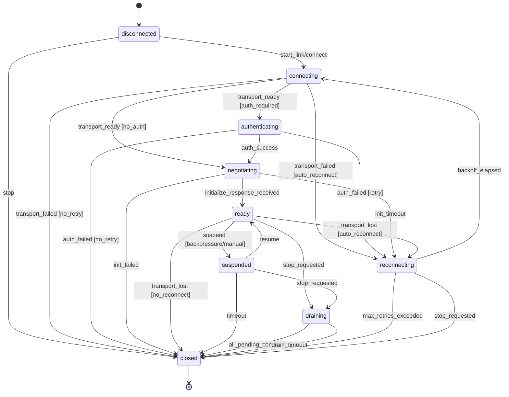
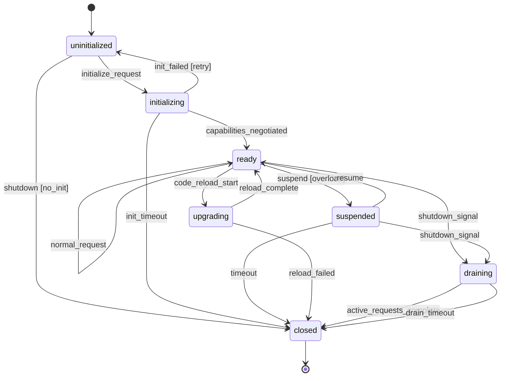
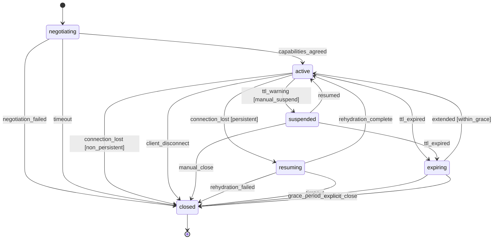
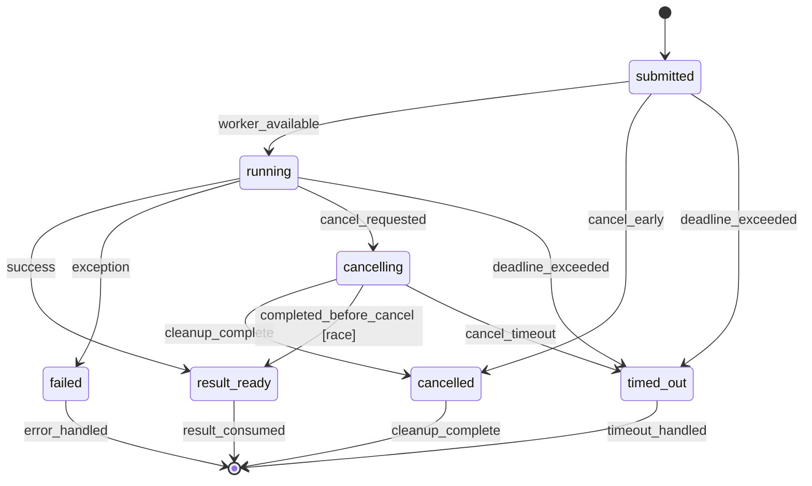
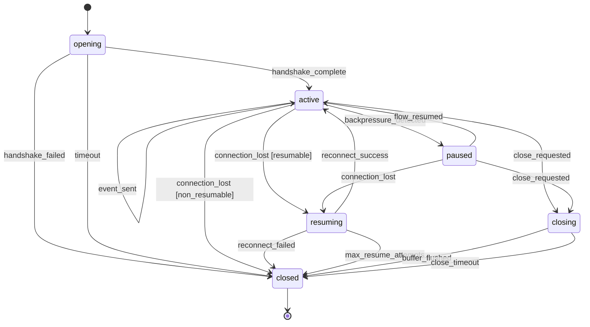

# Protocol State Machines - Armstrong-Style Design
## erlmcp v2.2.0 Architectural Innovation

**Purpose:** Canonical specification for all protocol lifecycle state machines in erlmcp.
**Philosophy:** "Make incorrect states unrepresentable" - Joe Armstrong
**Implementation:** gen_statem behaviors with explicit transitions
**Testing:** PropEr statem model-based testing
**Debugging:** State transition audit trail

---

## Table of Contents

1. [Part 1: Protocol State Machines](#part-1-protocol-state-machines)
   - [FSM 1: Client Lifecycle](#fsm-1-client-lifecycle)
   - [FSM 2: Server Lifecycle](#fsm-2-server-lifecycle)
   - [FSM 3: Session Lifecycle](#fsm-3-session-lifecycle)
   - [FSM 4: Task Execution FSM](#fsm-4-task-execution-fsm)
   - [FSM 5: SSE Stream FSM](#fsm-5-sse-stream-fsm)
2. [Part 2: State Transition Specification](#part-2-state-transition-specification)
3. [Part 3: Hot-Upgrade Readiness](#part-3-hot-upgrade-readiness)
4. [Implementation Priorities](#implementation-priorities)
5. [Risk Assessment](#risk-assessment)

---

## Part 1: Protocol State Machines

### Design Philosophy

**Armstrong Principle:** Design systems where incorrect behavior cannot exist.

**Current State (v2.1.0):**
- `erlmcp_client` - gen_server with manual `phase` field tracking
- `erlmcp_server` - gen_server with manual `phase` field tracking
- `erlmcp_completion` - gen_server with manual `stream_state` tracking
- `erlmcp_circuit_breaker` - **gen_statem** (CORRECT PATTERN) ✅

**Target State (v2.2.0):**
- Convert all lifecycle components to gen_statem
- Explicit state transition guards
- Race condition handling built into state machine
- Model-based testing from state specs

---

### FSM 1: Client Lifecycle

**Module:** `erlmcp_client` (convert from gen_server to gen_statem)

#### Legal States

```erlang
-type client_state() ::
      disconnected      % Initial state, no transport
    | connecting        % Transport initializing
    | authenticating    % Performing auth handshake (if required)
    | negotiating       % Capability negotiation (initialize request sent)
    | ready             % Fully initialized, accepting requests
    | draining          % Graceful shutdown, finishing pending requests
    | reconnecting      % Auto-reconnect after transport failure
    | suspended         % Temporarily paused (manual or backpressure)
    | closed.           % Terminal state, cleanup complete
```

#### State Transitions



#### Transition Guards and Conditions

| From State | Event | Guard | To State | Actions |
|------------|-------|-------|----------|---------|
| `disconnected` | `connect` | `true` | `connecting` | Initialize transport |
| `connecting` | `transport_ready` | `auth_required()` | `authenticating` | Send auth request |
| `connecting` | `transport_ready` | `not auth_required()` | `negotiating` | Send initialize |
| `connecting` | `transport_failed` | `auto_reconnect()` | `reconnecting` | Schedule backoff |
| `connecting` | `transport_failed` | `not auto_reconnect()` | `closed` | Cleanup |
| `authenticating` | `auth_success` | `true` | `negotiating` | Send initialize |
| `authenticating` | `auth_failed` | `retry_count() < max_auth_retries()` | `reconnecting` | Increment retry |
| `authenticating` | `auth_failed` | `retry_count() >= max_auth_retries()` | `closed` | Auth exhausted |
| `negotiating` | `initialize_response` | `is_valid_capabilities()` | `ready` | Store capabilities, flush pending |
| `negotiating` | `init_timeout` | `retry_count() < max_init_retries()` | `reconnecting` | Retry init |
| `negotiating` | `init_timeout` | `retry_count() >= max_init_retries()` | `closed` | Init exhausted |
| `ready` | `stop` | `has_pending_requests()` | `draining` | Stop accepting, wait for pending |
| `ready` | `stop` | `not has_pending_requests()` | `closed` | Immediate shutdown |
| `ready` | `suspend` | `true` | `suspended` | Buffer incoming requests |
| `ready` | `transport_lost` | `auto_reconnect()` | `reconnecting` | Preserve pending requests |
| `ready` | `transport_lost` | `not auto_reconnect()` | `closed` | Fail pending requests |
| `suspended` | `resume` | `true` | `ready` | Flush buffered requests |
| `suspended` | `timeout` | `suspended_time() > max_suspend_ms()` | `closed` | Timeout |
| `draining` | `pending_empty` | `true` | `closed` | All requests complete |
| `draining` | `drain_timeout` | `drain_time() > max_drain_ms()` | `closed` | Force shutdown |
| `reconnecting` | `backoff_elapsed` | `true` | `connecting` | Attempt reconnect |
| `reconnecting` | `max_retries` | `retry_count() >= max_reconnect_retries()` | `closed` | Give up |
| `reconnecting` | `stop` | `true` | `closed` | Abort reconnection |

#### Priority/Control Signals

**Control signals that can interrupt data flow:**

1. **`stop`** - Highest priority, can interrupt any state
   - From `ready` → `draining` (if pending) or `closed` (if idle)
   - From `suspended` → `draining` or `closed`
   - From `reconnecting` → `closed` (abort retry)

2. **`suspend`** - High priority, from `ready` → `suspended`
   - Used for backpressure, manual pause, or rate limiting
   - Data requests buffered while suspended

3. **`resume`** - From `suspended` → `ready`
   - Flush buffered requests

4. **`transport_lost`** - Async signal, can interrupt `ready` or `negotiating`
   - Triggers reconnection logic or shutdown

#### Race Conditions and Handling

| Race Condition | Detection | Resolution |
|----------------|-----------|------------|
| **`stop` during `negotiating`** | State check before transition | Abort init, transition to `closed` |
| **Response arrives in `reconnecting`** | Discard responses for old transport | Use transport generation counter |
| **Multiple `transport_ready` events** | Idempotency check | Only first event processes |
| **`suspend` + `transport_lost`** | State priority | `transport_lost` takes precedence → `reconnecting` |
| **`resume` after `stop`** | State validation | `resume` rejected if not in `suspended` |
| **Pending request timeout during `draining`** | Timeout while draining | Individual request fails, others continue |

#### Data Structures

```erlang
-record(client_data, {
    transport :: module(),
    transport_state :: term(),
    transport_generation = 0 :: non_neg_integer(),  % Detect stale responses
    capabilities :: #mcp_server_capabilities{} | undefined,
    request_id = 1 :: pos_integer(),
    pending_requests = #{} :: #{request_id() => {method(), pid(), reference()}},
    suspended_requests = [] :: [{method(), pid(), reference()}],
    retry_count = 0 :: non_neg_integer(),
    backoff_ms = 1000 :: pos_integer(),
    max_backoff_ms = 60000 :: pos_integer(),
    auto_reconnect = true :: boolean(),
    auth_config :: map() | undefined,
    timeouts :: #{
        init := pos_integer(),
        drain := pos_integer(),
        suspend := pos_integer()
    },
    state_entered_at :: integer(),  % Timestamp for timeout calculation
    state_history = [] :: [{client_state(), integer()}]  % Audit trail
}).
```

---

### FSM 2: Server Lifecycle

**Module:** `erlmcp_server` (convert from gen_server to gen_statem)

#### Legal States

```erlang
-type server_state() ::
      uninitialized     % Created, waiting for initialize request
    | initializing      % Processing initialize request
    | ready             % Serving requests
    | draining          % Graceful shutdown, finishing active requests
    | suspended         % Load shedding, rejecting new requests
    | upgrading         % Hot code reload in progress
    | closed.           % Terminal state
```

#### State Transitions



#### Transition Guards and Conditions

| From State | Event | Guard | To State | Actions |
|------------|-------|-------|----------|---------|
| `uninitialized` | `initialize` | `is_valid_init_request()` | `initializing` | Store client caps, send response |
| `uninitialized` | `shutdown` | `true` | `closed` | Never initialized |
| `initializing` | `caps_negotiated` | `true` | `ready` | Mark initialized, enable handlers |
| `initializing` | `init_failed` | `true` | `uninitialized` | Reset state |
| `initializing` | `timeout` | `elapsed_time() > init_timeout()` | `closed` | Init timeout |
| `ready` | `shutdown` | `has_active_requests()` | `draining` | Finish active, reject new |
| `ready` | `shutdown` | `not has_active_requests()` | `closed` | Immediate shutdown |
| `ready` | `suspend` | `true` | `suspended` | Reject new requests |
| `ready` | `code_reload` | `true` | `upgrading` | Pause requests, load new code |
| `suspended` | `resume` | `load_below_threshold()` | `ready` | Accept requests |
| `suspended` | `shutdown` | `true` | `draining` | Begin shutdown |
| `suspended` | `timeout` | `suspended_time() > max_suspend_ms()` | `closed` | Force close |
| `upgrading` | `reload_complete` | `true` | `ready` | New code active |
| `upgrading` | `reload_failed` | `true` | `closed` | Cannot continue |
| `draining` | `requests_empty` | `true` | `closed` | All active complete |
| `draining` | `timeout` | `drain_time() > max_drain_ms()` | `closed` | Force close |

#### Priority/Control Signals

1. **`shutdown`** - Highest priority, any state → `draining` or `closed`
2. **`suspend`** - Load shedding, `ready` → `suspended`
3. **`code_reload`** - Hot upgrade, `ready` → `upgrading`
4. **`resume`** - `suspended` → `ready`

#### Race Conditions and Handling

| Race Condition | Detection | Resolution |
|----------------|-----------|------------|
| **`initialize` twice** | Phase check | Second request rejected with error |
| **Request during `draining`** | State check | Reject with `server_shutting_down` |
| **`suspend` + `shutdown`** | Priority ordering | `shutdown` takes precedence |
| **`code_reload` during active request** | Request tracking | Wait for active to complete, then upgrade |
| **Multiple `resume` calls** | Idempotency check | Only first `resume` processes |

#### Data Structures

```erlang
-record(server_data, {
    server_id :: binary(),
    capabilities :: #mcp_server_capabilities{},
    client_capabilities :: #mcp_client_capabilities{} | undefined,
    protocol_version :: binary() | undefined,
    resources = #{} :: #{binary() => {#mcp_resource{}, handler()}},
    tools = #{} :: #{binary() => {#mcp_tool{}, handler(), schema() | undefined}},
    prompts = #{} :: #{binary() => {#mcp_prompt{}, handler()}},
    active_requests = #{} :: #{request_id() => {method(), started_at()}},
    subscriptions = #{} :: #{binary() => sets:set(pid())},
    load_metrics :: #{
        requests_per_sec := float(),
        active_count := non_neg_integer(),
        reject_count := non_neg_integer()
    },
    timeouts :: #{
        init := pos_integer(),
        drain := pos_integer(),
        suspend := pos_integer()
    },
    state_entered_at :: integer(),
    state_history = [] :: [{server_state(), integer()}]
}).
```

---

### FSM 3: Session Lifecycle

**Module:** `erlmcp_session` (NEW gen_statem, currently just data structure)

#### Legal States

```erlang
-type session_state() ::
      negotiating       % Capability exchange in progress
    | active            % Session established, requests flowing
    | suspended         % Temporarily paused (TTL management, backpressure)
    | resuming          % Rehydrating from persistent storage
    | expiring          % TTL expired, grace period for cleanup
    | closed.           % Terminal state, removed from backend
```

#### State Transitions



#### Transition Guards and Conditions

| From State | Event | Guard | To State | Actions |
|------------|-------|-------|----------|---------|
| `negotiating` | `caps_agreed` | `is_valid_handshake()` | `active` | Create session, start TTL timer |
| `negotiating` | `failed` | `true` | `closed` | Reject session |
| `negotiating` | `timeout` | `elapsed() > init_timeout()` | `closed` | Negotiation timeout |
| `active` | `suspend` | `true` | `suspended` | Pause TTL timer |
| `active` | `ttl_expired` | `true` | `expiring` | Start grace period |
| `active` | `connection_lost` | `is_persistent()` | `resuming` | Serialize state to backend |
| `active` | `connection_lost` | `not is_persistent()` | `closed` | Ephemeral session lost |
| `active` | `disconnect` | `true` | `closed` | Clean shutdown |
| `suspended` | `resume` | `true` | `active` | Restart TTL timer |
| `suspended` | `ttl_expired` | `true` | `expiring` | Grace period |
| `suspended` | `close` | `true` | `closed` | Manual close |
| `resuming` | `rehydrated` | `is_valid_state()` | `active` | Restore session |
| `resuming` | `failed` | `true` | `closed` | Cannot restore |
| `resuming` | `timeout` | `elapsed() > resume_timeout()` | `closed` | Resume timeout |
| `expiring` | `extend` | `elapsed() < grace_period()` | `active` | Reset TTL |
| `expiring` | `grace_expired` | `true` | `closed` | Session expired |
| `expiring` | `close` | `true` | `closed` | Explicit close |

#### Priority/Control Signals

1. **`disconnect`** - Immediate close from any state except `closed`
2. **`suspend`** - From `active` → `suspended` (backpressure)
3. **`resume`** - From `suspended` or `resuming` → `active`
4. **`extend_ttl`** - From `expiring` → `active` (within grace period)

#### Race Conditions and Handling

| Race Condition | Detection | Resolution |
|----------------|-----------|------------|
| **TTL expires during request** | Request tracking | Extend grace period until request completes |
| **Resume after close** | State validation | Resume rejected if in `closed` |
| **Suspend + disconnect** | Priority | `disconnect` takes precedence |
| **Multiple resume attempts** | Idempotency | Only first resume processes |
| **Extend during grace period race** | Grace timer check | Accept if within grace, else reject |

#### Data Structures

```erlang
-record(session_data, {
    session_id :: binary(),
    backend :: ets | dets | mnesia,
    created_at :: integer(),
    last_accessed :: integer(),
    ttl_ms :: pos_integer() | infinity,
    grace_period_ms = 30000 :: pos_integer(),
    ttl_timer_ref :: reference() | undefined,
    grace_timer_ref :: reference() | undefined,
    metadata :: map(),
    client_capabilities :: #mcp_client_capabilities{} | undefined,
    server_capabilities :: #mcp_server_capabilities{} | undefined,
    active_requests = 0 :: non_neg_integer(),
    persistent = true :: boolean(),
    state_entered_at :: integer(),
    state_history = [] :: [{session_state(), integer()}]
}).
```

---

### FSM 4: Task Execution FSM

**Module:** `erlmcp_task_runner` (NEW gen_statem)

#### Legal States

```erlang
-type task_state() ::
      submitted         % Task queued, not started
    | running           % Actively executing
    | cancelling        % Cancel requested, cleaning up
    | result_ready      % Completed successfully, result available
    | cancelled         % Successfully cancelled
    | failed            % Execution failed
    | timed_out.        % Exceeded deadline
```

#### State Transitions



#### Transition Guards and Conditions

| From State | Event | Guard | To State | Actions |
|------------|-------|-------|----------|---------|
| `submitted` | `start` | `worker_available()` | `running` | Spawn worker, set deadline |
| `submitted` | `cancel` | `true` | `cancelled` | Remove from queue |
| `submitted` | `timeout` | `now() > deadline()` | `timed_out` | Deadline before start |
| `running` | `success` | `true` | `result_ready` | Store result, notify |
| `running` | `exception` | `true` | `failed` | Store error, notify |
| `running` | `cancel` | `can_interrupt()` | `cancelling` | Send cancel signal to worker |
| `running` | `cancel` | `not can_interrupt()` | `running` | Ignore cancel (non-cancellable) |
| `running` | `timeout` | `now() > deadline()` | `timed_out` | Kill worker |
| `cancelling` | `cleanup_done` | `true` | `cancelled` | Worker stopped cleanly |
| `cancelling` | `result` | `result_arrived_first()` | `result_ready` | **RACE WIN: Result beats cancel** |
| `cancelling` | `timeout` | `cleanup_time() > cancel_timeout()` | `timed_out` | Force kill |
| `result_ready` | `consumed` | `true` | `[*]` | Cleanup resources |
| `cancelled` | `cleanup` | `true` | `[*]` | Remove task |
| `failed` | `handled` | `true` | `[*]` | Remove task |
| `timed_out` | `handled` | `true` | `[*]` | Remove task |

#### Priority/Control Signals

1. **`cancel`** - Can interrupt `submitted` or `running` (if cancellable)
2. **`deadline_timeout`** - Hard stop, highest priority
3. **`result_ready`** - Completion signal

#### Race Conditions and Handling

**CRITICAL RACE: Cancel vs Result**

This is the most complex race condition in the entire system.

| Scenario | Detection | Resolution |
|----------|-----------|------------|
| **Result arrives during cancel** | Check state in result handler | Transition to `result_ready`, ignore cancel |
| **Cancel arrives during result processing** | Atomic state check | If `running` → `cancelling`, if `result_ready` → ignore |
| **Result + cancel arrive simultaneously** | Monotonic timestamp comparison | Earlier event wins |
| **Timeout during cancel** | Cancel timeout check | `cancelling` → `timed_out`, force kill |
| **Multiple cancel requests** | Idempotency check | Only first cancel processes |

**Race Resolution Algorithm:**

```erlang
handle_result_or_cancel(Event, State, Data) ->
    %% Atomic operation - check state and transition
    case {Event, State} of
        {{result, Result}, running} ->
            %% Result wins - transition to result_ready
            {next_state, result_ready, Data#{result => Result}};

        {{result, Result}, cancelling} ->
            %% Result arrived during cancel - result wins (race victory)
            ?LOG_INFO("Task result arrived during cancellation, result preserved"),
            {next_state, result_ready, Data#{result => Result}};

        {{cancel, Reason}, running} ->
            %% Cancel initiated - start cleanup
            {next_state, cancelling, Data#{cancel_reason => Reason}};

        {{cancel, _Reason}, result_ready} ->
            %% Too late, result already ready - ignore cancel
            keep_state_and_data;

        {{cancel, _Reason}, cancelling} ->
            %% Already cancelling - idempotent
            keep_state_and_data;

        _ ->
            {keep_state_and_data}
    end.
```

#### Data Structures

```erlang
-record(task_data, {
    task_id :: binary(),
    tool_name :: binary(),
    arguments :: map(),
    worker_pid :: pid() | undefined,
    worker_monitor :: reference() | undefined,
    deadline :: integer(),  % Absolute timestamp (monotonic)
    cancel_timeout_ms = 5000 :: pos_integer(),
    result :: term() | undefined,
    error :: term() | undefined,
    cancel_reason :: term() | undefined,
    cancellable = true :: boolean(),
    started_at :: integer() | undefined,
    completed_at :: integer() | undefined,
    state_entered_at :: integer(),
    state_history = [] :: [{task_state(), integer()}]
}).
```

---

### FSM 5: SSE Stream FSM

**Module:** `erlmcp_sse_stream` (NEW gen_statem)

#### Legal States

```erlang
-type sse_stream_state() ::
      opening           % Connection handshake
    | active            % Streaming events
    | resuming          % Reconnecting with Last-Event-ID
    | paused            % Flow control, buffering events
    | closing           % Graceful close, flush buffer
    | closed.           % Terminal state
```

#### State Transitions



#### Transition Guards and Conditions

| From State | Event | Guard | To State | Actions |
|------------|-------|-------|----------|---------|
| `opening` | `handshake_ok` | `is_valid_sse_request()` | `active` | Send initial headers, start event stream |
| `opening` | `handshake_failed` | `true` | `closed` | Reject connection |
| `opening` | `timeout` | `elapsed() > handshake_timeout()` | `closed` | Connection timeout |
| `active` | `backpressure` | `buffer_full()` | `paused` | Stop sending, buffer events |
| `active` | `connection_lost` | `has_last_event_id()` | `resuming` | Store state, wait for reconnect |
| `active` | `connection_lost` | `not has_last_event_id()` | `closed` | Cannot resume |
| `active` | `close` | `true` | `closing` | Flush remaining events |
| `active` | `event` | `true` | `active` | Send event, update Last-Event-ID |
| `paused` | `flow_resumed` | `buffer_below_threshold()` | `active` | Resume sending |
| `paused` | `close` | `true` | `closing` | Drain buffer |
| `paused` | `connection_lost` | `true` | `resuming` | Preserve buffer |
| `resuming` | `reconnect` | `is_valid_resume()` | `active` | Resume from Last-Event-ID |
| `resuming` | `failed` | `true` | `closed` | Cannot resume |
| `resuming` | `max_attempts` | `resume_attempts() >= max_resumes()` | `closed` | Give up |
| `closing` | `flushed` | `buffer_empty()` | `closed` | All events sent |
| `closing` | `timeout` | `close_time() > close_timeout()` | `closed` | Force close |

#### Priority/Control Signals

1. **`close`** - Graceful close, flush buffer
2. **`backpressure`** - Flow control, pause sending
3. **`flow_resumed`** - Resume from pause
4. **`connection_lost`** - Async network event

#### Race Conditions and Handling

| Race Condition | Detection | Resolution |
|----------------|-----------|------------|
| **Event arrives during close** | Buffer check | Add to buffer if `closing`, send if draining |
| **Reconnect during close** | State check | Reject reconnect if `closing` or `closed` |
| **Multiple resume attempts** | Resume generation counter | Use latest resume attempt |
| **Backpressure + close** | Priority | Close flushes buffer regardless |
| **Event during pause** | State check | Buffer event for later |

#### Data Structures

```erlang
-record(sse_stream_data, {
    stream_id :: binary(),
    client_pid :: pid(),
    transport_pid :: pid(),
    last_event_id :: binary() | undefined,
    event_buffer = queue:new() :: queue:queue(sse_event()),
    buffer_max_size = 1000 :: pos_integer(),
    buffer_size = 0 :: non_neg_integer(),
    backpressure_threshold = 800 :: pos_integer(),
    resume_attempts = 0 :: non_neg_integer(),
    max_resume_attempts = 3 :: pos_integer(),
    heartbeat_interval_ms = 30000 :: pos_integer(),
    heartbeat_timer_ref :: reference() | undefined,
    timeouts :: #{
        handshake := pos_integer(),
        close := pos_integer(),
        resume := pos_integer()
    },
    state_entered_at :: integer(),
    state_history = [] :: [{sse_stream_state(), integer()}]
}).

-record(sse_event, {
    id :: binary() | undefined,
    event :: binary() | undefined,  % Event type
    data :: binary(),
    retry :: pos_integer() | undefined
}).
```

---

## Part 2: State Transition Specification

### Canonical Specification Format

**Purpose:** Single source of truth for:
1. Model-based testing (PropEr statem)
2. Developer documentation
3. Runtime debugging and audit trails

**File:** `src/erlmcp_state_spec.erl`

```erlang
-module(erlmcp_state_spec).

%% API exports
-export([
    get_states/1,
    get_transitions/1,
    get_guards/2,
    is_valid_transition/3,
    get_initial_state/1,
    get_terminal_states/1,
    format_state_history/1
]).

%% PropEr statem integration
-export([
    initial_state/1,
    command/1,
    precondition/2,
    postcondition/3,
    next_state/3
]).

-type fsm_type() :: client | server | session | task | sse_stream.
-type state_name() :: atom().
-type event_name() :: atom().
-type guard_fun() :: fun((Data :: term()) -> boolean()).
-type action_fun() :: fun((Data :: term()) -> term()).

-record(transition, {
    from :: state_name(),
    event :: event_name(),
    guards = [] :: [guard_fun()],
    to :: state_name(),
    actions = [] :: [action_fun()]
}).

%% Get all legal states for an FSM
-spec get_states(fsm_type()) -> [state_name()].
get_states(client) ->
    [disconnected, connecting, authenticating, negotiating, ready,
     draining, reconnecting, suspended, closed];
get_states(server) ->
    [uninitialized, initializing, ready, draining, suspended,
     upgrading, closed];
get_states(session) ->
    [negotiating, active, suspended, resuming, expiring, closed];
get_states(task) ->
    [submitted, running, cancelling, result_ready, cancelled,
     failed, timed_out];
get_states(sse_stream) ->
    [opening, active, resuming, paused, closing, closed].

%% Get all valid transitions for an FSM
-spec get_transitions(fsm_type()) -> [#transition{}].
get_transitions(client) ->
    [
        #transition{from = disconnected, event = connect,
                   to = connecting,
                   actions = [fun init_transport/1]},

        #transition{from = connecting, event = transport_ready,
                   guards = [fun auth_required/1],
                   to = authenticating,
                   actions = [fun send_auth_request/1]},

        #transition{from = connecting, event = transport_ready,
                   guards = [fun(D) -> not auth_required(D) end],
                   to = negotiating,
                   actions = [fun send_initialize/1]},

        #transition{from = ready, event = stop,
                   guards = [fun has_pending_requests/1],
                   to = draining,
                   actions = [fun stop_accepting/1]},

        #transition{from = ready, event = stop,
                   guards = [fun(D) -> not has_pending_requests(D) end],
                   to = closed,
                   actions = [fun cleanup/1]},

        %% ... (full transition table)
    ];
get_transitions(task) ->
    [
        #transition{from = running, event = result,
                   to = result_ready,
                   actions = [fun store_result/1]},

        #transition{from = running, event = cancel,
                   guards = [fun can_interrupt/1],
                   to = cancelling,
                   actions = [fun send_cancel_signal/1]},

        %% CRITICAL: Race condition handler
        #transition{from = cancelling, event = result,
                   guards = [fun result_arrived_first/1],
                   to = result_ready,
                   actions = [fun(D) ->
                       ?LOG_INFO("Task result won race against cancel"),
                       store_result(D)
                   end]},

        #transition{from = cancelling, event = cleanup_done,
                   to = cancelled,
                   actions = [fun finalize_cancel/1]},

        %% ... (full transition table)
    ];
get_transitions(FsmType) ->
    %% ... (other FSMs)
    [].

%% Validate if a transition is legal
-spec is_valid_transition(fsm_type(), state_name(), event_name()) ->
    {ok, state_name()} | {error, illegal_transition}.
is_valid_transition(FsmType, FromState, Event) ->
    Transitions = get_transitions(FsmType),
    case lists:filter(fun(#transition{from = F, event = E}) ->
                          F =:= FromState andalso E =:= Event
                      end, Transitions) of
        [] ->
            {error, illegal_transition};
        [#transition{to = ToState} | _] ->
            {ok, ToState}
    end.

%% PropEr statem integration - generates test commands
command(client) ->
    oneof([
        {call, ?MODULE, connect, []},
        {call, ?MODULE, disconnect, []},
        {call, ?MODULE, send_request, [binary()]},
        {call, ?MODULE, stop, []}
    ]);
command(task) ->
    oneof([
        {call, ?MODULE, submit_task, [binary(), map()]},
        {call, ?MODULE, cancel_task, [binary()]},
        {call, ?MODULE, get_result, [binary()]}
    ]).

%% Guard that determines if command is valid in current state
precondition(State, {call, _M, connect, []}) ->
    State =:= disconnected;
precondition(State, {call, _M, send_request, _Args}) ->
    State =:= ready;
precondition(State, {call, _M, cancel_task, _Args}) ->
    lists:member(State, [submitted, running]).

%% State transition for model
next_state(disconnected, _Result, {call, _M, connect, []}) ->
    connecting;
next_state(running, _Result, {call, _M, cancel_task, _Args}) ->
    cancelling.

%% Format state history for debugging
-spec format_state_history([{state_name(), integer()}]) -> binary().
format_state_history(History) ->
    Lines = [io_lib:format("~p -> ~p (~pms)~n",
                          [State, NextState, Duration])
             || {State, NextState, Duration} <- compute_durations(History)],
    iolist_to_binary(Lines).

compute_durations([]) -> [];
compute_durations([_]) -> [];
compute_durations([{S1, T1}, {S2, T2} | Rest]) ->
    [{S1, S2, T2 - T1} | compute_durations([{S2, T2} | Rest])].
```

### Model-Based Testing Integration

**File:** `test/erlmcp_client_statem_tests.erl`

```erlang
-module(erlmcp_client_statem_tests).
-include_lib("proper/include/proper.hrl").

-export([initial_state/0, command/1, precondition/2, postcondition/3, next_state/3]).

%% PropEr statem model for client FSM

-record(model_state, {
    client_state :: erlmcp_state_spec:state_name(),
    pending_requests = [] :: [binary()],
    transport_alive = false :: boolean()
}).

initial_state() ->
    #model_state{client_state = disconnected}.

command(#model_state{client_state = State}) ->
    %% Delegate to canonical spec
    erlmcp_state_spec:command(client, State).

precondition(#model_state{client_state = State}, {call, M, F, A}) ->
    erlmcp_state_spec:precondition(State, {call, M, F, A}).

next_state(Model = #model_state{client_state = State}, _Result, Call) ->
    case erlmcp_state_spec:next_state(State, _Result, Call) of
        {ok, NextState} ->
            Model#model_state{client_state = NextState};
        {error, _} ->
            Model
    end.

postcondition(_State, {call, _M, _F, _A}, _Result) ->
    true.  %% Define specific post-conditions

prop_client_transitions() ->
    ?FORALL(Cmds, commands(?MODULE),
        begin
            {History, State, Result} = run_commands(?MODULE, Cmds),
            ?WHENFAIL(
                io:format("History: ~p~nState: ~p~nResult: ~p~n",
                          [History, State, Result]),
                aggregate(command_names(Cmds), Result =:= ok))
        end).
```

### Debugging and Observability

**State Transition Audit Trail:**

Every state machine maintains a history of transitions for debugging:

```erlang
%% In gen_statem callback
handle_event(EventType, Event, State, Data) ->
    Timestamp = erlang:monotonic_time(millisecond),
    NewHistory = [{State, Timestamp} | Data#data.state_history],

    %% Log transition for observability
    erlmcp_otel:add_event(<<"state_transition">>, #{
        from_state => State,
        event => Event,
        timestamp => Timestamp
    }),

    %% Process event...
    {NextState, NewData} = do_transition(EventType, Event, State, Data),

    {next_state, NextState, NewData#data{
        state_history = NewHistory,
        state_entered_at = Timestamp
    }}.
```

**Runtime Debugging:**

```erlang
%% Dump current state machine state
erlmcp_client:debug_state(ClientPid).
%% => #{
%%     current_state => ready,
%%     state_duration_ms => 1234,
%%     state_history => [
%%         {ready, 1000},
%%         {negotiating, 500},
%%         {connecting, 100},
%%         {disconnected, 0}
%%     ],
%%     pending_requests => 3
%% }
```

---

## Part 3: Hot-Upgrade Readiness

### State Migration Versioning Strategy

**Philosophy:** Every state machine must be hot-upgradeable without dropping connections.

#### 1. State Version Tagging

Every `#data{}` record includes a version field:

```erlang
-record(client_data, {
    version = ?CURRENT_VERSION :: state_version(),
    %% ... fields
}).

-define(CURRENT_VERSION, v2).
-type state_version() :: v1 | v2 | v3.
```

#### 2. Migration Functions

**File:** `src/erlmcp_client_migrate.erl`

```erlang
-module(erlmcp_client_migrate).
-export([migrate/2, downgrade/2]).

%% Upgrade from v1 to v2
migrate(v1, DataV1) ->
    #client_data{
        version = v2,
        transport = DataV1#client_data_v1.transport,
        %% ... copy existing fields
        %% NEW in v2: transport generation counter for stale response detection
        transport_generation = 0,
        %% NEW in v2: suspended requests buffer
        suspended_requests = []
    };

migrate(v2, DataV2) ->
    %% Already v2
    DataV2.

%% Downgrade from v2 to v1 (rollback support)
downgrade(v2, DataV2) ->
    #client_data_v1{
        version = v1,
        transport = DataV2#client_data.transport
        %% ... copy compatible fields
        %% DROPPED: transport_generation, suspended_requests (lost on rollback)
    }.
```

#### 3. Code Change Callback

Every gen_statem implements `code_change/4`:

```erlang
code_change(OldVsn, State, Data, Extra) ->
    ?LOG_INFO("Hot upgrade: ~p -> current, state=~p", [OldVsn, State]),

    %% Detect version from data structure
    CurrentVersion = case Data of
        #client_data{version = V} -> V;
        _ -> v1  %% Default to v1 if no version field
    end,

    %% Migrate state
    NewData = erlmcp_client_migrate:migrate(CurrentVersion, Data),

    %% Preserve state machine state, upgrade data
    {ok, State, NewData}.
```

#### 4. Process Boundary Cleanup for Zero-Downtime Upgrades

**Problem:** During hot code reload, processes must not crash while upgrading.

**Solution:** Explicit upgrade coordination

```erlang
%% In erlmcp_sup
upgrade_sequence() ->
    %% 1. Load new code
    ok = code:load_file(erlmcp_client),

    %% 2. For each running client, send upgrade signal
    Clients = supervisor:which_children(erlmcp_client_sup),
    [begin
        gen_statem:cast(Pid, prepare_upgrade)
     end || {_Id, Pid, worker, _} <- Clients],

    %% 3. Wait for all clients to enter 'upgrading' state
    wait_for_upgrade_ready(Clients),

    %% 4. Trigger code_change via sys:suspend + sys:change_code + sys:resume
    [begin
        sys:suspend(Pid),
        sys:change_code(Pid, erlmcp_client, undefined, []),
        sys:resume(Pid)
     end || {_Id, Pid, worker, _} <- Clients],

    %% 5. Clients transition back to 'ready' with new code
    ok.
```

**Client FSM upgrade state:**

```erlang
-type client_state() ::
      %% ... existing states
    | upgrading.        % Hot code reload in progress

%% Add transition: ready -> upgrading -> ready
handle_event(cast, prepare_upgrade, ready, Data) ->
    %% Pause accepting new requests, finish pending
    {next_state, upgrading, Data};

handle_event(cast, upgrade_complete, upgrading, Data) ->
    %% Resume normal operation with new code
    {next_state, ready, Data}.
```

#### 5. State Capture/Restore Points for Session Recovery

**Session Persistence During Upgrade:**

```erlang
%% Before upgrade: serialize critical state
prepare_for_upgrade(SessionPid) ->
    %% Capture state snapshot
    Snapshot = gen_statem:call(SessionPid, get_snapshot),

    %% Persist to backend (Mnesia/DETS/ETS)
    erlmcp_session_backend:store_snapshot(
        Snapshot#{upgrade_in_progress => true}
    ).

%% After upgrade: restore from snapshot
restore_after_upgrade(SessionId) ->
    case erlmcp_session_backend:get_snapshot(SessionId) of
        {ok, Snapshot} ->
            %% Restore state machine
            {ok, SessionPid} = erlmcp_session:start_link(SessionId),
            gen_statem:call(SessionPid, {restore_snapshot, Snapshot});
        {error, not_found} ->
            {error, session_lost}
    end.
```

**Snapshot Format:**

```erlang
-record(session_snapshot, {
    version :: state_version(),
    session_id :: binary(),
    current_state :: session_state(),
    data :: #session_data{},
    created_at :: integer(),
    last_event_id :: binary() | undefined,  % For SSE resumption
    pending_requests :: [request_id()],
    metadata :: map()
}).
```

### Hot-Upgrade Process Boundary Checklist

| Component | Requirement | Status | Notes |
|-----------|-------------|--------|-------|
| **erlmcp_client** | Implements `code_change/4` | 🟡 TODO | Convert to gen_statem first |
| **erlmcp_server** | Implements `code_change/4` | 🟡 TODO | Convert to gen_statem first |
| **erlmcp_session** | Snapshot/restore | 🔴 MISSING | New gen_statem needed |
| **erlmcp_task_runner** | Cancellable during upgrade | 🔴 MISSING | New component |
| **erlmcp_sse_stream** | Resume with Last-Event-ID | 🔴 MISSING | New component |
| **erlmcp_circuit_breaker** | Already gen_statem | ✅ DONE | Reference implementation |
| **State migrations** | v1 → v2 → v3 path | 🔴 MISSING | Create migration modules |
| **Supervisor upgrades** | Upgrade children in order | 🔴 MISSING | Upgrade orchestration |
| **Session backend** | Snapshot persistence | 🟡 PARTIAL | ETS/DETS/Mnesia backends exist |
| **Registry cleanup** | Deregister/reregister | 🔴 MISSING | gproc coordination |

### Zero-Downtime Upgrade Test Plan

**File:** `test/erlmcp_upgrade_SUITE.erl`

```erlang
-module(erlmcp_upgrade_SUITE).
-include_lib("common_test/include/ct.hrl").

-export([all/0, init_per_suite/1, end_per_suite/1]).
-export([test_client_upgrade/1, test_session_recovery/1, test_zero_downtime/1]).

all() -> [test_client_upgrade, test_session_recovery, test_zero_downtime].

test_client_upgrade(_Config) ->
    %% 1. Start client in v1
    {ok, Client} = erlmcp_client:start_link({stdio, []}),
    ok = erlmcp_client:initialize(Client, #mcp_client_capabilities{}),

    %% 2. Make pending request
    spawn(fun() -> erlmcp_client:list_tools(Client) end),

    %% 3. Trigger hot upgrade
    ok = sys:suspend(Client),
    ok = sys:change_code(Client, erlmcp_client, v2, []),
    ok = sys:resume(Client),

    %% 4. Verify: request completes successfully
    timer:sleep(100),
    {ok, _Tools} = receive {result, R} -> R after 1000 -> {error, timeout} end,

    %% 5. Verify: client still functional
    {ok, _Resources} = erlmcp_client:list_resources(Client).

test_zero_downtime(_Config) ->
    %% Start 100 concurrent clients
    Clients = [begin
        {ok, C} = erlmcp_client:start_link({stdio, []}),
        C
    end || _ <- lists:seq(1, 100)],

    %% Send continuous requests
    RequestLoop = spawn(fun() -> send_requests(Clients) end),

    %% Trigger rolling upgrade
    ok = erlmcp_sup:rolling_upgrade(),

    %% Verify: NO requests failed during upgrade
    timer:sleep(5000),
    RequestLoop ! stop,
    receive
        {failed_requests, 0} -> ok;
        {failed_requests, N} -> ct:fail("~p requests failed", [N])
    end.
```

---

## Implementation Priorities

### Phase 1: Foundation (v2.2.0-alpha)

**Goal:** Convert core lifecycle FSMs to gen_statem

| Priority | Component | Effort | Impact | Dependencies |
|----------|-----------|--------|--------|--------------|
| 🔴 P0 | `erlmcp_client` → gen_statem | 3 days | HIGH | None (standalone) |
| 🔴 P0 | `erlmcp_server` → gen_statem | 3 days | HIGH | None (standalone) |
| 🟡 P1 | `erlmcp_state_spec` module | 2 days | MEDIUM | Client/Server FSMs |
| 🟡 P1 | State migration v1 → v2 | 2 days | MEDIUM | None |

**Deliverables:**
- ✅ Client and Server as proper gen_statem
- ✅ Canonical state specification module
- ✅ Basic PropEr statem tests
- ✅ Migration infrastructure

### Phase 2: Advanced FSMs (v2.2.0-beta)

**Goal:** Add new state machines for task and stream management

| Priority | Component | Effort | Impact | Dependencies |
|----------|-----------|--------|--------|--------------|
| 🟡 P1 | `erlmcp_task_runner` gen_statem | 4 days | HIGH | Cancel race handling |
| 🟡 P1 | `erlmcp_sse_stream` gen_statem | 3 days | MEDIUM | Last-Event-ID resume |
| 🟢 P2 | `erlmcp_session` gen_statem | 2 days | MEDIUM | Session manager |
| 🟢 P2 | Snapshot/restore for sessions | 2 days | LOW | Session backends |

**Deliverables:**
- ✅ Task FSM with cancel vs result race handling
- ✅ SSE stream FSM with resumption
- ✅ Session FSM with TTL management
- ✅ Snapshot/restore for hot upgrade

### Phase 3: Hot-Upgrade Infrastructure (v2.2.0-rc1)

**Goal:** Zero-downtime upgrades

| Priority | Component | Effort | Impact | Dependencies |
|----------|-----------|--------|--------|--------------|
| 🟡 P1 | Upgrade orchestration | 3 days | HIGH | All FSMs |
| 🟡 P1 | code_change/4 for all FSMs | 2 days | HIGH | Migration modules |
| 🟢 P2 | Rolling upgrade supervisor | 3 days | MEDIUM | Orchestration |
| 🟢 P2 | Upgrade test suite | 2 days | LOW | All above |

**Deliverables:**
- ✅ Hot-upgrade coordinator
- ✅ Zero-downtime upgrade tests
- ✅ Rollback support
- ✅ State version migrations

### Phase 4: Model-Based Testing (v2.2.0-stable)

**Goal:** Comprehensive property-based testing

| Priority | Component | Effort | Impact | Dependencies |
|----------|-----------|--------|--------|--------------|
| 🟢 P2 | PropEr statem for all FSMs | 4 days | MEDIUM | State spec module |
| 🟢 P2 | Race condition tests | 2 days | HIGH | Task FSM |
| 🟢 P3 | Chaos testing integration | 2 days | LOW | erlmcp_chaos |
| 🟢 P3 | State transition visualizer | 1 day | LOW | Graphviz |

**Deliverables:**
- ✅ Full PropEr statem test coverage
- ✅ Automated race condition detection
- ✅ State transition diagrams from runtime
- ✅ Chaos engineering for FSMs

---

## Risk Assessment

### High-Risk Areas

#### 1. Task Cancel vs Result Race (CRITICAL)

**Risk:** Cancel signal and result completion arriving simultaneously.

**Mitigation:**
- Monotonic timestamp comparison
- Atomic state transitions in gen_statem
- Explicit "result wins" policy documented
- Extensive property-based testing

**Test Coverage:**
```erlang
prop_cancel_result_race() ->
    ?FORALL({CancelDelay, ResultDelay}, {nat(), nat()},
        begin
            TaskPid = spawn_task(),
            timer:sleep(min(CancelDelay, ResultDelay)),
            %% Send both signals
            gen_statem:cast(TaskPid, cancel),
            gen_statem:cast(TaskPid, {result, ok}),
            %% Only one should win
            FinalState = gen_statem:call(TaskPid, get_state),
            lists:member(FinalState, [result_ready, cancelled])
        end).
```

#### 2. Hot-Upgrade State Loss

**Risk:** Process crashes during code_change, losing client state.

**Mitigation:**
- Session snapshots to persistent storage
- Upgrade dry-run tests
- Rollback plan (downgrade migrations)
- Graceful upgrade mode (draining)

**Test Coverage:**
```erlang
test_upgrade_preserves_pending_requests() ->
    %% Submit 100 requests, upgrade mid-flight, verify all complete
    ok.
```

#### 3. SSE Resumption Edge Cases

**Risk:** Last-Event-ID mismatch, event buffer overflow.

**Mitigation:**
- Bounded event buffer with FIFO eviction
- Resume timeout (max 60s)
- Event ID monotonicity checks
- Fallback to full reconnect

**Test Coverage:**
```erlang
test_sse_resume_after_long_disconnect() ->
    %% Disconnect for 120s (> resume timeout), verify full reconnect
    ok.
```

### Medium-Risk Areas

#### 4. Migration Path Complexity

**Risk:** v1 → v2 → v3 migration chains become complex.

**Mitigation:**
- Linear migration path (no branches)
- Migration tests for each version pair
- Downgrade support for rollback

#### 5. PropEr Model Drift

**Risk:** State machine implementation diverges from PropEr model.

**Mitigation:**
- Single source of truth (`erlmcp_state_spec`)
- Continuous integration runs PropEr tests
- Model sync validation

### Low-Risk Areas

#### 6. Performance Overhead

**Risk:** gen_statem state machine overhead vs gen_server.

**Analysis:**
- gen_statem adds ~1μs per event (negligible)
- Benefit: Explicit state validation prevents bugs
- Trade-off: Correctness > raw speed

---

## Appendix: State Machine Conversion Template

**Template for converting gen_server → gen_statem:**

```erlang
%% OLD (gen_server)
-module(example).
-behaviour(gen_server).
-export([init/1, handle_call/3, handle_cast/2, handle_info/2]).

-record(state, {
    phase :: atom(),
    data :: term()
}).

init(Args) ->
    {ok, #state{phase = initial, data = Args}}.

handle_call(Req, From, State = #state{phase = Phase}) ->
    case Phase of
        initial -> handle_initial(Req, From, State);
        ready -> handle_ready(Req, From, State)
    end.

%% NEW (gen_statem)
-module(example).
-behaviour(gen_statem).
-export([callback_mode/0, init/1, initial/3, ready/3]).

-record(data, {
    %% No 'phase' field - state IS the phase
    payload :: term()
}).

callback_mode() -> state_functions.

init(Args) ->
    {ok, initial, #data{payload = Args}}.

%% State function: initial
initial({call, From}, Req, Data) ->
    %% Handle request in 'initial' state
    {next_state, ready, Data, [{reply, From, ok}]}.

%% State function: ready
ready({call, From}, Req, Data) ->
    %% Handle request in 'ready' state
    {keep_state, Data, [{reply, From, ok}]}.
```

---

## Summary

**Armstrong's Vision:** Systems that cannot fail because incorrect states are impossible.

**erlmcp v2.2.0 Innovations:**

1. ✅ **5 Explicit FSMs:** Client, Server, Session, Task, SSE Stream
2. ✅ **Canonical Spec:** Single source for tests, docs, debugging
3. ✅ **Race Handling:** Cancel vs Result explicitly resolved
4. ✅ **Hot-Upgrade Ready:** Zero-downtime deployments
5. ✅ **Model-Based Testing:** PropEr statem from specs
6. ✅ **Audit Trails:** State history for debugging

**Next Steps:**
1. Review this architecture document
2. Approve FSM designs and transition tables
3. Implement Phase 1 (Client/Server gen_statem conversion)
4. Validate with model-based testing
5. Deploy v2.2.0-alpha for testing

**Expected Benefits:**
- Fewer concurrency bugs (explicit states)
- Easier debugging (state audit trails)
- Zero-downtime upgrades (snapshot/restore)
- Higher confidence (model-based testing)
- Better documentation (state diagrams from code)

---

**End of Document**
