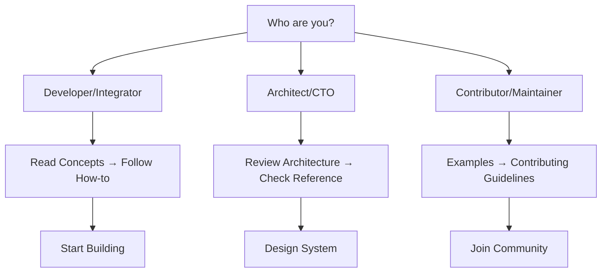

# Diátaxis Documentation System for erlmcp

A comprehensive documentation framework following the Diátaxis methodology, designed to guide developers through understanding, implementing, and optimizing erlmcp - the Erlang/OTP MCP SDK.

## 📚 What You'll Find

### 🎯 For Every User Type
- **Beginners**: Start with [Concepts](docs/explain/README.md) to understand what erlmcp is
- **Implementers**: Follow [How-to Guides](docs/howto/README.md) to build integrations
- **Experts**: Reference [Technical Documentation](docs/reference/README.md) for advanced usage
- **Contributors**: Check [Appendices](docs/appendices/README.md) for examples and resources

### 🏗️ Architecture Overview

The documentation follows the Diátaxis methodology with four distinct categories:

1. **Explain** → Why does this exist?
2. **How-to** → How do I accomplish a task?
3. **Reference** → What are the technical details?
4. **Tutorials** → Step-by-step learning paths

## 🚀 Quick Start

### For New Users
```markdown
1. Read [Concepts](docs/explain/introduction.md) → Understand erlmcp
2. Follow [Getting Started](docs/howto/getting-started.md) → Build your first integration
3. Explore [Examples](docs/appendices/examples.md) → See real implementations
```

### For Experienced Developers
```markdown
1. Browse [Reference](docs/reference/api-reference.md) → Technical details
2. Check [Performance](docs/howto/performance-optimization.md) → Optimize your setup
3. Review [Architecture](docs/explain/architecture.md) → Deep dive
```

## 📖 Navigation Guide

### Main Sections

| Section | Purpose | Audience | Best For |
|---------|---------|----------|----------|
| **[Explain](docs/explain/)** | Concepts, principles, architecture | Everyone | Understanding why |
| **[How-to](docs/howto/)** | Task-oriented tutorials | Implementers | Getting things done |
| **[Reference](docs/reference/)** | Technical specifications | Experts | Looking up details |
| **[Appendices](docs/appendices/)** | Examples, resources, glossary | Everyone | Additional context |

### Case Studies Integration
Real-world examples are integrated throughout:
- **GCP Integration**: See [how erlmcp integrates with Google Cloud](docs/howto/gcp-integration.md)
- **Performance Tuning**: Learn from [production optimization cases](docs/howto/performance-case-study.md)
- **Enterprise Deployment**: Discover [large-scale patterns](docs/exprise/enterprise-deployment.md)

## 🔗 Quick Links

### Essential Reading
- [Introduction to erlmcp](docs/explain/introduction.md)
- [Getting Started Guide](docs/howto/getting-started.md)
- [API Reference](docs/reference/api-reference.md)
- [Installation Guide](docs/howto/installation.md)

### Advanced Topics
- [Architecture Deep Dive](docs/explain/architecture.md)
- [Performance Optimization](docs/howto/performance-optimization.md)
- [Security Best Practices](docs/reference/security.md)
- [Troubleshooting Guide](docs/reference/troubleshooting.md)

### Resources
- [Code Examples](docs/appendices/examples.md)
- [Glossary](docs/appendices/glossary.md)
- [Community](docs/appendices/community.md)
- [Contributing](docs/appendices/contributing.md)

## 📋 Documentation Quality

All documentation adheres to:
- ✅ Diátaxis methodology principles
- ✅ Clear audience targeting
- ✅ Practical examples and code samples
- ✅ Cross-references and navigation
- ✅ Regular maintenance and updates

## 🔄 Updates and Maintenance

This documentation is actively maintained:
- **Last Updated**: January 2026
- **Version**: erlmcp v0.6.0
- **Next Review**: April 2026

---

## 🎯 Next Steps

Choose your path based on your needs:



**Get Started**: [Begin with the Introduction](docs/explain/introduction.md)