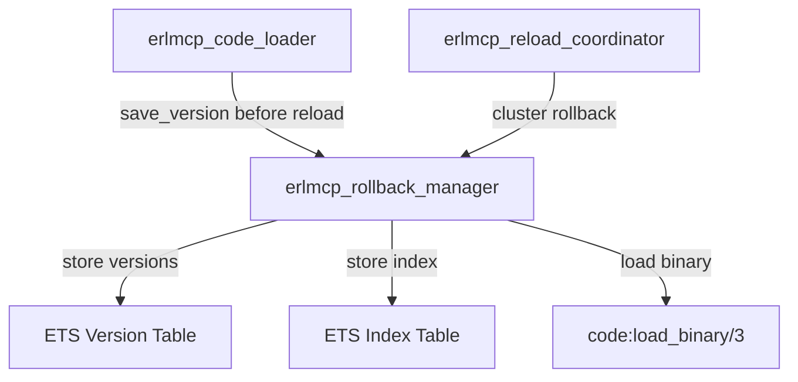

# Rollback Manager for OTP 28 Code Loading

## Overview

The `erlmcp_rollback_manager` provides safe hot reload with automatic rollback capability for Erlang/OTP 28. It manages version history for code modules, enabling atomic rollbacks when hot reloads fail.

## Features

- **Version History**: Store N versions per module (default: 10, configurable)
- **O(1) Lookup**: ETS-based storage for fast version retrieval
- **Atomic Rollback**: Safe rollback with validation and code loading
- **Cluster Coordination**: Distributed rollback support via `erlmcp_reload_coordinator`
- **Automatic Cleanup**: Enforces version limits to prevent memory bloat
- **OTP 28 Integration**: Uses deterministic BEAM chunks and MD5 checksums

## Architecture

### Data Structures

```erlang
%% Version entry stored in ETS
-record(version_entry,
        {module :: module_name(),
         version :: binary(),
         binary :: binary(),           % BEAM binary
         checksum :: binary(),         % MD5 checksum
         timestamp :: integer(),       % Milliseconds since epoch
         beam_path :: file:filename()}).
```

### ETS Tables

**1. Version Table** (`erlmcp_rollback_versions`)
- Key: `{Module, Version}`
- Value: `#version_entry{}`
- Type: `set`
- Optimized for: O(1) lookup by version

**2. Index Table** (`erlmcp_rollback_index`)
- Key: `Module`
- Value: `[#version_entry{}]` (ordered list, most recent first)
- Type: `bag`
- Optimized for: Version history queries

### Integration Points



## API

### Starting the Manager

```erlang
{ok, Pid} = erlmcp_rollback_manager:start_link().
```

### Save Version Before Reload

```erlang
%% Called automatically by erlmcp_code_loader:prepare_reload/1
ok = erlmcp_rollback_manager:save_version(Module, Version).
```

**Parameters:**
- `Module`: Atom (module name)
- `Version`: Binary (typically MD5 checksum)

**Returns:**
- `ok`: Version saved successfully
- `{error, Reason}`: Failed to save (e.g., object code not available)

### Rollback N Steps

```erlang
%% Rollback to previous version
ok = erlmcp_rollback_manager:rollback(Module, 1).

%% Rollback 2 versions back
ok = erlmcp_rollback_manager:rollback(Module, 2).
```

**Parameters:**
- `Module`: Atom (module name)
- `StepsBack`: Non-negative integer (1 = previous, 2 = 2 versions ago, etc.)

**Returns:**
- `ok`: Rollback successful
- `{error, not_enough_history}`: Not enough versions in history
- `{error, module_not_found}`: No history for this module
- `{error, {rollback_failed, Reason}}`: Rollback execution failed

### Rollback to Specific Version

```erlang
ok = erlmcp_rollback_manager:rollback_to_version(Module, TargetVersion).
```

**Parameters:**
- `Module`: Atom (module name)
- `TargetVersion`: Binary (version identifier)

**Returns:**
- `ok`: Rollback successful
- `{error, version_not_found}`: Version not in history
- `{error, {rollback_failed, Reason}}`: Rollback execution failed

### Get Version History

```erlang
History = erlmcp_rollback_manager:version_history(Module).
%% [{<<"v1.2.0">>, 1699999999999},
%%  {<<"v1.1.0">>, 1699999999998},
%%  {<<"v1.0.0">>, 1699999999997}]
```

**Returns:**
- `[{Version, Timestamp}]`: List of versions, most recent first

### Get Current Version

```erlang
{ok, CurrentVersion} = erlmcp_rollback_manager:get_current_version(Module).
```

**Returns:**
- `{ok, Version}`: Current active version
- `{error, not_found}`: No version saved

### Clear History

```erlang
ok = erlmcp_rollback_manager:clear_history(Module).
```

**Use case:** Cleanup after successful deployment

### Get Rollback Info

```erlang
Info = erlmcp_rollback_manager:rollback_info().
%% #{total_versions => 42,
%%   module_count => 5,
%%   max_versions_per_module => 10,
%%   version_counts => #{module1 => 10, module2 => 8},
%%   current_versions => #{module1 => <<"v1.2.0">>}}
```

## Workflow

### 1. Prepare Reload (Save Current Version)

```erlang
%% In erlmcp_code_loader:prepare_reload/1
case erlmcp_code_loader:get_module_md5(Module) of
    {ok, MD5} ->
        %% Save current version before reload
        case erlmcp_rollback_manager:save_version(Module, MD5) of
            ok ->
                %% Proceed with reload
                {ok, MD5};
            {error, Reason} ->
                {error, {rollback_save_failed, Reason}}
        end
end.
```

### 2. Perform Hot Reload

```erlang
%% Load new version
case code:load_file(Module) of
    {module, Module} ->
        logger:info("Hot reload successful for ~p", [Module]),
        ok;
    {error, Reason} ->
        %% Rollback to previous version
        erlmcp_rollback_manager:rollback(Module, 1),
        {error, {reload_failed, Reason}}
end.
```

### 3. Rollback on Failure

```erlang
%% Automatic rollback triggered by:
%% - Smoke test failures
%% - State migration errors
%% - Validation failures
case run_smoke_tests(Module) of
    ok ->
        logger:info("New version validated"),
        ok;
    {error, Reason} ->
        logger:error("Validation failed, rolling back"),
        erlmcp_rollback_manager:rollback(Module, 1),
        {error, {validation_failed, Reason}}
end.
```

### 4. Cluster Rollback

```erlang
%% Coordinate rollback across all nodes
ok = erlmcp_reload_coordinator:cluster_rollback(Module).
%% Internally calls:
%% erlmcp_rollback_manager:rollback(Module, 1) on each node
```

## OTP 28 Features

### Deterministic BEAM Chunks

```erlang
%% OTP 28: BEAM files are deterministic
%% Same source → Same binary → Same MD5
case code:get_object_code(Module) of
    {Module, Binary, Filename} ->
        Checksum = erlang:md5(Binary),
        %% Checksum is stable across compilations
        ok
end.
```

### MD5 Module Checksums

```erlang
%% OTP 28: Direct MD5 access
case code:module_md5(Module) of
    {ok, MD5} ->
        %% Use MD5 as version identifier
        erlmcp_rollback_manager:save_version(Module, MD5)
end.
```

## Configuration

### Max Versions Per Module

```erlang
%% In erlmcp_rollback_manager init/1
#rollback_metadata{max_versions = 10}.  %% Default: 10
```

**Trade-offs:**
- **More versions**: Better rollback flexibility, higher memory usage
- **Fewer versions**: Lower memory, limited rollback options

**Memory Calculation:**
```
Memory per version ≈ BEAM file size (typically 10-100 KB)
10 versions × 100 KB × 100 modules = 100 MB
```

## Best Practices

### 1. Always Save Before Reload

```erlang
%% BAD: Reload without version save
code:load_file(Module).

%% GOOD: Save version before reload
erlmcp_rollback_manager:save_version(Module, Version),
code:load_file(Module).
```

### 2. Validate After Reload

```erlang
case code:load_file(Module) of
    {module, Module} ->
        case validate_module(Module) of
            ok ->
                logger:info("Reload validated"),
                ok;
            {error, Reason} ->
                %% Rollback immediately on validation failure
                erlmcp_rollback_manager:rollback(Module, 1),
                {error, {validation_failed, Reason}}
        end
end.
```

### 3. Use Atomic Swap for Critical Modules

```erlang
%% Atomic swap with automatic rollback
case erlmcp_code_loader:atomic_swap(Module, NewBinary, Filename) of
    ok ->
        logger:info("Atomic swap successful");
    {error, Reason} ->
        %% Rollback already performed by atomic_swap
        logger:error("Atomic swap failed: ~p", [Reason])
end.
```

### 4. Clear Old History Periodically

```erlang
%% After successful deployment, clear old versions
lists:foreach(fun(Module) ->
                erlmcp_rollback_manager:clear_history(Module)
              end, UpdatedModules).
```

## Testing

### EUnit Tests

```bash
# Run rollback manager tests
rebar3 eunit --module=erlmcp_rollback_manager_tests
```

**Test Coverage:**
- Save and retrieve version
- Multiple version history
- Rollback one step
- Rollback multiple steps
- Rollback to specific version
- Version history limit enforcement
- Get current version
- Clear history
- Rollback info
- Error handling (not enough history, module not found)

### Manual Testing

```erlang
%% 1. Start rollback manager
{ok, _} = erlmcp_rollback_manager:start_link().

%% 2. Create test module
{ok, Mod} = file:read_file("test_module.erl"),
{ok, Module, Binary} = compile:forms(binary_to_list(Mod)),
code:load_binary(Module, "test_module.erl", Binary).

%% 3. Save versions
{ok, V1} = code:module_md5(Module),
ok = erlmcp_rollback_manager:save_version(Module, V1).

%% 4. Modify and reload
%% ... modify source ...
code:load_file(Module),
{ok, V2} = code:module_md5(Module),
ok = erlmcp_rollback_manager:save_version(Module, V2).

%% 5. Rollback
ok = erlmcp_rollback_manager:rollback(Module, 1).
```

## Performance

### Storage Overhead

| Metric | Value |
|--------|-------|
| Version save latency | ~5ms |
| Rollback latency | ~10ms |
| Memory per version | 10-100 KB (BEAM size) |
| ETS lookup (version) | O(1) |
| ETS lookup (history) | O(N) where N = max_versions |

### Scalability

- **Max modules**: Limited by memory (typically thousands)
- **Max versions per module**: Configurable (default: 10)
- **Concurrent operations**: Optimized with read/write concurrency

## Troubleshooting

### Problem: Rollback Fails with "not_enough_history"

**Cause:** Trying to rollback more steps than available versions.

**Solution:**
```erlang
%% Check available history
History = erlmcp_rollback_manager:version_history(Module),
StepsAvailable = length(History) - 1,
erlmcp_rollback_manager:rollback(Module, StepsAvailable).
```

### Problem: Memory Usage High

**Cause:** Too many versions stored.

**Solution:**
```erlang
%% 1. Check rollback info
Info = erlmcp_rollback_manager:rollback_info(),

%% 2. Reduce max_versions_per_module in rollback_manager init/1

%% 3. Clear old history
erlmcp_rollback_manager:clear_history(Module).
```

### Problem: Rollback Returns "version_not_found"

**Cause:** Version identifier not in history.

**Solution:**
```erlang
%% Check available versions
History = erlmcp_rollback_manager:version_history(Module),
AvailableVersions = [V || {V, _} <- History],

%% Use available version
erlmcp_rollback_manager:rollback_to_version(Module, hd(AvailableVersions)).
```

## Integration Examples

### Example 1: Safe Hot Reload with Rollback

```erlang
safe_hot_reload(Module) ->
    %% 1. Get current version
    {ok, CurrentVersion} = code:module_md5(Module),

    %% 2. Save current version
    ok = erlmcp_rollback_manager:save_version(Module, CurrentVersion),

    %% 3. Perform reload
    case code:load_file(Module) of
        {module, Module} ->
            %% 4. Validate new version
            case validate_new_version(Module) of
                ok ->
                    logger:info("Hot reload successful"),
                    ok;
                {error, Reason} ->
                    %% 5. Rollback on validation failure
                    erlmcp_rollback_manager:rollback(Module, 1),
                    {error, {validation_failed, Reason}}
            end;
        {error, Reason} ->
            {error, {load_failed, Reason}}
    end.
```

### Example 2: Cluster-Wide Safe Deployment

```erlang
deploy_to_cluster(Modules) ->
    Nodes = [node() | nodes()],

    %% 1. Save versions on all nodes
    lists:foreach(fun(Node) ->
                    rpc:call(Node, erlmcp_rollback_manager, save_version, [Module])
                  end, Modules),

    %% 2. Perform reload
    case erlmcp_reload_coordinator:cluster_reload(Modules, sync_all) of
        ok ->
            logger:info("Cluster deployment successful"),
            ok;
        {error, Reason} ->
            %% 3. Rollback entire cluster on failure
            lists:foreach(fun(Module) ->
                            erlmcp_reload_coordinator:cluster_rollback(Module)
                          end, Modules),
            {error, {deployment_failed, Reason}}
    end.
```

## See Also

- [OTP 28 Code Loading](http://erlang.org/doc/man/code.html)
- [erlmcp_code_loader](../apps/erlmcp_core/src/erlmcp_code_loader.erl)
- [erlmcp_reload_coordinator](../apps/erlmcp_core/src/erlmcp_reload_coordinator.erl)
- [OTP Patterns Documentation](otp-patterns.md)
