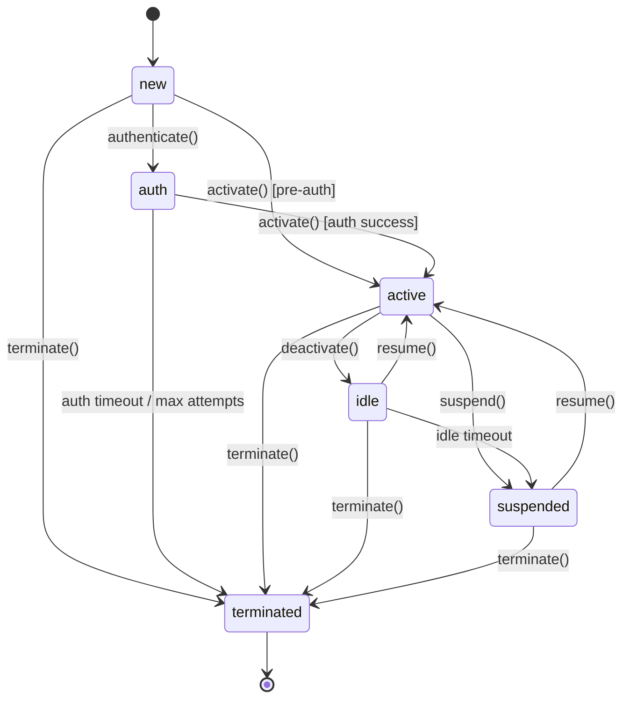

# Session State Machine for erlmcp v3

## Overview

The erlmcp v3 session management system provides enterprise-grade session lifecycle management with comprehensive state transitions, resource isolation, rate limiting, and audit logging.

## Architecture

```
┌─────────────────────────────────────────────────────────────┐
│                  erlmcp_session_statem                      │
│              (Session State Machine Core)                   │
├─────────────────────────────────────────────────────────────┤
│                                                              │
│  ┌──────────────────────────────────────────────────┐      │
│  │           State Transitions                       │      │
│  │  ┌────┐    ┌────┐    ┌────┐    ┌────┐           │      │
│  │  │new │───▶│auth│───▶│active│───▶│idle│           │      │
│  │  └────┘    └────┘    └────┘    └────┘           │      │
│  │     │          │         │         │             │      │
│  │     │          │         │         │             │      │
│  │     │          │         │         │             │      │
│  │     ▼          ▼         ▼         ▼             │      │
│  │  ┌─────────────────────────────────────┐        │      │
│  │  │         terminated                   │        │      │
│  │  └─────────────────────────────────────┘        │      │
│  │                                                    │      │
│  │  ┌─────────────────────────────────────┐         │      │
│  │  │         suspended                     │         │      │
│  │  │     (from active/idle)               │         │      │
│  │  └─────────────────────────────────────┘         │      │
│  └──────────────────────────────────────────────────┘      │
│                                                              │
├─────────────────────────────────────────────────────────────┤
│                   Supporting Modules                        │
│                                                              │
│  ┌──────────────────┐  ┌──────────────────┐               │
│  │ Session Isolation│  │  Rate Limiter    │               │
│  │   - Resource     │  │  - Token Bucket  │               │
│  │     Quotas       │  │  - Throttling    │               │
│  │   - Memory Guards│  │  - Priority      │               │
│  └──────────────────┘  └──────────────────┘               │
│                                                              │
│  ┌──────────────────┐  ┌──────────────────┐               │
│  │  Session Reaper  │  │   Audit Logger   │               │
│  │  - Auto Cleanup  │  │  - Compliance    │               │
│  │  - GC Triggering │  │  - Tamper-Evident│               │
│  └──────────────────┘  └──────────────────┘               │
│                                                              │
└─────────────────────────────────────────────────────────────┘
```

## Session States

### 1. `new`
- **Purpose**: Initial state for newly created sessions
- **Entry Actions**: Initialize session data, set creation timestamp
- **Valid Transitions**:
  - `new` → `auth`: Authenticate with credentials
  - `new` → `active`: Pre-authenticated activation
  - `new` → `terminated`: Immediate termination
- **Guards**: Auth required check

### 2. `auth`
- **Purpose**: Authentication in progress
- **Entry Actions**: Start auth timeout (30s default)
- **Valid Transitions**:
  - `auth` → `active`: Authentication successful
  - `auth` → `terminated`: Auth timeout or max attempts exceeded
- **Timeouts**:
  - Auth timeout: 30s (configurable)
  - Max attempts: 3 (configurable)

### 3. `active`
- **Purpose**: Session actively processing requests
- **Entry Actions**: Start idle timeout, enable resource tracking
- **Valid Transitions**:
  - `active` → `idle`: Deactivate (no activity)
  - `active` → `suspended`: Suspend (admin action or rate limit)
  - `active` → `terminated`: Terminate
- **Features**:
  - Resource quota enforcement
  - Rate limiting
  - Metrics collection
  - Event subscriptions

### 4. `idle`
- **Purpose**: Session temporarily inactive
- **Entry Actions**: Start idle timeout
- **Valid Transitions**:
  - `idle` → `active`: Resume activity
  - `idle` → `suspended`: Idle timeout
  - `idle` → `terminated`: Terminate
- **Timeouts**:
  - Idle timeout: 5 minutes (configurable)

### 5. `suspended`
- **Purpose**: Session suspended (admin action, rate limit, or error)
- **Entry Actions**: Stop idle timeout, preserve state
- **Valid Transitions**:
  - `suspended` → `active`: Resume
  - `suspended` → `terminated`: Terminate
- **Features**:
  - State preserved
  - Migration allowed
  - No resource consumption

### 6. `terminated`
- **Purpose**: Session terminated
- **Entry Actions**: Cleanup all resources, notify subscribers
- **Valid Transitions**: None (terminal state)
- **Cleanup**:
  - Remove from backend storage
  - Force garbage collection
  - Unsubscribe all observers
  - Emit audit event

## State Transition Diagram



## API Reference

### Starting Sessions

```erlang
%% Start with defaults
{ok, Pid} = erlmcp_session_statem:start_link(<<"session_123">>, #{}).

%% Start with options
{ok, Pid} = erlmcp_session_statem:start_link(<<"session_123">>,
    #{idle_timeout_ms => 300000,
      auth_timeout_ms => 30000,
      persistent => true,
      backend => erlmcp_session_ets}).
```

### State Transitions

```erlang
%% Initialize
{ok, new} = erlmcp_session_statem:init_session(Pid, #{metadata => #{}}).

%% Authenticate
{ok, auth} = erlmcp_session_statem:authenticate(Pid,
    #{authenticated => true,
      user_id => <<"user_123">>}).

%% Activate
{ok, active} = erlmcp_session_statem:activate(Pid).

%% Deactivate
{ok, idle} = erlmcp_session_statem:deactivate(Pid).

%% Resume
{ok, active} = erlmcp_session_statem:resume(Pid).

%% Suspend
{ok, suspended} = erlmcp_session_statem:suspend(Pid).

%% Terminate
ok = erlmcp_session_statem:terminate(Pid).
```

### Resource Management

```erlang
%% Set quota
ok = erlmcp_session_statem:set_quota(Pid,
    #{max_requests => 1000,
      max_connections => 10,
      max_message_size => 10485760}).

%% Check quota
{ok, true, #{}} = erlmcp_session_statem:check_quota(Pid).

%% Update resources
ok = erlmcp_session_statem:update_resources(Pid,
    #{requests => 100,
      connections => 2}).
```

### Query Functions

```erlang
%% Get current state
{ok, active} = erlmcp_session_statem:get_state(Pid).

%% Get session info
{ok, Info} = erlmcp_session_statem:get_info(Pid).
%% Info = #{session_id => ..., state => ..., created_at => ..., ...}

%% Get metrics
{ok, Metrics} = erlmcp_session_statem:get_metrics(Pid).
%% Metrics = #{session_age_ms => ..., state_duration_ms => ..., ...}
```

### Persistence

```erlang
%% Persist session
ok = erlmcp_session_statem:persist(Pid).

%% Load session
ok = erlmcp_session_statem:load(Pid, SerializedData).
```

### Event Subscriptions

```erlang
%% Subscribe to events
ok = erlmcp_session_statem:subscribe(Pid, self()).

%% Unsubscribe
ok = erlmcp_session_statem:unsubscribe(Pid, self()).

%% Receive events
receive
    {session_event, SessionId, Event} ->
        %% Handle event
        ok
end.
```

## Session Isolation

### Resource Quotas

```erlang
%% Create isolated session
{ok, Pid} = erlmcp_session_isolation:create_session(<<"session_123">>,
    #{memory_limit => 104857600,  % 100MB
      cpu_limit => 80.0,           % 80%
      message_limit => 10000,
      connection_limit => 10,
      isolated => true}).

%% Get resource usage
{ok, Usage} = erlmcp_session_isolation:get_resource_usage(<<"session_123">>).
%% Usage = #{memory => #{used => ..., limit => ...},
%%           cpu => #{used => ..., limit => ...},
%%           messages => #{count => ..., limit => ...},
%%           connections => #{count => ..., limit => ...}}

%% Check limits
{ok, WithinLimits, Violations} =
    erlmcp_session_isolation:check_resource_limits(<<"session_123">>).
```

### Memory Guards

Memory guards prevent runaway memory consumption:

- **Soft limit**: Warning and throttling
- **Hard limit**: Process termination

```erlang
%% Set memory limit
ok = erlmcp_session_isolation:set_memory_limit(<<"session_123">>,
    104857600).  % 100MB
```

## Rate Limiting

### Token Bucket Algorithm

```erlang
%% Set quota
ok = erlmcp_session_rate_limiter:set_quota(<<"session_123">>,
    #{capacity => 1000,
      rate => 10.0,  % 10 tokens/second
      window => 60000}).

%% Check rate limit
{ok, Allowed, WaitTime} =
    erlmcp_session_rate_limiter:check_rate_limit(<<"session_123">>,
                                               requests,
                                               1).

%% Record request
ok = erlmcp_session_rate_limiter:record_request(<<"session_123">>,
                                               requests,
                                               1).

%% Get usage
{ok, Usage} = erlmcp_session_rate_limiter:get_usage(<<"session_123">>,
                                                   requests).
%% Usage = #{tokens_used => ..., tokens_remaining => ...,
%%           utilization_pct => ...}
```

### Throttling

```erlang
%% Check if throttled
{ok, IsThrottled} =
    erlmcp_session_rate_limiter:check_throttle(<<"session_123">>).

%% Apply throttle action
ok = erlmcp_session_rate_limiter:apply_throttle(<<"session_123">>,
                                               drop).  % or delay, queue, reject
```

## Session Cleanup

### Reaper Configuration

```erlang
%% Start reaper
{ok, ReaperPid} = erlmcp_session_reaper:start_link(
    #{interval_ms => 60000,      % 1 minute
      policy => idle_timeout,
      idle_threshold_ms => 1800000}).  % 30 minutes

%% Manual reap
{ok, Count} = erlmcp_session_reaper:reap(all).

%% Set policy
ok = erlmcp_session_reaper:set_policy(expired, #{}).

%% Pause/resume
ok = erlmcp_session_reaper:pause().
ok = erlmcp_session_reaper:resume().

%% Get stats
{ok, Stats} = erlmcp_session_reaper:get_stats().
```

### Cleanup Policies

- **`idle_timeout`**: Reap sessions idle > threshold
- **`expired`**: Reap sessions past timeout
- **`orphaned`**: Reap sessions with dead process
- **`all`**: Reap all sessions
- **`custom`**: Custom filter function

## Audit Logging

### Event Logging

```erlang
%% Log state transition
ok = erlmcp_session_audit:log_state_transition(<<"session_123">>,
                                               new,
                                               active,
                                               #{reason => auth_success}).

%% Log auth event
ok = erlmcp_session_audit:log_auth_event(<<"session_123">>,
                                         <<"login">>,
                                         #{user_id => <<"user_456">>}).

%% Log resource event
ok = erlmcp_session_audit:log_resource_event(<<"session_123">>,
                                             <<"memory">>,
                                             #{used => 52428800,
                                               limit => 104857600}).

%% Log error
ok = erlmcp_session_audit:log_error(<<"session_123">>,
                                    <<"Authentication failed">>,
                                    {invalid_credentials, <<"...">>}).
```

### Querying Events

```erlang
%% Query events by session
{ok, Events} = erlmcp_session_audit:get_session_events(<<"session_123">>).

%% Query by type
{ok, Events} = erlmcp_session_audit:query_events(<<"session_123">>,
                                                 state_transition,
                                                 100).

%% Get events by type across all sessions
{ok, Events} = erlmcp_session_audit:get_events_by_type(auth,
                                                         1000).
```

### Compliance Reporting

```erlang
%% Generate JSON report
{ok, Report} = erlmcp_session_audit:generate_report(<<"session_123">>,
    #{format => json,
      include_data => true}).

%% Export to file
ok = erlmcp_session_audit:export_events(<<"session_123">>,
                                        <<"audit_2025_01_15.json">>,
                                        #{format => json}).

%% Get stats
{ok, Stats} = erlmcp_session_audit:get_stats().
%% Stats = #{total_events => ..., events_by_type => ...}
```

## Monitoring and Metrics

### Session Metrics

```erlang
{ok, Metrics} = erlmcp_session_statem:get_metrics(Pid).
%% Metrics = #{
%%   session_age_ms => 3600000,
%%   state_duration_ms => 3000000,
%%   idle_time_ms => 60000,
%%   auth_attempts => 1,
%%   quota_utilization => #{
%%     max_requests => 15.0,
%%     max_connections => 20.0,
%%     max_message_size => 0.0
%%   }
%% }.
```

### Rate Limiter Stats

```erlang
{ok, Stats} = erlmcp_session_rate_limiter:get_stats().
%% Stats = #{
%%   total_sessions => 100,
%%   throttled_sessions => 5,
%%   window_start => ...,
%%   global_quota => true
%% }.
```

### Reaper Stats

```erlang
{ok, Stats} = erlmcp_session_reaper:get_stats().
%% Stats = #{
%%   total_reaped => 50,
%%   last_reap_at => ...,
%%   last_reap_count => 5,
%%   interval_ms => 60000,
%%   paused => false
%% }.
```

## OTP Compliance

All session management modules follow Erlang/OTP best practices:

### gen_statem (erlmcp_session_statem)
- ✅ All 6 callbacks implemented
- ✅ `handle_event_function` mode for priority messages
- ✅ `state_enter_calls` for state entry actions
- ✅ No blocking operations in `init/1`
- ✅ Proper supervision tree integration
- ✅ Code change support via `code_change/4`

### gen_server (erlmcp_session_isolation, rate_limiter, reaper, audit)
- ✅ All 6 callbacks implemented
- ✅ 5000ms call timeout
- ✅ No blocking operations in `init/1`
- ✅ Proper resource cleanup in `terminate/2`
- ✅ Supervised by appropriate supervisors

### Supervision
```
erlmcp_sup
  └─ erlmcp_core_sup
      ├─ erlmcp_session_isolation
      ├─ erlmcp_session_rate_limiter
      ├─ erlmcp_session_reaper
      ├─ erlmcp_session_audit
      └─ erlmcp_session_sup
          └─ erlmcp_session_statem (simple_one_for_one)
```

## Testing

### EUnit Tests
```bash
# Run all session tests
rebar3 eunit --module=erlmcp_session_statem_tests

# Run specific test
rebar3 eunit --module=erlmcp_session_statem_tests -t new_state_test_

# With coverage
rebar3 cover
```

### Common Test
```bash
# Run integration tests
rebar3 ct --suite=test/session_SUITE

# Run specific test case
rebar3 ct --suite=test/session_SUITE --testcase=state_transitions
```

## Performance Considerations

### Memory Optimization
- Session hibernation after 30s idle
- ETS tables with `{read_concurrency, true}` and `{write_concurrency, true}`
- Periodic garbage collection via reaper

### Scalability
- Process-per-session isolation
- O(log N) session lookups via gproc
- Asynchronous operations where possible

### Throughput
- Token bucket rate limiting (O(1) per request)
- ETS-based audit log (O(1) writes, O(N) queries)
- Parallel session reaping

## Security

### Resource Isolation
- Per-session memory limits
- CPU quotas
- Connection limits
- Message size limits

### Audit Trail
- Tamper-evident logging
- Digital signatures (TODO)
- Immutable event records
- Compliance reporting

### Access Control
- State transition guards
- Auth attempt limits
- Session termination on violation

## Configuration

### Session Options
```erlang
#{idle_timeout_ms => 300000,          % 5 minutes
  auth_timeout_ms => 30000,           % 30 seconds
  max_auth_attempts => 3,
  memory_limit_bytes => 104857600,    % 100MB
  persistent => false,
  backend => erlmcp_session_ets,
  migration_allowed => false,
  guards => #{auth_required => true,
              resume_allowed => true}}.
```

### Isolation Options
```erlang
#{max_memory => 1073741824,           % 1GB
  max_cpu => 80.0,                    % 80%
  max_messages => 100000,
  max_connections => 1000,
  cleanup_interval => 60000}.          % 1 minute
```

### Rate Limiter Options
```erlang
#{global_quota_enabled => false,
  global_capacity => 1000,
  global_rate => 10.0,
  cleanup_interval => 300000}.         % 5 minutes
```

### Reaper Options
```erlang
#{interval_ms => 60000,               % 1 minute
  policy => idle_timeout,
  idle_threshold_ms => 1800000}.       % 30 minutes
```

### Audit Options
```erlang
#{retention_days => 30,
  max_events => 1000000}.
```

## Troubleshooting

### Common Issues

1. **Session stuck in `auth` state**
   - Check auth timeout (default 30s)
   - Verify auth context is valid
   - Check max auth attempts

2. **High memory usage**
   - Adjust session isolation limits
   - Enable more aggressive reaping
   - Check for resource leaks

3. **Rate limiting too aggressive**
   - Increase token capacity
   - Adjust refill rate
   - Check token bucket window

4. **Audit log growing too large**
   - Reduce retention period
   - Lower max_events limit
   - Enable more frequent cleanup

## Future Enhancements

- [ ] Digital signatures for audit logs
- [ ] Distributed session migration
- [ ] Machine learning for anomaly detection
- [ ] Real-time dashboard integration
- [ ] Automatic backpressure propagation
- [ ] Session state compression for persistence

## References

- [OTP Design Principles](https://www.erlang.org/doc/design_principles/des_princ.html)
- [gen_statem Behavior](https://www.erlang.org/doc/man/gen_statem.html)
- [Joe Armstrong's Thesis](http://www.erlang.se/documentation/ericsson-thesis.ps)
- [erlmcp OTP Patterns](/Users/sac/erlmcp/docs/otp-patterns.md)
