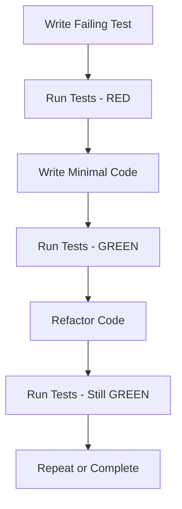

# SPARC Methodology: A Systematic Approach to Software Development

## Table of Contents
1. [What is SPARC?](#what-is-sparc)
2. [The Iterative Nature of SPARC](#the-iterative-nature-of-sparc)
3. [SPARC and Test-Driven Development](#sparc-and-test-driven-development)
4. [Practical Developer Workflow](#practical-developer-workflow)
5. [Key Benefits and Patterns](#key-benefits-and-patterns)
6. [Common Pitfalls to Avoid](#common-pitfalls-to-avoid)
7. [Code Example: The SPARC Progression](#code-example-the-sparc-progression)
8. [Best Practices](#best-practices)
9. [Tools and Resources](#tools-and-resources)

---

## What is SPARC?

SPARC is a systematic methodology for software development that provides a structured approach to building robust, maintainable systems. The acronym stands for:

- **S** - Specification: Understanding requirements and defining the problem space
- **P** - Pseudocode: Designing algorithms and logic without implementation details
- **A** - Architecture: Creating the overall system structure and component relationships
- **R** - Refinement: Implementing the solution with Test-Driven Development
- **C** - Completion: Integrating, testing, and deploying the final solution

### Core Philosophy

SPARC is built on the principle that **clarity at each phase leads to better outcomes**. By separating concerns into distinct phases, developers can focus on one aspect at a time, reducing cognitive load and increasing the quality of each decision.

### The Five Phases in Detail

#### 1. Specification Phase
**Goal**: Thoroughly understand the problem and requirements
**Activities**:
- Stakeholder interviews and requirements gathering
- Use case analysis
- Defining success criteria
- Identifying constraints and assumptions
- Risk assessment

**Outputs**:
- Clear problem statement
- Acceptance criteria
- Requirements document
- Success metrics

#### 2. Pseudocode Phase
**Goal**: Design the algorithmic solution without implementation bias
**Activities**:
- Breaking down problems into logical steps
- Creating flowcharts or decision trees
- Writing human-readable algorithm descriptions
- Considering edge cases and error scenarios
- Optimizing the logical flow

**Outputs**:
- Detailed pseudocode
- Algorithm documentation
- Decision trees
- Data flow diagrams

#### 3. Architecture Phase
**Goal**: Design the overall system structure
**Activities**:
- Component decomposition
- Interface definitions
- Data modeling
- Technology selection
- Scalability and performance considerations

**Outputs**:
- System architecture diagrams
- Component specifications
- API contracts
- Technology stack documentation

#### 4. Refinement Phase
**Goal**: Implement the solution using Test-Driven Development
**Activities**:
- Writing failing tests first
- Implementing code to make tests pass
- Refactoring to improve design
- Continuous integration and testing

**Outputs**:
- Production-ready code
- Comprehensive test suite
- Code documentation
- Build and deployment scripts

#### 5. Completion Phase
**Goal**: Ensure the solution meets all requirements and is ready for production
**Activities**:
- End-to-end testing
- Performance validation
- Security review
- Deployment planning
- Documentation completion

**Outputs**:
- Deployable system
- User documentation
- Maintenance guides
- Post-mortem and lessons learned

---

## The Iterative Nature of SPARC

SPARC is not a linear, waterfall process. It's inherently iterative, with each phase potentially requiring revisits to earlier phases.

### Iteration Cycles

#### Single Feature Iteration
```
Specification → Pseudocode → Architecture → Refinement → Completion
    ↑                                   ↓
    ←─────────── Feedback Loop ←───────────
```

#### Complex System Iteration
```
Overall Architecture
    ↓
┌─────────────────────────────────────────┐
│  Phase 1: Core Features                 │
│  S→P→A→R→C                              │
├─────────────────────────────────────────┤
│  Phase 2: Extended Features             │
│  S→P→A→R→C                              │
├─────────────────────────────────────────┤
│  Phase 3: Integration & Optimization     │
│  S→P→A→R→C                              │
└─────────────────────────────────────────┘
```

### Feedback Loops

**Within Phase**: Each phase has internal feedback mechanisms
- Specification: Stakeholder reviews
- Pseudocode: Peer review of logic
- Architecture: Technical feasibility assessment
- Refinement: Continuous testing feedback
- Completion: Quality assurance validation

**Between Phases**: Cross-phase validation ensures consistency
- Architecture must align with specifications
- Implementation must follow architecture
- Testing must validate requirements

### Adaptability to Project Size

**Small Projects**: Single SPARC cycle may suffice
**Medium Projects**: Multiple SPARC iterations per feature
**Large Projects**: Hierarchical SPARC with sub-system iterations

---

## SPARC and Test-Driven Development

SPARC provides a natural framework for Test-Driven Development (TDD) by clearly separating design from implementation.

### How SPARC Enables TDD

#### 1. Specification Phase → Test Design
The specification phase naturally leads to acceptance criteria, which become the basis for acceptance tests.

**Example**:
- *Specification*: "Users should be able to reset their password via email"
- *Acceptance Tests*:
  - Given a user exists
  - When they request a password reset
  - Then they should receive an email with a reset link

#### 2. Pseudocode Phase → Unit Test Structure
Pseudocode helps identify the atomic operations that need unit testing.

**Example**:
- *Pseudocode*:
  ```
  FUNCTION send_password_reset_email(user):
    IF user is valid:
      generate_reset_token()
      store_token_in_database()
      send_email_with_token()
      RETURN success
    ELSE:
      RETURN error
  ```

#### 3. Architecture Phase → Integration Test Strategy
Architecture decisions determine integration testing boundaries.

#### 4. Refinement Phase → Red-Green-Refactor
This is where TDD is explicitly implemented:
- **RED**: Write failing test
- **GREEN**: Write minimal code to pass test
- **REFACTOR**: Improve design without changing behavior

#### 5. Completion Phase → Full Test Suite
End-to-end testing, performance testing, and security testing.

### TDD in the Refinement Phase

The refinement phase is where TDD becomes concrete:



### Benefits of Combining SPARC with TDD

1. **Early Bug Detection**: Tests catch issues before they become embedded in code
2. **Better Design**: TDD encourages modular, testable code
3. **Living Documentation**: Tests serve as executable documentation
4. **Reduced Fear of Change**: Tests provide safety net for refactoring
5. **Continuous Validation**: Each phase validates decisions from previous phases

---

## Practical Developer Workflow

Here's a step-by-step guide for applying SPARC in your daily development work.

### Step 1: Setup and Preparation

**Prerequisites**:
- Version control repository
- Testing framework configured
- Build tools ready
- Documentation template

**Initial Setup**:
```bash
# Create project structure
mkdir my-project
cd my-project
mkdir {docs,src,tests,config}
git init

# Initialize development environment
git hooks install
npm install  # or appropriate package manager
```

### Step 2: Specification Phase (1-2 days)

**Activities**:
1. **Stakeholder Communication**
   - Interview product owners
   - Review existing requirements
   - Identify success metrics

2. **Requirements Documentation**
   - Write clear, unambiguous requirements
   - Define acceptance criteria
   - Identify edge cases

3. **Risk Assessment**
   - Technical risks
   - Resource constraints
   - Timeline considerations

**Deliverables**:
- `docs/requirements.md`
- `docs/success_criteria.md`
- `docs/risk_assessment.md`

### Step 3: Pseudocode Phase (2-3 days)

**Activities**:
1. **Algorithm Design**
   - Break down complex operations
   - Design error handling
   - Consider performance implications

2. **Flow Design**
   - Create flowcharts for user journeys
   - Design state machines
   - Map data flows

3. **Decision Logic**
   - Define business rules
   - Design validation logic
   - Plan error scenarios

**Deliverables**:
- `docs/pseudocode.md`
- `docs/flow_diagrams.md`
- `docs/decision_logic.md`

### Step 4: Architecture Phase (3-5 days)

**Activities**:
1. **Component Design**
   - Define modules and their responsibilities
   - Design interfaces
   - Plan data structures

2. **Technology Selection**
   - Choose appropriate frameworks
   - Select databases
   - Plan infrastructure

3. **Scalability Planning**
   - Design for growth
   - Plan for performance
   - Consider deployment strategy

**Deliverables**:
- `docs/architecture.md`
- `docs/component_specifications.md`
- `docs/api_contracts.md`
- `docs/deployment_plan.md`

### Step 5: Refinement Phase (1-2 weeks)

**Activities**:
1. **Test-Driven Implementation**
   - Write failing tests first
   - Implement minimal code
   - Refactor continuously

2. **Continuous Integration**
   - Automated testing
   - Code quality checks
   - Build verification

3. **Iterative Improvement**
   - Regular code reviews
   - Performance monitoring
   - Design adjustments

**Deliverables**:
- `src/` directory with production code
- `tests/` directory with comprehensive test suite
- `build/` directory with compiled artifacts
- Continuous integration configuration

### Step 6: Completion Phase (3-5 days)

**Activities**:
1. **End-to-End Testing**
   - System integration testing
   - User acceptance testing
   - Performance testing

2. **Quality Assurance**
   - Security review
   - Code documentation review
   - Deployment readiness check

3. **Final Documentation**
   - User guides
   - Technical documentation
   - Maintenance procedures

**Deliverables**:
- Deployable application
- Complete documentation
- Quality reports
- Post-mortem documentation

### Daily Work Integration

SPARC doesn't require a complete project overhaul. Here's how to integrate it into daily work:

#### Morning Standup (15 minutes)
- Review current phase progress
- Identify blockers
- Plan day's work within current phase

#### Before Starting a Feature (30 minutes)
- Quick specification clarification
- Pseudocode sketch for complex operations
- Architecture review if needed

#### During Implementation
- Test-driven approach for each component
- Continuous refactoring
- Regular integration builds

#### End of Day (15 minutes)
- Review day's progress against plan
- Update documentation
- Plan next day's work

---

## Key Benefits and Patterns

### Primary Benefits of SPARC

#### 1. Improved Code Quality
- **Focus on one thing at a time**: Each phase has a clear focus, reducing complexity
- **Early error detection**: Issues are caught in specification rather than implementation
- **Better design decisions**: Architecture phase allows for thoughtful design without implementation pressure

#### 2. Enhanced Developer Productivity
- **Reduced debugging time**: Clear specifications and thorough testing
- **Less rework**: Architecture phase prevents implementation mistakes
- **Better onboarding**: Clear documentation and structure

#### 3. Improved Team Collaboration
- **Shared understanding**: Common framework across team members
- **Clear expectations**: Each phase has defined deliverables
- **Better communication**: Structured approach to discussing progress

#### 4. Risk Mitigation
- **Early risk identification**: Specification and pseudocode phases
- **Technical feasibility**: Architecture phase validation
- **Quality assurance**: Comprehensive testing and validation

### Common SPARC Patterns

#### Pattern 1: Phase Review Gate
```
Phase Complete → Review Gate → Phase Complete
    ↓                ↓              ↓
  Deliverables   Validation    Next Phase
```

**Implementation**: Use pull requests or review meetings to validate each phase before proceeding.

#### Pattern 2: Spike and Follow
```
Spike (Research) → Specification → Refinement
   ↓                ↓              ↓
  Findings        Requirements   Implementation
```

**Implementation**: Use technical spikes to explore unknown areas before full specification.

#### Pattern 3: Feature Slice
```
Slice 1: Core → SPARC
Slice 2: Extended → SPARC
Slice 3: Advanced → SPARC
```

**Implementation**: Implement features in slices, applying full SPARC to each slice.

#### Pattern 4: Continuous Validation
```
Specification → Validate → Architecture → Validate → Refinement → Validate
```

**Implementation**: Automated validation checks at each phase boundary.

### Anti-Patterns to Avoid

#### 1. Skipping Phases
**Problem**: Rushing to implementation without proper specification
**Solution**: Enforce phase completion through review gates

#### 2. Excessive Perfectionism
**Problem**: Spending too much time on one phase
**Solution**: Set time limits for each phase, with review points

#### 3. Inconsistent Application
**Problem**: Using SPARC for some features but not others
**Solution**: Apply SPARC consistently across all features

#### 4. Neglecting Feedback
**Problem**: Not incorporating feedback from previous phases
**Solution**: Build regular feedback loops between phases

---

## Common Pitfalls to Avoid

### 1. Specification Pitfalls

#### Pitfall: Ambiguous Requirements
**Problem**: Vague specifications lead to misunderstandings
**Solution**: Use acceptance criteria with Given/When/Then format

**Bad**: "The user should be able to login"
**Good**:
```
Given a user exists with valid credentials
When they enter username and password
Then they should be logged in and redirected to dashboard
```

#### Pitfall: Goldplating
**Problem**: Over-engineering features that aren't needed
**Solution**: Implement only what's specified, defer enhancements

#### Pitfall: Stakeholder Disconnection
**Problem**: Building something stakeholders don't want
**Solution**: Regular stakeholder reviews throughout specification phase

### 2. Pseudocode Pitfalls

#### Pitfall: Implementation Details Too Early
**Problem**: Writing pseudocode with specific syntax or framework details
**Solution**: Focus on logic and operations, not implementation

**Bad**:
```python
def get_user_by_email(email):
    query = "SELECT * FROM users WHERE email = %s"
    cursor.execute(query, (email,))
    return cursor.fetchone()
```

**Good**:
```
FUNCTION get_user_by_email(email):
    IF email is valid:
        user = database.query("users", "email = email")
        RETURN user
    ELSE:
        RETURN error
```

#### Pitfall: Ignoring Edge Cases
**Problem**: Only considering happy path scenarios
**Solution: Explicitly identify and handle edge cases in pseudocode

### 3. Architecture Pitfalls

#### Pitfall: Premature Optimization
**Problem**: Optimizing for performance before requirements are clear
**Solution**: Design for flexibility, optimize based on actual metrics

#### Pitfall: Over-Engineering
**Problem**: Creating complex architecture for simple problems
**Solution**: Start simple, evolve as needed

#### Pitfall: Interface Leakage
**Problem**: Internal implementation details exposed in interfaces
**Solution**: Design clean interfaces that hide implementation details

### 4. Refinement Pitfalls

#### Pitfall: Writing Tests After Implementation
**Problem**: Implementing code first, then writing tests to validate
**Solution**: Write tests first, implement to make them pass

#### Pitfall: Insufficient Test Coverage
**Problem**: Only testing happy path scenarios
**Solution**: Test edge cases, error conditions, and integration points

#### Pitfall: Fear of Refactoring
**Problem**: Not refactoring due to fear of breaking working code
**Solution: Refactor with confidence, tests provide safety net

### 5. Completion Pitfalls

#### Pitfall: Neglecting Documentation
**Problem**: Poor or missing documentation
**Solution**: Treat documentation as integral part of completion

#### Pitfall: Insufficient Testing
**Problem**: Skipping end-to-end or integration tests
**Solution**: Comprehensive testing including user scenarios

#### Pitfall: Deployment Blind Spots
**Problem**: Not considering production deployment during development
**Solution**: Include deployment considerations in architecture phase

---

## Code Example: The SPARC Progression

Let's walk through a simple example: implementing a user authentication system.

### Phase 1: Specification

**Problem Statement**: Users should be able to register, login, and logout securely.

**Acceptance Criteria**:
```
Registration:
- Given a user wants to register
- When they provide valid email and password
- Then they should be registered and logged in

Login:
- Given a registered user
- When they provide correct credentials
- Then they should be logged in
- When they provide incorrect credentials
- Then they should see an error message

Logout:
- Given a logged in user
- When they click logout
- Then they should be logged out
```

**Requirements**:
- Email must be valid format
- Password must be at least 8 characters
- Password must be stored securely (hashed)
- Session management with expiration
- Rate limiting to prevent brute force attacks

### Phase 2: Pseudocode

**Registration Logic**:
```
FUNCTION register_user(email, password):
    IF email is valid:
        IF password meets requirements:
            IF email not already registered:
                hashed_password = hash_password(password)
                user = create_user(email, hashed_password)
                session = create_session(user)
                RETURN {success: true, session: session}
            ELSE:
                RETURN {success: false, error: "Email already exists"}
        ELSE:
            RETURN {success: false, error: "Password requirements not met"}
    ELSE:
        RETURN {success: false, error: "Invalid email format"}
```

**Login Logic**:
```
FUNCTION login_user(email, password):
    IF rate_limit_check(email) passes:
        user = get_user_by_email(email)
        IF user exists:
            IF verify_password(password, user.hashed_password):
                session = create_session(user)
                RETURN {success: true, session: session}
            ELSE:
                RETURN {success: false, error: "Invalid credentials"}
        ELSE:
            RETURN {success: false, error: "User not found"}
    ELSE:
        RETURN {success: false, error: "Too many attempts"}
```

### Phase 3: Architecture

**Component Structure**:
```
authentication_system/
├── components/
│   ├── user_manager.erl      # User CRUD operations
│   ├── session_manager.erl   # Session management
│   ├── password_hasher.erl   # Password hashing
│   └── rate_limiter.erl     # Security rate limiting
├── controllers/
│   ├── auth_controller.erl  # HTTP request handling
│   └── session_controller.erl
└── models/
    ├── user.erl             # User data structure
    └── session.erl          # Session data structure
```

**Data Flow**:
```
HTTP Request → auth_controller → user_manager → database
                                ↓
                       session_manager → session_store
```

**Interface Contracts**:
```erlang
% User Manager Interface
-callback create_user(Email :: string(), Password :: string()) ->
    {ok, User :: #user{}} | {error, Reason :: term()}.
-callback get_user_by_email(Email :: string()) ->
    {ok, User :: #user{}} | {error, not_found}.
-callback update_user(User :: #user{}) -> ok | {error, Reason :: term()}.

% Session Manager Interface
-callback create_session(User :: #user{}) -> {ok, Session :: #session{}}.
-callback validate_session(SessionId :: binary()) ->
    {ok, User :: #user{}} | {error, invalid | expired}.
-callback delete_session(SessionId :: binary()) -> ok.
```

### Phase 4: Refinement (TDD Implementation)

**Test-Driven Implementation Process**:

#### Step 1: Write Failing Test (Registration)
```erlang
% tests/auth_tests.erl
registration_test() ->
    %% Given a new user wants to register
    Email = "test@example.com",
    Password = "password123",

    %% When they register with valid credentials
    Result = auth_controller:register(Email, Password),

    %% Then they should be registered successfully
    ?assertMatch({ok, _}, Result).
```

#### Step 2: Make Test Pass (Minimal Implementation)
```erlang
% src/auth_controller.erl
register(Email, Password) ->
    case validate_email(Email) of
        true ->
            case validate_password(Password) of
                true ->
                    case user_manager:create_user(Email, Password) of
                        {ok, User} ->
                            Session = session_manager:create_session(User),
                            {ok, #{user => User, session => Session}};
                        {error, Reason} ->
                            {error, Reason}
                    end;
                false ->
                    {error, "Password must be at least 8 characters"}
            end;
        false ->
            {error, "Invalid email format"}
    end.
```

#### Step 3: Refactor
```erlang
% src/auth_controller.erl (refactored)
register(Email, Password) ->
    case {validate_email(Email), validate_password(Password)} of
        {true, true} -> handle_registration(Email, Password);
        {false, _} -> {error, "Invalid email format"};
        {_, false} -> {error, "Password must be at least 8 characters"}
    end.

handle_registration(Email, Password) ->
    case user_manager:create_user(Email, Password) of
        {ok, User} ->
            Session = session_manager:create_session(User),
            {ok, #{user => User, session => Session}};
        {error, Reason} ->
            {error, Reason}
    end.
```

#### Step 4: Continue with Integration Tests
```erlang
% tests/integration_tests.erl
integration_test() ->
    %% Register a user
    {ok, _} = auth_controller:register("test@example.com", "password123"),

    %% Login with correct credentials
    {ok, _} = auth_controller:login("test@example.com", "password123"),

    %% Login with wrong credentials
    {error, "Invalid credentials"} = auth_controller:login("test@example.com", "wrongpass"),

    %% Logout
    ok = auth_controller:logout().
```

### Phase 5: Completion

**Final Implementation**:
```erlang
% src/auth_system.erl (complete implementation)
-module(auth_system).
-export([register/2, login/2, logout/1, validate_session/1]).

register(Email, Password) ->
    case validate_email(Email) of
        true ->
            case validate_password(Password) of
                true ->
                    case rate_limiter:check_registration(Email) of
                        {ok, allowed} ->
                            handle_registration(Email, Password);
                        {error, RateLimitExceeded} ->
                            {error, RateLimitExceeded}
                    end;
                false ->
                    {error, "Password must be at least 8 characters"}
            end;
        false ->
            {error, "Invalid email format"}
    end.

login(Email, Password) ->
    case rate_limiter:check_login(Email) of
        {ok, allowed} ->
            case user_manager:get_user_by_email(Email) of
                {ok, User} ->
                    case password_hasher:verify(Password, User#user.hashed_password) of
                        true ->
                            Session = session_manager:create_session(User),
                            {ok, #{user => User, session => Session}};
                        false ->
                            {error, "Invalid credentials"}
                    end;
                {error, not_found} ->
                    {error, "Invalid credentials"}
            end;
        {error, RateLimitExceeded} ->
            {error, RateLimitExceeded}
    end.

logout(SessionId) ->
    session_manager:delete_session(SessionId).

validate_session(SessionId) ->
    session_manager:validate_session(SessionId).

%% Private helper functions
validate_email(Email) ->
    case re:run(Email, "^[A-Za-z0-9._%+-]+@[A-Za-z0-9.-]+\\.[A-Za-z]{2,}$") of
        match -> true;
        nomatch -> false
    end.

validate_password(Password) ->
    length(Password) >= 8.
```

**Final Test Suite**:
```erlang
% tests/auth_system_complete_tests.erl
-module(auth_system_complete_tests).
-include_lib("eunit/include/eunit.hrl").

%% Registration tests
registration_valid_test() ->
    Result = auth_system:register("test@example.com", "password123"),
    ?assertMatch({ok, _}, Result).

registration_duplicate_test() ->
    %% Register first time
    {ok, _} = auth_system:register("duplicate@example.com", "password123"),
    %% Register second time - should fail
    {error, "Email already exists"} = auth_system:register("duplicate@example.com", "password123").

registration_invalid_email_test() ->
    {error, "Invalid email format"} = auth_system:register("invalid-email", "password123").

registration_weak_password_test() ->
    {error, "Password must be at least 8 characters"} = auth_system:register("test@example.com", "weak").

%% Login tests
login_valid_test() ->
    %% Register first
    {ok, _} = auth_system:register("login@example.com", "password123"),
    %% Then login
    {ok, _} = auth_system:login("login@example.com", "password123").

login_invalid_test() ->
    %% Register with valid credentials
    {ok, _} = auth_system:register("invalid@example.com", "password123"),
    %% Try with wrong password
    {error, "Invalid credentials"} = auth_system:login("invalid@example.com", "wrongpass").

%% Session validation tests
session_validation_test() ->
    {ok, Response} = auth_system:register("session@example.com", "password123"),
    #{session := SessionId} = Response,
    %% Validate session
    {ok, _} = auth_system:validate_session(SessionId),
    %% Delete session
    ok = auth_system:logout(SessionId),
    %% Try to validate deleted session
    {error, invalid} = auth_system:validate_session(SessionId).
```

**Documentation**:
```markdown
# Authentication System Documentation

## Overview
This module provides secure user authentication with registration, login, and logout functionality.

## Features
- Secure password hashing
- Session management
- Rate limiting for security
- Email validation
- Comprehensive error handling

## API
- `register(Email, Password) -> {ok, Response} | {error, Reason}`
- `login(Email, Password) -> {ok, Response} | {error, Reason}`
- `logout(SessionId) -> ok`
- `validate_session(SessionId) -> {ok, User} | {error, Reason}`

## Security Notes
- Passwords are hashed using bcrypt
- Rate limiting prevents brute force attacks
- Sessions expire after 24 hours
- All user input is validated
```

---

## Best Practices

### 1. Phase Management

#### Time Boxing
- Set realistic time limits for each phase
- Include buffer time for unexpected complexities
- Regular review of phase progress

#### Documentation Discipline
- Keep documentation current with code changes
- Use consistent formatting and structure
- Make documentation accessible to all team members

### 2. Quality Assurance

#### Test Coverage
- Aim for 80%+ code coverage
- Include unit, integration, and end-to-end tests
- Test edge cases and error scenarios

#### Code Quality
- Follow coding standards and style guides
- Perform regular code reviews
- Use automated quality checks

### 3. Team Collaboration

#### Communication
- Regular team syncs to discuss progress
- Clear documentation of decisions
- Transparent reporting of blockers

#### Knowledge Sharing
- Document lessons learned
- Share best practices
- Mentor junior team members

### 4. Continuous Improvement

#### Metrics Tracking
- Measure cycle times for each phase
- Track bug rates by phase
- Monitor team satisfaction with the process

#### Process Adaptation
- Regular retrospectives to improve the process
- Experiment with different approaches
- Adapt to team and project needs

---

## Tools and Resources

### Recommended Tools

#### Project Management
- **Jira**: Issue tracking and sprint planning
- **Trello**: Simple kanban boards
- **Asana**: Task management with dependencies

#### Development Tools
- **Git**: Version control with branch-per-feature
- **GitHub/GitLab**: Pull requests and code reviews
- **Docker**: Containerized development environments

#### Testing Frameworks
- **JUnit**: Java testing
- **pytest**: Python testing
- **RSpec**: Ruby testing
- **EUnit/CT**: Erlang testing

#### Documentation Tools
- **Markdown**: Lightweight documentation
- **Confluence**: Team documentation
- **Swagger**: API documentation

### Helpful Resources

#### Books
- **"Clean Code" by Robert C. Martin**: Code quality principles
- **"Test-Driven Development" by Kent Beck**: TDD methodology
- **"Design Patterns" by Gamma et al.: Architecture patterns

#### Online Resources
- **Martin Fowler's Blog**: Architecture and design articles
- **Software Engineering Radio**: Podcasts on development practices
- **Dev.to**: Community articles on development topics

#### Templates
- **SPARC Phase Templates**: Structured documentation templates
- **Test Case Templates**: Consistent test writing
- **Architecture Decision Records**: Documenting important decisions

### Learning Path

#### For Beginners
1. Start with basic SPARC phases
2. Focus on specification and pseudocode
3. Learn TDD basics
4. Practice on small projects

#### For Intermediate Developers
1. Master SPARC iteration patterns
2. Apply to complex projects
3. Learn team coordination
4. Develop mentoring skills

#### For Advanced Developers
1. Customize SPARC for specific domains
2. Lead large-scale implementations
3. Teach and mentor others
4. Contribute to SPARC methodology

---

## Conclusion

SPARC methodology provides a structured, systematic approach to software development that delivers high-quality, maintainable code. By following the five-phase process and incorporating Test-Driven Development, developers can build systems that meet requirements, are easy to test, and are resilient to change.

The key to successful SPARC implementation is:
- **Consistency**: Apply the methodology to all projects
- **Discipline**: Follow each phase thoroughly
- **Adaptability**: Customize to fit your specific needs
- **Continuous Improvement**: Learn and refine your process

Remember that SPARC is a tool, not a rigid process. Adapt it to your team's needs and project requirements while maintaining its core principles of clarity, structure, and quality.

By embracing SPARC methodology, you'll develop better software, reduce technical debt, and create systems that are easier to maintain and extend. The investment in structured development pays off in the long run through higher quality code, fewer bugs, and more predictable delivery schedules.