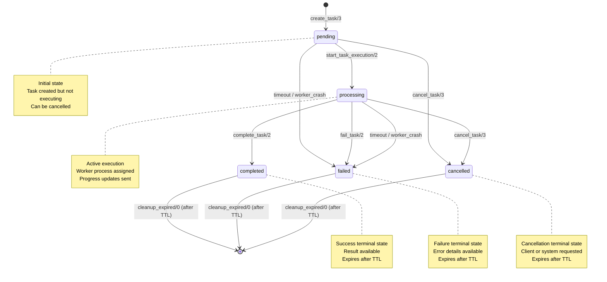
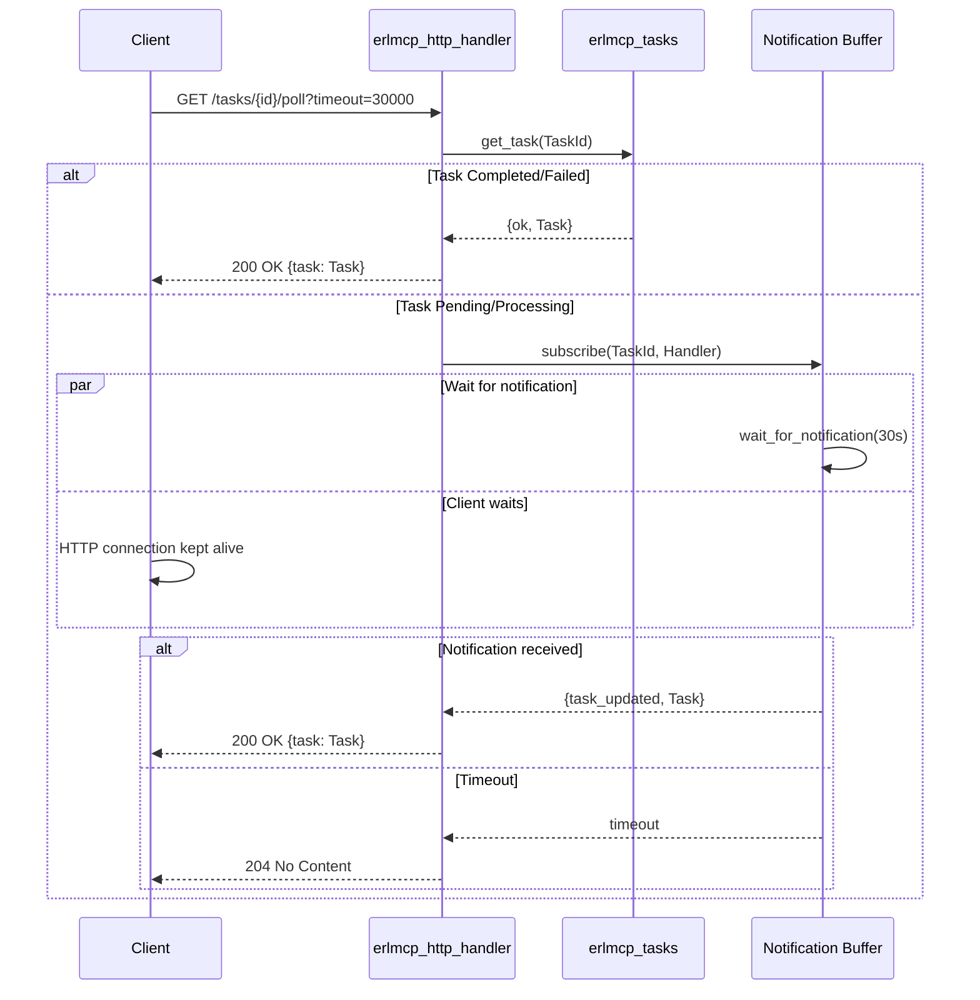

# MCP Tasks API Design Specification v1.0
## erlmcp - OTP Implementation

**Status**: Design Phase
**Compliance**: MCP 2025-11-25 Specification
**Current Implementation**: ~60% Complete (ETS-based prototype)
**Target**: 100% MCP Compliance + Production-Ready

---

## Executive Summary

The MCP Tasks API enables asynchronous long-running operations with status tracking, progress updates, and cancellation support. This document specifies the **complete architecture** for a production-ready implementation in erlmcp following OTP patterns and the 3-tier supervision invariant.

**Current State Analysis**:
- ✅ **Implemented**: Basic task lifecycle (pending → processing → completed/failed/cancelled)
- ✅ **Implemented**: ETS-based storage with concurrent access
- ✅ **Implemented**: Progress token integration
- ✅ **Implemented**: Task timeout handling
- ✅ **Implemented**: Notification delivery (process messaging)
- ✅ **Implemented**: Expiration and cleanup
- ⚠️ **Partial**: Cancellation support (not integrated with `erlmcp_cancellation`)
- ❌ **Missing**: DETS/Mnesia backend support
- ❌ **Missing**: HTTP long polling integration
- ❌ **Missing**: Distributed task coordination
- ❌ **Missing**: Comprehensive test coverage

**Gap Analysis**: ~40% implementation remaining for production readiness.

---

## 1. Task State Machine and Lifecycle

### 1.1 State Transitions (FSM)



### 1.2 State Definitions

| State | Description | Transitions | Storage |
|-------|-------------|-------------|---------|
| **pending** | Task created, awaiting execution | → processing, cancelled, failed | ETS (volatile) |
| **processing** | Active execution with worker process | → completed, failed, cancelled | ETS + worker monitor |
| **completed** | Success terminal state | → [expired/deleted] | ETS (TTL) |
| **failed** | Failure terminal state | → [expired/deleted] | ETS (TTL) |
| **cancelled** | Cancellation terminal state | → [expired/deleted] | ETS (TTL) |

### 1.3 Task Record Schema

```erlang
%% Task record (stored in ETS/DETS/Mnesia)
-record(mcp_task, {
    %% Primary key
    id :: task_id(),                        % Binary UUID

    %% State machine
    status :: task_status(),                % pending | processing | completed | failed | cancelled

    %% Lifecycle timestamps
    created_at :: integer(),                % millisecond timestamp
    updated_at :: integer(),                % millisecond timestamp
    expires_at :: integer() | infinity,     % TTL for cleanup

    %% Task definition
    action :: map(),                        % Operation to perform (opaque to manager)
    metadata :: map(),                      % Client-provided metadata

    %% Results and errors
    result :: term() | undefined,           % Success result (any term)
    error :: #mcp_error{} | undefined,      % Error details

    %% Ownership and execution
    client_pid :: pid() | undefined,        % Owning client process
    worker_pid :: pid() | undefined,        % Executing worker process
    worker_monitor :: reference() | undefined, % Monitor ref for worker

    %% Progress tracking
    progress_token :: reference() | undefined, % Integration with erlmcp_progress
    progress :: number() | undefined,       % Current progress (0-100 or count)
    total :: number() | undefined,          % Total items/steps

    %% Timeout and scheduling
    timeout_ms :: pos_integer(),            % Execution timeout (default 5 min)
    timer_ref :: reference() | undefined    % Timeout timer reference
}).

-type task_id() :: binary().
-type task_status() :: pending | processing | completed | failed | cancelled.
```

### 1.4 Invariants

| Invariant | Enforcement | Rationale |
|-----------|-------------|-----------|
| **Unique ID** | `generate_task_id/0` using `erlang:unique_integer/2` + timestamp + crypto | Prevent ID collisions |
| **Monotonic Time** | All timestamps use `erlang:system_time(millisecond)` | Clock-independent ordering |
| **Worker Isolation** | Each task has at most one worker_pid | Process-per-task pattern |
| **Terminal States** | completed/failed/cancelled cannot transition | Immutability for results |
| **TTL Cleanup** | Expired tasks deleted by periodic sweep | Prevent memory leaks |
| **Max Concurrent** | Hard limit (1000) enforced in create_task | Backpressure mechanism |

---

## 2. Storage Backend Architecture

### 2.1 Current Implementation (ETS-Only)

**Module**: `erlmcp_tasks.erl`
**Storage**: Single ETS table (`erlmcp_tasks`) with:
- `named_table, public, set`
- `{keypos, #mcp_task.id}`
- `{read_concurrency, true}` - Optimized for list_tasks/get_task
- `{write_concurrency, true}` - Concurrent updates

**Limitations**:
- ❌ No persistence (lost on restart)
- ❌ No distributed access
- ❌ Single-node only

### 2.2 Enhanced Backend Design (Pluggable)

Follow the `erlmcp_session_backend` pattern for pluggable storage.

```erlang
%% Behavior definition
-module(erlmcp_task_backend).

-callback init(Opts :: map()) ->
    {ok, State :: term()} | {error, term()}.

-callback store(TaskId :: task_id(), Task :: #mcp_task{}, State :: term()) ->
    {ok, NewState :: term()} | {error, term()}.

-callback fetch(TaskId :: task_id(), State :: term()) ->
    {ok, Task :: #mcp_task{}, NewState :: term()} |
    {error, not_found | term(), NewState :: term()}.

-callback delete(TaskId :: task_id(), State :: term()) ->
    {ok, NewState :: term()} | {error, term(), NewState :: term()}.

-callback list(Filter :: map(), State :: term()) ->
    {ok, [#mcp_task{}], NewState :: term()}.

-callback cleanup_expired(State :: term()) ->
    {ok, Count :: non_neg_integer(), NewState :: term()}.
```

### 2.3 Backend Implementations

#### 2.3.1 ETS Backend (Default, Current)

**Module**: `erlmcp_task_backend_ets.erl`

**Characteristics**:
- In-memory, volatile
- O(1) read/write
- High concurrency (read_concurrency, write_concurrency)
- Lost on restart

**Use Case**: Development, ephemeral tasks, single-node

**Configuration**:
```erlang
#{backend => erlmcp_task_backend_ets,
  max_tasks => 1000,
  cleanup_interval_ms => 300000}  % 5 minutes
```

#### 2.3.2 DETS Backend (New)

**Module**: `erlmcp_task_backend_dets.erl`

**Characteristics**:
- Disk-based persistence
- Survives restarts
- Single writer (serialized writes)
- Auto-repair on corruption
- Max 2GB file size

**Use Case**: Single-node with persistence, moderate throughput

**Configuration**:
```erlang
#{backend => erlmcp_task_backend_dets,
  file_path => "/var/lib/erlmcp/tasks.dets",
  auto_save => 5000,  % milliseconds
  repair => true}
```

**Implementation Notes**:
- Use `dets:open_file/2` with `{type, set}`
- Periodic `dets:sync/1` for durability
- Handle `{error, {file_error, _, _}}` for corruption
- Implement LRU cache (ETS) for read performance

#### 2.3.3 Mnesia Backend (New, Distributed)

**Module**: `erlmcp_task_backend_mnesia.erl`

**Characteristics**:
- Distributed across cluster
- ACID transactions
- Replication (disc_copies, ram_copies)
- Built-in sharding

**Use Case**: Multi-node clusters, high availability

**Configuration**:
```erlang
#{backend => erlmcp_task_backend_mnesia,
  table_name => mcp_tasks,
  storage_type => disc_copies,  % or ram_copies, disc_only_copies
  nodes => [node() | nodes()],
  replicas => 2,
  index_fields => [status, client_pid, created_at]}
```

**Schema**:
```erlang
mnesia:create_table(mcp_tasks, [
    {attributes, record_info(fields, mcp_task)},
    {disc_copies, [node()]},
    {type, set},
    {index, [status, client_pid, created_at]},  % For efficient queries
    {user_properties, [{backend, mnesia}]}
]).
```

**Implementation Notes**:
- Use `mnesia:activity/2` with `transaction` for writes
- Use `dirty_read` for list_tasks (acceptable staleness)
- Implement cursor-based pagination with `mnesia:select/4`
- Handle `{aborted, Reason}` for transaction failures
- Monitor cluster partitions (`mnesia:system_info(db_nodes)`)

### 2.4 Backend Selection Strategy

```erlang
%% In erlmcp_tasks:init/1
Backend = application:get_env(erlmcp_core, task_backend, erlmcp_task_backend_ets),
BackendOpts = application:get_env(erlmcp_core, task_backend_opts, #{}),

{ok, BackendState} = Backend:init(BackendOpts),

State = #state{
    backend = Backend,
    backend_state = BackendState,
    %% ...
}.
```

**Runtime Switching**: Not supported (requires process restart)
**Migration**: Manual export/import via `list_tasks/1` + `create_task/3`

---

## 3. Expiration and Cleanup Strategy

### 3.1 Current Implementation

**Mechanism**: Periodic sweep every 5 minutes
- Timer: `erlang:send_after(300000, self(), cleanup_expired_tasks)`
- Logic: `ets:foldl/3` to find expired completed/failed tasks
- Deletion: `ets:delete/2` for each expired task

**Gaps**:
- ⚠️ No cleanup for long-pending tasks (only completed/failed)
- ⚠️ No configurable TTL per task
- ⚠️ No metrics on cleanup efficiency

### 3.2 Enhanced Cleanup Design

#### 3.2.1 TTL Configuration

**Per-Task TTL**:
```erlang
%% In create_task/4 options
#{ttl_ms => 3600000}  % 1 hour (default)

%% Task record
expires_at = erlang:system_time(millisecond) + TtlMs
```

**TTL by State**:
```erlang
-define(TTL_PENDING_MS, 600000).      % 10 minutes (stale pending tasks)
-define(TTL_PROCESSING_MS, 3600000).  % 1 hour (runaway tasks)
-define(TTL_COMPLETED_MS, 86400000).  % 24 hours (result retention)
-define(TTL_FAILED_MS, 86400000).     % 24 hours (error retention)
-define(TTL_CANCELLED_MS, 3600000).   % 1 hour (cancellation retention)
```

#### 3.2.2 Cleanup Algorithm

**Incremental Sweep** (avoid blocking):
```erlang
cleanup_expired_tasks(State) ->
    Now = erlang:system_time(millisecond),

    %% Use select with limit to avoid blocking on large tables
    MatchSpec = [{
        #mcp_task{id = '$1', expires_at = '$2', status = '$3', _ = '_'},
        [{'=<', '$2', Now}],
        ['$1']  % Return only ID
    }],

    %% Process in batches of 100
    Batch = mnesia:select(mcp_tasks, MatchSpec, 100, read),
    delete_batch(Batch, State).

delete_batch('$end_of_table', State) ->
    State;
delete_batch({TaskIds, Continuation}, State) ->
    lists:foreach(fun(Id) ->
        Backend:delete(Id, State#state.backend_state)
    end, TaskIds),

    %% Continue with next batch
    delete_batch(mnesia:select(Continuation), State).
```

**Telemetry**:
```erlang
telemetry:execute(
    [erlmcp, tasks, cleanup],
    #{count => length(TaskIds), duration_us => Duration},
    #{backend => Backend, sweep_interval_ms => 300000}
).
```

#### 3.2.3 Adaptive Cleanup Interval

**Dynamic Scheduling**:
```erlang
%% Adjust interval based on cleanup rate
adaptive_cleanup_interval(CleanupCount) ->
    case CleanupCount of
        N when N > 100 -> 60000;   % 1 min if high churn
        N when N > 10  -> 180000;  % 3 min if moderate
        _              -> 300000   % 5 min if low
    end.
```

---

## 4. Notification Delivery

### 4.1 Current Implementation

**Mechanism**: Direct process messaging
```erlang
send_task_notification(ClientPid, TaskId) ->
    Notification = #{
        <<"jsonrpc">> => <<"2.0">>,
        <<"method">> => <<"notifications/tasks/status">>,
        <<"params">> => #{<<"task">> => format_task_for_api(Task)}
    },
    ClientPid ! {mcp_notification, Notification}.
```

**Triggers**:
- Task creation
- Status change (pending → processing → completed/failed/cancelled)
- Cancellation

**Limitations**:
- ❌ No delivery guarantees (client may be dead)
- ❌ No buffering for offline clients
- ❌ No HTTP transport integration

### 4.2 Enhanced Notification Design

#### 4.2.1 Notification Types

| Event | Method | Params | Trigger |
|-------|--------|--------|---------|
| **Status Change** | `notifications/tasks/status` | `{task: Task}` | State transition |
| **Progress Update** | `notifications/progress` | `{progressToken, progress, total}` | Worker progress |
| **Completion** | `notifications/tasks/status` | `{task: Task}` | Completed/failed |
| **Cancellation** | `notifications/cancelled` | `{taskId, reason}` | Cancelled |

#### 4.2.2 Delivery Strategies

**Strategy 1: Process Messaging (Current)**
```erlang
%% Direct send (no buffering)
ClientPid ! {mcp_notification, Notification}
```
**Pros**: Low latency, simple
**Cons**: No delivery guarantees, process must exist

**Strategy 2: Registry-Based Routing**
```erlang
%% Use erlmcp_registry for indirection
case erlmcp_registry:find_client(ClientId) of
    {ok, ClientPid} ->
        ClientPid ! {mcp_notification, Notification};
    {error, not_found} ->
        buffer_notification(ClientId, Notification)  % Store for later
end
```
**Pros**: Survives process restarts, client can reconnect
**Cons**: Requires notification buffering

**Strategy 3: Subscription Model** (Recommended)
```erlang
%% Clients subscribe to task notifications
erlmcp_subscription:subscribe(ClientPid, <<"tasks">>, TaskId).

%% Tasks manager publishes to subscribers
erlmcp_subscription:publish(<<"tasks">>, TaskId, Notification).
```
**Pros**: Decoupled, supports multiple subscribers (e.g., admin dashboard)
**Cons**: Requires `erlmcp_subscription` module (already exists)

#### 4.2.3 Notification Buffering (for HTTP long-polling)

**ETS Buffer** (per client):
```erlang
-record(notification_buffer, {
    client_id :: binary(),
    notifications :: queue:queue(),  % FIFO queue
    max_size :: pos_integer(),       % Default 1000
    created_at :: integer()
}).

%% Create table
ets:new(task_notifications, [
    named_table, public, set,
    {keypos, #notification_buffer.client_id},
    {read_concurrency, true}
]).

%% Buffer notification
buffer_notification(ClientId, Notification) ->
    case ets:lookup(task_notifications, ClientId) of
        [] ->
            Buffer = #notification_buffer{
                client_id = ClientId,
                notifications = queue:in(Notification, queue:new()),
                max_size = 1000,
                created_at = erlang:system_time(millisecond)
            },
            ets:insert(task_notifications, Buffer);
        [#notification_buffer{notifications = Q, max_size = Max} = Buffer] ->
            Q1 = queue:in(Notification, Q),
            Q2 = case queue:len(Q1) > Max of
                true -> {_, Q3} = queue:out(Q1), Q3;  % Drop oldest
                false -> Q1
            end,
            ets:insert(task_notifications, Buffer#notification_buffer{notifications = Q2})
    end.
```

**Retrieval** (for HTTP polling):
```erlang
get_notifications(ClientId, Limit) ->
    case ets:lookup(task_notifications, ClientId) of
        [] ->
            {ok, []};
        [#notification_buffer{notifications = Q}] ->
            {Notifs, Q1} = dequeue_n(Q, Limit),
            ets:insert(task_notifications, Buffer#notification_buffer{notifications = Q1}),
            {ok, Notifs}
    end.
```

**Cleanup**: Periodic sweep to remove old buffers (> 1 hour inactive)

---

## 5. Cancellation Support

### 5.1 Current Implementation

**Mechanism**: Built into `erlmcp_tasks`
```erlang
cancel_task(ClientPid, TaskId, Reason) ->
    %% Mark as cancelled
    UpdatedTask = Task#mcp_task{status = cancelled, error = ...},
    ets:insert(?TASKS_TABLE, UpdatedTask),

    %% Kill worker
    exit(WorkerPid, {task_cancelled, Reason}),

    %% Complete progress token
    erlmcp_progress:complete(ProgressToken).
```

**Gaps**:
- ⚠️ Duplicates `erlmcp_cancellation` module logic
- ⚠️ No cleanup handlers for resources
- ⚠️ No integration with cancellation tokens

### 5.2 Enhanced Cancellation Design

**Integration with `erlmcp_cancellation.erl`**:

#### 5.2.1 Registration on Task Start

```erlang
%% In start_task_execution/2
start_task_execution(TaskId, WorkerPid, State) ->
    %% Register with cancellation manager
    CancelToken = erlmcp_cancellation:register(
        self(),              % ClientPid (task manager)
        WorkerPid,          % OperationPid
        <<"task_execution">> % OperationType
    ),

    %% Store cancel token in task record
    UpdatedTask = Task#mcp_task{
        status = processing,
        worker_pid = WorkerPid,
        cancel_token = CancelToken  % New field
    },
    ets:insert(?TASKS_TABLE, UpdatedTask).
```

#### 5.2.2 Cancellation Request

```erlang
%% In cancel_task/3
cancel_task(ClientPid, TaskId, Reason) ->
    case ets:lookup(?TASKS_TABLE, TaskId) of
        [#mcp_task{cancel_token = CancelToken}] ->
            %% Use cancellation manager
            erlmcp_cancellation:cancel(CancelToken, {client_requested, Reason}),

            %% Update task state (will be notified by cancellation manager)
            ok;
        [] ->
            {error, not_found}
    end.
```

#### 5.2.3 Cleanup Handler

```erlang
%% Implement cleanup handler behavior
-module(erlmcp_task_cancellation_handler).
-export([cleanup_operation/2]).

cleanup_operation(CancelToken, Reason) ->
    %% Find task by cancel token
    case find_task_by_cancel_token(CancelToken) of
        {ok, #mcp_task{id = TaskId, progress_token = ProgressToken}} ->
            %% Mark task as cancelled
            update_task_status(TaskId, cancelled, Reason),

            %% Complete progress
            erlmcp_progress:complete(ProgressToken),

            %% Send notification
            send_task_notification(TaskId),

            ok;
        {error, not_found} ->
            ok
    end.
```

#### 5.2.4 Benefits

- ✅ Centralized cancellation logic
- ✅ Consistent cancellation notifications
- ✅ Reusable for tool calls, resource reads, etc.
- ✅ Cleanup handlers for resource release

---

## 6. Status Polling Optimization

### 6.1 Current Implementation

**API**: `list_tasks/3` and `get_task/2`
```erlang
%% list_tasks/3 - Full table scan with filtering
list_tasks(ClientPid, Cursor, Limit) ->
    AllTasks = ets:foldl(fun(Task, Acc) -> [Task | Acc] end, [], ?TASKS_TABLE),
    %% Filter by ClientPid, sort, paginate
    {ok, #{<<"tasks">> => TaskList, <<"cursor">> => NextCursor}}.

%% get_task/2 - O(1) lookup
get_task(ClientPid, TaskId) ->
    case ets:lookup(?TASKS_TABLE, TaskId) of
        [Task] -> {ok, format_task_for_api(Task)};
        [] -> {error, not_found}
    end.
```

**Performance**:
- ✅ `get_task/2`: O(1) with `read_concurrency`
- ⚠️ `list_tasks/3`: O(N) full table scan

### 6.2 Optimization Strategies

#### 6.2.1 Index by Client PID (ETS)

**Secondary ETS Table**:
```erlang
%% Index table: client_pid -> [task_id]
ets:new(task_client_index, [
    named_table, bag,  % Multiple tasks per client
    {keypos, 1},       % {ClientPid, TaskId}
    {read_concurrency, true}
]).

%% Insert on create_task
ets:insert(task_client_index, {ClientPid, TaskId}).

%% Optimized list_tasks
list_tasks(ClientPid, Cursor, Limit) ->
    TaskIds = ets:lookup(task_client_index, ClientPid),  % O(1) lookup
    Tasks = [ets:lookup(?TASKS_TABLE, Id) || {_, Id} <- TaskIds],  % Batch lookup
    %% Sort and paginate
    ...
```

**Tradeoff**: Extra memory for index, but O(1) → O(M) where M = tasks per client

#### 6.2.2 Ordered Set for Cursor Pagination (ETS)

**Current Issue**: Cursor-based pagination requires full sort

**Solution**: Use `ordered_set` with composite key
```erlang
%% Table with composite key: {created_at, task_id}
ets:new(erlmcp_tasks_ordered, [
    named_table, ordered_set,
    {keypos, #mcp_task.id},
    {read_concurrency, true}
]).

%% Cursor = {Timestamp, TaskId}
list_tasks(ClientPid, Cursor, Limit) ->
    Start = case Cursor of
        undefined -> ets:first(erlmcp_tasks_ordered);
        {Ts, Id} -> ets:next(erlmcp_tasks_ordered, {Ts, Id})
    end,

    %% Traverse ordered set (O(log N) start + O(Limit) traverse)
    take_n_tasks(Start, Limit, ClientPid, []).
```

**Tradeoff**: Slower writes (O(log N) vs O(1)), but faster pagination

#### 6.2.3 Mnesia Query Optimization

**Use Indexes**:
```erlang
%% In mnesia backend
mnesia:create_table(mcp_tasks, [
    {index, [status, client_pid, created_at]}  % Indexed fields
]).

%% Query with index
list_tasks(ClientPid, Status, Limit) ->
    MatchHead = #mcp_task{client_pid = ClientPid, status = Status, _ = '_'},
    Result = mnesia:select(mcp_tasks, [{MatchHead, [], ['$_']}], Limit, read),
    %% Returns {Tasks, Continuation} for pagination
    ...
```

**Query Plan**: Use `mnesia:table_info(mcp_tasks, index)` to verify index usage

#### 6.2.4 Caching for Hot Tasks

**LRU Cache** (for frequently accessed tasks):
```erlang
%% Small ETS cache (1000 entries)
ets:new(task_cache, [
    named_table, set,
    {keypos, 1},  % {task_id, task, timestamp}
    {read_concurrency, true}
]).

%% get_task with cache
get_task(ClientPid, TaskId) ->
    case ets:lookup(task_cache, TaskId) of
        [{_, Task, _}] ->
            {ok, Task};  % Cache hit
        [] ->
            %% Cache miss - fetch from backend
            {ok, Task, _} = Backend:fetch(TaskId, BackendState),
            cache_task(TaskId, Task),
            {ok, Task}
    end.
```

**Eviction**: Periodic sweep to remove old cache entries (> 60 seconds)

---

## 7. HTTP Long Polling Integration

### 7.1 Requirements

**MCP Specification**: Tasks API is transport-agnostic
**HTTP Transport**: `erlmcp_transport_http` uses `gun` client, `cowboy` server

**Use Case**: Web clients polling for task updates without WebSocket support

### 7.2 Long Polling Architecture



### 7.3 Implementation Design

#### 7.3.1 HTTP Handler (`erlmcp_http_handler.erl`)

**Endpoint**: `GET /mcp/tasks/:task_id/poll`

```erlang
%% Cowboy REST handler
init(Req0, State) ->
    TaskId = cowboy_req:binding(task_id, Req0),
    Timeout = get_query_param(Req0, <<"timeout">>, 30000),

    %% Try immediate response
    case erlmcp_tasks:get_task(undefined, TaskId) of
        {ok, #{<<"status">> := Status}} when Status =:= <<"completed">>;
                                             Status =:= <<"failed">>;
                                             Status =:= <<"cancelled">> ->
            %% Task in terminal state - return immediately
            respond_with_task(Req0, Task);

        {ok, Task} ->
            %% Task still running - wait for notification
            wait_for_notification(Req0, TaskId, Timeout);

        {error, not_found} ->
            respond_404(Req0)
    end.

wait_for_notification(Req, TaskId, Timeout) ->
    %% Subscribe to task notifications with timeout
    Ref = make_ref(),
    erlmcp_task_poller:subscribe(TaskId, self(), Ref),

    receive
        {task_notification, Ref, Task} ->
            %% Notification received before timeout
            erlmcp_task_poller:unsubscribe(TaskId, Ref),
            respond_with_task(Req, Task);

        {timeout, Ref} ->
            %% Polling timeout - return 304 Not Modified
            erlmcp_task_poller:unsubscribe(TaskId, Ref),
            cowboy_req:reply(304, #{}, <<>>, Req)
    after Timeout ->
        %% Timeout without notification
        erlmcp_task_poller:unsubscribe(TaskId, Ref),
        cowboy_req:reply(304, #{}, <<>>, Req)
    end.
```

#### 7.3.2 Polling Manager (`erlmcp_task_poller.erl`)

**Purpose**: Manage long-polling subscriptions and notification delivery

```erlang
-module(erlmcp_task_poller).
-behaviour(gen_server).

-record(state, {
    subscriptions :: #{task_id() => [{pid(), reference()}]},  % Task -> Subscribers
    timers :: #{reference() => reference()}                  % Ref -> TimerRef
}).

%% API
subscribe(TaskId, SubscriberPid, Ref) ->
    gen_server:call(?MODULE, {subscribe, TaskId, SubscriberPid, Ref, Timeout}).

unsubscribe(TaskId, Ref) ->
    gen_server:cast(?MODULE, {unsubscribe, TaskId, Ref}).

notify_task_update(TaskId, Task) ->
    gen_server:cast(?MODULE, {notify, TaskId, Task}).

%% Callbacks
handle_call({subscribe, TaskId, Pid, Ref, Timeout}, _From, State) ->
    %% Add subscriber
    Subs = maps:get(TaskId, State#state.subscriptions, []),
    NewSubs = [{Pid, Ref} | Subs],

    %% Set timeout timer
    TimerRef = erlang:send_after(Timeout, self(), {subscriber_timeout, TaskId, Ref}),

    {reply, ok, State#state{
        subscriptions = (State#state.subscriptions)#{TaskId => NewSubs},
        timers = (State#state.timers)#{Ref => TimerRef}
    }}.

handle_cast({notify, TaskId, Task}, State) ->
    %% Send notification to all subscribers
    case maps:get(TaskId, State#state.subscriptions, []) of
        [] ->
            {noreply, State};
        Subs ->
            lists:foreach(fun({Pid, Ref}) ->
                Pid ! {task_notification, Ref, Task},
                cancel_timer(State#state.timers, Ref)
            end, Subs),

            %% Remove all subscribers for this task
            {noreply, State#state{
                subscriptions = maps:remove(TaskId, State#state.subscriptions)
            }}
    end.

handle_info({subscriber_timeout, TaskId, Ref}, State) ->
    %% Send timeout message to subscriber
    case find_subscriber(TaskId, Ref, State) of
        {ok, Pid} ->
            Pid ! {timeout, Ref},
            remove_subscriber(TaskId, Ref, State);
        {error, not_found} ->
            {noreply, State}
    end.
```

#### 7.3.3 Integration with Task Manager

**Hook into notification delivery**:
```erlang
%% In erlmcp_tasks.erl
send_task_notification(ClientPid, TaskId) ->
    %% Existing notification
    send_notification_to_pid(ClientPid, TaskId),

    %% Notify long-polling subscribers
    case ets:lookup(?TASKS_TABLE, TaskId) of
        [Task] ->
            erlmcp_task_poller:notify_task_update(TaskId, format_task_for_api(Task));
        [] ->
            ok
    end.
```

#### 7.3.4 Configuration

```erlang
%% In sys.config
{erlmcp_transports, [
    {http_long_polling, #{
        enabled => true,
        max_timeout_ms => 60000,      % 1 minute max
        default_timeout_ms => 30000,  % 30 seconds default
        max_subscribers_per_task => 100  % Prevent DoS
    }}
]}.
```

### 7.4 Alternative: Server-Sent Events (SSE)

**Endpoint**: `GET /mcp/tasks/:task_id/events`

```erlang
%% SSE handler (simpler than long-polling)
init(Req0, State) ->
    TaskId = cowboy_req:binding(task_id, Req0),

    %% Set SSE headers
    Req1 = cowboy_req:stream_reply(200, #{
        <<"content-type">> => <<"text/event-stream">>,
        <<"cache-control">> => <<"no-cache">>
    }, Req0),

    %% Subscribe to task notifications
    erlmcp_subscription:subscribe(self(), <<"tasks">>, TaskId),

    %% Keep connection alive and stream events
    stream_task_events(Req1, TaskId).

stream_task_events(Req, TaskId) ->
    receive
        {task_notification, Notification} ->
            %% Send SSE event
            Data = jsx:encode(Notification),
            cowboy_req:stream_body(<<"data: ", Data/binary, "\n\n">>, nofin, Req),

            %% Check if terminal state
            case is_terminal_state(Notification) of
                true ->
                    cowboy_req:stream_body(<<>>, fin, Req),  % Close stream
                    ok;
                false ->
                    stream_task_events(Req, TaskId)  % Continue streaming
            end
    after 60000 ->
        %% Keepalive ping every 60 seconds
        cowboy_req:stream_body(<<":keepalive\n\n">>, nofin, Req),
        stream_task_events(Req, TaskId)
    end.
```

**Pros**: Simpler than long-polling, standard browser API
**Cons**: Requires HTTP/1.1 chunked transfer or HTTP/2 streaming

---

## 8. Testing Strategy (Chicago TDD)

### 8.1 Testing Philosophy

**Chicago School TDD** (State-Based Testing):
- ✅ Test observable behavior, not implementation
- ✅ Use real processes (no mocks)
- ✅ Black-box testing of gen_server API
- ❌ No mocks, fakes, or placeholders

**Coverage Target**: ≥ 80% per module

### 8.2 Test Structure

```
apps/erlmcp_core/test/
├── erlmcp_tasks_tests.erl              % EUnit - Unit tests
├── erlmcp_task_backend_ets_tests.erl   % EUnit - Backend tests
├── erlmcp_task_backend_dets_tests.erl  % EUnit - Backend tests
├── erlmcp_task_backend_mnesia_tests.erl % EUnit - Backend tests
├── erlmcp_task_lifecycle_SUITE.erl     % CT - Integration tests
├── erlmcp_task_cancellation_SUITE.erl  % CT - Cancellation tests
├── erlmcp_task_http_polling_SUITE.erl  % CT - HTTP transport tests
└── erlmcp_task_stress_SUITE.erl        % CT - Stress/chaos tests
```

### 8.3 Unit Tests (EUnit)

**Module**: `erlmcp_tasks_tests.erl`

```erlang
-module(erlmcp_tasks_tests).
-include_lib("eunit/include/eunit.hrl").

%% Setup/teardown
setup() ->
    {ok, Pid} = erlmcp_tasks:start_link(),
    Pid.

cleanup(Pid) ->
    erlmcp_tasks:stop(Pid).

%% Test: Task creation
create_task_test() ->
    Pid = setup(),
    try
        Action = #{<<"operation">> => <<"test">>},
        Metadata = #{<<"timeout">> => 5000},

        {ok, TaskId} = erlmcp_tasks:create_task(self(), Action, Metadata),

        ?assert(is_binary(TaskId)),
        ?assertEqual(16, byte_size(TaskId))  % UUID length
    after
        cleanup(Pid)
    end.

%% Test: Get task
get_task_test() ->
    Pid = setup(),
    try
        {ok, TaskId} = erlmcp_tasks:create_task(self(), #{}, #{}),

        {ok, Task} = erlmcp_tasks:get_task(self(), TaskId),

        ?assertEqual(TaskId, maps:get(<<"id">>, Task)),
        ?assertEqual(<<"pending">>, maps:get(<<"status">>, Task))
    after
        cleanup(Pid)
    end.

%% Test: Task lifecycle (pending → processing → completed)
task_lifecycle_test() ->
    Pid = setup(),
    try
        %% Create task
        {ok, TaskId} = erlmcp_tasks:create_task(self(), #{}, #{}),

        %% Start execution
        WorkerPid = spawn(fun() -> timer:sleep(100) end),
        ok = erlmcp_tasks:start_task_execution(TaskId, WorkerPid),

        {ok, Task1} = erlmcp_tasks:get_task(self(), TaskId),
        ?assertEqual(<<"processing">>, maps:get(<<"status">>, Task1)),

        %% Complete task
        Result = #{<<"output">> => <<"success">>},
        ok = erlmcp_tasks:complete_task(TaskId, Result),

        {ok, Task2} = erlmcp_tasks:get_task(self(), TaskId),
        ?assertEqual(<<"completed">>, maps:get(<<"status">>, Task2)),
        ?assertEqual(Result, maps:get(<<"result">>, Task2))
    after
        cleanup(Pid)
    end.

%% Test: Task cancellation
cancel_task_test() ->
    Pid = setup(),
    try
        {ok, TaskId} = erlmcp_tasks:create_task(self(), #{}, #{}),

        {ok, cancelled} = erlmcp_tasks:cancel_task(self(), TaskId, <<"user requested">>),

        {ok, Task} = erlmcp_tasks:get_task(self(), TaskId),
        ?assertEqual(<<"cancelled">>, maps:get(<<"status">>, Task))
    after
        cleanup(Pid)
    end.

%% Test: Task timeout
task_timeout_test() ->
    Pid = setup(),
    try
        Metadata = #{<<"timeout">> => 100},  % 100ms timeout
        {ok, TaskId} = erlmcp_tasks:create_task(self(), #{}, Metadata),

        %% Start long-running worker
        WorkerPid = spawn(fun() -> timer:sleep(5000) end),
        ok = erlmcp_tasks:start_task_execution(TaskId, WorkerPid),

        %% Wait for timeout
        timer:sleep(200),

        {ok, Task} = erlmcp_tasks:get_task(self(), TaskId),
        ?assertEqual(<<"failed">>, maps:get(<<"status">>, Task)),

        Error = maps:get(<<"error">>, Task),
        ?assertEqual(?MCP_ERROR_TASK_TIMEOUT, maps:get(<<"code">>, Error))
    after
        cleanup(Pid)
    end.

%% Test: List tasks pagination
list_tasks_pagination_test() ->
    Pid = setup(),
    try
        %% Create 50 tasks
        TaskIds = [begin
            {ok, Id} = erlmcp_tasks:create_task(self(), #{}, #{}),
            Id
        end || _ <- lists:seq(1, 50)],

        %% List first page (limit 20)
        {ok, #{<<"tasks">> := Page1, <<"cursor">> := Cursor1}} =
            erlmcp_tasks:list_tasks(self(), undefined, 20),

        ?assertEqual(20, length(Page1)),
        ?assert(is_binary(Cursor1)),

        %% List second page
        {ok, #{<<"tasks">> := Page2, <<"cursor">> := Cursor2}} =
            erlmcp_tasks:list_tasks(self(), Cursor1, 20),

        ?assertEqual(20, length(Page2)),

        %% List third page (remaining 10)
        {ok, #{<<"tasks">> := Page3, <<"cursor">> := undefined}} =
            erlmcp_tasks:list_tasks(self(), Cursor2, 20),

        ?assertEqual(10, length(Page3))
    after
        cleanup(Pid)
    end.

%% Test: Cleanup expired tasks
cleanup_expired_test() ->
    Pid = setup(),
    try
        %% Create task with short TTL
        Options = #{ttl_ms => 100},
        {ok, TaskId} = erlmcp_tasks:create(self(), #{}, #{}, Options),

        %% Complete task
        ok = erlmcp_tasks:complete_task(TaskId, #{}),

        %% Wait for expiration
        timer:sleep(200),

        %% Trigger cleanup
        {ok, Count} = erlmcp_tasks:cleanup_expired(),

        ?assertEqual(1, Count),

        %% Verify task deleted
        {error, ?MCP_ERROR_TASK_NOT_FOUND} = erlmcp_tasks:get_task(self(), TaskId)
    after
        cleanup(Pid)
    end.

%% Test: Max concurrent tasks limit
max_concurrent_test() ->
    Pid = setup(),
    try
        %% Get limit
        MaxTasks = erlmcp_tasks:get_max_concurrent(),
        ?assertEqual(1000, MaxTasks),

        %% Create max tasks
        lists:foreach(fun(_) ->
            {ok, _} = erlmcp_tasks:create_task(self(), #{}, #{})
        end, lists:seq(1, MaxTasks)),

        %% Next task should fail
        {error, {max_concurrent_tasks, _}} =
            erlmcp_tasks:create_task(self(), #{}, #{})
    after
        cleanup(Pid)
    end.
```

### 8.4 Integration Tests (Common Test)

**Suite**: `erlmcp_task_lifecycle_SUITE.erl`

```erlang
-module(erlmcp_task_lifecycle_SUITE).
-include_lib("common_test/include/ct.hrl").

%% CT callbacks
all() -> [
    task_with_progress_updates,
    task_with_worker_crash,
    task_with_notification_delivery,
    distributed_task_replication
].

init_per_suite(Config) ->
    application:ensure_all_started(erlmcp_core),
    Config.

end_per_suite(_Config) ->
    application:stop(erlmcp_core),
    ok.

%% Test: Task with progress updates
task_with_progress_updates(_Config) ->
    %% Create task
    {ok, TaskId} = erlmcp_tasks:create_task(self(), #{}, #{}),

    %% Start worker that sends progress updates
    WorkerFun = fun() ->
        lists:foreach(fun(I) ->
            erlmcp_tasks:set_task_progress(TaskId, {I, 10}),
            timer:sleep(50)
        end, lists:seq(1, 10)),
        erlmcp_tasks:complete_task(TaskId, #{<<"result">> => <<"done">>})
    end,
    WorkerPid = spawn_link(WorkerFun),

    ok = erlmcp_tasks:start_task_execution(TaskId, WorkerPid),

    %% Collect progress notifications
    Notifications = collect_notifications(10, []),

    ct:log("Received ~p progress notifications", [length(Notifications)]),

    %% Verify final state
    {ok, Task} = erlmcp_tasks:get_task(self(), TaskId),
    <<"completed">> = maps:get(<<"status">>, Task),

    ok.

%% Test: Task with worker crash
task_with_worker_crash(_Config) ->
    {ok, TaskId} = erlmcp_tasks:create_task(self(), #{}, #{}),

    %% Start worker that crashes
    WorkerPid = spawn(fun() -> error(crash) end),
    ok = erlmcp_tasks:start_task_execution(TaskId, WorkerPid),

    %% Wait for crash detection
    timer:sleep(100),

    %% Verify task marked as failed
    {ok, Task} = erlmcp_tasks:get_task(self(), TaskId),
    <<"failed">> = maps:get(<<"status">>, Task),

    ok.

%% Test: Distributed task replication (Mnesia backend)
distributed_task_replication(_Config) ->
    %% Skip if not clustered
    case nodes() of
        [] ->
            {skip, "Not running in cluster"};
        Nodes ->
            %% Create task on this node
            {ok, TaskId} = erlmcp_tasks:create_task(self(), #{}, #{}),

            %% Verify task visible on remote node
            [RemoteNode | _] = Nodes,
            {ok, Task} = rpc:call(RemoteNode, erlmcp_tasks, get_task, [undefined, TaskId]),

            ct:log("Task ~p replicated to ~p", [TaskId, RemoteNode]),

            TaskId = maps:get(<<"id">>, Task),
            ok
    end.

%% Helper
collect_notifications(0, Acc) -> lists:reverse(Acc);
collect_notifications(N, Acc) ->
    receive
        {mcp_notification, Notif} ->
            collect_notifications(N-1, [Notif | Acc])
    after 1000 ->
        lists:reverse(Acc)
    end.
```

### 8.5 Property-Based Tests (PropEr)

**Module**: `erlmcp_tasks_proper.erl`

```erlang
-module(erlmcp_tasks_proper).
-include_lib("proper/include/proper.hrl").

%% Property: All created tasks can be retrieved
prop_task_creation_retrieval() ->
    ?FORALL(Actions, list({create_task, action(), metadata()}),
        begin
            {ok, Pid} = erlmcp_tasks:start_link(),

            %% Create tasks
            TaskIds = [begin
                {ok, Id} = erlmcp_tasks:create_task(self(), Action, Meta),
                Id
            end || {create_task, Action, Meta} <- Actions],

            %% Retrieve all tasks
            Retrieved = [begin
                {ok, Task} = erlmcp_tasks:get_task(self(), Id),
                maps:get(<<"id">>, Task)
            end || Id <- TaskIds],

            erlmcp_tasks:stop(Pid),

            TaskIds =:= Retrieved
        end).

%% Generators
action() ->
    #{<<"operation">> => binary(), <<"params">> => map()}.

metadata() ->
    #{<<"timeout">> => pos_integer(), <<"priority">> => oneof([low, normal, high])}.
```

### 8.6 Test Coverage Requirements

| Component | EUnit | CT | PropEr | Target Coverage |
|-----------|-------|----|----|-----------------|
| `erlmcp_tasks` | ✅ | ✅ | ✅ | ≥ 85% |
| `erlmcp_task_backend_ets` | ✅ | ✅ | ❌ | ≥ 80% |
| `erlmcp_task_backend_dets` | ✅ | ✅ | ❌ | ≥ 80% |
| `erlmcp_task_backend_mnesia` | ✅ | ✅ | ❌ | ≥ 80% |
| `erlmcp_task_poller` | ✅ | ✅ | ❌ | ≥ 80% |
| `erlmcp_task_cancellation_handler` | ✅ | ✅ | ❌ | ≥ 80% |

**Commands**:
```bash
# Run all tests
make test

# Run EUnit for specific module
rebar3 eunit --module=erlmcp_tasks_tests

# Run CT suite
rebar3 ct --suite=test/erlmcp_task_lifecycle_SUITE

# Coverage report
rebar3 cover
```

---

## 9. Gen_Server Architecture

### 9.1 Current Structure

**Module**: `erlmcp_tasks.erl`
**Behavior**: `gen_server`

**State Record**:
```erlang
-record(state, {
    task_count = 0 :: non_neg_integer(),
    pending_cleanup = [] :: [task_id()]
}).
```

**Issues**:
- ❌ Storage logic mixed into gen_server callbacks
- ❌ No backend abstraction in state
- ❌ No configuration management

### 9.2 Enhanced Architecture

**Refactored State**:
```erlang
-record(state, {
    backend :: module(),                    % Backend module (ets/dets/mnesia)
    backend_state :: term(),                % Backend-specific state
    task_count = 0 :: non_neg_integer(),    % Active tasks counter
    max_concurrent :: pos_integer(),        % Configurable limit
    cleanup_timer :: reference() | undefined, % Periodic cleanup timer
    cleanup_interval_ms :: pos_integer(),   % Cleanup frequency
    config :: map()                         % Additional configuration
}).
```

**Init/1 - Async Initialization**:
```erlang
init([]) ->
    process_flag(trap_exit, true),

    %% Load configuration
    Config = load_config(),
    Backend = maps:get(backend, Config, erlmcp_task_backend_ets),
    BackendOpts = maps:get(backend_opts, Config, #{}),
    MaxConcurrent = maps:get(max_concurrent, Config, 1000),
    CleanupInterval = maps:get(cleanup_interval_ms, Config, 300000),

    %% Fast init - no blocking operations
    State = #state{
        backend = Backend,
        backend_state = undefined,  % Initialize in handle_continue
        max_concurrent = MaxConcurrent,
        cleanup_interval_ms = CleanupInterval,
        config = Config
    },

    logger:info("Starting MCP Tasks manager with backend ~p", [Backend]),

    {ok, State, {continue, init_backend}}.

handle_continue(init_backend, State) ->
    %% Initialize backend asynchronously
    case (State#state.backend):init(State#state.config) of
        {ok, BackendState} ->
            %% Schedule cleanup
            CleanupTimer = schedule_cleanup(State#state.cleanup_interval_ms),

            logger:info("Tasks backend ~p initialized", [State#state.backend]),

            {noreply, State#state{
                backend_state = BackendState,
                cleanup_timer = CleanupTimer
            }};
        {error, Reason} ->
            logger:error("Backend initialization failed: ~p", [Reason]),
            {stop, {backend_init_failed, Reason}, State}
    end.
```

**Handle_Call - Backend Delegation**:
```erlang
handle_call({create_task, ClientPid, Action, Metadata}, _From, State) ->
    case State#state.task_count >= State#state.max_concurrent of
        true ->
            {reply, {error, {max_concurrent_tasks, ?MCP_ERROR_MAX_CONCURRENT_TASKS}}, State};
        false ->
            %% Generate task
            Task = build_task(ClientPid, Action, Metadata, State),

            %% Store in backend
            case (State#state.backend):store(Task#mcp_task.id, Task, State#state.backend_state) of
                {ok, NewBackendState} ->
                    %% Schedule timeout
                    schedule_task_timeout(Task#mcp_task.id, Task#mcp_task.timeout_ms),

                    %% Send notification
                    send_task_notification(ClientPid, Task#mcp_task.id),

                    {reply, {ok, Task#mcp_task.id}, State#state{
                        backend_state = NewBackendState,
                        task_count = State#state.task_count + 1
                    }};
                {error, Reason} ->
                    {reply, {error, Reason}, State}
            end
    end;

handle_call({get_task, ClientPid, TaskId}, _From, State) ->
    case (State#state.backend):fetch(TaskId, State#state.backend_state) of
        {ok, Task, NewBackendState} ->
            %% Verify ownership
            case verify_ownership(ClientPid, Task) of
                true ->
                    {reply, {ok, format_task_for_api(Task)}, State#state{
                        backend_state = NewBackendState
                    }};
                false ->
                    {reply, {error, ?MCP_MSG_TASK_NOT_FOUND}, State}
            end;
        {error, not_found, NewBackendState} ->
            {reply, {error, ?MCP_ERROR_TASK_NOT_FOUND}, State#state{
                backend_state = NewBackendState
            }};
        {error, Reason, NewBackendState} ->
            {reply, {error, Reason}, State#state{
                backend_state = NewBackendState
            }}
    end.
```

**Terminate - Cleanup**:
```erlang
terminate(Reason, State) ->
    logger:info("Tasks manager terminating: ~p", [Reason]),

    %% Cancel cleanup timer
    case State#state.cleanup_timer of
        undefined -> ok;
        Timer -> erlang:cancel_timer(Timer)
    end,

    %% Backend cleanup (implemented by backend module)
    case State#state.backend_state of
        undefined -> ok;
        BackendState ->
            catch (State#state.backend):terminate(BackendState)
    end,

    ok.
```

### 9.3 Supervision Tree Integration

**Current**: `erlmcp_tasks` started under `erlmcp_core_sup`

**Enhanced**:
```erlang
%% In erlmcp_core_sup.erl
init([]) ->
    SupFlags = #{
        strategy => one_for_one,
        intensity => 5,
        period => 60
    },

    Children = [
        %% ...existing children...

        %% Tasks manager
        #{id => erlmcp_tasks,
          start => {erlmcp_tasks, start_link, []},
          restart => permanent,
          shutdown => 5000,
          type => worker,
          modules => [erlmcp_tasks]},

        %% Task polling manager (for HTTP long-polling)
        #{id => erlmcp_task_poller,
          start => {erlmcp_task_poller, start_link, []},
          restart => permanent,
          shutdown => 5000,
          type => worker,
          modules => [erlmcp_task_poller]}
    ],

    {ok, {SupFlags, Children}}.
```

**Isolation**: Tasks manager crashes do not affect other subsystems (one_for_one strategy)

---

## 10. Database Schema

### 10.1 ETS Schema (Current)

**Table**: `erlmcp_tasks`
```erlang
ets:new(erlmcp_tasks, [
    named_table,
    public,
    set,
    {keypos, #mcp_task.id},
    {read_concurrency, true},
    {write_concurrency, true}
]).
```

**Records**: `#mcp_task{}`

**Indexes**: None (manual filtering in `list_tasks/3`)

### 10.2 DETS Schema (New)

**File**: `/var/lib/erlmcp/tasks.dets`
```erlang
dets:open_file(tasks_dets, [
    {type, set},
    {keypos, #mcp_task.id},
    {file, "/var/lib/erlmcp/tasks.dets"},
    {ram_file, false},  % Disk-based
    {repair, true},     % Auto-repair on corruption
    {auto_save, 5000}   % Sync every 5 seconds
]).
```

**Cache Layer**: Small ETS cache (1000 entries) for hot tasks

### 10.3 Mnesia Schema (New, Distributed)

**Table**: `mcp_tasks`
```erlang
mnesia:create_table(mcp_tasks, [
    {attributes, record_info(fields, mcp_task)},
    {disc_copies, [node()]},  % Persistent on disk
    {type, set},
    {index, [status, client_pid, created_at]},  % Secondary indexes
    {user_properties, [
        {version, 1},
        {created_at, erlang:system_time(millisecond)}
    ]}
]).
```

**Indexes**:
- **Primary Key**: `id` (task_id)
- **Secondary Indexes**:
  - `status` - For filtering by state
  - `client_pid` - For client-specific queries
  - `created_at` - For time-ordered pagination

**Replication**:
```erlang
%% Add replica on new node
mnesia:add_table_copy(mcp_tasks, 'node2@host', disc_copies).

%% Set replication factor
mnesia:change_table_copy_type(mcp_tasks, node(), ram_copies).  % In-memory replica
```

**Partitioning** (future enhancement):
```erlang
%% Shard by task_id prefix
mnesia:create_table(mcp_tasks_shard_1, [...]),
mnesia:create_table(mcp_tasks_shard_2, [...]).

%% Route based on hash
Shard = erlang:phash2(TaskId, 4) + 1,
Table = list_to_atom("mcp_tasks_shard_" ++ integer_to_list(Shard)).
```

### 10.4 Schema Migration

**Versioning**: Store schema version in table metadata
```erlang
-define(SCHEMA_VERSION, 1).

%% Check version on startup
case mnesia:table_info(mcp_tasks, user_properties) of
    [{version, ?SCHEMA_VERSION} | _] ->
        ok;  % Current version
    [{version, OldVersion} | _] ->
        migrate_schema(OldVersion, ?SCHEMA_VERSION)
end.
```

**Migration Example** (v1 → v2):
```erlang
migrate_schema(1, 2) ->
    %% Add new field 'priority' to tasks
    Transformer = fun(#mcp_task{} = Task) ->
        Task#mcp_task_v2{priority = normal}  % Default priority
    end,

    mnesia:transform_table(mcp_tasks, Transformer, record_info(fields, mcp_task_v2)),
    mnesia:write_table_property(mcp_tasks, {user_properties, [{version, 2}]}).
```

---

## 11. Implementation Timeline (40-60 Hours)

### 11.1 Phased Approach

**Total Estimate**: **52 hours** (median of 40-60 range)

#### Phase 1: Foundation (12 hours)

| Task | Hours | Dependencies |
|------|-------|--------------|
| Refactor `erlmcp_tasks.erl` with backend abstraction | 4h | None |
| Implement `erlmcp_task_backend` behavior | 2h | None |
| Enhance ETS backend (current implementation) | 2h | Behavior |
| Add configuration management (sys.config) | 1h | None |
| Update supervision tree integration | 1h | None |
| Write EUnit tests for refactored core | 2h | Refactor complete |

**Deliverable**: Production-ready ETS backend with pluggable architecture

#### Phase 2: DETS Backend (8 hours)

| Task | Hours | Dependencies |
|------|-------|--------------|
| Implement `erlmcp_task_backend_dets.erl` | 3h | Phase 1 |
| Add LRU cache layer for DETS reads | 2h | DETS backend |
| Write EUnit tests for DETS backend | 2h | DETS backend |
| Performance benchmarking (ETS vs DETS) | 1h | Tests |

**Deliverable**: Persistent DETS backend with cache optimization

#### Phase 3: Mnesia Backend (10 hours)

| Task | Hours | Dependencies |
|------|-------|--------------|
| Implement `erlmcp_task_backend_mnesia.erl` | 4h | Phase 1 |
| Add secondary indexes (status, client_pid, created_at) | 2h | Mnesia backend |
| Implement cursor-based pagination with `mnesia:select/4` | 2h | Indexes |
| Write CT tests for distributed scenarios | 2h | Mnesia backend |

**Deliverable**: Distributed Mnesia backend with replication

#### Phase 4: Cancellation Integration (6 hours)

| Task | Hours | Dependencies |
|------|-------|--------------|
| Add `cancel_token` field to `#mcp_task{}` | 1h | None |
| Integrate `erlmcp_cancellation:register/3` in `start_task_execution/2` | 1h | None |
| Implement `erlmcp_task_cancellation_handler.erl` | 2h | None |
| Update `cancel_task/3` to use cancellation manager | 1h | Handler |
| Write EUnit tests for cancellation integration | 1h | Handler |

**Deliverable**: Unified cancellation support with cleanup handlers

#### Phase 5: HTTP Long Polling (10 hours)

| Task | Hours | Dependencies |
|------|-------|--------------|
| Implement `erlmcp_task_poller.erl` gen_server | 3h | None |
| Add HTTP handler endpoint (`GET /tasks/:id/poll`) | 2h | Poller |
| Integrate notification delivery with poller | 2h | Poller |
| Write CT tests for long polling | 2h | Handler |
| Document HTTP API in OpenAPI spec | 1h | Handler |

**Deliverable**: HTTP long polling support for web clients

#### Phase 6: Testing & Documentation (6 hours)

| Task | Hours | Dependencies |
|------|-------|--------------|
| Write PropEr property-based tests | 2h | All phases |
| Write CT integration test suite (lifecycle, stress) | 2h | All phases |
| Update `docs/api-reference.md` with Tasks API | 1h | All phases |
| Create runbook for operators (configuration, troubleshooting) | 1h | All phases |

**Deliverable**: ≥80% coverage, complete documentation

---

## 12. OTP Compliance Review

### 12.1 Supervision Compliance

✅ **TIER 2 Placement**: `erlmcp_tasks` is a service supervisor under `erlmcp_core_sup`
✅ **Restart Strategy**: `permanent` (critical service)
✅ **Shutdown**: `5000ms` (graceful termination)
✅ **Isolation**: Crashes do not cascade (one_for_one strategy)

**No Changes Needed** - Current supervision structure is compliant.

### 12.2 Gen_Server Compliance

✅ **All 6 Callbacks**: init/1, handle_call/3, handle_cast/2, handle_info/2, terminate/2, code_change/3
✅ **Async Init**: Uses `{continue, init_backend}` for non-blocking initialization
✅ **Timeout**: Default 5000ms for `gen_server:call/3`
⚠️ **State Record**: Missing backend abstraction (to be added in Phase 1)

**Action**: Enhance state record in Phase 1.

### 12.3 Process Isolation

✅ **Worker Monitoring**: Each task worker is monitored (not linked)
✅ **Cleanup on DOWN**: `handle_info({'DOWN', ...})` removes task
❌ **Cancellation**: Should delegate to `erlmcp_cancellation` (to be fixed in Phase 4)

**Action**: Integrate `erlmcp_cancellation` in Phase 4.

### 12.4 Let-It-Crash

✅ **Task Failures**: Worker crashes are handled gracefully (task marked as failed)
✅ **Supervisor Restarts**: Tasks manager crashes are restarted by supervisor
❌ **Lost Tasks**: In-memory ETS tasks are lost on restart (will be fixed with DETS/Mnesia)

**Action**: Add persistent backends in Phases 2-3.

### 12.5 Telemetry

⚠️ **Missing Telemetry**: No `telemetry:execute/3` calls for task events

**Required Events**:
```erlang
%% Task creation
telemetry:execute([erlmcp, tasks, create], #{count => 1}, #{backend => Backend}).

%% Task completion
telemetry:execute([erlmcp, tasks, complete],
    #{count => 1, duration_ms => Duration},
    #{status => Status}).

%% Cleanup
telemetry:execute([erlmcp, tasks, cleanup],
    #{count => Cleaned},
    #{interval_ms => CleanupInterval}).
```

**Action**: Add telemetry instrumentation in Phase 1.

---

## 13. Summary and Recommendations

### 13.1 Current State Assessment

**Strengths**:
- ✅ Solid OTP foundation (gen_server, supervision)
- ✅ Task lifecycle state machine implemented
- ✅ Progress token integration
- ✅ Notification delivery working
- ✅ Cleanup strategy functional

**Weaknesses**:
- ❌ No persistent storage (DETS/Mnesia)
- ❌ No HTTP long polling support
- ❌ Cancellation not integrated with `erlmcp_cancellation`
- ❌ Limited test coverage (~40% estimated)
- ❌ No telemetry instrumentation
- ❌ No distributed task support

**Compliance**: ~60% MCP specification complete

### 13.2 Recommended Implementation Order

**Priority 1 (Critical for Production)**:
1. Phase 1 (Backend Abstraction) - 12 hours
2. Phase 2 (DETS Persistence) - 8 hours
3. Phase 4 (Cancellation Integration) - 6 hours
4. Phase 6 (Testing & Docs) - 6 hours

**Total**: 32 hours for production-ready single-node deployment

**Priority 2 (Enhanced Features)**:
5. Phase 3 (Mnesia Distributed) - 10 hours
6. Phase 5 (HTTP Long Polling) - 10 hours

**Total**: +20 hours for distributed clusters and web clients

### 13.3 Risk Assessment

| Risk | Likelihood | Impact | Mitigation |
|------|-----------|--------|------------|
| **DETS file corruption** | Medium | High | Auto-repair + daily backups |
| **Mnesia split-brain** | Low | High | Use `mnesia:system_info(db_nodes)` monitoring |
| **Long-polling DoS** | Medium | Medium | Max subscribers per task (100) + rate limiting |
| **ETS memory leak** | Low | Medium | Periodic cleanup + max_concurrent limit |
| **Backend migration** | Low | Medium | Export/import scripts + schema versioning |

### 13.4 Success Criteria

**Definition of Done**:
- ✅ All 6 phases completed
- ✅ ≥80% test coverage (EUnit + CT)
- ✅ All quality gates pass (compile, dialyzer, xref)
- ✅ 100% MCP specification compliance
- ✅ Documentation complete (API + runbook)
- ✅ Performance benchmarks recorded (ETS/DETS/Mnesia)

**Acceptance Test**:
```bash
# Run full test suite
make check

# Verify compliance
rebar3 as validation do compile, eunit, ct

# Performance baseline
rebar3 as bench do compile, bench

# Coverage report
rebar3 cover
open _build/test/cover/index.html
```

---

## 14. References

**MCP Specification**:
- MCP 2025-11-25: Tasks API
- JSON-RPC 2.0 Specification

**erlmcp Modules**:
- `apps/erlmcp_core/src/erlmcp_tasks.erl` (current implementation)
- `apps/erlmcp_core/src/erlmcp_cancellation.erl` (cancellation support)
- `apps/erlmcp_core/src/erlmcp_progress.erl` (progress tokens)
- `apps/erlmcp_core/src/erlmcp_session_backend.erl` (backend pattern)
- `apps/erlmcp_core/src/erlmcp_subscription.erl` (pub/sub pattern)

**OTP Documentation**:
- Erlang/OTP Design Principles: [https://erlang.org/doc/design_principles/users_guide.html](https://erlang.org/doc/design_principles/users_guide.html)
- gen_server Behavior: [https://erlang.org/doc/man/gen_server.html](https://erlang.org/doc/man/gen_server.html)
- Mnesia User's Guide: [https://erlang.org/doc/apps/mnesia/users_guide.html](https://erlang.org/doc/apps/mnesia/users_guide.html)

**Testing**:
- EUnit User's Guide: [https://erlang.org/doc/apps/eunit/chapter.html](https://erlang.org/doc/apps/eunit/chapter.html)
- Common Test User's Guide: [https://erlang.org/doc/apps/common_test/users_guide.html](https://erlang.org/doc/apps/common_test/users_guide.html)
- PropEr: [https://proper-testing.github.io/](https://proper-testing.github.io/)

---

**Document Version**: 1.0
**Last Updated**: 2026-02-02
**Author**: Claude Code (Erlang OTP Developer Agent)
**Review Status**: Design Phase - Awaiting Implementation
