# Toyota Code Production System (TCPS)

TCPS is the Toyota Production System applied directly to software production: **pull-based work intake, leveled production, built-in quality, deterministic outputs, and receipts as proof.**

**Diataxis map:**
- Tutorial (this file)
- How-to: `docs/TCPS-howto.md`
- Reference: `docs/TCPS-reference.md`
- Explanation: `docs/TCPS-explanation.md`
- Checklist: `docs/TCPS-checklist.md`
- Certification ledger: `docs/TCPS-certification.md`

It treats code, tests, docs, releases, and Marketplace listings as physical products moving through a factory. MCP agents operate the line end-to-end with stop-the-line authority and evidence receipts; there is no “support queue”.

---

## 1. Factory Metaphor (Literal)

| Manufacturing Term | TCPS Translation |
|--------------------|------------------|
| SKU | A manufactured unit (one Marketplace offering) |
| Template | Production tool (die) |
| SPARQL query | Extraction jig (pulls parts from ontology) |
| Build/Release | Production run |
| Receipt | Inspection record and proof of work |

**Rule:** If a factory cannot prove a unit passed inspection, it does not ship. Same here.

---

## 2. Pillars

### Pillar A — Just-In-Time (JIT)
- **Goal:** Build only what is pulled. No push, no guessing, no batching.
- **Pull signal:** Marketplace intent/install/refund patterns.
- **Work order:** `WorkOrder` object declared in `ontology/work_orders.ttl`.
- **Production:** Generate only SKUs referenced by open work orders.
- **Rule:** No work order → no build.

### Pillar B — Jidoka
- **Goal:** Built-in quality with stop-the-line discipline.
- **Abnormality:** SHACL violation, failing tests, missing receipts, non-determinism.
- **Stop:** Emit Andon event; publishing is blocked.
- **Fix:** Update ontology/template.
- **Prevent:** Add constraint plus adversarial regression test derived from the failure.
- **Rule:** Every failure becomes a permanent improvement.

---

## 3. Toolbox

### 3.1 Standard Work
Every stage has defined inputs, outputs, SLO budgets, receipts, failure modes.

Example stages:
1. Load ontology
2. Validate SHACL
3. Run SPARQL extracts
4. Render Tera templates
5. Compile (rebar3/cargo)
6. Run tests
7. Build release artifact
8. Publish listings / artifacts

If you cannot write the standard work, you do not understand the process.

### 3.2 Kanban (WIP Limits)
- **WIP:** Active SKUs being generated/published.
- **Rule:** If WIP exceeds limit, refuse new work orders until flow stabilizes.

### 3.3 Heijunka (Leveling)
- Assign each work order a bucket (reliability, security, cost, compliance).
- Release schedule allocates fixed slots per bucket to maintain stable throughput.

### 3.4 Poka-Yoke (Error Proofing)
- SHACL shapes prevent incomplete SKUs.
- Templates enforce “every tool emits receipts”.
- CI forbids manual edits to generated code.
- **Rule:** Error-proof in the spec, not in review.

### 3.5 Andon (Visible Stop-the-Line)
- Failures publish an Andon receipt, quarantine affected SKU/template, and route work into root cause analysis.
- **Rule:** Red means stop; shipping is blocked until resolution.

### 3.6 5 Whys (Root Cause)
- Each Andon event triggers a structured “5 whys” record tied to receipts/diffs, ending in a spec delta plus test delta.

### 3.7 Kaizen (Continuous Improvement)
- Receipts capture lead time, defect rate, rework.
- MCP agents propose improvements where waste is highest.
- **Rule:** Reduce cycle time or defect probability every week.

### 3.8 TPM (Total Productive Maintenance)
- Scheduled regeneration drills, template/query linting, dependency-rot detection, deterministic rebuild checks.
- **Rule:** Maintenance is part of the production line.

### 3.9 SMED (Fast Changeover)
- Switching ontology profiles, template profiles, or cloud targets must take minutes, not rewrites.

---

## 4. Minimal Daily Loop

```mermaid
gantt
    title TCPS Production Line
    dateFormat  X
    section Pull
    Demand Signals Intake          :a1, 0, 1
    Work Order Creation            :a2, after a1, 1
    section Plan
    Heijunka Scheduling            :b1, after a2, 1
    section Generate
    Ontology Load + SHACL          :c1, after b1, 1
    SPARQL Extracts                :c2, after c1, 1
    Template Rendering             :c3, after c2, 1
    section Validate
    Compile/Test/Receipts          :d1, after c3, 1
    section Release
    Artifact Build & Publish       :e1, after d1, 1
    section Verify
    Smoke + Entitlement Checks     :f1, after e1, 1
    section Log
    Receipts & Telemetry           :g1, after f1, 1
```



Steps:
1. **Pull:** Demand ingest → create work orders.
2. **Plan:** Heijunka schedule selects a leveled batch.
3. **Generate:** ggen (ontology → artifacts).
4. **Validate:** SHACL + deterministic receipts.
5. **Build:** Compile + tests.
6. **Release:** Build ERTS-included tarball / container.
7. **Publish:** Marketplace listing + artifacts.
8. **Verify:** Smoke + entitlement gating.
9. **Log:** Receipts for every stage.

Failure at any stage → Andon stop.

---

## 5. Required Repository Structure (TAI 2026)
- `ontology/` — Specification of truth.
- `shapes/` — SHACL for poka-yoke.
- `sparql/` — Extraction jigs.
- `templates/` — Manufacturing tools.
- `receipts/` — Evidence plane.
- `dist/` — Release artifacts.
- `tools/` — Run + smoke instrumentation.

Forbidden: manual edits to generated outputs, shipping without receipts, human-run support steps.

---

## 6. Messaging: Why TCPS Beats Human Support
- Deterministic remediation and repeatable outcomes.
- Auditable evidence and continuous improvement.
- No dependency on heroics; failures become refusal receipts + regenerated fixes.

---

## 7. Definition of Done (Phase 1)
A TAIEA SKU is shippable only when:

1. SHACL validation passes (no partial spec).
2. Build passes (compile + tests).
3. Receipts exist for every stage.
4. `/health`, `/pubsub`, `/marketplace` endpoints respond successfully.
5. Entitlement gating works (inactive users receive refusals).
6. Smoke test passes using the shipped release artifact.

If any item is false, stop-the-line.

---

## Andon Loop Diagram

```mermaid
flowchart LR
    A[Detect Abnormality] -->|SHACL, tests, receipts| B{Stop the Line?}
    B -->|Yes| C[Issue Andon Receipt]
    C --> D[Quarantine SKU/Template]
    D --> E[Run 5 Whys]
    E --> F[Spec Delta]
    E --> G[Test Delta]
    F --> H[Update Ontology/Templates]
    G --> H
    H --> I[Re-run Standard Work]
    I --> J[Receipts Updated]
    B -->|No (false alarm)| K[Resume Flow]
```

TCPS is a factory; receipts are the proof; MCP agents are the line. EOF
