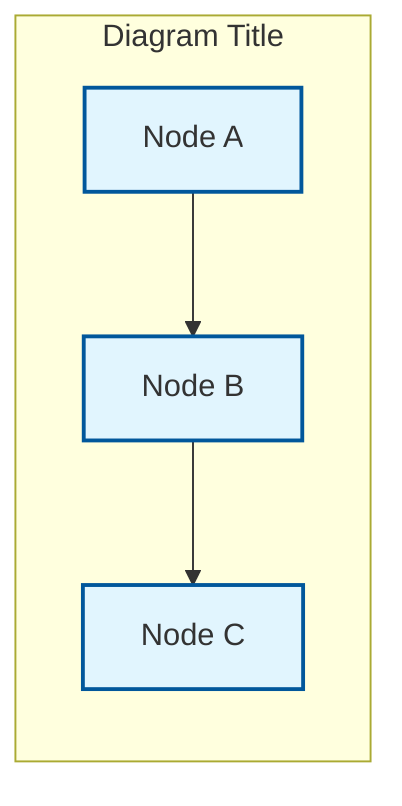

# Visual Architecture Guide - erlmcp v2.1.0

## Overview

This guide provides a comprehensive visual tour of erlmcp's architecture using Mermaid diagrams. With **85+ diagrams** organized into 18 categories, you can understand every aspect of the system from high-level architecture to implementation details.

**Total Diagram Coverage**: 1,173+ lines of Mermaid specifications

## Quick Navigation

### Starting Points for Different Audiences

**New Developers**: Start with [System Architecture](#1-system-overview) → [Module Dependencies](#2-module-dependencies) → [Supervision Tree](#3-supervision-hierarchy)

**Architects**: Start with [System Architecture](#1-system-overview) → [Data Flow](#4-data-flow) → [Deployment](#12-deployment)

**DevOps Engineers**: Start with [Deployment](#12-deployment) → [Monitoring](#16-monitoring) → [Configuration](#13-configuration)

**Security Engineers**: Start with [Security](#14-security) → [Authentication](#14-authentication-flow) → [Audit Logging](#14-audit-logging)

**Test Engineers**: Start with [Testing](#10-testing) → [Quality Gates](#9-validation) → [Error Handling](#11-error-handling)

---

## 1. System Overview

### Primary Diagram: [`system-architecture.mmd`](diagrams/system-architecture.mmd)

**Purpose**: Complete system overview showing all 4 application layers and their relationships

**What You'll Learn**:
- Overall system structure (4 applications, 164 modules)
- Client and server components
- Transport layer (STDIO, TCP, HTTP, WebSocket, SSE)
- Core protocol processing
- Observability integration
- External dependencies (gproc, gun, ranch, poolboy, etc.)

**Key Visual Elements**:
- **Color-coded layers**: Client (blue), Transport (purple), Core (green), Observability (orange), Validation (pink)
- **Data flow arrows**: Show message flow between layers
- **Dependency dashed lines**: Show external library usage

**When to Use**:
- System onboarding
- Architecture presentations
- Understanding component boundaries
- Identifying integration points

**Related Diagrams**:
- [`module-dependencies.mmd`](diagrams/module-dependencies.mmd) - Detailed inter-module dependencies
- [`data-flow.mmd`](diagrams/data-flow.mmd) - Message flow through system
- [`supervision-tree.mmd`](diagrams/supervision-tree.mmd) - OTP supervision structure

---

## 2. Module Dependencies

### Primary Diagram: [`module-dependencies.mmd`](diagrams/module-dependencies.mmd)

**Purpose**: Shows dependency relationships between all 164 modules

**What You'll Learn**:
- Foundation layer (no internal dependencies)
- Core services (depend on foundation)
- Transport layer (depends on foundation + core)
- Observability layer (independent, monitored by core)
- Validation layer (depends on all)

**Key Visual Elements**:
- **Dependency graph**: Nodes = modules, Edges = dependencies
- **Layer colors**: Visual separation of concerns
- **Direction arrows**: Show dependency direction

**When to Use**:
- Understanding impact of code changes
- Refactoring planning
- Dependency analysis
- Identifying circular dependencies

**Quick Reference**:

```
Foundation Layer (No deps):
├── erlmcp_json_rpc
├── erlmcp_message_handler
├── erlmcp_registry
├── erlmcp_auth
├── erlmcp_secrets
├── erlmcp_circuit_breaker
└── erlmcp_rate_limiter

Core Services (Depend on Foundation):
├── erlmcp_client
├── erlmcp_server
├── erlmcp_session_manager
├── erlmcp_resources
├── erlmcp_tool
└── erlmcp_prompt_template

Transport Layer (Depend on Foundation + Core):
├── erlmcp_transport_stdio
├── erlmcp_transport_tcp
├── erlmcp_transport_http
├── erlmcp_transport_ws
└── erlmcp_transport_sse

Observability Layer (Independent):
├── erlmcp_metrics
├── erlmcp_otel
├── erlmcp_dashboard_server
├── erlmcp_chaos
└── erlmcp_recovery_manager

Validation Layer (Depends on All):
├── erlmcp_protocol_validator
├── erlmcp_transport_validator
├── erlmcp_security_validator
├── erlmcp_performance_validator
└── erlmcp_compliance_report
```

**Related Diagrams**:
- [`reference/module-index.mmd`](diagrams/reference/module-index.mmd) - Complete module catalog
- [`system-architecture.mmd`](diagrams/system-architecture.mmd) - High-level view

---

## 3. Supervision Hierarchy

### Primary Diagram: [`supervision-tree.mmd`](diagrams/supervision-tree.mmd)

**Purpose**: Complete 3-tier OTP supervision tree

**What You'll Learn**:
- **TIER 1**: Application supervisors (one_for_all strategy)
  - erlmcp_sup (root)
  - Core, Transports, Observability, Validation supervisors
- **TIER 2**: Service supervisors (simple_one_for_one)
  - Server, Client, Session, Chaos worker supervisors
- **TIER 3**: Isolated workers (process-per-connection)
  - Individual server/client instances
  - Chaos workers
  - Failover workers
- **Standalone Processes**: Monitored but not linked
  - Registry, health monitor, metrics, circuit breaker, etc.

**Key Visual Elements**:
- **Color-coded tiers**: TIER 1 (red), TIER 2 (yellow), TIER 3 (blue), Standalone (purple dashed)
- **Solid lines**: Direct supervision (linked)
- **Dashed lines**: Monitoring (not linked)

**Supervision Strategies**:

| Supervisor | Strategy | Rationale |
|------------|----------|-----------|
| `erlmcp_sup` | `one_for_all` | Application-level restart coordination |
| `erlmcp_core_sup` | `one_for_one` | Core components fail independently |
| `erlmcp_server_sup` | `simple_one_for_one` | Dynamic server instances |
| `erlmcp_client_sup` | `simple_one_for_one` | Dynamic client instances |
| `erlmcp_transport_sup` | `one_for_one` | Transport failures isolated |

**Failure Isolation Guarantees**:

| Component Crash | Restart Scope | Recovery Time | Impact |
|-----------------|---------------|---------------|--------|
| Registry | Registry only | ~500ms | New routing fails; existing connections continue |
| Session Manager | Session Manager only | ~1s | New sessions fail; existing sessions continue |
| Transport (TCP) | That transport only | ~2s | TCP connections drop; HTTP/STDIO unaffected |
| Metrics Server | Metrics Server only | ~500ms | Metrics temporarily unavailable; protocol unaffected |
| Observability | Observability workers | ~500ms | Zero impact on core MCP protocol |

**When to Use**:
- Understanding fault tolerance
- Debugging supervision issues
- Planning restart strategies
- Analyzing failure propagation

**Related Diagrams**:
- [`system-architecture.mmd`](diagrams/system-architecture.mmd) - System context
- [`deployment/failover-mechanisms.mmd`](diagrams/deployment/failover-mechanisms.mmd) - Failover strategies

---

## 4. Data Flow

### Primary Diagram: [`data-flow.mmd`](diagrams/data-flow.mmd)

**Purpose**: Shows complete request/response flow through all system components

**What You'll Learn**:
- **Client Request Flow**:
  1. API call → gen_server:call
  2. Encode request (JSON-RPC)
  3. Send via transport
  4. Await response
  5. Decode response
  6. Return to caller

- **Server Request Handling**:
  1. Receive message from transport
  2. Decode request
  3. Route to handler
  4. Execute handler
  5. Encode response
  6. Send response

- **Observability Integration**:
  - Metrics collection (async)
  - OTEL tracing (non-blocking)
  - Receipt chains (audit trail)

**Key Visual Elements**:
- **Flow arrows**: Sequential processing steps
- **Component boxes**: Each processing stage
- **Async side effects**: Metrics, tracing (dashed lines)

**When to Use**:
- Understanding message processing
- Performance optimization
- Debugging request flows
- Identifying bottlenecks

**Related Diagrams**:
- [`protocol/client-server-interaction.mmd`](diagrams/protocol/client-server-interaction.mmd) - Protocol-level flow
- [`protocol/json-rpc-flow.mmd`](diagrams/protocol/json-rpc-flow.mmd) - JSON-RPC processing
- [`observability/telemetry-flow.mmd`](diagrams/observability/telemetry-flow.mmd) - OTEL pipeline

---

## 5. Protocol Layer

### Key Diagrams

#### 5.1 Client-Server Interaction
**Diagram**: [`protocol/client-server-interaction.mmd`](diagrams/protocol/client-server-interaction.mmd)

**Purpose**: MCP protocol message exchange between client and server

**Shows**:
- Initialize handshake
- Capability exchange
- Resource/tool/prompt operations
- Notification flows
- Error handling

#### 5.2 Session Lifecycle
**Diagram**: [`protocol/session-lifecycle.mmd`](diagrams/protocol/session-lifecycle.mmd)

**Purpose**: State machine for session management

**States**:
```
initialized → connecting → authenticating → ready → active
     ↓            ↓            ↓           ↓       ↓
   failed     disconnected  auth_failed  draining  terminated
```

**State Transitions**:
- `initialize` → `connecting`: Start connection
- `connecting` → `authenticating`: Transport established
- `authenticating` → `ready`: Auth successful
- `ready` → `active`: First operation
- `active` → `draining`: Graceful shutdown
- Any state → `failed`: Error condition

#### 5.3 JSON-RPC Flow
**Diagram**: [`protocol/json-rpc-flow.mmd`](diagrams/protocol/json-rpc-flow.mmd)

**Purpose**: JSON-RPC 2.0 message processing pipeline

**Stages**:
1. **Parse**: Raw binary → JSON term
2. **Validate**: JSON Schema validation
3. **Route**: Method routing to handler
4. **Execute**: Handler function
5. **Respond**: Result → JSON-RPC response
6. **Transport**: Send via transport

#### 5.4 Capability Negotiation
**Diagram**: [`protocol/capability-negotiation.mmd`](diagrams/protocol/capability-negotiation.mmd)

**Purpose**: MCP capability exchange process

**Capabilities**:
- Resources (list, subscribe, read)
- Tools (list, call)
- Prompts (list, get)
- Logging (level support)
- Progress tokens

**When to Use**:
- Understanding protocol details
- Implementing custom handlers
- Debugging protocol issues
- Capability negotiation

---

## 6. Transport Layer

### Key Diagrams

#### 6.1 Transport Types
**Diagram**: [`transports/transport-types.mmd`](diagrams/transports/transport-types.mmd)

**Purpose**: All available transport implementations

**Transports**:
| Transport | Library | Use Case | Performance |
|-----------|---------|----------|-------------|
| **STDIO** | Process I/O | CLI tools, debugging | Low latency |
| **TCP** | ranch | High-performance connections | 553K msg/s |
| **HTTP** | gun | REST APIs, webhooks | HTTP/2 multiplexing |
| **WebSocket** | gun | Full-duplex streaming | Real-time |
| **SSE** | cowboy | Server-to-client events | Simple push |

#### 6.2 Transport Interfaces
**Diagram**: [`transports/transport-interfaces.mmd`](diagrams/transports/transport-interfaces.mmd)

**Purpose**: Transport behavior polymorphism

**Behavior Interface**:
```erlang
-callback init(TransportId, Config) → {ok, State} | {error, Reason}
-callback send(State, Data) → ok | {error, Reason}
-callback close(State) → ok
-optional_callbacks([get_info/1, handle_transport_call/2])
```

**Polymorphism**: All transports implement same interface → transparent swapping

#### 6.3 Connection Pooling
**Diagram**: [`transports/connection-pooling.mmd`](diagrams/transports/connection-pooling.mmd)

**Purpose**: Pool management strategies (poolboy)

**Pool Configuration**:
```erlang
PoolArgs = [
    {name, {local, http_pool}},
    {worker_module, erlmcp_http_worker},
    {size, 10},              % Core workers
    {max_overflow, 5}        % Overflow workers
]
```

**Benefits**:
- Connection reuse
- Resource limiting
- Backpressure handling
- Better performance under load

#### 6.4 Transport Failover
**Diagram**: [`transports/transport-failover.mmd`](diagrams/transports/transport-failover.mmd)

**Purpose**: Failover mechanisms for transport failures

**Failover Strategy**:
1. **Detection**: Monitor detects failure (heartbeat)
2. **Isolation**: Circuit breaker opens
3. **Recovery**: Exponential backoff reconnect
4. **State Sync**: Session state restoration

**When to Use**:
- Choosing transport type
- Understanding transport behavior
- Debugging transport issues
- Implementing custom transports

---

## 7. Observability

### Key Diagrams

#### 7.1 Telemetry Flow
**Diagram**: [`observability/telemetry-flow.mmd`](diagrams/observability/telemetry-flow.mmd)

**Purpose**: OpenTelemetry data pipeline

**Pipeline Stages**:
1. **Span Creation**: OTEL instrumentation
2. **Context Propagation**: Trace ID propagation
3. **Span Export**: Batch export to backend
4. **Aggregation**: Time-series aggregation
5. **Visualization**: Dashboard display

**Exporters**:
- Datadog: `erlmcp_otel_datadog`
- Honeycomb: `erlmcp_otel_honeycomb`
- Jaeger: `erlmcp_otel_jaeger`

#### 7.2 Metrics Collection
**Diagram**: [`observability/metrics-collection.mmd`](diagrams/observability/metrics-collection.mmd)

**Purpose**: Metrics aggregation pipeline

**Metrics**:
| Category | Metrics | Units |
|----------|---------|-------|
| **Throughput** | requests/sec, messages/sec | ops/sec |
| **Latency** | p50, p95, p99 | microseconds |
| **Errors** | error rate, refusal rate | percentage |
| **Resources** | memory, connections, FDs | counts |

**Collection**:
- `erlmcp_metrics`: Core metrics
- `erlmcp_metrics_aggregator`: Time-series aggregation
- `erlmcp_metrics_server`: HTTP `/metrics` endpoint

#### 7.3 Tracing Span Tree
**Diagram**: [`observability/tracing-span-tree.mmd`](diagrams/observability/tracing-span-tree.mmd)

**Purpose**: Distributed tracing span hierarchy

**Span Relationships**:
```
mcp.request (root)
├── mcp.protocol.decode
├── mcp.handler.execute
│   ├── mcp.tool.invoke
│   └── mcp.resource.read
├── mcp.protocol.encode
└── mcp.transport.send
```

**Context Propagation**: Trace ID flows through all spans

#### 7.4 Health Monitoring
**Diagram**: [`observability/health-monitoring.mmd`](diagrams/observability/health-monitoring.mmd)

**Purpose**: Component health check system

**Health Checks**:
- Registry: gproc connectivity
- Transports: Connection status
- Sessions: Active/failed counts
- Resources: Memory, CPU, FDs

**Dashboard**: `erlmcp_dashboard_server` (WebSocket + HTTP)

#### 7.5 Chaos Testing
**Diagram**: [`observability/chaos-testing.mmd`](diagrams/observability/chaos-testing.mmd)

**Purpose**: Resilience testing framework

**Chaos Scenarios** (11 types):
- Network: latency, packet loss
- Process: kill, spawn storm
- Resource: memory exhaustion, CPU saturation

**Recovery Target**: All failures recover in < 5s

**When to Use**:
- Understanding observability
- Debugging performance issues
- Implementing custom metrics
- Chaos testing

---

## 8. Session Management

### Key Diagrams

#### 8.1 Session Lifecycle
**Diagram**: [`protocol/session-lifecycle.mmd`](diagrams/protocol/session-lifecycle.mmd)

**Purpose**: Complete session state machine

**Session States**:
- `initialized`: Session created
- `connecting`: Transport connection in progress
- `authenticating`: Authentication in progress
- `ready`: Authenticated, ready for operations
- `active`: Processing operations
- `draining`: Graceful shutdown in progress
- `terminated`: Session closed
- `failed`: Error state

**State Transitions** (guarded):
```
initialized → connecting: connect()
connecting → authenticating: transport_connected()
authenticating → ready: auth_success()
authenticating → failed: auth_failure()
ready → active: first_operation()
active → draining: shutdown_request()
draining → terminated: cleanup_complete()
any → failed: error_condition()
```

**Backend Storage**:
- **ETS**: In-memory (fastest)
- **DETS**: Disk persistence (durable)
- **Mnesia**: Distributed (clustered)

**When to Use**:
- Understanding session management
- Debugging session issues
- Implementing custom backends
- Session failover

---

## 9. Validation

### Key Diagrams

#### 9.1 Quality Gates
**Diagram**: [`validation/quality-gates.mmd`](diagrams/validation/quality-gates.mmd)

**Purpose**: Validation pipeline for quality enforcement

**8 Quality Gates**:
1. **SHACL Validation**: Ontology conformance (100% required)
2. **Compilation**: Zero-error builds
3. **Test Execution**: 95% pass rate, 80% coverage
4. **Security Scan**: Zero critical vulnerabilities
5. **Deterministic Build**: Reproducibility verification
6. **Quality Metrics**: Production thresholds
7. **Release Verification**: SBOM, licenses
8. **Smoke Test**: Basic functionality

**Gate Flow**: Sequential blocking gates (Jidoka - stop the line)

#### 9.2 Test Coverage
**Diagram**: [`validation/test-coverage.mmd`](diagrams/validation/test-coverage.mmd)

**Purpose**: Test coverage strategy and targets

**Coverage Requirements**:
- **Unit tests**: 80% minimum (EUnit)
- **Integration tests**: 70% minimum (CommonTest)
- **Property tests**: Generative testing (Proper)
- **Critical paths**: 100% coverage mandatory

**Coverage Measurement**:
```bash
rebar3 cover --verbose
# Target: ≥80% across all modules
```

#### 9.3 Compliance Reporting
**Diagram**: [`validation/compliance-reporting.mmd`](diagrams/validation/compliance-reporting.mmd)

**Purpose**: Report generation pipeline

**Report Types**:
- HTML: Visual report with charts
- JSON: Machine-readable format
- Console: CI/CD integration

**Validation Categories**:
- Protocol compliance (JSON-RPC + MCP)
- Transport behavior compliance
- Security (auth + secrets + input validation)
- Performance (latency + throughput + memory)

#### 9.4 Benchmarking Framework
**Diagram**: [`validation/benchmarking-framework.mmd`](diagrams/validation/benchmarking-framework.mmd)

**Purpose**: Performance validation system

**Benchmark Suites**:
1. **Core Operations**: Registry, queue, pool, session
2. **Network Real**: TCP/HTTP real sockets
3. **Stress**: Sustained load (30s, 5min, 1hr, 24hr)
4. **Chaos**: 11 failure scenarios
5. **Integration**: MCP workflows

**Performance Baseline** (Jan 2026):
- Registry: 553K msg/s
- Queue: 971K msg/s
- Pool: 149K msg/s
- Network: 43K msg/s (4KB packets)
- Sustained: 372K msg/s (60M ops/30s)

**When to Use**:
- Understanding quality gates
- Running compliance checks
- Performance validation
- Release verification

---

## 10. Testing

### Key Diagrams

#### 10.1 Test Coverage Map
**Diagram**: [`testing/test-coverage-map.mmd`](diagrams/testing/test-coverage-map.mmd)

**Purpose**: Test organization and coverage strategy

**Test Layers**:
- **Unit Tests**: EUnit, module-level
- **Integration Tests**: CommonTest, cross-module
- **Property Tests**: Proper, generative
- **End-to-End Tests**: MCP workflow validation

**Test Distribution**:
```
test/
├── erlmcp_core/       (84 EUnit modules)
│   ├── unit/          (isolated module tests)
│   ├── integration/   (cross-module tests)
│   └── properties/    (Proper test suites)
├── erlmcp_transports/ (CT suites)
├── erlmcp_observability/ (CT suites)
└── erlmcp_validation/ (CT suites)
```

#### 10.2 Unit Test Flow
**Diagram**: [`testing/unit-test-flow.mmd`](diagrams/testing/unit-test-flow.mmd)

**Purpose**: Unit testing process (Chicago School TDD)

**Chicago School TDD Principles**:
1. **Write test FIRST** (test before implementation)
2. **NO mocks/fakes** (real processes only)
3. **Black-box testing** (test observable behavior)
4. **Test doubles only for external dependencies**

**Test Pattern**:
```erlang
%% 1. Write failing test
tool_call_test() ->
    ?assertEqual({ok, result}, erlmcp_server:call_tool(...)).

%% 2. Run test (fails)
%% 3. Implement minimal code to pass
%% 4. Refactor
%% 5. Repeat
```

#### 10.3 Integration Tests
**Diagram**: [`testing/integration-tests.mmd`](diagrams/testing/integration-tests.mmd)

**Purpose**: Cross-module integration testing

**Integration Test Suites**:
- Client-Server integration
- Transport integration (all types)
- Session management integration
- Observability integration

**Test Environment**:
- Real Erlang nodes (not mocks)
- Real transports (TCP, HTTP, etc.)
- Real JSON-RPC messages
- Complete MCP workflows

#### 10.4 Property Testing
**Diagram**: [`testing/property-testing.mmd`](diagrams/testing/property-testing.mmd)

**Purpose**: Property-based testing with Proper

**Property Examples**:
```erlang
%% Round-trip property
prop_json_rpc_encode_decode() ->
    ?FORALL(Request, json_rpc_request(),
        begin
            Encoded = encode(Request),
            Decoded = decode(Encoded),
            Request =:= Decoded
        end).

%% Idempotency property
prop_resource_subscribe_idempotent() ->
    ?FORALL(Uri, binary(),
        begin
            {ok, Server} = start_server(),
            ok = erlmcp_server:subscribe_resource(Server, Uri, self()),
            ok = erlmcp_server:subscribe_resource(Server, Uri, self()),
            % Should not duplicate subscriber
            receive
                {resource_changed, Uri, _} -> true
            after 100 ->
                false
            end
        end).
```

**When to Use**:
- Understanding test strategy
- Writing new tests
- Debugging test failures
- Coverage analysis

---

## 11. Error Handling

### Key Diagrams

#### 11.1 Error Flow
**Diagram**: [`errors/error-flow.mmd`](diagrams/errors/error-flow.mmd)

**Purpose**: Error propagation through system

**Error Categories**:
- **Protocol errors**: JSON-RPC parse failures, invalid requests
- **Transport errors**: Connection failures, timeouts
- **Application errors**: Handler failures, validation errors
- **System errors**: Out of memory, file descriptor exhaustion

**Error Handling Flow**:
```
Error Detected
    ↓
Error Classification
    ↓
Recovery Strategy Selection
    ↓
┌───────────────┬───────────────┬───────────────┐
Retry          Circuit Breaker  Graceful        Fallback
(Transient)     (System overload) Degradation    (Backup)
    ↓               ↓                   ↓             ↓
Success         Open Circuit        Limited        Backup Service
or Failure      (Stop Requests)     Functionality
```

#### 11.2 Circuit Breakers
**Diagram**: [`errors/circuit-breakers.mmd`](diagrams/errors/circuit-breakers.mmd)

**Purpose**: Circuit breaker pattern implementation

**Circuit States**:
- **Closed**: Normal operation (requests pass through)
- **Open**: Failure threshold exceeded (requests blocked)
- **Half-Open**: Testing recovery (allow limited requests)

**State Transitions**:
```
Closed --[failure threshold reached]--> Open
Open --[timeout expired]--> Half-Open
Half-Open --[test success]--> Closed
Half-Open --[test failure]--> Open
```

**Configuration**:
```erlang
#circuit_breaker{
    threshold = 5,           % Failures to trip
    timeout = 30000,         % Open state duration (ms)
    half_open_max_calls = 3 % Test calls in half-open
}
```

#### 11.3 Retry Mechanisms
**Diagram**: [`errors/retry-mechanisms.mmd`](diagrams/errors/retry-mechanisms.mmd)

**Purpose**: Retry strategies for transient failures

**Retry Strategies**:
- **Exponential backoff**: 1s, 2s, 4s, 8s, 16s
- **Jitter**: Randomization to avoid thundering herd
- **Max retries**: Configurable limit
- **Retryable errors**: Filter by error type

**Retry Flow**:
```
Request Failed
    ↓
Is Retryable Error?
    ↓ Yes
Calculate Backoff (exponential + jitter)
    ↓
Max Retries Reached?
    ↓ No
Retry Request
    ↓
Success ───────→ Return Result
```

#### 11.4 Graceful Degradation
**Diagram**: [`errors/graceful-degradation.mmd`](diagrams/errors/graceful-degradation.mmd)

**Purpose**: Degradation modes under load

**Degradation Levels**:
- **Level 0 (Normal)**: Full functionality
- **Level 1 (High Load)**: Disable optional features
- **Level 2 (Overload)**: Rate limit new connections
- **Level 3 (Critical)**: Reject non-critical requests
- **Level 4 (Emergency)**: Maintain core services only

**Degradation Triggers**:
- CPU saturation (>90%)
- Memory pressure (>80%)
- Connection limit (>90% of max)
- Response time degradation (>5s p95)

**When to Use**:
- Understanding error handling
- Debugging errors
- Implementing custom error handlers
- Configuring resilience

---

## 12. Deployment

### Key Diagrams

#### 12.1 Cluster Topology
**Diagram**: [`deployment/cluster-topology.mmd`](diagrams/deployment/cluster-topology.mmd)

**Purpose**: Distributed cluster architecture

**Cluster Configurations**:
- **Single Node**: Development, testing
- **Active-Passive**: Simple HA (2 nodes)
- **Active-Active**: Load balancing (3+ nodes)
- **Multi-Region**: Geo-distributed (multiple clusters)

**Node Types**:
- **Core nodes**: Run MCP servers/clients
- **Transport nodes**: Handle network I/O
- **Observability nodes**: Metrics, tracing, dashboards
- **Coordinator nodes**: Cluster management (gproc_dist)

**Clustering**: Mnesia + gproc for distributed registry

#### 12.2 Load Balancing
**Diagram**: [`deployment/load-balancing.mmd`](diagrams/deployment/load-balancing.mmd)

**Purpose**: Load distribution strategies

**Load Balancing Methods**:
- **Round-robin**: Equal distribution
- **Least connections**: Route to least busy node
- **Hash-based**: Consistent routing (session affinity)
- **Geographic**: Route to nearest region

**Load Balancer Options**:
- HAProxy (layer 4)
- Nginx (layer 7)
- Envoy (service mesh)
- Kubernetes Service (cluster IP)

#### 12.3 Failover Mechanisms
**Diagram**: [`deployment/failover-mechanisms.mmd`](diagrams/deployment/failover-mechanisms.mmd)

**Purpose**: Failover strategies for high availability

**Failover Scenarios**:
- **Node failure**: Automatic failover to healthy node
- **Network partition**: Split-brain detection and resolution
- **Transport failure**: Alternate transport routes
- **Data center failure**: Multi-region failover

**Failover Process**:
1. **Detection**: Health monitor detects failure
2. **Notification**: Alert sent to operators
3. **Failover**: Traffic redirected to backup
4. **Recovery**: Failed node recovered
5. **Failback**: Optional traffic return

**RTO**: < 30s (Recovery Time Objective)
**RPO**: < 1s (Recovery Point Objective) with Mnesia replication

#### 12.4 Infrastructure Components
**Diagram**: [`deployment/infrastructure-components.mmd`](diagrams/deployment/infrastructure-components.mmd)

**Purpose**: Complete deployment stack

**Infrastructure Layers**:
```
┌─────────────────────────────────────┐
│  Load Balancer (HAProxy/Nginx)      │
├─────────────────────────────────────┤
│  erlmcp Nodes (3+ instances)        │
│  ├── Core (MCP servers/clients)     │
│  ├── Transports (TCP, HTTP, WS)     │
│  ├── Observability (metrics, traces) │
│  └── Mnesia (distributed DB)        │
├─────────────────────────────────────┤
│  Data Layer                         │
│  ├── Mnesia (replicated)            │
│  ├── DETS (disk persistence)        │
│  └── ETS (in-memory cache)          │
├─────────────────────────────────────┤
│  Observability Stack                │
│  ├── Datadog/Jaeger (traces)       │
│  ├── Prometheus (metrics)           │
│  └── Grafana (dashboards)           │
└─────────────────────────────────────┘
```

#### 12.5 Scaling Strategies
**Diagram**: [`deployment/scaling-strategies.mmd`](diagrams/deployment/scaling-strategies.mmd)

**Purpose**: Horizontal and vertical scaling approaches

**Horizontal Scaling**:
- Add more nodes to cluster
- Load balancing across nodes
- Mnesia data sharding
- Capacity: 40-50K connections per node → 200K+ connections (5 nodes)

**Vertical Scaling**:
- Increase CPU cores (linear scaling)
- Add memory (more sessions/cache)
- Faster network (10GbE)
- Diminishing returns beyond 16 cores

**Auto-Scaling** (Kubernetes):
```yaml
apiVersion: autoscaling/v2
kind: HorizontalPodAutoscaler
metadata:
  name: erlmcp-hpa
spec:
  scaleTargetRef:
    apiVersion: apps/v1
    kind: Deployment
    name: erlmcp
  minReplicas: 3
  maxReplicas: 10
  metrics:
  - type: Resource
    resource:
      name: cpu
      target:
        type: Utilization
        averageUtilization: 70
```

**When to Use**:
- Planning deployment
- Designing HA architecture
- Scaling capacity planning
- Multi-region setup

---

## 13. Configuration

### Key Diagrams

#### 13.1 Configuration Hierarchy
**Diagram**: [`configuration/configuration-hierarchy.mmd`](diagrams/configuration/configuration-hierarchy.mmd)

**Purpose**: Configuration layer precedence

**Configuration Layers** (highest to lowest priority):
1. **Environment variables**: Runtime overrides
2. `sys.config`: Release configuration
3. `vm.args`: VM arguments
4. `.app.src`: Application defaults
5. Code defaults: Fallback values

**Example Priority**:
```erlang
% .app.src default
{env, [{max_connections, 100}]}.

% sys.config override
[{erlmcp, [{max_connections, 1000}]}].

% Environment variable override
ERLMCP_MAX_CONNECTIONS=5000
% Result: 5000 (env var wins)
```

#### 13.2 Environment Variables
**Diagram**: [`configuration/environment-variables.mmd`](diagrams/configuration/environment-variables.mmd)

**Purpose**: Environment-based configuration

**Key Environment Variables**:
```bash
# Core
ERLMCP_MAX_CONNECTIONS=5000
ERLMCP_LOG_LEVEL=info
ERLMCP_NODE_NAME=erlmcp@127.0.0.1

# Transports
ERLMCP_TCP_PORT=3000
ERLMCP_HTTP_PORT=3001
ERLMCP_WS_PORT=3002

# Observability
ERLMCP_OTEL_ENABLED=true
ERLMCP_OTEL_EXPORTER=otlp
ERLMCP_OTEL_ENDPOINT=http://jaeger:4318

# Security
ERLMCP_AUTH_ENABLED=false
ERLMCP_SECRET_BACKEND=local_encrypted
ERLMCP_SECRET_KEY=/path/to/key
```

#### 13.3 Feature Flags
**Diagram**: [`configuration/feature-flags.mmd`](diagrams/configuration/feature-flags.mmd)

**Purpose**: Dynamic feature toggles

**Feature Flags**:
```erlang
%% Enable/disable features at runtime
{feature_flags, #{
    experimental_transport => false,
    llm_integration => true,
    advanced_caching => true,
    chaos_testing => false
}}.
```

**Runtime Toggle**:
```erlang
%% Enable feature
erlmcp_features:enable(experimental_transport).

%% Check feature
case erlmcp_features:is_enabled(experimental_transport) of
    true -> use_experimental_transport();
    false -> use_standard_transport()
end.
```

#### 13.4 Validation Pipeline
**Diagram**: [`configuration/validation-pipeline.mmd`](diagrams/configuration/validation-pipeline.mmd)

**Purpose**: Configuration validation process

**Validation Stages**:
1. **Schema validation**: JSON Schema for config structure
2. **Type checking**: Validate data types
3. **Range checking**: Validate value ranges
4. **Dependency checking**: Validate interdependencies
5. **Runtime validation**: Validate against system state

**Validation Errors**:
- Block startup if critical config invalid
- Warn on non-critical issues
- Provide corrective suggestions

#### 13.5 Runtime Config
**Diagram**: [`configuration/runtime-config.mmd`](diagrams/configuration/runtime-config.mmd)

**Purpose**: Dynamic configuration updates

**Runtime Configuration**:
```erlang
%% Update config at runtime
erlmcp_config:set(max_connections, 10000).

%% Subscribe to config changes
erlmcp_config:subscribe(fun(Key, Value) ->
    logger:info("Config changed: ~p = ~p", [Key, Value])
end).

%% Reload configuration
erlmcp_config:reload().
```

**Hot Reload**:
- No restart required
- Atomic updates
- Rollback on error
- Notification hooks

**When to Use**:
- Understanding configuration
- Deploying to production
- Dynamic configuration
- Feature flags

---

## 14. Security

### Key Diagrams

#### 14.1 Authentication Flow
**Diagram**: [`security/authentication-flow.mmd`](diagrams/security/authentication-flow.mmd)

**Purpose**: Authentication and authorization process

**Authentication Methods**:
- **No auth**: Development/testing (default)
- **API keys**: Simple key-based auth
- **JWT**: Token-based auth (jose library)
- **mTLS**: Mutual TLS (certificate-based)
- **OAuth 2.0**: Third-party auth (future)

**JWT Auth Flow**:
```
Client Request (no token)
    ↓
Server returns 401 Unauthorized
    ↓
Client retrieves JWT from auth server
    ↓
Client retries request with Authorization: Bearer <jwt>
    ↓
Server validates JWT signature (jose)
    ↓
Server extracts claims (permissions)
    ↓
Server authorizes request
    ↓
Request processed
```

#### 14.2 Secrets Management
**Diagram**: [`security/secrets-management.mmd`](diagrams/security/secrets-management.mmd)

**Purpose**: Secret storage and access

**Secret Backends**:
- **HashiCorp Vault**: Production (encrypted, audit trail)
- **AWS Secrets Manager**: AWS deployments
- **Local encrypted**: Development (AES-256 encrypted file)

**Vault Integration**:
```erlang
%% Configure Vault
{erlmcp_secrets, [
    {backend, vault},
    {backend_config, #{
        address => "https://vault:8200",
        auth_method => approle,
        role_id => "your-role-id",
        secret_id => "your-secret-id",
        engine => "kv",
        mount => "secret"
    }},
    {ttl_seconds, 300}  % Cache for 5 minutes
]}.
```

**Secret Access**:
```erlang
%% Retrieve secret
{ok, Secret} = erlmcp_secrets:get("database/password").
```

#### 14.3 Transport Security
**Diagram**: [`security/transport-security.mmd`](diagrams/security/transport-security.mmd)

**Purpose**: TLS implementation for transports

**TLS Configuration**:
```erlang
%% TCP with TLS
{transport_ssl_opts, [
    {certfile, "/path/to/cert.pem"},
    {keyfile, "/path/to/key.pem"},
    {cacertfile, "/path/to/ca.pem"},
    {verify, verify_peer},
    {fail_if_no_peer_cert, true}
]}.
```

**TLS Versions**: TLS 1.2, TLS 1.3 (recommended)
**Cipher Suites**: Only secure suites (no CBC, no RC4)

#### 14.4 Data Protection
**Diagram**: [`security/data-protection.mmd`](diagrams/security/data-protection.mmd)

**Purpose**: Data encryption and protection

**Encryption**:
- **At rest**: DETS disk encryption, Mnesia encryption
- **In transit**: TLS for all network traffic
- **In memory**: Erlang process isolation

**PII Handling**:
- Identify PII fields in configuration
- Encrypt PII at rest
- Log sanitization (no PII in logs)
- GDPR compliance support

#### 14.5 Audit Logging
**Diagram**: [`security/audit-logging.mmd`](diagrams/security/audit-logging.mmd)

**Purpose**: Immutable audit trail with cryptographic receipts

**Audit Log Contents**:
```
[2026-01-31 12:34:56] AUTH_SUCCESS user=john@example.com ip=192.168.1.100
[2026-01-31 12:35:01] TOOL_CALL tool=analyze_data user=john@example.com
[2026-01-31 12:35:02] RESOURCE_READ resource=logs/app.log user=john@example.com
[2026-01-31 12:35:10] AUTH_LOGOUT user=john@example.com
```

**Receipt Chain**:
- SHA-256 hash chain for integrity
- Tamper-evident (chain breaks if modified)
- Cryptographic proof of sequence

**When to Use**:
- Understanding security
- Implementing authentication
- Securing deployments
- Compliance requirements

---

## 15. API

### Key Diagrams

#### 15.1 API Endpoints
**Diagram**: [`api/api-endpoints.mmd`](diagrams/api/api-endpoints.mmd)

**Purpose**: HTTP API structure

**API Endpoints**:
| Method | Path | Purpose |
|--------|------|---------|
| GET | `/metrics` | Prometheus metrics |
| GET | `/health` | Health check |
| GET | `/dashboard` | Web dashboard |
| WS | `/dashboard/ws` | WebSocket for real-time updates |
| POST | `/admin/reload` | Reload configuration (admin) |

**Metrics Endpoint** (`/metrics`):
```
# HELP erlmcp_requests_total Total requests
# TYPE erlmcp_requests_total counter
erlmcp_requests_total{method="tools/call",transport="http"} 12345

# HELP erlmcp_request_duration_seconds Request duration
# TYPE erlmcp_request_duration_seconds histogram
erlmcp_request_duration_seconds_bucket{le="0.001"} 100
erlmcp_request_duration_seconds_bucket{le="0.01"} 500
erlmcp_request_duration_seconds_bucket{le="+Inf"} 1000
```

#### 15.2 Request-Response Flow
**Diagram**: [`api/request-response-flow.mmd`](diagrams/api/request-response-flow.mmd)

**Purpose**: API message flow

**Request Processing**:
```
HTTP Request
    ↓
Authentication (if enabled)
    ↓
Rate Limiting
    ↓
Request Validation
    ↓
Route to Handler
    ↓
Execute Handler
    ↓
Response Encoding
    ↓
HTTP Response
```

#### 15.3 Rate Limiting
**Diagram**: [`api/rate-limiting.mmd`](diagrams/api/rate-limiting.mmd)

**Purpose**: API rate limiting strategies

**Rate Limiting Algorithms**:
- **Token bucket**: Burst capacity + steady rate
- **Leaky bucket**: Smooth rate limiting
- **Fixed window**: Reset per time period
- **Sliding window**: More accurate tracking

**Configuration**:
```erlang
{erlmcp_rate_limiter, [
    {limits, [
        {global, #{rate => 10000, window => 60}},  % 10K req/min globally
        {per_ip, #{rate => 100, window => 60}}     % 100 req/min per IP
    ]}
]}.
```

**When to Use**:
- Understanding HTTP API
- Integrating with monitoring
- Rate limiting configuration
- Custom API endpoints

---

## 16. Monitoring

### Key Diagrams

#### 16.1 Metrics Collection
**Diagram**: [`monitoring/metrics-collection.mmd`](diagrams/monitoring/metrics-collection.mmd)

**Purpose**: Metrics pipeline architecture

**Metrics Pipeline**:
```
Application Metrics
    ↓
erlmcp_metrics (collection)
    ↓
erlmcp_metrics_aggregator (time-series, percentiles)
    ↓
erlmcp_metrics_server (HTTP /metrics endpoint)
    ↓
Prometheus (scrape endpoint)
    ↓
Grafana (visualization)
```

**Metric Types**:
- **Counter**: Monotonically increasing (requests, errors)
- **Gauge**: Current value (connections, memory)
- **Histogram**: Distribution (latency)
- **Summary**: Percentiles (p50, p95, p99)

#### 16.2 Dashboard Structure
**Diagram**: [`monitoring/dashboard-structure.mmd`](diagrams/monitoring/dashboard-structure.mmd)

**Purpose**: Real-time dashboard layout

**Dashboard Components**:
- **Overview**: System health, request rate, error rate
- **Performance**: Latency percentiles, throughput
- **Resources**: CPU, memory, file descriptors
- **Transports**: Connection counts per transport
- **MCP Operations**: Tool calls, resource reads
- **Errors**: Error rate by category

**Real-time Updates**:
- WebSocket connection (`/dashboard/ws`)
- Push updates every 1s
- Server-Sent Events fallback

#### 16.3 Alerting Workflow
**Diagram**: [`monitoring/alerting-workflow.mmd`](diagrams/monitoring/alerting-workflow.mmd)

**Purpose**: Alert routing and notification

**Alert Conditions**:
- High error rate (>5%)
- High latency (p95 > 5s)
- Connection limit (>90% of max)
- Memory pressure (>80%)
- Node down (health check fails)

**Alert Routing**:
```
Alert Triggered
    ↓
Severity Assessment (critical/warning/info)
    ↓
Alert Enrichment (add context)
    ↓
Route to Notifier
    ├→ Slack (warning, info)
    ├→ PagerDuty (critical)
    ├→ Email (all alerts)
    └→ Custom webhook
```

**When to Use**:
- Understanding monitoring
- Debugging production issues
- Setting up dashboards
- Configuring alerts

---

## 17. Integration

### Key Diagrams

#### 17.1 External Services
**Diagram**: [`integration/external-services.mmd`](diagrams/integration/external-services.mmd)

**Purpose**: Service integration patterns

**External Services**:
- **LLM Providers**: Anthropic (Claude), OpenAI (GPT), Local models
- **Message Queues**: RabbitMQ, Kafka (future)
- **Databases**: PostgreSQL, Redis (future)
- **Object Storage**: S3, GCS (future)

**Integration Pattern**:
```erlang
%% LLM provider integration
{erlmcp_llm_provider, anthropic, #{
    api_key => {env_var, "ANTHROPIC_API_KEY"},
    model => "claude-3-opus-20240229",
    max_tokens => 4096,
    timeout => 30000
}}.
```

#### 17.2 API Gateway
**Diagram**: [`integration/api-gateway.mmd`](diagrams/integration/api-gateway.mmd)

**Purpose**: Gateway integration patterns

**Gateway Features**:
- **Routing**: Path-based routing to services
- **Authentication**: Centralized auth
- **Rate limiting**: Global rate limits
- **TLS termination**: Offload SSL

**Gateway Options**:
- Kong (API gateway)
- Traefik (cloud-native)
- AWS API Gateway
- Azure API Management

#### 17.3 Message Bus
**Diagram**: [`integration/message-bus.mmd`](diagrams/integration/message-bus.mmd)

**Purpose**: Message bus integration for async events

**Message Patterns**:
- **Pub/Sub**: Event broadcasting
- **Queue**: Work queuing
- **RPC**: Synchronous messaging

**Message Bus Options**:
- RabbitMQ (AMQP)
- Kafka (high throughput)
- Redis Streams (lightweight)
- Google Pub/Sub (managed)

**When to Use**:
- Integrating with external systems
- API gateway setup
- Message bus integration

---

## 18. Development

### Key Diagrams

#### 18.1 TDD Workflow
**Diagram**: [`development/tdd-workflow.mmd`](diagrams/development/tdd-workflow.mmd)

**Purpose**: Test-driven development process

**Chicago School TDD**:
1. **Write failing test** (Red)
2. **Run test** (confirm failure)
3. **Write minimal code** to pass (Green)
4. **Run test** (confirm pass)
5. **Refactor** (improve code)
6. **Repeat**

**Key Principles**:
- **No mocks**: Use real processes
- **Black-box testing**: Test behavior, not implementation
- **Test doubles only** for external dependencies

#### 18.2 CI/CD Pipeline
**Diagram**: [`development/ci-cd-pipeline.mmd`](diagrams/development/ci-cd-pipeline.mmd)

**Purpose**: Continuous integration and deployment

**CI/CD Stages**:
```
Push to GitHub
    ↓
GitHub Actions Triggered
    ↓
Stage 1: Build (compile)
    ↓
Stage 2: Test (eunit, ct, proper)
    ↓
Stage 3: Quality (dialyzer, xref, cover)
    ↓
Stage 4: Security (bandit)
    ↓
Stage 5: Release (rebar3 release)
    ↓
Stage 6: Deploy (Kubernetes/Docker)
```

**Quality Gates** (blocking):
- All tests pass (100% pass rate)
- Coverage ≥ 80%
- Zero dialyzer warnings
- Zero security vulnerabilities

#### 18.3 Deployment Flow
**Diagram**: [`development/deployment-flow.mmd`](diagrams/development/deployment-flow.mmd)

**Purpose**: Deployment process

**Deployment Steps**:
1. **Pre-deployment checklist**
2. **Backup current deployment**
3. **Build new release** (`rebar3 as prod release`)
4. **Smoke test** (basic functionality)
5. **Blue-green deployment** (zero downtime)
6. **Health checks** (verify new deployment)
7. **Rollback if needed**

**When to Use**:
- Understanding development workflow
- Setting up CI/CD
- Deployment automation

---

## 19. Examples

### Key Diagrams

#### 19.1 Basic Request
**Diagram**: [`examples/basic-request.mmd`](diagrams/examples/basic-request.mmd)

**Purpose**: Simple tool call request flow

**Example Flow**:
```
Client: tools/call (name="get_weather", args={"location": "NYC"})
    ↓
Server: Execute tool handler
    ↓
Tool: Fetch weather data
    ↓
Server: Return result
    ↓
Client: Receive response
```

#### 19.2 Complex Workflow
**Diagram**: [`examples/complex-workflow.mmd`](diagrams/examples/complex-workflow.mmd)

**Purpose**: Multi-step workflow example

**Workflow**: Read resource → Process data → Call tool → Update resource

#### 19.3 Error Scenario
**Diagram**: [`examples/error-scenario.mmd`](diagrams/examples/error-scenario.mmd)

**Purpose**: Error handling example

**Scenario**: Tool call fails → Retry → Circuit breaker opens → Graceful degradation

**When to Use**:
- Learning by example
- Debugging workflows
- Understanding error handling

---

## 20. Reference

### Key Diagrams

#### 20.1 Module Index
**Diagram**: [`reference/module-index.mmd`](diagrams/reference/module-index.mmd)

**Purpose**: Complete module catalog (164 modules)

**Module Categories**:
- **Core**: 97 modules (protocol, sessions, MCP, security, resilience)
- **Transports**: 23 modules (implementations, infrastructure, security)
- **Observability**: 31 modules (OTEL, metrics, chaos, debugging)
- **Validation**: 13 modules (validators, compliance, spec parser)

#### 20.2 Error Codes
**Diagram**: [`reference/error-codes.mmd`](diagrams/reference/error-codes.mmd)

**Purpose**: MCP error code reference

**Error Codes** ([1001-1089]):
- **Parse errors**: -32700, -32701, -32702
- **Request errors**: -32600, -32601, -32602, -32603
- **Server errors**: -32000 to -32099
- **MCP errors**: 1001 to 1089

#### 20.3 Troubleshooting Guide
**Diagram**: [`reference/troubleshooting-guide.mmd`](diagrams/reference/troubleshooting-guide.mmd)

**Purpose**: Common issues and solutions

**Common Issues**:
- Connection refused → Check port, firewall
- High memory → Increase heap, check for leaks
- Slow performance → Check CPU, profile with epmd
- Transport failure → Check transport config, retry logic

**When to Use**:
- Looking up module info
- Error code reference
- Troubleshooting issues

---

## Diagram Rendering Guide

### Viewing Diagrams

**GitHub**: Native rendering (push .mmd files to repo)
```bash
git add docs/diagrams/*.mmd
git commit -m "Add Mermaid diagrams"
git push
```

**CLI**: Mermaid CLI
```bash
npm install -g @mermaid-js/mermaid-cli
mmdc -i diagram.mmd -o diagram.png
```

**Web**: Mermaid Live Editor
1. Go to https://mermaid.live
2. Paste diagram content
3. Export as PNG/SVG

**VS Code**: Mermaid Preview
```bash
code --install-extension bierner.markdown-mermaid
# Open .mmd file, press Ctrl+Shift+V
```

### Creating New Diagrams

**Diagram Template**:


**Best Practices**:
- Use `subgraph` for grouping
- Add `direction` (TB, LR, RL)
- Use `classDef` for consistent styling
- Add comments for clarity
- Keep diagrams < 500 lines for maintainability

### Diagram Naming Conventions

**File Naming**:
- Lowercase with hyphens: `system-architecture.mmd`
- Category prefix: `protocol/session-lifecycle.mmd`
- Descriptive name: `transport-connection-pooling.mmd`

**Diagram Titles**:
- Descriptive and specific
- Include version if applicable
- Example: "erlmcp System Architecture v2.1.0"

---

## Quick Reference Card

### Most-Used Diagrams

| Task | Diagram | Location |
|------|---------|----------|
| **System Overview** | System Architecture | `system-architecture.mmd` |
| **Understanding Failures** | Supervision Tree | `supervision-tree.mmd` |
| **Debugging Request Flow** | Data Flow | `data-flow.mmd` |
| **Protocol Issues** | Client-Server Interaction | `protocol/client-server-interaction.mmd` |
| **Transport Problems** | Transport Types | `transports/transport-types.mmd` |
| **Performance Issues** | Metrics Collection | `observability/metrics-collection.mmd` |
| **Test Failures** | Unit Test Flow | `testing/unit-test-flow.mmd` |
| **Errors** | Circuit Breakers | `errors/circuit-breakers.mmd` |
| **Deployment** | Cluster Topology | `deployment/cluster-topology.mmd` |
| **Configuration** | Configuration Hierarchy | `configuration/configuration-hierarchy.mmd` |
| **Security Issues** | Authentication Flow | `security/authentication-flow.mmd` |
| **API Integration** | API Endpoints | `api/api-endpoints.mmd` |
| **Production Issues** | Health Monitoring | `observability/health-monitoring.mmd` |

---

## Conclusion

This visual architecture guide provides comprehensive coverage of erlmcp v2.1.0 through **85+ Mermaid diagrams** organized into **18 categories**. Each diagram serves a specific purpose and can be used independently or in combination with others.

**Next Steps**:
1. Explore diagrams relevant to your role
2. Render diagrams for presentations
3. Create custom diagrams for specific use cases
4. Contribute new diagrams to the collection

**Resources**:
- **All diagrams**: `/docs/diagrams/`
- **Architecture doc**: `/docs/architecture.md`
- **OTP patterns**: `/docs/otp-patterns.md`
- **Module index**: `/docs/MODULE_INDEX.md`

**Total Visual Documentation**: 1,173+ lines of Mermaid specifications covering every aspect of the system.
