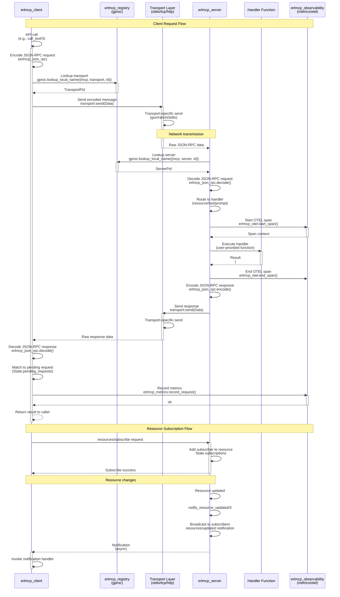
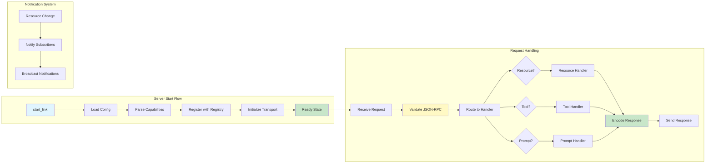

# erlmcp API Reference

## API Architecture Overview

```mermaid
graph TB
    subgraph "Client API"
        C_START[erlmcp_client:start_link<br/>TransportOpts, Options]
        C_INIT[initialize<br/>Capabilities]
        C_RES_LIST[list_resources]
        C_RES_READ[read_resource<br/>Uri]
        C_RES_SUB[subscribe_to_resource<br/>Uri]
        C_RES_UNSUB[unsubscribe_from_resource<br/>Uri]
        C_TOOL_LIST[list_tools]
        C_TOOL_CALL[call_tool<br/>Name, Arguments]
        C_PROMPT_LIST[list_prompts]
        C_PROMPT_GET[get_prompt<br/>Name, Arguments]

        C_START --> C_INIT
        C_INIT --> C_RES_LIST
        C_INIT --> C_TOOL_LIST
        C_INIT --> C_PROMPT_LIST
        C_RES_LIST --> C_RES_READ
        C_RES_LIST --> C_RES_SUB
        C_RES_SUB --> C_RES_UNSUB
        C_TOOL_LIST --> C_TOOL_CALL
        C_PROMPT_LIST --> C_PROMPT_GET
    end

    subgraph "Server API"
        S_START[erlmcp_server:start_link<br/>TransportOpts, Capabilities]
        S_RES_ADD[add_resource<br/>Uri, Handler]
        S_RES_TEMP[add_resource_template<br/>UriTemplate, Name, Handler]
        S_TOOL_ADD[add_tool<br/>Name, Handler]
        S_TOOL_SCHEMA[add_tool_with_schema<br/>Name, Handler, Schema]
        S_PROMPT_ADD[add_prompt<br/>Name, Handler]
        S_PROMPT_ARGS[add_prompt_with_args<br/>Name, Handler, Arguments]
        S_RES_SUB[subscribe_resource<br/>Uri, Subscriber]
        S_NOTIFY[notify_resource_updated<br/>Uri, Metadata]
        S_PROGRESS[report_progress<br/>Token, Progress, Total]

        S_START --> S_RES_ADD
        S_START --> S_RES_TEMP
        S_START --> S_TOOL_ADD
        S_START --> S_TOOL_SCHEMA
        S_START --> S_PROMPT_ADD
        S_START --> S_PROMPT_ARGS
        S_RES_ADD --> S_RES_SUB
        S_RES_TEMP --> S_RES_SUB
        S_RES_SUB --> S_NOTIFY
        S_TOOL_ADD --> S_PROGRESS
        S_TOOL_SCHEMA --> S_PROGRESS
    end

    subgraph "Transport Layer"
        T_STDIO[erlmcp_transport_stdio<br/>Standard I/O]
        T_TCP[erlmcp_transport_tcp<br/>TCP with ranch]
        T_HTTP[erlmcp_transport_http<br/>HTTP/2 with gun]
        T_WS[erlmcp_transport_ws<br/>WebSocket]
        T_SSE[erlmcp_transport_sse<br/>Server-Sent Events]
    end

    subgraph "Registry API (gproc-based)"
        R_REG_SRV[register_server<br/>ServerId, ServerPid, Config]
        R_REG_TRANS[register_transport<br/>TransportId, TransportPid, Config]
        R_FIND_SRV[find_server<br/>ServerId]
        R_FIND_TRANS[find_transport<br/>TransportId]
        R_LIST_SRV[list_servers]
        R_LIST_TRANS[list_transports]
        R_BIND[bind_transport_to_server<br/>TransportId, ServerId]
        R_GET_SRV[get_server_for_transport<br/>TransportId]

        R_REG_SRV --> R_FIND_SRV
        R_REG_SRV --> R_LIST_SRV
        R_REG_TRANS --> R_FIND_TRANS
        R_REG_TRANS --> R_LIST_TRANS
        R_BIND --> R_GET_SRV
    end

    C_START -.->|uses| T_STDIO
    C_START -.->|uses| T_TCP
    C_START -.->|uses| T_HTTP
    S_START -.->|uses| T_STDIO
    S_START -.->|uses| T_TCP
    S_START -.->|uses| T_HTTP
    C_START -.->|registers with| R_REG_SRV
    S_START -.->|registers with| R_REG_SRV
    T_STDIO -.->|registers with| R_REG_TRANS
    T_TCP -.->|registers with| R_REG_TRANS
    T_HTTP -.->|registers with| R_REG_TRANS

    style C_START fill:#e1f5fe
    style S_START fill:#e1f5fe
    style T_STDIO fill:#fff3e0
    style T_TCP fill:#fff3e0
    style T_HTTP fill:#fff3e0
    style R_REG_SRV fill:#f3e5f5
    style R_REG_TRANS fill:#f3e5f5
```



**See also:** [Detailed API Architecture Diagram](./diagrams/api/api-endpoints.mmd)

### Request-Response Flow



**See also:** [Detailed Request-Response Flow](./diagrams/api/request-response-flow.mmd)

## Client API

### Starting a Client

```erlang
-spec erlmcp_client:start_link(TransportOpts, Options) -> {ok, pid()} | {error, term()}.

TransportOpts :: {stdio, []} | 
                 {tcp, #{host => string(), port => integer()}} |
                 {http, #{url => string()}}

Options :: #{
    strict_mode => boolean(),     % Default: false
    timeout => timeout(),         % Default: 5000ms
    max_pending => integer()      % Default: 100
}
```

### Core Operations

```erlang
%% Initialize connection
-spec initialize(Client, Capabilities) -> {ok, InitResult} | {error, term()}.
-spec initialize(Client, Capabilities, Options) -> {ok, InitResult} | {error, term()}.

%% Resource operations
-spec list_resources(Client) -> {ok, #{resources => [Resource]}} | {error, term()}.
-spec read_resource(Client, Uri) -> {ok, #{contents => [Content]}} | {error, term()}.
-spec subscribe_to_resource(Client, Uri) -> ok | {error, term()}.
-spec unsubscribe_from_resource(Client, Uri) -> ok | {error, term()}.

%% Tool operations  
-spec list_tools(Client) -> {ok, #{tools => [Tool]}} | {error, term()}.
-spec call_tool(Client, Name, Arguments) -> {ok, #{content => [Content]}} | {error, term()}.

%% Prompt operations
-spec list_prompts(Client) -> {ok, #{prompts => [Prompt]}} | {error, term()}.
-spec get_prompt(Client, Name) -> {ok, #{messages => [Message]}} | {error, term()}.
-spec get_prompt(Client, Name, Arguments) -> {ok, #{messages => [Message]}} | {error, term()}.
```

### Advanced Features

```erlang
%% Batch operations
-spec with_batch(Client, fun((BatchId) -> Result)) -> Result.
-spec send_batch_request(Client, BatchId, Method, Params) -> {ok, RequestId} | {error, term()}.

%% Notification handling
-spec set_notification_handler(Client, Method, Handler) -> ok.
Handler :: fun((Method :: binary(), Params :: map()) -> any()) |
           {Module :: atom(), Function :: atom()}

%% Sampling support
-spec set_sampling_handler(Client, Handler) -> ok.
-spec remove_sampling_handler(Client) -> ok.
```

## Server API

### Server Architecture Flow



### Starting a Server

```erlang
-spec erlmcp_server:start_link(TransportOpts, Capabilities) -> {ok, pid()} | {error, term()}.

Capabilities :: #mcp_server_capabilities{
    resources :: #mcp_capability{} | undefined,
    tools :: #mcp_capability{} | undefined, 
    prompts :: #mcp_capability{} | undefined,
    logging :: #mcp_capability{} | undefined
}
```

### Resource Management

```erlang
%% Add static resource
-spec add_resource(Server, Uri, Handler) -> ok.
Handler :: fun((Uri :: binary()) -> binary() | #mcp_content{})

%% Add dynamic resource template
-spec add_resource_template(Server, UriTemplate, Name, Handler) -> ok.
UriTemplate :: binary()  % e.g., <<"user://{id}/profile">>

%% Example
erlmcp_server:add_resource(Server, <<"config://app">>,
    fun(_Uri) ->
        #mcp_content{
            type = <<"application/json">>,
            text = jsx:encode(get_config())
        }
    end).
```

### Tool Management

```erlang
%% Add tool without schema
-spec add_tool(Server, Name, Handler) -> ok.
Handler :: fun((Arguments :: map()) -> Result)
Result :: binary() | #mcp_content{} | [#mcp_content{}]

%% Add tool with JSON Schema validation
-spec add_tool_with_schema(Server, Name, Handler, Schema) -> ok.
Schema :: map()  % JSON Schema

%% Example
Schema = #{
    <<"type">> => <<"object">>,
    <<"properties">> => #{
        <<"x">> => #{<<"type">> => <<"number">>},
        <<"y">> => #{<<"type">> => <<"number">>}
    },
    <<"required">> => [<<"x">>, <<"y">>]
},
erlmcp_server:add_tool_with_schema(Server, <<"add">>,
    fun(#{<<"x">> := X, <<"y">> := Y}) ->
        #mcp_content{
            type = <<"text">>,
            text = float_to_binary(X + Y)
        }
    end, Schema).
```

### Prompt Management

```erlang
%% Add simple prompt
-spec add_prompt(Server, Name, Handler) -> ok.

%% Add prompt with arguments
-spec add_prompt_with_args(Server, Name, Handler, Arguments) -> ok.
Arguments :: [#mcp_prompt_argument{}]

%% Example
Args = [
    #mcp_prompt_argument{
        name = <<"language">>,
        description = <<"Programming language">>,
        required = true
    }
],
erlmcp_server:add_prompt_with_args(Server, <<"code_template">>,
    fun(#{<<"language">> := Lang}) ->
        [#{
            <<"role">> => <<"system">>,
            <<"content">> => <<"You are an expert ", Lang/binary, " programmer.">>
        }]
    end, Args).
```

### Notifications

```erlang
%% Subscribe to resource updates
-spec subscribe_resource(Server, Uri, Subscriber) -> ok.

%% Send notifications
-spec notify_resource_updated(Server, Uri, Metadata) -> ok.
-spec notify_resources_changed(Server) -> ok.

%% Progress reporting
-spec report_progress(Server, Token, Progress, Total) -> ok.
```

## Type Definitions

### Content Types

```erlang
#mcp_content{
    type :: binary(),           % "text" | "image" | "binary"
    text :: binary() | undefined,
    data :: binary() | undefined,  % Base64 for binary content
    mime_type :: binary() | undefined
}
```

### Resource Types

```erlang
#mcp_resource{
    uri :: binary(),
    name :: binary(), 
    description :: binary() | undefined,
    mime_type :: binary() | undefined,
    metadata :: map() | undefined
}

#mcp_resource_template{
    uri_template :: binary(),
    name :: binary(),
    description :: binary() | undefined,
    mime_type :: binary() | undefined
}
```

### Tool Types

```erlang
#mcp_tool{
    name :: binary(),
    description :: binary(),
    input_schema :: map() | undefined  % JSON Schema
}
```

### Prompt Types

```erlang
#mcp_prompt{
    name :: binary(),
    description :: binary() | undefined,
    arguments :: [#mcp_prompt_argument{}] | undefined
}

#mcp_prompt_argument{
    name :: binary(),
    description :: binary() | undefined,
    required :: boolean()
}
```

## Transport Configuration (v0.6.0)

### STDIO Transport

```erlang
Config = #{
    type => stdio,
    server_id => my_server  % Optional
}.

{ok, Transport} = erlmcp_transport_stdio_new:start_link(transport_id, Config).
```

### TCP Transport (with ranch)

```erlang
%% Server mode - accept connections
ServerConfig = #{
    type => tcp,
    mode => server,
    port => 8080,
    server_id => my_server,
    num_acceptors => 10,       % ranch acceptor pool
    max_connections => 1000,   % ranch connection limit
    keepalive => true,
    nodelay => true
}.

%% Client mode - outbound connection
ClientConfig = #{
    type => tcp,
    mode => client,
    host => "localhost",
    port => 8080,
    server_id => my_server,
    connect_timeout => 5000,
    keepalive => true,
    max_reconnect_attempts => 5
}.

{ok, Transport} = erlmcp_transport_tcp:start_link(transport_id, Config).
```

### HTTP Transport (with gun)

```erlang
Config = #{
    type => http,
    url => "https://api.example.com/mcp",
    method => <<"POST">>,
    headers => [
        {<<"content-type">>, <<"application/json">>},
        {<<"authorization">>, <<"Bearer token123">>}
    ],
    server_id => my_server,
    timeout => 30000,
    protocols => [http2, http],  % gun protocols
    retry => 5,                  % gun retry count
    retry_timeout => 1000        % gun retry delay
}.

{ok, Transport} = erlmcp_transport_http:start_link(transport_id, Config).
```

### Connection Pooling (with poolboy)

```erlang
%% Start connection pool
PoolConfig = #{
    pool_size => 10,
    max_overflow => 5
},

{ok, PoolPid} = erlmcp:setup_connection_pool(http, PoolConfig).

%% Use pooled connection
Result = poolboy:transaction(http_pool, fun(Worker) ->
    erlmcp_http_worker:request(Worker, Request)
end).
```

## Registry API (v0.6.0 - gproc-based)

```erlang
%% Register server (automatic monitoring via gproc)
-spec register_server(ServerId, ServerPid, Config) -> ok.
ServerId :: atom() | binary()
ServerPid :: pid()
Config :: map()

%% Register transport
-spec register_transport(TransportId, TransportPid, Config) -> ok.

%% Find registered server
-spec find_server(ServerId) -> {ok, pid()} | {error, not_found}.

%% Find registered transport
-spec find_transport(TransportId) -> {ok, pid()} | {error, not_found}.

%% List all servers
-spec list_servers() -> [{ServerId, ServerPid}].

%% List all transports
-spec list_transports() -> [{TransportId, TransportPid}].

%% Bind transport to server
-spec bind_transport_to_server(TransportId, ServerId) -> ok.

%% Get server for transport
-spec get_server_for_transport(TransportId) ->
    {ok, ServerId} | {error, not_found}.
```

**Note**: Registry now uses gproc for automatic process monitoring and cleanup. No manual monitoring needed.

## Transport Behavior API (v0.6.0)

### Required Callbacks

```erlang
%% Initialize transport
-callback init(TransportId :: atom(), Config :: map()) ->
    {ok, State :: term()} | {error, Reason :: term()}.

%% Send data
-callback send(State :: term(), Data :: iodata()) ->
    ok | {error, Reason :: term()}.

%% Close transport
-callback close(State :: term()) -> ok.
```

### Optional Callbacks

```erlang
%% Get transport information
-callback get_info(State :: term()) ->
    #{type => atom(), status => atom(), peer => term()}.

%% Handle custom calls
-callback handle_transport_call(Request :: term(), State :: term()) ->
    {reply, Reply :: term(), NewState :: term()} |
    {error, Reason :: term()}.

-optional_callbacks([get_info/1, handle_transport_call/2]).
```

### Standard Transport Messages

All transports send these standardized messages:

```erlang
%% Incoming data
{transport_data, Data :: binary()}

%% Connection established
{transport_connected, Info :: map()}

%% Connection lost
{transport_disconnected, Reason :: term()}

%% Transport error
{transport_error, Type :: atom(), Reason :: term()}
```

## Configuration Validation API (v0.6.0)

```erlang
%% Validate transport configuration
-spec validate_transport_config(Config :: map()) ->
    ok | {error, {missing_field, Field}} | {error, {invalid_value, Field, Value}}.

%% TCP config validation
validate_transport_config(#{type := tcp, mode := server} = Config) ->
    RequiredFields = [type, mode, port],
    validate_fields(Config, RequiredFields).

%% HTTP config validation
validate_transport_config(#{type := http} = Config) ->
    RequiredFields = [type, url],
    validate_fields(Config, RequiredFields).

%% STDIO config validation
validate_transport_config(#{type := stdio} = Config) ->
    RequiredFields = [type],
    validate_fields(Config, RequiredFields).
```

## Error Handling

Common error returns:

```erlang
%% Protocol errors
{error, not_initialized}
{error, capability_not_supported}
{error, {invalid_response, Data}}
{error, {error_response, #{<<"code">> => Code, <<"message">> => Message}}}

%% Transport errors (v0.6.0)
{error, {tcp_error, Reason}}
{error, {http_error, Status, Body}}
{error, {gun_error, Reason}}           % gun-specific
{error, {ranch_error, Reason}}         % ranch-specific

%% Registry errors (v0.6.0)
{error, not_found}
{error, already_registered}
{error, {gproc_error, Reason}}

%% Configuration errors (v0.6.0)
{error, {missing_field, Field}}
{error, {invalid_value, Field, Value}}
{error, {unsupported_transport, Type}}
```

## Examples

See the [examples directory](../examples/) for complete working examples including:
- STDIO transport usage
- TCP server and client modes (with ranch)
- HTTP transport (with gun)
- Connection pooling (with poolboy)
- Registry integration (with gproc)