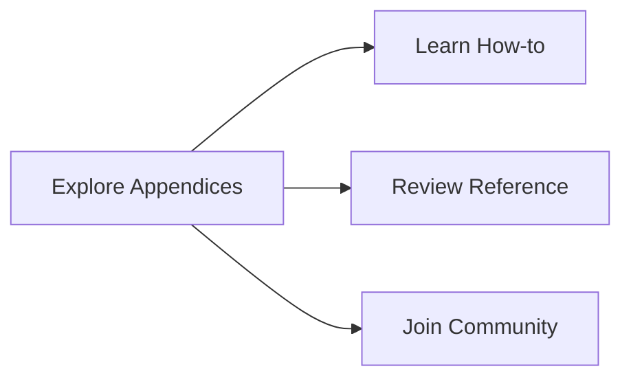

# Appendices - Additional Resources

Welcome to the **Appendices** section of the Diátaxis documentation. Here you'll find supplementary materials, examples, resources, and references that complement the main documentation.

## 🎯 Purpose of This Section

**Appendices** provide:
- Complete code examples
- Additional resources and references
- Glossary of terms
- Community information
- Historical context
- Extended examples

## 📚 What You'll Find

### Examples
- [Code Examples](examples/code.md) - Working implementations
- [Configuration Examples](examples/configuration.md) - Sample configs
- [Integration Examples](examples/integration.md) - Real integrations
- [Performance Examples](examples/performance.md) - Optimized setups

### Reference Materials
- [Glossary](glossary.md) - Terms and definitions
- [Command Reference](commands.md) - CLI commands
- [Error Codes](error-codes.md) - Error message explanations
- [Changelog](changelog.md) - Version history

### Resources
- [Community](community.md) - Get help and contribute
- [Contributing](contributing.md) - How to contribute
- [Licenses](licenses.md) - Legal information
- [Related Projects](related.md) - Connected tools

### Extended Examples
- [Enterprise Patterns](examples/enterprise.md) - Large-scale deployments
- [Migration Guide](migration/migration.md) - Upgrade paths
- [Troubleshooting Examples](troubleshooting/examples.md) - Real fixes
- [Performance Case Studies](performance/case-studies.md) - Optimizations

## 🎯 For Whom

- **Developers**: Ready-to-use code examples
- **System Administrators**: Configuration samples
- **Contributors**: Guidelines and resources
- **Everyone**: Additional context and references

## 📖 Quick Reference

### Essential Resources
| Resource | Description | Use Case |
|---------|-------------|----------|
| [Code Examples](examples/code.md) | Working implementations | Get started quickly |
| [Configuration Examples](examples/configuration.md) | Sample configs | Configure your system |
| [Glossary](glossary.md) | Terms and definitions | Understand terminology |
| [Community](community.md) | Get help and contribute | Connect with others |

### Advanced Resources
| Resource | Description | Use Case |
|---------|-------------|----------|
| [Enterprise Patterns](examples/enterprise.md) | Large-scale deployments | Scale your system |
| [Migration Guide](migration/migration.md) | Upgrade paths | Keep current |
| [Performance Case Studies](performance/case-studies.md) | Optimizations | Improve performance |
| [Troubleshooting Examples](troubleshooting/examples.md) | Real fixes | Solve problems |

## 🔍 Extended Examples

### Complete Implementations
- [GCP Simulator](examples/gcp-simulator.md) - Full integration example
- [Multi-Node Setup](examples/multi-node.md) - Cluster deployment
- [Load Balancer Integration](examples/load-balancer.md) - High availability
- [Monitoring Dashboard](examples/monitoring.md) - Complete monitoring

### Performance Tuning
- [Throughput Optimization](examples/performance.md#throughput) - Handle more requests
- [Memory Management](examples/performance.md#memory) - Reduce memory usage
- [Latency Reduction](examples/performance.md#latency) - Faster responses
- [Connection Pooling](examples/performance.md#pooling) - Efficient connections

### Security Implementations
- [OAuth2 Integration](examples/security.md#oauth2) - Modern auth
- [JWT Authentication](examples/security.md#jwt) - Token-based auth
- [Certificate Setup](examples/security.md#certificates) - TLS configuration
- [Policy Management](examples/security.md#policies) - Access control

## 📊 Data and Metrics

### Performance Benchmarks
- [Core Operations](performance/benchmarks.md#core) - In-memory performance
- [Network Real](performance/benchmarks.md#network) - Real network tests
- [Stress Tests](performance/benchmarks.md#stress) - Load testing
- [Chaos Testing](performance/benchmarks.md#chaos) - Failure injection

### Usage Statistics
- [Adoption Metrics](community/adoption.md) - Who uses erlmcp
- [Performance Metrics](performance/metrics.md) - Real-world performance
- [Community Metrics](community/metrics.md) - Community growth
- [Usage Patterns](usage/patterns.md) - Common use cases

## 🔗 Connecting to Other Sections

- **Explain**: Deepen understanding with examples
- **How-to**: See implementations in action
- **Reference**: Find technical details for examples

## 🎯 Getting Help

### Community Resources
- [Documentation Issues](community.md#documentation) - Report problems
- [Feature Requests](community.md#features) - Suggest improvements
- [Bug Reports](community.md#bugs) - Report issues
- **Discussions**: Join conversations

### Contributing
- [Contributing Guide](contributing.md) - How to help
- [Code of Conduct](contributing.md#conduct) - Community guidelines
- [Development Setup](contributing.md#setup) - Get started contributing
- [Pull Requests](contributing.md#pull-requests) - Submit changes

## 📋 Quick Links

**Find what you need:**

```markdown
- **Code Examples** → [Browse Examples](examples/code.md)
- **Configuration** → [Sample Configs](examples/configuration.md)
- **Community Help** → [Get Help](community.md)
- **Contribute** → [How to Help](contributing.md)
- **Terms** → [Glossary](glossary.md)
- **Updates** → [Changelog](changelog.md)
```

## 🚀 Next Steps

After exploring the appendices:



**Ready to build?** → [Go to How-to Guides](../howto/README.md)

**Need details?** → [Check Reference](../reference/README.md)

**Understand concepts?** → [Read Explain](../explain/README.md)

**Get involved?** → [Join Community](community.md)