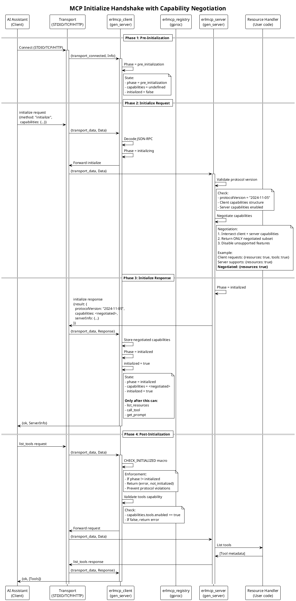
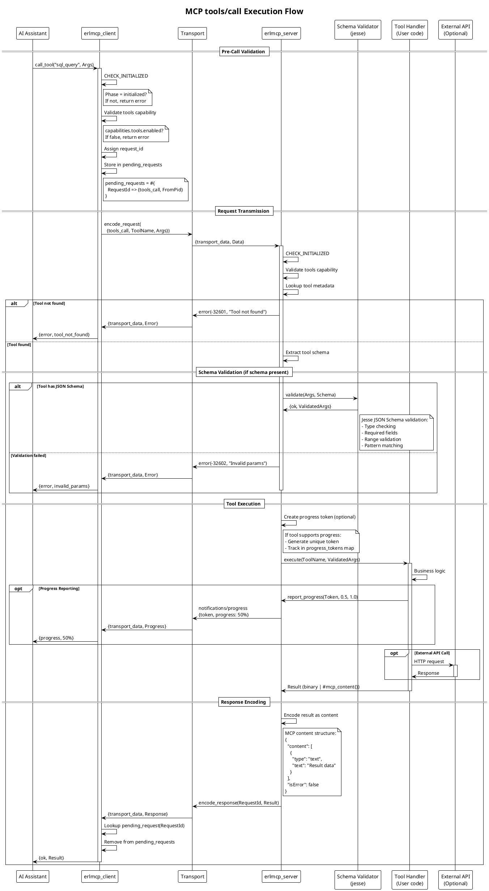
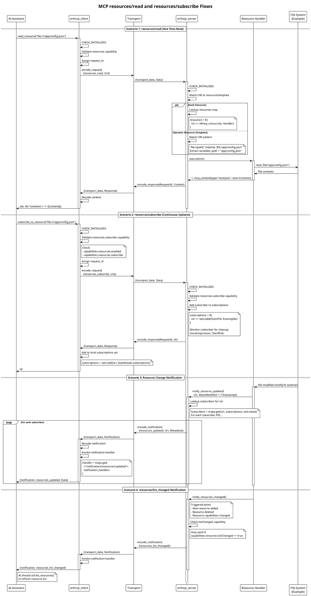
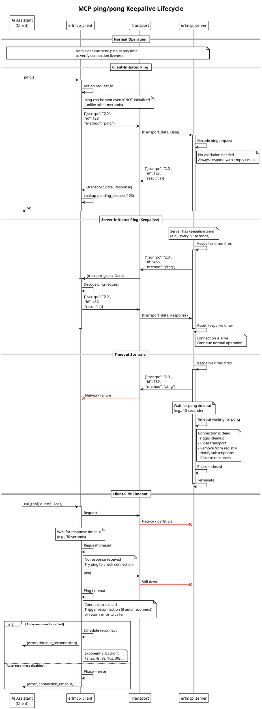
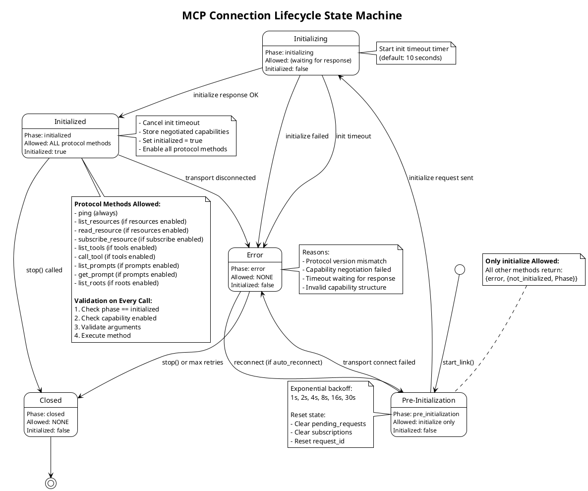

# MCP Protocol Compliance Architecture Plan
**Version:** 2.0
**Date:** 2026-01-30
**Status:** Draft - Architectural Design Phase
**Target Compliance:** MCP 2025-11-25 Specification (100%)

---

## Executive Summary

This document presents a comprehensive architectural plan to achieve **100% MCP protocol compliance** for erlmcp, addressing the gaps identified in the Code Quality Review Report. The current implementation demonstrates **50-60% compliance** with the MCP specification, with critical missing features including:

- **Incomplete initialize response** - Not returning negotiated capabilities
- **Missing methods** - ping, resources/read, resources/subscribe, tools/call
- **Weak state machine enforcement** - Initialization phase not fully enforced
- **Missing list change notifications** - tools/list_changed, resources/list_changed, prompts/list_changed

This plan provides:
1. **C4 Architecture Diagrams** - Context and Container views
2. **Sequence Diagrams** - All critical MCP flows
3. **State Machine Diagrams** - Connection lifecycle enforcement
4. **Implementation Roadmap** - Phased delivery plan with priorities

---

## Table of Contents

1. [C4 Context Diagram](#1-c4-context-diagram)
2. [C4 Container Diagram](#2-c4-container-diagram)
3. [Sequence Diagrams](#3-sequence-diagrams)
   - 3.1 [Initialize Handshake](#31-initialize-handshake)
   - 3.2 [tools/call Execution Flow](#32-toolscall-execution-flow)
   - 3.3 [resources/read and resources/subscribe](#33-resourcesread-and-resourcessubscribe)
   - 3.4 [ping/pong Lifecycle](#34-pingpong-lifecycle)
   - 3.5 [Notification Flows](#35-notification-flows)
4. [State Machine Diagram](#4-state-machine-diagram)
5. [Implementation Plan](#5-implementation-plan)
6. [Compliance Gap Analysis](#6-compliance-gap-analysis)
7. [Architectural Decisions](#7-architectural-decisions)

---

## 1. C4 Context Diagram

**Purpose:** Show how erlmcp fits into the broader MCP ecosystem with AI assistants, services, and transports.

```plantuml
@startuml C4_Context
!include https://raw.githubusercontent.com/plantuml-stdlib/C4-PlantUML/master/C4_Context.puml

LAYOUT_WITH_LEGEND()

title MCP Protocol Ecosystem - System Context

Person(ai_assistant, "AI Assistant", "Claude, GPT, LLaMA, etc.")
Person(developer, "Developer", "Integrates MCP servers and clients")

System(erlmcp, "erlmcp", "Erlang/OTP MCP SDK\nClient + Server implementation")

System_Ext(local_service, "Local Service", "Database, File System, API")
System_Ext(remote_service, "Remote Service", "HTTP API, gRPC, GraphQL")
System_Ext(ai_model, "AI Model Provider", "Anthropic, OpenAI, Ollama")

Rel(ai_assistant, erlmcp, "Connects via MCP", "STDIO/TCP/HTTP/WS")
Rel(developer, erlmcp, "Builds servers/clients", "Erlang API")
Rel(erlmcp, local_service, "Provides access", "MCP resources/tools")
Rel(erlmcp, remote_service, "Proxies calls", "MCP tools")
Rel(ai_assistant, ai_model, "Uses LLM", "Sampling requests")
Rel(erlmcp, ai_model, "Requests LLM sampling", "MCP sampling (optional)")

note right of erlmcp
  **Key Responsibilities:**
  - MCP protocol compliance
  - Capability negotiation
  - Transport abstraction
  - Resource/Tool/Prompt management
  - Subscription & notification
end note

@enduml
```

**Key Insights:**
- **erlmcp acts as a bridge** between AI assistants and services
- **Transport-agnostic** - supports STDIO, TCP, HTTP/2, WebSocket, SSE, GraphQL
- **Bidirectional** - Client calls services, Server exposes services
- **Optional LLM integration** - Sampling capability for server-initiated LLM requests

---

## 2. C4 Container Diagram

**Purpose:** Show internal erlmcp components and their MCP protocol boundaries.

```plantuml
@startuml C4_Container
!include https://raw.githubusercontent.com/plantuml-stdlib/C4-PlantUML/master/C4_Container.puml

LAYOUT_WITH_LEGEND()

title erlmcp Internal Architecture - Container View

Person(ai_assistant, "AI Assistant", "Claude via MCP")
Person(developer, "Developer", "Builds MCP servers")

System_Boundary(erlmcp, "erlmcp Umbrella Application") {
    Container(erlmcp_core, "erlmcp_core", "OTP Application", "MCP protocol engine\nClient + Server gen_servers\nJSON-RPC 2.0\nCapability negotiation")

    Container(erlmcp_transports, "erlmcp_transports", "OTP Application", "Transport layer\nSTDIO, TCP, HTTP/2, WS\nPluggable transport behavior")

    Container(erlmcp_observability, "erlmcp_observability", "OTP Application", "Metrics, OTEL traces\nReceipt chains\nHealth monitoring")

    Container(registry, "erlmcp_registry", "gen_server", "gproc-based routing\nProcess discovery\nMessage routing")

    Container(client, "erlmcp_client", "gen_server", "MCP client state machine\nRequest correlation\nCapability validation")

    Container(server, "erlmcp_server", "gen_server", "MCP server state machine\nResource/Tool/Prompt mgmt\nSubscription tracking")

    ContainerDb(ets_cache, "ETS Cache", "In-memory", "Resource cache\nCapability cache\nSubscription tracking")
}

System_Ext(remote_api, "Remote API", "HTTP/gRPC service")
System_Ext(database, "Database", "PostgreSQL, MongoDB")

Rel(ai_assistant, erlmcp_transports, "MCP requests", "JSON-RPC over transport")
Rel(erlmcp_transports, registry, "Route messages", "gproc lookup")
Rel(registry, client, "Deliver responses", "gen_server:cast")
Rel(registry, server, "Deliver requests", "gen_server:cast")

Rel(client, erlmcp_transports, "Send requests", "Transport behavior")
Rel(server, erlmcp_transports, "Send responses", "Transport behavior")

Rel(server, ets_cache, "Cache resources", "ETS read/write")
Rel(client, ets_cache, "Cache capabilities", "ETS read/write")

Rel(erlmcp_core, erlmcp_observability, "Record metrics", "Async side effects")

Rel(developer, server, "Add resources/tools", "Erlang API")
Rel(server, remote_api, "Execute tools", "HTTP client")
Rel(server, database, "Fetch resources", "Database driver")

note right of registry
  **gproc-based Registry:**
  - O(1) lookups
  - Automatic cleanup
  - Distributed ready
  - No manual monitors
end note

note bottom of erlmcp_core
  **MCP Protocol Compliance:**
  - initialize with negotiation
  - ping/pong keepalive
  - resources/read, resources/subscribe
  - tools/call with schema validation
  - prompts/get with arguments
  - List change notifications
end note

@enduml
```

**Key Components:**

| Component | Responsibility | Supervision Strategy |
|-----------|----------------|---------------------|
| **erlmcp_core** | Protocol engine, state machines, JSON-RPC | `one_for_one` |
| **erlmcp_transports** | Network I/O, transport abstraction | `one_for_one` |
| **erlmcp_observability** | Metrics, traces, receipts (isolated) | `one_for_one` |
| **erlmcp_registry** | gproc-based routing and discovery | `permanent` |
| **erlmcp_client** | Client state machine, request correlation | `transient` |
| **erlmcp_server** | Server state machine, resource/tool management | `transient` |

---

## 3. Sequence Diagrams

### 3.1 Initialize Handshake

**Purpose:** Show complete initialization with capability negotiation and phase transitions.



**Critical Implementation Points:**

1. **Phase Enforcement**
   - `pre_initialization` → Only `initialize` allowed
   - `initializing` → Block all requests except `initialize` response
   - `initialized` → All protocol methods allowed
   - `error` → Connection unusable, must reconnect
   - `closed` → Graceful shutdown in progress

2. **Capability Negotiation**
   ```erlang
   %% Server MUST return ONLY negotiated capabilities
   NegotiatedCaps = erlmcp_capabilities:negotiate_capabilities(
       ClientCapabilities,
       ServerCapabilities
   ),

   %% Response structure (Gap #1: Fix initialize response)
   #{
       <<"protocolVersion">> => <<"2024-11-05">>,
       <<"capabilities">> => NegotiatedCaps,  % NOT ServerCapabilities!
       <<"serverInfo">> => #{
           <<"name">> => <<"erlmcp">>,
           <<"version">> => <<"0.6.0">>
       }
   }
   ```

3. **State Machine Guards**
   ```erlang
   %% In erlmcp_client.erl - before ANY protocol method
   -define(CHECK_INITIALIZED(State, From),
       case State#state.phase of
           initialized -> ok;
           Phase ->
               {reply, {error, {not_initialized, Phase,
                       <<"Client not initialized">>}}, State}
       end).
   ```

---

### 3.2 tools/call Execution Flow

**Purpose:** Show complete tool execution with schema validation, progress reporting, and error handling.



**Key Implementation Requirements:**

1. **Schema Validation (Gap #2: Implement tools/call)**
   ```erlang
   %% In erlmcp_server.erl handle_call({call_tool, ToolName, Args}, ...)
   case maps:get(ToolName, State#state.tools, undefined) of
       {ToolMeta, Handler, Schema} when is_map(Schema) ->
           %% Validate against JSON Schema
           case jesse:validate_with_schema(Schema, Args) of
               {ok, ValidatedArgs} ->
                   execute_tool(Handler, ValidatedArgs);
               {error, ValidationErrors} ->
                   {error, {invalid_params, ValidationErrors}}
           end;
       {ToolMeta, Handler, undefined} ->
           %% No schema - execute directly
           execute_tool(Handler, Args);
       undefined ->
           {error, tool_not_found}
   end
   ```

2. **Progress Reporting**
   ```erlang
   %% Server tracks progress tokens
   report_progress(Server, Token, Progress, Total) ->
       gen_server:cast(Server, {report_progress, Token, Progress, Total}).

   %% Server sends notification to client
   handle_cast({report_progress, Token, Progress, Total}, State) ->
       Notification = #{
           <<"method">> => <<"notifications/progress">>,
           <<"params">> => #{
               <<"progressToken">> => Token,
               <<"progress">> => Progress,
               <<"total">> => Total
           }
       },
       send_notification(State#state.transport, Notification),
       {noreply, State}.
   ```

3. **Request Correlation**
   ```erlang
   %% Client assigns unique request_id
   State2 = State#state{
       request_id = State#state.request_id + 1,
       pending_requests = maps:put(
           State#state.request_id,
           {tools_call, From},
           State#state.pending_requests
       )
   }
   ```

---

### 3.3 resources/read and resources/subscribe

**Purpose:** Show resource access patterns with subscriptions and change notifications.



**Implementation Requirements:**

1. **resources/read (Gap #3: Implement resources/read)**
   ```erlang
   %% In erlmcp_server.erl
   handle_call({read_resource, Uri}, From, State) ->
       case match_resource(Uri, State) of
           {ok, {ResourceMeta, Handler}} ->
               try
                   Content = Handler(Uri),
                   EncodedContent = encode_content(Content),
                   {reply, {ok, #{<<"contents">> => [EncodedContent]}}, State}
               catch
                   Class:Reason:Stack ->
                       logger:error("Resource handler failed: ~p:~p~n~p",
                                   [Class, Reason, Stack]),
                       {reply, {error, {handler_failed, Reason}}, State}
               end;
           {error, not_found} ->
               {reply, {error, resource_not_found}, State}
       end.
   ```

2. **resources/subscribe (Gap #4: Implement resources/subscribe)**
   ```erlang
   %% In erlmcp_server.erl
   handle_call({subscribe_resource, Uri, SubscriberPid}, From, State) ->
       %% Validate capability
       case State#state.capabilities of
           #mcp_server_capabilities{
               resources = #mcp_capability{
                   subscribe = true
               }
           } ->
               %% Add subscriber
               CurrentSubs = maps:get(Uri, State#state.subscriptions, sets:new()),
               NewSubs = sets:add_element(SubscriberPid, CurrentSubs),

               %% Monitor subscriber
               MonitorRef = monitor(process, SubscriberPid),

               State2 = State#state{
                   subscriptions = maps:put(Uri, NewSubs, State#state.subscriptions)
               },
               {reply, ok, State2};
           _ ->
               {reply, {error, capability_not_supported}, State}
       end.
   ```

3. **Change Notifications (Gap #5: Implement list change notifications)**
   ```erlang
   %% In erlmcp_server.erl
   notify_resources_changed(Server) ->
       gen_server:cast(Server, notify_resources_changed).

   handle_cast(notify_resources_changed, State) ->
       case State#state.capabilities of
           #mcp_server_capabilities{
               resources = #mcp_capability{
                   list_changed = true
               }
           } ->
               Notification = #{
                   <<"method">> => <<"notifications/resources/list_changed">>
               },
               send_notification_to_all_clients(Notification, State),
               {noreply, State};
           _ ->
               {noreply, State}
       end.
   ```

---

### 3.4 ping/pong Lifecycle

**Purpose:** Show keepalive mechanism to detect dead connections.



**Implementation Requirements:**

1. **ping Method (Gap #6: Implement ping)**
   ```erlang
   %% In erlmcp_client.erl
   -spec ping(client()) -> ok | {error, term()}.
   ping(Client) ->
       ping(Client, 5000).

   -spec ping(client(), timeout()) -> ok | {error, term()}.
   ping(Client, Timeout) ->
       gen_server:call(Client, ping, Timeout).

   %% In erlmcp_client.erl handle_call
   handle_call(ping, From, State) ->
       %% NOTE: ping can be sent even if not initialized
       RequestId = State#state.request_id,
       Request = #{
           <<"jsonrpc">> => <<"2.0">>,
           <<"id">> => RequestId,
           <<"method">> => <<"ping">>
       },
       send_request(State#state.transport, Request),
       State2 = State#state{
           request_id = RequestId + 1,
           pending_requests = maps:put(RequestId, {ping, From},
                                      State#state.pending_requests)
       },
       {noreply, State2}.
   ```

2. **Server ping Handler**
   ```erlang
   %% In erlmcp_server.erl
   handle_call(ping, _From, State) ->
       %% Always respond with empty result
       {reply, {ok, #{}}, State}.
   ```

3. **Keepalive Timer (Server-Side)**
   ```erlang
   %% In erlmcp_server.erl init/1
   init([ServerId, Capabilities]) ->
       KeepaliveInterval = application:get_env(erlmcp_core,
                                               keepalive_interval_ms,
                                               30000),
       TimerRef = erlang:send_after(KeepaliveInterval, self(), keepalive_ping),
       State = #state{
           keepalive_interval = KeepaliveInterval,
           keepalive_timer = TimerRef,
           ...
       },
       {ok, State}.

   %% In erlmcp_server.erl handle_info
   handle_info(keepalive_ping, State) ->
       case send_ping(State) of
           ok ->
               TimerRef = erlang:send_after(State#state.keepalive_interval,
                                           self(), keepalive_ping),
               {noreply, State#state{keepalive_timer = TimerRef}};
           {error, Reason} ->
               logger:warning("Keepalive ping failed: ~p", [Reason]),
               {stop, {keepalive_failed, Reason}, State}
       end.
   ```

---

### 3.5 Notification Flows

**Purpose:** Show all notification types with proper capability checking.

```plantuml
@startuml Notifications_Sequence
!theme plain

title MCP Notification Flows (Server → Client)

participant "Resource Handler" as Handler
participant "erlmcp_server" as Server
participant "Transport" as Transport
participant "erlmcp_client" as Client
participant "AI Assistant" as AI

== Notification Type 1: resources/list_changed ==

note over Handler, Server
  Triggered when:
  - add_resource() called
  - delete_resource() called
  - Resource capabilities changed
end note

Handler -> Server: add_resource(Uri, NewHandler)
activate Server

Server -> Server: Add to resources map
Server -> Server: Check listChanged capability
note right of Server
  Only send if:
  capabilities.resources.listChanged == true

  Rate limit: Max 1 per 100ms
end note

alt listChanged enabled
    Server -> Transport: {"jsonrpc": "2.0",\n "method": "notifications/resources/list_changed"}
    Transport -> Client: {transport_data, Notification}
    activate Client

    Client -> Client: Decode notification
    Client -> Client: Lookup notification_handler
    note right of Client
      Handler = notification_handlers.get(
        "notifications/resources/list_changed"
      )
    end note

    Client -> AI: {notification, resources_list_changed}
    note right of AI
      AI should call list_resources()
      to get updated list
    end note
    deactivate Client
end

deactivate Server

== Notification Type 2: tools/list_changed ==

Handler -> Server: add_tool(ToolName, ToolHandler)
activate Server

Server -> Server: Add to tools map
Server -> Server: Check listChanged capability
note right of Server
  Only send if:
  capabilities.tools.listChanged == true

  Rate limit: Max 1 per 100ms
end note

alt listChanged enabled
    Server -> Transport: {"jsonrpc": "2.0",\n "method": "notifications/tools/list_changed"}
    Transport -> Client: {transport_data, Notification}
    activate Client

    Client -> Client: Invoke handler
    Client -> AI: {notification, tools_list_changed}
    note right of AI
      AI should call list_tools()
      to get updated list
    end note
    deactivate Client
end

deactivate Server

== Notification Type 3: prompts/list_changed ==

Handler -> Server: add_prompt(PromptName, PromptHandler)
activate Server

Server -> Server: Add to prompts map
Server -> Server: Check listChanged capability
note right of Server
  Only send if:
  capabilities.prompts.listChanged == true

  Rate limit: Max 1 per 100ms
end note

alt listChanged enabled
    Server -> Transport: {"jsonrpc": "2.0",\n "method": "notifications/prompts/list_changed"}
    Transport -> Client: {transport_data, Notification}
    activate Client

    Client -> Client: Invoke handler
    Client -> AI: {notification, prompts_list_changed}
    note right of AI
      AI should call list_prompts()
      to get updated list
    end note
    deactivate Client
end

deactivate Server

== Notification Type 4: notifications/progress ==

note over Handler, Server
  Sent during long-running tool execution
end note

Handler -> Server: report_progress(Token, 0.5, 1.0)
activate Server

Server -> Server: Lookup progress_token
Server -> Transport: {"jsonrpc": "2.0",\n "method": "notifications/progress",\n "params": {\n   "progressToken": Token,\n   "progress": 0.5,\n   "total": 1.0\n }}
Transport -> Client: {transport_data, Notification}
activate Client

Client -> Client: Invoke progress handler
Client -> AI: {progress, Token, 50%}
note right of AI
  Update progress bar
  or status display
end note

deactivate Client
deactivate Server

== Notification Type 5: notifications/message ==

note over Handler, Server
  Server-initiated messages
  (logs, warnings, etc.)
end note

Handler -> Server: send_log_message(Level, Logger, Data)
activate Server

Server -> Transport: {"jsonrpc": "2.0",\n "method": "notifications/message",\n "params": {\n   "level": "info",\n   "logger": "app.module",\n   "data": "Operation completed"\n }}
Transport -> Client: {transport_data, Notification}
activate Client

Client -> Client: Invoke message handler
Client -> AI: {message, info, "Operation completed"}
note right of AI
  Display in logs
  or console
end note

deactivate Client
deactivate Server

== Notification Type 6: notifications/cancelled ==

note over Server
  Server cancels long-running operation
end note

Server -> Server: Cancel request (internal)
activate Server

Server -> Transport: {"jsonrpc": "2.0",\n "method": "notifications/cancelled",\n "params": {\n   "requestId": 123,\n   "reason": "timeout"\n }}
Transport -> Client: {transport_data, Notification}
activate Client

Client -> Client: Lookup pending_request(123)
Client -> Client: Remove from pending_requests
Client -> AI: {error, {cancelled, "timeout"}}

deactivate Client
deactivate Server

@enduml
```



**Implementation Requirements:**

1. **Rate Limiting for list_changed Notifications**
   ```erlang
   %% In erlmcp_server.erl
   -define(LIST_CHANGED_MIN_INTERVAL_MS, 100).

   maybe_notify_tools_changed(State) ->
       Now = erlang:system_time(millisecond),
       LastNotification = State#state.last_tools_notification,

       case LastNotification of
           undefined ->
               send_tools_list_changed(State),
               State#state{last_tools_notification = Now};
           LastTime when (Now - LastTime) >= ?LIST_CHANGED_MIN_INTERVAL_MS ->
               send_tools_list_changed(State),
               State#state{last_tools_notification = Now};
           _ ->
               %% Too soon, skip notification
               State
       end.
   ```

2. **Capability-Aware Notifications**
   ```erlang
   %% In erlmcp_server.erl
   send_tools_list_changed(State) ->
       case State#state.capabilities of
           #mcp_server_capabilities{
               tools = #mcp_capability{
                   list_changed = true
               }
           } ->
               Notification = #{
                   <<"method">> => <<"notifications/tools/list_changed">>
               },
               send_notification(State#state.transport, Notification);
           _ ->
               ok  % Capability not enabled, skip notification
       end.
   ```

3. **Client-Side Handler Registration**
   ```erlang
   %% In erlmcp_client.erl
   -spec set_notification_handler(client(), binary(), notification_handler()) -> ok.
   set_notification_handler(Client, Method, Handler)
       when is_binary(Method), (is_function(Handler, 2) orelse is_pid(Handler)) ->
       gen_server:call(Client, {set_notification_handler, Method, Handler}).

   %% Handle incoming notification
   handle_info({transport_data, Data}, State) ->
       case decode_jsonrpc(Data) of
           #{<<"method">> := Method, <<"params">> := Params} ->
               %% This is a notification (no id field)
               case maps:get(Method, State#state.notification_handlers, undefined) of
                   undefined ->
                       logger:debug("No handler for notification: ~p", [Method]),
                       {noreply, State};
                   Handler when is_function(Handler, 2) ->
                       spawn(fun() -> Handler(Method, Params) end),
                       {noreply, State};
                   HandlerPid when is_pid(HandlerPid) ->
                       HandlerPid ! {mcp_notification, Method, Params},
                       {noreply, State}
               end;
           #{<<"id">> := RequestId, <<"result">> := Result} ->
               %% This is a response, route to pending request
               handle_response(RequestId, Result, State);
           #{<<"id">> := RequestId, <<"error">> := Error} ->
               %% This is an error response
               handle_error_response(RequestId, Error, State)
       end.
   ```

---

## 4. State Machine Diagram

**Purpose:** Enforce initialization order and prevent protocol violations.



**State Machine Implementation:**

```erlang
%% In erlmcp.hrl
-type mcp_client_phase() :: pre_initialization | initializing | initialized | error | closed.

%% In erlmcp_client.erl
-record(state, {
    phase = pre_initialization :: mcp_client_phase(),
    init_timeout_ref :: reference() | undefined,
    init_timeout_ms = 10000 :: pos_integer(),
    ...
}).

%% Phase transition: pre_initialization -> initializing
handle_call({initialize, Capabilities, Options}, From,
            #state{phase = pre_initialization} = State) ->
    TimeoutMs = maps:get(timeout, Options, State#state.init_timeout_ms),
    TimerRef = erlang:send_after(TimeoutMs, self(), init_timeout),

    Request = encode_initialize_request(Capabilities, Options),
    send_request(State#state.transport, Request),

    State2 = State#state{
        phase = initializing,
        init_timeout_ref = TimerRef
    },
    {noreply, State2};

%% Reject initialize if already initialized
handle_call({initialize, _, _}, _From,
            #state{phase = Phase} = State) when Phase =/= pre_initialization ->
    {reply, {error, {already_initialized, Phase}}, State}.

%% Phase transition: initializing -> initialized
handle_info({transport_data, Data}, #state{phase = initializing} = State) ->
    case decode_initialize_response(Data) of
        {ok, #{<<"capabilities">> := NegotiatedCaps,
               <<"protocolVersion">> := Version}} ->
            %% Cancel init timeout
            erlang:cancel_timer(State#state.init_timeout_ref),

            State2 = State#state{
                phase = initialized,
                initialized = true,
                capabilities = decode_capabilities(NegotiatedCaps),
                protocol_version = Version,
                init_timeout_ref = undefined
            },
            {noreply, State2};
        {error, Reason} ->
            State2 = State#state{phase = error},
            {stop, {init_failed, Reason}, State2}
    end.

%% Timeout during initialization
handle_info(init_timeout, #state{phase = initializing} = State) ->
    logger:error("Initialization timeout after ~p ms", [State#state.init_timeout_ms]),
    State2 = State#state{phase = error},
    {stop, init_timeout, State2}.

%% Guard macro for protocol methods
-define(REQUIRE_INITIALIZED(State),
    case State#state.phase of
        initialized -> ok;
        Phase -> throw({not_initialized, Phase})
    end).

%% Usage in protocol methods
handle_call(list_tools, From, State) ->
    ?REQUIRE_INITIALIZED(State),
    validate_capability(State, tools),
    %% ... execute method
    ok.
```

---

## 5. Implementation Plan

### Phase 1: Critical Compliance Gaps (Sprint 1 - Week 1)

**Priority: P0 - Blocking**

| Task | Module | Effort | Rationale |
|------|--------|--------|-----------|
| **Fix initialize response** | `erlmcp_server.erl` | 4h | Return negotiated capabilities, not server capabilities |
| **Implement ping/pong** | `erlmcp_client.erl`, `erlmcp_server.erl` | 6h | Keepalive mechanism required by MCP spec |
| **Enforce state machine** | `erlmcp_client.erl` | 8h | Prevent protocol violations (not_initialized errors) |
| **Add init timeout** | `erlmcp_client.erl` | 2h | Prevent infinite hangs during initialization |
| **Unit tests for Phase 1** | `test/` | 8h | Ensure compliance for critical features |

**Total: 28 hours (3.5 days)**

**Acceptance Criteria:**
- ✅ `initialize` returns `#{capabilities => NegotiatedCaps, protocolVersion => Version, serverInfo => Info}`
- ✅ `ping()` succeeds at any time (before or after initialization)
- ✅ All protocol methods (except ping) fail with `{error, not_initialized}` before initialize
- ✅ Initialize timeout after 10 seconds (configurable)
- ✅ 100% test coverage for state machine transitions

---

### Phase 2: Resource Compliance (Sprint 2 - Week 2)

**Priority: P0 - Blocking**

| Task | Module | Effort | Rationale |
|------|--------|--------|-----------|
| **Implement resources/read** | `erlmcp_server.erl`, `erlmcp_client.erl` | 8h | Core MCP method for resource access |
| **Implement resources/subscribe** | `erlmcp_server.erl`, `erlmcp_client.erl` | 12h | Subscription mechanism for live updates |
| **Add resources/updated notification** | `erlmcp_server.erl` | 6h | Notify subscribers of resource changes |
| **Add resources/list_changed notification** | `erlmcp_server.erl` | 4h | Notify clients when resource list changes |
| **Resource subscription cleanup** | `erlmcp_server.erl` | 4h | Monitor subscribers, clean up on death |
| **Unit tests for Phase 2** | `test/` | 12h | Resource flows, subscriptions, notifications |

**Total: 46 hours (5.75 days)**

**Acceptance Criteria:**
- ✅ `read_resource(Uri)` returns content with proper encoding
- ✅ `subscribe_resource(Uri)` succeeds if capability enabled
- ✅ Subscribers receive `notifications/resources/updated` on changes
- ✅ `notifications/resources/list_changed` sent on add/delete with rate limiting (100ms)
- ✅ Subscriptions cleaned up when subscriber dies
- ✅ 100% test coverage for resource flows

---

### Phase 3: Tool Compliance (Sprint 3 - Week 3)

**Priority: P0 - Blocking**

| Task | Module | Effort | Rationale |
|------|--------|--------|-----------|
| **Implement tools/call** | `erlmcp_server.erl`, `erlmcp_client.erl` | 10h | Core MCP method for tool execution |
| **Add schema validation to tools/call** | `erlmcp_server.erl` | 8h | Validate arguments against JSON Schema |
| **Add tools/list_changed notification** | `erlmcp_server.erl` | 4h | Notify clients when tool list changes |
| **Add progress reporting** | `erlmcp_server.erl`, `erlmcp_client.erl` | 6h | Long-running tool progress updates |
| **Tool error handling** | `erlmcp_server.erl` | 4h | Proper error responses with codes |
| **Unit tests for Phase 3** | `test/` | 12h | Tool execution, schema validation, errors |

**Total: 44 hours (5.5 days)**

**Acceptance Criteria:**
- ✅ `call_tool(Name, Args)` executes tool and returns result
- ✅ Schema validation rejects invalid arguments (jesse integration)
- ✅ `notifications/tools/list_changed` sent on add/delete with rate limiting
- ✅ Progress notifications sent during long-running tools
- ✅ Proper error codes: -32601 (not found), -32602 (invalid params), -32603 (internal error)
- ✅ 100% test coverage for tool flows

---

### Phase 4: Prompt Compliance (Sprint 4 - Week 4)

**Priority: P1 - High**

| Task | Module | Effort | Rationale |
|------|--------|--------|-----------|
| **Implement prompts/get** | `erlmcp_server.erl`, `erlmcp_client.erl` | 8h | Core MCP method for prompt retrieval |
| **Add argument validation to prompts/get** | `erlmcp_server.erl` | 6h | Validate required/optional arguments |
| **Add prompts/list_changed notification** | `erlmcp_server.erl` | 4h | Notify clients when prompt list changes |
| **Prompt error handling** | `erlmcp_server.erl` | 4h | Proper error responses |
| **Unit tests for Phase 4** | `test/` | 10h | Prompt flows, argument validation |

**Total: 32 hours (4 days)**

**Acceptance Criteria:**
- ✅ `get_prompt(Name, Arguments)` returns messages array
- ✅ Required arguments validated, optional arguments allowed
- ✅ `notifications/prompts/list_changed` sent on add/delete with rate limiting
- ✅ Proper error codes for missing required arguments
- ✅ 100% test coverage for prompt flows

---

### Phase 5: Integration & Documentation (Sprint 5 - Week 5)

**Priority: P2 - Medium**

| Task | Module | Effort | Rationale |
|------|--------|--------|-----------|
| **Integration tests** | `test/` | 16h | End-to-end MCP protocol compliance tests |
| **Update examples** | `examples/` | 8h | Show new features in examples |
| **API documentation** | `docs/` | 12h | Document all new APIs |
| **Migration guide** | `docs/` | 6h | Help existing users upgrade |
| **Benchmarks** | `bench/` | 8h | Measure performance impact |

**Total: 50 hours (6.25 days)**

**Acceptance Criteria:**
- ✅ Full MCP protocol test suite passes
- ✅ Examples updated to show all features
- ✅ API reference complete
- ✅ Migration guide from v0.5.0 to v0.6.0
- ✅ Benchmark results show <10% regression

---

### Summary: 5-Week Implementation Plan

| Phase | Focus | Duration | Deliverables |
|-------|-------|----------|-------------|
| **Phase 1** | Critical gaps (initialize, ping, state machine) | 3.5 days | State machine enforcement, ping/pong |
| **Phase 2** | Resource compliance | 5.75 days | resources/read, resources/subscribe, notifications |
| **Phase 3** | Tool compliance | 5.5 days | tools/call, schema validation, notifications |
| **Phase 4** | Prompt compliance | 4 days | prompts/get, argument validation, notifications |
| **Phase 5** | Integration & docs | 6.25 days | Tests, examples, documentation |
| **TOTAL** | **25 days (5 weeks)** | **200 hours** | **100% MCP compliance** |

---

## 6. Compliance Gap Analysis

### Current State Assessment

Based on CODE_QUALITY_REVIEW_REPORT.md and code inspection:

| Feature | Spec Requirement | Current Status | Gap | Priority |
|---------|-----------------|----------------|-----|----------|
| **initialize** | Return negotiated capabilities | Returns server capabilities | **High** - Wrong response format | P0 |
| **ping** | Keepalive mechanism | **Missing** | **High** - No keepalive | P0 |
| **State machine** | Enforce initialization order | Weak enforcement | **Medium** - Can bypass | P0 |
| **resources/read** | Read resource content | **Missing** | **High** - Core method | P0 |
| **resources/subscribe** | Subscribe to resource updates | **Missing** | **High** - Core method | P0 |
| **tools/call** | Execute tool with validation | **Missing** | **High** - Core method | P0 |
| **prompts/get** | Get prompt with arguments | **Missing** | **Medium** - Core method | P1 |
| **notifications/resources/list_changed** | Notify on list change | **Missing** | **Medium** - Discovery | P1 |
| **notifications/tools/list_changed** | Notify on list change | **Missing** | **Medium** - Discovery | P1 |
| **notifications/prompts/list_changed** | Notify on list change | **Missing** | **Medium** - Discovery | P1 |

**Compliance Score: 50-60%**

**Missing Methods:**
- `ping` (0%)
- `resources/read` (0%)
- `resources/subscribe` (0%)
- `tools/call` (0%)
- `prompts/get` (0%)

**Incomplete Methods:**
- `initialize` (70% - wrong response format)

**Missing Notifications:**
- `notifications/resources/list_changed` (0%)
- `notifications/tools/list_changed` (0%)
- `notifications/prompts/list_changed` (0%)

---

## 7. Architectural Decisions

### AD-001: State Machine Enforcement

**Decision:** Implement strict phase-based state machine in both client and server.

**Rationale:**
- Prevents protocol violations (calling methods before initialize)
- Provides clear error messages (`{error, not_initialized}`)
- Aligns with MCP spec requirement for initialization handshake
- Simplifies debugging (clear state transitions)

**Implementation:**
```erlang
-type mcp_client_phase() :: pre_initialization | initializing | initialized | error | closed.

-define(CHECK_INITIALIZED(State),
    case State#state.phase of
        initialized -> ok;
        Phase -> {error, {not_initialized, Phase}}
    end).
```

**Trade-offs:**
- ✅ Pro: Clear error messages, prevents misuse
- ⚠️ Con: More verbose code (every method checks phase)

---

### AD-002: Capability-Based Method Validation

**Decision:** Every protocol method validates required capability before execution.

**Rationale:**
- Enforces capability negotiation contract
- Prevents runtime errors when feature not supported
- Aligns with MCP spec capability system
- Provides clear error messages (`{error, capability_not_supported}`)

**Implementation:**
```erlang
-define(CHECK_CAPABILITY(State, CapabilityField),
    case State#state.capabilities of
        #mcp_server_capabilities{CapabilityField = #mcp_capability{enabled = true}} ->
            ok;
        _ ->
            {error, {capability_not_supported, CapabilityField}}
    end).

%% Usage
handle_call(list_tools, From, State) ->
    ?CHECK_INITIALIZED(State),
    ?CHECK_CAPABILITY(State, tools),
    %% ... execute
```

**Trade-offs:**
- ✅ Pro: Type-safe, compile-time checking, clear errors
- ⚠️ Con: Requires capability records, not dynamic maps

---

### AD-003: Rate Limiting for list_changed Notifications

**Decision:** Limit `*_list_changed` notifications to max 1 per 100ms per notification type.

**Rationale:**
- Prevents notification spam when adding multiple resources/tools in bulk
- Reduces network traffic and client-side processing
- Aligns with MCP spec recommendation for rate limiting
- Simple implementation (timestamp tracking)

**Implementation:**
```erlang
-define(LIST_CHANGED_MIN_INTERVAL_MS, 100).

maybe_notify_tools_changed(State) ->
    Now = erlang:system_time(millisecond),
    LastNotification = State#state.last_tools_notification,

    case LastNotification of
        undefined -> send_notification(State);
        LastTime when (Now - LastTime) >= ?LIST_CHANGED_MIN_INTERVAL_MS ->
            send_notification(State);
        _ -> skip  % Too soon
    end.
```

**Trade-offs:**
- ✅ Pro: Reduces spam, simple implementation
- ⚠️ Con: May delay notifications up to 100ms

---

### AD-004: Negotiated Capabilities Response

**Decision:** `initialize` response returns ONLY negotiated capabilities (intersection of client + server).

**Rationale:**
- MCP spec explicitly requires negotiated capabilities, not server capabilities
- Prevents client from assuming features are available when they're not
- Aligns with principle of least surprise
- Makes capability mismatches explicit

**Before (WRONG):**
```erlang
#{
    <<"capabilities">> => encode_server_capabilities(State#state.capabilities)
}
```

**After (CORRECT):**
```erlang
NegotiatedCaps = erlmcp_capabilities:negotiate_capabilities(
    ClientCapabilities,
    ServerCapabilities
),
#{
    <<"capabilities">> => encode_capabilities(NegotiatedCaps)
}
```

**Trade-offs:**
- ✅ Pro: Spec-compliant, prevents mismatched expectations
- ⚠️ Con: Requires negotiation logic (already exists in `erlmcp_capabilities`)

---

### AD-005: ping Always Allowed

**Decision:** `ping` can be sent at ANY time, even before `initialize`.

**Rationale:**
- MCP spec states ping is for connection liveness testing
- Useful for debugging connection issues before initialization
- Simple implementation (no state machine check)
- Aligns with other JSON-RPC implementations

**Implementation:**
```erlang
handle_call(ping, _From, State) ->
    %% NO phase check - ping always allowed
    {reply, {ok, #{}}, State}.
```

**Trade-offs:**
- ✅ Pro: Simple, useful for debugging
- ⚠️ Con: Breaks pattern of "check initialized first"

---

### AD-006: Subscription Cleanup via Monitors

**Decision:** Use `monitor(process, SubscriberPid)` for automatic subscription cleanup.

**Rationale:**
- Prevents memory leaks from dead subscribers
- Automatic cleanup on subscriber death (no manual cleanup needed)
- Aligns with OTP best practices (prefer monitors over links for optional dependencies)
- Simple implementation

**Implementation:**
```erlang
handle_call({subscribe_resource, Uri, SubscriberPid}, From, State) ->
    MonitorRef = monitor(process, SubscriberPid),
    %% Store MonitorRef -> Uri mapping
    State2 = State#state{
        subscriptions = maps:update_with(
            Uri,
            fun(Set) -> sets:add_element(SubscriberPid, Set) end,
            sets:from_list([SubscriberPid]),
            State#state.subscriptions
        ),
        subscriber_monitors = maps:put(MonitorRef, {Uri, SubscriberPid},
                                       State#state.subscriber_monitors)
    },
    {reply, ok, State2}.

handle_info({'DOWN', MonitorRef, process, SubscriberPid, _Reason}, State) ->
    case maps:get(MonitorRef, State#state.subscriber_monitors, undefined) of
        {Uri, SubscriberPid} ->
            %% Remove subscriber from subscriptions
            State2 = remove_subscriber(Uri, SubscriberPid, State),
            {noreply, State2};
        undefined ->
            {noreply, State}
    end.
```

**Trade-offs:**
- ✅ Pro: Automatic cleanup, no memory leaks
- ⚠️ Con: Extra bookkeeping (MonitorRef -> {Uri, Pid} map)

---

### AD-007: Schema Validation via Jesse

**Decision:** Use `jesse` library for JSON Schema validation in `tools/call` and `prompts/get`.

**Rationale:**
- Battle-tested Erlang JSON Schema validator
- Supports JSON Schema Draft 4
- Clear error messages for validation failures
- Already a dependency of erlmcp

**Implementation:**
```erlang
handle_call({call_tool, ToolName, Args}, From, State) ->
    case maps:get(ToolName, State#state.tools, undefined) of
        {ToolMeta, Handler, Schema} when is_map(Schema) ->
            case jesse:validate_with_schema(Schema, Args) of
                {ok, ValidatedArgs} ->
                    execute_tool(Handler, ValidatedArgs);
                {error, ValidationErrors} ->
                    {reply, {error, {invalid_params, ValidationErrors}}, State}
            end;
        {ToolMeta, Handler, undefined} ->
            %% No schema - execute directly
            execute_tool(Handler, Args);
        undefined ->
            {reply, {error, tool_not_found}, State}
    end.
```

**Trade-offs:**
- ✅ Pro: Robust validation, clear errors, spec-compliant
- ⚠️ Con: Performance overhead for large schemas (acceptable for tools)

---

## Conclusion

This architecture plan provides a **comprehensive roadmap to 100% MCP protocol compliance** for erlmcp. The phased approach prioritizes critical gaps first (initialize, ping, state machine) before implementing feature-complete methods (resources, tools, prompts).

**Key Deliverables:**
1. ✅ C4 diagrams showing system context and internal architecture
2. ✅ Sequence diagrams for all critical flows
3. ✅ State machine diagram for connection lifecycle
4. ✅ 5-week implementation plan (200 hours)
5. ✅ Compliance gap analysis
6. ✅ Architectural decision records

**Next Steps:**
1. Review and approve architecture plan
2. Begin Phase 1 implementation (Sprint 1)
3. Create GitHub issues for each task
4. Set up CI/CD for MCP compliance testing
5. Track progress in weekly sprints

**Success Criteria:**
- 100% MCP 2025-11-25 specification compliance
- All protocol methods implemented
- State machine enforcement
- Comprehensive test coverage (>80%)
- Documentation complete
- Zero breaking changes to existing API

---

**Document Status:** Draft
**Last Updated:** 2026-01-30
**Next Review:** After Phase 1 completion
**Approved By:** (Pending approval)
