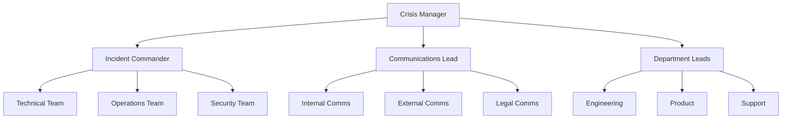
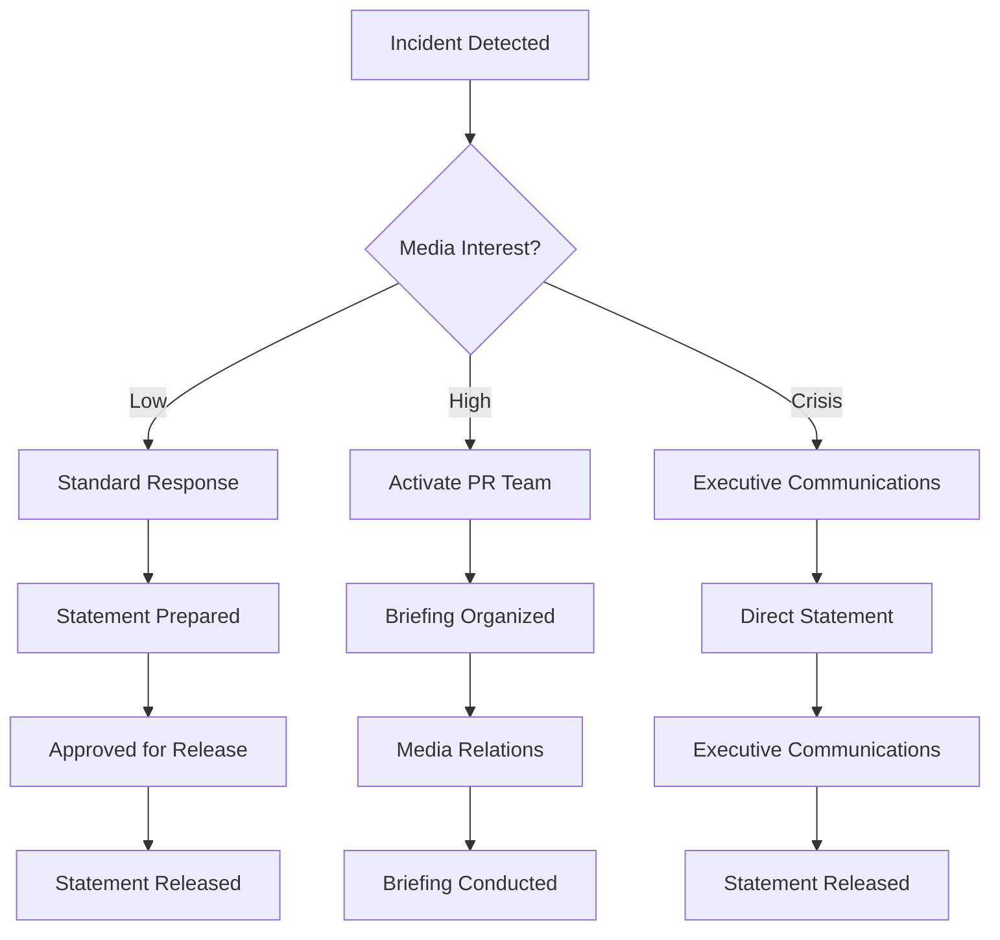
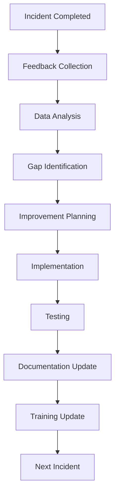

# Communication Procedures
## erlmcp v3 Business Continuity Plan

### Executive Summary
This document outlines comprehensive communication procedures for erlmcp v3, designed to ensure effective internal and external communication during incidents and business continuity events. The procedures establish clear channels, templates, and protocols for maintaining stakeholder trust and operational transparency.

---

## 1. Communication Framework Overview

### 1.1 Communication Principles

| Principle | Description | Implementation |
|----------|-------------|----------------|
| **Transparency** | Open and honest communication | Regular updates, admit uncertainty |
| **Timeliness** | Swift communication | Immediate alerts, scheduled updates |
| **Accuracy** | Factual information | Verification before communication |
| **Consistency** | Unified messaging | Single source of truth |
| **Clarity** | Simple, understandable language | Avoid jargon, provide context |
| **Empathy** | Consider stakeholder impact | Acknowledge concerns, show care |
| **Authority** | Official sources only | Pre-authorized spokespeople |
| **Proactivity** | Anticipate needs | Prepare potential messages |

### 1.2 Communication Objectives

1. **Maintain Trust**: Build and preserve stakeholder confidence
2. **Reduce Uncertainty**: Provide clear, accurate information
3. **Manage Expectations**: Set realistic timelines and outcomes
4. **Coordinate Response**: Ensure aligned messaging across channels
5. **Protect Reputation**: Minimize damage to brand perception
6. **Comply with Requirements**: Meet regulatory and contractual obligations
7. **Support Decision-Making**: Provide information for informed choices

---

## 2. Internal Communication Procedures

### 2.1 Team Communication Structure

#### 2.1.1 Emergency Communications Hierarchy


#### 2.1.2 Internal Communication Channels

| Channel | Purpose | Primary Users | Update Frequency |
|---------|---------|--------------|-----------------|
| **Incident Channel** (Slack) | Real-time coordination | Response team | Immediate |
| **Status Channel** (Slack) | Current status updates | All staff | 15 minutes |
| **Email List** | Formal notifications | All stakeholders | As needed |
| **Conference Calls** | Briefings and discussions | Leadership team | Hourly |
| **Documentation Portal** | Reference materials | All staff | Real-time |
| **Alert System** | Critical alerts | Key personnel | Immediate |

### 2.2 Internal Communication Templates

#### 2.2.1 Incident Update Template
```markdown
# INTERNAL INCIDENT UPDATE

**Incident ID:** INC-2024-001
**Updated:** 2024-01-01 10:30 UTC
**Severity:** P1 - High

**Current Status:** 🔴 Active / 🟡 Monitoring / 🟢 Resolved

**Affected Systems:**
- Authentication Service (100% affected)
- API Gateway (50% affected)
- Dashboard Interface (intermittent)

**Summary:**
Authentication service continues to experience issues following this morning's deployment. Engineering team is investigating the root cause and working on resolution.

**Actions Taken:**
- [x] Rollback deployment initiated
- [x] Vendor support engaged
- [x] Customers notified
- [ ] Performance optimization in progress
- [ ] Load balancing adjustments

**Next Steps:**
- Continue rollback completion
- Test authentication restoration
- Monitor system performance
- Prepare status update for external stakeholders

**Key Contacts:**
- Incident Commander: John Smith
- Technical Lead: Sarah Johnson
- Communications: Lisa Chen

**Action Required:**
- All teams maintain operational readiness
- Support team prepare for customer inquiries
- Engineering continue monitoring logs
```

#### 2.2.2 Resolution Template
```markdown
# RESOLUTION NOTIFICATION

**Incident ID:** INC-2024-001
**Resolved:** 2024-01-01 12:00 UTC
**Duration:** 2 hours

**Summary:**
Authentication service has been fully restored. All systems are operating normally.

**Root Cause:**
Configuration error in deployment affecting token validation mechanism.

**Actions Taken:**
- Deployment rollback completed
- Configuration reset to previous state
- Service restart performed
- Load balancing restored
- Monitoring systems reactivated

**Verification:**
- Authentication service: 100% operational
- API Gateway: 100% operational
- All services: Normal performance

**Follow-up:**
- Post-incident review scheduled
- Configuration changes pending review
- Deployment process under review

**Contacts:**
- Incident Commander: John Smith
- Technical Lead: Sarah Johnson

**Team Appreciation:**
Thank you to all team members for your swift response and professional handling of this incident.
```

### 2.3 Daily Communication Routines

#### 2.3.1 Status Meeting Structure
```markdown
## Daily Status Meeting (Incident Mode)

**Time:** 09:00, 12:00, 17:00 UTC
**Duration:** 15 minutes
**Location:** Video conference + Slack

**Agenda:**
1. **System Status** (2 min)
   - Current operational status
   - Active incidents
   - Performance metrics

2. **Response Update** (5 min)
   - Incident progress
   - Actions taken
   - Challenges faced

3. **Planned Actions** (5 min)
   - Next steps
   - Resource needs
   - External coordination

4. **Stakeholder Updates** (3 min)
   - Customer communications
   - Partner notifications
   - Regulatory reporting

**Template:**
```
[System Status] All systems operational. No active incidents.
[Response] Working on [task], [progress made]. [Issue encountered].
[Planned] Next: [action], [timeline], [resources needed].
[Stakeholders] Updated [stakeholder group], [response received].
```

**Minutes:**
- Document key decisions
- Action items with owners
- Timeline updates
- Resource allocations
```

#### 2.3.2 Handover Procedure
```markdown
## Shift Handover Checklist

### Information Transfer
- [ ] Current incident status
- [ ] Active work items
- [ ] System health status
- [ ] Open alerts and tickets
- [ ] Resource availability
- [ ] Contact information updates

### Documentation
- [ ] Incident log updated
- [ ] Action items documented
- [ ] Decisions recorded
- [ ] Next steps clear
- [ ] Contact details verified

### Verification
- [ ] All critical systems monitored
- [ ] Alert systems active
- [ ] Communication channels established
- [ ] Team contacts confirmed
- [ ] Documentation accessible

### Sign-off
- Outgoing shift: [Name] - [Time]
- Incoming shift: [Name] - [Time]
- Status: [Handover Complete / Issues Noted]
```

---

## 3. External Communication Procedures

### 3.1 Stakeholder Communication Matrix

| Stakeholder Group | Communication Method | Primary Contact | Frequency |
|-------------------|---------------------|-----------------|----------|
| **Customers** | Status page, Email | Support Manager | 15 min updates |
| **Partners** | Direct contact, Portal | Partnership Manager | 30 min updates |
| **Regulators** | Formal letters, Calls | Legal Counsel | As required |
| **Vendors** | Direct contact | Vendor Manager | Immediate |
| **Investors** | Briefings, Reports | IR Officer | Daily |
| **Media** | Press releases | PR Director | As needed |
| **Industry** | Industry alerts | Product Director | Industry standards |

### 3.2 Customer Communication Templates

#### 3.2.1 Customer Status Page Template
```html
<!DOCTYPE html>
<html>
<head>
    <title>erlmcp Service Status</title>
    <style>
        body { font-family: Arial, sans-serif; margin: 40px; }
        .container { max-width: 800px; margin: 0 auto; }
        .status { padding: 20px; margin: 20px 0; border-radius: 5px; }
        .operational { background-color: #d4edda; color: #155724; }
        .degraded { background-color: #fff3cd; color: #856404; }
        .outage { background-color: #f8d7da; color: #721c24; }
        .timestamp { font-size: 0.9em; color: #666; }
        .update { margin: 20px 0; padding: 15px; background: #f8f9fa; border-left: 4px solid #007bff; }
    </style>
</head>
<body>
    <div class="container">
        <h1>erlmcp Service Status</h1>

        <div class="status outage">
            <h2>Service Status: Outage</h2>
            <p class="timestamp">Last updated: 2024-01-01 10:30 UTC</p>
            <p>We are currently experiencing a service outage affecting authentication services.</p>
        </div>

        <h2>Current Issues</h2>
        <ul>
            <li><strong>Authentication Service:</strong> Complete outage affecting all users</li>
            <li><strong>API Gateway:</strong> Intermittent performance issues</li>
            <li><strong>Dashboard:</strong> Limited functionality</li>
        </ul>

        <h2>Latest Updates</h2>
        <div class="update">
            <p><strong>10:30 UTC:</strong> Engineering team has initiated rollback procedures. Vendor support engaged.</p>
        </div>
        <div class="update">
            <p><strong>10:00 UTC:</strong> Customers experiencing authentication failure. Root cause investigation underway.</p>
        </div>

        <h2>Resolution Timeline</h2>
        <p>Estimated resolution: 12:00 UTC (2 hours)</p>
        <p>We will provide updates every 30 minutes until service is restored.</p>

        <h2>Support</h2>
        <p>For urgent issues, please contact our support team:</p>
        <ul>
            <li>Email: support@erlmcp.com</li>
            <li>Phone: +1-555-0123</li>
            <li>Twitter: @erlmcp_status</li>
        </ul>

        <h2>Previous Incidents</h2>
        <p>View <a href="/history">incident history</a> for more information about past events.</p>
    </div>
</body>
</html>
```

#### 3.2.2 Customer Notification Email Template
```markdown
**Subject: Service Notification - erlmcp Authentication Service Issue**

Dear Customer,

We are writing to inform you of an issue affecting authentication services for erlmcp v3.

**What this means:**
- Authentication service is currently unavailable
- API access may be intermittent
- Tool orchestration may be affected
- You may experience difficulty logging in or accessing your account

**What we're doing:**
- Our engineering team is actively working on the issue
- We have implemented temporary workarounds
- Vendor support has been engaged
- We are monitoring systems continuously

**Estimated Resolution:**
We expect to restore normal service within 2 hours. We will provide updates every 30 minutes until the issue is resolved.

**What you can do:**
- Try refreshing your browser
- Use alternative authentication methods if available
- Contact support if the issue persists

We apologize for this inconvenience and appreciate your patience as we work to restore service.

Best regards,
The erlmcp Team

**Support Contacts:**
- Email: support@erlmcp.com
- Phone: +1-555-0123
- Status Page: https://status.erlmcp.com

**Reference Number:** INC-2024-001
```

### 3.3 Media Communication Procedures

#### 3.3.1 Media Response Framework


#### 3.3.2 Media Response Templates

**Standard Media Statement:**
```markdown
**FOR IMMEDIATE RELEASE**

**erlmcp Experiencing Service Disruption**

**SAN FRANCISCO, CA – January 1, 2024** – erlmcp is currently experiencing a service disruption affecting authentication systems. Our engineering team is actively working to resolve the issue and restore normal service levels.

**Current Status:**
- Authentication service: Outage
- API Gateway: Intermittent issues
- Dashboard: Limited functionality

**Response:**
"We are committed to providing reliable service to our customers," said John Smith, CEO of erlmcp. "Our team is working diligently to resolve this issue and we apologize for any inconvenience this may cause."

**Customers:**
Customers can access the latest status updates at https://status.erlmcp.com. Support is available at support@erlmcp.com or +1-555-0123.

**About erlmcp:**
erlmcp provides enterprise-grade AI/ML integration tools for Fortune 500 companies, enabling seamless integration with leading AI platforms.

**Media Contact:**
Jane Doe
Director of Communications
jane.doe@erlmcp.com
+1-555-0124
```

### 3.4 Regulatory Communication

#### 3.4.1 Regulatory Reporting Matrix
| Regulation | Reporting Requirements | Contact | Timeline |
|------------|----------------------|---------|----------|
| **SOX 404** | Financial control failures | Legal Counsel | Immediate |
| **HIPAA** | Healthcare data breaches | Privacy Officer | 60 minutes |
| **GDPR** | Data protection incidents | DPO | 72 hours |
| **PCI DSS** | Payment card issues | Security Lead | Immediate |
| **State Regulations** | Varying requirements | Legal Team | Per state |

#### 3.4.2 Regulatory Notification Template
```markdown
**Subject: Incident Notification - [Regulation] Compliance**

**To:** [Regulatory Agency]
**From:** [Contact Person]
**Date:** [Date]
**Reference:** [Incident ID]

**Incident Summary:**
[Description of incident affecting compliance with regulation]

**Affected Systems:**
[List of systems affected]

**Data/Impact:**
[Description of data affected or impact on compliance]

**Actions Taken:**
- Action 1
- Action 2
- Action 3

**Current Status:**
[Current status of resolution]

**Estimated Resolution:**
[Timeline for resolution]

**Contact Information:**
[Name]
[Title]
[Phone]
[Email]

**Attachments:**
- Incident report
- Technical documentation
- Risk assessment
```

---

## 4. Multi-Channel Communication Strategy

### 4.1 Channel Selection Matrix

| Scenario | Primary Channel | Secondary | Tertiary | Backup |
|----------|-----------------|-----------|----------|--------|
| **Critical Incident** | SMS + Phone | Email | Slack | Carrier pigeon |
| **System Outage** | Status Page | Twitter | Email | Blog |
| **Scheduled Maintenance** | Email | Portal | SMS | Website |
| **Minor Issues** | In-app notification | Email | Slack | - |
| **Security Incident** | Email + SMS | Status Page | PR team | Legal team |

### 4.2 Communication Automation

#### 4.2.1 Alert Automation
```erlang
% Communication automation module
-module(erlmcp_communication).

-export([send_alert/2, update_status/3]).

% Send alert based on severity
send_alert(Severity, Incident) ->
    % 1. Determine notification channels
    Channels = determine_channels(Severity),

    % 2. Prepare alert content
    Alert = prepare_alert(Incident),

    % 3. Send through each channel
    lists:foreach(fun(Channel) ->
        send_via_channel(Channel, Alert)
    end, Channels).

% Update status across channels
update_status(IncidentId, NewStatus, Message) ->
    % 1. Update internal channels
    update_internal_channels(IncidentId, NewStatus, Message),

    % 2. Update external channels
    update_external_channels(IncidentId, NewStatus, Message),

    % 3. Record communication
    record_communication(IncidentId, NewStatus, Message).
```

#### 4.2.2 Alert Templates
```erlang
% Alert template definitions
-define(ALERT_TEMPLATES, #{
    critical => #{
        subject => "CRITICAL: Service Disruption - ~s",
        message => "Critical incident affecting ~s. Response team activated.
                   Immediate action required. See ~s for details.",
        channels => [sms, phone, email, slack]
    },
    high => #{
        subject => "HIGH: Service Issue - ~s",
        message => "High severity incident: ~s.
                   Engineering team engaged. Updates at ~s.",
        channels => [email, slack, twitter]
    },
    medium => #{
        subject => "MEDIUM: Service Degradation - ~s",
        message => "Medium severity issue: ~s.
                   Monitoring closely. Updates available at ~s.",
        channels => [email, slack, portal]
    },
    low => #{
        subject => "INFO: Service Maintenance - ~s",
        message => "Planned maintenance: ~s.
                   Expected duration: ~s.",
        channels => [email, portal]
    }
}).
```

### 4.3 Message Consistency

#### 4.3.1 Single Source of Truth
```markdown
## Message Approval Workflow

1. **Incident Detection**
   - System alert generated
   - Initial assessment conducted
   - Documentation started

2. **Content Creation**
   - Technical team provides facts
   - Communications team drafts message
   - Legal team reviews for compliance

3. **Approval Process**
   - Incident Commander reviews
   - Legal counsel approves
   - Crisis manager finalizes

4. **Message Distribution**
   - Approved message released
   - All channels updated
   - Record maintained

5. **Update Process**
   - New information gathered
   - Message updated as needed
   - Approval process repeated
```

#### 4.3.2 Message Consistency Checklist
```markdown
## Message Consistency Verification

**Content Verification**
- [ ] Factual accuracy confirmed
- [ ] Technical details correct
- [ ] Business impact accurately described
- [ ] Timeline realistic
- [ ] Contact information current

**Brand Consistency**
- [ ] Tone appropriate for audience
- [ ] Language matches brand voice
- [ ] Logo and branding consistent
- [ ] Privacy policy referenced if applicable

**Compliance Check**
- [ ] Legal requirements met
- [ ] Regulatory reporting included if needed
- [ ] Privacy considerations addressed
- [ ] Contractual obligations met

**Channel Optimization**
- [ ] Message formatted for channel
- [ ] Length appropriate for platform
- [ ] Contact method included
- [ ] Accessibility standards met
```

---

## 5. Crisis Communication Templates

### 5.1 Crisis Communication Framework

| Crisis Type | Initial Message | Updates | Resolution | Follow-up |
|------------|-----------------|---------|------------|-----------|
| **System Outage** | Immediate notification | 15-min updates | Resolution announcement | Improvement plan |
| **Security Breach** | Immediate alert | Hourly updates | Resolution + remediation | After-action report |
| **Data Loss** | Immediate notification | Daily updates | Recovery confirmation | Compensation offer |
| **Service Degradation** | Status update | 30-min updates | Restoration notice | Improvement timeline |
| **Vendor Issue** | Customer notification | Partner updates | Resolution confirmation | Contract review |

### 5.2 Crisis Communication Templates

#### 5.2.1 Security Breach Communication
```markdown
**Subject: SECURITY NOTIFICATION - Potential Data Exposure**

Dear Customer,

We are writing to inform you about a potential security incident that may have affected your data.

**What happened:**
We detected unauthorized access to our authentication systems on [Date]. Our investigation indicates that [brief description of incident].

**What this means for you:**
- [Specific data that may have been accessed]
- [Potential impact on your account]
- [Steps we recommend you take]

**What we're doing:**
- [Immediate actions taken]
- [Ongoing investigation details]
- [Security enhancements implemented]
- [Regulatory notifications made]

**Timeline:**
- [Date]: Incident detected
- [Date]: Containment measures implemented
- [Date]: Investigation ongoing
- [Date]: Expected resolution

**Support:**
We have established a dedicated support line for questions: [Phone]
Email: security-support@erlmcp.com

**Contact Information:**
Security Team: security@erlmcp.com
Regulatory Contact: [Name/Department]

We take this incident very seriously and are committed to protecting your data and restoring your trust.

Sincerely,
The erlmcp Security Team
```

#### 5.2.2 Service Degradation Communication
```markdown
**Subject: SERVICE NOTIFICATION - Performance Degradation**

Dear Valued Customer,

We are experiencing performance degradation affecting several erlmcp services.

**Current Status:**
All services remain operational but experiencing reduced performance:
- API Response Times: Increased by ~50%
- Authentication: Intermittent delays
- Dashboard: Slower loading times

**Impact Assessment:**
- No data loss
- All transactions processing (with delay)
- No security implications

**What we're doing:**
- Optimizing database queries
- Increasing server capacity
- Monitoring performance metrics
- Working on root cause resolution

**Estimated Resolution:**
We expect to return to normal performance levels within 4 hours.

**Updates:**
We will provide status updates every 30 minutes until resolved.

**Customer Impact Mitigation:**
- API users should implement retry logic
- Dashboard users may experience slower response
- No action required for authentication

We apologize for this inconvenience and appreciate your patience.

Best regards,
The erlmcp Operations Team
```

---

## 6. Training and Preparedness

### 6.1 Communication Training Program

#### 6.1.1 Training Modules
| Module | Audience | Duration | Topics |
|--------|----------|---------|--------|
| **Incident Response Communication** | Response team | 2 hours | Protocols, templates, escalation |
| **External Communication** | PR/Comms team | 3 hours | Media, customers, stakeholders |
| **Crisis Communication** | Leadership | 4 hours | Decision-making, messaging |
| **Technical Communication** | Engineering | 2 hours | Technical accuracy, clarity |
| **Regulatory Communication** | Legal/Compliance | 2 hours | Compliance requirements |

#### 6.1.2 Training Exercise
```markdown
## Communication Exercise: Major Incident

### Scenario
erlmcp experiencing widespread service outage affecting 50% of customers.
Root cause identified as database corruption requiring emergency recovery.

### Exercise Objectives
- Practice internal communication coordination
- Test external messaging templates
- Validate stakeholder notification procedures
- Assess decision-making effectiveness

### Exercise Flow
1. **Incident Detection** (15 min)
   - System alerts trigger
   - Initial assessment conducted
   - Response team activated

2. **Internal Communication** (30 min)
   - Alert team via emergency channels
   - Establish incident room communication
   - Update internal status channels

3. **Stakeholder Notification** (30 min)
   - Prepare customer notifications
   - Contact key partners
   - Inform regulatory agencies

4. **Media Response** (15 min)
   - Draft media statement
   - Handle media inquiries
   - Manage social media

5. **Resolution Communication** (15 min)
   - Prepare resolution announcement
   - Update all channels
   - Document lessons learned
```

### 6.2 Communication Drills

#### 6.2.1 Drill Schedule
| Drill | Frequency | Participants | Focus |
|-------|-----------|--------------|-------|
| **Tabletop Exercise** | Quarterly | Response team | Decision-making |
| **Mock Crisis** | Semi-annually | Full team | End-to-end |
| **Media Simulation** | Annually | PR team | Media handling |
| **Stakeholder Call** | Quarterly | Account managers | Customer communication |
| **Alert Test** | Monthly | Technical team | Alert accuracy |

#### 6.2.2 Drill Evaluation
```markdown
## Communication Drill Evaluation Form

### Performance Indicators
- **Alert Time**: Time from detection to first alert [ ] minutes
- **Message Accuracy**: Facts verified before release [ ]%
- **Channel Coverage**: All appropriate channels used [ ]%
- **Stakeholder Response**: Time to key stakeholders [ ] minutes
- **Consistency**: Message consistency across channels [ ]%

### Team Assessment
- **Technical Accuracy**: Technical details correct [ ]%
- **Clarity**: Message easy to understand [ ]%
- **Tone Appropriate**: Matches situation and audience [ ]%
- **Compliance**: Legal/regulatory requirements met [ ]%
- **Professionalism**: Maintains composure [ ]%

### Improvement Areas
1. [ ] Specific area for improvement
2. [ ] Action plan for improvement
3. [ ] Timeline for implementation

### Overall Rating: [1-5]
### Recommendations:
```

---

## 7. Monitoring and Feedback

### 7.1 Communication Metrics

| Metric | Target | Measurement | Frequency |
|--------|--------|-------------|-----------|
| **Alert Time** | < 5 minutes | Time from detection to alert | Per incident |
| **Update Frequency** | < 30 minutes | Time between updates | Per incident |
| **Message Accuracy** | 100% | Facts verified before release | Per message |
| **Stakeholder Satisfaction** | > 90% | Feedback from customers | Monthly |
| **Channel Effectiveness** | > 95% | Message delivery success | Daily |

### 7.2 Feedback Collection

#### 7.2.1 Customer Feedback Template
```markdown
## Customer Satisfaction Survey

### Incident Reference: [INC-2024-001]

**1. How satisfied were you with the communication during the incident?**
- Very Satisfied [ ]
- Satisfied [ ]
- Neutral [ ]
- Dissatisfied [ ]
- Very Dissatisfied [ ]

**2. How clear and informative were the status updates?**
- Very clear [ ]
- Clear [ ]
- Neutral [ ]
- Unclear [ ]
- Very unclear [ ]

**3. How timely were the communications?**
- Very timely [ ]
- Timely [ ]
- Neutral [ ]
- Delayed [ ]
- Very delayed [ ]

**4. How helpful was the support during the incident?**
- Very helpful [ ]
- Helpful [ ]
- Neutral [ ]
- Not helpful [ ]
- Very unhelpful [ ]

**5. What could we improve?**
[Open text response]

**6. Additional comments:**
[Open text response]

**Thank you for your feedback!**
```

#### 7.2.2 Internal Feedback Process
```erlang
% Feedback collection module
-module(erlmcp_feedback).

-export([collect_feedback/1, analyze_feedback/1]).

% Collect feedback after incident
collect_feedback(IncidentId) ->
    % 1. Survey team members
    TeamFeedback = survey_team_members(IncidentId),

    % 2. Survey external stakeholders
    StakeholderFeedback = survey_stakeholders(IncidentId),

    % 3. Analyze patterns
    Analysis = analyze_feedback({TeamFeedback, StakeholderFeedback}),

    % 4. Generate report
    Report = generate_feedback_report(IncidentId, Analysis),

    % 5. Save for review
    save_feedback_report(IncidentId, Report),

    % 6. Schedule review meeting
    schedule_feedback_review(IncidentId),

    Report.

% Analyze feedback patterns
analyze_feedback({TeamFeedback, StakeholderFeedback}) ->
    % Calculate metrics
    TeamSatisfaction = calculate_satisfaction(TeamFeedback),
    StakeholderSatisfaction = calculate_satisfaction(StakeholderFeedback),

    % Identify themes
    TeamThemes = identify_themes(TeamFeedback),
    StakeholderThemes = identify_themes(StakeholderFeedback),

    % Generate recommendations
    Recommendations = generate_recommendations(TeamThemes, StakeholderThemes),

    #{
        team_satisfaction => TeamSatisfaction,
        stakeholder_satisfaction => StakeholderSatisfaction,
        team_themes => TeamThemes,
        stakeholder_themes => StakeholderThemes,
        recommendations => Recommendations
    }.
```

---

## 8. Continuous Improvement

### 8.1 Communication Review Process

#### 8.1.1 Review Cycle


#### 8.1.2 Review Checklist
```markdown
## Communication Review Checklist

### Effectiveness Assessment
- [ ] Alert time met target
- [ ] Update frequency adequate
- [ ] Message accuracy maintained
- [ ] Stakeholder notifications timely
- [ ] Channels appropriate

### Gap Analysis
- [ ] Delays in communication
- [ ] Information gaps
- [ ] Channel failures
- [ ] Message inconsistencies
- [ ] Stakeholder dissatisfaction

### Improvement Opportunities
- [ ] Template updates needed
- [ ] Training required
- [ ] System improvements
- [ ] Process refinements
- [ ] Policy changes

### Action Plan
- [ ] Short-term actions (0-30 days)
- [ ] Medium-term actions (1-3 months)
- [ ] Long-term actions (3-6 months)
- [ ] Resource requirements
- [ ] Timeline established
```

### 8.2 Template and Process Updates

#### 8.8.1 Template Maintenance
```markdown
## Template Maintenance Schedule

**Monthly Review:**
- [ ] Update emergency contact lists
- [ ] Review template effectiveness
- [ ] Incorporate feedback improvements
- [ ] Check regulatory requirements
- [ ] Update vendor information

**Quarterly Update:**
- [ ] Refresh all communication templates
- [ ] Update channel strategies
- [ ] Review crisis procedures
- [ ] Update stakeholder lists
- [ ] Test new templates

**Annual Overhaul:**
- [ ] Comprehensive template review
- [ ] Channel effectiveness evaluation
- [ ] Crisis communication framework update
- [ ] Training program refresh
- [ ] Technology platform review
```

---

## 9. Conclusion

This comprehensive communication procedure provides erlmcp v3 with:

1. **Structured Framework**: Clear protocols for internal and external communication
2. **Multi-Channel Strategy**: Effective use of various communication channels
3. **Crisis Preparedness**: Ready-to-use templates and procedures for emergencies
4. **Continuous Improvement**: Regular review and update processes
5. **Training Program**: Comprehensive training and exercise programs

The communication procedures ensure effective stakeholder communication during business continuity events, maintaining trust and transparency throughout any incident.