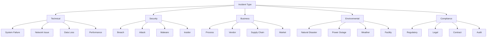
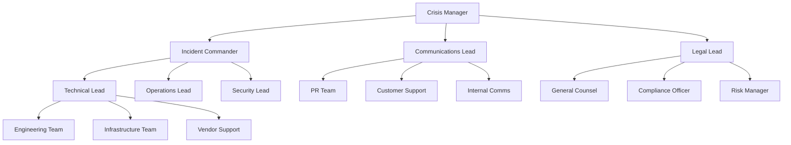
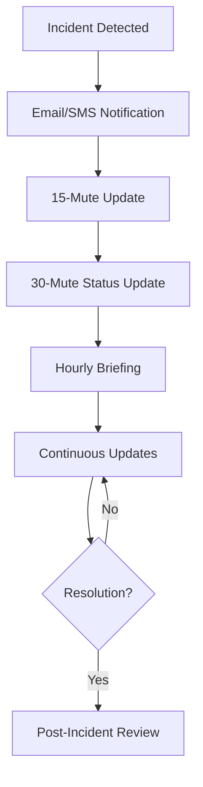
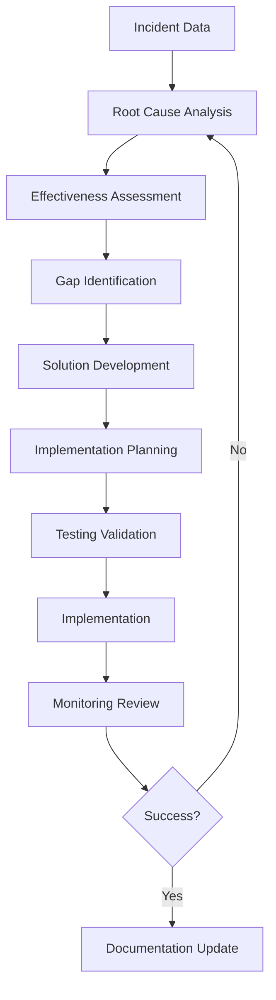
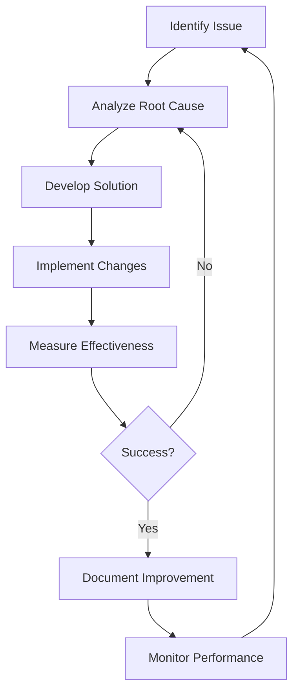

# Crisis Management Protocols
## erlmcp v3 Business Continuity Plan

### Executive Summary
This document outlines comprehensive crisis management protocols for erlmcp v3, designed to provide structured response to incidents and disasters. The protocols establish clear command structures, communication channels, and decision-making processes to ensure effective crisis management.

---

## 1. Crisis Management Structure

### 1.1 Crisis Management Organization

| Role | Responsibilities | Authority | Backup |
|------|-----------------|-----------|--------|
| **Crisis Manager** | Overall coordination | Executive authority | Deputy Crisis Manager |
| **Incident Commander** | Technical response | Operational authority | Technical Lead |
| **Communications Lead** | External/internal comms | Comms authority | Comms Specialist |
| **Technical Lead** | System recovery | Technical authority | Senior Engineer |
| **Business Lead** | Business continuity | Business authority | Operations Manager |
| **Security Lead** | Security response | Security authority | Security Officer |
| **Legal Lead** | Legal compliance | Legal authority | General Counsel |
| **Vendor Coordinator** | Third-party management | Vendor authority | Vendor Manager |

### 1.2 Activation Levels

| Level | Description | Activation Criteria | Response Time |
|-------|-------------|---------------------|--------------|
| **Level 1 - Critical** | System-wide outage | Revenue > $100K/hour loss | 15 minutes |
| **Level 2 - High** | Major service disruption | Revenue > $50K/hour loss | 30 minutes |
| **Level 3 - Medium** | Partial service impact | Customer complaints > 100 | 1 hour |
| **Level 4 - Low** | Minor incident | Internal detection only | 2 hours |
| **Level 5 - Monitor** | Potential issue | Proactive detection | 4 hours |

---

## 2. Incident Response Framework

### 2.1 Incident Classification

#### 2.1.1 Incident Categories


#### 2.1.2 Severity Levels
| Severity | Impact | Business Impact | Response Time |
|----------|--------|----------------|--------------|
| **P0 - Critical** | System down | >$500K/hour | 15 minutes |
| **P1 - High** | Major outage | >$100K/hour | 30 minutes |
| **P2 - Medium** | Reduced service | >$25K/hour | 1 hour |
| **P3 - Low** | Minor impact | <$25K/hour | 2 hours |
| **P4 - Info** | Monitoring | No impact | 4 hours |

### 2.2 Incident Lifecycle

#### 2.2.1 Incident Response Phases
1. **Detection & Reporting**
   - Automated alerts
   - Initial assessment
   - Escalation procedures

2. **Initial Response**
   - Activate team
   - Contain incident
   - Preserve evidence

3. **Investigation**
   - Root cause analysis
   - Impact assessment
   - Strategy development

4. **Containment & Eradication**
   - Contain spread
   - Remove cause
   - Restore services

5. **Recovery**
   - Service restoration
   - Data recovery
   - Performance validation

6. **Post-Incident**
   - Documentation
   - Lessons learned
   - Process improvement

---

## 3. Emergency Response Procedures

### 3.1 Initial Response Checklist

#### 3.1.1 First 30 Minutes
```markdown
## Immediate Actions
- [ ] **Activate Incident Response Team**
  - Notify Crisis Manager
  - Call emergency meeting
  - Set up incident room

- [ ] **Initial Assessment**
  - Confirm incident scope
  - Identify affected systems
  - Assess business impact
  - Determine severity level

- [ ] **Containment Measures**
  - Isolate affected systems
  - Stop incident spread
  - Preserve evidence
  - Implement workarounds

- [ ] **Notification Procedures**
  - Internal stakeholders
  - External customers
  - Regulatory bodies
  - Executive leadership
```

#### 3.1.2 First 60 Minutes
```markdown
## Escalation & Communication
- [ ] **Activate Crisis Management Team**
  - Confirm activation level
  - Assign team roles
  - Establish communication channels

- [ ] **Technical Response**
  - Gather technical details
  - Analyze root cause
  - Implement containment
  - Begin recovery procedures

- [ ] **Business Impact Assessment**
  - Calculate financial impact
  - Assess customer impact
  - Determine compliance implications
  - Update recovery timeline

- [ ] **Stakeholder Updates**
  - Initial status update
  - Expected resolution time
  - Communication plan
  - Decision requirements
```

### 3.2 Emergency Contact System

#### 3.2.1 Notification Tree


#### 3.2.2 Alert Templates

**Internal Alert Template:**
```markdown
# INCIDENT NOTIFICATION

**Incident ID:** INC-2024-001
**Severity Level:** P1 - High
**Time:** 2024-01-01 10:00 UTC
**Affected Systems:** Authentication Service

**Summary:**
Authentication service experiencing 100% failure rate. All users unable to access erlmcp platform.

**Actions Taken:**
- Incident response team activated
- Containment measures implemented
- Vendor support notified

**Next Steps:**
- Investigating root cause
- Implementing workaround
- Working to restore service

**Estimated Resolution:** 2 hours

**Contacts:**
- Incident Commander: John Smith +1-555-0101
- Technical Lead: Sarah Johnson +1-555-0102
```

**Customer Alert Template:**
```markdown
# SERVICE NOTIFICATION

**Service Status: degraded**
**Estimated Time to Service:** 2 hours
**Reference Number:** INC-2024-001

Dear Valued Customer,

We are currently experiencing an issue affecting authentication services for erlmcp v3. Our engineering team is working to restore normal service levels as quickly as possible.

**What this means:**
- Authentication may be temporarily unavailable
- API access may be intermittent
- Tool orchestration may be affected

**What we're doing:**
- Activating emergency response team
- Implementing temporary workarounds
- Engaging vendor support
- Monitoring systems continuously

We apologize for this inconvenience and will provide updates every 30 minutes until service is fully restored.

Best regards,
The erlmcp Team
```

### 3.3 Emergency Decision Authority

#### 3.3.1 Decision Matrix
| Decision Authority | Level 1 | Level 2 | Level 3 | Level 4 |
|-------------------|---------|---------|---------|---------|
**Service Restart** | Technical Lead | Technical Lead | Operations Manager | Team Lead |
**Site Activation** | Crisis Manager | Crisis Manager | Operations Lead | Team Lead |
**Vendor Engagement** | Technical Lead | Technical Lead | Operations Manager | Team Lead |
**Customer Notification** | Communications Lead | Communications Lead | Marketing Manager | Team Lead |
**Public Statement** | Crisis Manager | Crisis Manager | PR Director | Team Lead |
**Cost Authorization** | $10K | $50K | $100K | $500K |

#### 3.3.2 Emergency Decision Protocol
```erlang
% Emergency decision procedures
-module(erlmcp_emergency_decision).

-export([make_emergency_decision/2]).

make_emergency_decision(DecisionType, Context) ->
    % 1. Verify authorization
    case verify_authorization(DecisionType, Context) of
        authorized ->
            % 2. Gather information
            Information = gather_information(Context),

            % 3. Consult advisors
            Advice = consult_advisors(DecisionType, Information),

            % 4. Make decision
            case DecisionType of
                service_restart ->
                    approve_service_restart(Context);
                site_activation ->
                    approve_site_activation(Context);
                vendor_engagement ->
                    approve_vendor_engagement(Context);
                customer_notification ->
                    approve_customer_notification(Context);
                public_statement ->
                    approve_public_statement(Context);
                cost_authorization ->
                    approve_cost_authorization(Context)
            end;
        unauthorized ->
            {error, unauthorized_decision}
    end.
```

---

## 4. Crisis Communication Plan

### 4.1 Communication Channels

#### 4.1.1 Primary Channels
| Channel | Purpose | Audience | Update Frequency |
|---------|---------|----------|-----------------|
| **Email Distribution** | Formal notifications | All stakeholders | Immediate |
| **SMS Alerts** | Critical alerts | Key personnel | Immediate |
| **Status Page** | Public status | External customers | 15 minutes |
| **Slack Channels** | Team coordination | Internal team | Real-time |
| **Conference Calls** | Briefings | Leadership | Hourly |
| **Push Notifications** | Mobile alerts | Key contacts | Immediate |

#### 4.1.2 Escalation Procedures


### 4.2 Stakeholder Communication

#### 4.2.1 Stakeholder Classification
| Stakeholder | Communication Method | Frequency | Contact |
|------------|---------------------|----------|---------|
| **Internal Team** | Slack/Email | Real-time | IM list |
| **Executive Leadership** | Phone/Email | Hourly | Hotline |
| **Customers** | Status Page/Email | 15 minutes | Support |
| **Regulators** | Formal Letter | As required | Legal team |
| **Partners** | Direct contact | 30 minutes | Account managers |
| **Vendors** | Direct contact | Immediate | Vendor contacts |
| **Media** | Press releases | As needed | PR team |

#### 4.2.2 Communication Templates

**Status Update Template:**
```markdown
# STATUS UPDATE - [INCIDENT ID]

**Last Updated:** [TIME] UTC
**Current Status:** [STATUS]
**Affected Systems:** [SYSTEMS]

**Summary:**
[Brief description of current situation]

**Actions Taken:**
- [Action 1]
- [Action 2]
- [Action 3]

**Next Steps:**
- [Next action 1]
- [Next action 2]

**Estimated Resolution:** [TIMEFRAME]

**Contacts:**
- [Primary contact]
- [Secondary contact]
```

**Resolution Announcement:**
```markdown
# RESOLUTION NOTIFICATION

**Incident ID:** [ID]
**Resolved:** [TIME] UTC
**Duration:** [DURATION]

**Summary:**
[Describe the incident and resolution]

**Root Cause:**
[Brief explanation of root cause]

**Preventive Measures:**
[What will be done to prevent recurrence]

**Customer Impact:**
[Summary of impact to customers]

**Final Status:**
All services restored to normal operation. Full monitoring in place.

We apologize for any inconvenience this may have caused.

Thank you for your patience,
The erlmcp Team
```

### 4.3 Crisis Communication Guidelines

#### 4.3.1 Communication Principles
1. **Be Accurate** - Verify facts before communicating
2. **Be Transparent** - Share what you know and what you don't
3. **Be Consistent** - Single source of truth
4. **Be Timely** - Regular updates, don't disappear
5. **Be Empathetic** - Acknowledge impact on customers
6. **Be Prepared** - Have templates ready
7. **Be Responsible** - Consider all implications

#### 4.3.2 Do's and Don'ts
| Do | Don't |
|----|-------|
| • Update regularly | • Make promises you can't keep |
| • Be honest about uncertainty | • Speculate on causes |
| • Show empathy | • Blame others publicly |
| • Take responsibility | • Downplay severity |
| • Learn and improve | • Repeat mistakes |

---

## 5. Emergency Operations Center (EOC)

### 5.1 EOC Configuration

#### 5.1.1 Physical/Virtual Setup
```markdown
## Primary EOC
**Location:** Corporate HQ - Room 200
**Capacity:** 20 people
**Equipment:**
- Video conferencing system
- Multiple monitors
- Communication equipment
- Power backup
- Internet redundancy

## Backup EOC
**Location:** Remote site - Building B
**Capacity:** 15 people
**Equipment:** Same as primary
**Activation:** Primary EOC unavailable
```

#### 5.1.2 Roles and Responsibilities
| Role | Primary | Backup | Equipment |
|------|---------|--------|-----------|
| Crisis Manager | John Smith | Sarah Johnson | Command center |
| Incident Commander | Mike Wilson | Emily Davis | Technical stations |
| Communications | Lisa Chen | David Park | Comms gear |
| Technical Lead | Robert Taylor | Jennifer Lee | Engineering tools |
| Business Lead | Maria Rodriguez | James Brown | Business tools |
| Security | Kevin Martinez | Amanda White | Security tools |

### 5.2 EOC Activation Procedures

#### 5.2.1 Activation Checklist
```markdown
## EOC Activation - Level 1/2
- [ ] **Pre-Activation**
  - Alert team members
  - Secure facility access
  - Test communications
  - Set up workstations

- [ ] **Team Arrival**
  - Badge access verification
  - Equipment check
  - Workspace assignment
  - Briefing session

- [ ] **Operational Setup**
  - Communications channels active
  - Monitoring systems online
  - Documentation started
  - Decision authority confirmed

- [ ] **Full Activation**
  - Crisis management procedures active
  - External communication established
  - Recovery procedures initiated
  - Continuous monitoring begins
```

#### 5.2.2 EOC Procedures
```erlang
% EOC activation module
-module(erlmcp_eoc).

-export([activate_eoc/1, deactivate_eoc/1]).

activate_eoc(Level) ->
    % 1. Alert team members
    alert_team_members(Level),

    % 2. Set up communications
    setup_communications(),

    % 3. Prepare workstations
    prepare_workstations(),

    % 4. Start documentation
    start_documentation(),

    % 5. Activate monitoring
    activate_monitoring(),

    % 6. Confirm readiness
    confirm_readiness(),

    {ok, eoc_activated}.

% Communication setup
setup_communications() ->
    % Primary channels
    start_primary_channels(),

    % Backup channels
    start_backup_channels(),

    % Alert system
    configure_alert_system(),

    % Recording system
    start_recording().
```

### 5.3 EOC Documentation

#### 5.3.1 Log Templates
```markdown
## EOC LOG - [INCIDENT ID]

**Date/Time:** [DATE] [TIME]
**EOC Status:** [ACTIVATED/DEACTIVATED]
**Crisis Manager:** [NAME]
**Incident Commander:** [NAME]

**Timeline:**
[TIME] - [EVENT]
[TIME] - [EVENT]
[TIME] - [EVENT]

**Actions Taken:**
- [ACTION]
- [ACTION]
- [ACTION]

**Decisions Made:**
- [DECISION]
- [DECISION]
- [DECISION]

**Resource Allocation:**
- [RESOURCE]
- [RESOURCE]
- [RESOURCE]

**Communication:**
- [COMMUNICATION]
- [COMMUNICATION]
- [COMMUNICATION]

**Next Steps:**
- [NEXT STEP]
- [NEXT STEP]
- [NEXT STEP]
```

---

## 6. Post-Crisis Activities

### 6.1 Post-Incident Review

#### 6.1.1 Review Process
```markdown
## Post-Incident Review Process

### Phase 1: Information Gathering (24-48 hours)
- Collect all documentation
- Interview key personnel
- Gather system logs
- Review communications
- Collect customer feedback

### Phase 2: Analysis (3-5 days)
- Identify root causes
- Assess response effectiveness
- Evaluate communication adequacy
- Review resource allocation
- Identify improvement areas

### Phase 3: Reporting (1 week)
- Document findings
- Recommend corrective actions
- Identify process improvements
- Assign responsibilities
- Set timelines

### Phase 4: Implementation (2-4 weeks)
- Implement corrective actions
- Update procedures
- Conduct training
- Test improvements
- Monitor effectiveness
```

#### 6.1.2 Review Checklist
```markdown
## Review Areas Checklist

**Detection and Response**
- [ ] Timeliness of detection
- [ ] Effectiveness of alerting
- [ ] Activation of response team
- [ ] Initial assessment accuracy

**Technical Response**
- [ ] Containment effectiveness
- [ ] Root cause identification
- [ ] Recovery procedures
- [ ] System restoration

**Business Impact**
- [ ] Revenue impact assessment
- [ ] Customer impact
- [ ] Compliance implications
- [ ] Recovery timeline achievement

**Communication**
- [ ] Notification timeliness
- [ ] Message accuracy
- [ ] Consistency across channels
- [ ] Stakeholder satisfaction

**Resource Management**
- [ ] Team availability
- [ ] Equipment readiness
- [ ] Vendor coordination
- [ ] Cost control
```

### 6.2 Lessons Learned Process

#### 6.2.1 Analysis Framework


#### 6.2.2 Lessons Learned Template
```markdown
# LESSONS LEARNED - [INCIDENT ID]

## Summary
[Brief overview of incident and key learnings]

## What Went Well
1. **Strength 1**
   - Description of what worked well
   - Why it was effective
   - How to replicate

2. **Strength 2**
   - Description of what worked well
   - Why it was effective
   - How to replicate

## Areas for Improvement
1. **Issue 1**
   - Description of the problem
   - Root cause
   - Recommended solution
   - Implementation plan

2. **Issue 2**
   - Description of the problem
   - Root cause
   - Recommended solution
   - Implementation plan

## Action Items
- [ ] Task 1 - Owner - Due Date
- [ ] Task 2 - Owner - Due Date
- [ ] Task 3 - Owner - Due Date

## Follow-up
[Next steps for implementation]
```

---

## 7. Training and Exercises

### 7.1 Training Program

#### 7.1.1 Training Curriculum
| Topic | Audience | Frequency | Duration |
|-------|----------|-----------|----------|
| Incident Response Protocols | All staff | Annually | 2 hours |
 Crisis Management Team | Management | Semi-annually | 4 hours |
| Technical Response | Engineering | Quarterly | 3 hours |
| Communication Procedures | Comms Team | Quarterly | 2 hours |
| EOC Operations | Response Team | Annually | 4 hours |

#### 7.1.2 Training Materials
```markdown
## Training Module: Incident Response

### Objectives
- Understand incident response lifecycle
- Know activation procedures
- Understand roles and responsibilities
- Practice communication protocols
- Familiarize with tools and systems

### Agenda
1. Overview (30 min)
   - Incident response framework
   - Activation levels
   - Roles and responsibilities

2. Procedures (60 min)
   - Initial response checklist
   - Technical response procedures
   - Communication protocols
   - Escalation procedures

3. Simulation (90 min)
   - Tabletop exercise
   - Role-playing scenarios
   - Decision-making practice
   - Communication practice

4. Review (30 min)
   - Lessons learned
   - Q&A session
   - Evaluation
```

### 7.2 Exercise Program

#### 7.2.1 Exercise Types
| Exercise | Frequency | Participants | Focus |
|----------|-----------|-------------|-------|
| **Tabletop** | Quarterly | Management | Decision-making |
| **Simulation** | Quarterly | Technical team | Technical response |
| **Full-scale** | Semi-annually | Full team | End-to-end |
| **Drill** | Monthly | Individual roles | Specific skills |
| **Peer Review** | Quarterly | External teams | Best practices |

#### 7.2.2 Exercise Scenarios
```markdown
## Scenario: Major Data Center Failure

### Scenario Description
Primary data center experiences power failure and cooling issue, causing complete system shutdown. Secondary site must be activated within 2 hours.

### Exercise Objectives
- Test EOC activation
- Validate failover procedures
- Practice decision-making
- Test communication protocols
- Assess team coordination

### Expected Outcomes
- EOC activated within 30 minutes
- Failover initiated within 1 hour
- Communication protocols executed properly
- Recovery within 4 hours
- All stakeholders informed appropriately

### Success Criteria
- 100% of critical procedures completed
- Communication within timeframes
- No escalation of issues
- Team coordination effective
- Documentation complete
```

---

## 8. Continuous Improvement

### 8.1 Monitoring and Metrics

#### 8.1.1 Key Performance Indicators
| Metric | Target | Measurement | Frequency |
|--------|--------|-------------|-----------|
| Response Time | < 15 min | Time from detection to response | Real-time |
| Resolution Time | < RTO | Time from incident to resolution | Per incident |
| Communication Time | < 30 min | Time from incident to notification | Per incident |
| Escalation Rate | < 10% | Incidents requiring escalation | Monthly |
| Team Availability | > 95% | Team member availability | Daily |

#### 8.1.2 Performance Dashboard
```erlang
% Crisis management performance monitoring
-module(erlmcp_crisis_metrics).

-export([track_performance/1, generate_dashboard/0]).

track_performance(Incident) ->
    % 1. Track response time
    ResponseTime = calculate_response_time(Incident),
    track_metric(response_time, ResponseTime),

    % 2. Track resolution time
    ResolutionTime = calculate_resolution_time(Incident),
    track_metric(resolution_time, ResolutionTime),

    % 3. Track communication time
    CommTime = calculate_communication_time(Incident),
    track_metric(communication_time, CommTime),

    % 4. Track escalation
    case should_escalate(Incident) of
        true ->
            track_metric(escalation, 1);
        false ->
            track_metric(escalation, 0)
    end,

    % 5. Generate alerts
    check_thresholds(Incident).

% Crisis management dashboard
generate_dashboard() ->
    % Calculate metrics
    AvgResponse = average_recent_responses(),
    AvgResolution = average_recent_resolutions(),
    EscalationRate = recent_escalation_rate(),

    % Dashboard data
    Dashboard = #{
        response_time => #{
            current => latest_response_time(),
            average => AvgResponse,
            target => 15,
            status => compare_to_target(AvgResponse, 15)
        },
        resolution_time => #{
            current => latest_resolution_time(),
            average => AvgResolution,
            target => target_rto(),
            status => compare_to_target(AvgResolution, target_rto())
        },
        escalation_rate => #{
            current => EscalationRate,
            average => historical_escalation_rate(),
            target => 0.10,
            status => compare_to_target(EscalationRate, 0.10)
        },
        team_availability => current_team_availability(),
        recent_incidents => recent_incidents_summary()
    },

    % Display dashboard
    display_dashboard(Dashboard).
```

### 8.2 Process Improvement

#### 8.2.1 Continuous Improvement Cycle


#### 8.2.2 Improvement Areas
| Category | Current State | Target State | Improvement Plan |
|----------|---------------|--------------|------------------|
| Detection | Manual monitoring | AI-powered detection | Implement monitoring AI |
| Response | Reactive procedures | Proactive automation | Develop automated response |
| Communication | Email notifications | Multi-channel alerts | Implement alerting system |
| Training | Annual training | Continuous training | Create micro-learning |
| Documentation | Static documents | Dynamic knowledge base | Implement wiki |

---

## 9. Conclusion

This comprehensive crisis management protocol provides erlmcp v3 with:

1. **Structured Response Framework**: Clear roles, responsibilities, and procedures
2. **Effective Communication**: Multi-channel stakeholder communication plan
3. **Well-Equipped EOC**: Ready-to-use emergency operations center
4. **Continuous Improvement**: Regular training and exercise program
5. **Performance Monitoring**: Metrics and dashboard for crisis management effectiveness

The protocols ensure structured, effective response to incidents and disasters, maintaining business continuity and protecting erlmcp v3 operations.