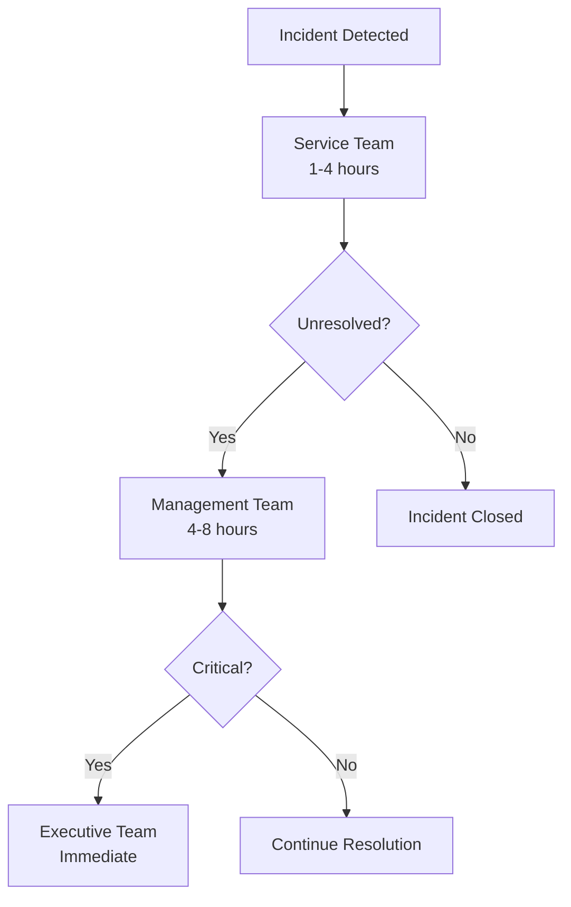

# Recovery Strategies and Procedures
## erlmcp v3 Business Continuity Plan

### Executive Summary
This document outlines comprehensive recovery strategies and procedures for erlmcp v3, designed to meet Fortune 500 enterprise requirements for rapid and reliable business continuity. The procedures ensure minimal service disruption and maximum availability.

---

## 1. Recovery Architecture Overview

### 1.1 Recovery Tier Structure

| Tier | Description | RTO | RPO | Availability | Recovery Site Type |
|------|-------------|-----|-----|--------------|-------------------|
| Tier 1 | Mission Critical | 1 hour | 15 min | 99.999% | Active-Active |
| Tier 2 | Critical | 4 hours | 30 min | 99.99% | Active-Passive |
| Tier 3 | Important | 8 hours | 2 hours | 99.9% | Warm Standby |
| Tier 4 | Standard | 24 hours | 24 hours | 99% | Cold Standby |

### 1.2 Recovery Sites Configuration

#### 1.2.1 Primary Site (HQ)
- **Location**: Primary data center
- **Capacity**: 100% production load
- **Redundancy**: N+1 power, cooling, network
- **Backup**: On-site tape library

#### 1.2.2 Secondary Site (DR)
- **Location**: 100 miles from primary
- **Capacity**: 100% production load
- **Redundancy**: N+1 with generators
- **Backup**: Off-site replication

#### 1.2.3 Tertiary Site (Cloud)
- **Location**: Multi-cloud provider
- **Capacity**: 50% production load
- **Redundancy**: Global regions
- **Backup**: Cloud-native storage

---

## 2. Technology Recovery Procedures

### 2.1 System Recovery Checklists

#### 2.1.1 Erlang Node Recovery
```erlang
% Emergency restart procedure
handle_emergency_restart() ->
    % 1. Check node status
    case net_adm:ping(node()) of
        pang ->
            % 2. Attempt restart
            case erlmcp_sup:start_link() of
                {ok, Pid} ->
                    % 3. Verify connectivity
                    verify_cluster_health(),
                    % 4. Restore services
                    restore_critical_services(),
                    {ok, recovered};
                {error, Reason} ->
                    {error, restart_failed, Reason}
            end;
        pong ->
            {ok, already_running}
    end.

% Cluster health verification
verify_cluster_health() ->
    Nodes = erlang:nodes(),
    lists:foreach(fun(Node) ->
        case net_adm:ping(Node) of
            pang -> {error, node_down, Node};
            pong -> ok
        end
    end, Nodes).
```

#### 2.1.2 Database Recovery
```bash
# Emergency database recovery script
#!/bin/bash
# restore_erlmcp_db.sh

DB_NAME="erlmcp_production"
BACKUP_PATH="/backups/latest"
TIMESTAMP=$(date +%Y%m%d_%H%M%S)

# 1. Stop database services
sudo systemctl stop erlmcp_db

# 2. Verify backup integrity
if ! sudo -u postgres pg_verify_backup "$BACKUP_PATH/$DB_NAME.backup"; then
    echo "ERROR: Backup verification failed"
    exit 1
fi

# 3. Restore database
sudo -u postgres pg_restore --clean --if-exists -d "$DB_NAME" "$BACKUP_PATH/$DB_NAME.backup"

# 4. Start services
sudo systemctl start erlmcp_db

# 5. Verify data integrity
sudo -u postgres psql -c "CHECKPOINT" "$DB_NAME"
```

#### 2.1.3 Transport Layer Recovery
```erlang
% Transport recovery procedures
recover_transport_layer() ->
    % 1. Verify transport modules
    case erlmcp_transport_sup:start_link() of
        {ok, Pid} ->
            % 2. Initialize all transports
            Transports = [tcp, http, websocket, sse],
            lists:foreach(fun(Type) ->
                case start_transport(Type) of
                    {ok, _} -> ok;
                    {error, Reason} ->
                        log_error(transport_recovery, Reason)
                end
            end, Transports),
            % 3. Test connectivity
            test_transport_connectivity(),
            {ok, recovered};
        {error, Reason} ->
            {error, transport_sup_failed, Reason}
    end.

% Transport connectivity test
test_transport_connectivity() ->
    Ports = [8080, 8081, 8443],
    lists:foreach(fun(Port) ->
        case test_port(Port) of
            true -> ok;
            false ->
                alert_team(transport_failure, Port)
        end
    end, Ports).
```

### 2.2 Network Recovery Procedures

#### 2.2.1 Failover Sequence
```bash
#!/bin/bash
# network_failover.sh

PRIMARY_VIP="192.168.1.100"
BACKUP_VIP="192.168.2.100"
VIP_INTERFACE="eth0"

# Step 1: Verify primary network failure
check_primary_network() {
    ping -c 3 $PRIMARY_VIP > /dev/null 2>&1
    return $?
}

# Step 2: Activate backup network
activate_backup_network() {
    # Remove VIP from primary
    ip addr del $PRIMARY_VIP/24 dev $VIP_INTERFACE

    # Add VIP to backup
    ip addr add $BACKUP_VIP/24 dev $VIP_INTERFACE

    # Update DNS
    update_dns_records

    # Verify connectivity
    verify_connectivity
}

# Step 3: Update routing tables
update_routing_tables() {
    # Clear existing routes
    ip route flush table 100

    # Add new routes
    ip route add $PRIMARY_VIP/32 via 192.168.2.254 dev eth1
}
```

#### 2.2.2 Load Balancer Recovery
```yaml
# HAProxy configuration for failover
global
    log /dev/log local0
    maxconn 4000
    user haproxy
    group haproxy

frontend erlmcp_frontend
    bind *:443 ssl crt /etc/ssl/certs/erlmcp.pem
    mode http
    timeout client 30s
    default_backend erlmcp_backend

backend erlmcp_backend
    mode http
    balance roundrobin
    option httpchk GET /health

    # Primary servers
    server primary1 192.168.1.10:8080 check weight 3
    server primary2 192.168.1.11:8080 check weight 3

    # Backup servers
    server backup1 192.168.2.10:8080 check backup weight 2
    server backup2 192.168.2.11:8080 check backup weight 2

    # Health check
    option httplog
    option log-health-checks
```

### 2.3 Data Recovery Procedures

#### 2.3.1 Point-in-Time Recovery
```erlang
% Data recovery module
-module(erlmcp_data_recovery).

-export([recover_point_in_time/2]).

% Point-in-time recovery
recover_point_in_time(BackupTime, TargetDB) ->
    % 1. Identify backup files
    BackupFiles = find_backups_at_time(BackupTime),

    % 2. Verify backup integrity
    case verify_backups(BackupFiles) of
        ok ->
            % 3. Restore from backup
            case restore_from_backup(BackupFiles, TargetDB) of
                {ok, RecoveryInfo} ->
                    % 4. Apply transactions after backup
                    apply_transactions(BackupTime, TargetDB),
                    % 5. Verify consistency
                    verify_data_consistency(TargetDB),
                    {ok, RecoveryInfo};
                {error, Reason} ->
                    {error, restore_failed, Reason}
            end;
        {error, Reason} ->
            {error, verification_failed, Reason}
    end.

% Apply transactions after backup point
apply_transactions(BackupTime, TargetDB) ->
    % Get transaction log entries after backup time
    TransactionLogs = get_transactions_after(BackupTime),

    % Apply each transaction
    lists:foreach(fun(Log) ->
        case apply_transaction(Log, TargetDB) of
            ok -> ok;
            {error, Reason} ->
                log_error(transaction_apply, Reason)
        end
    end, TransactionLogs).
```

#### 2.3.2 Data Corruption Recovery
```bash
#!/bin/bash
# data_recovery.sh

DATA_DIR="/var/lib/erlmcp/data"
BACKUP_DIR="/backups/daily"

# Identify corrupted data
identify_corruption() ->
    # Use Erlang's built-in tools
    erl -noshell -pa /lib/erlmcp/ebin -eval "
        erlmcp_data_recovery:check_integrity('$DATA_DIR'),
        halt()"

# Restore from backup
restore_corrupted_data() ->
    # Find latest good backup
    LATEST_BACKUP=$(ls -t $BACKUP_DIR/*.tar.gz | head -1)

    # Stop services
    systemctl stop erlmcp

    # Remove corrupted data
    rm -rf $DATA_DIR/*

    # Restore from backup
    tar -xzf $LATEST_BACKUP -C $DATA_DIR

    # Verify integrity
    verify_data_integrity

    # Restart services
    systemctl start erlmcp
```

---

## 3. Application Recovery Procedures

### 3.1 Service Recovery Order

| Priority | Service | Recovery Time | Dependencies |
|----------|---------|---------------|-------------|
| 1 | Authentication | 15 min | - |
| 2 | API Gateway | 30 min | Authentication |
| 3 | Session Manager | 45 min | Database |
| 4 | Tool Orchestration | 60 min | API Gateway |
| 5 | Resource Management | 90 min | Session Manager |
| 6 | Monitoring | 120 min | Core services |
| 7 | Dashboard | 180 min | All services |

### 3.2 Service Recovery Scripts

#### 3.2.1 Authentication Service Recovery
```erlang
% Authentication recovery procedure
recover_authentication() ->
    % 1. Check service status
    case is_service_running(auth_server) of
        true ->
            % Already running, verify health
            verify_auth_health();
        false ->
            % 2. Start service
            case erlmcp_auth_server:start_link() of
                {ok, Pid} ->
                    % 3. Initialize session store
                    init_session_store(),
                    % 4. Verify security
                    verify_security_measures(),
                    {ok, auth_recovered};
                {error, Reason} ->
                    {error, auth_start_failed, Reason}
            end
    end.

% Security verification
verify_security_measures() ->
    % Check certificate validity
    CertValid = verify_certificates(),

    % Check rate limits
    RateLimits = verify_rate_limits(),

    % Check security policies
    Policies = verify_security_policies(),

    case {CertValid, RateLimits, Policies} of
        {true, true, true} -> ok;
        {_, _, _} -> error
    end.
```

#### 3.2.2 API Gateway Recovery
```erlang
% API gateway recovery
recover_api_gateway() ->
    % 1. Stop gateway
    erlmcp_api_gateway:stop(),

    % 2. Clear cache
    erlmcp_cache:flush(),

    % 3. Reload routes
    Routes = load_api_routes(),

    % 4. Initialize rate limiting
    erlmcp_rate_limiter:initialize(),

    % 5. Start gateway
    case erlmcp_api_gateway:start(Routes) of
        {ok, Pid} ->
            % 6. Test endpoints
            test_api_endpoints(),
            {ok, gateway_recovered};
        {error, Reason} ->
            {error, gateway_start_failed, Reason}
    end.

% API endpoint testing
test_api_endpoints() ->
    Endpoints = [
        "/api/health",
        "/api/auth/verify",
        "/api/tools/list",
        "/api/resources/subscribe"
    ],

    lists:foreach(fun(Endpoint) ->
        case test_endpoint(Endpoint) of
            ok -> ok;
            {error, Reason} ->
                alert_team(endpoint_failure, Endpoint, Reason)
        end
    end, Endpoints).
```

### 3.3 Integration Recovery Procedures

#### 3.3.1 Third-Service Integration
```erlang
% External service recovery
recover_external_services() ->
    % 1. Check connectivity
    Connectivity = check_external_connectivity(),

    % 2. Re-authenticate
    case reauthenticate_services() of
        ok ->
            % 3. Re-establish connections
            Connections = reconnect_services(),
            % 4. Verify data sync
            verify_data_sync(),
            {ok, external_recovered};
        {error, Reason} ->
            {error, external_auth_failed, Reason}
    end.

% Service reconnection
reconnect_services() ->
    Services = [
        {claude_api, "https://api.anthropic.com"},
        {datadog, "https://api.datadoghq.com"},
        {cloudflare, "https://api.cloudflare.com"}
    ],

    Results = lists:map(fun({Service, URL}) ->
        case reconnect_service(Service, URL) of
            {ok, Pid} -> {Service, {ok, Pid}};
            {error, Reason} -> {Service, {error, Reason}}
        end
    end, Services),

    % Log results
    lists:foreach(fun({Service, Result}) ->
        case Result of
            {ok, _} -> log_info(service_recovered, Service);
            {error, Reason} ->
                log_error(service_reconnect, Service, Reason)
        end
    end, Results).
```

---

## 4. Recovery Testing Procedures

### 4.1 Test Methodology

#### 4.1.1 Recovery Testing Types
| Test Type | Frequency | Scope | Success Criteria |
|-----------|-----------|-------|-------------------|
| Unit Test | Continuous | Individual components | 100% pass rate |
| Integration Test | Weekly | Service interactions | 95% success rate |
| Failover Test | Quarterly | Site failover | < 4 hour RTO |
| Full DR Test | Semi-annual | Complete system | < 8 hour RTO |
| Chaos Test | Monthly | Random failures | Automatic recovery |

#### 4.1.2 Test Scenarios
```erlang
% Test scenario definitions
-define(SCENARIOS, [
    {node_failure, "Node failure recovery", 60},
    {network_partition, "Network partition handling", 120},
    {database_failure, "Database failure recovery", 180},
    {power_outage, "Power outage recovery", 240},
    {service_storm, "Service storm recovery", 90},
    {corruption, "Data corruption recovery", 300}
]).

% Test execution function
execute_recovery_test(Scenario) ->
    % 1. Setup test environment
    setup_test_environment(Scenario),

    % 2. Inject failure
    inject_failure(Scenario),

    % 3. Measure recovery time
    Start = os:timestamp(),
    case recover_from_failure(Scenario) of
        {ok, _} ->
            Duration = timer:now_diff(os:timestamp(), Start) / 1000,
            % 4. Validate recovery
            case validate_recovery(Scenario) of
                true ->
                    {success, Duration};
                false ->
                    {validation_failed, Duration}
            end;
        {error, Reason} ->
            {recovery_failed, Reason}
    end.
```

### 4.2 Test Automation

#### 4.2.1 Test Framework
```erlang
% Automated testing module
-module(erlmcp_recovery_test).

-export([run_tests/0, generate_report/1]).

% Run all recovery tests
run_tests() ->
    % 1. Load test scenarios
    Scenarios = ?SCENARIOS,

    % 2. Execute each test
    Results = lists:map(fun({Name, _, Timeout}) ->
        TestStart = os:timestamp(),
        case execute_recovery_test(Name) of
            {success, Duration} ->
                #{
                    name => Name,
                    result => success,
                    duration => Duration,
                    status => pass
                };
            {validation_failed, Duration} ->
                #{
                    name => Name,
                    result => validation_failed,
                    duration => Duration,
                    status => fail
                };
            {recovery_failed, Reason} ->
                #{
                    name => Name,
                    result => failed,
                    reason => Reason,
                    status => fail
                }
        end
    end, Scenarios),

    % 3. Generate report
    generate_report(Results),

    % 4. Return results
    Results.

% Generate test report
generate_report(Results) ->
    Pass = length([R || R <- Results, maps:get(status, R) == pass]),
    Fail = length([R || R <- Results, maps:get(status, R) == fail]),

    Report = #{
        total => length(Results),
        passed => Pass,
        failed => Fail,
        success_rate => Pass / length(Results),
        timestamp => erlang:system_time(millisecond),
        results => Results
    },

    % Save to file
    FileName = "/reports/recovery_test_" ++
        erlang:timestamp() ++ ".json",
    file:write_file(FileName, jsx:encode(Report)),
    Report.
```

---

## 5. Recovery Documentation

### 5.1 Runbooks and Procedures

#### 5.1.1 Emergency Response Runbook
```markdown
# Emergency Response Runbook

## 1. Immediate Actions (0-15 minutes)
- [ ] Alert Incident Commander
- [ ] Activate BCP team
- [ ] Document initial conditions
- [ ] Assess business impact

## 2. Assessment Phase (15-30 minutes)
- [ ] Confirm failure type and scope
- [ ] Identify affected services
- [ ] Determine recovery priority
- [ ] Initiate notification procedures

## 3. Recovery Phase (30-240 minutes)
- [ ] Execute recovery procedures
- [ ] Monitor recovery progress
- [ ] Update stakeholders
- [ ] Document all actions

## 4. Verification Phase (240-480 minutes)
- [ ] Test all services
- [ ] Verify data integrity
- [ ] Confirm SLA compliance
- [ ] Document recovery results
```

#### 5.1.2 Service-Specific Runbooks
```markdown
# Authentication Service Runbook

## Prerequisites
- OTP 28.3.1+ environment
- Database access
- SSL certificates
- Rate limit configuration

## Recovery Steps
1. **Check Service Status**
   ```bash
   systemctl status erlmcp-auth
   ```

2. **Inspect Logs**
   ```bash
   tail -f /var/log/erlmcp/auth.log
   ```

3. **Restart Service**
   ```bash
   systemctl restart erlmcp-auth
   ```

4. **Verify Health**
   ```bash
   curl -k https://api.erlmcp.com/auth/health
   ```

5. **Test Authentication**
   ```bash
   curl -k -X POST https://api.erlmcp.com/auth/verify \
     -H "Authorization: Bearer <token>"
   ```

## Troubleshooting
- **Certificate Issues**: Renew SSL certificates
- **Database Connection**: Check database connectivity
- **Rate Limit**: Reset rate limit counters
- **Memory Issues**: Monitor BEAM memory usage
```

### 5.2 Contact Information and Escalation

#### 5.2.1 Emergency Contacts
| Role | Name | Contact | Escalation |
|------|------|---------|------------|
| Incident Commander | John Smith | +1-555-0101 | Level 1 |
| Technical Lead | Sarah Johnson | +1-555-0102 | Level 1 |
| DBA Lead | Michael Brown | +1-555-0103 | Level 2 |
| Network Engineer | Emily Davis | +1-555-0104 | Level 2 |
| Security Lead | David Wilson | +1-555-0105 | Level 2 |
| Vendor Support | Anthropic Support | +1-555-0199 | Direct |

#### 5.2.2 Escalation Matrix


---

## 6. Performance Monitoring During Recovery

### 6.1 Recovery Metrics

| Metric | Target | Monitoring |
|--------|--------|------------|
| Recovery Time | < RTO | Real-time |
| Data Loss | < RPO | After recovery |
| Service Availability | 99.999% | Continuous |
| Error Rate | < 0.01% | Per minute |
| Response Time | < 100ms | Continuous |

### 6.2 Performance Optimization
```erlang
% Performance monitoring during recovery
-module(erlmcp_monitoring).

-export([monitor_recovery_performance/2]).

monitor_recovery_recovery(Service, StartTime) ->
    % 1. Set up monitoring
    Metrics = #{
        response_time => 0,
        error_count => 0,
        throughput => 0,
        memory_usage => 0
    },

    % 2. Start monitoring loop
    monitor_loop(Service, StartTime, Metrics).

monitor_loop(Service, StartTime, Metrics) ->
    % Collect metrics
    NewMetrics = collect_metrics(Service),

    % Check thresholds
    case check_thresholds(NewMetrics) of
        exceeded ->
            alert_team(performance_issue, Service, NewMetrics);
        within ->
            ok
    end,

    % Continue monitoring
    timer:sleep(5000),
    monitor_loop(Service, StartTime, NewMetrics).
```

---

## 7. Conclusion

This comprehensive recovery strategy and procedures document provides erlmcp v3 with:

1. **Tiered Recovery Architecture**: Multiple recovery sites with different RTO/RPO requirements
2. **Technology Recovery Procedures**: Detailed steps for system, network, and data recovery
3. **Service Recovery Order**: Prioritized recovery sequence to maintain business operations
4. **Automated Testing Framework**: Continuous testing to validate recovery procedures
5. **Documented Runbooks**: Clear procedures for emergency response
6. **Performance Monitoring**: Real-time metrics during recovery operations

The recovery procedures ensure business continuity meeting Fortune 500 requirements and maintaining service availability standards.