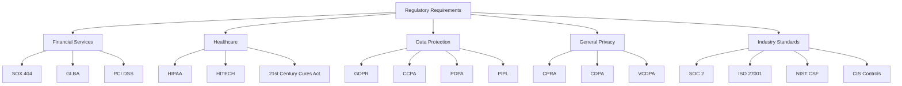
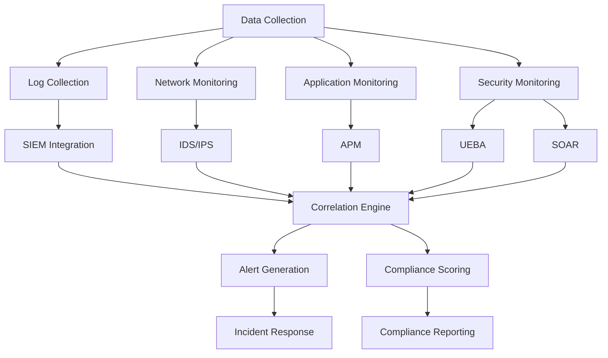
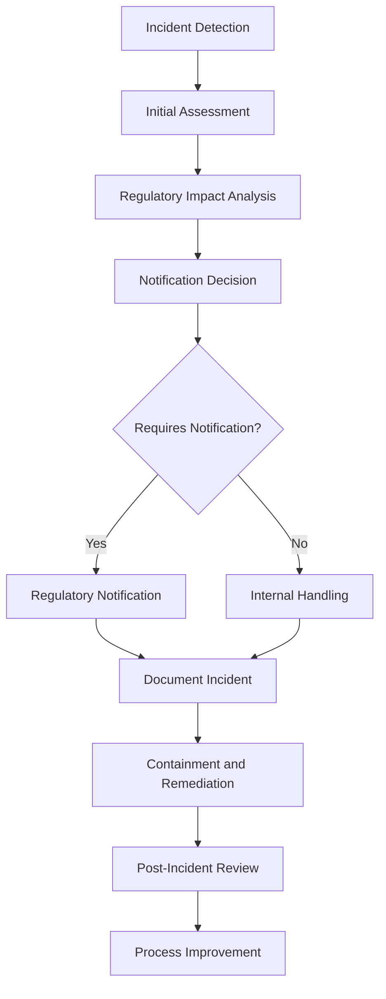
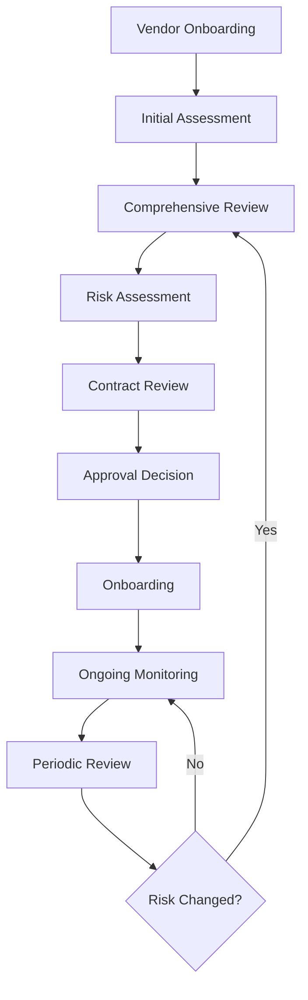
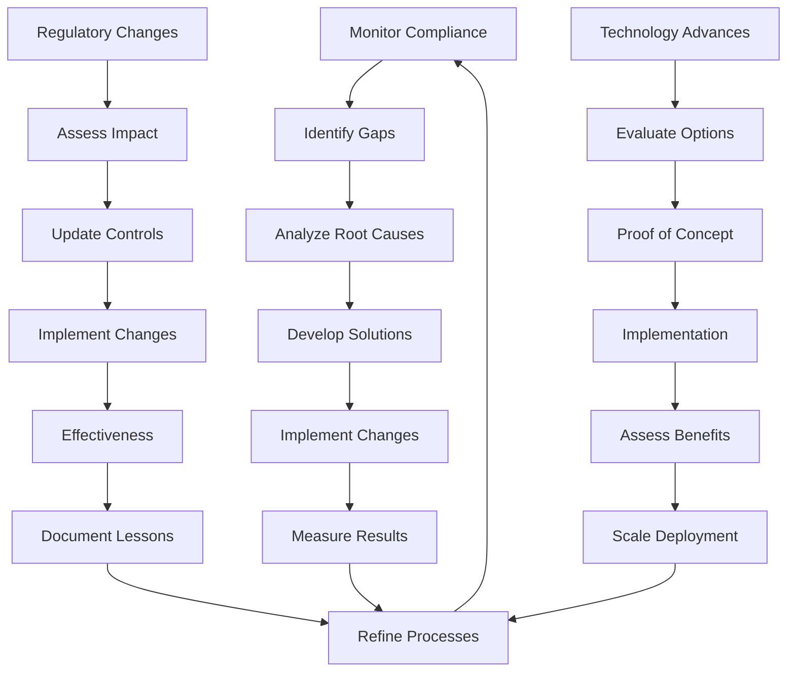

# Regulatory Compliance Requirements
## erlmcp v3 Business Continuity Plan

### Executive Summary
This document outlines comprehensive regulatory compliance requirements for erlmcp v3, designed to meet Fortune 500 enterprise compliance standards. The document covers regulatory mapping, compliance frameworks, monitoring procedures, and reporting requirements for various regulatory domains.

---

## 1. Regulatory Landscape Overview

### 1.1 Regulatory Categories

| Category | Regulations | Jurisdictions | Compliance Level |
|----------|-------------|---------------|-----------------|
| **Financial Services** | SOX 404, GLBA, PCI DSS | US, Global | High |
| **Healthcare** | HIPAA, HITECH | US | Critical |
| **Data Protection** | GDPR, CCPA, PDPA | EU, CA, SG | Critical |
| **General Data** | CCPA, CPA, VCDPA | US States | High |
| **Industry** | SOC 2, ISO 27001 | Global | High |
| **Specific Industries** | FINRA, FDA, CFTC | US | Varies |

### 1.2 Regulatory Impact Assessment



---

## 2. Compliance Framework Implementation

### 2.1 General Data Protection Regulation (GDPR)

#### 2.1.1 GDPR Requirements Mapping

| Requirement | Implementation | Controls | Monitoring |
|-------------|----------------|----------|------------|
| **Lawful Basis** | Consent management | Audit trails | Monthly |
| **Data Minimization** | Field-level controls | Data masking | Quarterly |
| **Purpose Limitation** | Data usage policies | Access controls | Continuous |
| **Retention Policies** | Automated deletion | System logs | Weekly |
| **Data Subject Rights** | Right management interface | Workflow automation | Monthly |
| **Breach Notification** | Incident response procedures | Alert systems | Real-time |
| **Data Transfer** | Cross-border agreements | Encryption | Quarterly |

#### 2.1.2 GDPR Technical Implementation
```erlang
% GDPR compliance implementation
-module(erlmcp_gdpr).

-export([manage_consent/2, implement_data_minimization/1, enforce_retention/1]).

% Manage user consent
manage_consent(UserId, ConsentData) ->
    % 1. Validate consent data
    Validated = validate_consent_data(ConsentData),

    % 2. Store consent records
    ConsentRecord = store_consent_record(UserId, Validated),

    % 3. Update consent status
    update_consent_status(UserId, Validated),

    % 4. Audit consent changes
    audit_consent_changes(UserId, Validated),

    % 5. Apply consent-based access controls
    apply_consent_controls(UserId, Validated),

    ConsentRecord.

% Implement data minimization
implement_data_minimization(DataFields) ->
    % 1. Classify data fields
    Classification = classify_data_fields(DataFields),

    % 2. Apply minimization controls
    MinimizedData = apply_minimization_controls(Classification),

    % 3. Mask sensitive fields
    MaskedData = apply_data_masking(MinimizedData),

    % 4. Audit data access
    audit_data_access(MaskedData),

    % 5. Log minimization actions
    log_minimization_actions(Classification),

    MaskedData.

% Enforce data retention policies
enforce_retention(Policies) ->
    % 1. Scan data inventory
    DataInventory = scan_data_inventory(),

    % 2. Apply retention policies
    AppliedPolicies = apply_retention_policies(DataInventory, Policies),

    % 3. Schedule deletion
    schedule_data_deletion(AppliedPolicies),

    % 4. Monitor retention compliance
    Compliance = monitor_retention_compliance(),

    % 5. Report on retention status
    report_retention_status(Compliance),

    Compliance.
```

### 2.2 Health Insurance Portability and Accountability Act (HIPAA)

#### 2.2.1 HIPAA Compliance Requirements

| Requirement | Controls | Implementation | Frequency |
|-------------|----------|----------------|-----------|
| **Access Controls** | Role-based access, MFA | Identity management | Continuous |
| **Audit Controls** | System activity logging | SIEM integration | Real-time |
| **Technical Safeguards** | Encryption, access logs | Data protection | Continuous |
| **Physical Safeguards** | Facility security | Site security | Daily |
| **Administrative Safeguards** | Policies, training | Governance | Quarterly |
| **Breach Notification** | Incident response procedures | Alert systems | Real-time |
| **Business Associate Agreements** | Contract management | Legal review | Annual |

#### 2.2.2 HIPAA Technical Controls
```bash
#!/bin/bash
# hipaa_compliance_check.sh

# HIPAA compliance check script
# Usage: ./hipaa_compliance_check.sh

echo "=== HIPAA Compliance Check ==="

# 1. Access Controls Check
echo "Checking access controls..."
if check_access_controls; then
    echo "✓ Access controls compliant"
else
    echo "✗ Access controls issue found"
fi

# 2. Encryption Check
echo "Checking encryption..."
if check_encryption_compliance; then
    echo "✓ Encryption compliant"
else
    echo "✗ Encryption issue found"
fi

# 3. Audit Logs Check
echo "Checking audit logs..."
if check_audit_logs; then
    echo "✓ Audit logs compliant"
else
    echo "✗ Audit logs issue found"
fi

# 4. Training Records Check
echo "Checking training records..."
if check_training_records; then
    echo "✓ Training records compliant"
else
    echo "✗ Training records issue found"
fi

# 5. BAAs Check
echo "Checking Business Associate Agreements..."
if check_baa_compliance; then
    echo "✓ BAAs compliant"
else
    echo "✗ BAAs issue found"
fi

# 6. Risk Assessment
echo "Running risk assessment..."
run_hipaa_risk_assessment

# 7. Generate Report
echo "Generating compliance report..."
generate_hipaa_report

echo "HIPAA compliance check completed at $(date)"
```

### 2.3 Sarbanes-Oxley Act (SOX 404)

#### 2.3.1 SOX 404 Requirements

| Requirement | Controls | Implementation | Frequency |
|-------------|----------|----------------|-----------|
| **Internal Controls** | Segregation of duties | Access controls | Quarterly |
| **Financial Reporting** | Data integrity checks | Validation rules | Daily |
| **Audit Trail** | Change logging | Version control | Continuous |
| **Documentation** | Policy documentation | Repository management | Quarterly |
| **Management Assessment** | Control testing | Automated testing | Annual |
| **Whistleblower Protection** | Reporting mechanisms | Anonymous reporting | Continuous |

#### 2.3.2 SOX Compliance Implementation
```erlang
% SOX compliance implementation
-module(erlmcp_sox).

-export([implement_internal_controls/1, maintain_audit_trail/2, test_controls/1]).

% Implement internal controls
implement_internal_controls(Controls) ->
    % 1. Define control matrix
    ControlMatrix = define_control_matrix(Controls),

    % 2. Implement segregation of duties
    Segregation = implement_segregation_of_duties(ControlMatrix),

    % 3. Set up approval workflows
    Workflows = implement_approval_workflows(ControlMatrix),

    % 4. Configure access controls
    AccessControls = configure_access_controls(ControlMatrix),

    % 5. Monitor control effectiveness
    Monitoring = monitor_control_effectiveness(ControlMatrix),

    #{
        control_matrix => ControlMatrix,
        segregation => Segregation,
        workflows => Workflows,
        access_controls => AccessControls,
        monitoring => Monitoring
    }.

% Maintain audit trail
maintain_audit_trail(System, Changes) ->
    % 1. Capture change details
    ChangeDetails = capture_change_details(System, Changes),

    % 2. Validate change approval
    Approval = validate_change_approval(ChangeDetails),

    % 3. Log change to audit trail
    AuditLog = log_to_audit_trail(ChangeDetails, Approval),

    % 4. Notify stakeholders
    Notifications = notify_stakeholders(AuditLog),

    % 5. Archive audit records
    Archive = archive_audit_records(AuditLog),

    #{
        change_details => ChangeDetails,
        approval => Approval,
        audit_log => AuditLog,
        notifications => Notifications,
        archive => Archive
    }.

% Test internal controls
test_controls(ControlScope) ->
    % 1. Define test scenarios
    TestScenarios = define_test_scenarios(ControlScope),

    % 2. Execute automated tests
    AutomatedResults = execute_automated_tests(TestScenarios),

    % 3. Perform manual testing
    ManualResults = perform_manual_tests(TestScenarios),

    % 4. Document test results
    Documentation = document_test_results(AutomatedResults, ManualResults),

    % 5. Generate control testing report
    TestReport = generate_test_report(Documentation),

    #{
        test_scenarios => TestScenarios,
        automated_results => AutomatedResults,
        manual_results => ManualResults,
        documentation => Documentation,
        test_report => TestReport
    }.
```

### 2.4 Payment Card Industry Data Security Standard (PCI DSS)

#### 2.4.1 PCI DSS Requirements

| Requirement | Scope | Controls | Frequency |
|-------------|-------|----------|-----------|
| **Build and Maintain Secure Networks** | Network infrastructure | Firewalls, IDS | Continuous |
| **Protect Cardholder Data** | Data storage and transmission | Encryption, tokenization | Continuous |
| **Maintain a Vulnerability Management** | Systems and applications | Vulnerability scanning | Weekly |
| **Implement Strong Access Control Measures** | User access and authentication | Access controls, MFA | Continuous |
| **Regularly Monitor and Test Networks** | Logging and monitoring | Log analysis, testing | Daily |
| **Maintain an Information Security Policy** | Organization-wide | Policies, procedures | Annual |

#### 2.4.2 PCI Compliance Implementation
```yaml
# PCI DSS Compliance Configuration
pci_dss:
  # Requirement 1: Secure Networks
  network_security:
    firewalls:
      - type: next_generation
        configuration: "default-deny"
        rules:
          - allow: tcp
            ports: [443, 8080]
            sources: ["10.0.0.0/8"]
      - type: web_application
        waf_enabled: true
        rules:
          - sql_injection_protection
          - xss_protection
          - csrf_protection

  # Requirement 2: Cardholder Data Protection
  data_protection:
    encryption:
      at_rest:
        algorithm: "AES-256"
        key_management: "HSM"
      in_transit:
        algorithm: "TLS 1.3"
        cipher_suites: ["TLS_AES_256_GCM_SHA384"]
    tokenization:
      enabled: true
      provider: "vault"
      format: "PCI compliant"

  # Requirement 3: Access Control
  access_control:
    authentication:
      factors: 2
      methods:
        - password
        - hardware_token
        - biometric
    authorization:
      principle_of_least_privilege: true
      role_based_access: true

  # Requirement 4: Vulnerability Management
  vulnerability_management:
    scanning:
      network_scans: "weekly"
      web_scans: "daily"
      application_scans: "monthly"
      wireless_scans: "quarterly"
    patch_management:
      critical_patches: "within 72 hours"
      high_patches: "within 7 days"

  # Requirement 6: Monitoring and Testing
  monitoring:
    logging:
      retention: 1_year
      protection: write_once
    intrusion_detection:
      network_ids: "enabled"
      host_ids: "enabled"
    penetration_testing:
      frequency: "quarterly"
      scope: "full_environment"

  # Requirement 12: Security Policy
  policy:
    documentation:
      security_policy: "annual_review"
      incident_response: "annual_update"
      awareness_program: "quarterly_training"
    metrics:
      compliance_score: "95%"
      vulnerabilities_fixed: "100%"
      patches_applied: "100%"
```

---

## 3. Compliance Monitoring and Reporting

### 3.1 Continuous Monitoring Framework

#### 3.1.1 Monitoring Architecture


#### 3.1.2 Monitoring Implementation
```erlang
% Compliance monitoring implementation
-module(erlmcp_compliance_monitor).

-export([start_monitoring/0, check_compliance/1, generate_report/1]).

% Start continuous compliance monitoring
start_monitoring() ->
    % 1. Define monitoring scope
    Scope = define_monitoring_scope(),

    % 2. Configure data collection
    DataCollection = configure_data_collection(Scope),

    % 3. Set up alerting rules
    AlertingRules = configure_alerting_rules(Scope),

    % 4. Configure reporting schedule
    ReportingSchedule = configure_reporting_schedule(),

    % 5. Start monitoring processes
    Processes = start_monitoring_processes([
        {data_collection, DataCollection},
        {alerting, AlertingRules},
        {reporting, ReportingSchedule}
    ]),

    #{
        scope => Scope,
        data_collection => DataCollection,
        alerting_rules => AlertingRules,
        reporting_schedule => ReportingSchedule,
        processes => Processes
    }.

% Check compliance status
check_compliance(Regulation) ->
    % 1. Gather compliance data
    ComplianceData = gather_compliance_data(Regulation),

    % 2. Run compliance checks
    Checks = run_compliance_checks(Regulation, ComplianceData),

    % 3. Calculate compliance score
    Score = calculate_compliance_score(Checks),

    % 4. Identify violations
    Violations = identify_violations(Checks),

    % 5. Generate compliance status
    ComplianceStatus = generate_compliance_status(Score, Violations),

    #{
        regulation => Regulation,
        compliance_data => ComplianceData,
        checks => Checks,
        score => Score,
        violations => Violations,
        status => ComplianceStatus
    }.

% Generate compliance report
generate_report(TimePeriod) ->
    % 1. Collect compliance data
    ComplianceData = collect_compliance_data(TimePeriod),

    % 2. Analyze trends
    Trends = analyze_compliance_trends(ComplianceData),

    % 3. Identify risk areas
    RiskAreas = identify_compliance_risks(ComplianceData),

    % 4. Generate recommendations
    Recommendations = generate_recommendations(Trends, RiskAreas),

    % 5. Create executive summary
    ExecutiveSummary = create_executive_summary(
        ComplianceData, Trends, RiskAreas, Recommendations
    ),

    #{
        time_period => TimePeriod,
        compliance_data => ComplianceData,
        trends => Trends,
        risk_areas => RiskAreas,
        recommendations => Recommendations,
        executive_summary => ExecutiveSummary
    }.
```

### 3.2 Compliance Reporting Framework

#### 3.2.1 Report Types and Schedule

| Report Type | Purpose | Frequency | Audience | Content |
|-------------|---------|----------|----------|---------|
| **Executive Summary** | High-level compliance overview | Monthly | Leadership | Score trends, major issues |
| **Detailed Compliance** | Comprehensive compliance status | Quarterly | Compliance team | All controls, detailed analysis |
| **Incident Reports** | Security and compliance incidents | Real-time | Security team | Incident details, impact |
| **Audit Reports** | External audit preparation | Annual | External auditors | Complete compliance evidence |
| **Regulatory Updates** | Regulatory changes | Quarterly | Legal team | New requirements, changes |

#### 3.2.2 Report Templates
```markdown
## Executive Compliance Report

**Period:** [Month/Quarter] [Year]
**Generated:** [Date]
**Scope:** [Regulatory scope]

### Executive Summary
**Compliance Score:** [Score]%
**Trend:** [Improving/Stable/Declining]
**Critical Issues:** [Number]

**Key Findings:**
- [Finding 1 with impact]
- [Finding 2 with impact]
- [Finding 3 with impact]

**Major Risks:**
1. **Risk 1**: [Description] - [Impact level]
2. **Risk 2**: [Description] - [Impact level]
3. **Risk 3**: [Description] - [Impact level]

**Recommendations:**
1. **Priority 1**: [Recommendation] - [Timeline]
2. **Priority 2**: [Recommendation] - [Timeline]
3. **Priority 3**: [Recommendation] - [Timeline]

### Regulatory Compliance Status

| Regulation | Score | Status | Issues | Actions |
|------------|-------|--------|--------|---------|
| GDPR | 95% | ✅ Compliant | 2 minor | In progress |
| HIPAA | 92% | ⚠️ At Risk | 1 major | Plan in place |
| SOX 404 | 98% | ✅ Compliant | None | None |
| PCI DSS | 90% | ⚠️ Review Needed | 3 moderate | Scheduled |

### Incident Summary
**Total Incidents:** [Number]
**Critical Incidents:** [Number]
**Resolved:** [Number]
**Open:** [Number]

**Recent Incidents:**
1. [Incident 1] - [Status] - [Impact]
2. [Incident 2] - [Status] - [Impact]

### Action Items
- [ ] Action 1 - Owner - Due Date
- [ ] Action 2 - Owner - Due Date
- [ ] Action 3 - Owner - Due Date

### Contact Information
Compliance Officer: [Name] - [Email] - [Phone]
```

---

## 4. Incident Response and Reporting

### 4.1 Regulatory Incident Response

#### 4.1.1 Incident Response Procedures



#### 4.1.2 Notification Requirements Matrix

| Regulation | Time to Notify | Method | Required Information | Contact |
|------------|----------------|--------|----------------------|---------|
| **GDPR** | 72 hours | Written to DPO | Nature, categories, measures | DPO |
| **HIPAA** | 60 days to individuals | Written/Breach portal | Nature, dates, steps | HHS/OCR |
| **CCPA** | Reasonable time | Written to consumer | Nature, measures | Consumer |
| **SOX** | As soon as practicable | Internal controls | Details, impact | Audit Committee |
| **PCI DSS** | Immediate to PCI SSC | Email, phone | Details, impact | PCI SSC |

#### 4.1.3 Notification Template
```markdown
**Subject:** [Regulation] Incident Notification - [Incident ID]

**To:** [Regulatory Authority/Contact]
**From:** [Compliance Officer]
**Date:** [Date]
**Reference:** [Incident ID]

**Incident Description:**
[Clear, concise description of the incident]

**Incident Timeline:**
- [Date/Time]: [Event 1]
- [Date/Time]: [Event 2]
- [Date/Time]: [Event 3]

**Affected Systems/Data:**
[Description of affected systems and data]

**Regulatory Impact:**
[Assessment of impact on compliance requirements]

**Immediate Actions Taken:**
1. [Action 1]
2. [Action 2]
3. [Action 3]

**Containment Measures:**
[Steps taken to contain the incident]

**Data Compromised:**
- [Type of data]
- [Number of individuals affected]
- [Geographic scope]

**Remediation Steps:**
[Steps being taken to fix the issue]

**Prevention Measures:**
[Steps to prevent recurrence]

**Contact Information:**
[Name]
[Title]
[Phone]
[Email]

**Attachments:**
- Technical incident report
- Impact assessment
- Remediation plan
- Communication plan
```

### 4.2 Documentation and Record Keeping

#### 4.2.1 Documentation Requirements

| Requirement | Documentation Type | Retention Period | Format |
|-------------|-------------------|------------------|--------|
| **Policies** | Security policies, procedures | 7 years | PDF, controlled |
| **Procedures** | Incident response, recovery | 5 years | PDF, controlled |
| **Records** | Access logs, audit logs | 7 years | Digital, immutable |
| **Contracts** | BAAs, vendor agreements | Indefinite | PDF, e-signed |
| **Training** | Security awareness, compliance | 3 years | Records management |
| **Assessments** | Risk, vulnerability, compliance | 7 years | PDF, timestamped |

#### 4.2.2 Document Management System
```erlang
% Document management for compliance
-module(erlmcp_document_management).

-export([create_document/2, store_document/1, retrieve_document/1, audit_access/2]).

% Create compliance document
create_document(DocumentType, Content) ->
    % 1. Validate document type
    ValidType = validate_document_type(DocumentType),

    % 2. Add metadata
    Metadata = generate_metadata(DocumentType, Content),

    % 3. Create document structure
    Document = create_document_structure(ValidType, Content, Metadata),

    % 4. Store document
    StoredDocument = store_document(Document),

    % 5. Create audit record
    AuditRecord = create_audit_record(StoredDocument, created),

    % 6. Notify stakeholders
    notify_stakeholders(StoredDocument, created),

    {ok, StoredDocument, AuditRecord}.

% Store document with compliance requirements
store_document(Document) ->
    % 1. Apply retention policy
    Retention = apply_retention_policy(Document),

    % 2. Apply access controls
    AccessControls = apply_access_controls(Document),

    % 3. Apply encryption
    EncryptedDocument = apply_encryption(Document),

    % 4. Store in repository
    Stored = store_in_repository(EncryptedDocument),

    % 5. Update index
    update_document_index(Stored),

    Stored.

% Retrieve document with audit
retrieve_document(DocumentId) ->
    % 1. Validate access
    case validate_access(DocumentId) of
        granted ->
            % 2. Retrieve document
            Document = retrieve_from_repository(DocumentId),

            % 3. Decrypt document
            DecryptedDocument = decrypt_document(Document),

            % 4. Log access
            audit_access(DocumentId, retrieved),

            % 5. Update statistics
            update_access_statistics(DocumentId),

            {ok, DecryptedDocument};
        denied ->
            {error, access_denied}
    end.

% Audit document access
audit_access(DocumentId, Action) ->
    % 1. Capture audit details
    AuditDetails = capture_audit_details(DocumentId, Action),

    % 2. Store audit record
    AuditRecord = store_audit_record(AuditDetails),

    % 3. Check for suspicious patterns
    Suspicious = detect_suspicious_patterns(AuditRecord),

    case Suspicious of
        true ->
            alert_team(suspicious_access, AuditRecord);
        false ->
            ok
    end,

    AuditRecord.
```

---

## 5. Compliance Training and Awareness

### 5.1 Training Program Structure

#### 5.1.1 Training Curriculum

| Audience | Training Content | Frequency | Duration | Delivery Method |
|----------|------------------|-----------|----------|-----------------|
| **Executive Leadership** | Regulatory overview, compliance importance | Annually | 2 hours | Workshop |
| **Management** | Compliance responsibilities, reporting | Quarterly | 1 hour | Webinar |
| **Technical Staff** | Technical controls, security measures | Quarterly | 4 hours | Hands-on |
| **General Staff** | Security awareness, phishing prevention | Monthly | 30 min | E-learning |
| **Compliance Team** | Regulatory updates, best practices | Monthly | 2 hours | Training |
| **New Hires** | Compliance fundamentals | Onboarding | 4 hours | Mixed |

#### 5.1.2 Training Materials
```markdown
## Compliance Training Module: GDPR for Technical Staff

### Learning Objectives
- Understand GDPR requirements
- Implement technical controls
- Handle data subject requests
- Respond to data breaches

### Module Content

**1. GDPR Overview**
- Key principles
- Rights of data subjects
- Controller vs Processor roles
- Accountability requirements

**2. Technical Implementation**
- Data classification
- Access controls
- Encryption standards
- Audit logging

**3. Data Subject Requests**
- Request handling workflow
- Response procedures
- Timeframes
- Documentation requirements

**4. Incident Response**
- Detection and containment
- Notification requirements
- Documentation
- Post-incident review

### Assessment
- Knowledge quiz
- Scenario-based exercises
- Practical implementation test

### Resources
- Technical documentation
- Control templates
- Response checklists
- Compliance portal
```

### 5.2 Awareness Program

#### 5.2.1 Continuous Awareness Strategy

| Activity | Frequency | Target Audience | Purpose |
|----------|-----------|----------------|---------|
| **Security Phishing Simulations** | Monthly | All staff | Phishing awareness |
| **Compliance Updates** | Monthly | All staff | Regulatory awareness |
| **Incident Response Drills** | Quarterly | Response team | Practical training |
| **Compliance Week** | Annual | All staff | Enhanced awareness |
| **Recognition Program** | Quarterly | High performers | Incentivize compliance |

#### 5.2.2 Awareness Materials
```erlang
% Compliance awareness program
-module(erlmcp_awareness).

-export([send_monthly_update/0, run_phishing_simulation/1, track_completion/1]).

% Send monthly compliance update
send_monthly_update() ->
    % 1. Gather current compliance status
    ComplianceStatus = get_current_compliance_status(),

    % 2. Identify regulatory updates
    Updates = get_regulatory_updates(),

    % 3. Create awareness content
    Content = create_awareness_content(ComplianceStatus, Updates),

    % 4. Segment by audience
    SegmentedContent = segment_content(Content),

    % 5. Send to audiences
    lists:foreach(fun({Audience, Content}) ->
        send_to_audience(Audience, Content)
    end, SegmentedContent),

    ok.

% Run phishing simulation
run_phishing_simulation(Audience) ->
    % 1. Define phishing scenarios
    Scenarios = define_phishing_scenarios(),

    % 2. Send simulated phishing emails
    Results = send_phishing_emails(Audience, Scenarios),

    % 3. Analyze results
    Analysis = analyze_phishing_results(Results),

    % 4. Provide training
    Training = provide_targeted_training(Analysis),

    % 5. Track completion
    Completion = track_training_completion(Training),

    #{
        scenarios => Scenarios,
        results => Results,
        analysis => Analysis,
        training => Training,
        completion => Completion
    }.

% Track compliance training completion
track_completion(TrainingProgram) ->
    % 1. Get enrollment data
    Enrollment = get_enrollment_data(TrainingProgram),

    % 2. Track progress
    Progress = track_training_progress(Enrollment),

    % 3. Send reminders
    Reminders = send_training_reminders(Progress),

    % 4. Generate completion reports
    CompletionReports = generate_completion_reports(Progress),

    % 5. Update compliance records
    update_compliance_records(CompletionReports),

    #{
        training_program => TrainingProgram,
        enrollment => Enrollment,
        progress => Progress,
        reminders => Reminders,
        completion_reports => CompletionReports
    }.
```

---

## 6. Third-Party Compliance Management

### 6.1 Vendor Compliance Assessment

#### 6.1.1 Vendor Due Diligence Process



#### 6.1.2 Vendor Assessment Checklist
```markdown
## Vendor Compliance Assessment

### Information Security
- [ ] SOC 2 Type II report (within 12 months)
- [ ] ISO 27001 certification
- [ ] Penetration testing (within 6 months)
- [ ] Security awareness training
- [ ] Incident response procedures
- [ ] Data breach notification plan

### Data Protection
- [ ] GDPR compliance documentation
- [ ] Data processing agreement (DPA)
- [ ] Data retention policy
- [ ] Data minimization practices
- [ ] Subject rights procedures
- [ ] Data breach response

### Access Controls
- [ ] Segregation of duties
- [ ] Access review process
- [ ] Privileged access management
- [ ] Multi-factor authentication
- [ ] Access logging and monitoring
- [ ] Just-in-time access

### Business Continuity
- [ ] Business impact analysis
- [ ] Recovery time objectives (RTO)
- [ ] Recovery point objectives (RPO)
- [ ] Disaster recovery plan
- [ ] Backup and testing
- [ ] Crisis management procedures

### Regulatory Compliance
- [ ] Relevant industry certifications
- [ ] Compliance documentation
- [ ] Audit results
- [ ] Regulatory filings
- [ ] Enforcement history
- [ ] Whistleblower policy

### Financial Stability
- [ ] Financial statements (audited)
- [ ] Credit rating
- [ ] Insurance coverage
- [ ] Debt-to-equity ratio
- [ ] Revenue trends
- [ ] Business continuity plan
```

### 6.2 Contractual Compliance Requirements

#### 6.2.1 Contract Clauses Template
```markdown
## Data Processing Agreement (DPA) Clauses

### 1. Data Processing
**1.1. Processing Instructions.** The Processor shall process Personal Data only on documented written instructions from the Controller, including instructions to implement appropriate technical and organisational measures pursuant to Article 28(3) GDPR.

**1.2. Processing Categories.** The Processor shall process Personal Data only for the following purposes and categories of Data: [List specific purposes and data categories]

**1.3. Lawful Basis.** The Processor shall ensure that its processing has a lawful basis as defined in Article 6 of the GDPR.

### 2. Security Measures
**2.1. Confidentiality.** The Processor shall implement appropriate technical and organisational measures to ensure a level of security appropriate to the risk, including inter alia as appropriate:
- the pseudonymisation and encryption of personal data;
- the ability to ensure the ongoing confidentiality, integrity, resilience of and availability of the information systems and services related to the processing;
- the ability to restore the availability and access to personal data in a timely manner in the event of a physical or technical incident;
- a process for regularly testing, assessing and evaluating the effectiveness of technical and organisational measures.

**2.2. Access Control.** The Processor shall:
- limit access to Personal Data to those employees who have a legitimate business need to know, subject to a need-to-know basis;
- use appropriate authentication procedures for access rights;
- maintain a record of access events.

### 3. Subprocessing
**3.1. Subprocessor Necessity.** The Processor shall not engage another processor without prior written consent from the Controller.

**3.2. Subprocessor Agreement.** Each subprocessor shall be subject to a contract with the Processor on terms which provide for the protection of Personal Data at least equivalent to those in this DPA.

**3.3. Subprocessor List.** The Processor shall provide the Controller with a list of subprocessors currently engaged.

### 4. Data Subject Rights
**4.1. Right to be Informed.** The Processor shall assist the Controller in responding to requests from Data Subjects exercising their rights under the GDPR.

**4.2. Right to Erasure/Rectification.** The Processor shall assist the Controller in responding to requests for erasure or rectification of Personal Data.

**4.3. Right to Data Portability.** The Processor shall assist the Controller in responding to requests for data portability.

### 5. Data Breach
**5.1. Notification.** Without undue delay after becoming aware of a Personal Data Breach, the Processor shall notify the Controller in accordance with Article 33(1) and 33(2) GDPR.

**5.2. Documentation.** The Processor shall maintain records of any Personal Data Breach, including the facts relating to the Personal Data Breach, the categories and approximate number of Data Subjects and Personal Data records concerned, and the likely consequences of the Personal Data Breach.

**5.3. Cooperation.** The Processor shall cooperate with the Controller in taking steps necessary to mitigate the effects of any Personal Data Breach.

### 6. Audit and Inspection
**6.1. Right to Audit.** The Controller or its independent auditor shall have the right to audit and inspect the Processor's processing activities and security measures.

**6.2. Audit Frequency.** The Processor shall permit at least one audit per calendar year upon reasonable notice.

**6.3. Access to Information.** The Processor shall provide all necessary information and documentation to enable the audit or inspection.

### 7. Term and Termination
**7.1. Term.** This DPA shall remain in effect for the duration of the underlying agreement.

**7.2. Return of Data.** Upon termination, the Processor shall return or, at the Controller's choice, securely delete all Personal Data and copies thereof.

**7.3. Assistance.** The Processor shall assist the Controller in ensuring continuity of processing and in meeting its obligations under the GDPR.
```

---

## 7. Continuous Compliance Improvement

### 7.1 Compliance Metrics and KPIs

| Metric | Target | Measurement | Frequency |
|--------|--------|-------------|-----------|
| **Compliance Score** | >95% | Automated checks | Weekly |
| **Audit Findings** | 0 critical | External audits | Quarterly |
| **Incident Response Time** | <1 hour | From detection to response | Real-time |
| **Training Completion** | 100% | LMS records | Monthly |
| **Policy Adherence** | >98% | System logs | Daily |
| **Vendor Compliance** | 100% | Vendor assessments | Quarterly |

#### 7.1.1 Metrics Collection and Analysis
```erlang
% Compliance metrics collection
-module(erlmcp_compliance_metrics).

-export([collect_metrics/1, analyze_trends/1, generate_report/1]).

% Collect compliance metrics
collect_metrics(TimePeriod) ->
    % 1. Define metric categories
    Categories = [
        compliance_score,
        audit_findings,
        incident_response,
        training_completion,
        policy_adherence,
        vendor_compliance
    ],

    % 2. Collect metrics for each category
    Metrics = lists:map(fun(Category) ->
        collect_category_metrics(Category, TimePeriod)
    end, Categories),

    % 3. Calculate summary statistics
    Summary = calculate_summary_statistics(Metrics),

    % 4. Generate timestamp
    Timestamp = erlang:system_time(millisecond),

    #{
        timestamp => Timestamp,
        time_period => TimePeriod,
        metrics => Metrics,
        summary => Summary
    }.

% Analyze compliance trends
analyze_trends(HistoricalData) ->
    % 1. Collect historical data
    Data = collect_historical_data(HistoricalData),

    % 2. Identify trends
    Trends = identify_trends(Data),

    % 3. Detect anomalies
    Anomalies = detect_anomalies(Data),

    % 4. Generate insights
    Insights = generate_insights(Trends, Anomalies),

    % 5. Recommend actions
    Actions = recommend_improvement_actions(Insights),

    #{
        trends => Trends,
        anomalies => Anomalies,
        insights => Insights,
        recommended_actions => Actions
    }.

% Generate compliance report
generate_report(Metrics) ->
    % 1. Analyze performance
    Performance = analyze_performance(Metrics),

    % 2. Identify gaps
    Gaps = identify_compliance_gaps(Metrics),

    % 3. Generate recommendations
    Recommendations = generate_recommendations(Performance, Gaps),

    % 4. Create executive summary
    ExecutiveSummary = create_executive_summary(Performance, Gaps, Recommendations),

    % 5. Assign action items
    ActionItems = create_action_items(Recommendations),

    #{
        performance => Performance,
        gaps => Gaps,
        recommendations => Recommendations,
        executive_summary => ExecutiveSummary,
        action_items => ActionItems
    }.
```

### 7.2 Continuous Improvement Process

#### 7.2.1 Improvement Framework


#### 7.2.2 Annual Compliance Review Process
```markdown
## Annual Compliance Review Process

### Review Timeline
- **Q1**: Data Collection and Analysis (January-February)
- **Q2**: Regulatory Impact Assessment (March-April)
- **Q3**: Improvement Planning (May-June)
- **Q4**: Implementation and Testing (July-September)
- **Q1**: Review and Refinement (October-November)

### Review Components

**1. Performance Review**
- Review all compliance metrics from past year
- Analyze trends and patterns
- Identify improvement opportunities
- Benchmark against industry standards

**2. Regulatory Assessment**
- Review new regulations and requirements
- Assess impact on operations
- Update compliance programs
- Plan regulatory changes

**3. Technology Evaluation**
- Review current technology controls
- Evaluate new technologies
- Assess automation opportunities
- Plan technology upgrades

**4. Process Review**
- Review compliance procedures
- Identify bottlenecks
- Evaluate automation opportunities
- Update documentation

**5. Team Assessment**
- Review team capabilities
- Identify training needs
- Assess resource allocation
- Plan team development

**6. Risk Assessment**
- Review risk assessment methodology
- Update risk profiles
- Enhance monitoring
- Improve detection

### Review Outputs
- **Compliance Performance Report**: Analysis of metrics and trends
- **Regulatory Impact Assessment**: Impact of new requirements
- **Technology Roadmap**: Technology upgrade plan
- **Process Improvements**: Updated procedures
- **Team Development Plan**: Training and resources
- **Risk Assessment Update**: Enhanced risk management
- **Strategic Plan**: Updated compliance strategy
- **Budget Requirements**: Financial planning
```

---

## 8. Conclusion

This comprehensive regulatory compliance requirement provides erlmcp v3 with:

1. **Regulatory Framework**: Detailed requirements for major regulations (GDPR, HIPAA, SOX, PCI DSS)
2. **Monitoring and Reporting**: Continuous monitoring framework with automated reporting
3. **Incident Response**: Structured procedures for regulatory incidents
4. **Documentation Management**: Complete document lifecycle management
5. **Training and Awareness**: Comprehensive training program for all levels
6. **Third-party Management**: Vendor compliance assessment and contractual requirements
7. **Continuous Improvement**: Metrics-driven improvement process

The compliance framework ensures erlmcp v3 meets Fortune 500 enterprise compliance standards and regulatory requirements, maintaining trust with customers and partners while avoiding regulatory penalties.