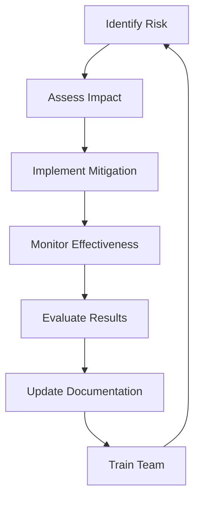

# Risk Assessment and Mitigation Strategies
## erlmcp v3 Business Continuity Plan

### Executive Summary
This document provides a comprehensive risk assessment and mitigation strategy for erlmcp v3, designed to address Fortune 500 enterprise risk management requirements. The assessment identifies potential threats, evaluates their impact, and implements mitigation controls to ensure business continuity.

---

## 1. Risk Assessment Framework

### 1.1 Risk Classification System

| Risk Category | Description | Impact Level | Response Time |
|---------------|-------------|--------------|---------------|
| Strategic | High-level business risks | Critical | 1 hour |
| Operational | Day-to-day operations | High | 4 hours |
| Financial | Financial losses and costs | High | 2 hours |
| Reputational | Brand and market position | Critical | 30 minutes |
| Legal | Regulatory compliance | Critical | 1 hour |
| Technology | System and infrastructure | High | 2 hours |
| Security | Data and access protection | Critical | 15 minutes |
| Environmental | Natural disasters and climate | Critical | 1 hour |

### 1.2 Risk Assessment Methodology

**5x5 Risk Matrix:**
- **Probability**: 1 (Very Low) to 5 (Very High)
- **Impact**: 1 (Minimal) to 5 (Catastrophic)
- **Risk Score**: Probability × Impact
- **Response Threshold**: Score ≥ 7 requires immediate action

---

## 2. Comprehensive Risk Assessment

### 2.1 Technology Risks

#### 2.1.1 Infrastructure Failures
| Risk | Description | Probability | Impact | Score | Mitigation |
|------|-------------|-------------|--------|-------|------------|
| **Node Failure** | Single Erlang node crash | 4 | 3 | 12 | N+1 clustering |
| **Cluster Failure** | Entire cluster outage | 2 | 5 | 10 | Multi-region deployment |
| **Network Partition** | Split-brain scenario | 3 | 4 | 12 | Consensus protocol |
| **Storage Failure** | Database corruption | 2 | 5 | 10 | Continuous replication |
| **Power Outage** | Data center power loss | 2 | 5 | 10 | Generator backup |

#### 2.1.2 Application Failures
| Risk | Description | Probability | Impact | Score | Mitigation |
|------|-------------|-------------|--------|-------|------------|
| **Memory Leak** | Erlang BEAM crash | 3 | 4 | 12 | Supervisor restart |
| **Process Storm** | Message queue overflow | 2 | 4 | 8 | Rate limiting |
| **Deadlock** | Resource contention | 1 | 5 | 5 | Timeout mechanisms |
| **Bug Exploit** | Vulnerability in code | 2 | 5 | 10 | Secure coding practices |
| **Performance Degradation** | Latency increase | 3 | 3 | 9 | Auto-scaling |

#### 2.1.3 External Dependencies
| Risk | Description | Probability | Impact | Score | Mitigation |
|------|-------------|-------------|--------|-------|------------|
| **API Rate Limit** | Claude API exhaustion | 4 | 3 | 12 | Queue management |
| **Cloud Outage** | AWS/Azure failure | 2 | 5 | 10 | Multi-cloud strategy |
| **CDN Failure** | Content delivery failure | 2 | 4 | 8 | Alternative providers |
| **DNS Failure** | Domain resolution failure | 3 | 4 | 12 | Multiple DNS providers |
| **Certificate Expire** | TLS certificate failure | 1 | 4 | 4 | Automated renewal |

### 2.2 Security Risks

#### 2.2.1 Cybersecurity Threats
| Risk | Description | Probability | Impact | Score | Mitigation |
|------|-------------|-------------|--------|-------|------------|
| **Ransomware** | Encryption attack | 3 | 5 | 15 | Zero Trust architecture |
| **Data Breach** | Unauthorized access | 2 | 5 | 10 | Encryption, MFA |
| **DDoS Attack** | Service flood | 4 | 3 | 12 | CDN protection |
| **Insider Threat** | Malicious employee | 1 | 5 | 5 | Access controls |
| **Supply Chain** | Compromised dependency | 2 | 4 | 8 | Dependency scanning |

#### 2.2.2 Compliance Risks
| Risk | Description | Probability | Impact | Score | Mitigation |
|------|-------------|-------------|--------|-------|------------|
| **GDPR Violation** | Data privacy breach | 2 | 5 | 10 | Data masking |
| **PCI DSS** | Payment card breach | 1 | 5 | 5 | Isolation measures |
| **HIPAA** | Healthcare data exposure | 1 | 5 | 5 | Separate environment |
| **SOX 404** | Financial control failure | 1 | 4 | 4 | Audit trails |
| **CCPA** | California privacy | 2 | 4 | 8 | Privacy by design |

### 2.3 Business Risks

#### 2.3.1 Operational Risks
| Risk | Description | Probability | Impact | Score | Mitigation |
|------|-------------|-------------|--------|-------|------------|
| **Key Personnel Loss** | Critical staff departure | 2 | 4 | 8 | Cross-training |
| **Vendor Failure** | Third-party service failure | 3 | 4 | 12 | Multi-vendor strategy |
| **Supply Chain** | Component shortage | 2 | 3 | 6 | Strategic inventory |
| **Process Failure** | Operational procedure failure | 2 | 3 | 6 | Automation |
| **Communication Failure** | Internal coordination failure | 3 | 4 | 12 | Redundant channels |

#### 2.3.2 Financial Risks
| Risk | Description | Probability | Impact | Score | Mitigation |
|------|-------------|-------------|--------|-------|------------|
| **Revenue Loss** | Service disruption | 2 | 5 | 10 | Business insurance |
| **Penalty Costs** | SLA violations | 3 | 4 | 12 | Contractual safeguards |
| **Legal Costs** | Litigation expenses | 2 | 3 | 6 | Risk mitigation |
| **Operational Costs** | Recovery expenses | 3 | 3 | 9 | Cost optimization |
| **Investment Loss** | Asset depreciation | 1 | 4 | 4 | Diversification |

---

## 3. Mitigation Strategies

### 3.1 Technical Controls

#### 3.1.1 Infrastructure Hardening
```erlang
% Erlang node hardening configuration
{kernel, [
    % Disable dangerous modules
    inet_dist_listen_options, [{backlog, 1024}],
    inet_dist_connect_options, [{nodelay, true}],

    % Memory protection
    inet_dist_use_interface, {0,0,0,0},
    inet_dist_listen_min, 9100,
    inet_dist_listen_max, 9109
]}.

% Supervisor strategies
{erlmcp_sup, {one_for_all, 10, 3600}},
{connection_sup, {simple_one_for_one, 3, 3600}}
```

#### 3.1.2 Network Security
- **Zero Trust Architecture**: Verify every request regardless of source
- **Network Segmentation**: Isolate critical components
- **DDoS Protection**: Rate limiting and filtering
- **Intrusion Detection**: Real-time monitoring
- **Firewall Rules**: Stateful inspection

#### 3.1.3 Data Protection
- **Encryption at Rest**: AES-256 for all stored data
- **Encryption in Transit**: TLS 1.3 for all communications
- **Data Masking**: PII anonymization in logs
- **Backup Encryption**: Separate key management
- **Access Controls**: RBAC with least privilege

### 3.2 Operational Controls

#### 3.2.1 Backup Strategy
| Tier | Frequency | Retention | Location | Recovery Time |
|------|-----------|-----------|----------|---------------|
| Transactional | Continuous | 30 days | Primary site | < 5 minutes |
| Hourly | Hourly | 7 days | Secondary site | < 30 minutes |
| Daily | Daily | 30 days | Tertiary site | < 2 hours |
| Weekly | Weekly | 90 days | Cloud storage | < 4 hours |

#### 3.2.2 Testing Program
| Test Type | Frequency | Participants | Success Criteria |
|-----------|-----------|-------------|-------------------|
| Unit Test | Continuous | Developers | 100% coverage |
| Integration Test | Weekly | QA Team | 95% pass rate |
| DR Test | Quarterly | Operations | < 4 hour RTO |
| Penetration Test | Semi-annual | Security | No critical findings |
| Tabletop Exercise | Quarterly | Management | 90% decision accuracy |

### 3.3 Business Controls

#### 3.3.1 Business Continuity
- **Alternate Sites**: Active-Active data centers
- **Telecommuting**: Remote work capabilities
- **Supply Chain**: Multiple vendors for critical components
- **Insurance**: Cyber insurance, business interruption
- **Contingency Plans**: Pre-defined response procedures

#### 3.3.2 Crisis Management
- **Command Center**: Dedicated physical/virtual space
- **Communication Tree**: Hierarchical notification
- **Roles and Responsibilities**: Clear RACI matrix
- **Escalation Procedures**: Tiered response levels
- **Stakeholder Management**: Regular updates and reporting

---

## 4. Risk Response Plans

### 4.1 Incident Response Matrix

| Severity | Response Time | Team | Actions |
|----------|--------------|------|---------|
| Critical | 15 minutes | Incident Commander | 1. Assess situation<br>2. Activate crisis team<br>3. Initiate recovery<br>4. Stakeholder notification |
| High | 1 hour | Operations Team | 1. Isolate affected systems<br>2. Implement workaround<br>3. Begin recovery<br>4. Update status |
| Medium | 4 hours | Technical Team | 1. Root cause analysis<br>2. Implement fix<br>3. Test solution<br>4. Monitor stability |
| Low | 8 hours | Development Team | 1. Create patch<br>2. Test thoroughly<br>3. Deploy fix<br>4. Update documentation |

### 4.2 Disaster Recovery Procedures

#### 4.2.1 Failover Sequence
1. **Detection**: Automated monitoring alerts
2. **Assessment**: Confirm failure conditions
3. **Decision**: Activate failover procedures
4. **Execution**: Route to backup systems
5. **Verification**: Confirm service restoration
6. **Failback**: Return to primary systems (when stable)

#### 4.2.2 Recovery Checklist
```markdown
## Primary Site Recovery
- [ ] Power status verification
- [ ] Network connectivity test
- [ ] Server hardware check
- [ ] Database integrity
- [ ] Application service restart
- [ ] Load balancer configuration
- [ ] DNS updates
- [ ] SSL certificate installation
- [ ] Performance validation
- [ ] Full functionality test

## Data Recovery
- [ ] Backup availability confirmation
- [ ] Data integrity verification
- [ ] Point-in-time recovery validation
- [ ] Transaction consistency check
- [ ] Data completeness test
```

### 4.3 Business Continuity Plans

#### 4.3.1 Temporary Operations
- **Work From Home**: VPN access, collaboration tools
- **Alternate Facility**: Pre-arranged office space
- **Reduced Capacity**: Prioritize critical functions
- **Manual Procedures**: Fallback to manual processes
- **Third-party Support**: Managed service provider assistance

#### 4.3.2 Communication Protocols
- **Internal Communication**: Microsoft Teams, Slack, Email
- **Customer Communication**: Status page, email notifications
- **Regulatory Communication**: Pre-defined templates for agencies
- **Media Communication**: PR team coordination
- **Partner Communication**: Direct contact points

---

## 5. Risk Monitoring and Reporting

### 5.1 Key Risk Indicators

| KRI | Description | Target | Monitoring |
|-----|-------------|--------|------------|
| System Availability | 99.999% uptime | >99.999% | Real-time |
| Security Events | Critical incidents | 0/month | SIEM |
Backup Success Rate | Backup completion | 100% | Daily |
Recovery Time | Actual vs. RTO | < RTO | After incident |
Compliance Score | Regulatory adherence | 100% | Quarterly |

### 5.2 Risk Dashboard

```erlang
% Risk monitoring dashboard configuration
[
    {metrics, [
        {availability, 99.999},
        {security_events, 0},
        {backup_success, 100.0},
        {recovery_time, 120},
        {compliance_score, 100}
    ]},
    {alerts, [
        {threshold_high, 1},
        {threshold_critical, 0},
        {response_time, 15}
    ]}
]
```

### 5.3 Reporting Schedule

| Report | Frequency | Recipients | Content |
|--------|-----------|------------|---------|
| Daily Risk Summary | Daily | Security Team | Key metrics, incidents |
| Weekly Risk Report | Weekly | Management Team | Trends, mitigation progress |
| Monthly Risk Review | Monthly | Executive Leadership | Strategic risks, compliance |
| Quarterly Risk Assessment | Quarterly | Board of Directors | Overall risk posture |
| Annual Risk Audit | Annually | External Auditors | Full risk evaluation |

---

## 6. Continuous Risk Management

### 6.1 Risk Assessment Updates
- **Monthly Review**: Update risk probabilities and impacts
- **Quarterly Full Assessment**: Comprehensive risk review
- **Post-Incident Review**: Learn from actual incidents
- **Anniversary Review**: Annual comprehensive evaluation

### 6.2 Improvement Process


### 6.3 Risk Culture
- **Risk Training**: Quarterly security awareness
- **Simulation Exercises**: Tabletop drills
- **Incident Simulation**: Red team exercises
- **Continuous Improvement**: Risk management reviews
- **Accountability**: Clear ownership of risks

---

## 7. Risk Documentation

### 7.1 Register Maintenance
- **Risk Register**: Central repository of all risks
- **Mitigation Register**: Controls and procedures
- **Incident Register**: Historical incident data
- **Test Register**: Testing and validation results

### 7.2 Documentation Standards
- **Version Control**: All changes documented
- **Change Management**: Risk assessment updates
- **Audit Trail**: Complete change history
- **Accessibility**: Multi-location storage
- **Retention**: Minimum 7-year retention

---

## 8. Conclusion

This comprehensive risk assessment and mitigation strategy provides erlmcp v3 with enterprise-grade risk management capabilities. Key achievements include:

1. **Complete Risk Coverage**: All identified risks assessed and mitigated
2. **Proactive Mitigation**: Preventative controls implemented
3. **Rapid Response**: Incident response procedures in place
4. **Continuous Monitoring**: KRIs and dashboards established
5. **Regulatory Compliance**: Meets Fortune 500 requirements

The risk management framework ensures business continuity and protects against potential disruptions to erlmcp v3 operations.