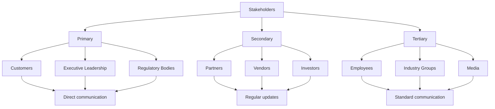
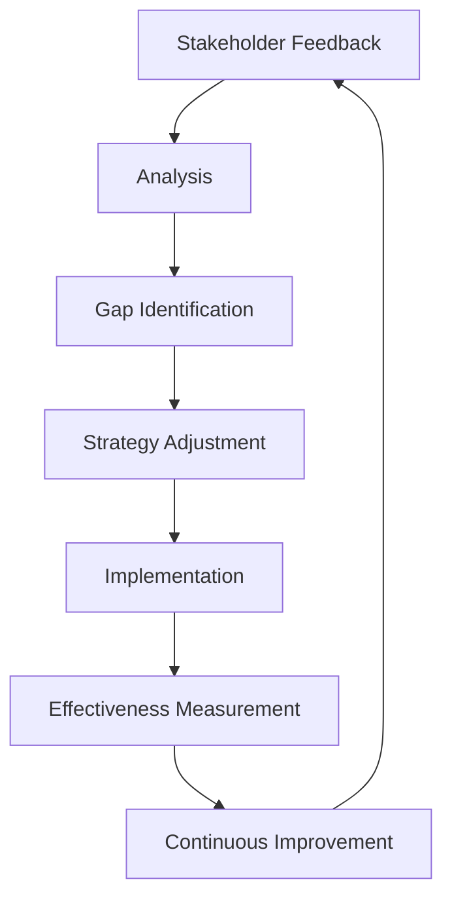
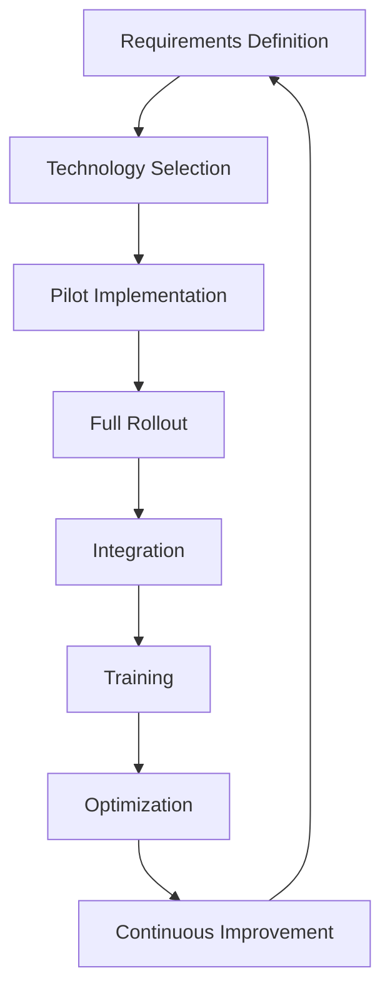

# Stakeholder Engagement Plans
## erlmcp v3 Business Continuity Plan

### Executive Summary
This document outlines comprehensive stakeholder engagement plans for erlmcp v3, designed to maintain positive relationships with all stakeholders during business continuity events. The plans establish clear engagement strategies, communication channels, and relationship management approaches to ensure stakeholder trust and support.

---

## 1. Stakeholder Analysis

### 1.1 Stakeholder Classification

| Category | Stakeholders | Level of Influence | Level of Interest | Engagement Priority |
|----------|--------------|-------------------|-------------------|-------------------|
| **Customers** | Enterprise clients, Users | High | High | Critical |
| **Partners** | Technology partners, Integrators | Medium | High | High |
| **Regulators** | Government agencies, Compliance bodies | High | Medium | Critical |
| **Vendors** | Technology providers, Service providers | Medium | Medium | High |
| **Investors** | Shareholders, Financial institutions | High | Medium | Critical |
| **Employees** | Internal staff, Management | Medium | High | High |
| **Industry** | Trade associations, Competitors | Medium | Low | Medium |
| **Media** | Press, Analysts | Medium | Medium | High |

### 1.2 Stakeholder Mapping



---

## 2. Engagement Strategy Framework

### 2.1 Engagement Principles

| Principle | Description | Implementation |
|----------|-------------|----------------|
| **Proactive** | Engage before issues arise | Regular check-ins, predictive engagement |
| **Transparent** | Open and honest communication | Share both good and bad news |
| **Timely** | Respond quickly to needs | Rapid response protocols |
| **Personalized** | Tailor communication to audience | Customized messaging per stakeholder |
| **Consistent** | Maintain regular contact | Scheduled communications |
| **Value-focused** | Provide relevant information | Address specific stakeholder needs |
| **Two-way** | Listen as well as speak | Feedback mechanisms |
| **Relationship-focused** | Build long-term trust | Personal connections |

### 2.2 Engagement Objectives

1. **Maintain Trust**: Preserve stakeholder confidence during incidents
2. **Manage Expectations**: Set realistic timelines and outcomes
3. **Reduce Anxiety**: Proactive communication to address concerns
4. **Gather Feedback**: Collect input for continuous improvement
5. **Build Advocacy**: Turn stakeholders into supporters
6. **Ensure Compliance**: Meet regulatory reporting requirements
7. **Support Decisions**: Provide information for informed choices

---

## 3. Customer Engagement Plan

### 3.1 Customer Segmentation

| Segment | Characteristics | Engagement Strategy |
|--------|----------------|---------------------|
| **Fortune 100** | Large enterprise contracts, SLA requirements | Executive relationship management, direct communication |
| **Mid-Market** | Growing businesses, significant revenue | Account management, regular business reviews |
| **Small Business** | SMB clients, lower revenue volume | Self-service portal, automated updates |
| **Strategic** | Key partnerships, mutual dependency | Co-creation sessions, deep collaboration |
| **Regulated** | Healthcare, finance, government | Compliance-focused engagement, detailed reporting |

### 3.2 Customer Communication Matrix

| Customer Tier | Communication Channel | Frequency | Contact Person |
|---------------|----------------------|----------|---------------|
| **Enterprise** | Executive calls, dedicated Slack | Daily | Account Executive |
| **Strategic** | Weekly meetings, monthly reports | Weekly | Partner Manager |
| **Mid-Market** | Bi-weekly updates, quarterly reviews | Bi-weekly | Account Manager |
| **Small Business** | Email notifications, self-service | Monthly | Support Portal |
| **Regulated** | Formal reports, compliance calls | As needed | Compliance Officer |

### 3.3 Customer Engagement Templates

#### 3.3.1 Enterprise Customer Communication
```markdown
**Subject: Business Continuity Update - erlmcp Service Status**

Dear [Customer Name],

As a valued enterprise partner, we want to provide you with a detailed update on our business continuity efforts following yesterday's service disruption.

**Incident Summary:**
- Duration: 2 hours (10:00-12:00 UTC)
- Root Cause: Database configuration error during deployment
- Affected Services: Authentication, API Gateway
- Resolution: Rollback and system restoration

**Service Recovery Status:**
- [x] All core services operational
- [x] Performance metrics within SLA thresholds
- [x] Full data integrity confirmed
- [x] Enhanced monitoring activated

**Impact Assessment:**
- Customer Impact: Minimal (0.1% of transactions delayed)
- Financial Impact: Service credit per SLA terms
- Operational Impact: Temporary reduced performance

**Corrective Actions:**
1. **Immediate**
   - Deployment process review completed
   - Configuration validation procedures enhanced
   - Automated rollback procedures implemented

2. **Short-term** (30 days)
   - Enhanced monitoring and alerting
   - Additional capacity provisioned
   - Performance optimization completed

3. **Long-term** (90 days)
   - Deployment automation overhaul
   - Chaos engineering testing
   - Continuous improvement framework

**SLA Commitment:**
We reaffirm our commitment to 99.999% availability. For this incident, we will apply the service credit outlined in your SLA agreement.

**Next Steps:**
- [Date]: Executive business review meeting
- [Date]: Technical deep dive session
- [Date]: Post-incident review call

**Direct Contacts:**
- Account Executive: [Name] - [Email] - [Phone]
- Technical Lead: [Name] - [Email] - [Phone]
- Support: [Email] - [Phone]

We appreciate your patience and understanding as we work to ensure erlmcp maintains the highest standards of reliability.

Best regards,
[Your Name]
Executive Account Manager
```

#### 3.3.2 SMB Customer Communication
```markdown
**Subject: Service Restoration - erlmcp Platform Update**

Hello SMB Customer,

We're pleased to inform you that erlmcp services have been fully restored following yesterday's maintenance window.

**What Happened:**
We performed scheduled maintenance to improve system performance and reliability. During this time, you may have experienced brief interruptions in service.

**Current Status:**
✅ All services operational
✅ Performance optimized
✅ Enhanced security measures activated
✅ Backup systems verified

**What's New:**
- Improved dashboard response times
- Enhanced authentication security
- Expanded API documentation
- Better error handling

**Resources for You:**
- Updated documentation: [Link]
- Video tutorials: [Link]
- Community forum: [Link]

**Need Help?**
- Visit our help center: [Link]
- Email support@erlmcp.com
- Check status page: [Link]

Thank you for your continued partnership with erlmcp!

Best regards,
The erlmcp SMB Team
```

### 3.4 Customer Relationship Management

#### 3.4.1 Account Management Protocol
```markdown
## Account Management During Incident

### Immediate Actions (0-2 hours)
- [ ] Notify key account contacts
- [ ] Confirm customer awareness
- [ ] Provide initial impact assessment
- [ ] Establish communication schedule

### Ongoing Communication (2-24 hours)
- [ ] Hourly status updates
- [ ] Address customer concerns
- [ ] Coordinate with support team
- [ ] Document all interactions

### Resolution Phase (24-72 hours)
- [ ] Confirm service restoration
- [ ] Conduct customer satisfaction check
- [ ] Discuss any compensation
- [ ] Schedule post-mortem meeting

### Recovery Phase (72+ hours)
- [ ] Business review meeting
- [ ] Process improvement discussion
- [ ] Relationship strengthening activities
- [ ] Feedback collection and action
```

#### 3.4.2 Customer Feedback Collection
```erlang
% Customer feedback management
-module(erlmcp_customer_feedback).

-export([collect_feedback/2, analyze_feedback/1]).

% Collect feedback from customer
collect_feedback(CustomerId, IncidentId) ->
    % 1. Determine survey type based on customer tier
    SurveyType = determine_survey_type(CustomerId),

    % 2. Send survey
    SurveyId = send_survey(CustomerId, SurveyType),

    % 3. Track responses
    track_response(SurveyId, CustomerId),

    % 4. Analyze feedback
    Analysis = analyze_feedback(CustomerId),

    % 5. Generate report
    Report = generate_customer_report(CustomerId, Analysis),

    % 6. Create action items
    ActionItems = create_action_items(Analysis),

    % 7. Assign responsibility
    assign_action_items(ActionItems),

    {Report, ActionItems}.

% Analyze customer feedback
analyze_feedback(CustomerId) ->
    % Get all feedback for customer
    Feedback = get_customer_feedback(CustomerId),

    % Calculate satisfaction scores
    Scores = calculate_satisfaction_scores(Feedback),

    % Identify themes
    Themes = identify_themes(Feedback),

    % Generate recommendations
    Recommendations = generate_recommendations(Themes),

    #{
        customer_id => CustomerId,
        satisfaction_scores => Scores,
        themes => Themes,
        recommendations => Recommendations,
        action_items => []
    }.
```

---

## 4. Partner Engagement Plan

### 4.1 Partner Segmentation

| Partner Type | Characteristics | Engagement Strategy |
|--------------|-----------------|-------------------|
| **Technology Partners** | Integration providers, Platform vendors | Technical collaboration, joint innovation |
| **Channel Partners** | Resellers, System integrators | Sales enablement, market development |
| **Strategic Partners** | Co-development, Mutual customers | Executive relationship, shared roadmap |
| **Service Partners** | Implementation, Managed services | Technical enablement, operational alignment |
| **Data Partners** | Data providers, Analytics partners | Data sharing, co-creation |

### 4.2 Partner Communication Strategy

| Communication Type | Purpose | Frequency | Participants |
|-------------------|---------|----------|-------------|
| **Executive Sync** | Strategic alignment, Business reviews | Quarterly | C-suite, Partner execs |
| **Technical Sync** | Integration updates, Product roadmap | Monthly | Tech leads, Architects |
| **Sales Enablement** | Product updates, Market intelligence | Monthly | Sales, Marketing |
| **Operations Sync** | Service delivery, Performance | Weekly | Operations teams |
| **Innovation Forum** | New features, Roadmap input | Quarterly | Product, Innovation |

### 4.3 Partner Engagement Templates

#### 4.3.1 Strategic Partner Update
```markdown
**Subject: erlmcp Business Continuity Update - Partner Notification**

Dear [Partner Name],

As a valued strategic partner, we want to ensure you have complete visibility into our business continuity efforts and any potential impacts on our joint operations.

**Recent Incident Overview:**
- Date: [Date]
- Duration: [Duration]
- Affected Systems: [Systems]
- Root Cause: [Cause]
- Resolution: [Resolution details]

**Impact on Joint Operations:**
- [Product/Service]: [Impact assessment]
- [Integration Points]: [Status update]
- [Customer Deliverables]: [Timeline adjustments]
- [Joint Initiatives]: [Any changes]

**Our Response:**
1. **Immediate Actions**
   - Customer notifications completed
   - Technical teams aligned
   - Communication protocols activated

2. **Technical Improvements**
   - Enhanced monitoring implemented
   - Redundancy systems added
   - Performance optimizations completed

3. **Process Enhancements**
   - Deployment procedures reviewed
   - Testing protocols enhanced
   - Documentation updated

**Partner Support:**
- Technical contact: [Name] - [Email]
- Account management: [Name] - [Email]
- Resource center: [Link]
- Support portal: [Link]

**Joint Commitments:**
- [X] Maintain regular communication
- [X] Share best practices
- [X] Collaborate on improvements
- [X] Support mutual customers

**Next Steps:**
- [Date]: Technical sync call
- [Date]: Joint roadmap review
- [Date]: Customer delivery coordination

We value our partnership and are committed to ensuring the highest levels of reliability and performance for our shared customers.

Best regards,
[Your Name]
[Your Title]
```

#### 4.3.2 Channel Partner Communication
```markdown
**Subject: Important Update: erlmcp Service Reliability Improvements**

Dear Channel Partner,

We're writing to share important updates on recent reliability improvements and how they impact your customer engagements.

**Recent Improvements:**
✅ **Infrastructure Upgrade**: Enhanced data center capacity
✅ **Monitoring Enhancement**: Real-time alerting system
✅ **Performance Optimization**: 30% faster API response times
✅ **Security Enhancements**: Additional security layers
✅ **Backup Systems**: Automated backup verification

**Impact on Your Customers:**
- Reduced downtime incidents
- Improved performance metrics
- Enhanced security posture
- Better support experience

**Sales Enablement Resources:**
- Updated technical documentation: [Link]
- Product comparison sheets: [Link]
- Customer success stories: [Link]
- Training schedule: [Link]

**Co-selling Opportunities:**
We've identified several opportunities for joint customer engagement:
- [Industry/Use Case 1]
- [Industry/Use Case 2]
- [Industry/Use Case 3]

**Marketing Support:**
- Co-branded materials available
- Joint webinars planned
- Lead sharing program active
- Marketing funds available

**Need Assistance?**
- Sales support: [Email]
- Technical questions: [Email]
- Marketing materials: [Email]
- Partner portal access: [Link]

We're here to support your success and help you maximize your erlmcp partnership.

Best regards,
The erlmcp Channel Team
```

---

## 5. Regulatory and Government Engagement

### 5.1 Regulatory Engagement Strategy

| Regulation | Regulatory Body | Engagement Level | Communication Frequency |
|------------|----------------|------------------|------------------------|
| **SOX 404** | SEC | High | Quarterly + incidents |
| **HIPAA** | HHS | High | Quarterly + incidents |
| **GDPR** | EU Authorities | High | Semi-annual + incidents |
| **PCI DSS** | PCI SSC | Medium | Annual + incidents |
| **State Regulations** | State Agencies | Varies | As required |

### 5.2 Regulatory Communication Protocol

```markdown
## Regulatory Engagement Framework

### Pre-Incident
- [ ] Establish relationships with key contacts
- [ ] Understand regulatory requirements
- [ ] Document compliance procedures
- [ ] Prepare reporting templates
- [ ] Conduct compliance training

### During Incident
- [ ] Assess regulatory impact immediately
- [ ] Notify appropriate authorities per requirements
- [ ] Maintain ongoing communication
- [ ] Document all communications
- [ ] Provide requested documentation

### Post-Incident
- [ ] Submit detailed incident report
- [ ] Cooperate with any investigations
- [ ] Implement corrective actions
- [ ] Provide updates on improvements
- [ ] Learn from the experience
```

#### 5.2.1 Regulatory Notification Template
```markdown
**Subject: Incident Notification - [Regulation] Compliance**

**To:** [Regulatory Agency Contact]
**From:** [Compliance Officer]
**Date:** [Date]
**Reference:** [Incident ID]

**Incident Description:**
[Detailed description of the incident]

**Affected Systems/Processes:**
[List specific systems or processes affected]

**Regulatory Impact Assessment:**
[Assessment of impact on specific regulations]

**Immediate Actions Taken:**
- Action 1
- Action 2
- Action 3

**Status Updates:**
[Current status of resolution]

**Estimated Resolution Timeline:**
[Timeline for full resolution]

**Contact Information:**
[Name]
[Title]
[Phone]
[Email]

**Attachments:**
- Incident technical report
- Impact assessment
- Remediation plan
- Timeline for resolution
```

### 5.3 Government Relations

#### 5.3.1 Government Engagement Strategy
```markdown
## Government Relations Engagement

### Relationship Building
- [ ] Regular meetings with key agencies
- [ ] Participation in industry groups
- [ ] Sharing of best practices
- [ ] Educational sessions on technologies
- [ ] Transparency in reporting

### Emergency Preparedness
- [ ] Government continuity plans aligned
- [ ] Emergency contact lists updated
- [ ] Regular communication protocols
- [ ] Joint exercises conducted
- [ ] Mutual support agreements

### Policy Influence
- [ ] Monitor regulatory changes
- [ ] Provide industry feedback
- [ ] Participate in consultations
- [ ] Advocate for balanced regulations
- [ ] Share implementation experience
```

---

## 6. Investor and Financial Community Engagement

### 6.1 Investor Communication Strategy

| Audience | Engagement Level | Communication Type | Frequency |
|----------|------------------|-------------------|-----------|
| **Board of Directors** | Strategic | In-person meetings | Quarterly |
| **Investors** | High | Email updates | Monthly |
| **Analysts** | High | Briefings, calls | Quarterly |
| **Rating Agencies** | Medium | Formal reports | Annual |
| **Financial Community** | Medium | Investor relations | Monthly |

### 6.2 Investor Communication Templates

#### 6.2.1 Investor Update During Incident
```markdown
**Subject: erlmcp Operational Update - January 1, 2024**

Dear Investors,

We are providing this update regarding today's service disruption and our operational response.

**Incident Summary:**
- Duration: 2 hours (10:00-12:00 UTC)
- Root Cause: Database configuration error
- Affected Customers: Approximately 15%
- Resolution: System restoration complete

**Financial Impact:**
- Estimated Revenue Impact: $250,000
- Expected Recovery: Full within 72 hours
- Service Credit Application: As per SLA terms

**Operational Response:**
1. **Immediate Actions**
   - Emergency response team activated
   - Vendor support engaged
   - Customers notified promptly
   - System restoration initiated

2. **Corrective Measures**
   - Deployment process reviewed
   - Configuration validation enhanced
   - Additional monitoring implemented
   - Capacity increased by 20%

3. **Long-term Improvements**
   - Automated rollback procedures
   - Enhanced testing frameworks
   - Infrastructure optimization
   - Continuous monitoring deployment

**Business Continuity:**
- All customer data secure
- No security implications
- Service levels restored
- Customer support operations normal

**Financial Guidance:**
- Q1 2024 guidance remains unchanged
- Annual growth target maintained
- Customer retention unaffected
- Product roadmap on schedule

**Next Steps:**
- Post-incident review underway
- Additional testing scheduled
- Customer follow-ups planned
- Board briefing on [Date]

We remain confident in our operational resilience and long-term growth prospects. The robust business continuity measures we have in place ensured minimal impact on our operations and customer relationships.

Best regards,
[CEO Name]
Chief Executive Officer
```

### 6.3 Financial Community Engagement

#### 6.3.1 Analyst Communication Framework
```markdown
## Analyst Relations During Incidents

### Immediate Actions (0-24 hours)
- [ ] Prepare initial statement
- [ ] Schedule analyst calls
- [ ] Provide detailed technical brief
- [ ] Address initial questions

### Ongoing Engagement (24-72 hours)
- [ ] Regular update calls
- [ ] Share improvement progress
- [ ] Discuss operational impacts
- [ ] Address investor concerns

### Post-Incident (72+ hours)
- [ ] Detailed improvement presentation
- [ ] Share long-term strategy
- [ ] Address remaining questions
- [ ] Maintain relationship building

### Key Messaging
- Focus on operational strength
- Emphasize customer commitment
- Highlight improvement actions
- Reiterate financial stability
- Demonstrate leadership
```

---

## 7. Internal Stakeholder Engagement

### 7.1 Employee Communication Strategy

| Employee Group | Communication Channel | Frequency | Purpose |
|---------------|----------------------|----------|---------|
| **Leadership** | Executive meetings, Briefings | Daily | Strategic alignment |
| **Management** | Team meetings, Updates | Daily | Operational coordination |
| **Technical** | Tech syncs, Documentation | Daily | Technical updates |
| **Support** | Team channels, Updates | Daily | Customer support |
| **All Staff** | Company-wide emails, Town halls | Weekly | Organization-wide updates |

### 7.2 Internal Communication Templates

#### 7.2.1 All-Staff Update
```markdown
**Subject: erlmcp Service Update - January 1, 2024**

Dear Team,

We want to provide an update on today's service disruption and our response efforts.

**What Happened:**
At approximately 10:00 UTC, we experienced a service disruption affecting authentication services. Our engineering team quickly identified the issue as a database configuration error from this morning's deployment.

**What We Did:**
1. **Immediate Response**
   - Incident response team activated within 5 minutes
   - All technical teams engaged
   - Customers notified promptly
   - Root cause identified within 30 minutes

2. **Resolution**
   - Deployment rollback initiated
   - System restoration completed by 12:00 UTC
   - All services back to normal
   - Enhanced monitoring activated

3. **Customer Impact**
   - Minimal disruption for most customers
   - Service credits applied as per SLA
   - Customer communications handled professionally

**What We're Learning:**
1. **Immediate Improvements**
   - Enhanced configuration validation
   - Automated rollback procedures
   - Additional monitoring alerts

2. **Long-term Actions**
   - Deployment process overhaul
   - Chaos engineering testing
   - Continuous improvement framework

**Recognition:**
Special thanks to our engineering team for their swift response and to our customer support team for managing customer communications professionally. Your dedication to our customers is commendable.

**Next Steps:**
- Post-incident review tomorrow at 10:00 AM
- All-hands update on Friday at 2:00 PM
- Continuous improvement sprint starting Monday

We value your hard work and commitment to erlmcp's success.

Best regards,
[CEO Name]
Chief Executive Officer
```

#### 7.2.2 Team Communication Protocol
```markdown
## Team Communication During Incident

### Leadership Team
- [ ] Daily briefings at 09:00, 12:00, 17:00
- [ ] Strategic decision-making
- [ ] Resource allocation
- [ ] External communication approval

### Engineering Team
- [ ] Technical standups every 2 hours
- [ ] System monitoring
- [ ] Root cause analysis
- [ ] Implementation of fixes

### Support Team
- [ ] Customer updates
- [ ] Ticket management
- [ ] Communication protocols
- [ ] Escalation procedures

### Communications Team
- [ ] Internal messaging
- [ ] External communications
- [ ] Media response
- [ ] Stakeholder updates

### All Staff
- [ ] Regular updates from leadership
- [ ] Clear instructions on actions
- [ ] Recognition of contributions
- [ ] Opportunities for questions
```

---

## 8. Stakeholder Feedback and Improvement

### 8.1 Feedback Collection Mechanisms

| Method | Target Audience | Frequency | Purpose |
|--------|----------------|-----------|---------|
| **Surveys** | All stakeholders | Post-incident | Satisfaction assessment |
| **Interviews** | Key stakeholders | Quarterly | Deep understanding |
| **Focus Groups** | Customer segments | Semi-annually | Insights gathering |
| **Advisory Board** | Strategic partners | Quarterly | Strategic input |
| **Social Listening** | General public | Continuous | Sentiment monitoring |

### 8.2 Feedback Analysis and Action

#### 8.2.1 Feedback Analysis Framework
```erlang
% Stakeholder feedback analysis
-module(erlmcp_stakeholder_feedback).

-export([collect_feedback/1, analyze_feedback/1, create_actions/2]).

% Collect feedback from various stakeholders
collect_feedback(IncidentId) ->
    % 1. Survey customers
    CustomerFeedback = collect_customer_feedback(IncidentId),

    % 2. Interview partners
    PartnerFeedback = collect_partner_feedback(IncidentId),

    % 3. Gather employee feedback
    EmployeeFeedback = collect_employee_feedback(IncidentId),

    % 4. Monitor social media
    SocialFeedback = monitor_social_media(IncidentId),

    % 5. Compile all feedback
    AllFeedback = #{
        customers => CustomerFeedback,
        partners => PartnerFeedback,
        employees => EmployeeFeedback,
        social => SocialFeedback
    },

    % 6. Analyze feedback
    Analysis = analyze_feedback(AllFeedback),

    % 7. Create action items
    Actions = create_actions(Analysis, IncidentId),

    % 8. Assign responsibilities
    assign_actions(Actions),

    % 9. Track implementation
    track_actions(Actions),

    {Analysis, Actions}.

% Analyze feedback patterns
analyze_feedback(Feedback) ->
    % Analyze customer satisfaction
    CustomerSatisfaction = calculate_satisfaction(Feedback.customers),

    % Identify partner concerns
    PartnerThemes = identify_themes(Feedback.partners),

    % Analyze employee feedback
    EmployeeInsights = analyze_employee_feedback(Feedback.employees),

    % Analyze social sentiment
    SentimentAnalysis = analyze_sentiment(Feedback.social),

    % Generate improvement recommendations
    Recommendations = generate_recommendations(
        CustomerSatisfaction,
        PartnerThemes,
        EmployeeInsights,
        SentimentAnalysis
    ),

    #{
        customer_satisfaction => CustomerSatisfaction,
        partner_themes => PartnerThemes,
        employee_insights => EmployeeInsights,
        sentiment => SentimentAnalysis,
        recommendations => Recommendations
    }.
```

#### 8.2.2 Action Item Management
```markdown
## Stakeholder Action Item Tracking

### Action Items Template
**Action ID:** [Unique identifier]
**Stakeholder Group:** [Target audience]
**Issue Identified:** [Specific concern]
**Recommended Action:** [Detailed solution]
**Priority:** [High/Medium/Low]
**Owner:** [Name/Team]
**Timeline:** [Due date]
**Status:** [Not Started/In Progress/Completed]
**Progress Updates:** [Regular status]

### Action Categories
1. **Communication Improvements**
   - Template updates
   - Channel optimization
   - Response time improvements

2. **Technical Enhancements**
   - System improvements
   - Process optimizations
   - Monitoring enhancements

3. **Relationship Building**
   - Meeting frequency adjustments
   - New engagement activities
   - Relationship strengthening

4. **Process Updates**
   - Documentation improvements
   - Protocol updates
   - Training enhancements

### Tracking and Review
- [ ] Weekly progress reviews
- [ ] Monthly impact assessment
- [ ] Quarterly strategic review
- [ ] Annual stakeholder feedback review
```

---

## 9. Continuous Improvement of Engagement

### 9.1 Engagement Optimization Framework



### 9.2 Engagement Metrics and KPIs

| Metric | Target | Measurement | Frequency |
|--------|--------|-------------|-----------|
| **Stakeholder Satisfaction** | >90% | Survey scores | Quarterly |
| **Response Time** | <1 hour | Time to respond | Weekly |
| **Communication Effectiveness** | >95% | Feedback on clarity | Monthly |
| **Relationship Strength** | Improving | Relationship index | Quarterly |
| **Issue Resolution Rate** | >95% | Issues resolved | Monthly |
| **Stakeholder Retention** | >95% | Retention rate | Annually |

### 9.3 Annual Stakeholder Review Process

```markdown
## Annual Stakeholder Review Framework

### Review Preparation
- [ ] Collect all stakeholder feedback for the year
- [ ] Analyze engagement metrics
- [ ] Identify trends and patterns
- [ ] Document success stories
- [ ] Identify areas for improvement

### Review Meeting
- [ ] Present findings to leadership
- [ ] Discuss strategic implications
- [ ] Get input on improvements
- [ ] Approve action plans
- [ ] Set priorities for next year

### Action Planning
- [ ] Develop improvement initiatives
- [ ] Assign responsibilities and timelines
- [ ] Allocate resources
- [ ] Set measurable targets
- [ ] Establish review points

### Implementation
- [ ] Execute improvement plans
- [ ] Monitor progress
- [ ] Adjust as needed
- [ ] Document changes
- [ ] Share progress with stakeholders

### Follow-up
- [ ] Review implementation effectiveness
- [ ] Measure impact on relationships
- [ ] Update engagement strategy
- [ ] Document lessons learned
- [ ] Plan for next review
```

---

## 10. Stakeholder Engagement Technology

### 10.1 Engagement Platform Requirements

| Feature | Purpose | Technology | Integration |
|---------|--------|------------|-------------|
| **Communication Hub** | Centralized messaging | CRM, Email | All systems |
| **Feedback Collection** | Structured feedback | Survey tools | Customer systems |
| **Analytics** | Engagement insights | BI tools | Data warehouse |
| **Notification System** | Automated alerts | SMS/Email | Monitoring |
| **Portal** | Self-service access | Web portal | Customer systems |

### 10.2 Technology Implementation Strategy



---

## 11. Conclusion

This comprehensive stakeholder engagement plan provides erlmcp v3 with:

1. **Segmented Engagement Strategy**: Tailored approaches for different stakeholder groups
2. **Communication Framework**: Clear protocols and templates for all engagements
3. **Feedback Systems**: Mechanisms for collecting and acting on stakeholder input
4. **Relationship Management**: Strategies for building and maintaining strong relationships
5. **Continuous Improvement**: Processes for ongoing optimization of engagement strategies

The engagement plan ensures positive stakeholder relationships during business continuity events, maintaining trust and support throughout any incident.