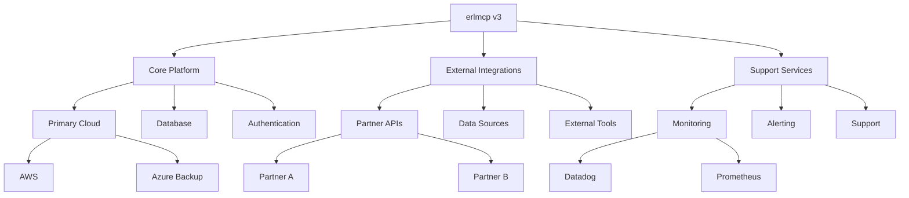
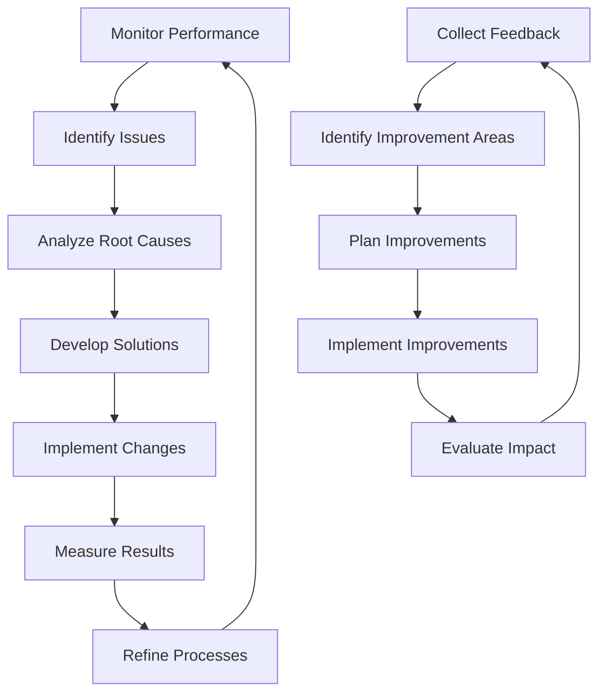

# Supply Chain Continuity Plan
## erlmcp v3 Business Continuity Plan

### Executive Summary
This document outlines comprehensive supply chain continuity strategies for erlmcp v3, designed to ensure operational resilience and business continuity. The plan addresses dependency management, risk mitigation, and recovery procedures to maintain service delivery during supply chain disruptions.

---

## 1. Supply Chain Architecture Overview

### 1.1 Supply Chain Components

| Component | Description | Criticality | Redundancy Strategy |
|-----------|-------------|-------------|---------------------|
| **Hardware Infrastructure** | Servers, networking equipment | Critical | Multi-vendor sourcing |
| **Cloud Services** | IaaS, PaaS, SaaS providers | Critical | Multi-cloud strategy |
| **Software Dependencies** | Open source, Commercial software | High | Version pinning, Alternatives |
| **Data Sources** | APIs, Feeds, Databases | High | Multiple sources |
| **Talent Resources** | Development, Operations, Support | Critical | Cross-training, Contractors |
| **Physical Facilities** | Data centers, Offices | High | Geographic dispersion |
| **Logistics** | Shipping, Transportation | Medium | Multiple carriers |

### 1.2 Supply Chain Mapping

```mermaid
graph TD
    A[erlmcp v3] --> B[Cloud Providers]
    A --> C[Hardware Vendors]
    A --> D[Software Vendors]
    A --> E[Service Providers]
    A --> F[Data Sources]
    A --> G[Partners]

    B --> B1[Primary Cloud]
    B --> B2[Secondary Cloud]
    B --> B3[Tertiary Cloud]

    C --> C1[Server Vendor 1]
    C --> C2[Server Vendor 2]
    C --> C3[Networking Vendor]

    D --> D1[Database Vendor]
    D --> D2[Security Vendor]
    D --> D3[Monitoring Vendor]

    E --> E1[CDN Provider]
    E --> E2[Payment Processor]
    E --> E3[Email Service]

    F --> F1[Data Provider 1]
    F --> F2[Data Provider 2]
    F --> F3[Internal Data]

    G --> G1[Integration Partners]
    G --> G2[Channel Partners]
    G --> G3[Technology Partners]
```



---

## 2. Risk Assessment for Supply Chain

### 2.1 Supply Chain Risk Categories

| Risk Category | Description | Probability | Impact | Mitigation Strategy |
|---------------|-------------|------------|--------|-------------------|
| **Single Point of Failure** | Dependency on single vendor | Medium | Critical | Vendor diversification |
| **Geographic Concentration** | Suppliers in one region | Low | High | Geographic dispersion |
| **Financial Instability** | Vendor financial issues | Medium | High | Regular financial reviews |
| **Cybersecurity** | Vendor security breach | Medium | Critical | Security assessments |
| **Regulatory Changes** | New regulations impact | Low | High | Regulatory monitoring |
| **Natural Disasters** | Regional disruptions | Low | High | Geographic diversity |
| **Political Instability** | Trade restrictions | Low | Medium | Alternative suppliers |
| **Quality Issues** | Product/service failures | Medium | Medium | Quality audits |
| **Capacity Constraints** | Supply shortage | Medium | High | Multiple suppliers |
| **Technology Changes** | Technology obsolescence | Medium | Medium | Future-proofing |

### 2.2 Critical Supply Chain Analysis

#### 2.2.1 Hardware Supply Chain
```erlang
% Hardware supply chain risk assessment
-module(erlmcp_hardware_supply).

-export([assess_risk/1, get_alternatives/1]).

% Assess hardware supply risk
assess_risk(Component) ->
    % 1. Get current suppliers
    Suppliers = get_current_suppliers(Component),

    % 2. Assess supplier risk
    RiskAssessment = lists:map(fun(Supplier) ->
        assess_supplier_risk(Supplier, Component)
    end, Suppliers),

    % 3. Calculate overall risk
    OverallRisk = calculate_overall_risk(RiskAssessment),

    % 4. Identify mitigation opportunities
    Mitigations = identify_mitigations(Component, RiskAssessment),

    #{
        component => Component,
        suppliers => Suppliers,
        risk_assessment => RiskAssessment,
        overall_risk => OverallRisk,
        mitigations => Mitigations
    }.

% Get alternative suppliers
get_alternatives(Component) ->
    % Primary alternatives
    Primary = get_primary_alternatives(Component),

    % Secondary alternatives
    Secondary = get_secondary_alternatives(Component),

    % Emergency suppliers
    Emergency = get_emergency_suppliers(Component),

    #{
        primary => Primary,
        secondary => Secondary,
        emergency => Emergency,
        lead_times => calculate_lead_times(Primary ++ Secondary ++ Emergency)
    }.
```

#### 2.2.2 Software Supply Chain Risk
```markdown
## Software Dependency Risk Assessment

### Critical Dependencies
| Dependency | Version | Criticality | Alternative | Risk Level |
|------------|---------|-------------|-------------|------------|
| **Erlang/OTP** | 28.3.1 | Critical | None | High |
| **JSON Library** | 3.1.0 | High | Alternative JSON parsers | Medium |
| **Database** | PostgreSQL 14 | Critical | MySQL, MongoDB | High |
| **Monitoring** | Datadog | High | New Relic, Prometheus | Medium |
| **Security** | JWT Library | Critical | Custom implementation | Low |
| **API Gateway** | Gun 2.0 | Critical | Cowboy, Phoenix | Medium |

### Risk Mitigation Strategies
1. **Dependency Pinning**
   - Use specific version constraints
   - Regular security updates
   - Vulnerability scanning

2. **Alternative Identification**
   - Maintain backup dependencies
   - Test with alternative libraries
   - Document migration paths

3. **Supplier Diversification**
   - Primary and secondary vendors
   - Geographic dispersion
   - Contract terms flexibility

4. **Quality Assurance**
   - Rigorous testing
   - Performance benchmarks
   - Security audits
```

### 2.3 Supply Chain Disruption Scenarios

#### 2.3.1 Scenario Analysis

| Scenario | Probability | Impact | Duration | Mitigation Strategy |
|----------|------------|--------|----------|-------------------|
| **Cloud Provider Outage** | Low | Critical | 24-72h | Multi-cloud failover |
| **Data Center Failure** | Low | Critical | 48-96h | Geographic redundancy |
| **Network Disruption** | Medium | High | 4-24h | Multiple ISPs, Failover |
| **Software Vendor Failure** | Medium | High | 1-7d | Alternative providers |
| **Hardware Supply Shortage** | Medium | Medium | 2-6w | Multiple suppliers |
| **Talent Shortage** | Medium | Medium | Ongoing | Cross-training, Contractors |
| **Cyberattack on Vendor** | High | High | 1-7d | Security protocols |
| **Natural Disaster** | Low | Critical | Variable | Geographic diversity |

#### 2.3.2 Impact Assessment Matrix
```markdown
## Supply Chain Impact Assessment

### Business Impact Categories
1. **Operational Impact**
   - Service availability
   - Performance degradation
   - Customer experience

2. **Financial Impact**
   - Revenue loss
   - Recovery costs
   - Penalties and fines

3. **Reputational Impact**
   - Brand perception
   - Customer trust
   - Market position

4. **Regulatory Impact**
   - Compliance violations
   - Legal penalties
   - Reporting requirements

### Impact by Duration
- **< 4 Hours**: Minimal business impact
- **4-24 Hours**: Significant operational disruption
- **1-7 Days**: Major business impact
- **1-4 Weeks**: Critical business situation
- **> 1 Month**: Existential threat
```

---

## 3. Continuity Strategies

### 3.1 Multi-Sourcing Strategy

#### 3.1.1 Supplier Diversity Framework

| Category | Primary Suppliers | Secondary Suppliers | Emergency Suppliers |
|----------|------------------|-------------------|-------------------|
| **Cloud Infrastructure** | AWS, Azure | GCP, Oracle | Local providers |
| **Hardware** | Dell, HPE | Lenovo, Cisco | Local suppliers |
| **Software** | Commercial vendors | Open source alternatives | In-house development |
| **Data Services** | Primary vendors | Backup services | Internal processing |
| **Network** | Primary ISP | Backup ISP | Satellite backup |
| **Support** | Internal team | Managed services | Contract specialists |

#### 3.1.2 Supplier Selection Criteria

```markdown
## Supplier Evaluation Framework

### Technical Criteria
- **Reliability**: Uptime >99.9%
- **Performance**: SLA guarantees
- **Scalability**: Ability to handle growth
- **Security**: Security certifications
- **Compliance**: Regulatory compliance
- **Innovation**: Technology roadmap

### Business Criteria
- **Financial Stability**: D&B rating > 80
- **Reputation**: Customer references
- **Support**: Response times and SLAs
- **Flexibility**: Contract terms
- **Pricing**: Cost-effectiveness
- **Geographic Location**: Strategic placement

### Risk Criteria
- **Single Point of Failure**: Avoid where possible
- **Dependency Risk**: Minimize critical dependencies
- **Concentration Risk**: Geographic diversity
- **Financial Risk**: Vendor financial health
- **Cyber Risk**: Security posture
- **Compliance Risk**: Regulatory alignment

### Evaluation Process
1. **Initial Screening**: Meet minimum criteria
2. **Detailed Assessment**: In-depth evaluation
3. **Trial Period**: Pilot implementation
4. **Contract Negotiation**: Terms and conditions
5. **Continuous Monitoring**: Ongoing evaluation
```

### 3.2 Geographic Diversification

#### 3.2.1 Geographic Strategy
```markdown
## Geographic Diversification Strategy

### Primary Regions
1. **North America**
   - Primary data center: Virginia
   - Secondary data center: Oregon
   - Office: San Francisco

2. **Europe**
   - Primary data center: Ireland
   - Secondary data center: Frankfurt
   - Office: London

3. **Asia Pacific**
   - Primary data center: Singapore
   - Secondary data center: Tokyo
   - Office: Singapore

### Geographic Resilience
- **Distance Requirements**: Minimum 500 miles between primary and secondary
- **Legal Separation**: Independent legal entities
- **Network Independence**: Separate network paths
- **Power Independence**: Separate power grids
- **Staff Independence**: Separate teams

### Geographic Risk Assessment
- **Natural Disasters**: Assess flood, earthquake, hurricane risks
- **Political Stability**: Evaluate government stability
- **Infrastructure**: Evaluate telecommunications infrastructure
- **Regulatory Environment**: Understand local regulations
- **Talent Availability**: Assess local talent pool
```

#### 3.2.2 Geographic Deployment Strategy
```erlang
% Geographic deployment management
-module(erlmcp_geo_strategy).

-export([deploy_region/2, failover_region/1, monitor_regions/1]).

% Deploy service to new region
deploy_region(Region, Service) ->
    % 1. Check region readiness
    case is_region_ready(Region) of
        true ->
            % 2. Deploy infrastructure
            Infrastructure = deploy_infrastructure(Region),

            % 3. Deploy application
            Application = deploy_application(Region, Service),

            % 4. Configure networking
            Networking = configure_networking(Region),

            % 5. Verify deployment
            case verify_deployment(Region) of
                ok ->
                    % 6. Update routing
                    update_routing_tables(Region),
                    {ok, Infrastructure, Application, Networking};
                {error, Reason} ->
                    {error, deployment_failed, Reason}
            end;
        false ->
            {error, region_not_ready}
    end.

% Failover to backup region
failover_region(PrimaryRegion) ->
    % 1. Identify backup region
    BackupRegion = get_backup_region(PrimaryRegion),

    % 2. Initiate failover
    case initiate_failover(PrimaryRegion, BackupRegion) of
        ok ->
            % 3. Route traffic
            route_traffic_to_backup(BackupRegion),

            % 4. Verify services
            case verify_services(BackupRegion) of
                ok ->
                    % 5. Monitor health
                    monitor_failover_health(BackupRegion),
                    ok;
                {error, Reason} ->
                    {error, service_verification_failed, Reason}
            end;
        {error, Reason} ->
            {error, failover_initiation_failed, Reason}
    end.
```

### 3.3 Inventory and Buffer Stock Strategy

#### 3.3.1 Critical Inventory Levels

| Component | Normal Stock | Buffer Stock | Emergency Stock | Replenishment Strategy |
|-----------|--------------|--------------|-----------------|----------------------|
| **Servers** | 10% capacity | 20% capacity | 50% capacity | 30-day supply |
| **Network Gear** | 15% capacity | 30% capacity | 100% capacity | 60-day supply |
| **Software Licenses** | 100% required | 150% required | 200% required | Annual procurement |
| **Cloud Capacity** | 100% required | 200% required | 500% required | Auto-scaling |
| **Replacement Parts** | 30-day supply | 90-day supply | 180-day supply | Just-in-time + buffer |

#### 3.3.2 Inventory Management System
```erlang
% Inventory management for supply chain
-module(erlmcp_inventory).

-export([monitor_inventory/1, reorder/2, emergency_deploy/2]).

% Monitor inventory levels
monitor_inventory(Component) ->
    % 1. Get current inventory
    Current = get_current_inventory(Component),

    % 2. Get usage patterns
    Usage = get_usage_patterns(Component),

    % 3. Calculate reorder points
    ReorderPoint = calculate_reorder_point(Component, Usage),

    % 4. Calculate buffer levels
    BufferLevel = calculate_buffer_level(Component),

    % 5. Check if reorder needed
    case needs_reorder(Current, ReorderPoint) of
        true ->
            initiate_reorder(Component);
        false ->
            ok
    end,

    % 6. Monitor emergency levels
    case is_emergency_level(Current) of
        true ->
            alert_team(inventory_emergency, Component);
        false ->
            ok
    end,

    #{
        component => Component,
        current => Current,
        reorder_point => ReorderPoint,
        buffer_level => BufferLevel,
        status => get_inventory_status(Current, ReorderPoint)
    }.

% Emergency deployment
emergency_deploy(Component, Quantity) ->
    % 1. Check available stock
    Available = get_available_stock(Component),

    % 2. Check emergency suppliers
    EmergencySuppliers = get_emergency_suppliers(Component),

    % 3. Deploy from stock if available
    case Available >= Quantity of
        true ->
            deploy_from_stock(Component, Quantity);
        false ->
            % 4. Use emergency suppliers
            deploy_from_emergency_suppliers(Component, Quantity - Available)
    end.

% Inventory optimization
optimize_inventory() ->
    % 1. Analyze usage patterns
    Patterns = analyze_usage_patterns(),

    % 2. Identify optimization opportunities
    Opportunities = identify_optimization_opportunities(Patterns),

    % 3. Implement optimizations
    Implementations = implement_optimizations(Opportunities),

    % 4. Monitor impact
    monitor_optimization_impact(Implementations),

    Implementations.
```

---

## 4. Third-Party Dependency Management

### 4.1 Vendor Risk Management Framework

#### 4.1.1 Vendor Lifecycle Management

| Phase | Activities | Responsible | Frequency |
|-------|-----------|-------------|-----------|
| **Selection** | Requirements gathering, RFQ, evaluation | Procurement | As needed |
| **Onboarding** | Contract negotiation, integration setup | Operations | Per vendor |
| **Ongoing** | Performance monitoring, relationship management | Vendor Manager | Monthly |
| **Review** | Performance assessment, contract review | Leadership | Quarterly |
| **Renewal** | Contract renewal, terms negotiation | Procurement | Annually |
| **Exit** | Transition planning, offboarding | Operations | As needed |

#### 4.1.2 Vendor Risk Assessment Template
```markdown
## Vendor Risk Assessment

### Vendor Information
**Vendor Name:** [Vendor Name]
**Contract Period:** [Start Date] - [End Date]
**Total Contract Value:** [Amount]
**Critical Services:** [List services]

### Risk Categories

#### 1. Financial Risk
- [ ] Financial statements reviewed (within 12 months)
- [ ] D&B rating > 80
- [ ] No significant financial issues reported
- [ ] Payment terms favorable
- [ ] Insurance coverage adequate

#### 2. Operational Risk
- [ ] Uptime >99.9% in past 12 months
- [ ] SLAs meet or exceed requirements
- [ ] Incident response time < 1 hour
- [ ] Change management process adequate
- [ ] Disaster recovery tested annually

#### 3. Security Risk
- [ ] Security certifications current (SOC 2, ISO 27001)
- [ ] Regular security audits performed
- [ ] Incident response plan tested
- [ ] Data protection measures adequate
- [ ] Compliance with relevant regulations

#### 4. Strategic Risk
- [ ] Alignment with company strategy
- [ ] Technology roadmap compatible
- [ ] Innovation capabilities adequate
- [ ] Market position stable
- [ ] Leadership team stable

#### 5. Compliance Risk
- [ ] All contractual terms met
- [ ] Regulatory requirements followed
- [ ] Audit results satisfactory
- [ ] Documentation complete
- [ ] Reporting accurate and timely

### Risk Rating
**Overall Risk Level:** [Low/Medium/High/Critical]
**Key Risk Factors:** [List critical factors]
**Mitigation Actions:** [List actions]

### Review Summary
**Review Date:** [Date]
**Reviewed By:** [Name]
**Next Review:** [Date]
**Action Items:** [List items]
```

### 4.2 Critical Vendor Analysis

#### 4.2.1 Critical Vendor Identification
```markdown
## Critical Vendor Classification

### Tier 1 - Critical Vendors
**Impact if Unavailable:** Service disruption within 1 hour
**Maximum Downtime Tolerance:** 4 hours
**Examples:**
- Primary Cloud Provider (AWS)
- DNS Provider (Cloudflare)
- Primary Network Provider
- Authentication Service Provider

**Requirements:**
- 100% redundancy
- Real-time monitoring
- Immediate response SLA
- Regular disaster recovery tests
- Dedicated account management

### Tier 2 - Important Vendors
**Impact if Unavailable:** Service degradation within 4 hours
**Maximum Downtime Tolerance:** 24 hours
**Examples:**
- Secondary Cloud Provider
- CDN Provider
- Email Service Provider
- Monitoring Service

**Requirements:**
- 50% redundancy
- Daily monitoring
- 4-hour response SLA
- Quarterly DR tests
- Standard account management

### Tier 3 - Standard Vendors
**Impact if Unavailable:** Minimal impact within 24 hours
**Maximum Downtime Tolerance:** 7 days
**Examples:**
- Non-critical Software Vendors
- Office Supplies
- Training Providers

**Requirements:**
- Basic redundancy
- Weekly monitoring
- 24-hour response SLA
- Annual DR tests
- Standard management
```

#### 4.2.2 Vendor Contingency Planning
```erlang
% Vendor contingency management
-module(erlmcp_vendor_contingency).

-export([assess_vendor_risk/1, create_contingency/2, activate_contingency/2]).

% Assess vendor risk
assess_vendor_risk(VendorId) ->
    % 1. Get vendor information
    Vendor = get_vendor_info(VendorId),

    % 2. Assess criticality
    Criticality = assess_vendor_criticality(Vendor),

    % 3. Identify dependencies
    Dependencies = identify_vendor_dependencies(VendorId),

    % 4. Assess risk factors
    RiskFactors = assess_vendor_risk_factors(Vendor),

    % 5. Calculate risk score
    RiskScore = calculate_vendor_risk_score(Criticality, RiskFactors),

    % 6. Generate recommendations
    Recommendations = generate_vendor_recommendations(Vendor, RiskScore),

    #{
        vendor_id => VendorId,
        vendor => Vendor,
        criticality => Criticality,
        dependencies => Dependencies,
        risk_factors => RiskFactors,
        risk_score => RiskScore,
        recommendations => Recommendations
    }.

% Create contingency plan
create_contingency(VendorId, RiskAssessment) ->
    % 1. Identify alternatives
    Alternatives = find_vendor_alternatives(VendorId),

    % 2. Create transition plan
    TransitionPlan = create_transition_plan(VendorId, Alternatives),

    % 3. Create activation procedures
    ActivationProcedures = create_activation_procedures(VendorId),

    % 4. Create monitoring plan
    MonitoringPlan = create_contingency_monitoring(VendorId),

    % 5. Create rollback plan
    RollbackPlan = create_rollback_plan(VendorId),

    #{
        vendor_id => VendorId,
        risk_assessment => RiskAssessment,
        alternatives => Alternatives,
        transition_plan => TransitionPlan,
        activation_procedures => ActivationProcedures,
        monitoring_plan => MonitoringPlan,
        rollback_plan => RollbackPlan
    }.

% Activate vendor contingency
activate_contingency(VendorId, ContingencyPlan) ->
    % 1. Pre-activation checks
    case pre_activation_checks(VendorId) of
        ok ->
            % 2. Activate alternative vendor
            ActivationResult = activate_alternative_vendor(
                VendorId,
                ContingencyPlan#alternatives
            ),

            % 3. Migrate services
            MigrationResult = migrate_services_to_alternative(
                VendorId,
                ContingencyPlan#transition_plan
            ),

            % 4. Verify functionality
            VerificationResult = verify_alternative_functionality(
                VendorId
            ),

            % 5. Update routing
            update_routing_to_alternative(VendorId),

            case {ActivationResult, MigrationResult, VerificationResult} of
                {ok, ok, ok} ->
                    % 6. Start monitoring
                    start_contingency_monitoring(
                        VendorId,
                        ContingencyPlan#monitoring_plan
                    ),
                    ok;
                {_, _, _} ->
                    {error, contingency_activation_failed}
            end;
        {error, Reason} ->
            {error, pre_activation_failed, Reason}
    end.
```

### 4.3 Dependency Mapping and Analysis

#### 4.3.1 Dependency Mapping Process
```markdown
## Dependency Mapping Framework

### Step 1: Identify Dependencies
- **Identify** all third-party vendors and services
- **Document** specific services used
- **Map** integration points
- **Capture** version information
- **Note** contractual terms

### Step 2: Assess Criticality
- **Evaluate** business impact of each dependency
- **Determine** maximum acceptable downtime
- **Assess** service level requirements
- **Identify** alternative options
- **Document** risk factors

### Step 3: Create Dependency Map
- **Visualize** dependencies using diagrams
- **Identify** single points of failure
- **Document** recovery procedures
- **Create** contact lists
- **Establish** escalation paths

### Step 4: Implement Controls
- **Diversify** critical dependencies
- **Implement** redundancy measures
- **Create** contingency plans
- **Establish** monitoring alerts
- **Document** procedures

### Step 5: Maintain and Update
- **Regularly review** dependency status
- **Update** maps as changes occur
- **Test** recovery procedures
- **Review** contracts periodically
- **Train** team on dependencies
```

#### 4.3.2 Dependency Visualization


---

## 5. Supply Chain Continuity Procedures

### 5.1 Incident Response Procedures

#### 5.1.1 Supply Chain Incident Response Plan
```markdown
## Supply Chain Incident Response

### Incident Classification

**Level 1 - Critical**
- Multiple critical vendors impacted
- Service disruption expected within 1 hour
- Business impact > $100K/hour

**Level 2 - High**
- Single critical vendor impacted
- Service disruption expected within 4 hours
- Business impact > $50K/hour

**Level 3 - Medium**
- Important vendor impacted
- Service disruption expected within 24 hours
- Business impact > $25K/hour

**Level 4 - Low**
- Standard vendor impacted
- Service disruption expected within 7 days
- Business impact < $25K/hour

### Response Procedures

**Level 1 Response (Critical)**
1. **Immediate Actions (0-30 min)**
   - Activate crisis management team
   - Notify executive leadership
   - Initiate vendor emergency contacts
   - Assess full impact

2. **Short-term Response (30-120 min)**
   - Activate contingency vendors
   - Implement service restoration
   - Communicate with stakeholders
   - Document all actions

3. **Long-term Response (4-24 hours)**
   - Complete service restoration
   - Monitor stability
   - Conduct root cause analysis
   - Implement permanent fixes

**Level 2 Response (High)**
1. **Immediate Actions (0-60 min)**
   - Activate incident response team
   - Notify affected departments
   - Engage vendor support
   - Assess impact

2. **Short-term Response (1-4 hours)**
   - Implement workaround solutions
   - Activate backup vendors
   - Begin service restoration
   - Update stakeholders

3. **Long-term Response (4-24 hours)**
   - Complete restoration
   - Monitor performance
   - Document lessons learned
   - Update procedures
```

#### 5.1.2 Vendor Communication Protocol
```markdown
## Vendor Communication During Incident

### Initial Contact (0-30 min)
**Template: Critical Vendor Contact**
```
Subject: EMERGENCY: erlmcp Service Disruption - Vendor Action Required

Dear [Vendor Contact],

We are experiencing a critical service disruption affecting [service]. Your immediate attention is required.

**Incident Details:**
- **Time:** [Date] [Time]
- **Duration:** [Duration]
- **Affected Systems:** [Systems]
- **Business Impact:** [Impact description]

**Immediate Actions Required:**
1. [Action 1]
2. [Action 2]
3. [Action 3]

**Communication Protocol:**
- **Status Updates:** Every 15 minutes
- **Emergency Contact:** [Name] - [Phone]
- **Command Center:** [Link/Number]

**Next Steps:**
- [Immediate action]
- [Follow-up action]
- [Long-term action]

We expect your immediate response and support in resolving this critical incident.

Best regards,
[Incident Commander]
[Title]
[Contact Information]
```

### Status Updates (30-120 min)
**Template: Progress Update**
```
Subject: INCIDENT UPDATE: erlmcp Service Disruption - [Time]

Dear [Vendor Contact],

This is an update on the ongoing service disruption affecting [service].

**Current Status:**
- [Status description]
- [Progress made]
- [Remaining issues]

**Actions Completed:**
- [Completed action 1]
- [Completed action 2]
- [Completed action 3]

**Next Steps:**
- [Next action]
- [Timeline]
- [Required resources]

**Current Timeline:**
- [Revised estimate]
- [Milestones]

We continue to monitor the situation closely and appreciate your prompt response.

Best regards,
[Incident Commander]
```

---

## 6. Testing and Validation

### 6.1 Supply Chain Testing Program

#### 6.1.1 Testing Strategy
```markdown
## Supply Chain Testing Framework

### Testing Types

**1. Tabletop Exercises**
- **Frequency:** Quarterly
- **Participants:** Response team, Vendor management
- **Focus:** Decision-making, communication
- **Scenarios:** Vendor failure, natural disaster
- **Success Criteria:** 95% decision accuracy

**2. Simulation Tests**
- **Frequency:** Semi-annually
- **Participants:** Technical teams, Vendors
- **Focus:** Technical recovery procedures
- **Scenarios:** System failures, network issues
- **Success Criteria:** < 4 hour recovery time

**3. Full-scale DR Tests**
- **Frequency:** Annually
- **Participants:** All teams, External vendors
- **Focus:** End-to-end recovery
- **Scenarios:** Complete site failure
- **Success Criteria:** < 8 hour recovery time

**4. Vendor-specific Tests**
- **Frequency:** Per vendor contract
- **Participants:** Vendor teams, Technical teams
- **Focus:** Vendor-specific recovery
- **Scenarios:** Vendor-specific incidents
- **Success Criteria:** Vendor SLA compliance

**5. Chaos Engineering**
- **Frequency:** Monthly
- **Participants:** SRE team
- **Focus:** Resilience testing
- **Scenarios:** Random failures
- **Success Criteria:** Automatic recovery
```

#### 6.1.2 Test Scenarios
```markdown
## Test Scenarios

### Scenario 1: Cloud Provider Outage
**Description:** Primary cloud region experiences complete outage
**Duration:** 48 hours
**Expected Recovery:** 4 hours to secondary region

**Test Steps:**
1. Simulate cloud region failure
2. Verify failover to secondary region
3. Test service restoration
4. Validate data consistency
5. Monitor performance

**Success Criteria:**
- < 1 hour detection
- < 4 hour failover
- 100% data integrity
- Normal performance restored

### Scenario 2: Network Provider Failure
**Description:** Primary network provider experiences complete failure
**Duration:** 24 hours
**Expected Recovery:** 2 hours to backup provider

**Test Steps:**
1. Simulate network failure
2. Activate backup provider
3. Verify connectivity
4. Test all services
5. Monitor stability

**Success Criteria:**
- < 30 minute detection
- < 2 hour recovery
- All services operational
- No data loss

### Scenario 3: Vendor Service Disruption
**Description:** Critical vendor experiences service degradation
**Duration:** 12 hours
**Expected Recovery:** 1 hour to alternative vendor

**Test Steps:**
1. Simulate vendor service disruption
2. Activate alternative vendor
3. Migrate services
4. Verify functionality
5. Monitor performance

**Success Criteria:**
- < 15 minute detection
- < 1 hour migration
- 100% functionality maintained
- No customer impact
```

### 6.2 Testing Metrics and Reporting

#### 6.2.1 Key Performance Indicators
| Metric | Target | Measurement | Frequency |
|--------|--------|-------------|-----------|
| **Detection Time** | < 5 minutes | Time from failure to detection | Per test |
| **Response Time** | < 15 minutes | Time from detection to response | Per test |
| **Recovery Time** | < RTO | Time from start to recovery | Per test |
| **Test Coverage** | 100% | All scenarios tested | Annually |
| **Success Rate** | >95% | Tests meeting criteria | Quarterly |
| **Vendor Participation** | 100% | Critical vendors participating | Per vendor |
| **Documentation Accuracy** | 100% | Documentation matches tests | Quarterly |

#### 6.2.2 Test Report Template
```markdown
## Supply Chain Test Report

### Test Information
**Test Name:** [Test Name]
**Date:** [Date]
**Duration:** [Duration]
**Participants:** [List participants]
**Cost:** [Test cost]

### Test Objectives
- [Objective 1]
- [Objective 2]
- [Objective 3]

### Test Execution
**Test Scenario:** [Scenario description]
**Test Environment:** [Environment details]
**Test Procedure:** [Procedure followed]
**Test Results:** [Results obtained]

### Performance Metrics
- **Detection Time:** [Time] ([Target]: [Target time])
- **Response Time:** [Time] ([Target]: [Target time])
- **Recovery Time:** [Time] ([Target]: [Target time])
- **Success Criteria:** [Pass/Fail/Partial]

### Analysis and Findings
**What Went Well:**
- [Positive finding 1]
- [Positive finding 2]

**Areas for Improvement:**
- [Improvement area 1]
- [Improvement area 2]

**Critical Issues Identified:**
- [Issue 1]
- [Issue 2]

### Recommendations
1. [Recommendation 1]
2. [Recommendation 2]
3. [Recommendation 3]

### Action Items
- [ ] Action 1 - Owner - Due Date
- [ ] Action 2 - Owner - Due Date
- [ ] Action 3 - Owner - Due Date

### Next Steps
- [Next step 1]
- [Next step 2]
- [Next step 3]

### Approval
**Test Manager:** [Signature]
**Date:** [Date]
**Status:** [Approved/Rejected/Pending]
```

---

## 7. Continuous Improvement

### 7.1 Performance Monitoring and Optimization

#### 7.1.1 Supply Chain Dashboard
```erlang
% Supply chain performance monitoring
-module(erlmcp_supply_chain_monitor).

-export([monitor_performance/1, generate_dashboard/0, optimize_chain/1]).

% Monitor supply chain performance
monitor_performance(SupplyChain) ->
    % 1. Collect metrics from all components
    Metrics = collect_supply_chain_metrics(SupplyChain),

    % 2. Analyze performance
    Analysis = analyze_performance(Metrics),

    % 3. Identify issues
    Issues = identify_performance_issues(Analysis),

    % 4. Generate alerts for critical issues
    generate_alerts(Issues),

    % 5. Update dashboard
    update_dashboard(Metrics, Analysis),

    #{
        metrics => Metrics,
        analysis => Analysis,
        issues => Issues,
        timestamp => erlang:system_time(millisecond)
    }.

% Generate supply chain dashboard
generate_dashboard() ->
    % 1. Collect current metrics
    Current = monitor_performance(all),

    % 2. Compare with historical data
    Historical = get_historical_data(),

    % 3. Calculate trends
    Trends = calculate_trends(Current, Historical),

    % 4. Generate insights
    Insights = generate_insights(Trends),

    % 5. Create visualizations
    Visualizations = create_visualizations(Current, Trends),

    #{
        current => Current,
        historical => Historical,
        trends => Trends,
        insights => Insights,
        visualizations => Visualizations,
        timestamp => erlang:system_time(millisecond)
    }.

% Optimize supply chain
optimize_chain(SupplyChain) ->
    % 1. Analyze current chain
    CurrentAnalysis = analyze_current_chain(SupplyChain),

    % 2. Identify optimization opportunities
    Opportunities = identify_optimization_opportunities(CurrentAnalysis),

    % 3. Generate optimization plans
    Plans = generate_optimization_plans(Opportunities),

    % 4. Implement optimizations
    Implementations = implement_optimizations(Plans),

    % 5. Monitor effectiveness
    Effectiveness = monitor_optimization_effectiveness(Implementations),

    #{
        analysis => CurrentAnalysis,
        opportunities => Opportunities,
        plans => Plans,
        implementations => Implementations,
        effectiveness => Effectiveness
    }.
```

#### 7.1.2 Continuous Improvement Framework


### 7.2 Annual Supply Chain Review

#### 7.2.1 Review Process
```markdown
## Annual Supply Chain Review Process

### Review Timeline
- **Q4 Planning:** October - Define scope and objectives
- **Q1 Data Collection:** January - Gather performance data
- **Q2 Analysis:** February - Analyze trends and issues
- **Q3 Planning:** March - Develop improvement plans
- **Q4 Implementation:** April - Implement changes
- **Ongoing Monitoring:** Continuous - Track effectiveness

### Review Components

**1. Performance Analysis**
- Review all KPIs and metrics
- Analyze trends over past year
- Identify improvement opportunities
- Benchmark against industry standards

**2. Risk Assessment**
- Update risk assessments
- Identify new risks
- Evaluate existing mitigations
- Adjust risk strategies

**3. Vendor Performance**
- Review all vendor performance
- Assess compliance with SLAs
- Evaluate relationship quality
- Identify vendor issues

**4. Technology Evaluation**
- Review technology trends
- Evaluate new solutions
- Assess current technology effectiveness
- Plan technology upgrades

**5. Strategy Refresh**
- Review supply chain strategy
- Align with business objectives
- Update policies and procedures
- Set new goals and targets

### Review Outputs
- **Performance Report:** Comprehensive analysis
- **Risk Assessment:** Updated risk profile
- **Vendor Scorecard:** Performance evaluation
- **Strategic Plan:** Updated strategy
- **Action Plan:** Implementation roadmap
- **Budget:** Updated financial requirements
```

#### 7.2.2 Strategic Planning Process
```markdown
## Supply Chain Strategic Planning

### Vision Statement
"Ensure erlmcp v3 maintains resilient, efficient, and innovative supply chain capabilities that support business growth and customer excellence."

### Strategic Goals

**1. Resilience Enhancement**
- Reduce single points of failure by 90%
- Achieve 99.999% service availability
- Implement automated failover for all critical services
- Establish geographic diversity for all critical components

**2. Operational Efficiency**
- Reduce supply chain costs by 20%
- Improve vendor performance by 30%
- Automate 80% of supply chain processes
- Implement predictive analytics for demand forecasting

**3. Innovation Leadership**
- Adopt cutting-edge technologies
- Implement AI-driven supply chain management
- Establish innovation partnerships
- Create continuous improvement culture

**4. Risk Management Excellence**
- Implement real-time risk monitoring
- Develop comprehensive contingency plans
- Establish vendor risk management program
- Create crisis response capabilities

### Implementation Strategy

**Phase 1: Foundation (Months 1-6)**
- Complete current state assessment
- Implement monitoring systems
- Develop contingency plans
- Begin vendor diversification

**Phase 2: Optimization (Months 7-12)**
- Implement redundancy measures
- Automate key processes
- Begin technology transformation
- Enhance risk management

**Phase 3: Innovation (Months 13-18)**
- Implement AI and analytics
- Establish innovation partnerships
- Complete technology transformation
- Develop predictive capabilities

**Phase 4: Excellence (Months 19-24)**
- Achieve strategic goals
- Implement continuous improvement
- Establish industry leadership
- Plan for next evolution
```

---

## 8. Conclusion

This comprehensive supply chain continuity plan provides erlmcp v3 with:

1. **Risk Assessment Framework**: Thorough analysis of supply chain risks and vulnerabilities
2. **Diversification Strategies**: Multi-sourcing and geographic redundancy measures
3. **Continuity Procedures**: Clear protocols for responding to supply chain disruptions
4. **Testing and Validation**: Regular testing to ensure effectiveness of continuity measures
5. **Continuous Improvement**: Ongoing optimization of supply chain capabilities

The plan ensures operational resilience and business continuity, protecting erlmcp v3 from supply chain disruptions and supporting reliable service delivery to customers.