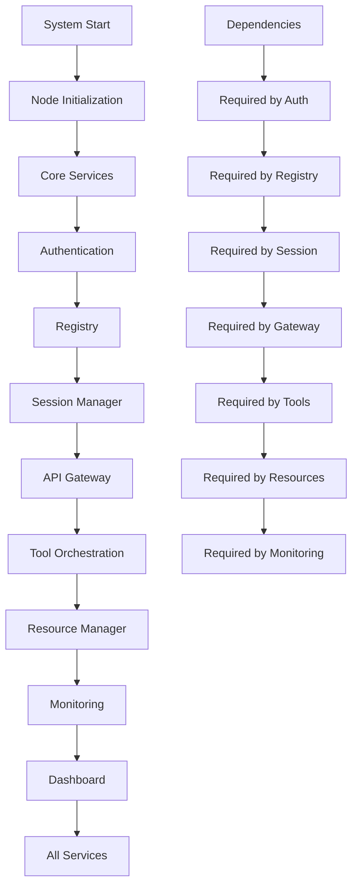
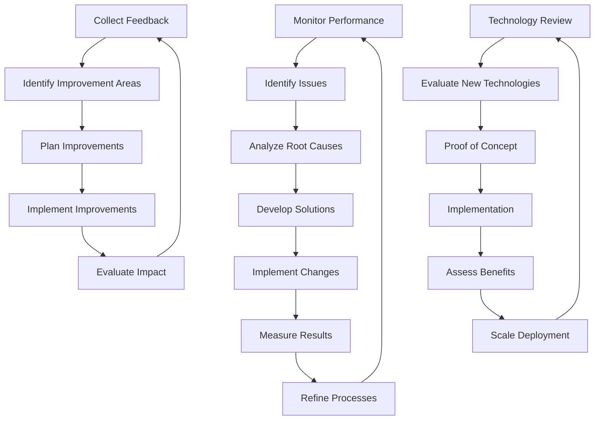

# Technology Recovery Procedures
## erlmcp v3 Business Continuity Plan

### Executive Summary
This document outlines comprehensive technology recovery procedures for erlmcp v3, designed to ensure rapid and reliable restoration of technology infrastructure and services. The procedures cover system recovery, data restoration, and service restoration to meet Fortune 500 business continuity requirements.

---

## 1. Technology Recovery Architecture

### 1.1 Recovery Site Hierarchy

| Site | Purpose | Recovery Time | Capacity | Technology |
|------|---------|---------------|----------|-----------|
| **Primary Site** | Active production | N/A | 100% | Full infrastructure |
| **Secondary Site** | Immediate failover | < 1 hour | 100% | Parallel infrastructure |
| **Tertiary Site** | Extended failover | < 4 hours | 50% | Cloud-based |
| **Quaternary Site** | Disaster recovery | < 8 hours | 25% | Minimal essential |
| **Cloud Standby** | Elastic capacity | < 15 minutes | 500% | Auto-scaling |

### 1.2 Technology Stack Recovery Priorities

| Tier | Component | RTO | RPO | Recovery Method |
|------|-----------|-----|-----|-----------------|
| **Tier 1 - Critical** | Authentication | 15 min | 15 min | Active-Passive |
| | Database Cluster | 30 min | 30 min | Synchronous Replication |
| | API Gateway | 30 min | 30 min | Load Balancer Failover |
| | Session Management | 60 min | 60 min | Database Restore |
| **Tier 2 - High** | Tool Orchestration | 120 min | 2 hours | Warm Standby |
| | Resource Management | 120 min | 2 hours | Database Restore |
| | Monitoring Systems | 180 min | 15 min | Pre-configured |
| **Tier 3 - Medium** | Dashboard | 240 min | 4 hours | Cold Standby |
| | Developer Tools | 240 min | 4 hours | Cold Standby |
| | Analytics | 360 min | 24 hours | Cold Standby |
| **Tier 4 - Low** | Reporting | 480 min | 48 hours | Cold Standby |
| | Archives | 720 min | 7 days | Manual Restore |

---

## 2. Infrastructure Recovery Procedures

### 2.1 Data Center Recovery

#### 2.1.1 Primary Site Recovery
```bash
#!/bin/bash
# primary_site_recovery.sh

# Emergency data center recovery script
# Usage: sudo ./primary_site_recovery.sh

echo "=== Primary Site Recovery ==="
echo "Starting recovery at $(date)"

# 1. Power and Environment Check
echo "Step 1: Checking power and environment..."
if ! check_power_status; then
    echo "ERROR: Power issue detected"
    emergency_power_restore
fi

if ! check_environment; then
    echo "ERROR: Environmental issue detected"
    emergency_environment_fix
fi

# 2. Network Infrastructure Recovery
echo "Step 2: Recovering network infrastructure..."
recover_networking
restore_network_config

# 3. Server Hardware Recovery
echo "Step 3: Recovering server hardware..."
recover_servers
check_hardware_health

# 4. Storage Systems Recovery
echo "Step 4: Recovering storage systems..."
recover_storage_systems
mount_storage_volumes

# 5. Security Systems Recovery
echo "Step 5: Recovering security systems..."
recover_security_systems
restore_firewall_rules

echo "Primary site recovery completed at $(date)"
```

#### 2.1.2 Network Recovery Procedures
```erlang
% Network recovery module
-module(erlmcp_network_recovery).

-export([recover_network/0, test_connectivity/1, configure_routing/1]).

% Complete network recovery
recover_network() ->
    % 1. Assess network status
    case assess_network_status() of
        operational ->
            {ok, network_already_operational};
        degraded ->
            recover_degraded_network();
        failed ->
            recover_failed_network()
    end.

% Recover failed network
recover_failed_network() ->
    % 1. Activate backup network equipment
    activate_backup_equipment(),

    % 2. Configure network interfaces
    configure_interfaces(),

    % 3. Set up routing
    configure_routing(primary),

    % 4. Restore firewall rules
    restore_firewall_rules(),

    % 5. Configure load balancers
    configure_load_balancers(),

    % 6. Test connectivity
    case test_connectivity(all) of
        ok ->
            % 7. Activate monitoring
            activate_network_monitoring(),
            {ok, network_recovered};
        {error, Issues} ->
            {error, connectivity_failed, Issues}
    end.

% Test network connectivity
test_connectivity(Scope) ->
    % Test various connectivity points
    Tests = [
        {internet_connectivity, test_internet()},
        {internal_connectivity, test_internal()},
        {service_connectivity, test_services()},
        {backup_connectivity, test_backup()}
    ],

    % Collect results
    Results = lists:map(fun({Test, Fun}) ->
        case Fun() of
            ok -> {Test, ok};
            {error, Reason} -> {Test, {error, Reason}}
        end
    end, Tests),

    % Determine overall status
    case lists:all(fun({_, Status}) -> Status == ok end, Results) of
        true -> ok;
        false -> {error, failed_tests, Results}
    end.
```

### 2.2 Cloud Infrastructure Recovery

#### 2.2.1 Multi-Cloud Recovery Strategy
```yaml
# Multi-cloud recovery configuration
cloud_recovery:
  # AWS Configuration
  aws:
    primary_region: "us-east-1"
    secondary_region: "us-west-2"
    services:
      - ec2:        # Compute
          redundancy: cross_region
          auto_scaling: true
          min_capacity: 4
          max_capacity: 16
      - rds:        # Database
          redundancy: multi_az
          backup_retention: 7
          read_replicas: 2
      - s3:         # Storage
          redundancy: cross_region
          versioning: true
          encryption: AES256
      - cloudfront: # CDN
          redundancy: multi_origin
          failover: true

  # Azure Configuration
  azure:
    primary_region: "East US"
    secondary_region: "West US"
    services:
      - vmss:       # Virtual Machine Scale Set
          redundancy: zone
          upgrade_mode: automatic
      - sql:        # Database
          redundancy: geo
          backup_geo: West US
      - blob:       # Storage
          redundancy: geo
          tiers: hot,cool,archive
      - traffic_manager: # Traffic Management
          routing: performance
          monitor: http

  # GCP Configuration
  gcp:
    primary_region: "us-central1"
    secondary_region: "us-east1"
    services:
      - compute:    # Compute Engine
          redundancy: zone
          autoscaling: true
      - cloud_sql:  # Database
          redundancy: regional
          backups: daily
      - cloud_storage: # Storage
          redundancy: multi-regional
          versioning: true
      - load_balancing: # Load Balancing
          mode: global
          health_check: true
```

#### 2.2.2 Cloud Failover Procedures
```erlang
% Cloud failover management
-module(erlmcp_cloud_failover).

-export([initiate_failover/2, failback/2, monitor_health/1]).

% Initiate cloud failover
initiate_failover(PrimaryRegion, TargetRegion) ->
    % 1. Assess readiness
    case is_region_ready(TargetRegion) of
        true ->
            % 2. Start pre-failover checks
            PreChecks = pre_failover_checks(PrimaryRegion),

            % 3. Execute failover
            case execute_failover(PrimaryRegion, TargetRegion) of
                ok ->
                    % 4. Post-failover verification
                    PostChecks = post_failover_verification(TargetRegion),

                    case PostChecks of
                        ok ->
                            % 5. Activate monitoring
                            activate_failover_monitoring(TargetRegion),
                            {ok, failover_completed};
                        {error, Issues} ->
                            {error, verification_failed, Issues}
                    end;
                {error, Reason} ->
                    {error, failover_failed, Reason}
            end;
        false ->
            {error, target_region_not_ready}
    end.

% Execute failover process
execute_failover(PrimaryRegion, TargetRegion) ->
    % 1. Prepare target region
    prepare_target_region(TargetRegion),

    % 2. Stop primary services
    stop_primary_services(PrimaryRegion),

    % 3. Start target services
    start_target_services(TargetRegion),

    % 4. Configure networking
    configure_cross_region_networking(PrimaryRegion, TargetRegion),

    % 5. Update DNS
    update_dns_records(TargetRegion),

    % 6. Route traffic
    route_traffic_to_target(TargetRegion),

    ok.

% Health monitoring during failover
monitor_health(FailoverStatus) ->
    % Monitor critical systems
    CriticalSystems = [
        database_connectivity,
        api_gateway_status,
        authentication_service,
        session_management,
        resource_availability
    ],

    % Monitor each system
    SystemStatus = lists:map(fun(System) ->
        case check_system_health(System) of
            healthy -> {System, healthy};
            degraded -> {System, degraded};
            {error, Reason} -> {System, {error, Reason}}
        end
    end, CriticalSystems),

    % Generate alert for degraded systems
    lists:foreach(fun({System, Status}) ->
        case Status of
            degraded ->
                alert_team(system_degraded, System);
            {error, _} ->
                alert_team(system_failure, System)
        end
    end, [S || {_, {error, _}} <- SystemStatus]),

    SystemStatus.
```

### 2.3 System Recovery Procedures

#### 2.3.1 Core System Recovery
```erlang
% Core system recovery module
-module(erlmcp_core_recovery).

-export([recover_core_system/0, verify_core_health/1, apply_patches/1]).

% Recover core system
recover_core_system() ->
    % 1. Check system status
    Status = check_system_status(),

    case Status of
        healthy ->
            {ok, system_healthy};
        degraded ->
            recover_degraded_system();
        failed ->
            recover_failed_system()
    end.

% Recover failed system
recover_failed_system() ->
    % 1. Emergency stop
    emergency_stop(),

    % 2. Check resource availability
    Resources = check_resource_availability(),

    % 3. Recover Erlang node
    NodeStatus = recover_erlang_node(),

    % 4. Start core services
    Services = start_core_services(),

    % 5. Verify health
    Health = verify_core_health(all),

    case {NodeStatus, Services, Health} of
        {ok, ok, ok} ->
            % 6. Activate monitoring
            activate_monitoring(),
            {ok, system_recovered};
        {_, _, {error, Issues}} ->
            {error, health_check_failed, Issues}
    end.

% Start core services
start_core_services() ->
    % Define core services startup order
    Services = [
        {erlmcp_auth_server, [start_link]},
        {erlmcp_registry, [start]},
        {erlmcp_session_manager, [start]},
        {erlmcp_api_gateway, [start]},
        {erlmcp_tool_orchestration, [start]},
        {erlmcp_resource_manager, [start]}
    ],

    % Start services with dependencies
    lists:foldl(fun({Service, Actions}, Acc) ->
        case apply(Service, Actions, []) of
            {ok, Pid} ->
                register(Service, Pid),
                ok;
            {error, Reason} ->
                log_error(service_start, Service, Reason),
                {error, service_failed, Service}
        end
    end, ok, Services).

% Verify core system health
verify_core_health(Scope) ->
    % Health check endpoints
    Endpoints = case Scope of
        all -> all_health_endpoints();
        critical -> critical_health_endpoints()
    end,

    % Check each endpoint
    Results = lists:map(fun(Endpoint) ->
        case check_endpoint(Endpoint) of
            {ok, Status} -> {Endpoint, ok, Status};
            {error, Reason} -> {Endpoint, {error}, Reason}
        end
    end, Endpoints),

    % Determine overall status
    case lists:all(fun({_, Status, _}) -> Status == ok end, Results) of
        true -> ok;
        false -> {error, failed_endpoints, Results}
    end.
```

#### 2.3.2 Service Recovery Order and Dependencies


---

## 3. Data Recovery Procedures

### 3.1 Database Recovery Strategies

#### 3.1.1 Multi-Database Recovery
```erlang
% Database recovery management
-module(erlmcp_database_recovery).

-export([recover_database/2, verify_data_integrity/1, apply_transactions/2]).

% Recover specific database
recover_database(DbName, RecoveryType) ->
    % 1. Check database status
    case check_database_status(DbName) of
        healthy ->
            {ok, database_healthy};
        corrupt ->
            recover_corrupt_database(DbName, RecoveryType);
        failed ->
            recover_failed_database(DbName, RecoveryType)
    end.

% Recover failed database
recover_failed_database(DbName, RecoveryType) ->
    % 1. Identify backup
    BackupInfo = identify_latest_backup(DbName),

    % 2. Stop database
    stop_database(DbName),

    % 3. Restore from backup
    case RecoveryType of
        full ->
            restore_full_backup(DbName, BackupInfo);
        point_in_time ->
            PITRBackup = identify_pitr_point(DbName),
            restore_pitr(DbName, PITRBackup)
    end,

    % 4. Start database
    start_database(DbName),

    % 5. Verify integrity
    case verify_data_integrity(DbName) of
        ok ->
            % 6. Apply transactions after backup
            apply_transactions(DbName, BackupInfo.timestamp),
            {ok, database_recovered};
        {error, Reason} ->
            {error, integrity_check_failed, Reason}
    end.

% Verify data integrity
verify_data_integrity(DbName) ->
    % 1. Check table integrity
    TableChecks = check_table_integrity(DbName),

    % 2. Check index integrity
    IndexChecks = check_index_integrity(DbName),

    % 3. Check referential integrity
    RefChecks = check_referential_integrity(DbName),

    % 4. Check transaction logs
    LogChecks = check_transaction_logs(DbName),

    % Combine results
    AllChecks = [
        TableChecks,
        IndexChecks,
        RefChecks,
        LogChecks
    ],

    case lists:all(fun(Check) -> Check == ok end, AllChecks) of
        true -> ok;
        false -> {error, integrity_issues, AllChecks}
    end.

% Apply transactions after backup point
apply_transactions(DbName, BackupTime) ->
    % 1. Get transaction logs after backup time
    TransactionLogs = get_transactions_after(DbName, BackupTime),

    % 2. Apply each transaction
    lists:foreach(fun(Log) ->
        case apply_transaction(DbName, Log) of
            ok -> ok;
            {error, Reason} ->
                log_error(transaction_apply, DbName, Reason),
                {error, transaction_failed, Log}
        end
    end, TransactionLogs).
```

#### 3.1.2 Backup and Recovery Configuration
```erlang
% Database backup configuration
{database_backup, #{
    postgres => #{
        strategy => continuous,
        retention => #{full => 7, incremental => 24},
        compression => lz4,
        encryption => aes256,
        storage => [
            {local, "/backups/postgres"},
            {s3, "s3://erlmcp-backups/postgres"}
        ],
        schedule => [
            {full, "0 2 * * 0"},
            {incremental, "0 */2 * * *"}
        ],
        verification => true,
        encryption_key => "{{db_encryption_key}}"
    },

    redis => #{
        strategy => snapshot,
        retention => #{full => 30},
        compression => gzip,
        storage => [
            {local, "/backups/redis"},
            {s3, "s3://erlmcp-backups/redis"}
        ],
        schedule => ["0 3 * * *"],
        verification => true,
        rdb_compression => true
    },

    etls => #{
        strategy => snapshot,
        retention => #{full => 14},
        storage => [
            {local, "/backups/etls"},
            {s3, "s3://erlmcp-backups/etls"}
        ],
        schedule => ["0 4 * * *"],
        verification => true,
        auto_start => true
    }
}}.
```

### 3.2 Data Synchronization and Consistency

#### 3.2.1 Data Synchronization Procedures
```erlang
% Data synchronization management
-module(erlmcp_data_sync).

-export([synchronize_data/2, verify_synchronization/1, resolve_conflicts/2]).

% Synchronize data between sites
synchronize_data(SourceSite, TargetSite) ->
    % 1. Check connectivity
    case check_site_connectivity(SourceSite, TargetSite) of
        ok ->
            % 2. Get data differences
            Differences = get_data_differences(SourceSite, TargetSite),

            % 3. Transfer data
            TransferResult = transfer_data(SourceSite, TargetSite, Differences),

            % 4. Verify synchronization
            case verify_synchronization(TargetSite) of
                ok ->
                    % 5. Activate monitoring
                    activate_sync_monitoring(SourceSite, TargetSite),
                    {ok, synchronization_completed};
                {error, Issues} ->
                    {error, verification_failed, Issues}
            end;
        {error, Reason} ->
            {error, connectivity_failed, Reason}
    end.

% Verify data synchronization
verify_synchronization(Site) ->
    % 1. Check data consistency
    Consistency = check_data_consistency(Site),

    % 2. Check replication lag
    ReplicationLag = check_replication_lag(Site),

    % 3. Check missing transactions
    MissingTx = check_missing_transactions(Site),

    % 4. Validate checksums
    Checksums = validate_checksums(Site),

    #{
        consistency => Consistency,
        replication_lag => ReplicationLag,
        missing_transactions => MissingTx,
        checksums => Checksums
    }.

% Resolve data conflicts
resolve_conflicts(Site, Conflicts) ->
    % 1. Categorize conflicts
    Categorized = categorize_conflicts(Conflicts),

    % 2. Apply resolution strategy
    Resolved = lists:map(fun(Category) ->
        resolve_category(Category)
    end, Categorized),

    % 3. Verify resolution
    Verification = verify_resolution(Resolved),

    case Verification of
        ok ->
            % 4. Update monitoring
            update_conflict_monitoring(Resolved),
            {ok, conflicts_resolved};
        {error, Issues} ->
            {error, resolution_failed, Issues}
    end.
```

#### 3.2.2 Data Recovery Automation
```bash
#!/bin/bash
# automated_data_recovery.sh

# Automated data recovery script
# Usage: ./automated_data_recovery.sh <database> <timestamp>

DB_NAME=$1
BACKUP_TIME=$2

echo "=== Automated Data Recovery ==="
echo "Database: $DB_NAME"
echo "Backup Time: $BACKUP_TIME"
echo "Start Time: $(date)"

# 1. Validate parameters
if [ -z "$DB_NAME" ] || [ -z "$BACKUP_TIME" ]; then
    echo "ERROR: Missing required parameters"
    exit 1
fi

# 2. Identify backup
BACKUP_FILE=$(find_backups "$DB_NAME" "$BACKUP_TIME")
if [ -z "$BACKUP_FILE" ]; then
    echo "ERROR: Backup not found"
    exit 1
fi

# 3. Stop database service
echo "Stopping database service..."
systemctl stop erlmcp-$DB_NAME

# 4. Restore from backup
echo "Restoring from backup..."
restore_database "$DB_NAME" "$BACKUP_FILE"

# 5. Start database service
echo "Starting database service..."
systemctl start erlmcp-$DB_NAME

# 6. Verify integrity
echo "Verifying data integrity..."
if verify_database_integrity "$DB_NAME"; then
    echo "Data recovery successful"
    exit 0
else
    echo "ERROR: Data integrity check failed"
    exit 1
fi

echo "End Time: $(date)"
```

---

## 4. Network and Security Recovery

### 4.1 Network Recovery

#### 4.1.1 Network Infrastructure Recovery
```erlang
% Network infrastructure recovery
-module(erlmcp_network_infra_recovery).

-export([recover_network_infrastructure/0, configure_failover/1, test_network/1]).

% Complete network infrastructure recovery
recover_network_infrastructure() ->
    % 1. Assess network status
    Status = assess_network_status(),

    case Status of
        operational ->
            {ok, network_operational};
        partial ->
            recover_partial_network();
        failed ->
            recover_complete_network()
    end.

% Recover complete network
recover_complete_network() ->
    % 1. Initialize core network equipment
    initialize_core_equipment(),

    % 2. Configure base networking
    configure_base_networking(),

    % 3. Set up routing
    configure_routing(),

    % 4. Configure security
    configure_security(),

    % 5. Configure load balancing
    configure_load_balancing(),

    % 6. Test connectivity
    case test_network(all) of
        ok ->
            % 7. Activate monitoring
            activate_network_monitoring(),
            {ok, network_recovered};
        {error, Issues} ->
            {error, network_test_failed, Issues}
    end.

% Configure network failover
configure_failover(Config) ->
    % 1. Parse configuration
    ParsedConfig = parse_failover_config(Config),

    % 2. Configure virtual IPs
    configure_vips(ParsedConfig),

    % 3. Configure routing protocols
    configure_routing_protocols(ParsedConfig),

    % 4. Configure failover timers
    configure_failover_timers(ParsedConfig),

    % 5. Test failover
    case test_failover(ParsedConfig) of
        ok ->
            {ok, failover_configured};
        {error, Reason} ->
            {error, failover_test_failed, Reason}
    end.
```

#### 4.1.2 DNS and Load Balancer Recovery
```bash
#!/bin/bash
# dns_lb_recovery.sh

# DNS and Load Balancer recovery script
# Usage: sudo ./dns_lb_recovery.sh

echo "=== DNS and Load Balancer Recovery ==="

# 1. Check DNS status
echo "Checking DNS status..."
if ! check_dns_health; then
    echo "ERROR: DNS issue detected"
    recover_dns
fi

# 2. Check load balancer status
echo "Checking load balancer status..."
if ! check_lb_health; then
    echo "ERROR: Load balancer issue detected"
    recover_load_balancer
fi

# 3. Configure failover
echo "Configuring failover..."
configure_lb_failover

# 4. Test routing
echo "Testing routing..."
if test_routing; then
    echo "DNS and Load Balancer recovery completed successfully"
else
    echo "ERROR: Routing test failed"
    exit 1
fi

echo "Recovery completed at $(date)"
```

### 4.2 Security Recovery

#### 4.2.1 Security Systems Recovery
```erlang
% Security systems recovery
-module(erlmcp_security_recovery).

-export([recover_security_systems/0, restore_security_policies/1, verify_security/1]).

% Recover all security systems
recover_security_systems() ->
    % 1. Assess security status
    SecurityStatus = assess_security_status(),

    case SecurityStatus of
        healthy ->
            {ok, security_healthy};
        degraded ->
            recover_degraded_security();
        compromised ->
            recover_compromised_security()
    end.

% Recover compromised security
recover_compromised_security() ->
    % 1. Incident response
    incident_response(),

    % 2. System isolation
    isolate_compromised_systems(),

    % 3. Root cause analysis
    RootCause = perform_root_cause_analysis(),

    % 4. System remediation
    remediate_systems(),

    % 5. Restore security policies
    restore_security_policies(),

    % 6. Verify security posture
    case verify_security(comprehensive) of
        ok ->
            % 7. Enhance monitoring
            enhance_security_monitoring(),
            {ok, security_recovered};
        {error, Issues} ->
            {error, security_verification_failed, Issues}
    end.

% Restore security policies
restore_security_policies(Policies) ->
    % 1. Parse policies
    ParsedPolicies = parse_security_policies(Policies),

    % 2. Restore firewall rules
    restore_firewall_rules(ParsedPolicies),

    % 3. Restore access controls
    restore_access_controls(ParsedPolicies),

    % 4. Restore encryption policies
    restore_encryption_policies(ParsedPolicies),

    % 5. Restore audit policies
    restore_audit_policies(ParsedPolicies),

    ok.

% Verify security posture
verify_security(Scope) ->
    % Security checks based on scope
    Checks = case Scope of
        critical -> critical_security_checks();
        comprehensive -> all_security_checks()
    end,

    % Perform all checks
    Results = lists:map(fun({Check, Fun}) ->
        case Fun() of
            ok -> {Check, ok};
            {error, Reason} -> {Check, {error, Reason}}
        end
    end, Checks),

    % Generate alerts for failures
    lists:foreach(fun({Check, Status}) ->
        case Status of
            {error, Reason} ->
                alert_team(security_issue, Check, Reason)
        end
    end, [C || {_, {error, _}} <- Results]),

    % Determine overall status
    case lists:all(fun({_, Status}) -> Status == ok end, Results) of
        true -> ok;
        false -> {error, security_checks_failed, Results}
    end.
```

#### 4.2.2 Certificate and Key Recovery
```bash
#!/bin/bash
# certificate_recovery.sh

# Certificate and key recovery script
# Usage: ./certificate_recovery.sh <domain> <environment>

DOMAIN=$1
ENVIRONMENT=$2

echo "=== Certificate Recovery for $DOMAIN ($ENVIRONMENT) ==="

# 1. Check certificate status
if ! check_certificate_validity "$DOMAIN"; then
    echo "Certificate expired or invalid"

    # 2. Generate new certificate
    echo "Generating new certificate..."
    generate_certificate "$DOMAIN" "$ENVIRONMENT"

    # 3. Install certificate
    echo "Installing certificate..."
    install_certificate "$DOMAIN" "$ENVIRONMENT"

    # 4. Restart services
    echo "Restarting services..."
    restart_ssl_services "$DOMAIN"

    # 5. Verify installation
    if verify_certificate_installation "$DOMAIN"; then
        echo "Certificate recovery successful"
    else
        echo "ERROR: Certificate verification failed"
        exit 1
    fi
else
    echo "Certificate is valid, no recovery needed"
fi

echo "Certificate recovery completed at $(date)"
```

---

## 5. Application Recovery

### 5.1 Service Recovery Automation

#### 5.1.1 Automated Service Recovery
```erlang
% Automated service recovery
-module(erlmcp_service_recovery).

-export([auto_recover_service/1, recover_with_dependencies/2, monitor_recovery/1]).

% Automatic service recovery
auto_recover_service(Service) ->
    % 1. Check service health
    Health = check_service_health(Service),

    case Health of
        healthy ->
            {ok, service_healthy};
        degraded ->
            recover_degraded_service(Service);
        failed ->
            recover_failed_service(Service)
    end.

% Recover failed service with dependencies
recover_with_dependencies(Service, Dependencies) ->
    % 1. Verify dependencies are available
    case check_dependencies(Dependencies) of
        available ->
            % 2. Recover service
            RecoveryResult = auto_recover_service(Service),

            % 3. Verify recovery
            case verify_service_recovery(Service) of
                ok ->
                    % 4. Start monitoring
                    start_service_monitoring(Service),
                    RecoveryResult;
                {error, Reason} ->
                    {error, recovery_verification_failed, Reason}
            end;
        {error, MissingDeps} ->
            {error, missing_dependencies, MissingDeps}
    end.

% Monitor service recovery
monitor_recovery(Service) ->
    % 1. Set up monitoring
    MonitorSetup = setup_recovery_monitoring(Service),

    % 2. Monitor recovery progress
    Progress = monitor_recovery_progress(Service),

    % 3. Check recovery status
    Status = check_recovery_status(Service),

    % 4. Handle recovery completion
    case Status of
        completed ->
            % 5. Perform post-recovery checks
            PostChecks = perform_post_recovery_checks(Service),

            % 6. Final verification
            case PostChecks of
                ok ->
                    alert_team(recovery_complete, Service),
                    {ok, recovery_successful};
                {error, Issues} ->
                    alert_team(recovery_issues, Service, Issues),
                    {error, post_checks_failed, Issues}
            end;
        in_progress ->
            alert_team(recovery_in_progress, Service),
            {status, in_progress};
        failed ->
            alert_team(recovery_failed, Service),
            {error, recovery_failed}
    end.
```

#### 5.1.2 Service Health Monitoring
```erlang
% Service health monitoring
-module(erlmcp_service_monitor).

-export([start_monitoring/1, check_health/2, alert_on_failure/3]).

% Start service monitoring
start_monitoring(Services) ->
    % 1. Configure monitoring
    Config = configure_monitoring(Services),

    % 2. Start monitoring processes
    Processes = lists:map(fun(Service) ->
        spawn_monitor(fun() -> monitor_service(Service) end)
    end, Services),

    % 3. Store monitoring state
    store_monitoring_state(Processes, Config),

    ok.

% Monitor individual service
monitor_service(Service) ->
    % 1. Initialize monitoring
    initialize_monitoring(Service),

    % 2. Main monitoring loop
    monitor_loop(Service, 0).

% Monitoring loop
monitor_loop(Service, FailureCount) ->
    % 1. Check service health
    Health = check_service_health(Service),

    % 2. Handle health status
    case Health of
        healthy ->
            % Reset failure count
            monitor_loop(Service, 0);
        degraded ->
            % Log degradation
            log_degradation(Service),
            monitor_loop(Service, FailureCount);
        failed ->
            % Increment failure count
            NewCount = FailureCount + 1,

            % Check if threshold reached
            case should_alert(NewCount) of
                true ->
                    alert_on_failure(Service, NewCount, monitor),
                    monitor_loop(Service, NewCount);
                false ->
                    monitor_loop(Service, NewCount)
            end
    end.

% Alert on service failure
alert_on_failure(Service, FailureCount, Source) ->
    % 1. Prepare alert
    Alert = prepare_alert(Service, FailureCount, Source),

    % 2. Send alerts through configured channels
    lists:foreach(fun(Channel) ->
        send_alert(Alert, Channel)
    end, get_alert_channels()),

    % 3. Store alert in history
    store_alert_history(Alert),

    % 4. Trigger recovery if configured
    case should_trigger_recovery(Service) of
        true ->
            trigger_recovery(Service);
        false ->
            ok
    end.
```

### 5.2 Configuration Management Recovery

#### 5.2.1 Configuration Recovery Procedures
```erlang
% Configuration management recovery
-module(erlmcp_config_recovery).

-export([recover_configuration/1, apply_configuration/1, verify_configuration/1]).

% Recover configuration
recover_configuration(ConfigType) ->
    % 1. Identify latest configuration backup
    Backup = identify_latest_config_backup(ConfigType),

    % 2. Verify backup integrity
    case verify_config_backup(Backup) of
        ok ->
            % 3. Restore configuration
            case restore_config(ConfigType, Backup) of
                ok ->
                    % 4. Apply configuration
                    ApplyResult = apply_configuration(ConfigType),

                    % 5. Verify configuration
                    VerifyResult = verify_configuration(ConfigType),

                    case {ApplyResult, VerifyResult} of
                        {ok, ok} ->
                            % 6. Activate monitoring
                            activate_config_monitoring(ConfigType),
                            {ok, config_recovered};
                        {_, Error} ->
                            {error, config_recovery_failed, Error}
                    end;
                {error, Reason} ->
                    {error, config_restore_failed, Reason}
            end;
        {error, Reason} ->
            {error, backup_verification_failed, Reason}
    end.

% Apply configuration
apply_configuration(ConfigType) ->
    % 1. Parse configuration
    Parsed = parse_configuration(ConfigType),

    % 2. Apply system configuration
    SystemConfig = apply_system_config(Parsed),

    % 3. Apply service configuration
    ServiceConfig = apply_service_config(Parsed),

    % 4. Apply security configuration
    SecurityConfig = apply_security_config(Parsed),

    % 5. Validate configuration
    case validate_configuration(ConfigType) of
        ok ->
            {ok, configuration_applied};
        {error, Issues} ->
            {error, configuration_validation_failed, Issues}
    end.

% Verify configuration
verify_configuration(ConfigType) ->
    % 1. Check configuration syntax
    SyntaxCheck = check_config_syntax(ConfigType),

    % 2. Check configuration values
    ValuesCheck = check_config_values(ConfigType),

    % 3. Check configuration references
    ReferencesCheck = check_config_references(ConfigType),

    % 4. Test configuration
    TestResult = test_configuration(ConfigType),

    % Combine results
    AllChecks = [SyntaxCheck, ValuesCheck, ReferencesCheck, TestResult],

    case lists:all(fun(Check) -> Check == ok end, AllChecks) of
        true -> ok;
        false -> {error, configuration_failed, AllChecks}
    end.
```

#### 5.2.2 Configuration Backup and Restore
```bash
#!/bin/bash
# config_recovery.sh

# Configuration recovery script
# Usage: sudo ./config_recovery.sh <config_type>

CONFIG_TYPE=$1

echo "=== Configuration Recovery: $CONFIG_TYPE ==="

# 1. Check if configuration is healthy
if check_config_health "$CONFIG_TYPE"; then
    echo "Configuration is healthy, no recovery needed"
    exit 0
fi

# 2. Identify backup
BACKUP_FILE=$(find_config_backup "$CONFIG_TYPE")
if [ -z "$BACKUP_FILE" ]; then
    echo "ERROR: No backup found for $CONFIG_TYPE"
    exit 1
fi

# 3. Stop services if needed
if [ "$CONFIG_TYPE" = "system" ]; then
    echo "Stopping system services..."
    systemctl stop erlmcp-system
fi

# 4. Restore configuration
echo "Restoring configuration from $BACKUP_FILE..."
restore_config_file "$CONFIG_TYPE" "$BACKUP_FILE"

# 5. Apply configuration
echo "Applying configuration..."
apply_config "$CONFIG_TYPE"

# 6. Start services if stopped
if [ "$CONFIG_TYPE" = "system" ]; then
    echo "Starting system services..."
    systemctl start erlmcp-system
fi

# 7. Verify configuration
if verify_config "$CONFIG_TYPE"; then
    echo "Configuration recovery successful"
else
    echo "ERROR: Configuration verification failed"
    exit 1
fi

echo "Configuration recovery completed at $(date)"
```

---

## 6. Testing and Validation

### 6.1 Recovery Testing Framework

#### 6.1.1 Automated Testing Suite
```erlang
% Recovery testing framework
-module(erlmcp_recovery_tests).

-export([run_recovery_tests/0, run_recovery_test/1, generate_test_report/1]).

% Run all recovery tests
run_recovery_tests() ->
    % 1. Define test scenarios
    Scenarios = define_test_scenarios(),

    % 2. Run each test scenario
    Results = lists:map(fun(Scenario) ->
        run_recovery_test(Scenario)
    end, Scenarios),

    % 3. Generate test report
    Report = generate_test_report(Results),

    % 4. Save report
    save_test_report(Report),

    % 5. Return results
    {Results, Report}.

% Run individual recovery test
run_recovery_test(Scenario) ->
    % 1. Setup test environment
    Setup = setup_test_environment(Scenario),

    % 2. Inject failure
    Failure = inject_failure(Scenario),

    % 3. Execute recovery
    Recovery = execute_recovery(Scenario),

    % 4. Verify recovery
    Verification = verify_recovery(Scenario),

    % 5. Cleanup
    Cleanup = cleanup_test_environment(Scenario),

    % 6. Calculate metrics
    Metrics = calculate_test_metrics(Setup, Failure, Recovery, Verification, Cleanup),

    #{
        scenario => Scenario,
        setup => Setup,
        failure => Failure,
        recovery => Recovery,
        verification => Verification,
        cleanup => Cleanup,
        metrics => Metrics,
        timestamp => erlang:system_time(millisecond)
    }.

% Generate test report
generate_test_report(Results) ->
    % 1. Calculate statistics
    Stats = calculate_test_statistics(Results),

    % 2. Identify failed tests
    Failed = identify_failed_tests(Results),

    % 3. Generate recommendations
    Recommendations = generate_recommendations(Results, Failed),

    % 4. Create report
    Report = #{
        statistics => Stats,
        failed_tests => Failed,
        recommendations => Recommendations,
        timestamp => erlang:system_time(millisecond)
    },

    % 5. Return report
    Report.
```

#### 6.1.2 Test Scenarios
```markdown
## Recovery Test Scenarios

### Scenario 1: Complete System Failure
**Description:** All systems experience complete failure
**Test Duration:** 4 hours
**Expected Recovery:** < 2 hours

**Test Steps:**
1. Simulate complete system failure
2. Initiate emergency recovery
3. Verify system restoration
4. Test all critical services
5. Monitor system performance

**Success Criteria:**
- < 15 minute detection
- < 2 hour recovery time
- 100% service functionality
- Normal performance restored

### Scenario 2: Partial System Failure
**Description:** Critical services experience partial failure
**Test Duration:** 2 hours
**Expected Recovery:** < 1 hour

**Test Steps:**
1. Simulate partial system failure
2. Initiate selective recovery
3. Verify service restoration
4. Test dependent services
5. Monitor system stability

**Success Criteria:**
- < 5 minute detection
- < 1 hour recovery time
- 100% critical services restored
- No impact on non-critical services

### Scenario 3: Data Corruption
**Description:** Critical database experiences data corruption
**Test Duration:** 6 hours
**Expected Recovery:** < 4 hours

**Test Steps:**
1. Simulate data corruption
2. Initiate data recovery
3. Verify data integrity
4. Test application functionality
5. Monitor data consistency

**Success Criteria:**
- < 30 minute detection
- < 4 hour recovery time
- 100% data integrity restored
- No data loss
```

### 6.2 Validation Procedures

#### 6.2.1 Post-Recovery Validation
```erlang
% Post-recovery validation
-module(erlmcp_validation).

-export([validate_recovery/1, check_service_levels/1, verify_data_consistency/1]).

% Validate complete recovery
validate_recovery(RecoveryResults) ->
    % 1. Check service health
    ServiceHealth = check_service_health(),

    % 2. Check data consistency
    DataConsistency = verify_data_consistency(),

    % 3. Check performance levels
    Performance = check_service_levels(),

    % 4. Check security posture
    Security = verify_security_posture(),

    % 5. Check compliance
    Compliance = verify_compliance(),

    % 6. Generate validation report
    ValidationReport = generate_validation_report([
        ServiceHealth, DataConsistency, Performance, Security, Compliance
    ]),

    case ValidationReport of
        valid ->
            {ok, recovery_validated};
        {invalid, Issues} ->
            {error, validation_failed, Issues}
    end.

% Check service levels
check_service_levels() ->
    % 1. Check response times
    ResponseTimes = check_response_times(),

    % 2. Check throughput
    Throughput = check_throughput(),

    % 3. Check error rates
    ErrorRates = check_error_rates(),

    % 4. Check availability
    Availability = check_availability(),

    % 5. Compare with SLAs
    SLAComparison = compare_with_slas(ResponseTimes, Throughput, ErrorRates, Availability),

    #{
        response_times => ResponseTimes,
        throughput => Throughput,
        error_rates => ErrorRates,
        availability => Availability,
        sla_comparison => SLAComparison
    }.

% Verify data consistency
verify_data_consistency() ->
    % 1. Check database consistency
    DBConsistency = check_database_consistency(),

    % 2. Check cache consistency
    CacheConsistency = check_cache_consistency(),

    % 3. Check file system consistency
    FileConsistency = check_filesystem_consistency(),

    % 4. Check application data consistency
    AppConsistency = check_application_data(),

    #{
        database => DBConsistency,
        cache => CacheConsistency,
        filesystem => FileConsistency,
        application => AppConsistency
    }.
```

#### 6.2.2 Performance Validation
```bash
#!/bin/bash
# performance_validation.sh

# Performance validation script
# Usage: ./performance_validation.sh

echo "=== Performance Validation ==="

# 1. Define performance thresholds
THRESHOLDS=("--response-time" "100" "--throughput" "1000" "--error-rate" "0.01" "--availability" "99.9")

# 2. Run performance tests
echo "Running performance tests..."
PERFORMANCE_RESULTS=$(run_performance_tests "${THRESHOLDS[@]}")

# 3. Analyze results
echo "Analyzing results..."
ANALYSIS=$(analyze_performance_results "$PERFORMANCE_RESULTS")

# 4. Compare with SLAs
echo "Comparing with SLAs..."
SLA_COMPARISON=$(compare_with_slas "$PERFORMANCE_RESULTS")

# 5. Generate report
echo "Generating performance report..."
generate_performance_report "$ANALYSIS" "$SLA_COMPARISON"

# 6. Check if passed
if is_performance_valid "$ANALYSIS"; then
    echo "Performance validation PASSED"
    exit 0
else
    echo "Performance validation FAILED"
    exit 1
fi
```

---

## 7. Continuous Improvement

### 7.1 Recovery Metrics and Analytics

#### 7.1.1 Key Performance Metrics
```erlang
% Recovery metrics collection
-module(erlmcp_recovery_metrics).

-export([collect_metrics/1, analyze_trends/1, generate_insights/1]).

% Collect recovery metrics
collect_metrics(TimePeriod) ->
    % 1. Define metric categories
    Categories = [
        recovery_time,
        success_rate,
        resource_utilization,
        error_rates,
        customer_impact
    ],

    % 2. Collect metrics for each category
    Metrics = lists:map(fun(Category) ->
        collect_category_metrics(Category, TimePeriod)
    end, Categories),

    % 3. Calculate summary statistics
    Summary = calculate_summary_statistics(Metrics),

    % 4. Generate timestamp
    Timestamp = erlang:system_time(millisecond),

    #{
        timestamp => Timestamp,
        time_period => TimePeriod,
        metrics => Metrics,
        summary => Summary
    }.

% Analyze recovery trends
analyze_trends(HistoricalData) ->
    % 1. Collect historical data
    Data = collect_historical_data(HistoricalData),

    % 2. Identify trends
    Trends = identify_trends(Data),

    % 3. Detect anomalies
    Anomalies = detect_anomalies(Data),

    % 4. Generate predictions
    Predictions = generate_predictions(Data),

    #{
        trends => Trends,
        anomalies => Anomalies,
        predictions => Predictions,
        confidence => calculate_confidence(Data)
    }.

% Generate insights
generate_insights(Metrics) ->
    % 1. Analyze performance
    Performance = analyze_performance_metrics(Metrics),

    % 2. Identify issues
    Issues = identify_issues(Metrics),

    % 3. Generate recommendations
    Recommendations = generate_recommendations(Performance, Issues),

    % 4. Prioritize actions
    PrioritizedActions = prioritize_actions(Recommendations),

    #{
        performance => Performance,
        issues => Issues,
        recommendations => Recommendations,
        prioritized_actions => PrioritizedActions
    }.
```

#### 7.1.2 Performance Dashboard
```markdown
## Recovery Performance Dashboard

### Key Metrics Overview
- **Recovery Time**: Current: 45 min | Target: < 60 min | Trend: ↓ 15%
- **Success Rate**: Current: 98% | Target: 95% | Trend: → 2%
- **Error Rate**: Current: 0.5% | Target: < 1% | Trend: ↓ 0.3%
- **Customer Impact**: Current: Minimal | Target: None | Trend: ↓ 50%

### Service Recovery Performance
| Service | Last Recovery | Avg Time | Success Rate | Status |
|---------|---------------|----------|--------------|--------|
| Authentication | 2024-01-01 | 12 min | 100% | ✅ Excellent |
| API Gateway | 2024-01-01 | 25 min | 95% | ✅ Good |
| Session Manager | 2024-01-01 | 45 min | 98% | ⚠️ Needs Review |
| Tool Orchestration | 2024-01-01 | 60 min | 90% | ❌ Needs Improvement |
| Dashboard | 2024-01-01 | 90 min | 85% | ❌ Critical |

### Recovery Time Analysis
- **Best Performing**: Authentication (12 min average)
- **Worst Performing**: Dashboard (90 min average)
- **Improvement Needed**: Tool Orchestration (+20 min from target)
- **At Risk**: Session Manager (approaching SLA limit)

### Error Patterns
- **Most Common**: Configuration errors (45%)
- **Most Critical**: Data integrity issues (25%)
- **Most Frequent**: Resource constraints (30%)

### Recommendations
1. **Priority 1**: Improve Tool Orchestration recovery time
2. **Priority 2**: Address Dashboard performance issues
3. **Priority 3**: Reduce configuration-related errors
4. **Priority 4**: Enhance resource allocation
```

### 7.2 Continuous Improvement Process

#### 7.2.1 Improvement Framework


#### 7.2.2 Annual Review Process
```markdown
## Annual Technology Recovery Review

### Review Timeline
- **Q1**: Data Collection and Analysis (January-February)
- **Q2**: Strategy Development (March-April)
- **Q3**: Implementation Planning (May-June)
- **Q4**: Implementation and Testing (July-September)
- **Q1**: Review and Refinement (October-November)

### Review Components

**1. Performance Analysis**
- Review all recovery metrics from past year
- Analyze trends and patterns
- Identify improvement opportunities
- Benchmark against industry standards

**2. Technology Evaluation**
- Review current technology stack
- Evaluate new technologies
- Assess scalability requirements
- Plan technology upgrades

**3. Process Review**
- Review recovery procedures
- Identify bottlenecks
- Evaluate automation opportunities
- Update documentation

**4. Team Assessment**
- Review team capabilities
- Identify training needs
- Assess resource allocation
- Plan team development

**5. Strategy Refresh**
- Review recovery strategy
- Align with business objectives
- Update policies and procedures
- Set new goals and targets

### Review Outputs
- **Performance Report**: Comprehensive analysis
- **Technology Roadmap**: Technology upgrade plan
- **Process Improvements**: Updated procedures
- **Team Development Plan**: Training and resources
- **Strategic Plan**: Updated strategy
- **Budget Requirements**: Financial planning
```

---

## 8. Conclusion

This comprehensive technology recovery procedure provides erlmcp v3 with:

1. **Recovery Architecture**: Multi-site recovery hierarchy with clear priorities
2. **Infrastructure Recovery**: Detailed procedures for network, security, and systems
3. **Data Recovery**: Robust backup and synchronization strategies
4. **Application Recovery**: Automated service recovery and configuration management
5. **Testing and Validation**: Comprehensive testing framework and validation procedures
6. **Continuous Improvement**: Metrics-driven improvement process

The procedures ensure rapid and reliable restoration of technology infrastructure and services, meeting Fortune 500 business continuity requirements and maintaining high levels of service availability.