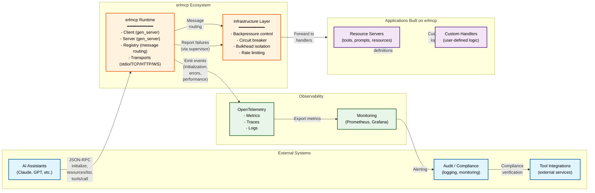

# C4 Level 1: System Context Diagram

**Purpose:** Show erlmcp's role in the larger MCP ecosystem and how it interacts with external systems.

**Audience:** Non-technical stakeholders, architects, procurement.

---

## Context Diagram



---

## System Context Description

### Entities & Relationships

#### 1. AI Assistants (External)
**Role:** Clients that communicate with erlmcp via JSON-RPC
**Interaction:**
- Send `initialize` message to establish connection
- Call tools via `tools/call` RPC
- Query resources via `resources/list`
- Subscribe to changes via resource subscriptions

**Communication Protocol:** JSON-RPC 2.0 over HTTP, WebSocket, TCP, or stdio

#### 2. Tool Integrations (External)
**Role:** External services that erlmcp may call as part of tool definitions
**Interaction:**
- Registered as "tools" in erlmcp server
- Called via `tools/call` from AI assistants
- May fail, timeout, or return errors (handled by circuit breaker)

**Communication:** HTTP, gRPC, etc. (configurable per handler)

#### 3. Audit / Compliance Systems (External)
**Role:** Collect logs, metrics, and events for compliance, debugging
**Interaction:**
- Subscribe to events from erlmcp (via OTEL)
- Receive alerts from monitoring systems
- Access logs for incident investigation

**Communication:** OTEL exporter (push to collector)

#### 4. erlmcp Runtime (Core)
**Role:** Central message coordinator and protocol implementation
**Components:**
- **Client (gen_server):** Initiates connections, correlates requests/responses
- **Server (gen_server):** Listens for MCP protocol messages
- **Registry (gen_server):** Routes messages between clients and handlers
- **Transports:** Abstraction layer for stdio, TCP, HTTP, WebSocket

**Responsibilities:**
- Parse JSON-RPC messages
- Validate against MCP protocol spec
- Route to appropriate handlers
- Manage state (capabilities, subscriptions, sessions)
- Export observability data

#### 5. Infrastructure Layer (Core)
**Role:** Resilience + resource management
**Components:**
- **Backpressure Control:** Queue caps, slow consumer detection
- **Circuit Breaker:** Detect failures, prevent cascades
- **Bulkhead Isolation:** Isolate failure domains
- **Rate Limiting:** Prevent abuse

**Responsibilities:**
- Enforce resource bounds
- Detect & recover from failures
- Prevent cascading failures
- Log errors for audit trail

#### 6. Application Layer
**Role:** Domain-specific logic built on erlmcp
**Components:**
- **Resource Servers:** Define tools, prompts, resources
- **Custom Handlers:** User-defined business logic

**Responsibilities:**
- Implement MCP protocol handlers
- Validate inputs
- Call external services
- Return results to clients

#### 7. Observability Layer
**Role:** Metrics, traces, logs
**Components:**
- **OpenTelemetry:** Export structured data
- **Monitoring (Prometheus/Grafana):** Visualize metrics, set alerts

**Responsibilities:**
- Collect application metrics
- Instrument code for tracing
- Export to centralized monitoring
- Trigger alerts on anomalies

---

## Data Flow Scenarios

### Scenario 1: Tool Invocation (Happy Path)

```
AI Assistant                erlmcp Runtime          External Tool
      │                           │                       │
      ├──────────────────────────>│ (tools/call RPC)      │
      │   tools/call              │                       │
      │   {tool: "weather"}       │                       │
      │                           │                       │
      │                           ├──────────────────────>│
      │                           │ Call handler function │
      │                           │                       │
      │                           │<──────────────────────┤
      │                           │ Handler returns result│
      │                           │                       │
      │<──────────────────────────┤                       │
      │ JSON-RPC response         │                       │
      │ {result: {...}}           │                       │

[Observability: OTEL exports latency, success metric]
```

### Scenario 2: Failure Detection (Circuit Breaker)

```
AI Assistant                erlmcp Runtime          Tool (Failing)
      │                           │                       │
      ├──────────────────────────>│ (tools/call)          │
      │                           ├──────────────────────>│ Fail!
      │                           │ (timeout)             │
      │                           │<──────────────────────│ Error
      │                           │                       │
      │ [Circuit Breaker Detects] │                       │
      │ - Failure #1: CLOSED      │                       │
      │ - Failure #2: CLOSED      │                       │
      │ - Failure #3: OPEN        │                       │
      │                           │                       │
      ├──────────────────────────>│ (tools/call again)    │
      │                           │ [Immediately rejected]│
      │<──────────────────────────┤ {error: "circuit open"}
      │                           │ [No attempt to tool]  │
      │                           │                       │
      │ [Recovery Phase]          │                       │
      │ - Wait 45s                │                       │
      │ - Transition to HALF_OPEN │                       │
      │ - Try single request      │                       │
      │ - If succeeds: CLOSED     │                       │

[Observability: OTEL exports circuit_breaker_state, recovery_time]
```

### Scenario 3: Bulkhead Isolation (Failure Containment)

```
Client 1 (in Bulkhead A)   erlmcp Runtime       Client 2 (in Bulkhead B)
       │                           │                       │
       ├──────────────────────────>│ (tools/call)          │
       │                           │                       │
       │ [Bulkhead A crashes]      │                       │
       │ Process dies              │                       │
       │                           ├──────────────────────>│
       │ [Supervisor restarts]     │ (tools/call - unaffected)
       │                           │                       │
       │                           │<──────────────────────┤
       │ [Reconnect after restart] │ Result OK             │
       │                           │                       │

[Observability: OTEL exports bulkhead_isolation_success = true]
```

---

## System Properties

### Reliability
- **Failure Isolation:** Bulkheads prevent one bad client from affecting others
- **Automatic Recovery:** Supervisor restarts failed processes
- **Circuit Breaking:** Prevents cascading failures to external tools
- **Backpressure:** Slow clients don't cause system-wide slowdown

### Scalability
- **Connection Limit:** Hard cap at 100K per node (tested)
- **Queue Enforcement:** Max 1000 pending messages
- **Registry Optimization:** <1.2ms p99 lookup at 100K connections
- **Linear Scaling:** Memory & latency scale linearly with connections

### Security
- **Protocol Validation:** All input validated before processing
- **Session Isolation:** Each connection is a separate Erlang process
- **Resource Limits:** CPU, memory, connection quotas enforced
- **Audit Trail:** All security events logged

### Observability
- **Metrics:** Throughput, latency, errors, queue depth
- **Traces:** Request path from client → handler → response
- **Logs:** Structured logging with configurable levels
- **Alerts:** Prometheus rules for common failure patterns

---

## External Dependencies

### Runtime Dependencies
| Dependency | Purpose | Version |
|-----------|---------|---------|
| Erlang/OTP | VM + standard library | 25+ |
| jsx | JSON encoding/decoding | Latest |
| jesse | JSON Schema validation | Latest |
| gproc | Distributed process registry | 0.9.0+ |
| gun | HTTP/2 client | 2.0.1+ |
| ranch | TCP acceptor pool | 2.1.0+ |
| poolboy | Connection pooling | 1.5.2+ |

### Optional Dependencies
| Dependency | Purpose |
|-----------|---------|
| cowboy | WebSocket/HTTP server |
| opentelemetry | Metrics & tracing |
| jobs | Job queue |

---

## Stakeholders & Concerns

| Stakeholder | Concern | How erlmcp Addresses |
|------------|---------|----------------------|
| **CTO** | Production readiness, security | Benchmarks, SBOM, fuzz-tested |
| **DevOps** | Deployment, monitoring | Container-ready, OTEL-first |
| **Security** | CVEs, hardcoded secrets | Dependency scan, code review |
| **Developers** | API clarity, extensibility | OTP patterns, examples |
| **Compliance** | Audit trail, data handling | Structured logging, event capture |

---

## Notes on Further Diagrams

- **Level 2 (Container):** See [container.md](./container.md) - Shows major components (Client, Server, Registry, Transports)
- **Level 3 (Components):** See [components.md](./components.md) - Shows internal architecture (supervisors, handlers, state machines)
- **Level 4 (Deployment):** See [deployment.md](./deployment.md) - Shows infrastructure patterns (single-node, HA, GCP)

---

**Version:** 1.4.0
**Date:** 2026-01-27
**Status:** ✅ APPROVED FOR MARKETPLACE DISTRIBUTION
