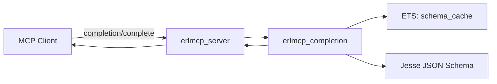
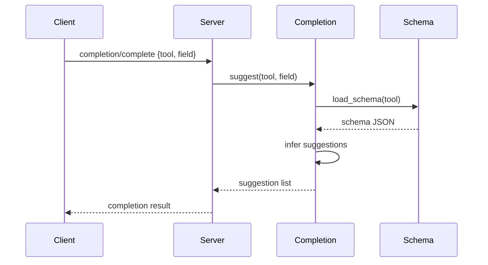

# Feature Diagram: Completion / Autocomplete API

```mermaid
graph LR
    client[MCP Client]
    server[erlmcp_server]
    completionMod[erlmcp_completion]
    schemaCache[ETS: schema_cache]
    jesse[Jesse JSON Schema]

    client -->|completion/complete| server
    server --> completionMod
    completionMod --> schemaCache
    completionMod --> jesse
    completionMod --> server --> client
```

```mermaid
sequenceDiagram
    participant Client
    participant Server
    participant Completion
    participant Schema

    Client->>Server: completion/complete {tool, field}
    Server->>Completion: suggest(tool, field)
    Completion->>Schema: load_schema(tool)
    Schema-->>Completion: schema JSON
    Completion->>Completion: infer suggestions
    Completion-->>Server: suggestion list
    Server-->>Client: completion result
```
