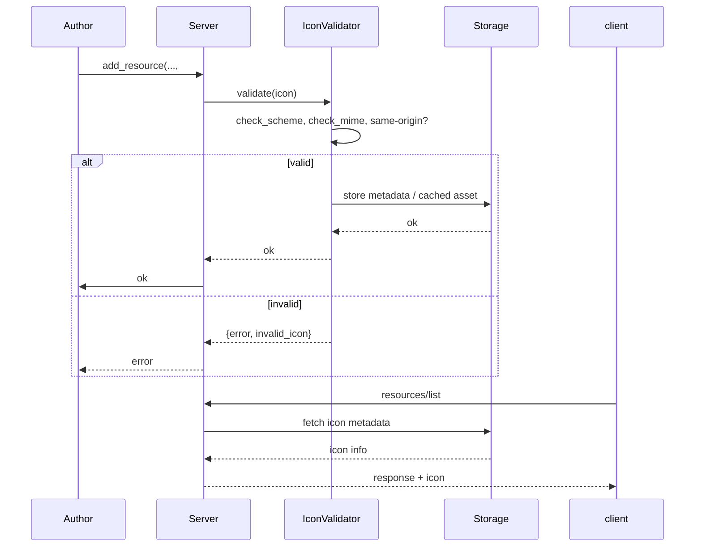

# Feature Diagram: Icon Metadata & Validation

```mermaid
graph TB
    addResource[erlmcp_server:add_resource]
    iconValidator[erlmcp_icon_validator]
    iconStore[Icon Storage (ETS / priv/icons)]
    responseBuilder[JSON-RPC Responses]

    addResource --> iconValidator
    iconValidator --> iconStore
    addResource --> resourceTable[Resource Registry]
    responseBuilder --> iconValidator
```


