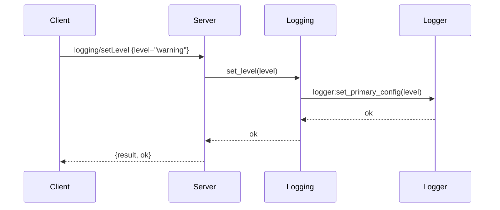

# Feature Diagram: Logging Control (`logging/setLevel`)

```mermaid
flowchart LR
    client[MCP Client]
    server[erlmcp_server]
    loggingMod[erlmcp_logging]
    logger[OTP logger / lager]

    client -->|logging/setLevel| server
    server --> loggingMod --> logger
    logger --> telem[Telemetry (OpenTelemetry)]
```


