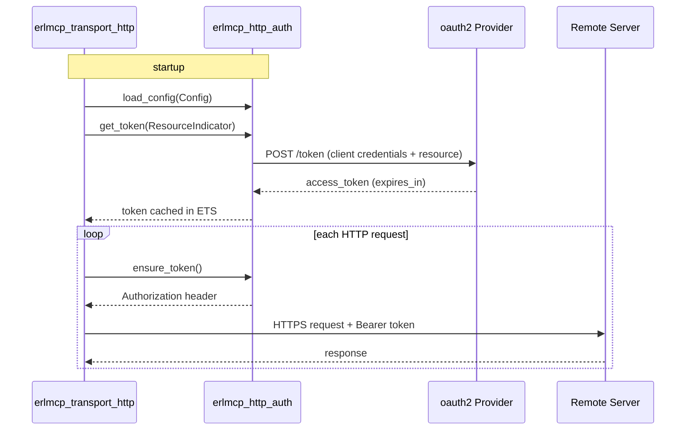
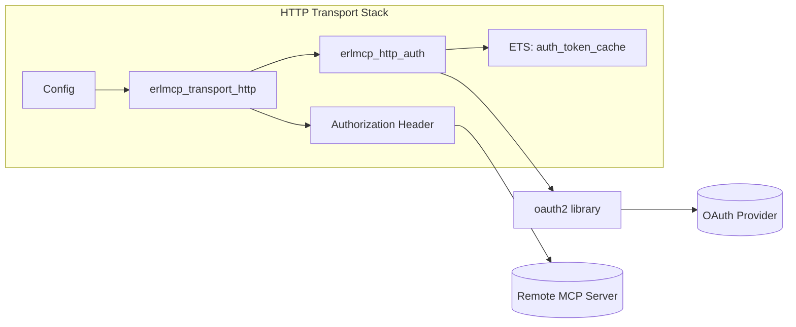

# Feature Diagram: OAuth 2.0 + Resource Indicators

```mermaid
sequenceDiagram
    participant Transport as erlmcp_transport_http
    participant Auth as erlmcp_http_auth
    participant OAuth as oauth2 Provider

    Note over Transport,Auth: startup
    Transport->>Auth: load_config(Config)
    Transport->>Auth: get_token(ResourceIndicator)
    Auth->>OAuth: POST /token (client credentials + resource)
    OAuth-->>Auth: access_token (expires_in)
    Auth-->>Transport: token cached in ETS

    loop each HTTP request
        Transport->>Auth: ensure_token()
        Auth-->>Transport: Authorization header
        Transport->>Remote Server: HTTPS request + Bearer token
        Remote Server-->>Transport: response
    end
```

```mermaid
graph LR
    subgraph HTTP Transport Stack
        config[Config]
        http_transport[erlmcp_transport_http]
        header_builder[Authorization Header]
        auth_mod[erlmcp_http_auth]
        cache[ETS: auth_token_cache]
    end

    config --> http_transport
    http_transport --> auth_mod
    auth_mod --> cache
    auth_mod --> oauth2lib[oauth2 library]
    oauth2lib --> provider[(OAuth Provider)]
    http_transport --> header_builder --> remote[(Remote MCP Server)]
```
