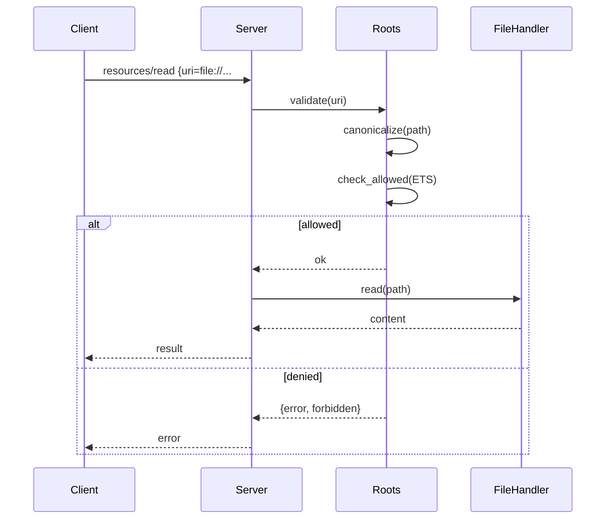

# Feature Diagram: Roots Enforcement

```mermaid
flowchart TB
    client[MCP Client]
    server[erlmcp_server]
    rootsMod[erlmcp_roots]
    etsRoots[ETS: roots_table]
    fsOps[Resource Handler (files)]

    client -->|resources/read| server
    server --> rootsMod
    rootsMod --> etsRoots
    rootsMod -->|validate_path| fsOps
    fsOps --> server --> client

    subgraph Roots Management
        adminOps[Work orders / config]
        adminOps --> rootsMod
        rootsMod --> watchers[fs watchers]
    end
```


