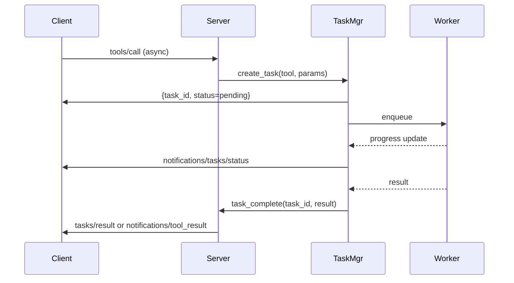

# Feature Diagram: MCP Tasks Integration

```mermaid
graph TB
    server[erlmcp_server]
    taskmgr[erlmcp_task_manager]
    queue[jobs queue]
    ets[ETS: task_state]
    registry[erlmcp_registry]
    client[MCP Client]

    client -->|tasks/create (tool call)| server
    server --> taskmgr
    taskmgr --> queue
    queue --> workers[Task Workers]
    workers --> ets
    ets --> taskmgr
    taskmgr --> registry
    registry --> client

    client -->|tasks/get/result/cancel| server
    server --> taskmgr
```


