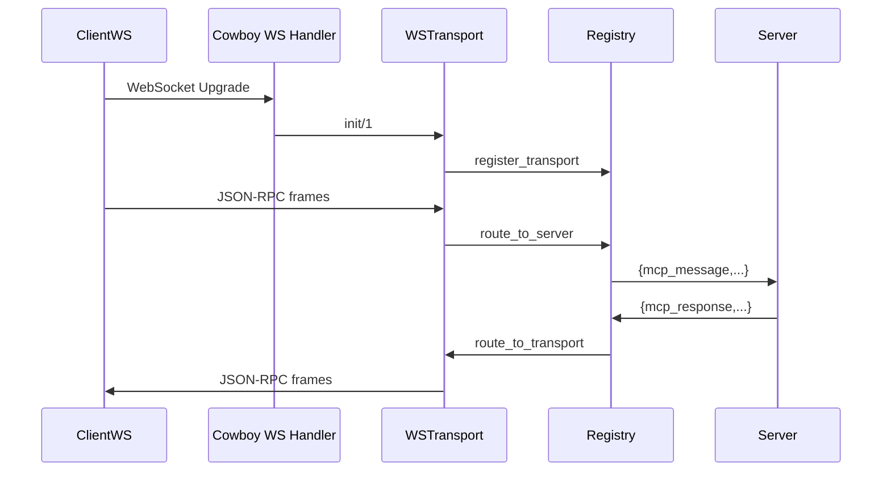

# Feature Diagram: WebSocket & SSE Transports

```mermaid
graph LR
    subgraph Server Side (Cowboy)
        ws_listener[Cowboy WebSocket Listener]
        sse_listener[Cowboy SSE Handler]
        ws_transport[erlmcp_transport_ws]
        sse_transport[erlmcp_transport_sse]
    end

    subgraph Client Side
        gun_client[gun WebSocket Client]
        http_sse_client[HTTP SSE Client]
    end

    ws_listener --> ws_transport
    sse_listener --> sse_transport
    ws_transport --> registry[erlmcp_registry]
    sse_transport --> registry
    registry --> erlmcp_server

    gun_client --> ws_listener
    http_sse_client --> sse_listener
```


