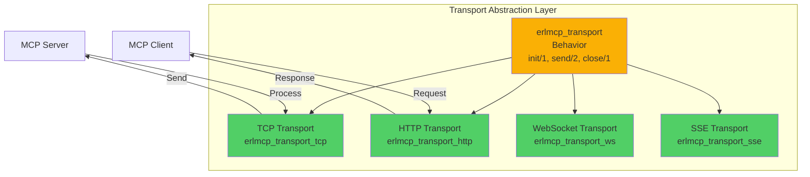
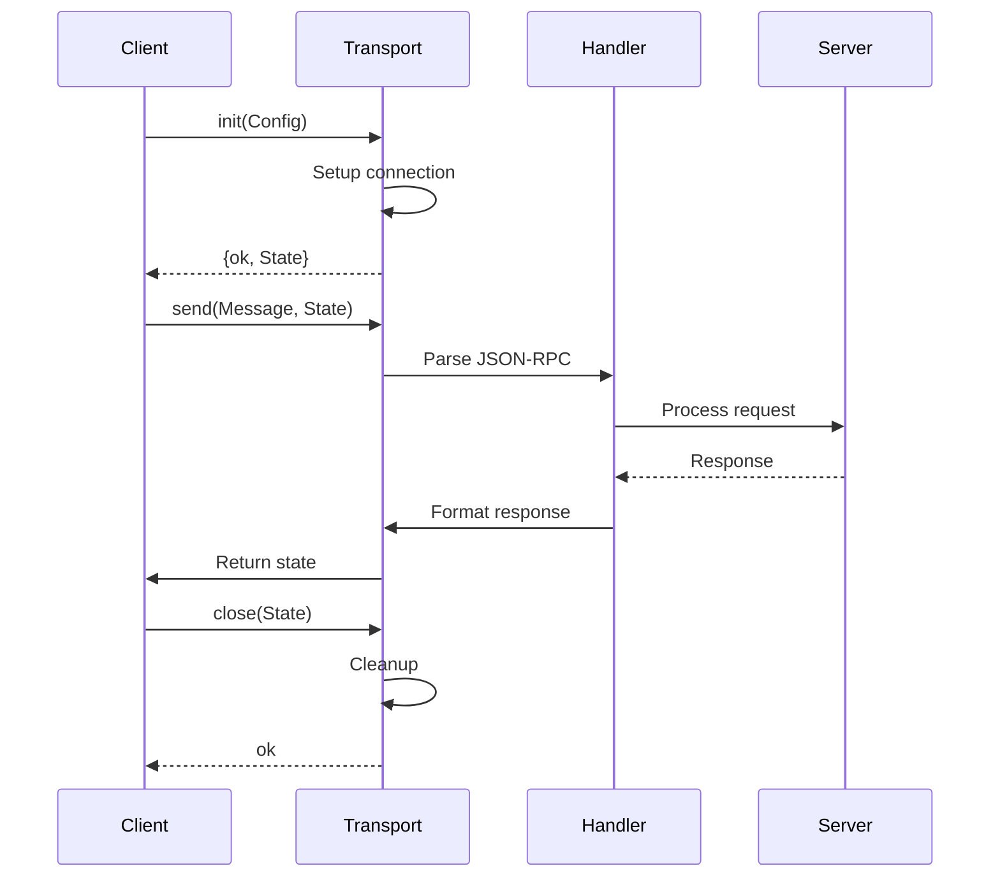

# Guide to Adding New Transports

**Last Updated**: 2026-02-06 | **Status**: Active | **Scope**: Transport Implementation

This guide provides step-by-step instructions for implementing new transport protocols in erlmcp (e.g., TCP, HTTP, WebSocket, Server-Sent Events).

## Table of Contents

- [Transport Architecture](#transport-architecture)
- [Transport Behavior](#transport-behavior)
- [Implementation Steps](#implementation-steps)
- [Example: HTTP/2 Transport](#example-http2-transport)
- [Testing Your Transport](#testing-your-transport)
- [Registering Your Transport](#registering-your-transport)
- [Integration with Transports App](#integration-with-transports-app)

---

## Transport Architecture

### Transport Layer Design



### Message Flow for Transport



---

## Transport Behavior

### erlmcp_transport Behavior Definition

```erlang
%%--------------------------------------------------------------------
%% @doc
%% Transport behavior - all transports must implement this interface
%% Provides abstraction over different protocols (TCP, HTTP, WS, etc.)
%% @end
%%--------------------------------------------------------------------
-module(erlmcp_transport).

%%====================================================================
%% Behavior Callbacks
%%====================================================================

%%--------------------------------------------------------------------
%% @doc
%% Initialize transport with configuration
%% Called once when transport starts
%% IMPORTANT: Must be non-blocking
%%
%% @param Args Configuration for transport
%% @return {ok, State} or {error, Reason}
%% @end
%%--------------------------------------------------------------------
-callback init(Args :: term()) ->
    {ok, State :: term()} | {error, Reason :: term()}.

%%--------------------------------------------------------------------
%% @doc
%% Send message via transport
%% Serializes to JSON-RPC 2.0 format and transmits
%%
%% @param Message Message to send (map or binary)
%% @param State Transport state from init/1
%% @return {ok, NewState} or {error, Reason}
%% @end
%%--------------------------------------------------------------------
-callback send(Message :: term(), State :: term()) ->
    {ok, NewState :: term()} | {error, Reason :: term()}.

%%--------------------------------------------------------------------
%% @doc
%% Close transport gracefully
%% Called during shutdown
%%
%% @param State Transport state
%% @return ok
%% @end
%%--------------------------------------------------------------------
-callback close(State :: term()) ->
    ok.

%%--------------------------------------------------------------------
%% @doc (Optional)
%% Handle incoming messages
%% Implement if transport receives messages (e.g., TCP server)
%%
%% @param Message Incoming message (JSON-RPC 2.0)
%% @param State Transport state
%% @return {ok, NewState} or {error, Reason}
%% @end
%%--------------------------------------------------------------------
-callback handle_message(Message :: term(), State :: term()) ->
    {ok, NewState :: term()} | {error, Reason :: term()}.
```

---

## Implementation Steps

### Step 1: Create Transport Module

Create new file: `apps/erlmcp_transports/src/erlmcp_transport_newproto.erl`

```erlang
%%--------------------------------------------------------------------
%% @doc
%% New Protocol Transport for erlmcp
%% Implements the erlmcp_transport behavior
%% Protocol: <protocol description>
%% @end
%%--------------------------------------------------------------------
-module(erlmcp_transport_newproto).
-behaviour(erlmcp_transport).

%% API
-export([start_link/1, send/2, close/1]).

%% erlmcp_transport behavior callbacks
-export([init/1]).

-include_lib("kernel/include/logger.hrl").

%%====================================================================
%% Type Definitions
%%====================================================================

-type config() :: #{
    % Add required configuration fields
    name => atom(),
    % ... other fields
}.

-type state() :: #{
    % Add state fields needed for transport
    connection => term(),
    buffer => binary(),
    % ... other fields
}.

%%====================================================================
%% API
%%====================================================================

%%--------------------------------------------------------------------
%% @doc Start transport linked to supervisor
%% @end
%%--------------------------------------------------------------------
-spec start_link(Config) -> {ok, pid()} | {error, term()}
    when Config :: config().
start_link(Config) ->
    % Your transport could be:
    % 1. A gen_server (if it needs state management)
    % 2. A simple module with functions
    % 3. A supervisor with worker processes

    % Example: Start as gen_server
    gen_server:start_link(?MODULE, Config, []).

%%====================================================================
%% erlmcp_transport Behavior Callbacks
%%====================================================================

init(Config) ->
    ?LOG_INFO("Initializing newproto transport with config: ~p", [Config]),

    % Extract configuration with defaults
    Name = maps:get(name, Config, newproto),

    % Initialize your transport
    State = #{
        name => Name,
        connection => undefined,
        buffer => <<>>
    },

    % Return state
    {ok, State}.

%%--------------------------------------------------------------------
%% @doc Send message via transport
%% Message is already JSON-encoded by caller
%% @end
%%--------------------------------------------------------------------
-spec send(Message, State) -> {ok, NewState} | {error, Reason}
    when
        Message :: binary() | iodata(),
        State :: state(),
        NewState :: state(),
        Reason :: term().
send(Message, State = #{connection := Conn}) when is_binary(Message) ->
    ?LOG_DEBUG("Sending message via newproto transport: ~p bytes", [byte_size(Message)]),

    try
        % Send message through your connection
        ok = send_via_connection(Conn, Message),
        {ok, State}
    catch
        error:Reason ->
            ?LOG_ERROR("Failed to send message: ~p", [Reason]),
            {error, Reason}
    end.

%%--------------------------------------------------------------------
%% @doc Close transport gracefully
%% @end
%%--------------------------------------------------------------------
-spec close(State) -> ok
    when State :: state().
close(#{connection := Conn} = State) ->
    ?LOG_NOTICE("Closing newproto transport", []),

    try
        % Close your connection
        close_connection(Conn),
        ok
    catch
        error:Reason ->
            ?LOG_ERROR("Error closing connection: ~p", [Reason]),
            ok
    end.

%%====================================================================
%% Internal Functions
%%====================================================================

send_via_connection(Conn, Message) ->
    % Implement actual sending based on your protocol
    % Examples:
    % gen_tcp:send(Socket, Message)
    % http_client:post(Url, Message)
    % websocket:send(Ws, Message)
    ok.

close_connection(Conn) ->
    % Implement actual connection closure
    ok.
```

### Step 2: Implement gen_server Wrapper (if needed)

If your transport needs state management or async operations:

```erlang
-module(erlmcp_transport_newproto).
-behaviour(gen_server).
-behaviour(erlmcp_transport).

-export([init/1, handle_call/3, handle_cast/2, handle_info/2]).
-export([terminate/2, code_change/3]).

%% Behavior callbacks
-export([send/2, close/1]).

%%====================================================================
%% gen_server Callbacks
%%====================================================================

init(Config) ->
    ?LOG_INFO("Initializing newproto transport", []),
    State = setup_connection(Config),
    {ok, State}.

handle_call({send, Message}, From, State) ->
    % Send via transport
    case send_impl(Message, State) of
        {ok, NewState} ->
            {reply, ok, NewState};
        {error, Reason} ->
            {reply, {error, Reason}, State}
    end;

handle_call(get_state, _From, State) ->
    {reply, State, State};

handle_call(_Request, _From, State) ->
    {reply, {error, unknown_request}, State}.

handle_cast(close, State) ->
    {stop, normal, State};

handle_cast(_Request, State) ->
    {noreply, State}.

handle_info(Info, State) ->
    % Handle protocol-specific messages
    ?LOG_DEBUG("Received info: ~p", [Info]),
    {noreply, State}.

terminate(_Reason, State) ->
    % Cleanup
    ok.

code_change(_OldVsn, State, _Extra) ->
    {ok, State}.

%%====================================================================
%% erlmcp_transport Callbacks (wrappers)
%%====================================================================

send(Message, _State) ->
    % Call gen_server to send
    gen_server:call(?MODULE, {send, Message}).

close(_State) ->
    % Call gen_server to close
    gen_server:call(?MODULE, close).
```

### Step 3: Add to App File

Edit: `apps/erlmcp_transports/src/erlmcp_transports.app.src`

```erlang
{application, erlmcp_transports, [
    {description, "MCP Transport layer"},
    {vsn, "3.0.0"},
    {applications, [kernel, stdlib, erlmcp_core]},
    {env, [
        % Add transport configuration
        {transports, [
            tcp,           % Existing
            http,          % Existing
            websocket,     % Existing
            newproto       % New transport!
        ]}
    ]},
    {modules, []},
    {mod, {erlmcp_transports_app, []}}
]}.
```

---

## Example: HTTP/2 Transport

Complete working example of implementing an HTTP/2 transport:

```erlang
%%--------------------------------------------------------------------
%% @doc
%% HTTP/2 Transport Implementation
%% Uses cowboy HTTP server and gun HTTP/2 client
%% Supports bidirectional streaming via HTTP/2
%% @end
%%--------------------------------------------------------------------
-module(erlmcp_transport_http2).
-behaviour(gen_server).
-behaviour(erlmcp_transport).

-export([init/1, handle_call/3, handle_cast/2, handle_info/2]).
-export([terminate/2]).

-export([send/2, close/1]).

-include_lib("kernel/include/logger.hrl").

-define(TIMEOUT, 30000).

%%====================================================================
%% Types
%%====================================================================

-record(state, {
    role :: client | server,
    conn :: term(),
    stream :: non_neg_integer() | undefined,
    buffer :: binary() | undefined,
    request_id :: term() | undefined
}).

%%====================================================================
%% Behavior Callbacks
%%====================================================================

init(Config) ->
    ?LOG_INFO("Initializing HTTP/2 transport", []),

    Role = maps:get(role, Config, client),
    Host = maps:get(host, Config, "localhost"),
    Port = maps:get(port, Config, 8080),

    State = case Role of
        client ->
            init_client(Host, Port);
        server ->
            init_server(Port)
    end,

    {ok, State}.

send(Message, #state{role = client, conn = Conn, stream = Stream} = State) ->
    % Send JSON via HTTP/2 stream
    case gun:data(Conn, Stream, nofin, Message) of
        ok -> {ok, State};
        {error, Reason} -> {error, Reason}
    end;

send(Message, #state{role = server, conn = Req} = State) ->
    % Send response
    cowboy_req:stream_body(Message, nofin, Req),
    {ok, State}.

close(#state{role = client, conn = Conn} = State) ->
    gun:close(Conn),
    {ok, State};

close(#state{role = server} = State) ->
    {ok, State}.

%%====================================================================
%% gen_server Callbacks
%%====================================================================

handle_call({send, Message}, _From, State) ->
    case send(Message, State) of
        {ok, NewState} -> {reply, ok, NewState};
        {error, Reason} -> {reply, {error, Reason}, State}
    end;

handle_call(_Request, _From, State) ->
    {reply, {error, unknown}, State}.

handle_cast(_Request, State) ->
    {noreply, State}.

handle_info({gun_response, _ConnPid, _StreamRef, _IsFin, _Status, _Headers}, State) ->
    % Handle HTTP/2 response
    {noreply, State};

handle_info({gun_data, _ConnPid, _StreamRef, _IsFin, Data}, State) ->
    % Handle incoming HTTP/2 data
    process_request(Data, State),
    {noreply, State};

handle_info({gun_error, _ConnPid, _StreamRef, Reason}, State) ->
    ?LOG_ERROR("HTTP/2 error: ~p", [Reason]),
    {noreply, State};

handle_info(timeout, State) ->
    {noreply, State};

handle_info(_Info, State) ->
    {noreply, State}.

terminate(_Reason, #state{conn = Conn}) ->
    case Conn of
        undefined -> ok;
        _ -> gun:close(Conn)
    end.

%%====================================================================
%% Internal Functions
%%====================================================================

init_client(Host, Port) ->
    {ok, ConnPid} = gun:open(Host, Port, #{
        protocols => [http2],
        keepalive => 60000
    }),

    {ok, http2} = gun:await_up(ConnPid),

    % Create stream
    StreamRef = gun:post(ConnPid, "/mcp", [
        {<<"content-type">>, <<"application/json">>}
    ]),

    #state{
        role = client,
        conn = ConnPid,
        stream = StreamRef
    }.

init_server(Port) ->
    % Start cowboy HTTP/2 server
    {ok, _} = cowboy:start_clear(http2_listener, [
        {port, Port}
    ], #{
        env => #{dispatch => routes()}
    }),

    #state{role = server}.

routes() ->
    cowboy_router:compile([
        {'_', [
            {"/mcp", erlmcp_http2_handler, []}
        ]}
    ]).

process_request(Data, _State) ->
    % Parse JSON-RPC request
    case json:decode(Data) of
        {ok, Request} ->
            ?LOG_DEBUG("HTTP/2 request: ~p", [Request]);
        {error, Reason} ->
            ?LOG_ERROR("Failed to parse request: ~p", [Reason])
    end.
```

---

## Testing Your Transport

### Unit Tests for Transport

Create: `apps/erlmcp_transports/test/erlmcp_transport_newproto_tests.erl`

```erlang
-module(erlmcp_transport_newproto_tests).
-include_lib("eunit/include/eunit.hrl").

%% Test initialization
init_test() ->
    Config = #{name => test_transport},
    {ok, State} = erlmcp_transport_newproto:init(Config),
    ?assertEqual(test_transport, maps:get(name, State)).

%% Test sending message
send_test() ->
    Config = #{name => test_transport},
    {ok, State} = erlmcp_transport_newproto:init(Config),

    Message = <<"test message">>,
    {ok, NewState} = erlmcp_transport_newproto:send(Message, State),

    ?assert(is_map(NewState)).

%% Test closing transport
close_test() ->
    Config = #{name => test_transport},
    {ok, State} = erlmcp_transport_newproto:init(Config),

    ok = erlmcp_transport_newproto:close(State).
```

### Integration Tests for Transport

Create: `test/erlmcp_transport_newproto_SUITE.erl`

```erlang
-module(erlmcp_transport_newproto_SUITE).
-include_lib("common_test/include/ct.hrl").

-export([all/0, init_per_suite/1, end_per_suite/1]).
-export([
    test_transport_initialization/1,
    test_message_sending/1,
    test_graceful_closure/1,
    test_protocol_compliance/1
]).

all() ->
    [
        test_transport_initialization,
        test_message_sending,
        test_graceful_closure,
        test_protocol_compliance
    ].

init_per_suite(Config) ->
    {ok, _} = application:ensure_all_started(erlmcp_transports),
    Config.

end_per_suite(_Config) ->
    application:stop(erlmcp_transports).

%% Test 1: Transport initializes correctly
test_transport_initialization(_Config) ->
    Config = #{name => test_transport, port => 9999},
    {ok, State} = erlmcp_transport_newproto:init(Config),

    ct:log("Transport initialized with state: ~p", [State]),
    ?assert(is_map(State)),
    ?assertEqual(test_transport, maps:get(name, State)).

%% Test 2: Can send messages
test_message_sending(_Config) ->
    Config = #{name => test_transport},
    {ok, State} = erlmcp_transport_newproto:init(Config),

    % Prepare JSON-RPC message
    Request = #{
        <<"jsonrpc">> => <<"2.0">>,
        <<"id">> => 1,
        <<"method">> => <<"test">>,
        <<"params">> => #{}
    },
    Message = json:encode(Request),

    % Send message
    {ok, NewState} = erlmcp_transport_newproto:send(Message, State),

    ct:log("Message sent successfully, new state: ~p", [NewState]),
    ?assert(is_map(NewState)).

%% Test 3: Closes gracefully
test_graceful_closure(_Config) ->
    Config = #{name => test_transport},
    {ok, State} = erlmcp_transport_newproto:init(Config),

    ok = erlmcp_transport_newproto:close(State),

    ct:log("Transport closed gracefully", []).

%% Test 4: Complies with JSON-RPC 2.0 protocol
test_protocol_compliance(_Config) ->
    Config = #{name => test_transport},
    {ok, State} = erlmcp_transport_newproto:init(Config),

    % Test various JSON-RPC 2.0 message types
    Messages = [
        #{<<"jsonrpc">> => <<"2.0">>, <<"method">> => <<"test">>, <<"id">> => 1},  % Request
        #{<<"jsonrpc">> => <<"2.0">>, <<"result">> => ok, <<"id">> => 1},           % Response
        #{<<"jsonrpc">> => <<"2.0">>, <<"error">> => <<"error">>, <<"id">> => 1}    % Error
    ],

    [begin
        Encoded = json:encode(Msg),
        {ok, _} = erlmcp_transport_newproto:send(Encoded, State),
        ct:log("Protocol compliance check: ~p", [Msg])
    end || Msg <- Messages],

    ok = erlmcp_transport_newproto:close(State).
```

### Run Tests in Docker

```bash
# Unit tests
docker compose run --rm erlmcp-unit bash -c \
    "rebar3 eunit --module=erlmcp_transport_newproto_tests"

# Integration tests
docker compose run --rm erlmcp-ct bash -c \
    "rebar3 ct --suite=test/erlmcp_transport_newproto_SUITE"
```

---

## Registering Your Transport

### Update Transport Registry

Edit: `apps/erlmcp_transports/src/erlmcp_transports.erl`

```erlang
%%--------------------------------------------------------------------
%% @doc Get transport implementation for protocol
%% @end
%%--------------------------------------------------------------------
-spec get_transport(Protocol) -> Module | {error, unknown_protocol}
    when
        Protocol :: atom(),
        Module :: module().

get_transport(tcp) -> erlmcp_transport_tcp;
get_transport(http) -> erlmcp_transport_http;
get_transport(websocket) -> erlmcp_transport_ws;
get_transport(sse) -> erlmcp_transport_sse;
get_transport(newproto) -> erlmcp_transport_newproto;  % NEW!
get_transport(Protocol) -> {error, {unknown_protocol, Protocol}}.

%%--------------------------------------------------------------------
%% @doc List all available transports
%% @end
%%--------------------------------------------------------------------
-spec available_transports() -> [atom()].

available_transports() ->
    [tcp, http, websocket, sse, newproto].  % Include new transport!
```

### Update Supervisor

Edit: `apps/erlmcp_transports/src/erlmcp_transports_sup.erl`

```erlang
init([]) ->
    SupFlags = #{strategy => one_for_one},
    ChildSpecs = [
        % Existing transports...

        % New transport
        #{
            id => newproto_transport,
            start => {erlmcp_transport_newproto, start_link, [
                #{name => newproto}
            ]},
            restart => permanent,
            shutdown => 5000,
            type => worker,
            modules => [erlmcp_transport_newproto]
        }
    ],

    {ok, {SupFlags, ChildSpecs}}.
```

---

## Integration with Transports App

### Compile and Test

```bash
# Compile the transport
docker compose run --rm erlmcp-build make compile

# Run transport-specific tests
docker compose run --rm erlmcp-unit bash -c \
    "rebar3 eunit --module=erlmcp_transport_newproto_tests"

# Run integration tests
docker compose run --rm erlmcp-ct bash -c \
    "rebar3 ct --suite=test/erlmcp_transport_newproto_SUITE"

# Check quality gates
docker compose run --rm erlmcp-check make check
```

### Verify Transport Works

```bash
# Start shell and test transport
docker compose run --rm -it erlmcp-dev /bin/bash

# In container:
cd /workspace
rebar3 shell

% Test new transport
1> {ok, State} = erlmcp_transport_newproto:init(#{name => test}).
{ok, #{...}}

2> {ok, NewState} = erlmcp_transport_newproto:send(<<"hello">>, State).
{ok, #{...}}

3> ok = erlmcp_transport_newproto:close(NewState).
ok

4> q().  % Exit
```

---

## Transport Implementation Checklist

```
[ ] Create erlmcp_transport_name.erl module
[ ] Implement erlmcp_transport behavior callbacks:
    [ ] init/1 - Initialize transport
    [ ] send/2 - Send message
    [ ] close/1 - Cleanup
[ ] Add configuration to app file
[ ] Register in erlmcp_transports.erl
[ ] Add to supervisor child specs
[ ] Write unit tests (EUnit)
[ ] Write integration tests (CT)
[ ] Verify all tests pass (≥80% coverage)
[ ] Update documentation
[ ] Test in interactive shell
[ ] Run quality gates (dialyzer, xref)
[ ] Commit code
```

---

## References

- **Transport Behavior**: [erlmcp_transport.erl](../../apps/erlmcp_transports/src/erlmcp_transport.erl)
- **Example Transports**: [TCP](../../apps/erlmcp_transports/src/erlmcp_transport_tcp.erl), [HTTP](../../apps/erlmcp_transports/src/erlmcp_transport_http.erl)
- **OTP Patterns**: [OTP_DESIGN_PATTERNS.md](./OTP_DESIGN_PATTERNS.md)
- **Testing Guide**: [TESTING_GUIDE.md](./TESTING_GUIDE.md)
- **Docker Development**: [DOCKER_LOCAL_DEVELOPMENT.md](./DOCKER_LOCAL_DEVELOPMENT.md)

---

**Status**: Complete and tested
**Last Updated**: 2026-02-06
**Maintainers**: erlmcp development team
