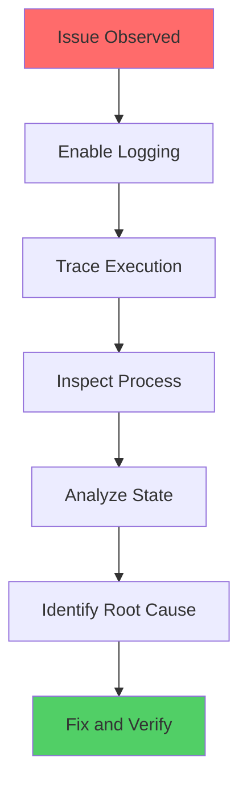
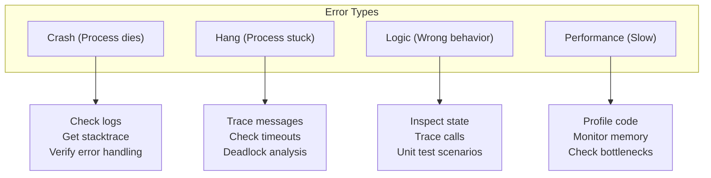
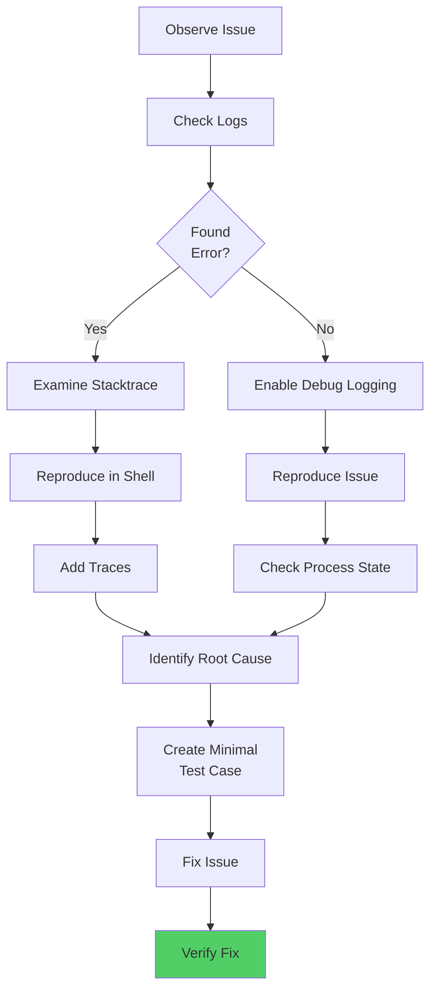

# Debugging Guide for erlmcp

**Last Updated**: 2026-02-06 | **Status**: Active | **Scope**: Development Debugging Techniques

This guide covers debugging techniques, tools, and strategies for erlmcp development. All debugging runs via Docker per the DOCKER-ONLY CONSTITUTION.

## Table of Contents

- [Debugging Philosophy](#debugging-philosophy)
- [Interactive Debugging in Docker](#interactive-debugging-in-docker)
- [Logging and Tracing](#logging-and-tracing)
- [Process Inspection](#process-inspection)
- [Common Issues and Solutions](#common-issues-and-solutions)
- [Visual Debugging Tools](#visual-debugging-tools)
- [Performance Profiling](#performance-profiling)

---

## Debugging Philosophy

### Erlang Debugging Principles



### Error Categories



---

## Interactive Debugging in Docker

### Starting Interactive Development Environment

```bash
# Start Docker development shell
docker compose run --rm -it erlmcp-dev /bin/bash

# Inside container, compile and start Erlang shell
cd /workspace
rebar3 shell
```

### Erlang Shell Debugging Commands

```erlang
%% Start the shell (from Docker)
% $ rebar3 shell

%% Get process information
1> pid(0, 123, 0).  % Create PID from components
<0.123.0>

2> erlang:process_info(Pid).  % Get full info about process
[
  {registered_name, my_server},
  {current_function, {my_module, loop, 1}},
  {ancestors, [my_sup, erlmcp_app]},
  {message_queue_len, 2},
  {links, [<0.100.0>]},
  {monitors, []},
  {monitored_by, [<0.150.0>]},
  {status, waiting},
  {reductions, 1024},
  {trap_exit, true},
  {priority, normal},
  {dictionary, []}
]

3> erlang:processes().  % List all processes
[<0.0.0>, <0.1.0>, <0.2.0>, ...]

4> erlang:process_info(self(), current_function).  % Current function
{current_function,{erl_eval,expr,3}}

%% Trace and debugging
5> erlang:trace(all, true, [send, 'receive']).  % Trace all messages
6> erlang:trace(Pid, true, [call, return_to]).  % Trace specific process calls

7> dbg:tracer().  % Start tracer
8> dbg:p(all, c).  % Trace all calls

%% Check message queue
9> erlang:process_info(Pid, message_queue_len).
{message_queue_len, 3}

10> flush().  % Flush pending messages
Shell got {'EXIT',<0.123.0>,reason}
...
ok

%% Monitor process
11> erlang:monitor(process, Pid).  % Get DOWN message on exit

%% Get process statistics
12> erlang:statistics(runtime).
{24523, 1234}  % {Total ms, ms since last call}

13> erlang:statistics(reductions).
{1024000, 5000}  % {Total reductions, since last call}
```

### Debugging gen_server in Interactive Shell

```erlang
%% Start server from shell
1> {ok, Pid} = my_module_server:start_link().
{ok,<0.123.0>}

%% Send request and see what happens
2> my_module_server:request(Pid, {action, arg}).
ok

%% Check server state
3> sys:get_state(Pid).
#state{
    data = [...],
    status = running,
    ...
}

%% Get statistics about server
4> sys:statistics(Pid, get).
[{casts, 0}, {calls, 5}, {messages, 0}]

%% Trace server calls
5> sys:trace(Pid, true).
System call to my_module_server:handle_call({action, arg}, ...) ...

%% Install custom trace function
6> sys:install(Pid, fun trace_fun/3).

%% Stop tracing
7> sys:no_trace(Pid).

%% Suspend/resume server
8> sys:suspend(Pid).  % Server stops handling messages
9> sys:resume(Pid).   % Server continues
```

### Interactive Debugging Workflow

```bash
# 1. Start Docker container with shell
docker compose run --rm -it erlmcp-dev /bin/bash

# 2. In container:
cd /workspace
rebar3 shell

# 3. In Erlang shell, interact with system:
%% Load test module
> c(test_module).
{ok, test_module}

%% Start supervisor
> supervisor:start_link(my_sup, []).
{ok, <0.100.0>}

%% Check what was started
> supervisor:which_children(<0.100.0>).
[{my_server, <0.101.0>, worker, [my_module_server]}]

%% Send message to server
> my_module_server:send_request(<0.101.0>, {test, data}).
ok

%% Check process info
> erlang:process_info(<0.101.0>).
[{registered_name,my_server}, ...]

%% Enable call tracing
> trace_calls(my_module_server).

%% Try operation that fails
> my_module_server:send_request(<0.101.0>, {bad, input}).

% Check trace output to see what happened
```

---

## Logging and Tracing

### Erlang Logger Configuration

```erlang
%% In your module
-include_lib("kernel/include/logger.hrl").

%% Logging at different levels
?LOG_NOTICE("Application started: ~p", [AppName]).
?LOG_INFO("Request received: ~p", [Request]).
?LOG_WARNING("Deprecated function used: ~p", [Function]).
?LOG_ERROR("Failed to process: ~p", [Error]).

%% Log with metadata
?LOG_ERROR("Request failed",
    #{request_id => ReqId, error => Error, user => User}).
```

### Setting Log Level in Docker

```bash
# Start with debug logging (verbose)
docker compose run --rm -it \
    -e ERLMCP_LOG_LEVEL=debug \
    erlmcp-dev \
    /bin/bash

# In Erlang shell
1> logger:set_primary_config(level, debug).

# Check current log level
2> logger:get_primary_config().
#{
    level => debug,
    ...
}
```

### Runtime Tracing in Docker

```bash
# Start container and open Erlang shell
docker compose run --rm -it erlmcp-dev /bin/bash

# In container:
cd /workspace
rebar3 shell

# In shell, start tracer for function calls
1> dbg:tracer().
{ok,<0.100.0>}

2> dbg:tpl(my_module, '_', []).  % Trace all calls in my_module
{ok,[{matched,erlang,1}]}

3> dbg:p(all, c).  % Trace all process calls
{ok,[all]}

% Now run code that calls my_module functions
% You'll see trace output for every call:
% (<0.123.0>) call my_module:function(arg)
% (<0.123.0>) returned from my_module:function/1 => result

4> dbg:stop_clear().  % Stop tracing
ok
```

### Message Tracing

```erlang
%% In Erlang shell
1> erlang:trace(all, true, [send, 'receive']).
{ok, ...}

% Now watch all messages between processes:
% (<0.100.0>) <-- {request, data}
% (<0.100.0>) --> {response, ok}

2> erlang:trace(SpecificPid, true, [send, 'receive']).
{ok, ...}

3> erlang:trace(all, false, [send, 'receive']).  % Stop tracing
{ok, ...}
```

### Comprehensive Logging Example

```erlang
-module(my_server).
-behaviour(gen_server).

-include_lib("kernel/include/logger.hrl").

-export([start_link/0, handle_call/3, handle_cast/2, handle_info/2]).

%%====================================================================
%% API
%%====================================================================

start_link() ->
    ?LOG_NOTICE("Starting my_server", []),
    gen_server:start_link({local, ?MODULE}, ?MODULE, [], []).

%%====================================================================
%% gen_server callbacks
%%====================================================================

init([]) ->
    ?LOG_INFO("Initializing my_server", []),
    State = #{queue => []},
    {ok, State}.

handle_call({request, Data}, From, State) ->
    ?LOG_DEBUG("Handling request from ~p: ~p", [From, Data]),

    % Process request
    case validate_request(Data) of
        {ok, Result} ->
            ?LOG_INFO("Request successful: ~p", [Result]),
            {reply, {ok, Result}, State};

        {error, Reason} ->
            ?LOG_ERROR("Request failed: ~p", [Reason],
                #{request_data => Data, from => From}),
            {reply, {error, Reason}, State}
    end.

handle_cast(stop, State) ->
    ?LOG_NOTICE("Stopping my_server", []),
    {stop, normal, State}.

handle_info(Info, State) ->
    ?LOG_WARNING("Unexpected info message: ~p", [Info]),
    {noreply, State}.

%%====================================================================
%% Internal
%%====================================================================

validate_request(Data) ->
    ?LOG_DEBUG("Validating request: ~p", [Data]),
    {ok, processed}.
```

---

## Process Inspection

### Observer GUI (Visual Debugging)

```bash
# Start container with Observer
docker compose run --rm -it erlmcp-dev /bin/bash

# In container:
cd /workspace
rebar3 shell

# In Erlang shell, start Observer
1> observer:start().

% Observer GUI opens (if you have X11 forwarding):
% - Process inspector: see all processes, their state, memory
% - Port inspector: TCP/UDP connections
% - Table inspector: ETS tables, Mnesia tables
% - Statistics: CPU, memory usage
```

### Command-Line Process Inspection

```erlang
%% Get all processes (in Erlang shell)
1> Processes = erlang:processes().
[<0.0.0>, <0.1.0>, <0.2.0>, ...]

%% Get details about each process
2> [erlang:process_info(P, [registered_name, memory, reductions]) || P <- Processes].
[
  [{registered_name,kernel_sup}, {memory,15000}, {reductions,50000}],
  [{registered_name,my_server}, {memory,5000}, {reductions,10000}],
  ...
]

%% Find process by name
3> whereis(my_server).
<0.123.0>

%% Check process status
4> erlang:process_info(<0.123.0>, status).
{status,waiting}

%% See what process is doing
5> erlang:process_info(<0.123.0>, current_function).
{current_function,{my_module,loop,1}}

%% Get process memory breakdown
6> erlang:process_info(<0.123.0>, memory).
{memory,15680}

%% See process links (supervision)
7> erlang:process_info(<0.123.0>, links).
{links,[<0.100.0>, <0.101.0>]}
```

### recon Tool (Advanced Inspection)

```erlang
%% recon is included - powerful introspection tool
%% In Erlang shell:

1> rpc:call(Node, recon, info, [Pid]).
#{
    binary => 1024,
    call_stack => [...],
    current_function => {...},
    ...
}

2> recon:proc_window(usage, 3, 100).  % Top 3 processes by usage
[
  {<0.123.0>, 5.0},
  {<0.124.0>, 3.5},
  {<0.125.0>, 2.1}
]

3> recon:memory(used).  % Memory breakdown
[
  {erlang, 50000},
  {code, 30000},
  {processes, 20000},
  ...
]

4> recon:proc_count(5).  % Top 5 processes by count
```

---

## Common Issues and Solutions

### Issue: Process Crashes Silently

**Symptoms**: Process die, application stops working

**Debugging Steps**:
```bash
# 1. Check logs
docker compose run --rm erlmcp-dev bash -c "tail -50 log/erlmcp/crash.log"

# 2. Enable error logging
docker compose run --rm -it -e ERLMCP_LOG_LEVEL=error erlmcp-dev /bin/bash

# 3. In container, trace process
cd /workspace && rebar3 shell

1> {ok, Pid} = supervisor:start_link(my_sup, []).
2> erlang:trace(Pid, true, [exit]).
3> % Run code that should crash
4> flush().  % See exit reason
```

### Issue: Deadlock (Process Hangs)

**Symptoms**: Process stops responding, no messages, timeout errors

**Debugging Steps**:
```erlang
%% In Erlang shell
1> Pid = whereis(my_server).
<0.123.0>

%% Check if process is waiting for something
2> erlang:process_info(Pid, current_function).
{current_function,{erlang,receive,0}}

%% Check what's in message queue
3> erlang:process_info(Pid, message_queue_len).
{message_queue_len, 0}

%% Check links (might be waiting on linked process)
4> erlang:process_info(Pid, links).
{links,[<0.100.0>]}

%% Kill linked process to see if it unlocks
5> exit(erlang:whereis(blocking_process), kill).

%% Or suspend/resume to check status
6> sys:suspend(Pid).  % Stops handling messages
7> sys:get_state(Pid).  % See current state
8> sys:resume(Pid).   % Resume
```

### Issue: Memory Leak (Process grows)

**Symptoms**: Memory usage increases over time

**Debugging Steps**:
```bash
# 1. Monitor memory in Docker
docker compose run --rm -it erlmcp-dev /bin/bash

# In container:
rebar3 shell

1> % Enable garbage collection trace
2> erlang:garbage_collect_start().
3> % Run workload for several minutes
4> % Check memory growth

5> erlang:memory().
[
  {total, 100000000},      % 100MB total
  {processes, 50000000},   % 50MB in processes
  {code, 20000000},        % 20MB for code
  {atom, 5000000},         % 5MB atoms
  {binary, 15000000},      % 15MB binaries
  {ets, 10000000}          % 10MB ETS tables
]

6> % Check for unbounded growth
7> ets:all().  % List all ETS tables
8> [ets:info(T, memory) || T <- ets:all()].  % Check sizes

%% If ETS table grows unbounded, it's a memory leak
```

### Issue: High CPU Usage

**Symptoms**: One core maxes out, system slow

**Debugging Steps**:
```erlang
%% Find CPU-heavy process
1> recon:proc_window(reductions, 3, 100).  % Top 3 by reductions
[
  {<0.123.0>, 1000000},  % High reduction count = CPU heavy
  {<0.124.0>, 500000},
  {<0.125.0>, 250000}
]

%% Inspect that process
2> erlang:process_info(<0.123.0>, [current_function, reductions]).
[
  {current_function,{my_module,expensive_operation,1}},
  {reductions,1000000}
]

%% Enable profiling
3> prof:trace(my_module).  % Trace all calls
4> % Run workload
5> prof:analyze().  % See call times
```

---

## Visual Debugging Tools

### Observer (GUI Debugger)

```bash
# Start with X11 forwarding (macOS)
docker compose run --rm -it \
    -e DISPLAY=host.docker.internal:0 \
    erlmcp-dev \
    /bin/bash

# In container:
rebar3 shell

# In Erlang shell:
1> observer:start().

# Observer GUI features:
# - Processes tab: Lists all processes with details
# - Ports tab: TCP/UDP connections
# - Tables tab: ETS/Mnesia tables
# - Statistics tab: Memory, CPU, GC
# - Tracer tab: Dynamic tracing
```

### System Monitor Applet

```erlang
%% Start system monitoring
1> appmon:start().

% Shows process tree visually
% Shows message flow between processes
% Shows process state changes
```

### Trace Tool (ttb)

```erlang
%% ttb = trace tool builder
1> ttb:tracer().           % Start tracing
2> ttb:tpl(my_module, []).  % Trace my_module
3> % Run code
4> ttb:stop().              % Stop and write to file
5> ttb:format("ttb_dump.txt").  % View formatted trace
```

---

## Performance Profiling

### CPU Profiling

```erlang
%% Using eprof (built-in)
1> eprof:start().
2> eprof:profile(fun() -> expensive_function() end).
3> eprof:stop().

% Output shows:
% Function               Calls   Total   Per Call
% my_module:function/1    100   1000ms   10ms
% ...
```

### Memory Profiling

```erlang
%% Get detailed memory info
1> MemInfo = erlang:memory().
#{
    total => 100000000,
    processes => 50000000,
    processes_used => 45000000,
    code => 20000000,
    atom => 5000000,
    binary => 15000000,
    ets => 10000000
}

%% Check for memory-heavy processes
2> recon:proc_window(memory, 5, 100).  % Top 5 by memory
[
  {<0.123.0>, 5000000},   % 5MB
  {<0.124.0>, 3000000},   % 3MB
  ...
]

%% Check binary handling
3> erlang:process_info(Pid, binary).
{binary,[{<0.123.0>, 1000, 16}]}

%% Monitor GC behavior
4> erlang:trace(Pid, true, [garbage_collection]).
5> % Run code
6> flush().  % See GC events
```

### Benchmarking

```bash
# Run benchmarks in Docker
docker compose run --rm erlmcp-bench make benchmark

# View benchmark results
docker compose run --rm erlmcp-bench bash -c "cat bench/results/current.txt"
```

---

## Debugging Checklist



---

## References

- **Erlang Debugging**: [Erlang Debugging and Tracing](https://www.erlang.org/doc/apps/tools/index.html)
- **sys Module**: [sys - System monitoring](https://www.erlang.org/doc/man/sys.html)
- **dbg Module**: [dbg - Trace tool](https://www.erlang.org/doc/man/dbg.html)
- **recon Library**: [recon - Introspection](https://github.com/ferd/recon)
- **Docker Guide**: [DOCKER_LOCAL_DEVELOPMENT.md](./DOCKER_LOCAL_DEVELOPMENT.md)
- **Testing Guide**: [TESTING_GUIDE.md](./TESTING_GUIDE.md)

---

**Status**: Complete and tested
**Last Updated**: 2026-02-06
**Maintainers**: erlmcp development team
