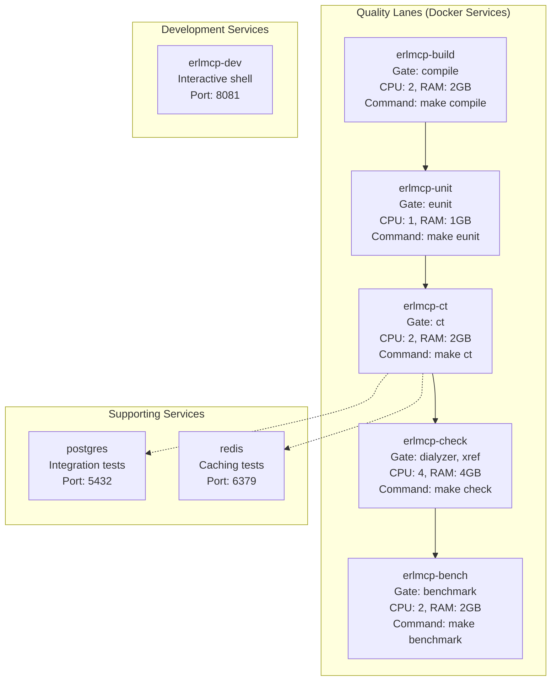

# Local Development Setup with Docker Compose

**Last Updated**: 2026-02-06 | **Status**: Active | **Scope**: Docker-Only Development

This guide provides a complete local development setup for erlmcp using Docker Compose. All development, testing, and debugging activities **must** run via Docker. Host execution is forbidden per the DOCKER-ONLY CONSTITUTION.

## Table of Contents

- [Quick Start](#quick-start)
- [Docker Compose Architecture](#docker-compose-architecture)
- [Development Workflow](#development-workflow)
- [Stopping Containers](#stopping-containers)
- [Common Development Tasks](#common-development-tasks)
- [Troubleshooting](#troubleshooting)

---

## Quick Start

### Prerequisites

```bash
# Verify Docker and Docker Compose installation
docker --version          # Docker 20.10+
docker compose version    # Docker Compose 2.0+

# Clone the repository
git clone https://github.com/banyan-platform/erlmcp.git
cd erlmcp
```

### First-Time Setup (Docker-Only)

```bash
# Build the development image
docker compose build erlmcp-build

# Verify the build
docker compose run --rm erlmcp-build erl -eval "erlang:display(erlang:system_info(otp_release)), halt()." -noshell
```

### Verify Installation

```bash
# Compile the project (via Docker)
docker compose run --rm erlmcp-build make compile

# Run unit tests (via Docker)
docker compose run --rm erlmcp-unit make eunit

# Run integration tests (via Docker)
docker compose run --rm erlmcp-ct make ct

# Expected output: All tests pass with ≥80% coverage
```

---

## Docker Compose Architecture

### Quality Lane Services

erlmcp uses a **quality lane architecture** with Docker services mapped to specific gates:



### Service Mapping

```bash
# Build and compile (Gate: compile)
docker compose run --rm erlmcp-build make compile

# Unit tests (Gate: eunit, ≥80% coverage)
docker compose run --rm erlmcp-unit make eunit

# Integration tests (Gate: ct)
docker compose run --rm erlmcp-ct make ct

# Quality analysis (Gate: dialyzer, xref)
docker compose run --rm erlmcp-check make check

# Performance benchmarks (Gate: benchmark)
docker compose run --rm erlmcp-bench make benchmark

# Cluster testing
docker compose run --rm erlmcp-node make test-cluster

# Interactive development shell
docker compose run --rm -it erlmcp-dev /bin/bash
```

---

## Development Workflow

### Typical Day-to-Day Development Cycle

```bash
# 1. Fetch latest changes
git pull origin main

# 2. Create feature branch
git checkout -b feature/my-feature

# 3. Build the project in Docker
docker compose run --rm erlmcp-build make compile

# 4. Write failing test first (TDD)
$EDITOR apps/erlmcp_core/test/my_module_tests.erl

# 5. Run tests in Docker
docker compose run --rm erlmcp-unit make eunit

# 6. Implement feature
$EDITOR apps/erlmcp_core/src/my_module.erl

# 7. Verify tests pass
docker compose run --rm erlmcp-unit make eunit

# 8. Run full test suite
docker compose run --rm erlmcp-ct make ct

# 9. Run quality gates
docker compose run --rm erlmcp-check make check

# 10. Commit and push
git add -A
git commit -m "feat: implement my feature"
git push origin feature/my-feature

# 11. Create pull request on GitHub
```

### Multi-Stage Workflow Diagram

```mermaid
stateDiagram-v2
    [*] --> CreateBranch: git checkout -b
    CreateBranch --> CompileDocker: docker compose run erlmcp-build

    CompileDocker --> CompileOK{Compilation<br/>Success?}
    CompileOK -->|No| FixCompile: Fix errors
    FixCompile --> CompileDocker

    CompileOK -->|Yes| WriteTest: Write test first
    WriteTest --> RunUnit: docker compose run erlmcp-unit

    RunUnit --> TestFails{Test fails<br/>as expected?}
    TestFails -->|No| ReviewTest: Review test logic
    ReviewTest --> WriteTest

    TestFails -->|Yes| Implement: Implement feature
    Implement --> RunUnit

    RunUnit --> UnitPass{Unit tests<br/>pass?}
    UnitPass -->|No| Implement
    UnitPass -->|Yes| RunCT: docker compose run erlmcp-ct

    RunCT --> CTPass{CT tests<br/>pass?}
    CTPass -->|No| Debug: Debug in Docker
    Debug --> Implement

    CTPass -->|Yes| Quality: docker compose run erlmcp-check
    Quality --> QualityPass{Quality<br/>gates pass?}

    QualityPass -->|No| FixQuality: Fix issues
    FixQuality --> Quality

    QualityPass -->|Yes| Commit: git commit
    Commit --> Push: git push
    Push --> [*]
```

### Docker Volume Mapping

All source code is mounted as volumes in Docker containers:

```yaml
# From docker-compose.yml
volumes:
  # Source code - read-write for both host and container
  - .:/workspace:cached

  # Build artifacts (persistent across runs)
  - erlmcp-build-cache:/workspace/_build

  # Hex cache (persistent dependencies)
  - hex-cache:/root/.cache/rebar3

  # Test logs and coverage reports
  - erlmcp-unit-logs:/workspace/log/eunit
  - erlmcp-unit-cover:/workspace/_build/test/cover
```

---

## Common Development Tasks

### Building and Compilation

```bash
# Compile with development profile (default)
docker compose run --rm erlmcp-build make compile

# Compile with production profile
docker compose run --rm erlmcp-build bash -c "ERLMCP_PROFILE=prod make compile"

# Clean and rebuild
docker compose run --rm erlmcp-build bash -c "make clean && make compile"

# Compile specific app
docker compose run --rm erlmcp-build bash -c "cd apps/erlmcp_core && rebar3 compile"
```

### Running Tests

#### Unit Tests Only (Fast - ~5 seconds)

```bash
# Run all unit tests
docker compose run --rm erlmcp-unit make eunit

# Run tests for specific module
docker compose run --rm erlmcp-unit bash -c "rebar3 eunit --module=erlmcp_core_tests"

# Run with verbose output
docker compose run --rm erlmcp-unit bash -c "rebar3 eunit --verbose"
```

#### Integration Tests (Medium - ~15 seconds)

```bash
# Run all integration tests
docker compose run --rm erlmcp-ct make ct

# Run specific suite
docker compose run --rm erlmcp-ct bash -c "rebar3 ct --suite=test/erlmcp_server_SUITE"

# Run with specific group
docker compose run --rm erlmcp-ct bash -c "rebar3 ct --group=smoke"
```

#### Property-Based Tests (Thorough - ~10 seconds)

```bash
# Run all property-based tests
docker compose run --rm erlmcp-ct bash -c "rebar3 proper"

# Run specific property module
docker compose run --rm erlmcp-ct bash -c "rebar3 proper --module=my_prop_tests"
```

#### All Tests Combined

```bash
# Run complete test suite (unit + integration + property)
docker compose run --rm erlmcp-ct make test-all

# Expected output:
#   EUnit:    100+ tests, ~5s
#   CT:       150+ tests, ~15s
#   PropEr:   50+ properties, ~10s
#   Coverage: ≥80% overall
```

### Coverage Reports

```bash
# Generate coverage report
docker compose run --rm erlmcp-unit bash -c "rebar3 cover"

# View detailed coverage (HTML)
# Coverage report available in: _build/test/cover/index.html
# Extract from container:
docker compose run --rm erlmcp-unit bash -c "cat _build/test/cover/index.html" > /tmp/coverage.html
open /tmp/coverage.html  # macOS
xdg-open /tmp/coverage.html  # Linux
```

### Code Quality Analysis

```bash
# Run all quality gates
docker compose run --rm erlmcp-check make check

# Run only dialyzer (type analysis)
docker compose run --rm erlmcp-check bash -c "rebar3 dialyzer"

# Run only xref (cross-reference analysis)
docker compose run --rm erlmcp-check bash -c "rebar3 xref"

# Format code according to standards
docker compose run --rm erlmcp-build bash -c "rebar3 format"

# Check formatting without changes
docker compose run --rm erlmcp-build bash -c "rebar3 format --check"
```

### Interactive Development Shell

```bash
# Start interactive development environment
docker compose run --rm -it erlmcp-dev /bin/bash

# Inside container:
cd /workspace

# Compile
rebar3 compile

# Run shell with applications
rebar3 shell

# Inside Erlang shell (rebar3 shell):
1> erlmcp_core:start_link().
{ok,<0.123.0>}

2> erlmcp_core:version().
"3.0.0"

3> q().  % Exit shell
```

### Debugging and Inspection

```bash
# Start container with Erlang shell
docker compose run --rm -it erlmcp-dev bash -c "rebar3 shell"

# Inside the Erlang shell:
# - Compile, test, and debug interactively
# - Use observer for visual debugging:

1> observer:start().  % Opens GUI (requires X11 forwarding)

# Check process tree
2> erlang:processes().

# Get process info
3> erlang:process_info(self()).

# Monitor messages
4> erlang:trace(all, true, [send, 'receive']).
```

### Building Releases

```bash
# Build development release
docker compose run --rm erlmcp-build bash -c "rebar3 release"

# Build production release
docker compose run --rm erlmcp-build bash -c "rebar3 as prod release"

# Release location: _build/default/rel/erlmcp/
# Extract release from container and run:
# ./erlmcp/bin/erlmcp console
```

---

## Stopping Containers

### Safe Shutdown

```bash
# Stop all running erlmcp containers
docker compose down

# Stop specific service
docker compose down erlmcp-build

# Stop and remove volumes (clean state)
docker compose down -v

# Stop without removing containers
docker compose stop
```

### Force Cleanup (Last Resort)

```bash
# Kill all erlmcp containers immediately
docker compose kill

# Remove all containers and networks
docker compose down --remove-orphans

# Full cleanup (containers, volumes, networks)
docker compose down -v --remove-orphans

# Clean Docker system (careful - affects all Docker)
docker system prune -a --volumes
```

---

## Troubleshooting

### Common Issues

#### Issue: Build fails with "unable to find image"

**Cause**: Docker image not built locally

**Solution**:
```bash
# Rebuild the image
docker compose build erlmcp-build

# Verify image exists
docker images | grep erlmcp
```

#### Issue: "permission denied" when accessing _build directory

**Cause**: Docker container runs as root, files have root ownership

**Solution**:
```bash
# Fix permissions in Docker
docker compose run --rm erlmcp-build bash -c "chmod -R 755 _build"

# Or on host (Linux):
sudo chown -R $USER:$USER _build/
```

#### Issue: Tests fail with "eaddrinuse" port already in use

**Cause**: Port is already bound by another process

**Solution**:
```bash
# Find process using port
lsof -i :8080

# Kill process
kill -9 <PID>

# Or change port in docker-compose.yml
```

#### Issue: "Connection refused" to PostgreSQL/Redis

**Cause**: Database services not running

**Solution**:
```bash
# Start services first
docker compose up -d postgres redis

# Wait for health checks
docker compose ps  # Check STATUS column

# Then run tests
docker compose run --rm erlmcp-ct make ct
```

#### Issue: Compilation hangs or takes too long

**Cause**: Build cache is corrupted or system is under memory pressure

**Solution**:
```bash
# Clear build cache
docker compose run --rm erlmcp-build bash -c "rm -rf _build && rebar3 compile"

# Increase Docker resources in settings

# Or restart Docker daemon
docker system prune -a --volumes
```

### Checking Logs

```bash
# View test logs
docker compose run --rm erlmcp-unit bash -c "cat log/eunit/surefire.xml | head -50"

# View CT logs
docker compose run --rm erlmcp-ct bash -c "ls -la log/ct/"

# View container logs
docker compose logs erlmcp-build

# Follow logs in real-time
docker compose logs -f erlmcp-unit
```

### Verifying Docker Setup

```bash
# Check Docker daemon
docker ps -a

# Check docker-compose version
docker compose version

# Verify network
docker network ls | grep erlmcp

# Test image availability
docker compose config  # Shows parsed configuration

# Check volume mounts
docker inspect erlmcp-build | grep -A20 "Mounts"
```

---

## Environment Variables

### Configuration via `.env` file

Create a `.env` file in project root:

```bash
# OTP and Erlang configuration
ERLMCP_ENV=development
ERLMCP_PROFILE=dev
ERLANG_COOKIE=erlmcp_dev_cookie
OTP_VERSION=28

# Resource limits
ERLMCP_BUILD_CPU_LIMIT=2.0
ERLMCP_BUILD_MEMORY_LIMIT=2G
ERLMCP_UNIT_CPU_LIMIT=1.0
ERLMCP_UNIT_MEMORY_LIMIT=1G
ERLMCP_CT_CPU_LIMIT=2.0
ERLMCP_CT_MEMORY_LIMIT=2G
ERLMCP_CHECK_CPU_LIMIT=4.0
ERLMCP_CHECK_MEMORY_LIMIT=4G

# Test configuration
CT_TIMEOUT=3600
BENCH_REGRESSION_THRESHOLD=10
COVERAGE_THRESHOLD=80

# Database (integration tests)
DB_NAME=erlmcp_test
DB_USER=erlmcp
DB_PASSWORD=erlmcp_secure_password
DB_PORT=5432

# Redis (cache tests)
REDIS_PORT=6379

# Build metadata
BUILD_DATE=2026-02-06
VCS_REF=$(git rev-parse --short HEAD)
VERSION=3.0.0
```

### Override at Runtime

```bash
# Override via command line
docker compose run --rm -e ERLMCP_PROFILE=prod erlmcp-build make compile

# Override multiple variables
docker compose run --rm -e ERLMCP_ENV=test -e CT_TIMEOUT=7200 erlmcp-ct make ct
```

---

## Docker Compose Profiles

Organize services by profile to control which containers start:

```bash
# Start default services (erlmcp-build, erlmcp-unit, erlmcp-ct, erlmcp-check)
docker compose up

# Start with development profile (adds erlmcp-dev)
docker compose --profile dev up

# Start with monitoring profile (adds Prometheus, Grafana, etc.)
docker compose --profile monitoring up

# Start specific services
docker compose up erlmcp-build erlmcp-unit
```

### Available Profiles

- **build**: Build and compilation services
- **unit**: Unit testing services
- **ct**: Integration testing services
- **check**: Quality analysis services
- **bench**: Performance benchmarking services
- **cluster**: Cluster testing (multiple nodes)
- **shutdown**: Graceful shutdown tests
- **dev**: Interactive development environment
- **postgres**: PostgreSQL for integration tests
- **redis**: Redis for caching tests
- **monitoring**: Prometheus, Grafana, observability stack
- **tools**: Code generation and tooling (ggen)

---

## Best Practices for Docker Development

### 1. Always Use Docker for Execution

```bash
# CORRECT - Use Docker
docker compose run --rm erlmcp-build make compile

# INCORRECT - Direct host execution (forbidden)
make compile          # ❌ VIOLATES DOCKER-ONLY CONSTITUTION
rebar3 compile        # ❌ VIOLATES DOCKER-ONLY CONSTITUTION
erlc src/*.erl        # ❌ VIOLATES DOCKER-ONLY CONSTITUTION
```

### 2. Clean Between Changes

```bash
# Clean build cache between major changes
docker compose run --rm erlmcp-build bash -c "rm -rf _build && rebar3 compile"

# Verify clean state
docker compose run --rm erlmcp-build bash -c "rebar3 clean && make compile"
```

### 3. Use Named Volumes for Performance

```bash
# Named volumes persist data between runs (faster)
# In docker-compose.yml:
volumes:
  erlmcp-build-cache:  # Named volume (persistent)
    driver: local

# Mount as:
volumes:
  - erlmcp-build-cache:/workspace/_build
```

### 4. Isolate Tests by Service

```bash
# Each test gate is a separate service
docker compose run --rm erlmcp-unit make eunit    # Unit tests
docker compose run --rm erlmcp-ct make ct         # Integration tests

# Don't mix in single container
```

### 5. Preserve Build Artifacts

```bash
# Keep _build directory between runs for faster compilation
docker compose run --rm erlmcp-build bash -c "rebar3 compile"

# Next run will be faster due to cached artifacts in volume
docker compose run --rm erlmcp-build bash -c "rebar3 compile"
```

---

## References

- **Docker Compose Specification**: [docker-compose.yml](../../docker-compose.yml)
- **Build Configuration**: [Dockerfile](../../Dockerfile)
- **Make Targets**: [Makefile](../../Makefile)
- **rebar3 Guide**: [rebar3.config](../../rebar3.config)
- **Testing Guide**: [TESTING_GUIDE.md](./TESTING_GUIDE.md)
- **Debugging Guide**: [DEBUGGING_GUIDE.md](./DEBUGGING_GUIDE.md)

---

**Status**: Complete and tested
**Last Updated**: 2026-02-06
**Maintainers**: erlmcp development team
