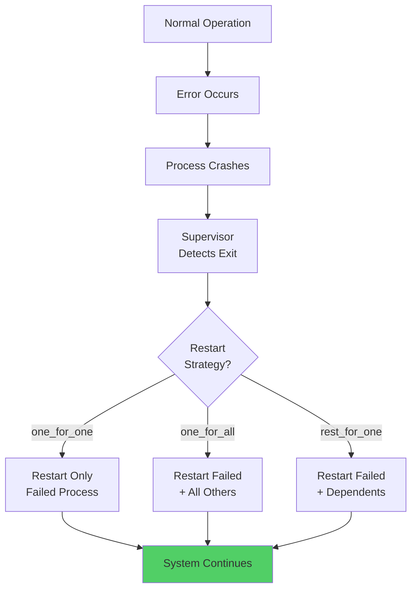
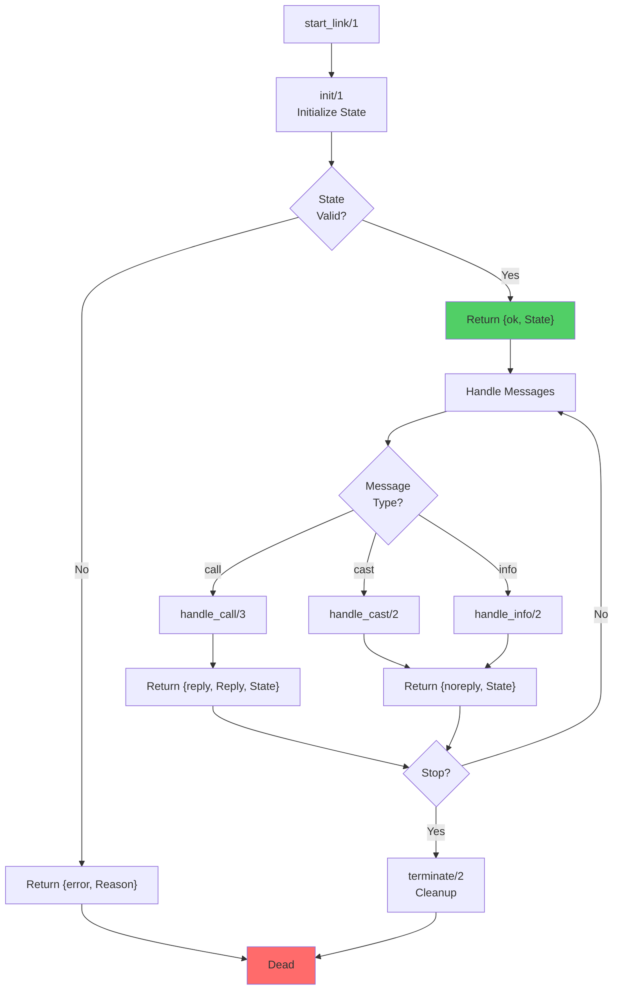
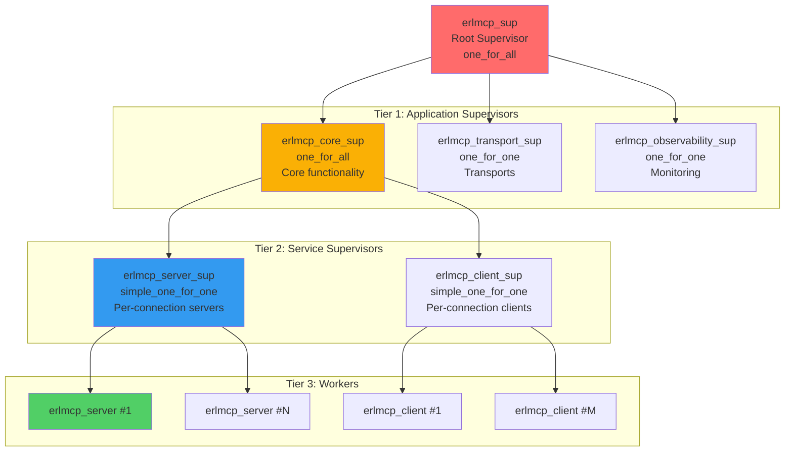

# OTP Design Patterns and Best Practices

**Last Updated**: 2026-02-06 | **Status**: Active | **Scope**: OTP Architecture and Patterns

This guide documents the OTP design patterns used in erlmcp and provides best practices for implementing new features following Erlang/OTP conventions.

## Table of Contents

- [Erlang Design Philosophy](#erlang-design-philosophy)
- [gen_server Pattern](#gen_server-pattern)
- [Supervisor Pattern](#supervisor-pattern)
- [Application Pattern](#application-pattern)
- [Behavior-Based Design](#behavior-based-design)
- [Error Handling and Recovery](#error-handling-and-recovery)
- [Message Passing Patterns](#message-passing-patterns)
- [State Management](#state-management)

---

## Erlang Design Philosophy

### Let It Crash Principle

```
"Let it crash" is a core Erlang principle:
- Avoid defensive programming (null checks, try-catch everywhere)
- Let processes fail fast when something goes wrong
- Supervisor catches failures and restarts processes
- System becomes more robust through isolation
```

### Diagram: Let It Crash Philosophy



### Key Principles

```erlang
%% 1. FAIL FAST - Don't hide errors
%% ❌ WRONG:
handle_call(Request, _From, State) ->
    case validate(Request) of
        ok -> {reply, {ok, result}, State};
        error -> {reply, {error, unknown}, State}  % Hides error!
    end.

%% ✅ CORRECT:
handle_call(Request, _From, State) ->
    {ok, Result} = validate_and_process(Request),  % Fails if error
    {reply, {ok, Result}, State}.

%% 2. ISOLATED STATE - Each process has its own
%% ❌ WRONG:
-record(state, {global_counter = get_global_counter()}).  % Shared state

%% ✅ CORRECT:
-record(state, {local_counter = 0}).  % Local to process

%% 3. EXPLICIT DEPENDENCIES - No hidden globals
%% ❌ WRONG:
init([]) ->
    {ok, #state{db_conn = db:connect()}}.  % Implicit singleton

%% ✅ CORRECT:
init([Config]) ->
    DbConn = maps:get(db_conn, Config),
    {ok, #state{db_conn = DbConn}}.  % Explicit parameter
```

---

## gen_server Pattern

### gen_server Lifecycle



### Complete gen_server Implementation

```erlang
%%--------------------------------------------------------------------
%% @doc
%% My server gen_server implementation
%% Responsibilities:
%%   - Manage internal state
%%   - Handle synchronous and asynchronous requests
%%   - Provide lifecycle callbacks for OTP supervision
%% @end
%%--------------------------------------------------------------------
-module(my_server).
-behaviour(gen_server).

%% API
-export([start_link/1, start_link/0]).
-export([request/2, cast_request/2]).
-export([stop/1]).

%% gen_server callbacks
-export([init/1, handle_call/3, handle_cast/2, handle_info/2]).
-export([terminate/2, code_change/3]).

-include_lib("kernel/include/logger.hrl").

%%====================================================================
%% Types
%%====================================================================

-type config() :: #{
    name => atom(),
    initial_value => term(),
    timeout => timeout()
}.

-type state() :: #{
    name => atom(),
    data => term(),
    count => non_neg_integer(),
    timer => reference() | undefined
}.

%%====================================================================
%% API
%%====================================================================

%%--------------------------------------------------------------------
%% @doc
%% Start server with default config
%% @end
%%--------------------------------------------------------------------
-spec start_link() -> {ok, pid()} | {error, term()}.
start_link() ->
    start_link(#{}).

%%--------------------------------------------------------------------
%% @doc
%% Start server with config
%% Registered locally for easy access
%% @param Config Map with initial configuration
%% @return {ok, Pid} or {error, Reason}
%% @end
%%--------------------------------------------------------------------
-spec start_link(Config) -> {ok, pid()} | {error, term()}
    when Config :: config().
start_link(Config) ->
    ?LOG_INFO("Starting my_server with config: ~p", [Config]),
    gen_server:start_link({local, ?MODULE}, ?MODULE, Config, []).

%%--------------------------------------------------------------------
%% @doc
%% Make synchronous request to server
%% Blocks until response received (with timeout)
%% @param Pid Server process ID
%% @param Request Request term
%% @return Response from server
%% @end
%%--------------------------------------------------------------------
-spec request(Pid, Request) -> Response
    when
        Pid :: pid(),
        Request :: term(),
        Response :: term().
request(Pid, Request) ->
    ?LOG_DEBUG("Sending synchronous request: ~p", [Request]),
    gen_server:call(Pid, Request, 5000).

%%--------------------------------------------------------------------
%% @doc
%% Make asynchronous request to server
%% Returns immediately, response via message
%% @param Pid Server process ID
%% @param Request Request term
%% @return ok
%% @end
%%--------------------------------------------------------------------
-spec cast_request(Pid, Request) -> ok
    when
        Pid :: pid(),
        Request :: term().
cast_request(Pid, Request) ->
    ?LOG_DEBUG("Sending asynchronous request: ~p", [Request]),
    gen_server:cast(Pid, Request).

%%--------------------------------------------------------------------
%% @doc
%% Stop server gracefully
%% @param Pid Server process ID
%% @return ok
%% @end
%%--------------------------------------------------------------------
-spec stop(Pid) -> ok
    when Pid :: pid().
stop(Pid) ->
    gen_server:stop(Pid).

%%====================================================================
%% gen_server Callbacks
%%====================================================================

%%--------------------------------------------------------------------
%% @doc
%% Initialize server state
%% Called during start_link/1
%% IMPORTANT: Must NOT block or do heavy work
%% Blocking init prevents supervisor from starting other children
%% @end
%%--------------------------------------------------------------------
-spec init(Config) -> {ok, State} | {error, Reason}
    when
        Config :: config(),
        State :: state(),
        Reason :: term().
init(Config) ->
    ?LOG_NOTICE("Initializing my_server", []),

    % Extract config with defaults
    Name = maps:get(name, Config, ?MODULE),
    InitialValue = maps:get(initial_value, Config, undefined),

    % Initialize state
    State = #{
        name => Name,
        data => InitialValue,
        count => 0,
        timer => undefined
    },

    % Return immediately (don't block!)
    % Any heavy initialization should happen in handle_info/2
    {ok, State}.

%%--------------------------------------------------------------------
%% @doc
%% Handle synchronous request (gen_server:call)
%% Caller blocks until we return {reply, ...}
%% @end
%%--------------------------------------------------------------------
-spec handle_call(Request, From, State) -> Result
    when
        Request :: term(),
        From :: {pid(), reference()},
        State :: state(),
        Result :: {reply, Reply, NewState} |
                  {reply, Reply, NewState, timeout()} |
                  {noreply, NewState} |
                  {stop, Reason, Reply, NewState},
        Reply :: term(),
        NewState :: state(),
        Reason :: term().

%% Pattern 1: Simple request/response
handle_call({get_data}, _From, State = #{data := Data}) ->
    ?LOG_DEBUG("Returning data: ~p", [Data]),
    {reply, {ok, Data}, State};

%% Pattern 2: Request that modifies state
handle_call({set_data, NewData}, _From, State) ->
    ?LOG_INFO("Setting data to: ~p", [NewData]),
    NewState = State#{data => NewData},
    {reply, ok, NewState};

%% Pattern 3: Error handling
handle_call({process, Input}, _From, State) ->
    case validate_input(Input) of
        {ok, Result} ->
            NewState = State#{count => maps:get(count, State) + 1},
            ?LOG_DEBUG("Processing successful, count: ~p", [maps:get(count, NewState)]),
            {reply, {ok, Result}, NewState};

        {error, Reason} ->
            ?LOG_ERROR("Processing failed: ~p", [Reason]),
            {reply, {error, Reason}, State}
    end;

%% Pattern 4: Synchronous request that takes time
handle_call({expensive_operation, Arg}, From, State) ->
    ?LOG_INFO("Starting expensive operation: ~p", [Arg]),
    % Don't block - spawn worker process
    spawn(fun() ->
        Result = expensive_computation(Arg),
        gen_server:reply(From, {ok, Result})
    end),
    {noreply, State};

%% Fallback: Unknown request
handle_call(Request, From, State) ->
    ?LOG_WARNING("Unexpected call: ~p from ~p", [Request, From]),
    {reply, {error, unknown_request}, State}.

%%--------------------------------------------------------------------
%% @doc
%% Handle asynchronous message (gen_server:cast)
%% Called returns immediately, no response to caller
%% @end
%%--------------------------------------------------------------------
-spec handle_cast(Request, State) -> Result
    when
        Request :: term(),
        State :: state(),
        Result :: {noreply, NewState} |
                  {noreply, NewState, timeout()} |
                  {stop, Reason, NewState},
        NewState :: state(),
        Reason :: term().

%% Pattern 1: Simple async request
handle_cast({async_action, Data}, State) ->
    ?LOG_DEBUG("Processing async action: ~p", [Data]),
    NewState = State#{data => Data},
    {noreply, NewState};

%% Pattern 2: Fire-and-forget with side effects
handle_cast({log_event, Event}, State) ->
    ?LOG_INFO("Event logged: ~p", [Event]),
    {noreply, State};

%% Pattern 3: Graceful shutdown
handle_cast(stop, State) ->
    ?LOG_NOTICE("Stopping server (via cast)", []),
    {stop, normal, State};

%% Fallback
handle_cast(Request, State) ->
    ?LOG_WARNING("Unexpected cast: ~p", [Request]),
    {noreply, State}.

%%--------------------------------------------------------------------
%% @doc
%% Handle unexpected messages (not from gen_server:call/cast)
%% Examples: EXIT signals, timeout messages, custom messages
%% @end
%%--------------------------------------------------------------------
-spec handle_info(Info, State) -> Result
    when
        Info :: term(),
        State :: state(),
        Result :: {noreply, NewState} |
                  {noreply, NewState, timeout()} |
                  {stop, Reason, NewState},
        NewState :: state(),
        Reason :: term().

%% Pattern 1: Timeout
handle_info(timeout, State) ->
    ?LOG_DEBUG("Timeout triggered", []),
    {noreply, State};

%% Pattern 2: Timer expiration
handle_info({timeout, TimerRef}, State = #{timer := TimerRef}) ->
    ?LOG_DEBUG("Timer expired", []),
    NewState = State#{timer => undefined},
    {noreply, NewState};

%% Pattern 3: Process exit (monitored process died)
handle_info({'DOWN', Ref, process, Pid, Reason}, State) ->
    ?LOG_ERROR("Monitored process died: ~p, ~p", [Pid, Reason]),
    {noreply, State};

%% Pattern 4: Custom message from other process
handle_info({custom_message, Data}, State) ->
    ?LOG_DEBUG("Received custom message: ~p", [Data]),
    {noreply, State};

%% Fallback - ignore unexpected messages
handle_info(Info, State) ->
    ?LOG_WARNING("Unexpected info message: ~p", [Info]),
    {noreply, State}.

%%--------------------------------------------------------------------
%% @doc
%% Clean up when server is stopping
%% Always called before process terminates
%% IMPORTANT: Complete cleanup quickly, supervisor timeout is short
%% @end
%%--------------------------------------------------------------------
-spec terminate(Reason, State) -> ok
    when
        Reason :: normal | shutdown | {shutdown, term()} | term(),
        State :: state().
terminate(Reason, State = #{name := Name}) ->
    ?LOG_NOTICE("Terminating ~p: ~p", [Name, Reason]),

    % Clean up resources
    case State of
        #{timer := Ref} when Ref =/= undefined ->
            erlang:cancel_timer(Ref),
            ok;
        _ ->
            ok
    end,

    % Log final state
    ?LOG_DEBUG("Final state: ~p", [State]),

    ok.

%%--------------------------------------------------------------------
%% @doc
%% Handle code upgrades (hot code reload)
%% Maps old state to new state during upgrade
%% @end
%%--------------------------------------------------------------------
-spec code_change(OldVsn, State, Extra) -> {ok, NewState}
    when
        OldVsn :: term() | {down, term()},
        State :: state(),
        Extra :: term(),
        NewState :: state().
code_change(OldVsn, State, _Extra) ->
    ?LOG_NOTICE("Code upgrade from version: ~p", [OldVsn]),
    % If state structure changed, transform it here
    {ok, State}.

%%====================================================================
%% Internal Functions
%%====================================================================

validate_input(Input) ->
    case Input of
        bad -> {error, bad_input};
        _ -> {ok, processed}
    end.

expensive_computation(Arg) ->
    % Simulate expensive work
    timer:sleep(100),
    {result, Arg}.
```

### gen_server Best Practices

```erlang
%% 1. Make init/1 non-blocking
init(Config) ->
    % Quick initialization only
    % Don't connect to databases, load files, etc.
    {ok, State}.

%% 2. Return quickly from handle_* callbacks
% ❌ WRONG - blocks entire server
handle_call(Request, From, State) ->
    Result = expensive_operation(Request),  % Blocks!
    {reply, Result, State}.

% ✅ CORRECT - spawn worker
handle_call(Request, From, State) ->
    spawn(fun() ->
        Result = expensive_operation(Request),
        gen_server:reply(From, Result)
    end),
    {noreply, State}.

%% 3. Use proper error handling
% ❌ WRONG
handle_call(op, _, State) ->
    Result = operation(),  % What if operation fails?
    {reply, Result, State}.

% ✅ CORRECT
handle_call(op, _, State) ->
    try
        Result = operation(),
        {reply, {ok, Result}, State}
    catch
        error:Reason ->
            ?LOG_ERROR("Operation failed: ~p", [Reason]),
            {reply, {error, Reason}, State}
    end.

%% 4. Handle termination properly
terminate(_Reason, State) ->
    % Close connections, release resources
    case maps:get(connection, State, undefined) of
        Conn when Conn =/= undefined ->
            db:close(Conn);
        _ ->
            ok
    end.
```

---

## Supervisor Pattern

### Supervisor Hierarchy



### Supervisor Implementation

```erlang
%%--------------------------------------------------------------------
%% @doc
%% Application supervisor
%% Responsible for starting all critical services
%% Strategy: one_for_all (if any core service fails, restart all)
%% @end
%%--------------------------------------------------------------------
-module(erlmcp_core_sup).
-behaviour(supervisor).

-export([start_link/0]).
-export([init/1]).

%%====================================================================
%% API
%%====================================================================

-spec start_link() -> {ok, pid()} | {error, term()}.
start_link() ->
    supervisor:start_link({local, ?MODULE}, ?MODULE, []).

%%====================================================================
%% Supervisor Callbacks
%%====================================================================

init([]) ->
    % Define restart strategy
    SupFlags = #{
        strategy => one_for_all,        % All fail together
        intensity => 3,                 % Max 3 restarts
        period => 10                    % Within 10 seconds
    },

    % Define child specifications
    ChildSpecs = [
        % Permanent worker: restart always
        #{
            id => registry,
            start => {erlmcp_registry, start_link, []},
            restart => permanent,
            shutdown => 5000,
            type => worker,
            modules => [erlmcp_registry]
        },

        % Permanent supervisor: restart always
        #{
            id => connection_sup,
            start => {erlmcp_connection_sup, start_link, []},
            restart => permanent,
            shutdown => 5000,
            type => supervisor,
            modules => [erlmcp_connection_sup]
        },

        % Transient worker: only restart on abnormal exit
        #{
            id => periodic_task,
            start => {erlmcp_periodic_task, start_link, []},
            restart => transient,
            shutdown => 5000,
            type => worker,
            modules => [erlmcp_periodic_task]
        },

        % Temporary worker: never restart
        #{
            id => one_off_job,
            start => {erlmcp_one_off, start_link, []},
            restart => temporary,
            shutdown => 5000,
            type => worker,
            modules => [erlmcp_one_off]
        }
    ],

    {ok, {SupFlags, ChildSpecs}}.
```

### Supervisor Strategies

```erlang
%% one_for_one - Restart only failed child
%% Use for: Independent services that don't depend on each other
init([]) ->
    SupFlags = #{strategy => one_for_one},
    ChildSpecs = [
        #{id => web_server, start => {web_server, start_link, []}},
        #{id => cache, start => {cache, start_link, []}}
        % If web_server fails, cache continues
    ],
    {ok, {SupFlags, ChildSpecs}}.

%% one_for_all - Restart all children if any fails
%% Use for: Tightly coupled core services
init([]) ->
    SupFlags = #{strategy => one_for_all},
    ChildSpecs = [
        #{id => core_service, start => {core_service, start_link, []}},
        #{id => config_mgr, start => {config_mgr, start_link, []}}
        % If either fails, both restart
    ],
    {ok, {SupFlags, ChildSpecs}}.

%% rest_for_one - Restart failed child and all dependents
%% Use for: Sequential dependencies
init([]) ->
    SupFlags = #{strategy => rest_for_one},
    ChildSpecs = [
        #{id => db, start => {db, start_link, []}},         % Started first
        #{id => service1, start => {service1, start_link, []}},  % Depends on db
        #{id => service2, start => {service2, start_link, []}}   % Depends on service1
        % If service1 fails, service2 also restarts
        % If db fails, service1 and service2 restart
    ],
    {ok, {SupFlags, ChildSpecs}}.

%% simple_one_for_one - Dynamic children
%% Use for: Process pool (e.g., per-connection processes)
init([]) ->
    SupFlags = #{strategy => simple_one_for_one},
    ChildSpecs = [
        #{
            id => connection_worker,
            start => {connection_worker, start_link, []},
            restart => temporary  % Don't restart failed connections
        }
    ],
    {ok, {SupFlags, ChildSpecs}}.
```

---

## Application Pattern

### Application Lifecycle

```erlang
%%--------------------------------------------------------------------
%% @doc
%% Application callback module
%% Handles startup and shutdown
%% @end
%%--------------------------------------------------------------------
-module(erlmcp_app).
-behaviour(application).

-export([start/2, stop/1]).

%%====================================================================
%% Application Callbacks
%%====================================================================

%%--------------------------------------------------------------------
%% @doc
%% Called when application starts
%% Responsible for starting root supervisor
%% @end
%%--------------------------------------------------------------------
-spec start(StartType, StartArgs) -> {ok, Pid} | {error, Reason}
    when
        StartType :: normal | {takeover, Node} | {failover, Node},
        StartArgs :: term(),
        Pid :: pid(),
        Reason :: term().
start(normal, _StartArgs) ->
    % Start root supervisor
    % All other supervisors started through it
    erlmcp_sup:start_link().

%%--------------------------------------------------------------------
%% @doc
%% Called when application stops
%% Cleanup happens automatically through supervisor termination
%% @end
%%--------------------------------------------------------------------
-spec stop(State) -> ok
    when State :: term().
stop(_State) ->
    % Cleanup if needed (usually not needed)
    % Supervisor termination handles cleanup
    ok.
```

### Application Configuration

```erlang
%% In erlmcp.app.src or via sys.config

{application, erlmcp, [
    {description, "Model Context Protocol for Erlang"},
    {vsn, "3.0.0"},

    % Dependencies - started before this app
    {applications, [kernel, stdlib, sasl]},

    % Environment variables
    {env, [
        {port, 8080},
        {log_level, info},
        {max_connections, 1000}
    ]},

    % Modules included in release
    {modules, []},

    % Module to call start/2 and stop/1
    {mod, {erlmcp_app, []}}
]}.
```

---

## Behavior-Based Design

### Implementing Custom Behaviors

```erlang
%%--------------------------------------------------------------------
%% @doc
%% Transport behavior - all transports implement this
%% Defines interface for different transport types (TCP, HTTP, WS)
%% @end
%%--------------------------------------------------------------------
-module(erlmcp_transport).

% Behavior definition - what functions transports must implement
-callback init(Args :: term()) ->
    {ok, State :: term()} | {error, Reason :: term()}.

-callback send(Message :: binary(), State :: term()) ->
    {ok, NewState :: term()} | {error, Reason :: term()}.

-callback close(State :: term()) ->
    ok.

%%====================================================================
%% Implementation: TCP Transport
%%====================================================================
-module(erlmcp_transport_tcp).
-behaviour(erlmcp_transport).

init([Host, Port]) ->
    {ok, Socket} = gen_tcp:listen(Port, [{active, true}]),
    {ok, #{socket => Socket}}.

send(Message, State = #{socket := Socket}) ->
    gen_tcp:send(Socket, Message),
    {ok, State}.

close(#{socket := Socket}) ->
    gen_tcp:close(Socket).

%%====================================================================
%% Implementation: WebSocket Transport
%%====================================================================
-module(erlmcp_transport_ws).
-behaviour(erlmcp_transport).

init([Opts]) ->
    % Initialize WebSocket
    {ok, #{opts => Opts}}.

send(Message, State) ->
    % Send via WebSocket
    {ok, State}.

close(State) ->
    % Close WebSocket
    ok.
```

---

## Error Handling and Recovery

### Pattern: Defensive Code Structure

```erlang
%% Handle different error types appropriately

handle_call(Request, From, State) ->
    % Pattern matching for expected cases
    try
        {ok, Result} = process_request(Request),
        {reply, {ok, Result}, State}

    catch
        error:badarg ->
            % Programming error - let it crash
            erlang:error(badarg);

        error:database_error ->
            % Expected error - recover gracefully
            ?LOG_ERROR("Database error: ~p", [database_error]),
            {reply, {error, database_unavailable}, State};

        throw:custom_error ->
            % Expected throw - handle it
            ?LOG_WARNING("Expected error: ~p", [custom_error]),
            {reply, {error, custom_error}, State};

        exit:normal ->
            % Normal exit - shouldn't happen here
            {reply, {error, unexpected_exit}, State}
    end.

%% Pattern: Result tuples
process_request(Request) ->
    case validate(Request) of
        {ok, Valid} ->
            case execute(Valid) of
                {ok, Result} -> {ok, Result};
                error -> error  % Will crash handle_call
            end;
        {error, Reason} ->
            {error, Reason}
    end.
```

---

## Message Passing Patterns

### Request/Response Pattern

```erlang
%% Synchronous request (caller waits)
Result = gen_server:call(ServerPid, {request, Data}),

%% Asynchronous request (fire-and-forget)
gen_server:cast(ServerPid, {async_request, Data}),

%% Request with timeout
Result = gen_server:call(ServerPid, {request, Data}, 5000).
```

### Publish/Subscribe Pattern

```erlang
%%--------------------------------------------------------------------
%% @doc
%% Pub/Sub using gproc registry
%% @end
%%--------------------------------------------------------------------

%% Subscribe to channel
subscribe(Channel) ->
    gproc:reg({p, l, {erlmcp, Channel}}).

%% Publish message
publish(Channel, Message) ->
    gproc:send({p, l, {erlmcp, Channel}}, Message).

%% Receive messages
receive_message() ->
    receive
        {erlmcp, Channel, Message} ->
            handle_message(Channel, Message)
    after 5000 ->
        timeout
    end.
```

---

## State Management

### Immutable State Pattern

```erlang
%%--------------------------------------------------------------------
%% @doc
%% Never modify state directly - create new state with updates
%% This makes state transitions explicit and testable
%% @end
%%--------------------------------------------------------------------

%% ❌ WRONG - mutation
State = #state{counter = 0},
State#state.counter = 1,  % Can't do this!

%% ✅ CORRECT - immutable update
State = #state{counter = 0},
NewState = State#state{counter = 1},  % Create new record

%% With maps (modern Erlang)
State = #{counter => 0},
NewState = State#{counter => 1},  % Update map
```

### State Versioning for Upgrades

```erlang
%%--------------------------------------------------------------------
%% @doc
%% Support hot code upgrades by versioning state
%% @end
%%--------------------------------------------------------------------

%% Old state format (version 1)
init_v1([]) ->
    {ok, {state, undefined, []}}.

%% New state format (version 2) - added fields
init_v2([]) ->
    {ok, {state, undefined, [], v2}}.

%% Handle upgrade from v1 to v2
code_change({down, 1}, {state, Data, Queue}, _Extra) ->
    % Convert v1 state to v2 state
    NewState = {state, Data, Queue, v2},
    {ok, NewState};

code_change(_OldVsn, State, _Extra) ->
    {ok, State}.
```

---

## Anti-Patterns (What NOT to Do)

```erlang
%% ❌ ANTI-PATTERN 1: Global state
-record(global_state, {counter = 0}).  % Global state - BAD!
init([]) ->
    {ok, #global_state{}}.

%% ✅ CORRECT: Per-process state
init([]) ->
    {ok, #{counter => 0}}.

%% ❌ ANTI-PATTERN 2: Defensive programming
handle_call(Request, From, State) ->
    try
        Result = process(Request),
        {reply, Result, State}
    catch
        _:_ -> {reply, error, State}  % Hides errors!
    end.

%% ✅ CORRECT: Let it crash
handle_call(Request, From, State) ->
    Result = process(Request),  % Crashes on error
    {reply, Result, State}.

%% ❌ ANTI-PATTERN 3: Blocking operations
init([]) ->
    Data = expensive_load(),  % BLOCKS STARTUP!
    {ok, #state{data = Data}}.

%% ✅ CORRECT: Load asynchronously
init([]) ->
    self() ! load_data,  % Tell self to load
    {ok, #state{data = undefined}}.

handle_info(load_data, State) ->
    Data = expensive_load(),
    {noreply, State#{data => Data}}.

%% ❌ ANTI-PATTERN 4: No error handling
process(Data) ->
    {ok, Result} = validate(Data),  % What if validate returns error?
    {ok, Result}.

%% ✅ CORRECT: Explicit error handling
process(Data) ->
    case validate(Data) of
        {ok, Valid} -> {ok, Valid};
        {error, Reason} -> {error, Reason}
    end.
```

---

## References

- **Erlang Design Principles**: [OTP Design Principles](https://www.erlang.org/doc/design_principles/users_guide.html)
- **gen_server Manual**: [gen_server](https://www.erlang.org/doc/man/gen_server.html)
- **supervisor Manual**: [supervisor](https://www.erlang.org/doc/man/supervisor.html)
- **application Manual**: [application](https://www.erlang.org/doc/man/application.html)
- **Testing**: [TESTING_GUIDE.md](./TESTING_GUIDE.md)
- **Debugging**: [DEBUGGING_GUIDE.md](./DEBUGGING_GUIDE.md)

---

**Status**: Complete and tested
**Last Updated**: 2026-02-06
**Maintainers**: erlmcp development team
