# Development Process Overview

**Last Updated**: 2026-01-31 | **Status**: Active

This document provides a comprehensive overview of the erlmcp development process with visual workflows and practical guidance.

## Table of Contents

- [Quick Start](#quick-start)
- [Development Workflow](#development-workflow)
- [Testing Strategy](#testing-strategy)
- [Quality Gates](#quality-gates)
- [Tooling](#tooling)

---

## Quick Start

### First-Time Setup

```bash
# Clone repository
git clone https://github.com/banyan-platform/erlmcp.git
cd erlmcp

# Install dependencies
make setup

# Enable environment (direnv recommended)
direnv allow

# Verify installation
make workspace-check
```

### Development Environment Validation


---

## Development Workflow

### Feature Development Cycle


### Daily Development Loop


### Branch Strategy

```mermaid
gitGraph
    commit id: "Initial"
    branch main
    checkout main
    commit id: "v1.0.0"

    branch feature/auth
    checkout feature/auth
    commit id: "Add auth tests"
    commit id: "Implement auth"
    commit id: "Tests pass"

    checkout main
    merge feature/auth
    commit id: "Merge auth"

    branch hotfix/security
    checkout hotfix/security
    commit id: "Fix security issue"
    commit id: "Add tests"

    checkout main
    merge hotfix/security
    commit id: "Merge hotfix"
    commit id: "v1.0.1"

    checkout main
```

**Branch Types**:
- `main`: Production-ready code
- `feature/*`: New features (from main)
- `fix/*`: Bug fixes (from main)
- `hotfix/*`: Critical production fixes (from main)
- `release/*`: Release preparation (from develop)

---

## Testing Strategy

### Test Pyramid


### Test Execution Flow


### Test Categories

**Unit Tests (EUnit)**:
- Test individual functions
- Fast execution (<5s)
- No external dependencies
- 100% coverage for critical paths

**Integration Tests (Common Test)**:
- Test module interactions
- Test OTP behaviors
- Test transport protocols
- Real processes (no mocks)

**Property-Based Tests (PropEr)**:
- Generate random inputs
- Verify invariants
- Find edge cases
- Complex algorithms only

---

## Quality Gates

### Mandatory Quality Gates


### Gate Enforcement


**Quality Gate Commands**:

```bash
# Gate 1: Compilation
TERM=dumb rebar3 compile           # errors = 0

# Gate 2: Tests
rebar3 eunit --module=M_tests      # pass_rate = 1.0
rebar3 ct --suite=test/S           # pass_rate = 1.0

# Gate 3: Coverage
rebar3 cover                       # ≥80%
rebar3 cover --verbose             # see detailed report

# Gate 4: Dialyzer
rebar3 dialyzer                    # warnings → 0

# Gate 5: Xref
rebar3 xref                        # undefined = ∅

# All gates
make check                         # runs all gates
```

---

## Tooling

### Development Tools


### Makefile Targets


### Essential Commands

**Build & Test**:
```bash
make build                    # Compile
make test                     # Run tests
make test-unit                # Unit tests only
make test-integration         # Integration tests only
make workspace-test           # All projects
```

**Quality**:
```bash
make lint                     # Dialyzer + Xref
make check                    # All gates
make coverage-report          # Coverage HTML
make format                   # Format code
```

**Debug**:
```bash
make console                  # Erlang shell
make observer                 # Observer GUI
make dev-console              # Dev config shell
```

**Release**:
```bash
make release                  # Production release
make workspace-release        # All releases
rebar3 release -n dev         # Dev release
```

---

## Development Patterns

### OTP Development

```mermaid
graph TB
    A[Identify Need] --> B{gen_server?}
    B -->|Yes| C[Define Callbacks]
    B -->|No| D{supervisor?}
    D -->|Yes| E[Define Child Specs]
    D -->|No| F[Plain Module]

    C --> G[init/1]
    C --> H[handle_call/3]
    C --> I[handle_cast/2]
    C --> J[handle_info/2]
    C --> K[terminate/2]
    C --> L[code_change/3]

    G --> M[Write Tests FIRST]
    H --> M
    I --> M
    J --> M
    K --> M
    L --> M

    M --> N[Implement Callbacks]
    N --> O[Run Quality Gates]
    O --> P{Pass?}
    P -->|No| N
    P -->|Yes| Q[Complete]

    style Q fill:#51cf66
```



### Transport Implementation


---

## Continuous Improvement

### Feedback Loops


### Kaizen (Continuous Improvement)


---

## Related Documentation

- **Testing**: See [../testing-guide.md](../testing-guide.md)
- **OTP Patterns**: See [../otp-patterns.md](../otp-patterns.md)
- **Architecture**: See [../architecture.md](../architecture.md)
- **Quality Gates**: See [../../CLAUDE.md](../../CLAUDE.md#quality-gates)
- **Contributing**: See [../../CONTRIBUTING.md](../../CONTRIBUTING.md)

---

**Last Updated**: 2026-01-31
**Status**: Active
**Maintainers**: erlmcp development team
