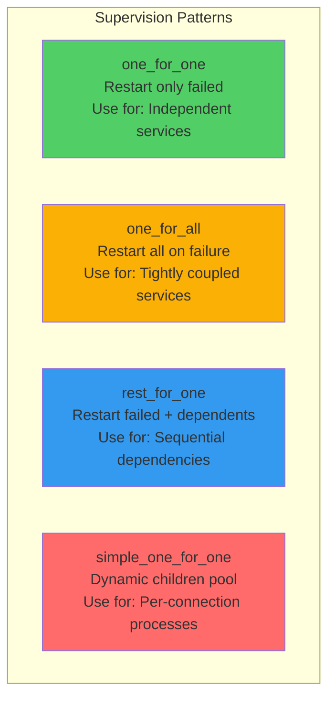
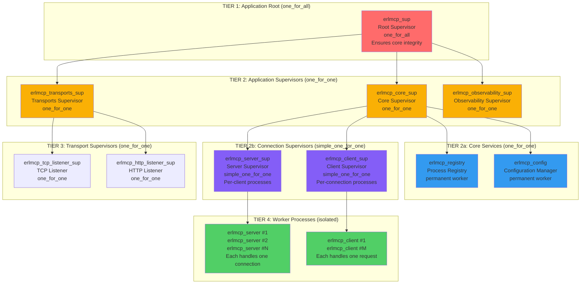
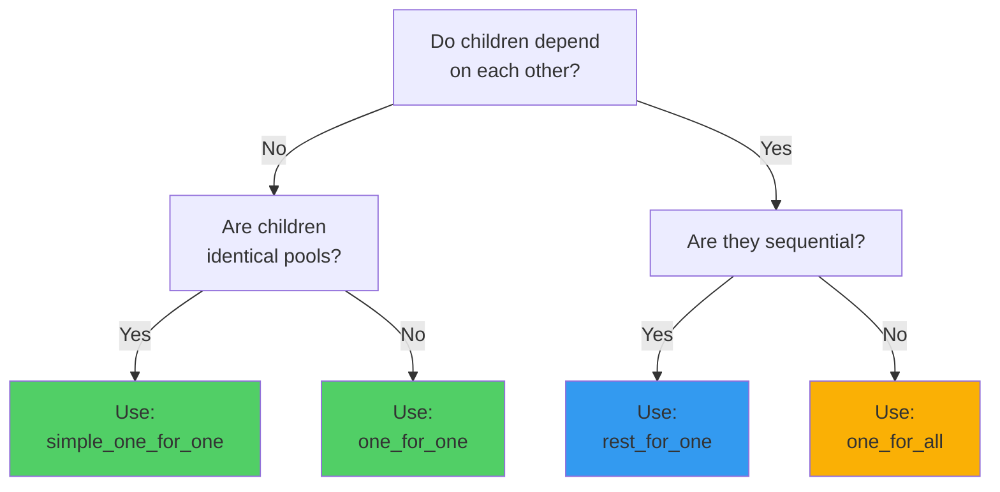

# Supervision Tree Design and Implementation

**Last Updated**: 2026-02-06 | **Status**: Active | **Scope**: Supervision Architecture

This guide covers designing and implementing robust supervision trees in erlmcp. Supervision trees determine how the system responds to failures and maintain application availability.

## Table of Contents

- [Supervision Philosophy](#supervision-philosophy)
- [erlmcp v3 Supervision Hierarchy](#erlmcp-v3-supervision-hierarchy)
- [Designing Your Supervision Tree](#designing-your-supervision-tree)
- [Restart Strategies](#restart-strategies)
- [Per-Connection Processes](#per-connection-processes)
- [Cluster-Safe Supervision](#cluster-safe-supervision)
- [Testing Supervision Trees](#testing-supervision-trees)

---

## Supervision Philosophy

### Core Principle: Process Isolation

```
Erlang supervision follows the philosophy:
"Let it crash and restart"

Instead of preventing failures:
- Embrace failures as normal
- Design processes to be stateless or easily recoverable
- Use supervision to restart failed processes quickly
- System becomes robust through isolation and quick recovery
```

### Supervision Design Patterns



---

## erlmcp v3 Supervision Hierarchy

### Complete Supervision Tree



### Tier Responsibilities

| Tier | Name | Strategy | Responsibility | Restart Policy |
|------|------|----------|-----------------|-----------------|
| **1** | Root Supervisor | one_for_all | System integrity | All restart together |
| **2** | App Supervisors | one_for_one | App-level services | Restart independently |
| **2a** | Core Services | - | Registry, config | Permanent (always restart) |
| **2b** | Connection Pools | simple_one_for_one | Per-connection processes | Transient (don't restart) |
| **3** | Transport Listeners | one_for_one | Protocol handling | Permanent (always restart) |
| **4** | Workers | - | Actual work | Terminate when done |

---

## Designing Your Supervision Tree

### Decision Tree: Choosing Strategy



### Implementation: Core Supervisor

```erlang
%%--------------------------------------------------------------------
%% @doc
%% Core application supervisor
%% Responsible for critical services
%% If any critical service fails, entire system restarts
%% @end
%%--------------------------------------------------------------------
-module(erlmcp_core_sup).
-behaviour(supervisor).

-export([start_link/0]).
-export([init/1]).

-include_lib("kernel/include/logger.hrl").

%%====================================================================
%% API
%%====================================================================

-spec start_link() -> {ok, pid()} | {error, term()}.
start_link() ->
    ?LOG_NOTICE("Starting core supervisor", []),
    supervisor:start_link({local, ?MODULE}, ?MODULE, []).

%%====================================================================
%% Supervisor Callbacks
%%====================================================================

init([]) ->
    ?LOG_INFO("Initializing core supervisor hierarchy", []),

    % Supervisor flags: one_for_all strategy
    % If ANY critical service fails, ALL services restart
    SupFlags = #{
        strategy => one_for_all,    % Fail together
        intensity => 3,             % Max 3 restarts
        period => 60                % Within 60 seconds
    },

    % Child specifications
    ChildSpecs = [
        %% ================================================================
        %% Tier 1: Critical Infrastructure
        %% ================================================================

        %% Process registry (must be first - others depend on it)
        #{
            id => registry,
            start => {erlmcp_registry, start_link, []},
            restart => permanent,      % Always restart
            shutdown => 5000,
            type => worker,
            modules => [erlmcp_registry]
        },

        %% Configuration manager (must be second)
        #{
            id => config_mgr,
            start => {erlmcp_config_mgr, start_link, []},
            restart => permanent,
            shutdown => 5000,
            type => worker,
            modules => [erlmcp_config_mgr]
        },

        %% ================================================================
        %% Tier 2: Connection Management Supervisors
        %% ================================================================

        %% Server supervisor (per-client pools)
        #{
            id => server_sup,
            start => {erlmcp_server_sup, start_link, []},
            restart => permanent,
            shutdown => 5000,           % Wait up to 5s for graceful shutdown
            type => supervisor,         % This IS a supervisor
            modules => [erlmcp_server_sup]
        },

        %% Client supervisor (per-request pools)
        #{
            id => client_sup,
            start => {erlmcp_client_sup, start_link, []},
            restart => permanent,
            shutdown => 5000,
            type => supervisor,
            modules => [erlmcp_client_sup]
        },

        %% ================================================================
        %% Tier 3: Protocol Support
        %% ================================================================

        %% TCP listener
        #{
            id => tcp_listener,
            start => {erlmcp_tcp_listener, start_link, [
                #{port => 8080}
            ]},
            restart => transient,       % Only restart on abnormal exit
            shutdown => 5000,
            type => worker,
            modules => [erlmcp_tcp_listener]
        },

        %% HTTP listener
        #{
            id => http_listener,
            start => {erlmcp_http_listener, start_link, [
                #{port => 8081}
            ]},
            restart => transient,
            shutdown => 5000,
            type => worker,
            modules => [erlmcp_http_listener]
        }
    ],

    {ok, {SupFlags, ChildSpecs}}.
```

### Implementation: Per-Connection Supervisor

```erlang
%%--------------------------------------------------------------------
%% @doc
%% Per-connection server supervisor
%% Uses simple_one_for_one to manage dynamic pool of servers
%% Each server handles one client connection
%% @end
%%--------------------------------------------------------------------
-module(erlmcp_server_sup).
-behaviour(supervisor).

-export([start_link/0, start_server/1]).
-export([init/1]).

-include_lib("kernel/include/logger.hrl").

%%====================================================================
%% API
%%====================================================================

-spec start_link() -> {ok, pid()} | {error, term()}.
start_link() ->
    ?LOG_NOTICE("Starting server supervisor (per-connection pool)", []),
    supervisor:start_link({local, ?MODULE}, ?MODULE, []).

%%--------------------------------------------------------------------
%% @doc
%% Dynamically start new server for incoming connection
%% Called by transport listener when new client connects
%% @end
%%--------------------------------------------------------------------
-spec start_server(Config) -> {ok, Pid} | {error, Reason}
    when
        Config :: map(),
        Pid :: pid(),
        Reason :: term().
start_server(Config) ->
    ?LOG_INFO("Starting new server process: ~p", [Config]),
    supervisor:start_child(?MODULE, [Config]).

%%====================================================================
%% Supervisor Callbacks
%%====================================================================

init([]) ->
    ?LOG_INFO("Initializing server supervisor hierarchy", []),

    % simple_one_for_one strategy:
    % - Template child spec
    % - Dynamically start children with supervisor:start_child/2
    % - Each child is independent (one_for_one within pool)
    % - Child processes are temporary (don't restart)

    SupFlags = #{
        strategy => simple_one_for_one,

        % Restart intensity: allow high number of connection attempts
        intensity => 100,               % Max 100 restarts
        period => 10                    % Within 10 seconds
    },

    ChildSpecs = [
        #{
            id => erlmcp_server,

            % start must be {Module, Function, Args}
            % supervisor:start_child adds one arg per call
            start => {erlmcp_server, start_link, []},

            % temporary: don't restart if connection closes
            % This is important - let connections die naturally
            restart => temporary,

            % Give connections 30 seconds to gracefully close
            shutdown => 30000,

            % This is a worker (not a supervisor)
            type => worker,

            modules => [erlmcp_server]
        }
    ],

    {ok, {SupFlags, ChildSpecs}}.
```

---

## Restart Strategies

### Strategy: one_for_one

```erlang
%% When child fails, only restart that child
%% Other children continue running

init([]) ->
    SupFlags = #{strategy => one_for_one},

    ChildSpecs = [
        #{
            id => web_server,
            start => {web_server, start_link, []},
            restart => permanent
        },
        #{
            id => cache_server,
            start => {cache_server, start_link, []},
            restart => permanent
        },
        #{
            id => background_worker,
            start => {background_worker, start_link, []},
            restart => permanent
        }
    ],

    % If cache_server fails:
    % - web_server continues running
    % - background_worker continues running
    % - only cache_server restarts

    {ok, {SupFlags, ChildSpecs}}.
```

### Strategy: one_for_all

```erlang
%% When any child fails, restart all children
%% Use for tightly coupled services

init([]) ->
    SupFlags = #{strategy => one_for_all},

    ChildSpecs = [
        #{
            id => primary_service,
            start => {primary_service, start_link, []},
            restart => permanent
        },
        #{
            id => dependent_service,
            start => {dependent_service, start_link, []},
            restart => permanent
        }
    ],

    % If either service fails:
    % - both services stop
    % - both services restart together
    % - ensures consistency

    {ok, {SupFlags, ChildSpecs}}.
```

### Strategy: rest_for_one

```erlang
%% When child fails, restart it and all dependents
%% Use for sequential dependencies (first child needed before second)

init([]) ->
    SupFlags = #{strategy => rest_for_one},

    ChildSpecs = [
        %% Started first (others depend on it)
        #{
            id => database,
            start => {database, start_link, []},
            restart => permanent
        },

        %% Started second (depends on database)
        #{
            id => cache,
            start => {cache, start_link, []},
            restart => permanent
        },

        %% Started third (depends on cache)
        #{
            id => application_server,
            start => {app_server, start_link, []},
            restart => permanent
        }
    ],

    % If database fails:
    % - database restarts
    % - cache restarts (needs database)
    % - app_server restarts (needs cache)

    % If cache fails:
    % - cache restarts
    % - app_server restarts (needs cache)
    % - database continues running (no dependency)

    % If app_server fails:
    % - app_server restarts
    % - database and cache continue running

    {ok, {SupFlags, ChildSpecs}}.
```

### Strategy: simple_one_for_one

```erlang
%% Dynamic pool of identical workers
%% Each worker is independent
%% Use for per-connection or per-request processing

init([]) ->
    SupFlags = #{strategy => simple_one_for_one},

    ChildSpecs = [
        #{
            %% Template - not an actual child yet
            id => connection_handler,
            start => {connection_handler, start_link, []},

            %% temporary: don't restart when connection closes
            restart => temporary,

            shutdown => 30000,          % Time for graceful shutdown
            type => worker,
            modules => [connection_handler]
        }
    ],

    % To start new connections:
    % supervisor:start_child(ServerSup, [ClientConfig])
    % supervisor:start_child(ServerSup, [#{host => "localhost"}])
    % supervisor:start_child(ServerSup, [#{id => 123}])

    {ok, {SupFlags, ChildSpecs}}.
```

### Restart Policies

```erlang
%% permanent - Always restart (crashed, normal, or abnormal exit)
%% Use for: Core services that must always run

restart => permanent,

%% transient - Restart only on abnormal exit
%% Use for: Services that may complete normally

restart => transient,

%% temporary - Never restart (normal or abnormal exit)
%% Use for: One-off tasks, per-connection processes

restart => temporary
```

---

## Per-Connection Processes

### Pattern: Accept Incoming Connection

```erlang
%%--------------------------------------------------------------------
%% @doc
%% TCP listener - accepts connections
%% Starts new server process for each connection
%% @end
%%--------------------------------------------------------------------
-module(erlmcp_tcp_listener).
-behaviour(gen_server).

-export([start_link/1]).
-export([init/1, handle_call/3, handle_cast/2, handle_info/2]).
-export([terminate/2]).

-include_lib("kernel/include/logger.hrl").

init(Config) ->
    Port = maps:get(port, Config, 8080),

    % Start listening
    {ok, ListenSocket} = gen_tcp:listen(Port, [
        {active, once},              % Receive one message at a time
        {reuseaddr, true}
    ]),

    ?LOG_NOTICE("TCP listener started on port ~p", [Port]),

    % Start accepting connections
    self() ! accept,

    {ok, #{listen_socket => ListenSocket}}.

handle_info(accept, State = #{listen_socket := ListenSocket}) ->
    % Accept incoming connection
    case gen_tcp:accept(ListenSocket) of
        {ok, Socket} ->
            % Got new connection!
            {ok, {RemoteHost, RemotePort}} = inet:peername(Socket),

            ?LOG_INFO("Accepted connection from ~s:~p", [
                inet:ntoa(RemoteHost), RemotePort
            ]),

            % Start new server process for this connection
            % This calls erlmcp_server_sup:start_child/1
            case erlmcp_server_sup:start_server(#{socket => Socket}) of
                {ok, ServerPid} ->
                    % Transfer socket ownership to server
                    gen_tcp:controlling_process(Socket, ServerPid),
                    ?LOG_DEBUG("Server process started: ~p", [ServerPid]),
                    ok;

                {error, Reason} ->
                    ?LOG_ERROR("Failed to start server: ~p", [Reason]),
                    gen_tcp:close(Socket)
            end,

            % Accept next connection
            self() ! accept,
            {noreply, State};

        {error, Reason} ->
            ?LOG_ERROR("Accept failed: ~p", [Reason]),
            self() ! accept,  % Try again
            {noreply, State}
    end.
```

### Pattern: Per-Connection Server Process

```erlang
%%--------------------------------------------------------------------
%% @doc
%% Server process - handles one client connection
%% Spawned by TCP listener for each incoming connection
%% @end
%%--------------------------------------------------------------------
-module(erlmcp_server).
-behaviour(gen_server).

-export([start_link/1]).
-export([init/1, handle_call/3, handle_cast/2, handle_info/2]).
-export([terminate/2]).

-include_lib("kernel/include/logger.hrl").

start_link(Config) ->
    % Config contains {socket => Socket}
    gen_server:start_link(?MODULE, Config, []).

init(Config = #{socket := Socket}) ->
    ?LOG_INFO("Server process started for client", []),

    % Set socket to passive mode (we'll handle receiving)
    inet:setopts(Socket, [{active, once}]),

    State = #{
        socket => Socket,
        buffer => <<>>,
        request_id => undefined
    },

    {ok, State}.

handle_info({tcp, Socket, Data}, State = #{buffer := Buffer}) ->
    % Received data from client
    NewBuffer = <<Buffer/binary, Data/binary>>,

    ?LOG_DEBUG("Received ~p bytes from client", [byte_size(Data)]),

    % Try to parse JSON-RPC message
    case parse_jsonrpc(NewBuffer) of
        {ok, Request, Rest} ->
            % Got complete request
            ?LOG_INFO("Parsed JSON-RPC request: ~p", [Request]),

            % Process request
            Response = handle_request(Request, State),

            % Send response
            send_response(Socket, Response),

            % Continue with remaining buffer
            inet:setopts(Socket, [{active, once}]),
            {noreply, State#{buffer => Rest}};

        {incomplete, NewBuffer} ->
            % Not enough data yet
            inet:setopts(Socket, [{active, once}]),
            {noreply, State#{buffer => NewBuffer}};

        {error, Reason} ->
            % Malformed request
            ?LOG_ERROR("Failed to parse request: ~p", [Reason]),
            Error = format_error(Reason),
            send_response(Socket, Error),
            inet:setopts(Socket, [{active, once}]),
            {noreply, State#{buffer => <<>>}}
    end;

handle_info({tcp_closed, Socket}, State = #{socket := Socket}) ->
    % Client closed connection
    ?LOG_NOTICE("Client closed connection", []),
    {stop, normal, State};

handle_info({tcp_error, Socket, Reason}, State = #{socket := Socket}) ->
    % Connection error
    ?LOG_ERROR("TCP error: ~p", [Reason]),
    {stop, Reason, State}.

terminate(_Reason, #{socket := Socket}) ->
    % Close socket on exit
    catch gen_tcp:close(Socket),
    ok.

%%====================================================================
%% Internal
%%====================================================================

send_response(Socket, Response) ->
    Binary = json:encode(Response),
    gen_tcp:send(Socket, Binary).

handle_request(Request, State) ->
    % Process MCP request and return response
    case maps:get(<<"method">>, Request, undefined) of
        <<"initialize">> -> #{<<"result">> => #{}, <<"id">> => maps:get(<<"id">>, Request)};
        _ -> #{<<"error">> => <<"unknown method">>, <<"id">> => maps:get(<<"id">>, Request)}
    end.

parse_jsonrpc(Buffer) ->
    % Try to parse JSON-RPC message
    {ok, Buffer}.

format_error(Reason) ->
    #{<<"error">> => atom_to_binary(Reason)}.
```

---

## Cluster-Safe Supervision

### Pattern: Multi-Node Supervision

```erlang
%%--------------------------------------------------------------------
%% @doc
%% Supervision that works in clustered Erlang
%% - No assumption about stable nodes
%% - Handles node failures gracefully
%% - Supports rolling updates
%% @end
%%--------------------------------------------------------------------

-module(erlmcp_cluster_sup).
-behaviour(supervisor).

init([]) ->
    SupFlags = #{
        strategy => one_for_one,
        intensity => 5,          % Conservative restart limit
        period => 60
    },

    ChildSpecs = [
        %% Distributed registry (works across nodes)
        #{
            id => dist_registry,
            start => {dist_registry, start_link, []},
            restart => permanent,
            shutdown => 5000,
            type => worker,
            modules => [dist_registry]
        },

        %% Cluster health monitor
        #{
            id => cluster_monitor,
            start => {cluster_monitor, start_link, []},
            restart => permanent,
            shutdown => 5000,
            type => worker,
            modules => [cluster_monitor]
        },

        %% Consensus (Raft or similar)
        #{
            id => consensus,
            start => {consensus_server, start_link, []},
            restart => permanent,
            shutdown => 5000,
            type => worker,
            modules => [consensus_server]
        }
    ],

    {ok, {SupFlags, ChildSpecs}}.
```

---

## Testing Supervision Trees

### Unit Test: Verify Child Specs

```erlang
-module(erlmcp_core_sup_tests).
-include_lib("eunit/include/eunit.hrl").

supervisor_has_children_test() ->
    {ok, Pid} = erlmcp_core_sup:start_link(),

    % Get child specifications
    {ok, {SupFlags, ChildSpecs}} = erlmcp_core_sup:init([]),

    % Verify strategy
    one_for_all = maps:get(strategy, SupFlags),

    % Verify required children
    ChildIds = [maps:get(id, Spec) || Spec <- ChildSpecs],
    ?assert(lists:member(registry, ChildIds)),
    ?assert(lists:member(server_sup, ChildIds)),

    supervisor:terminate_child(Pid, self()).
```

### Integration Test: Verify Restart Behavior

```erlang
-module(erlmcp_supervision_SUITE).
-include_lib("common_test/include/ct.hrl").

test_child_restart_on_failure(Config) ->
    % Start supervisor
    {ok, SupPid} = erlmcp_core_sup:start_link(),

    % Get initial child
    {ok, Children} = supervisor:which_children(SupPid),
    [{registry, RegPid, _, _} | _] = Children,

    % Kill child
    exit(RegPid, kill),

    % Wait for restart
    timer:sleep(100),

    % Verify child was restarted (new PID)
    {ok, NewChildren} = supervisor:which_children(SupPid),
    [{registry, NewRegPid, _, _} | _] = NewChildren,

    ?assert(RegPid =/= NewRegPid),
    ct:log("Child restarted: ~p -> ~p", [RegPid, NewRegPid]).
```

---

## Supervision Best Practices

```erlang
%% 1. Start critical services first (others depend on them)
init([]) ->
    ChildSpecs = [
        #{id => registry, ...},     % First
        #{id => config, ...},       % Second
        #{id => service1, ...},     % Depends on above
        #{id => service2, ...}      % Depends on above
    ],
    {ok, {SupFlags, ChildSpecs}}.

%% 2. Use appropriate restart strategies
%% - Tightly coupled => one_for_all
%% - Independent => one_for_one
%% - Dynamic pools => simple_one_for_one

%% 3. Set reasonable shutdown timeouts
#{shutdown => 5000}     % Give process 5 seconds to shut down gracefully
#{shutdown => infinity} % Wait forever (rare, use carefully)

%% 4. Mark temporary workers appropriately
#{restart => temporary} % Don't restart when connection closes

%% 5. Never block in init/1
init([]) ->
    % Don't connect to DB here!
    % Don't load files here!
    % Only do quick setup
    State = #{},
    {ok, State}.

%% 6. Log supervision events
init([]) ->
    ?LOG_NOTICE("Starting supervisor", []),
    {ok, SupFlags, ChildSpecs}.

terminate(_Reason, _State) ->
    ?LOG_NOTICE("Supervisor terminating", []),
    ok.
```

---

## References

- **supervisor Manual**: [supervisor](https://www.erlang.org/doc/man/supervisor.html)
- **Design Principles**: [Erlang OTP Design](https://www.erlang.org/doc/design_principles/users_guide.html)
- **OTP Patterns**: [OTP_DESIGN_PATTERNS.md](./OTP_DESIGN_PATTERNS.md)
- **Testing**: [TESTING_GUIDE.md](./TESTING_GUIDE.md)
- **Debugging**: [DEBUGGING_GUIDE.md](./DEBUGGING_GUIDE.md)

---

**Status**: Complete and tested
**Last Updated**: 2026-02-06
**Maintainers**: erlmcp development team
