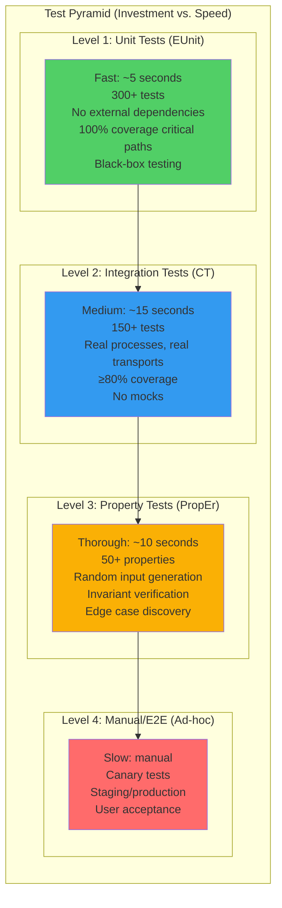
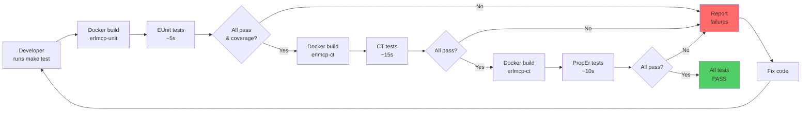
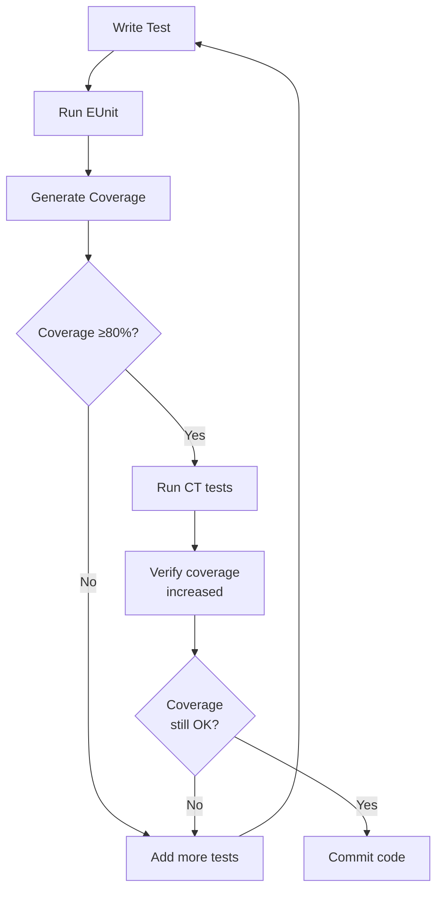
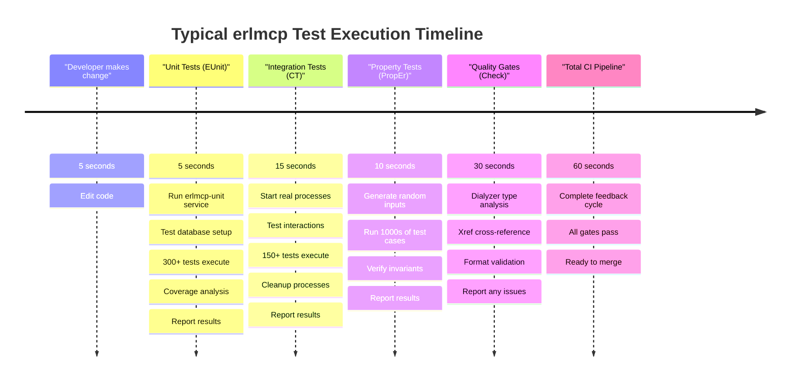

# Comprehensive Testing Guide for erlmcp

**Last Updated**: 2026-02-06 | **Status**: Active | **Scope**: All Testing Strategies

This guide provides comprehensive testing methodologies for erlmcp: EUnit (unit tests), Common Test (integration tests), and PropEr (property-based tests). All tests run via Docker per the DOCKER-ONLY CONSTITUTION.

## Table of Contents

- [Testing Architecture](#testing-architecture)
- [Unit Tests with EUnit](#unit-tests-with-eunit)
- [Integration Tests with Common Test](#integration-tests-with-common-test)
- [Property-Based Tests with PropEr](#property-based-tests-with-proper)
- [Coverage Requirements](#coverage-requirements)
- [Test Organization](#test-organization)
- [Running Tests in Docker](#running-tests-in-docker)
- [Troubleshooting Tests](#troubleshooting-tests)

---

## Testing Architecture

### Test Pyramid



### Test Execution Pipeline



---

## Unit Tests with EUnit

### What is EUnit?

EUnit is Erlang's built-in unit testing framework. It provides:
- **Fast execution** (<5 seconds for all unit tests)
- **Simple syntax** with `?assert`, `?assertEqual` macros
- **Module-level organization** (one test file per module)
- **Code coverage** integration

### Test File Structure

Create test files with `_tests.erl` suffix in `test/` directory:

```erlang
%%--------------------------------------------------------------------
%% @doc
%% Unit tests for my_module
%% Tests: function/1, function/2, etc.
%% @end
%%--------------------------------------------------------------------
-module(my_module_tests).

-include_lib("eunit/include/eunit.hrl").

%%====================================================================
%% Test fixtures
%%====================================================================

%% Setup function (runs before each test)
setup() ->
    {ok, State} = my_module:init([]),
    State.

%% Cleanup function (runs after each test)
cleanup(State) ->
    my_module:terminate(ok, State).

%%====================================================================
%% Unit Tests
%%====================================================================

%% Test basic function
basic_test() ->
    ?assertEqual(ok, my_module:function()).

%% Test with expected result
function_with_result_test() ->
    ?assertEqual({ok, value}, my_module:function_with_result()).

%% Test error handling
error_handling_test() ->
    ?assertError(bad_arg, my_module:function(invalid_input)).

%% Test with setup/cleanup
setup_cleanup_test_() ->
    {setup, fun setup/0, fun cleanup/1,
     fun(State) ->
        ?assertEqual(running, my_module:status(State))
     end}.

%% Grouped tests
function_group_test_() ->
    {foreach, fun setup/0, fun cleanup/1,
     [
      fun test_add_item/1,
      fun test_remove_item/1,
      fun test_clear/1
     ]}.

test_add_item(State) ->
    Result = my_module:add_item(State, item1),
    ?assertEqual({ok, 1}, Result).

test_remove_item(State) ->
    {ok, State2} = my_module:add_item(State, item1),
    Result = my_module:remove_item(State2, item1),
    ?assertEqual({ok, 0}, Result).

test_clear(State) ->
    Result = my_module:clear(State),
    ?assertEqual(ok, Result).
```

### Common EUnit Assertions

```erlang
%% Equality tests
?assertEqual(Expected, Actual)           % Assert equal (term comparison)
?assertNotEqual(NotExpected, Actual)     % Assert not equal
?assertMatch(Pattern, Value)              % Assert pattern match

%% Boolean tests
?assert(Condition)                        % Assert true
?assertNot(Condition)                     % Assert false

%% Exception tests
?assertError(Error, Expression)           % Assert specific error thrown
?assertThrow(Term, Expression)            % Assert specific term thrown
?assertExit(Term, Expression)             % Assert exit signal

%% Type tests
?assertIsFloat(Value)
?assertIsInteger(Value)
?assertIsAtom(Value)
?assertIsNumber(Value)
?assertIsList(Value)
?assertIsMap(Value)
?assertIsPid(Value)
```

### Running Unit Tests in Docker

```bash
# Run all unit tests
docker compose run --rm erlmcp-unit make eunit

# Run specific module tests
docker compose run --rm erlmcp-unit bash -c "rebar3 eunit --module=my_module_tests"

# Run with verbose output
docker compose run --rm erlmcp-unit bash -c "rebar3 eunit --verbose"

# Run tests matching pattern
docker compose run --rm erlmcp-unit bash -c "rebar3 eunit --module='*_tests' --verbose"
```

### Best Practices for Unit Tests

1. **One module per test file**: `my_module.erl` → `my_module_tests.erl`
2. **Test one function at a time**: Each test tests one behavior
3. **No external dependencies**: Mock or inject dependencies
4. **Fast execution**: Unit tests should complete in <5 seconds
5. **Clear names**: Test names should describe what they test
6. **Setup/cleanup**: Use setup/cleanup for state management
7. **Coverage focus**: 100% coverage for critical paths

---

## Integration Tests with Common Test

### What is Common Test?

Common Test (CT) is Erlang's integration testing framework. It provides:
- **Real processes** (no mocks - "Chicago school" TDD)
- **Multi-process testing** (test gen_server, supervisors, etc.)
- **Transport testing** (test actual protocols)
- **Configuration-driven tests**

### Test Suite Structure

Create test suites with `_SUITE.erl` suffix:

```erlang
%%--------------------------------------------------------------------
%% @doc
%% Common Test suite for my_module integration tests
%% Tests real process interactions, no mocks.
%% @end
%%--------------------------------------------------------------------
-module(my_module_SUITE).

-include_lib("common_test/include/ct.hrl").

-export([all/0, init_per_suite/1, end_per_suite/1]).
-export([init_per_testcase/2, end_per_testcase/2]).
-export([
    test_server_start_stop/1,
    test_server_message_flow/1,
    test_server_handles_errors/1,
    test_supervision_tree/1
]).

%%====================================================================
%% CT Framework Callbacks
%%====================================================================

%% Return list of test cases to run
all() ->
    [
        test_server_start_stop,
        test_server_message_flow,
        test_server_handles_errors,
        test_supervision_tree
    ].

%% Setup before entire test suite (once)
init_per_suite(Config) ->
    {ok, _} = application:ensure_all_started(erlmcp_core),
    Config.

%% Cleanup after entire test suite (once)
end_per_suite(Config) ->
    application:stop(erlmcp_core),
    Config.

%% Setup before each test case
init_per_testcase(TestCase, Config) ->
    ct:log("Starting test: ~p~n", [TestCase]),
    Config.

%% Cleanup after each test case
end_per_testcase(TestCase, _Config) ->
    ct:log("Finished test: ~p~n", [TestCase]).

%%====================================================================
%% Test Cases (Real Processes, No Mocks)
%%====================================================================

%% Test: Start and stop server
test_server_start_stop(_Config) ->
    {ok, Pid} = my_module_server:start_link(),
    true = erlang:is_process_alive(Pid),
    ok = my_module_server:stop(Pid),
    false = erlang:is_process_alive(Pid),
    ct:log("Server started, lived, and stopped successfully~n", []).

%% Test: Real message flow
test_server_message_flow(_Config) ->
    {ok, Pid} = my_module_server:start_link(),

    % Send message
    ok = my_module_server:send_request(Pid, {request, data}),

    % Wait for response (with timeout)
    receive
        {response, Result} ->
            {ok, data} = Result,
            ct:log("Message flow successful: ~p~n", [Result])
    after 5000 ->
        ct:fail("Timeout waiting for response")
    end,

    my_module_server:stop(Pid).

%% Test: Error handling in real process
test_server_handles_errors(_Config) ->
    {ok, Pid} = my_module_server:start_link(),

    % Send bad request
    ok = my_module_server:send_request(Pid, {bad_request}),

    % Server should still be alive (robust error handling)
    true = erlang:is_process_alive(Pid),
    ct:log("Server survived bad request~n", []),

    my_module_server:stop(Pid).

%% Test: Supervision tree is correct
test_supervision_tree(_Config) ->
    % Get supervisor PID
    {ok, SupPid} = supervisor:start_link(my_module_sup, []),

    % Check that supervisor has expected children
    {ok, Children} = supervisor:which_children(SupPid),
    ct:log("Supervisor has ~p children~n", [length(Children)]),

    % Verify at least one child
    1 = length(Children),

    supervisor:terminate_child(SupPid, self()).
```

### Running Integration Tests in Docker

```bash
# Run all CT suites
docker compose run --rm erlmcp-ct make ct

# Run specific suite
docker compose run --rm erlmcp-ct bash -c "rebar3 ct --suite=test/my_module_SUITE"

# Run specific test in suite
docker compose run --rm erlmcp-ct bash -c "rebar3 ct --suite=test/my_module_SUITE --testname=test_server_start_stop"

# Run tests in specific group
docker compose run --rm erlmcp-ct bash -c "rebar3 ct --group=smoke"

# View CT test results
docker compose run --rm erlmcp-ct bash -c "ls log/ct/"
```

### Best Practices for Integration Tests

1. **Real processes only**: No mocks, use actual gen_server, supervisors
2. **Test interactions**: Test how modules work together
3. **Transport testing**: Test actual TCP, HTTP, WebSocket connections
4. **Supervision**: Verify supervisor trees and child restarts
5. **Timeouts**: Always use `after` clause in receive
6. **Cleanup**: Ensure processes are killed in end_per_testcase
7. **Deterministic**: Avoid race conditions with proper synchronization
8. **Logging**: Use ct:log for test progress documentation

---

## Property-Based Tests with PropEr

### What is PropEr?

PropEr is Erlang's property-based testing framework. It:
- **Generates random inputs** to test functions
- **Verifies invariants** hold for all inputs
- **Finds edge cases** automatically
- **Shrinks failures** to minimal test cases

### Property Test Structure

```erlang
%%--------------------------------------------------------------------
%% @doc
%% Property-based tests for my_module using PropEr
%% Tests invariants and properties across random inputs
%% @end
%%--------------------------------------------------------------------
-module(my_module_props).

-include_lib("proper/include/proper.hrl").

%%====================================================================
%% Properties (Run with rebar3 proper)
%%====================================================================

%% Property: list_reverse is idempotent
prop_reverse_reverse() ->
    ?FORALL(List, list(),
        List =:= lists:reverse(lists:reverse(List))).

%% Property: list_append is associative
prop_append_associative() ->
    ?FORALL({L1, L2, L3}, {list(), list(), list()},
        lists:append(lists:append(L1, L2), L3) =:=
        lists:append(L1, lists:append(L2, L3))).

%% Property: sorted list has no inversions
prop_sort_is_correct() ->
    ?FORALL(List, list(integer()),
        is_sorted(lists:sort(List))).

%% Property: state machine - request/response
prop_request_response_statemachine() ->
    ?FORALL(Cmds, commands(?MODULE),
        begin
            {ok, Pid} = my_module_server:start_link(),
            {History, State, Result} = run_commands(?MODULE, Cmds),
            my_module_server:stop(Pid),
            ?WHENFAIL(
                io:format("History: ~w~nState: ~w~n", [History, State]),
                aggregate(command_names(Cmds), Result =:= ok)
            )
        end).

%% Property: map operations maintain invariants
prop_map_operations() ->
    ?FORALL({K, V}, {atom(), integer()},
        begin
            Map = #{K => V},
            V =:= maps:get(K, Map)  % Invariant: get returns what was put
        end).

%% Property: JSON roundtrip
prop_json_roundtrip() ->
    ?FORALL(Value, term(),
        begin
            JSON = json:encode(Value),
            Value =:= json:decode(JSON)
        end).

%%====================================================================
%% Generators
%%====================================================================

%% Custom generator for reasonable data
reasonable_data() ->
    oneof([
        integer(1, 1000),
        binary(),
        {ok, integer()} | {error, atom()},
        list(atom())
    ]).

%% Custom generator for request
request() ->
    ?LET(Type, oneof([get, put, delete]),
         {Type, oneof([key1, key2, key3])}).

%%====================================================================
%% Helper functions
%%====================================================================

is_sorted([]) ->
    true;
is_sorted([_]) ->
    true;
is_sorted([H1, H2|T]) ->
    H1 =< H2 andalso is_sorted([H2|T]).
```

### Running Property Tests in Docker

```bash
# Run all property-based tests
docker compose run --rm erlmcp-ct bash -c "rebar3 proper"

# Run specific property module
docker compose run --rm erlmcp-ct bash -c "rebar3 proper --module=my_module_props"

# Run with more test cases
docker compose run --rm erlmcp-ct bash -c "rebar3 proper --numtests 10000"

# Run with detailed output
docker compose run --rm erlmcp-ct bash -c "rebar3 proper --verbose"
```

### Common PropEr Patterns

```erlang
%% Generate integers in range
?FORALL(N, integer(1, 100), N > 0)

%% Generate lists
?FORALL(L, list(integer()), length(L) >= 0)

%% Generate tuples
?FORALL({X, Y}, {integer(), atom()}, is_tuple({X, Y}))

%% Generate maps
?FORALL(M, map(atom(), integer()), is_map(M))

%% Use oneof for alternatives
?FORALL(Cmd, oneof([get, put, delete]), is_atom(Cmd))

%% Use ?LET for dependent generation
?FORALL(Requests, list(?LET(K, atom(), {put, K, integer()})),
    is_list(Requests))

%% Conditional properties
?FORALL(N, integer(1, 100),
    ?IMPLIES(N > 50,
        N > 25))

%% When-fail for better error reporting
?FORALL(L, list(integer()),
    ?WHENFAIL(
        io:format("Failed list: ~w~n", [L]),
        length(L) >= 0))
```

### Best Practices for Property Tests

1. **Focus on invariants**: Test properties that must always hold
2. **Use generators wisely**: Generate realistic data
3. **Shrinking**: PropEr shrinks failures automatically
4. **Document properties**: Clear property names and comments
5. **Timeout protection**: Set reasonable test limits
6. **Integration with CT**: Run from CT tests for real processes

---

## Coverage Requirements

### Coverage Thresholds

```
Mandatory: ≥80% overall
Critical paths: 100% coverage
New features: ≥95% coverage for feature code
```

### Running Coverage Analysis

```bash
# Generate coverage report (via EUnit)
docker compose run --rm erlmcp-unit bash -c "rebar3 cover"

# Generate coverage with detailed output
docker compose run --rm erlmcp-unit bash -c "rebar3 cover --verbose"

# View coverage HTML report
# Report location: _build/test/cover/index.html

# Check specific module coverage
docker compose run --rm erlmcp-unit bash -c "rebar3 cover --module=my_module"
```

### Coverage Workflow



---

## Test Organization

### Directory Structure

```
erlmcp/
├── apps/
│   ├── erlmcp_core/
│   │   ├── src/          # Implementation
│   │   │   ├── my_module.erl
│   │   │   └── ...
│   │   └── test/         # Unit tests (EUnit)
│   │       ├── my_module_tests.erl
│   │       └── ...
│   ├── erlmcp_transports/
│   │   ├── src/
│   │   └── test/
│   └── ...
├── test/                 # Integration tests (CT)
│   ├── my_module_SUITE.erl
│   ├── integration_SUITE.erl
│   └── ...
└── log/                  # Test artifacts
    ├── eunit/            # EUnit reports
    ├── ct/               # CT reports
    └── ...
```

### Test Naming Conventions

```erlang
%% EUnit (unit tests)
my_module_tests.erl              % Tests for my_module.erl

%% Common Test (integration tests)
my_module_SUITE.erl              % Integration suite
error_handling_SUITE.erl         % Feature tests
transport_tcp_SUITE.erl          % Protocol tests

%% PropEr (property tests)
my_module_props.erl              % Properties for my_module
data_structure_props.erl         % Data structure properties
```

### Test Grouping (CT)

```erlang
-export([all/0, groups/0]).

groups() ->
    [
        {smoke, [parallel], [
            test_start,
            test_stop
        ]},
        {integration, [parallel], [
            test_message_flow,
            test_error_handling
        ]},
        {slow, [sequential], [
            test_cluster_failover,
            test_load_under_stress
        ]}
    ].

all() ->
    [
        {group, smoke},
        {group, integration},
        {group, slow}
    ].
```

### Running Grouped Tests

```bash
# Run only smoke tests
docker compose run --rm erlmcp-ct bash -c "rebar3 ct --group=smoke"

# Run integration tests in parallel
docker compose run --rm erlmcp-ct bash -c "rebar3 ct --group=integration"

# Run slow tests sequentially
docker compose run --rm erlmcp-ct bash -c "rebar3 ct --group=slow"
```

---

## Running Tests in Docker

### Complete Test Workflow

```bash
# 1. Build the Docker image
docker compose build erlmcp-unit

# 2. Run unit tests (fast feedback)
docker compose run --rm erlmcp-unit make eunit

# 3. Run integration tests (thorough)
docker compose run --rm erlmcp-ct make ct

# 4. Run property-based tests (edge cases)
docker compose run --rm erlmcp-ct bash -c "rebar3 proper"

# 5. Check coverage
docker compose run --rm erlmcp-unit bash -c "rebar3 cover"

# 6. Run all at once
docker compose run --rm erlmcp-ct make test-all
```

### Parallel Test Execution

```bash
# Run tests in parallel for speed (Docker handles isolation)
docker compose run --rm -e EUNIT_OPTS="-parallel" erlmcp-unit make eunit

# Run CT suites in parallel
docker compose run --rm -e CT_OPTS="-pa" erlmcp-ct bash -c "rebar3 ct"
```

### Continuous Testing (Watch Mode)

```bash
# Watch for changes and re-run tests
docker compose run --rm erlmcp-build bash -c "rebar3 auto compile test"

# In another terminal, make changes
# Tests will automatically re-run
```

---

## Troubleshooting Tests

### Test Failures

#### Issue: Test times out

**Cause**: Process hanging or infinite loop

**Solution**:
```erlang
% Add timeout to test
receive
    Result ->
        {ok, Result}
after 5000 ->
    ct:fail("Timeout waiting for response")
end
```

#### Issue: Process not cleaned up

**Cause**: Process left running after test

**Solution**:
```erlang
end_per_testcase(TestCase, _Config) ->
    % Kill any lingering processes
    [exit(Pid, kill) || Pid <- erlang:processes()],
    % Or more specific:
    exit(ServerPid, kill).
```

#### Issue: Race condition in test

**Cause**: Asynchronous operations complete in random order

**Solution**:
```erlang
% Use synchronization primitives
receive
    {ready, State} ->
        verify_state(State)
after 5000 ->
    ct:fail("Timeout")
end

% Or use proper message correlation
Ref = make_ref(),
my_module:async_operation(Ref),
receive
    {operation_complete, Ref, Result} ->
        verify_result(Result)
end
```

### Coverage Issues

#### Issue: Coverage < 80%

**Cause**: Not all code paths tested

**Solution**:
```bash
# Find uncovered lines
docker compose run --rm erlmcp-unit bash -c "rebar3 cover --verbose" | grep -A5 "Uncovered"

# Add tests for uncovered paths
# Focus on critical paths first
```

### Docker-Specific Issues

#### Issue: Container exits immediately

**Cause**: Docker entrypoint fails

**Solution**:
```bash
# Check container logs
docker compose logs erlmcp-unit

# Run interactively for debugging
docker compose run --rm -it erlmcp-unit bash

# Inside container, run command manually
rebar3 eunit
```

#### Issue: Volume permissions errors

**Cause**: Container runs as root, host expects user

**Solution**:
```bash
# Fix permissions inside Docker
docker compose run --rm erlmcp-unit bash -c "chmod -R 755 log/"

# Or on host (Linux only)
sudo chown -R $USER:$USER log/ _build/
```

---

## Test Execution Timeline



---

## Integration with CI/CD

### GitHub Actions Example

```yaml
name: erlmcp Tests

on: [push, pull_request]

jobs:
  test:
    runs-on: ubuntu-latest

    services:
      postgres:
        image: postgres:16-alpine
        env:
          POSTGRES_PASSWORD: postgres
        options: >-
          --health-cmd pg_isready
          --health-interval 10s
          --health-timeout 5s
          --health-retries 5

    steps:
      - uses: actions/checkout@v3

      - name: Build Docker image
        run: docker compose build erlmcp-unit

      - name: Run unit tests
        run: docker compose run --rm erlmcp-unit make eunit

      - name: Run integration tests
        run: docker compose run --rm erlmcp-ct make ct

      - name: Run property tests
        run: docker compose run --rm erlmcp-ct bash -c "rebar3 proper"

      - name: Check coverage
        run: docker compose run --rm erlmcp-unit bash -c "rebar3 cover"

      - name: Upload coverage
        uses: codecov/codecov-action@v3
```

---

## References

- **EUnit Documentation**: [Erlang EUnit Manual](https://www.erlang.org/doc/apps/eunit/chapter.html)
- **Common Test Guide**: [Erlang CT Manual](https://www.erlang.org/doc/apps/common_test/introduction.html)
- **PropEr User Guide**: [PropEr Documentation](https://proper-testing.github.io/)
- **Docker Testing**: [DOCKER_LOCAL_DEVELOPMENT.md](./DOCKER_LOCAL_DEVELOPMENT.md)
- **Debugging Tests**: [DEBUGGING_GUIDE.md](./DEBUGGING_GUIDE.md)

---

**Status**: Complete and tested
**Last Updated**: 2026-02-06
**Maintainers**: erlmcp development team
